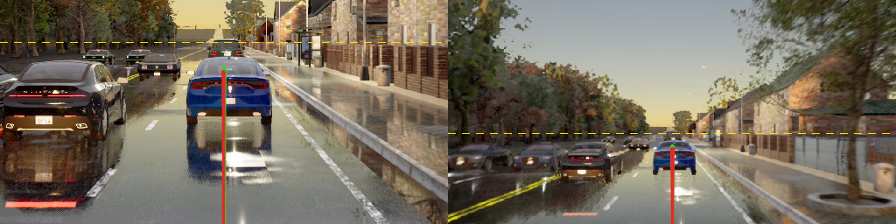

# B2D P2 training cache (b2dc-train@v2), built 2026-10-07

Cache of the collected PDM-Lite dataset (experiments/b2d_collect, decision 152) in the format `pp_train.py` consumes; native 20 Hz, 0.2 s frame pairs, no warp
or interpolation. Built by `scripts/b2d_prep.py` (plan -> 3 pool jobs -> finish), checked by `scripts/b2d_validate.py` and `scripts/b2d_trainer_check.py`.
Nothing was trained.

Location: `$DATA_DIR/runs/op_parity/cache/b2d_v2/` (26 GB; `b2d_v2L20/` is the same cache with the route command re-cut at 20 m, symlinks + its own tab.npz).

| File | Content |
|---|---|
| `ticks.npy` (383 089, 32, 512) fp16, 12.6 GB | frozen Cinque `view_39` tokens of the pair (frame t-4, frame t) at every even tick t >= 4 of every clip |
| `front_idx.npy` (383 089, 8) | row -> its 8 context slots (t0-28 .. t0, step 4 ticks = 0.2 s) as indices into ticks.npy; `front.npy` row = `ticks[front_idx[row]]`, never materialised (a front.npy would be 98 GB) |
| `tab.npz` | pp_prep tab: names `<route>_<t0>`, log = route id, ego (20), pose / vel / acc (4 history), cmd, fut (8 poses at 0.5 .. 4 s), cam (1.59, 0, 1.86), lht False, speed |
| `teacher.npz` 2.4 GB | shipped Cinque on the same 8 slots: out (1086), plan (33, 15), di, pi |
| `hinge_labels.npz` 9.4 GB | drivable SDF at t0 (128 x 96, op_probe grid), all rows labelled; use with the MKZ footprint |
| `extra.npz` | route, type, town, tick, `clamped`, turn_side, **turn_next / turn_dist (raw distance to the next LEFT / RIGHT junction option)**, act_kappa / act_accel (PDM-Lite action at t0 + 0.2 s), ctl, target_speed, progress |

## Rules

- **Rows**: every even tick t0 >= 4 with a complete 4 s logged future (SDF labels exist at even ticks): 383 089 rows from 998 clips (train 366 832 / val 16 257 rows).
  Slots before tick 4 repeat tick 4 (13 951 rows with t0 < 32, flag `clamped`; the car stands at the spawn).
- **Collision rule** (33 clips with a leaderboard collision): the collision tick is the first tick within 1 m of the closest approach to the event's logged location
  (all 33 located, closest approach 0.0 m); rows keep `t0 <= t_col - 5 s` (the 4 s label window plus 1 s of pre-impact braking). The 33 clips keep 8 445 of their
  36 132 even ticks (the rest are the pre-collision window, the collision and what follows).
- **Hinge**: `lib/drivable_hinge.Hinge(..., footprint="mkz")` (front 3.829, rear -1.064, half width 0.918 m, the footprint the SDFs were made with); `Hinge` also takes lists of label files
  and footprints (one per source: NAVSIM Pacifica + B2D MKZ in one run). The default (one file, Pacifica) is bit-identical to before (checked).
- **Split**: `b2d/b2dc-v2-train` (943 routes) / `b2d/b2dc-v2-val` (55 routes, 30 of them junction-turn routes: 17 left, 13 right), by route, val = max(1, round(5% n)) per scenario type
  (`scripts/b2d_split.py`); disjoint from bench2drive220 and 0.0.4-val.
- **Route command**: cached at the collected 30 m lookahead; raw `turn_next` / `turn_dist` kept, `b2d_prep.py recmd --lookahead L` writes `b2d_v2L<L>`.

## Content notes (for the lookahead and sampling choices)

- 48% of rows are at < 0.5 m/s (queues, lights, spawn waits); logged 4 s heading change < 5 deg 82%, 5-20 deg 7.1%, 20-45 deg 3.1%, > 45 deg 7.5%.
- Route command at 30 m: left 25.1%, right 25.5% of rows (navtrain: 36.6% turn). Precision of the turn command (logged 4 s heading change > 20 deg) / recall:
  navtrain 0.71 / 0.95 (moving 0.73 / 0.95); B2D moving rows, L = 10 m 0.74 / 0.63, 15 m 0.63 / 0.73, 20 m 0.56 / 0.81, 30 m 0.41 / 0.84, 40 m 0.36 / 0.85; on all rows (standing included) 30 m: 0.18 / 0.87.

## Validation (`b2d_cache/validate.json`)

| Check | Result |
|---|---|
| token RMS (mean per-token RMS over 32 x 512; 4000 random tokens each) | B2D 1.524 (p5 1.18, p95 1.94) vs navtrain W 1.698, G 1.680, navtrain_full s0 W 1.696, navtest W 1.716: ratio 0.888-0.907 (expected range 0.8-1.25); per-channel RMS profile correlation 0.970-0.979. CARLA night / fog / rain frames are darker and lower contrast, the profile is the same |
| tokens recomputed from the video (8 val rows, fresh full-clip decode, batch 3 instead of 128) | max abs difference 0.0195, mean 0.0008 (0.08% of the mean token magnitude): fp16 batch noise |
| P2-F-s0 on the collection check's rows (20 000 of its 20 948 rows are in the cache; the rest were cut by the collision rule) | turn-direction agreement (|logged 4 s heading| > 20 deg, moving, 2 528 rows) 0.8647 from the cache vs 0.8647 from the replayed video, `check.json` 0.8634 (all 2 621 rows); P0 0.687 vs 0.688 (3 sign flips); per-row ADE difference median 0.001 m, p99 0.012 m |
| P2-F-s0 on 500 random val turn rows (of 1 764 candidates, 55 val routes) | turn-direction 0.840 (binomial s.e. 0.016), P0 0.728; ADE on those rows 7.7 m (P0 8.1 m); 500 random val rows: P2 ADE 4.03 m |
| trainer dry read (`b2d_trainer_check.py`, no optimizer step): navtrain_full s0 + b2d_v2 in `--host` mode, route / token split, mixed hinge, forward + loss + backward | rows 391 697 (B2D 383 089), batch B2D share 0.55 at `--b2d-mass 0.5`, hinge coverage 1.0 (NAVSIM 8 608 rows, B2D 383 089), loss finite, batch gather 14 ms per 128 rows, 32 GB VRAM |

Three decoded samples with the logged future (green) and the cached P2 plan (red), road | wide:
[panel_0_920360_00184.png](../figs/panel_0_920360_00184.png) (rain, stop sign ahead, the car at a queue),
[panel_1_920639_01480.png](../figs/panel_1_920639_01480.png) (wet road, queue, plan along the lane),
[panel_2_920639_01144.png](../figs/panel_2_920639_01144.png) (same route, earlier). Look for: the horizon line (dashed) on the real horizon, the future paths starting at
the bumper and pointing along the lane, wide frame aligned with the road frame.

## Cost

plan stage (CPU, 48 workers) 34 s; tokens: 3 pool jobs of 6 threads, 300-400 pairs/s each (video decode bound), 383 k pairs + teacher in 9 min wall; finish 20 s; validation 1.5 min.
Disk 26 GB (hinge labels 9.4, tokens 12.6, teacher 2.4, rest 1.5).
