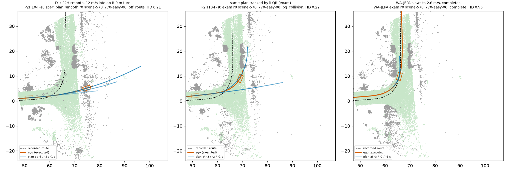
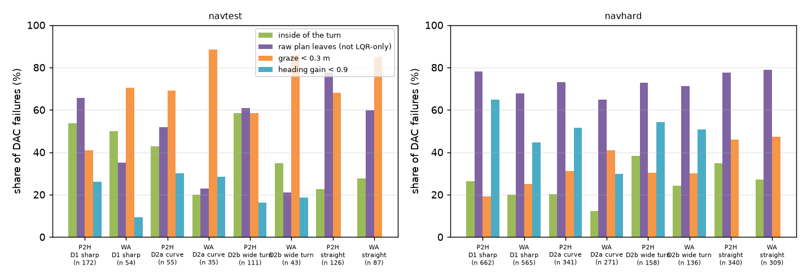
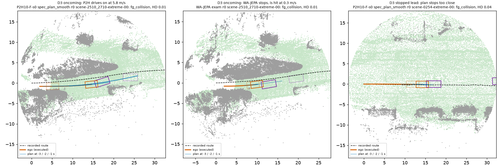

# Four directions on the HUGSIM + NAVSIM tier: collisions are the board, turns are corner cuts and late cues, wide-turn grazes are margin, night is absent

Written 2026-10-07. Driver **P2H** = op_parity P2 + drivable SDF hinge (P2H10-F-s0 / s1, decision 148); HUGSIM lateral path `spec_plan_smooth`
(decision 149); navtest W frames, navhard two-stage G frames. Reference WA-JEPA (navtest 91.71, navhard 35.41, HUGSIM 64 exam 0.451). CPU only,
stored runs, no new driving. Per-board details: [four_dirs/hugsim.md](four_dirs/hugsim.md) (+ [hugsim_tables.md](four_dirs/hugsim_tables.md)),
[four_dirs/navsim.md](four_dirs/navsim.md), [four_dirs/night.md](four_dirs/night.md); the sharp-turn training pilot: [turn_train.md](turn_train.md).
**Scope: diagnosis only, no training.** This lane trained nothing and ran no HUGSIM. The turn-train pre-registration was not launched by this lane:
its 8 pilot checkpoints (HP / T1P / T2P / T3P x 2 seeds) had already been trained on 2026-10-06 21:08-21:20 by the earlier turn-train chain, which
stopped before scoring; this lane only resumed that chain at its navtest scoring stage (CPU devkit jobs through the pool, 0 GB VRAM, finished
10:58), the pre-registered gate failed, so its HUGSIM stage never ran. Nothing was left to cancel; that read is reported in
[turn_train.md](turn_train.md) and turn training stays a proposal in the fix list below.
Code `scripts/fd_hugsim.py`, `fd_navsim.py`, `fd_night.py`, `fd_entry.py`; bucket rules were fixed before any score was read and are stated in each per-board doc.

**Sizes.** Replacement oracles, one bucket at a time, recomputed for P2H: **(a)** the bucket's failing units take WA-JEPA's score (navtest / navhard
token scores, HUGSIM scenario HD; one-sided), **(b)** they take the reference (navtest human, navhard PDM-Closed, never-worse clip as
[loss_budget.md](../../leaderboard_audit/results/loss_budget.md); HUGSIM: best HD over 20 stored arm x preset sets, picked after the fact),
**(c)** navtest / navhard: exact Shapley share of the WA - P2H per-token gap inside the bucket (as [gap/index.html](gap/index.html)); HUGSIM: HD
set to 1.0. Units: navtest / navhard EPDMS points, HUGSIM HD x 100 on 64 scenarios. 95% CIs: cluster bootstrap over logs (navtest), the stage-1
log of the group (navhard), scenarios (HUGSIM), B 10 000. Buckets overlap only slightly (navtest D1 & D3 14 tokens, D2 & D3 18; HUGSIM none).

Board gaps WA - P2H: navtest **3.04** [2.32, 3.74]; navhard +3.57 [-0.21, +7.57] (stage 1 7.17, stage 2 0.49); HUGSIM 64 **+1.9** HD x 100
[-5.4, +9.8] (P2H 0.432 vs 0.451; not significant). The three driving directions hold 2.27 [1.76, 2.77] of the navtest gap (Shapley: DAC 1.47,
NC 0.60, TTC 0.17).

## Direction 1: sharp turns ("the car does not make it around")

| | navtest | navhard (combined) | HUGSIM 64 |
|---|---|---|---|
| bucket | logged path R < 15 m, DAC < 1: P2H 10.4% vs WA 3.3% of 1 653 | PDM path R < 15 m, DAC < 1: 36% vs 31% of 1 819 | bg / off_route with route R < 15 m: 5 scenarios (10 of 128 arm-scenario cells), all turn23 |
| size (a) WA / (b) ref / (c) | **1.04 [0.73, 1.37]** / 1.28 / 0.87 [0.53, 1.22] | 3.46 [2.04, 5.06] / 7.48 / stage 2 0.97 | **2.7 [0.2, 6.2]** / 1.3 [0.0, 3.5] / 5.5 [1.2, 10.6] |
| WA-JEPA fails the same units | 17% [11, 25] (P2H-specific) | 74% [69, 79] (shared) | 2 of 5 scenarios |
| main mechanism, share [CI] | **inside corner cut 54% [42, 65]** (front corner, t 3.4 s, 0.40 m deep, in the raw plan 66% [56, 75]); "does not make it around" (outside, heading gain < 0.9) only **26% [18, 34]**, 0.23 points | outside + short of the reference heading 52% [45, 59], early (1.7 s), deep (1.1 m): the displaced stage-2 start (decision 112), WA alike | **fast entry 0.80 [0.40, 1.00]**: median 9.8 m/s into R 8.9 m (needs 9.8 m/s^2); WA-JEPA enters the same corners at 2.6-2.8 m/s. Outside 0.93; plan under-curved (peak 0.51 x need) and off-road 0.80 |
| plan vs execution | failing plans turn as much as the log (gain 1.04), keep its speed (1.01), end 0.17 m inside | plan 21% slower than PDM | request / clip / execution follow the plan (0.030 / 0.028 vs plan 0.027 1/m); exam and spec fail the same 5: **plan wrong, not the conversion**; the clip bites only in the fast entries |
| representation share | 58% [51, 65] of failures are already failed by a hinge decoder on the frozen Cinque vision tokens (WA's encoder decoder passes 65%) | not measured | WA-JEPA slows 26 m before the turn on the same command; P2H keeps accelerating until HUGSIM's turn command flips, 2.5-6.6 m before the turn |

**Reading.** The user's picture (understeer, does not make it around) is real on HUGSIM but small (5 scenarios, 4 KITTI-360 junctions) and it is a
speed problem, not a steering one: P2H arrives 3-5 x too fast because its plan does not slow for a junction it has not been told about, and at
that speed no plan or controller turns R 9 m. On real logs the same model plans the logged speed into sharp turns (navtest > 45 deg, planned 2 s /
4 s distance over logged 0.997 [0.992, 1.003] / 0.986 [0.978, 0.994], also at v0 > 6 m/s; braking approaches from v0 > 6 m/s: 1.039 [1.006, 1.076],
WA 1.025; [entry_speed_navtest.csv](four_dirs/entry_speed_navtest.csv), [entry_speed_braking_navtest.csv](four_dirs/entry_speed_braking_navtest.csv)),
so the HUGSIM fast entry does not reproduce on navtest. The command is late in the logs too: the navtest command switches from straight to
left / right at the token where the > 45 deg turn is already inside the 4 s horizon (37 switch events: median 0 s, p90 1.0 s / 7 m before that
token; [command_lead_navtest.csv](four_dirs/command_lead_navtest.csv)), at a logged speed of 7.1 m/s (median) that the human had already brought
down; HUGSIM's 12-13 m/s entries have no human slowing in the ego history. So in the logs the slowing before a junction reaches the plan through the
ego history (and vision), on HUGSIM only through vision, where WA-JEPA, with the same command and ego inputs, slows 26 m out and P2H does not.
On navtest, where the gap is P2H-specific, the sharp-turn failure is a corner cut on the
inside late in the horizon, and more than half of it is decided at the frozen vision features. Turn-balanced training does not move it
([turn_train.md](turn_train.md): > 45 deg DAC failures -0.03 pp, closure of the > 20 deg gap 0.01-0.02).

**Where the fix lives.** navtest: representation (~58%) + head objective (inside cuts the 8-raw-pose hinge misses, ~40%); not training
distribution (turn-train), not turning gain (turn-gain.md 0.94). HUGSIM: the speed plan's anticipation of junctions, i.e. perception of the junction
before the command (representation) or a command timing that differs between NAVSIM training and HUGSIM (interface); not the lateral conversion.

*scene-570_770-easy-00: P2H's plans point straight across the junction until 1 s before the end; exam tracks the same late plan into the far kerb;
WA-JEPA arrives slowly and follows the route.*

## Direction 2: wide turns, grazing the road edge

| | navtest | navhard (combined) | HUGSIM 64 |
|---|---|---|---|
| bucket | turning, R >= 15 m, DAC < 1: 5.2% vs 2.4% of 3 189 | 29% vs 23% of 1 753 | bg with route R 15-50 m: 2 scenarios |
| size (a) / (b) / (c) | **1.00 [0.73, 1.30]** / 1.27 / 0.66 [0.40, 0.96] (curve 8-20 deg 0.35, wide turn 0.65) | 4.22 [2.54, 6.26] / 6.75 / stage 2 0.59 | 1.0 [0.0, 3.1] / 1.4 [0.0, 4.0] / 2.7 [0.0, 6.9] |
| WA fails the same units | 20% [13, 28] | 65% [58, 70] | 1 of 2 |
| mechanism, share [CI] | **graze < 0.3 m 62% [55, 69]** (median 0.21 m); **LQR replay only 42% [34, 51]** (raw plan inside); inside of the turn 53% [41, 64] (WA 28%); heading and speed match the log | outside 74%, deep 0.57 m, early 1.6 s: stage-2 start, shared | outside, slow entry (3.7 m/s), executed curvature 2.2 x need, turn-in 0.75 s after the route: **no early turn-in from the 0.5-1.5 s window**; one sub-metre lane offset against one object |
| representation share | 46% [38, 55] (WA's encoder decoder passes 76%) | | |

**Reading.** On navtest, wide-turn edge failures are lateral placement and footprint margin: shallow, often only in the devkit's tracker replay,
more on the inside than WA's; not turning rate. The suspected smoothing-window effect (turning in early, cutting the inside) is not there in
HUGSIM (turn-in is late, not early, and contacts are on the outside); on HUGSIM this direction is two scenarios and not systematic.

**Where the fix lives.** Head objective / loss with tracker-aware geometry (the hinge sees the 8 raw poses, not the replayed footprint), plus
~46% representation. Nothing on HUGSIM.

*Raw-plan departures vs replay-only, grazes, inside vs outside, per bucket: on navtest P2H has more raw-plan departures and inside departures than
WA in every bucket; on navhard the two look alike.*

## Direction 3: hitting other vehicles

| | navtest | navhard (combined) | HUGSIM 64 |
|---|---|---|---|
| bucket | NC < 1 or TTC < 1: 266 vs 142 tokens (2.2% vs 1.2%) | 15.1% vs 14.9% | fg_collision: 31 scenarios (60 of 128 cells) |
| size (a) / (b) / (c) | **1.16 [0.88, 1.44]** / 1.68 / 0.87 [0.56, 1.17] (NC 0.60, TTC 0.17) | 2.56 [1.29, 4.11] / 6.29 / stage 2 0.81 | **5.0 [0.4, 10.5]** / 8.6 [4.0, 14.2] / **42.8 [31.6, 53.9]** |
| WA fails the same units | **30% [23, 36]** (P2H-specific) | 81% [77, 84] (shared) | 24 of 31 scenarios |
| types | **stopped vehicle ahead 36% [30, 43]** (0.50 pts; 64% of them on turning tokens), static object 17%, moving lead 14% (plans 1.34 x log speed), cut-in 11%, crossing / oncoming / VRU ~19% (0.23 pts together) | same mix as WA | runs: oncoming 105, crossing 12, **stopped lead 45**, slower lead 11, rear-ended 6, cut-in 0. D3a oncoming / crossing 21 scenarios: (a) 1.3 [-1.2, 5.1], (c) 28.4; **D3b stopped / slower lead 10 scenarios: (a) 3.8 [0.2, 8.5]**, (b) 3.5, (c) 13.0 |
| mechanism, share [CI] | **plan > 1.1 x logged speed in 49% [39, 58]** of collision plans (base rate 13%); that subset 0.61 [0.40, 0.82] points | over-speed 61% (WA 64%) | D3a: scripted head-on actors at 2-4 m/s; plan rarely slows (0.20 [0.06, 0.38]); WA-JEPA plans a stop in 74% and is hit anyway (5 of 19 standing). D3b: lead seen 0.93, plan slows 0.67 but plans stay clear of the stopped car in only 0.13 [0.00, 0.40]; **lead distance read +1.95 m [1.66, 2.47] too far below 3 m**; stop planned but not executed 0.31 [0.06, 0.60] (all fg: 0.15 [0.05, 0.27]) |

**Reading.** On HUGSIM collisions are the board (43 of the 57 lost HD x 100), but two thirds of that is scripted oncoming traffic that a
stop-only policy cannot avoid (WA-JEPA fails the same scenes); the reachable part is the stopped / slower lead (3.5-3.8), where P2H plans its
standstill against a lead it believes is 2 m further away. On navtest the collision gap is P2H-specific: plans faster than the log into
stopped or slower vehicles, many at corners. In both boards the contact is mostly already in the plan, not a longitudinal-tracking failure.

**Where the fix lives.** Training loss (no agent term in the P2H loss; the plan's speed toward agents is pure imitation) for navtest and HUGSIM
D3b; near-range lead distance (representation) properly, an execution-layer standstill margin as a stopgap; HUGSIM D3a in the model's evasion /
timing, mostly out of reach.

*Left / middle: scene-2510_2710-extreme-00, P2H's plans run into the oncoming actor's path, WA-JEPA stops 3 m earlier and is hit anyway. Right:
scene-0254-extreme-00, the plan's end point is inside the stopped car.* Collision types on navtest / navhard: [nav_collision_types.png](four_dirs/figs/nav_collision_types.png).

## Direction 4: night / low light

| | navtest | navhard | HUGSIM 64 |
|---|---|---|---|
| night units (front-camera luma < 50, median per log / scenario, decision 131 rule) | **0 of 136 logs** (lowest 56.7) | **0 of 76 stage-1 logs** (55.8) | **0 of 64** (65.0) |
| size | 0.00 | 0.00 | 0.00 |

Cut 35 and 50 give no unit on any board; cut 65 picks one dim daytime log or scenario per board (sizes <= 0.1, CIs include 0). The contact sheet of
the darkest logs shows daytime shade and overcast ([night_sheet.jpg](four_dirs/figs/night_sheet.jpg)); 57-58 navtest tokens (0.5%) dip below 50
in underpasses. A darkness proxy (darkest 10% / 25% of clusters vs the rest) shows no darkness-specific deficit on navtest (gap difference -0.06
[-2.45, +2.34]). **There is no night in this tier. Move direction 4 to the WOD tier**, where decision 131 measured +0.43 m ADE@3s at night on
28% night sequences.

## Ranked fix list

Gains are estimates bounded by the oracles above; the prior for a loss-side fix is the drivable hinge, which realised 20% of its DAC gap
(0.50 of 2.53 pp, decision 148).

| # | fix | lives in | targets | estimated gain | cost | deciding experiment |
|---|---|---|---|---|---|---|
| 1 | **Agent-occupancy / time-to-contact hinge** on the plan footprint against logged agent boxes (stopped / leading vehicles, inflated front box), in the P2H fine-tune | training loss | navtest D3 (stopped vehicle, lead, over-speed: 1.16), navhard D3 (2.56), HUGSIM D3b (plans that end inside the stopped car: 3.8) | navtest +0.25 to +0.4, navhard +0.3 to +0.8, HUGSIM D3b +1 to +2 | labels ~minutes CPU; pilot 2 x ~10 min GPU, full 2 x 30-60 min | [plans/2026-10-07-agent-hinge-prereg.md](../plans/2026-10-07-agent-hinge-prereg.md): pilot seed 0 full navtest, gate NC + TTC failures -0.3 pp and EPDMS >= +0.2 with EP >= -0.2; then HUGSIM D3b set |
| 2 | **Replay-aware drivable hinge with a front-corner turn margin** (hinge on a differentiable tracker proxy of the devkit LQR footprint, densified poses, margin 0.5 m on front corners when the logged turn > 20 deg) | training loss (+ execution / scorer geometry) | navtest inside corner cuts (D1 0.60, D2 0.62) and replay-only grazes (0.38): ceiling ~1.3 | navtest +0.2 to +0.35; HUGSIM ~0 (its D1 is speed, D2 two scenarios) | tracker proxy ~0.5 day CPU; offline decoder gate CPU; then 2 x pilot training | [plans/2026-10-07-replay-hinge-prereg.md](../plans/2026-10-07-replay-hinge-prereg.md): offline thin-decoder gate first (turning-token DAC failures -0.4 pp vs the current hinge), then a pilot |
| 3 | **Lead standstill margin** in the plan's speed profile: when the lead head sees a vehicle (lead_prob > 0.5), cap plan speed so the stop point is >= 2.5 m short of lead_x - 2 m (the measured near-range bias); one rule on both boards | execution layer (plan post-processing) | HUGSIM D3b (3.5-3.8); navtest stopped vehicle ahead (0.50) | HUGSIM about +2; navtest unknown, may cost EP | CPU replay; then 5 HUGSIM scenarios + navtest bench (GPU, review first) | [plans/2026-10-07-lead-margin-prereg.md](../plans/2026-10-07-lead-margin-prereg.md): CPU replay on the stored D3b traces, gate >= 3 of 5 contacts gone without new stuck runs, navtest EPDMS >= -0.2 |
| 4 | **Representation for corners and near-range agents**: encoder unfreeze with a dense drivable-SDF auxiliary head, or V-JEPA / WA-JEPA front tokens as adapter memory (the trade test of decision 147) | representation | the ~46-58% of D1 / D2 navtest failures decided at the frozen encoder (ceiling ~1.1), the HUGSIM junction anticipation, the lead distance bias | navtest +0.3 to +0.6 | days | encoder-level decoder failure rate on sharp turns must move toward WA's level in a 17 k-token pilot before any closed-loop read; not drafted here (needs a design review) |
| 4b | **Turn training at full scale** (turn-balanced sampling / anchor off on turns, plans/2026-10-06-turn-train-prereg.md), proposal only | training data | navtest > 20 deg DAC gap | low: the existing pilot checkpoints read closure 0.01-0.02 of the > 20 deg gap ([turn_train.md](turn_train.md)) | full fine-tune 2 x 30-60 min | not proposed for launch unless fix 2 or 4 changes the picture |
| 5 | navhard stage-2 start states (on-policy / recovery data, factor_wm) | data | navhard D1-D3, shared with WA (65-81%) | not P2H-specific | existing factor_wm lane | decision 145 / 146 lane, not this one |

Dropped, with the reason: a turning-gain or lateral
conversion fix (D1 "not around" 0.23 navtest; HUGSIM request follows the plan); a corner-speed (lateral-acceleration) loss (P2H already plans the
logged speed into sharp turns on navtest; the HUGSIM fast entry is a missing cue, not a learned over-speed; revisit only if fix 4 or a command-timing
check says otherwise); HUGSIM wide-turn and smoothing-window changes (2 scenarios, turn-in late not early); HUGSIM oncoming actors (first a CPU
counterfactual: if < 1/3 of contacts are avoidable by a feasible stop or <= 1.5 m shift, report them as unavoidable for stop-only policies);
night (no night units; WOD tier).

## Open issues

- HUGSIM D1 rests on 5 scenarios (4 KITTI-360 junctions + 1 nuScenes) and D2 on 2; per-scenario differences below ~0.2 HD are not evidence, and the
  (b) oracle picks the best arm per scenario after the fact (timing-sensitive collisions make several D3 (b) values optimistic).
- HUGSIM D1 hypothesis (P2H's junction slowing rides on the logged ego history, not on vision): tested on navtest in
  [ego_history_probe.md](ego_history_probe.md) (2026-10-07), **not supported**: replacing the ego history with a constant-speed one does not raise P2H's planned
  4 s distance on sharp-turn approach tokens (+0.13 m [-0.35, +0.56]; WA-JEPA +0.04) and P2H's history sensitivity (through the t0 acceleration input, 1.4-2.1 x
  WA-JEPA's) is the same on matched straights. The HUGSIM half (closed-loop ax feed) stays untested.
- The decision-147 split uses op_probe decoders trained on P2, not P2H, features (identical frozen vision tokens).
- navhard "sharp / wide" geometry is the PDM-Closed path from the displaced stage-2 start.
- WA-JEPA: one HUGSIM run per scenario, its own client; its plan readings use HUGSIM's stored 0.5-2.5 s plan.
