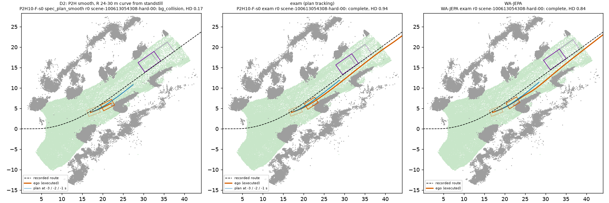
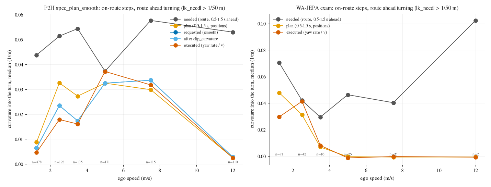

# Four directions on HUGSIM 64: P2H `spec_plan_smooth` fails on vehicles (43 of 64 HD x 100 lost), not on turns or road edges (8)

Written 2026-10-07. Driver: P2H (P2H10-F-s0 / s1) under `spec_plan_smooth`, three runs each (r0 stored op_parity run, rr1, rr2;
decision 149 point 5: HUGSIM is close to deterministic, 127 of 128 (arm, scenario) labels are the same over the repeats). Reference:
WA-JEPA exam (one run). Contrast: P2H10 `spec` and `exam` (r0). Script [`scripts/fd_hugsim.py`](../../scripts/fd_hugsim.py)
(`extract` on the box from the stored runs, `report`, `bev`); all tables in [hugsim_tables.md](hugsim_tables.md). No new HUGSIM runs.

**Bucket rule (fixed before reading any score; full text in the script docstring).** Unit = run; label per (arm, scenario) = modal
label over the 3 repeats. Event = HUGSIM's own end: `bg_collision` (> 100 background points in the ego box), `off_route` (> 10 m from
the recorded camera track), `fg_collision` (ego box intersects an actor box). Onset of a route departure = last step with lateral
distance to the route < 1.5 m. Route curvature k_r(s) = heading change over +-4 m of the recorded route; window [onset - 10 m,
onset + 20 m]; R = 1 / max |k_r|. D1 sharp = (bg or off_route) and R < 15 m; D2 wide = (bg or off_route) and 15 <= R < 50 m;
S straight = (bg or off_route) and R >= 50 m; D3 = fg, sub-typed by the hit actor's relative heading (oncoming |dh| >= 150 deg,
crossing 60-150), position (rear-ended: actor behind the ego centre), lateral motion (cut-in: >= 1 m towards the ego in 3 s) and speed
(lead stopped < 0.5 m/s / lead moving). Geometry is all HUGSIM's: ego and actor boxes per frame (`data.pkl`, `infos.pkl`), recorded
route, `ground.ply` (drivable ground; DAC cell rule) and `scene.ply` (background points). Two definition refinements after the first
read, disclosed, no score involved: a frontal background contact (contact centroid within 0.3 m of the ego axis) takes the side of the
ego's route deviation, and "crossing" was split into oncoming / crossing.

## Result

P2H HD 0.432, WA-JEPA 0.451, gap WA - P2H +0.019 [-0.054, +0.098] (all 64; turning 23: 0.350 vs 0.442). The gap is not significant,
so "share of the gap" ratios have CIs of several times the gap (listed in [hugsim_buckets.csv](hugsim_buckets.csv)); read the oracle
columns in HD points instead. Oracles in HD x 100 on 64 scenarios, scenario bootstrap B 10000 (per-scenario effect averaged over the two
arms); (b) = best HD per scenario over 20 stored (arm, preset) sets: P2-F-s0/s1 and P2H10-F-s0/s1 x exam / spec / spec_plan /
spec_plan_smooth / spec_plan_mpc, repeats averaged. Per-scenario differences below ~0.2 HD are not evidence.

| bucket | (arm, sc) cells / scenarios | HD inside | (a) set to WA-JEPA | (b) best of our arms | (c) set to 1.0 |
|---|---|---|---|---|---|
| **D1 sharp turn, edge / off route** | 10 / 5 (all turn23) | 0.29 | **+2.7 [0.2, 6.2]** | +1.3 [0.0, 3.5] | +5.5 [1.2, 10.6] |
| **D2 wide turn, edge** | 4 / 2 | 0.12 | +1.0 [-0.0, 3.1] | +1.4 [0.0, 4.0] | +2.7 [0.0, 6.9] |
| S straight, edge | 4 / 3 | 0.37 | -0.1 [-0.4, 0.0] | +0.2 [0.0, 0.6] | +2.0 [0.0, 5.5] |
| **D3 vehicle contact (fg)** | 60 / 31 | 0.09 | **+5.0 [0.4, 10.5]** | **+8.6 [4.0, 14.2]** | **+42.8 [31.6, 53.9]** |
| - D3a oncoming / crossing actor | 39 / 21 | 0.07 | +1.3 [-1.2, 5.1] | +3.8 [1.2, 7.1] | +28.4 [18.4, 39.0] |
| - D3b stopped / slower lead | 19 / 10 | 0.13 | +3.8 [0.2, 8.5] | +3.5 [0.5, 7.6] | +13.0 [5.9, 20.9] |
| - D3c other (side, rear) | 2 / 1 | 0.11 | -0.2 | +1.4 | +1.4 |
| complete with penalties | 50 / 27 | 0.90 | -6.7 [-10.7, -3.3] | +1.1 | +3.8 |

Stuck (max_steps): 0. Overlaps: the two arms disagree on 4 scenarios (2 x fg / complete, 2 x straight-edge / complete); no scenario
is in two of D1 / D2 / D3. Scenario list with the spec / exam / WA-JEPA ends: [hugsim_bucket_scenarios.csv](hugsim_bucket_scenarios.csv).

Reading: on HUGSIM the user's directions 1 and 2 are small (5 + 2 scenarios, together at most 8.2 points even at HD = 1) and direction
3 is the board: 31 of 64 scenarios end on a vehicle, 43 points of headroom, but WA-JEPA fails 24 of the same 31 and our best arm
recovers only 8.6. WA-JEPA's lead over P2H comes from D1 (+2.7) and D3b (+3.8) and is cancelled by our better completed runs (-6.7).

### Direction 1: sharp turns, the car does not make it around — it arrives 3-5x too fast; the plan does not brake for the corner

Events: 30 runs, 5 scenarios (scene-570_770-easy-00, -medium-00, scene-0041-medium-00, scene-5980_6180-easy-00,
scene-8440_8640-easy-00; R 7.9-14 m). Shares with scenario-cluster CI ([hugsim_mech_edge.csv](hugsim_mech_edge.csv),
[hugsim_edge_entry.csv](hugsim_edge_entry.csv), [hugsim_edge_lags.csv](hugsim_edge_lags.csv)):

- **Fast entry** (needed lateral acceleration at the onset speed > 4 m/s^2): 0.80 [0.40, 1.00]; median onset speed 9.8 m/s, needed
  a_lat 9.8 m/s^2 for R 8.9 m. On 570_770 easy / medium P2H enters at 12.4-13.6 m/s, WA-JEPA at 2.6-2.8 m/s and completes (0.95 /
  0.93). Over all on-route steps of the 64 runs where the route 0.5-1.5 s ahead has R < 15 m, speed median / p90 is 3.4 / 13.0 m/s for
  P2H smooth vs 1.9 / 4.7 for WA-JEPA (straight steps: 3.1 / 9.5 vs 3.7 / 8.0). The exception is 8440_8640 (entered at 3.7 m/s, turns
  with executed peak curvature 1.0x the need, still clips the inside background at HD 0.63-0.65; WA-JEPA leaves the route there).
- **Outside, not inside**: inside 0.07 [0.00, 0.20]; the car goes wide / straight on (off_route or frontal hit on the far kerb).
- **The plan itself is under-curved and leaves the road**: plan curvature < 0.8 x need 0.80 [0.40, 1.00]; plan footprint off the
  drivable ground in the 2 s before the onset 0.80 [0.40, 1.00]; peak plan / needed curvature 0.51, executed / needed 0.54. Requested,
  after-clip and executed curvature follow the plan (medians 0.030 / - / 0.028 vs plan 0.027 1/m over the approach); turn-in reaches
  half the needed curvature 1.25 s after the route does (plan 2.5 s, executed 2.75 s after the approach start). `clip_curvature`
  (3 m/s^2) bites in the fast entries (570_770: requested 0.026-0.033 -> 0.018-0.025 after the clip) but even unclipped the request is
  a quarter of the need.
- **Plan wrong, not the conversion**: on the same 5 scenarios `exam` (iLQR tracks the plan positions, executed curvature 0.09-0.10,
  6-9 m/s^2) and `spec` (action head) fail too: edge failures 7-9 of 10 cells in every preset vs 5 of 10 for WA-JEPA
  ([hugsim_edge_contrast.csv](hugsim_edge_contrast.csv)); the stored turn-trained arms (HP, JC, JL, JW `spec_plan_smooth` /
  `spec`, turn23) fail all five with v_max 9-15 m/s. The model's own speed plan keeps accelerating until HUGSIM's route command
  switches to "left", which happens only 2.5-6.6 m before the turn starts (scene-570_770: at s = 51.9 m, turn from 56 m, 12.9 m/s);
  WA-JEPA gets the same command and is down to 5.0 m/s 26 m before the turn (2.6 m/s at 11 m).


*hugsim_bev_d1.png: scene-570_770-easy-00, panels centred on P2H smooth's departure point. Green = HUGSIM drivable ground, grey =
background points at ego height, dashed = recorded route, orange = executed ego track and box (last frame solid, 2 s earlier faint),
blue = the model's plans at -3 / -2 / -1 s. Look at: P2H's plans point straight across the junction until 1 s before the end; exam
tracks the same late plan and hits the far kerb; WA-JEPA arrives slowly and follows the route.*

### Direction 2: wide turns, grazing the edge — two scenarios, outside, not the smoothing window

12 runs, 2 scenarios (scene-100613054308-hard-00, R 24-30 m from standstill; scene-166085257829-extreme-00, R 18 m). All bg contacts on
the outside (inside 0.00), entered slowly (3.7 m/s, needed a_lat 0.5 m/s^2), executed curvature above the need (peak 2.2x, the
0.5-1.5 s window does not turn in late; turn-in at 0.75 s vs route 0 s), plan footprint marginal (min coverage 0.75). 100613054308:
smooth, spec and exam s1 brush the same background object on the right of a curving lane, exam s0 (0.94) and WA-JEPA (0.84) pass it
by a few decimetres (figure); 166085257829: every preset hits the edge or an actor, WA-JEPA too (fg). This is a lane-position offset
of under a metre on one curve, not a systematic wide-turn failure; per-scenario differences of this size are not evidence.



*hugsim_bev_d2.png: scene-100613054308-hard-00, same legend, purple = actor boxes. Look at: the three tracks are nearly the same;
P2H smooth is slightly further right at 22 m and touches the grey object, exam and WA-JEPA clear it.*

### Direction 3: hitting vehicles — mostly scripted oncoming actors that WA-JEPA cannot avoid either; the fixable part is the stopped lead

fg types ([hugsim_fg_types.csv](hugsim_fg_types.csv)): P2H smooth 180 runs / 31 scenarios = oncoming 105, crossing 12, lead stopped
45, lead moving 11, rear-ended 6 (an actor merging from behind-left), side 1, cut-in 0. WA-JEPA 26 / 26 = oncoming 19, crossing 2,
stopped lead 1, side 3, rear 1. Same scenes: 24 of P2H's 31 fg scenarios are fg for WA-JEPA too; P2H-only 7 (032-medium-00 / -02,
106762673266-hard-00, 124-hard-01, 1290_1490-medium-01, 2510_2710-hard-00, 3000_3200-medium-00; 4 of them stopped / slower leads);
WA-only 2. Mechanism shares for P2H smooth ([hugsim_fg_mech.csv](hugsim_fg_mech.csv), scenario-cluster CI):

- **Oncoming / crossing (D3a, 21 scenarios)**: actors scripted to drive head-on down the ego's lane at 2-4 m/s (dh median -168 deg),
  contact at a median 4.25 s into the run while P2H accelerates from launch (v 1.6 m/s 3 s before, 5.7 m/s at contact, closing
  8.8 m/s). The plan does not ask for a stop (plan slows in 0.20 [0.06, 0.38]); 0.06 of the plans 1.5-0.5 s before contact stay clear
  of the actor. The lead head sees it (lead_prob > 0.5 in 0.60 [0.38, 0.81]) but cannot represent a negative speed (lead_v +1.5 to +6
  m/s for an actor approaching at 2-4 m/s) and reads its distance too short at range (-10 m at 20-40 m, [hugsim_lead_calib.csv]
  (hugsim_lead_calib.csv)). WA-JEPA brakes (74% of its oncoming runs plan a stop, median plan speed 0.0) and is hit anyway, 5 of 19
  standing: in these scenes stopping does not avoid the contact, so its HD is as low as P2H's (oracle a +1.3, n.s.).
- **Stopped / slower lead (D3b, 10 scenarios, 56 runs)**: the lead is seen (0.93 [0.80, 1.00]) and the plan slows (0.67 [0.33, 0.94])
  but too late and too close: the plans of the last 1.5 s stay clear of the stopped actor in only 0.13 [0.00, 0.40], contact at 3.5 m/s
  (exec > 2 m/s in 0.64), the plan asked for a stop that execution did not reach in 0.31 [0.06, 0.60]. Distance calibration of the
  lead head at short range: lead_x - true gap (camera to the actor's near end) = +1.95 m [1.66, 2.47] when the true gap is < 3 m
  (+0.05 at 3-6 m, -1.75 at 10-20 m; 753 / 1976 / 6953 steps, 12-17 scenarios). Median at -1 s: true gap 2.2 m, lead_x 4.4 m: the
  model plans its standstill against a lead it believes is 2 m further away.
- **Execution vs plan**: across all fg runs the plan stays clear in 0.11 [0.02, 0.21] and "stop planned, not executed" is 0.15 [0.05,
  0.27]: contacts are mostly in the plan, not a longitudinal-tracking failure.


*hugsim_bev_d3.png: left / middle scene-2510_2710-extreme-00 (oncoming actor, purple; faint = 2 s earlier), right scene-0254-extreme-00
(stopped lead). Look at: P2H's plans run into the oncoming actor's path; WA-JEPA stops 3 m earlier and the actor drives into it;
on the right the plan's end point is inside the stopped car.*

### Curvature by speed



*hugsim_curvature_by_speed.png: on-route steps (|lateral| < 1 m) where the route 0.5-1.5 s ahead turns (|k| > 1/50 1/m), median
curvature into the turn by speed bin; n per bin at the bottom. Look at: P2H's plan / request / execution track each other and fall
far below the route need above 6 m/s (WA-JEPA has almost no turning steps above 4 m/s: it slows first); the after-clip curve sits on
the requested one except in the fast bins.*

## Where the fix lives

| direction | size (a / b / c) | mechanism | fix lives in |
|---|---|---|---|
| D1 sharp | 2.7 / 1.3 / 5.5 | speed into the corner (fast entry 0.80), plan under-curved and off-road (0.80), not the conversion | training / loss (speed anticipation of junction turns); representation for seeing the junction early (decision 147); the command arrives too late to be an execution-layer cue |
| D2 wide | 1.0 / 1.4 / 2.7 | sub-metre lane offset on one curve, outside, no turn-in lag | nothing systematic; not worth a lever |
| D3a oncoming | 1.3 / 3.8 / 28.4 | scripted head-on actors; stopping does not avoid them (WA-JEPA) | evasion / timing, i.e. the model; ceiling mostly unreachable by stopping |
| D3b stopped lead | 3.8 / 3.5 / 13.0 | plan stops too close (lead distance +2 m at < 3 m), late slowing, some creep | execution layer (standstill margin on the lead head) cheaply; representation (near-range distance) properly |

Ranked fix candidates (gain bounded by the oracles above; HD x 100 on 64):

1. **Lead standstill margin in the longitudinal path** (execution layer): when lead_prob > 0.5 cap the plan speed so that the
   predicted stop point is >= ~2.5 m short of lead_x - 2 m (the measured near-range bias). Gain <= 3.5-3.8 (D3b; realistic ~2).
   Cost: a rule in the HUGSIM client, CPU replay first. Deciding experiment: offline replay on the stored D3b traces (does the capped
   plan stop before the actor box) on the 10 scenarios, then 3-5 scenario HUGSIM run (0254-extreme-00, 0138-extreme-00,
   0411-medium-00, 032-medium-00, 3000_3200-medium-00); gate: >= 3 of 5 contacts gone and no new stuck run. Risk as in decision 140:
   it only adds caution, so the failure mode is standing (watch max_steps), not new collisions.
2. **Corner-speed anticipation in training** (training / loss): add a lateral-acceleration term on the plan (v^2 k <= ~3 m/s^2 over
   the 3 s plan, against the log speed) or up-weight decelerate-into-turn navtrain tokens. Gain <= 2.7 (a; 1.3 by b). Cost: one P2H
   fine-tune (GPU, not this lane's budget). Deciding experiment first, offline: on navtest > 45 deg turns, P2H plan speed at turn entry
   vs log speed (does the plan already overshoot speed on real data?); if the plan matches the log there, HUGSIM D1 is a KITTI-360
   junction / late-command artefact and the fix is not worth training. HP / J* turn arms did not help (same 5 failures, v_max 9-15).
3. **Oncoming actors** (model): no cheap lever; first a CPU counterfactual on the stored actor tracks: would any kinematically
   feasible stop or lateral shift (<= 1.5 m) from the P2H state 2 s before contact avoid the box? If < 1/3 avoidable, drop D3a as a
   target and report HUGSIM fg as largely unavoidable for stop-only policies.
4. D2: none.

## Caveats

- 64 scenarios, 23 turning from 17 scenes; the 5 D1 scenarios are 4 KITTI-360 junctions + 1 nuScenes; HUGSIM repeats do not add
  scenario information (decision 149).
- WA-JEPA has one run per scenario and a different client; its plan for the fg / plan-off readings is HUGSIM's stored
  `planned_traj` (5 points, 0.5-2.5 s), P2H's is the sent plan (6 points, 0.5-3.0 s).
- "Plan stays clear" holds the actor at its last-step velocity; "plan off road" uses the HUGSIM DAC cell rule on ground points and
  the bg box rule with a single camera height.
- The (b) oracle picks the best arm per scenario after the fact (optimistic); collisions with scripted actors are timing-sensitive, so
  several (b) values near 1.0 in D3 come from one arm passing a few tenths of a second earlier or later.
- Lead calibration: true gap from the ego box centre (= camera position in HUGSIM) to the actor's near end, nearest in-lane actor.

Files: [hugsim_tables.md](hugsim_tables.md) (all tables), `hugsim_events.csv` (one row per analysed run: 704 = 384 smooth + 128 spec +
128 exam + 64 WA-JEPA), `hugsim_hd.csv` (HD of every stored arm), `hugsim_steps.csv.gz` (per-step curvatures), `hugsim_buckets.csv`,
`hugsim_bucket_scenarios.csv`, `hugsim_mech_edge.csv`, `hugsim_edge_events.csv`, `hugsim_edge_contrast.csv`, `hugsim_edge_entry.csv`,
`hugsim_edge_lags.csv`, `hugsim_fg_types.csv`, `hugsim_fg_mech.csv`, `hugsim_fg_events.csv`, `hugsim_lead_calib.csv`. Per-step traces
(plans, actor boxes) stay on the box: `$DATA_DIR/runs/op_parity/four_dirs/hugsim_traces.json.gz`. Reproduce: box `fd_hugsim.py extract`
(~4 min, 10 workers), then `report --figs` (with `FD_TRACES` pointing at the traces) and

```
B="python experiments/op_parity/scripts/fd_hugsim.py bev"
$B --same-centre --radius 30 --out hugsim_bev_d1.png --case "P2H10-F-s0|spec_plan_smooth|r0|scene-570_770-easy-00|.." "P2H10-F-s0|exam|r0|scene-570_770-easy-00|.." "WA-JEPA|exam|r0|scene-570_770-easy-00|.."
$B --same-centre --radius 22 --out hugsim_bev_d2.png --case (same three for scene-100613054308-hard-00)
$B --radius 18 --out hugsim_bev_d3.png --case "P2H10-F-s0|spec_plan_smooth|r0|scene-2510_2710-extreme-00|.." "WA-JEPA|exam|r0|scene-2510_2710-extreme-00|.." "P2H10-F-s0|spec_plan_smooth|r0|scene-0254-extreme-00|.."
```
