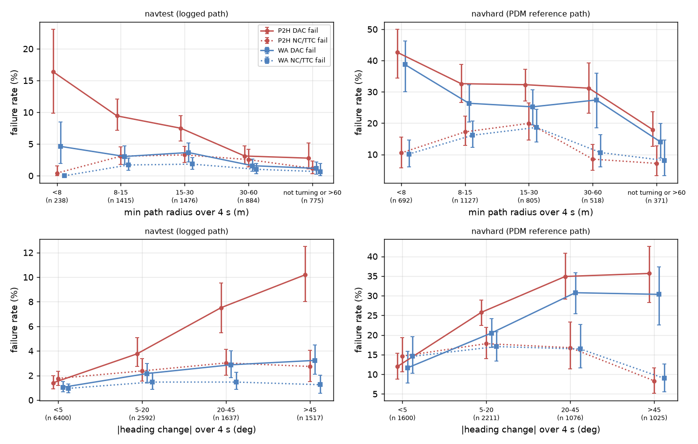
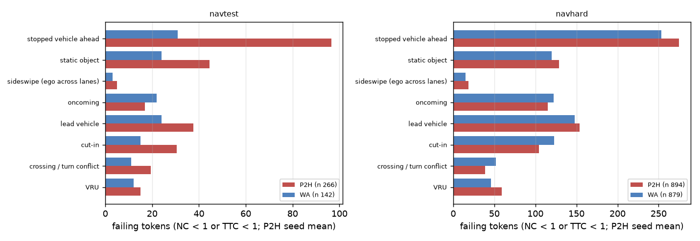
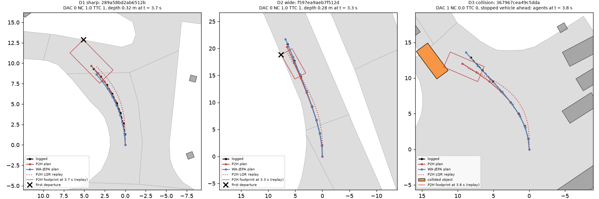

# Four directions, NAVSIM: sharp turns, wide-turn grazes and collisions of P2H, sized and explained

Written 2026-10-07. Driver P2H = op_parity P2 + footprint drivable hinge (lambda 10), checkpoints P2H10-F-s0 / s1 (decision 148); navtest W frames
(EPDMS 88.58 / 88.77), navhard two-stage under protocol G (GIMM frames, the hinge lane's harness: 31.40 / 32.28, mean 31.84). Reference WA-JEPA
(navtest 91.71, navhard 35.41). Every number below comes from stored plans and stored per-token results plus a CPU re-score; no model was run.
Code `experiments/op_parity/scripts/fd_navsim.py` (`replay`, `analyze`, `cases`, `figs`).

## Bucket rules (fixed before any score was read)

- **Path geometry**: navtest from the logged 4 s future; navhard from the PDM-Closed reference path of the token (stage 2 has no logged future; the
  same source on both stages). dpsi = heading change at 4 s; R_min = minimum over 1 s windows (arc >= 2 m) of arc / |heading change|.
  turning = |dpsi| >= 8 deg and path >= 3 m. **sharp** = turning and R_min < 15 m; **wide** = turning and R_min >= 15 m (curve 8-20 deg / wide turn >= 20 deg).
  Alternative heading rule sharp' = |dpsi| > 45 deg; the standard bins <5 / 5-20 / 20-45 / >45 deg are in `nav_rates_*.csv` and the figure.
- **D1** = sharp-turn token whose arm DAC < 1; **D2** = wide-turn / curve token whose arm DAC < 1 (per seed; D1 and D2 are disjoint).
  **D3** = arm NC < 1 or TTC < 1 (any geometry).
- **DAC side**: side (left / right corner of the ego box) of the first footprint corner outside the scorer's drivable polygons along the devkit's
  LQR replay; inside = same side as the turn. raw = the raw plan's footprint (0.1 s linear interpolation) also leaves; LQR-only = only the replay
  leaves. graze = maximum depth < 0.3 m. heading gain = plan dpsi / path dpsi at 4 s; "not around" = outside and gain < 0.9.
- **Collision type** from the first at-fault NC event (the scorer's own rule re-run on its own state), else the first TTC event: static object
  (non-agent), VRU, stopped vehicle ahead (nuPlan STOPPED_TRACK), sideswipe (ACTIVE_LATERAL with ego across lanes / off-road), oncoming
  (|relative heading| > 150 deg), crossing / turn conflict (30-150 deg), cut-in (< 45 deg, object started > 1.5 m lateral), else lead vehicle.
- **Size**: (a) the bucket's failing P2H tokens take WA-JEPA's token sub-scores (share of the P2H - WA gap; one-sided, WA's own failures are not
  charged); (b) they take the reference's NC..LK sub-scores (navtest: the logged human trajectory, replayed in-process with the devkit; navhard: the
  PDM-Closed rows of the loss-budget prep), comfort stays P2H's own, never-worse clip as in loss_budget.md; (c) exact Shapley split of the
  WA - P2H per-token gap (pp_gap_tables.shapley) summed over the bucket's tokens failing for P2H or WA, in points of the board mean. navhard (a) / (b)
  re-aggregate with the devkit's two-stage mapping (P2H's own stage-2 weights; reproduces 31.398 / 32.278 exactly); (c) is per stage on unweighted
  token means, as gap/index.html. Seeds averaged. 95% CIs: cluster bootstrap B 10 000 (jevdrive.stats) over the 136 logs (navtest) or the stage-1
  log of the scene-mapping group (navhard).

## Results

P2H - WA-JEPA gap: navtest **-3.04** EPDMS; navhard combined -3.57 (stage 1 -7.17, stage 2 -0.49).

| direction | navtest: failing P2H / WA (rate) | navtest (a) WA | (b) human | (c) Shapley | navhard: failing P2H / WA (rate) | navhard combined (a) WA | (b) PDM | (c) Shapley stage 1 / stage 2 |
|:--|:--|:--|:--|:--|:--|:--|:--|:--|
| **D1 sharp turn, DAC** (R < 15 m) | 172 / 54 (10.4% / 3.3% of 1 653) | **1.04 [0.73, 1.37]** | 1.28 [0.92, 1.66] | 0.87 [0.53, 1.22] (DAC 0.83) | 662 / 565 (36% / 31% of 1 819) | 3.46 [2.04, 5.06] | 7.48 [5.24, 9.93] | 0.81 [-1.74, 3.55] / 0.97 [0.32, 1.56] |
| D1' sharp, \|dpsi\| > 45 deg | 154 / 49 (10.2% / 3.2% of 1 517) | 0.91 [0.66, 1.15] | 1.15 [0.84, 1.47] | 0.77 [0.51, 1.03] | 366 / 311 | 2.97 [1.76, 4.33] | 5.23 [3.48, 7.00] | 1.55 / 0.56 [0.06, 1.00] |
| **D2 wide turn / curve, DAC** (R >= 15 m) | 166 / 78 (5.2% / 2.4% of 3 189) | **1.00 [0.73, 1.30]** | 1.27 [0.96, 1.60] | 0.66 [0.40, 0.96] | 500 / 407 (29% / 23% of 1 753) | 4.22 [2.54, 6.26] | 6.75 [4.48, 9.36] | 3.56 [0.70, 6.96] / 0.59 [0.16, 1.05] |
| of which curve 8-20 deg / wide turn >= 20 deg | 55 / 111 | 0.35 / 0.65 | 0.43 / 0.84 | 0.15 / 0.51 | 341 / 158 | 2.37 / 1.78 | 4.28 / 2.32 | stage 2 0.38 / 0.21 |
| **D3 collision** (NC or TTC < 1) | 266 / 142 (2.2% / 1.2%) | **1.16 [0.88, 1.44]** | 1.68 [1.27, 2.09] | 0.87 [0.56, 1.17] (NC 0.60, TTC 0.17) | 894 / 879 (15.1% / 14.9%) | 2.56 [1.29, 4.11] | 6.29 [4.37, 8.47] | 0.60 [-0.98, 2.26] / 0.81 [0.23, 1.45] |
| context: straight DAC | 127 / 87 (1.7% / 1.2%) | 0.75 [0.44, 1.13] | 0.99 | 0.28 [-0.09, 0.71] | 340 / 309 | 1.40 | 3.83 | -0.98 / 0.24 |
| D1 + D2 + D3 together | 572 | 3.04 [2.55, 3.51] | 3.97 [3.36, 4.56] | 2.27 [1.76, 2.77] | 1 841 | 9.79 [7.53, 12.39] | 19.61 [16.47, 22.94] | 4.94 / 2.06 |

navhard (a) / (b) by stage (stage-1 / stage-2 means, same oracle): D1 2.91 / 2.65 and 3.23 / 7.00; D2 4.85 / 2.05 and 4.68 / 5.46; D3 1.69 / 1.97 and 1.64 / 6.22
(`nav_oracle_navhard.csv`). Overlaps (P2H seed mean): navtest D1 & D3 14 tokens, D2 & D3 18.5; navhard D1 & D3 121, D2 & D3 94; D1 & D2 disjoint by rule.
The navtest union (a) equals the whole 3.04 gap only by coincidence: (a) is one-sided (tokens where only WA-JEPA fails are not charged), (c) is the
two-sided number: the three directions hold **2.27 of the 3.04 navtest gap** (DAC 1.47, NC 0.60, TTC 0.17).

*What to look at: navtest (left) P2H's DAC failure rate climbs as the logged radius shrinks (16% below 8 m, 9% at 8-15 m, 7.5% at 15-30 m) while
WA-JEPA stays at 3-5%; collision rates (dotted) are flat in radius and close between the two. navhard (right) both models fail DAC on a third of all
turning tokens and the curves nearly overlap: there the turn failures are shared.*

### Sub-buckets (size (a) WA / (b) reference, navtest; navhard combined)

| sub-bucket | navtest n (s0 / s1) | navtest (a) | navtest (b) | navtest (c) | navhard n | navhard (a) | navhard (b) |
|:--|:--|:--|:--|:--|:--|:--|:--|
| D1 outside + gain < 0.9 (**does not make it around**) | 45 / 43 | 0.23 [0.14, 0.33] | 0.33 [0.21, 0.46] | 0.22 | 346 / 338 | 1.30 [0.47, 2.28] | 3.39 [1.82, 5.08] |
| D1 outside, gain >= 0.9 | 37 / 35 | 0.21 [0.10, 0.32] | 0.27 | | 144 / 147 | 0.30 | 1.42 |
| D1 inside (**cuts the corner**) | 90 / 95 | **0.60 [0.36, 0.89]** | 0.68 [0.43, 0.97] | 0.48 [0.23, 0.77] | 177 / 173 | 1.85 [0.87, 3.03] | 2.47 |
| D2 inside | 91 / 86 | **0.62 [0.40, 0.85]** | 0.67 | 0.52 [0.32, 0.74] | 130 / 129 | 3.08 [1.61, 4.96] | 3.91 |
| D2 outside | 79 / 76 | 0.38 [0.25, 0.54] | 0.59 | 0.14 [-0.06, 0.35] | 370 / 370 | 1.13 [0.43, 2.00] | 2.80 |
| D2 graze < 0.3 m | 107 / 99 | 0.60 [0.44, 0.78] | 0.79 | 0.31 [0.12, 0.51] | 161 / 147 | 2.02 | 2.62 |
| D2 departure >= 0.3 m | 63 / 63 | 0.40 [0.25, 0.56] | 0.48 | | 339 / 352 | 2.10 | 3.97 |
| D2 LQR replay only (raw plan inside) | 71 / 69 | 0.38 [0.27, 0.52] | 0.53 | 0.13 [-0.01, 0.28] | 133 / 137 | 0.97 | 1.39 |
| D3 stopped vehicle ahead | 99 / 94 | **0.50 [0.34, 0.66]** | 0.62 | 0.45 [0.29, 0.62] | 276 / 274 | 1.32 [0.43, 2.44] | 3.02 |
| D3 static object | 48 / 41 | 0.18 [0.10, 0.28] | 0.24 | | 129 / 128 | 0.59 | 0.83 |
| D3 lead vehicle | 39 / 36 | 0.21 [0.12, 0.33] | 0.29 | | 155 / 153 | 0.31 | 0.34 |
| D3 cut-in | 31 / 30 | 0.08 [0.03, 0.14] | 0.19 | | 106 / 103 | 0.55 | 1.08 |
| D3 crossing / oncoming | 38 / 35 | 0.11 [0.01, 0.24] | 0.22 | | 152 / 156 | -0.14 | 0.81 |
| D3 VRU | 14 / 16 | 0.04 | 0.08 | | 59 / 59 | -0.07 | 0.10 |
| D3 plan > 1.1 x logged speed | 136 / 126 | **0.61 [0.40, 0.82]** | 0.94 [0.62, 1.25] | 0.48 [0.25, 0.70] | 546 / 539 | 1.57 [0.59, 2.86] | 3.55 |

## 1. Sharp turns: "does not make it around" is a minority; P2H's sharp-turn failures are half corner cuts

| quantity (share of D1 DAC failures, % [95% CI]) | P2H navtest | WA navtest | P2H navhard | WA navhard |
|:--|:--|:--|:--|:--|
| first departure on the **inside** of the turn | **54 [42, 65]** | 50 [31, 70] | 26 [22, 32] | 20 [16, 25] |
| outside and heading gain < 0.9 ("not around") | **26 [18, 34]** | 7 [0, 18] | 52 [45, 59] | 33 [25, 42] |
| heading gain < 0.9 (failing / passing tokens of the bucket) | 26 [19, 35] / 38 | 9 / 14 | 65 [58, 71] / 72 | 45 / 62 |
| median heading gain (failing / passing) | 1.04 / 0.95 | 1.01 / 1.00 | 0.72 / 0.55 | 0.93 / 0.79 |
| raw plan footprint already leaves (not LQR-only) | **66 [56, 75]** | 35 [21, 52] | 78 [74, 81] | 68 [59, 75] |
| graze < 0.3 m; median depth | 41 [32, 50]; 0.40 m | 70 [55, 86]; 0.18 m | 19; 1.09 m | 25; 0.77 m |
| front corner first; median first-departure time | 95; 3.4 s | 93; 3.4 s | 96; 1.7 s | 96; 1.4 s |
| median end offset at 4 s toward the inside (plan - path) | **+0.17 m** | -0.14 m | -1.33 m | -1.63 m |
| median speed ratio plan / path over 4 s; median v0 (passing v0) | 1.01; 3.7 m/s (3.1) | 1.01; 4.4 | 0.79; 3.2 (2.1) | 1.03; 3.4 |
| WA-JEPA fails the same token | 17 [11, 25] | | 74 [69, 79] | |
| decision-147 split (op_probe eval tokens, 335 of 345): encoder-level hinge decoder on Cinque vision also fails | **58 [51, 65]** | | | |
| same, P2 head-hidden decoder fails / WA-front-encoder decoder passes | 65 [56, 74] / 65 [55, 75] | | | |

- **navtest**: the user's picture (understeer: outside departure, heading undershoot) holds for only a quarter of P2H's sharp-turn DAC failures
  (0.23 of the 1.04 points). Failing plans turn as much as the logged path (gain 1.04; undershoot is *rarer* among failures than among passing
  sharp-turn plans, 26% vs 38%), keep the logged speed (ratio 1.01) and end 0.17 m *inside* the logged path, where WA's failing plans end 0.14 m outside.
  The dominant event is the front corner crossing the curb on the inside of a tight corner late in the horizon (t 3.4 s), in the raw plan itself
  (66%, WA 35%), 0.40 m deep (WA 0.18 m, mostly LQR-only grazes). Corner cuts are 0.60 of the 1.04 points.
- **navhard** (shared): two thirds of the D1 failures are outside and short of the reference heading, early (1.7 s), deep (1.1 m) and from a plan that
  is 21% slower than PDM-Closed; but WA-JEPA fails 74% of the same tokens with the same profile, and P2H's passing sharp-turn plans undershoot even more
  (gain 0.55). This is the stage-2 displaced-start picture of decision 112 (early departure, PDM reference turning tighter than any learned plan), not a
  P2H-specific understeer. The P2H-specific part is the WA oracle, 3.46 combined, of which "not around" 1.30 [0.47, 2.28].
- **Where it lives**: about 58% of the navtest D1 failures are already failed by a hinge-trained thin decoder reading the frozen Cinque vision tokens, while
  the same decoder on WA-JEPA's front encoder passes 65% of them: representation (decision 147's (a), here concentrated on corners). The other ~40% is
  head objective / training, and that part is the inside cut the current hinge (8 raw poses, margin 0.3 m) does not stop.

*What to look at: on navtest the P2H bars (red-labelled columns) show more raw-plan departures and fewer grazes than WA in every bucket, and inside-of-turn
departures at ~50-60% in sharp and wide turns; heading undershoot (cyan) is a minority. On navhard both models look alike: outside, deep, undershooting.*

## 2. Wide turns and curves: grazes on the inside, a third of them created by the tracker

| quantity (share of D2 DAC failures, %) | P2H navtest | WA navtest | P2H navhard | WA navhard |
|:--|:--|:--|:--|:--|
| inside of the turn | 53 [41, 64] (curve 43, wide turn 59) | 28 [15, 45] | 26 [21, 32] | 16 [10, 22] |
| graze < 0.3 m; median depth | **62 [55, 69]; 0.21 m** | 87 [78, 95]; 0.08 m | 31; 0.57 m | 37; 0.45 m |
| LQR replay only (raw plan inside the polygons) | **42 [34, 51]** | 78 [67, 87] | 27 [23, 31] | 33 [27, 39] |
| heading gain < 0.9; outside and gain < 0.9 | 21; 19 | 23; 21 | 52; 41 | 37; 25 |
| median end offset at 4 s toward the inside | +0.18 m | -0.15 m | -0.92 m | -1.41 m |
| median speed ratio; v0 (passing) | 0.99; 5.6 m/s (5.7) | 0.99; 5.0 | 0.78; 5.7 (3.8) | 1.02; 6.0 |
| WA-JEPA fails the same token | 20 [13, 28] | | 65 [58, 70] | |
| decision-147 encoder-level decoder also fails / WA-encoder decoder passes | 46 [38, 55] / 76 [68, 84] | | | |

- **navtest**: 62% of P2H's wide-turn DAC failures are grazes under 0.3 m (median 0.21 m) and 42% exist only in the devkit's LQR replay; the rest are
  real raw-plan departures (0.40 points of the 1.00). They are on the inside more often than WA's (53% vs 28%; P2H's failing plans end 0.18 m inside the
  logged path, WA's 0.15 m outside), and the curve 8-20 deg part is small (0.35). WA-JEPA's own D2 failures are almost all LQR-only grazes (78%, 0.08 m):
  the same scorer artefact, at a third of the depth. Heading gain and speed are those of the logged path; this is a lateral placement / footprint
  margin error, not a turning-rate error.
- **navhard**: outside-dominant (74%), deep (0.57 m), early (1.6 s), 22% slower than PDM-Closed, shared with WA on 65% of the tokens: again the stage-2
  start-state problem. The inside sub-bucket is the one with a P2H-specific stage-1 cost (WA oracle stage 1 +4.66, Shapley stage 1 +4.43 [2.16, 7.35] over 27 stage-1 tokens failing for P2H seed 0 or WA).
- **Where it lives**: the LQR-only part (0.38 navtest) is execution / scorer: the hinge sees the 8 raw poses, not the replay; the graze part is a
  margin problem the hinge could reach with replay-aware geometry; ~46% is decided at the frozen encoder (WA's encoder decoder passes 76%).

## 3. Collisions: stopped vehicles ahead and plans faster than the log, mostly P2H-specific on navtest

| quantity (share of D3 failures, %) | P2H navtest | WA navtest | P2H navhard | WA navhard |
|:--|:--|:--|:--|:--|
| NC failure (rest TTC only) | 69 [61, 75] | 53 [40, 64] | 83 [79, 87] | 79 [74, 84] |
| **stopped vehicle ahead** | **36 [30, 43]** (64% on turning tokens) | 22 [13, 31] | 31 [25, 37] | 29 [22, 36] |
| static object | 17 [10, 25] | 17 [8, 27] | 14 [10, 19] | 14 [9, 19] |
| lead vehicle (moving) | 14 [8, 20] (plan speed ratio 1.34) | 17 [7, 29] | 17 [12, 23] | 17 [12, 22] |
| cut-in | 11 [5, 19] | 11 [4, 18] | 12 [8, 16] | 14 [10, 19] |
| crossing / turn conflict; oncoming | 7 [1, 15]; 6 [3, 10] | 8; 15 | 4; 13 | 6; 14 |
| VRU; sideswipe | 6; 2 | 8; 2 | 7; 2 | 5; 2 |
| on turning tokens (base rate 40% navtest / 60% navhard) | 50 [42, 58] | 49 [38, 60] | 58 [51, 65] | 57 [50, 64] |
| **plan > 1.1 x logged / reference speed** (base rate over all tokens: P2H 13% / 22%, WA 14% / 27%) | **49 [39, 58]** | 52 [38, 65] | 61 [54, 67] | 64 [58, 69] |
| plan < 0.9 x speed | 9 [5, 14] | 6 | 29 | 23 |
| WA-JEPA fails the same token | **30 [23, 36]** | | 81 [77, 84] | |

- **navtest**: P2H fails NC / TTC on 266 tokens against WA's 142, and WA fails only 30% of P2H's: the collision gap is P2H-specific (Shapley 0.87,
  NC 0.60). The largest type is a stopped vehicle ahead (36%; 0.50 points), and two thirds of those are on turning tokens (parked or queued vehicles at
  the corner the plan cuts; D1 / D2 overlap D3 on only 32 tokens, so it is not the same DAC event). Speed is the common factor: 49% of P2H's collision
  plans are more than 10% faster than the logged trajectory against 13% of all its plans (WA: 52% vs 14%, the same signature on fewer tokens); that
  subset is 0.61 [0.40, 0.82] of the gap. Lead-vehicle collisions come with plans 34% faster than the log. Cut-ins, crossing / turn conflicts,
  oncoming and VRUs together are 0.23 points.
- **navhard**: P2H and WA fail the same tokens (81%) with the same type mix and the same over-speed signature: no P2H-specific mechanism, the
  remaining combined WA oracle 2.56 [1.29, 4.11] is spread thinly over types (stopped vehicle 1.32).
- Rear-end hits are not at-fault in the devkit, so they never fail NC (counted only as non-at-fault contacts in the replay table).

*What to look at: on navtest the red bar for "stopped vehicle ahead" is three times WA's, the other types are close; on navhard the two models have the
same profile.*

*Typical P2H seed-0 cases by a fixed rule (median-depth token of the bucket's majority side with v0 > 2 m/s; median ego speed token of the modal collision
type), navtest BEV in the t0 ego frame (up = forward, left = left). D1: a left turn whose front-right corner pokes into the far curb at 3.7 s, 0.32 m deep,
with the plan following the logged heading. D2: a 0.28 m graze on a gentle right-hand road edge at 3.3 s. D3: P2H's plan swings left of the logged path
into a stopped vehicle at the corner (NC 0, TTC 0), while WA-JEPA's plan follows the log.*

## Where the fix lives

| direction | navtest gap held (c) | P2H-specific? (WA fails same tokens) | representation (frozen encoder) | head objective / data | execution / scorer |
|:--|:--|:--|:--|:--|:--|
| D1 sharp | 0.87 | yes (17%) | ~58% of failures (encoder decoder fails; WA encoder decoder passes 65%) | ~40%: inside corner cuts the raw-pose hinge misses | LQR-only 34% |
| D2 wide / curve | 0.66 | yes (20%) | ~46% (WA encoder passes 76%) | grazes at the inside edge, margin | LQR-only 42% (0.38 points) |
| D3 collisions | 0.87 | yes (30%) | not measured (no agent probe) | over-speed toward stopped / lead vehicles: no agent term in the loss | none in the scorer |
| navhard D1 / D2 / D3 | stage 2 0.97 / 0.59 / 0.81 | no (74% / 65% / 81%) | | start-state / on-policy data (decisions 112, 145) | displaced stage-2 starts |

## Fix candidates, ranked

Gains are guesses bounded by the oracle (a) of the bucket they target; the drivable hinge realised 20% of its DAC gap (0.50 of 2.53 pp, decision 148),
which is the prior used for loss-side fixes.

1. **Agent-occupancy hinge in the P2H fine-tune** (training loss). The same machinery as lib/drivable_hinge.py, on the logged agent boxes of navtrain at the
   plan's 8 poses (penalise footprint overlap / time-to-contact with stopped and leading agents, stronger on the inflated front box). Targets D3 stopped
   vehicle ahead + lead + over-speed: ceiling navtest 1.16 (a), navhard 2.56. Expected **+0.25 to +0.4 navtest**, navhard +0.3 to +0.8 (shared failures,
   weaker). Cost: label build ~1 min CPU (as opb_labels), 2 x 30 min training, bench navtest + navhard. Deciding experiment: seed 0 full navtest read;
   gate NC + TTC failures down >= 0.3 pp and EPDMS >= +0.2 with EP not below -0.2; stop otherwise.
2. **Replay-aware drivable hinge with a turn margin** (training loss + execution). Hinge on the tracked footprint (a differentiable kinematic-bicycle
   tracking proxy of the devkit's LQR, or the raw poses densified with heading-consistent arcs) and margin 0.5 m on front corners when |dpsi| > 20 deg.
   Targets the inside corner cuts (D1 inside 0.60, D2 inside 0.62) and LQR-only grazes (0.38): ceiling ~1.3 navtest. Expected **+0.2 to +0.35**.
   Cost: tracker proxy ~0.5 day, then 2 x 30 min training. Deciding experiment: offline first, no training: re-score P2H plans with the decision-147
   thin decoder trained with the replay-aware hinge on P2 hidden (op_probe `decode` path, CPU) and keep it only if the decoder's DAC failures drop
   >= 0.4 pp on turning tokens over the raw-pose hinge decoder.
3. **Representation for corners** (encoder unfreeze with a dense drivable-SDF auxiliary head, or WA-JEPA front tokens as adapter memory as a trade test).
   Reaches the ~50-58% of D1 / D2 failures that are already failed at the frozen encoder: ceiling ~0.55 x (1.04 + 1.00) = 1.1 navtest. Decision 145's
   small unfreeze gave < +0.5 overall, so expected +0.3 to +0.6 only with the auxiliary geometry target. Cost: high (days). Deciding experiment: the
   thin-decoder test at the encoder level on the D1 / D2 tokens with the SDF auxiliary trained into the encoder (pilot 17 k tokens): proceed if the
   encoder-level decoder's failure rate on sharp turns falls from 58% of P2H's failures toward WA's level.
4. **Navhard stage-2 start states** (data). D1 / D2 / D3 failures on navhard are shared with WA (65-81%) and early (1.4-1.7 s); the fix is on-policy /
   recovery data (factor_wm, decision 145), not a P2H mechanism. Ceiling to PDM 7.5 / 6.8 / 6.3 combined, but WA is no better on these tokens.
5. Not worth a lane on NAVSIM: an understeer / heading-gain fix (D1 "not around" 0.23 navtest), cut-in / crossing / VRU handling (0.23 together),
   speed caps at the execution layer (the over-speed subset is 0.61 but a cap without perception also slows the tokens that progress needs).

**What the running turn-train pilot (T1P / T2P / T3P, plans/2026-10-06-turn-train-prereg.md) would change.** It moves turn sampling and the anchor, i.e. the
head-objective share. If its > 20 deg bucket closes >= half of the gap to WA-JEPA (its pre-registered "yes"), the encoder share above is overstated for
the trained head and candidate 3 drops below candidate 2. If it closes < 0.25 of the turning gap while the hinge arm H stays, the remaining D1 / D2
failures are representation and candidate 3 moves above 2. Its D3 effect is the other read: if turn-balanced sampling raises NC / TTC failures on turning
tokens (stopped vehicles at corners), candidate 1 becomes a prerequisite for any turn-training default.

## Caveats

- Oracles are ceilings, not achievable gains; (a) is one-sided (it can exceed the gap), (b) uses the logged human on navtest (replayed in-process with
  the devkit's non-reactive traffic, the official navtest setting; no official v2 human run exists) and PDM-Closed on navhard (its own combined is 52.8,
  and it fails some of these tokens). Rows overlap except D1 / D2.
- navhard geometry comes from the PDM-Closed reference path from the displaced stage-2 start, so "sharp / wide" on navhard means the reference's curvature,
  not a logged one; heading gains there are relative to a path that turns tighter than any learned plan.
- The decision-147 split uses op_probe's decoders trained on P2 (not P2H) features; the vision tokens are identical (frozen), the head-level row is P2's.
  Its token set is the op_probe eval set (335 of 345 D1 failures, 322 of 332 D2).
- Collision types come from heuristics on the scorer's own collision state (relative heading, lateral offset at t0); "stopped vehicle ahead" is nuPlan's
  STOPPED_TRACK class (or a TTC event on a vehicle under 0.5 m/s). Speed ratio is plan arc / logged arc over 4 s, not a speed at the event.
- The in-process replay reproduces every stored sub-score (navtest max difference 9e-12, navhard 1e-16) and the board numbers exactly
  (navtest 88.576 / 88.771, navhard 31.398 / 32.278).

## Files

- Doc: this page. Figures `figs/nav_rates.png`, `figs/nav_dac_anatomy.png`, `figs/nav_collision_types.png`, `figs/nav_cases.png`.
- Tables: `nav_oracle_{navtest,navhard}.csv` (sizes (a) / (b) with CIs, navhard per stage), `nav_shapley_{navtest,navhard}.csv` ((c) per sub-metric),
  `nav_rates_{navtest,navhard}.csv` (failure rates by radius / heading bin), `nav_mechanism.csv` (every mechanism share with CI), `nav_tokens_{navtest,navhard}.csv`
  (per failing token: geometry, side, depth, gain, offsets, collision class, speed), `nav_summary.json`.
- Code `experiments/op_parity/scripts/fd_navsim.py`; intermediate replay tables on the box under `$DATA_DIR/runs/op_parity/four_dirs/` (`replay_*.parquet`,
  `replay_*_states.npz`, `refpath_navhard.npz`, `mapping_navhard.json`, `cases_navtest.pkl`). Replay wall time 23 s (navtest, 1 043 tokens x 4 keys) and
  241 s (navhard, 5 912 tokens) on 28 processes.
