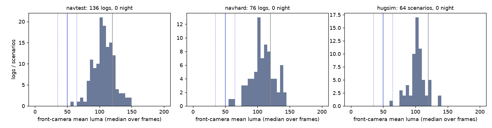
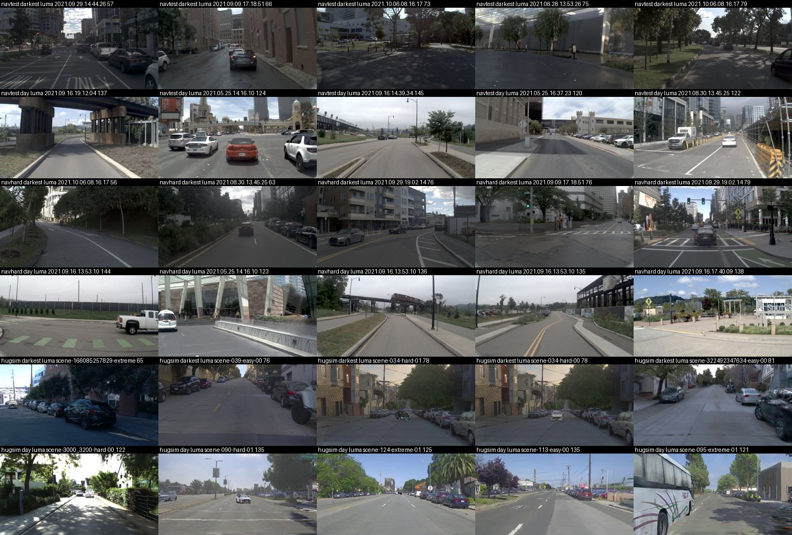
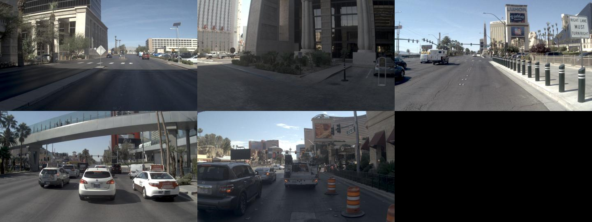

# Direction 4, night / low light, on the HUGSIM + NAVSIM tier: there is no night to measure

2026-10-07. Measurement only, CPU, no model run. Script `experiments/op_parity/scripts/fd_night.py` (`luma`, `hugsim`, `report`, `sheet`, `calib`).
Night rule = decision 131 / `experiments/leaderboard_audit/results/night_gap.md`: mean front-camera luma, median over frames per log / scenario, night < 50,
day >= 120, dusk in between. Scores: P2H = P2H10-F-s0 / s1 seed mean (navtest per-token EPDMS x 100, protocol W; navhard per-group two-stage EPDMS, protocol G;
HUGSIM 64 HD x 100, `spec_plan_smooth`, mean of s0 / s1 x rr1 / rr2), WA-JEPA = the reference rows used by `hinge.md` / `hugsim_specplan.md`. Gap = WA-JEPA minus P2H.

## 1. Result

**Night is 0 units on all three boards.** Not a small share: no log, group or scenario has a median luma below 50 (lowest: navtest log 56.7, navhard log 55.8,
HUGSIM scenario 65.0), and the by-eye check of the darkest logs shows daytime shade, not night ([sheet](figs/night_sheet.jpg)). The replacement oracle (give WA-JEPA's score
on the night units) is therefore 0.00 points on every board.

| board | units | night units (luma < 50) | night clusters | whole-board P2H / WA-JEPA | gap all [95% CI] | night / day gap, size of the night bucket |
|---|---|---|---|---|---|---|
| navtest | 12 146 tokens | **0 (0.0%)** | 0 / 136 logs | 88.67 / 91.71 | +3.04 [+2.32, +3.74] | none; oracle 0.00 pt |
| navhard two-stage (combined) | 225 groups | **0 (0.0%)** | 0 / 76 stage-1 logs | 31.84 / 35.41 | +3.57 [-0.21, +7.57] | none; oracle 0.00 pt |
| HUGSIM 64 | 64 scenarios | **0 (0.0%)** | 0 / 64 scenarios | 43.11 / 45.06 | +1.95 [-5.48, +9.69] | none; oracle 0.00 pt |

Cluster bootstrap (B 10 000, seed 0, `jevdrive.stats` convention): resample logs (navtest), stage-1 log of the group (navhard), scenarios (HUGSIM). Luma distribution per
board with the three cuts: [figs/night_luma.png](figs/night_luma.png). Unit table: [night_units.csv](night_units.csv) (unit, board, luma of its cluster, label, token-level luma, cluster, city / dataset).

**Cut sensitivity** (night < 35 / 50 / 65; [night_gap_cuts.csv](night_gap_cuts.csv)): 35 and 50 give 0 units on all boards. Only 65 finds anything, and it is one dim daytime log each:

| board | cut 65 night units | share | night gap / day gap | gap diff night - day [CI] | size, replace night | size, excess over day |
|---|---|---|---|---|---|---|
| navtest | 28 tokens, 1 log | 0.2% | +0.71 / +4.48 | -3.77 [-5.56, -1.94] | 0.00 [0.00, 0.01] | -0.01 [-0.04, 0.00] |
| navhard | 2 groups, 2 logs | 0.9% | -5.38 / +6.37 | -11.75 [-27.06, +3.49] | -0.05 [-0.24, +0.07] | -0.10 [-0.40, +0.02] |
| HUGSIM | 1 scenario | 1.6% | -0.12 / -4.94 | +4.82 [-16.90, +25.51] | -0.00 [-0.01, 0.00] | +0.08 [-0.45, +0.79] |

(Size = night share x gap; "excess" = night share x (night gap - day gap). All below 0.3 points in magnitude and the CIs straddle 0 or are about 0.) The day bucket at the
decision-131 cut of 120 is not usable either: 86% of navtest tokens, 73% of navhard groups and 89% of HUGSIM scenarios fall into "dusk" (median log luma 107 / 106 / 101),
because nuPlan's and the renders' auto-exposure sits around 100 where WOD day sits above 140. I did not split on dusk / day.

**Low-light proxy (not night).** To see whether darker daytime scenes carry a P2H-specific deficit, the darkest 10% / 25% of clusters per board versus the rest
([lowlight_proxy.csv](lowlight_proxy.csv)):

| board | darkest | luma thr | share | P2H dim / rest | WA dim / rest | gap dim / rest | gap diff [CI] | size replace | size excess |
|---|---|---|---|---|---|---|---|---|---|
| navtest | 10% | 86.7 | 10.4% | 86.77 / 88.89 | 89.76 / 91.94 | 2.99 / 3.04 | -0.06 [-2.45, +2.34] | 0.31 [0.05, 0.65] | -0.01 [-0.24, +0.24] |
| navtest | 25% | 97.0 | 28.7% | 86.86 / 89.40 | 89.75 / 92.50 | 2.89 / 3.10 | -0.21 [-1.93, +1.31] | 0.83 [0.33, 1.40] | -0.06 [-0.51, +0.40] |
| navhard | 10% | 85.1 | 6.2% | 30.52 / 31.93 | 35.72 / 35.39 | 5.20 / 3.47 | +1.74 [-11.5, +15.8] | 0.32 [-0.27, 1.16] | +0.11 [-0.55, +0.93] |
| navhard | 25% | 97.4 | 23.6% | 30.43 / 32.27 | 33.46 / 36.01 | 3.03 / 3.74 | -0.71 [-9.0, +11.6] | 0.71 [-0.93, 2.70] | -0.17 [-2.44, +2.13] |
| HUGSIM | 10% | 86.5 | 10.9% | 32.87 / 44.37 | 37.95 / 45.93 | 5.09 / 1.57 | +3.52 [-19.9, +39.3] | 0.56 [-1.71, 4.08] | +0.39 [-2.18, +4.00] |
| HUGSIM | 25% | 97.2 | 25.0% | 29.55 / 47.63 | 45.35 / 44.96 | 15.80 / -2.66 | +18.46 [-1.29, +40.59] | 3.95 [-0.50, 9.35] | +4.61 [-0.31, +10.68] |

navtest has no darkness-specific gap (the gap is +3.0 in dim and rest alike; the 0.31 / 0.83 "replace" size is just the board-wide gap times the share). navhard and HUGSIM have
CIs wider than the effect (14 and 7 dim units). The HUGSIM darkest quartile (16 scenarios, P2H 29.6 vs 47.6) leans positive but its CI touches 0, it is a
darker-render effect confounded with dataset and scene, not night, and a dim-render question belongs to the HUGSIM direction rather than here.

## 2. Is the label wrong or is there no night? (checks)

- **By eye** ([figs/night_sheet.jpg](figs/night_sheet.jpg)): rows per board = darkest 5 clusters, then 5 random day clusters (there is no night row because no cluster is night). All darkest frames are daytime
  (shaded street, overcast, low sun behind buildings); luma 56-81. HUGSIM frames are the middle third of the 3-camera render (`video.mp4`, crop x 800-1600, y 0-450), same view as the model input.
- **Token level**: 57-58 of 12 146 navtest tokens (0.5%, 10 logs; 57 after rounding luma to 0.1 in the CSV) have luma < 50 (min 36.6): a momentary underpass or tunnel dip inside a bright log, which the per-log median removes by design. navhard 1 / 225 groups, HUGSIM 0.
- **HUGSIM sources**: none of the 11 nuScenes scenes in the 64 has "night" in its nuScenes description (decision 131's label for nuScenes). KITTI-360 is a daytime dataset; the Waymo and PandaSet darkest scenes are daytime on the sheet.
- **Time-of-day from the log name (inconclusive, not used)**: solar elevation from the UTC start in the nuPlan log name, city centre, NOAA formulas. It flags 3 navtest logs (165 tokens) and 1 navhard log at sun elevation -4.6
  to -4.5 deg (pre-dawn Las Vegas), no log below -6 deg. But the frames of those logs are bright daylight ([figs/sun_check.jpg](figs/sun_check.jpg), bottom row: the two navtest logs; top row: navtrain logs
  at -7 deg), so the log-name stamp is not a capture time that can be trusted (log vs sun elevation correlation over the 136 navtest logs: -0.01). Result of the label by sun: navtest 165 tokens (1.4%), P2H 95.8 vs WA 95.7 (3 logs),
  navhard 1 group, nothing to read.
- **Can the rule see night on this camera at all?** `calib` ran navtrain (1 192 logs, 16 flagged below -6 deg by name; [calib_navtrain.csv](calib_navtrain.csv)): the 12 lowest-sun logs have luma 68-142, all bright. I found no night frame in the nuPlan logs I sampled
  (navtest and navhard in full, 24 navtrain logs); navtest logs by city: Boston 51, Las Vegas 50, Pittsburgh 22, Singapore 13.

Per city (navtest logs): night logs 0 in all four. Median / minimum log luma: Boston 100.9 / 56.7, Las Vegas 109.4 / 74.8, Pittsburgh 117.8 / 98.9,
Singapore 89.2 / 73.4. navhard: Boston 99.5 / 63.0, Las Vegas 113.9 / 82.8, Pittsburgh 128.3 / 93.3, Singapore 101.3 / 55.8.
Stage-2 rendered frames of navhard (5 462 tokens) are slightly darker than the stage-1 frames of the same log (mean log-median luma -5.6, correlation 0.55) but also nowhere near night (min token 35, a
dark-shade render); the group label uses the stage-1 log.

## 3. Recommendation

Night is negligible on the NAVSIM + HUGSIM tier: 0 units on navtest (12 146 tokens, 136 logs), navhard (225 groups, 76 logs) and HUGSIM (64 scenarios) under the decision-131 rule, 0 at cut 35 too, at most
0.2 / 0.9 / 1.6% (one or two dim daytime logs) at cut 65, and a replacement oracle of 0.00 points. Move direction 4 to the WOD tier: decision 131 measured a real night effect only there (+0.43 m
ADE@3s matched, 132 of 479 val sequences = 28% night). A night measurement on this tier would need new
data (a night-capable simulator route, or an external night set); HUGSIM scenes are reconstructed from daytime source drives, so no night arm can be built from them without re-lighting.

## 4. Method

- **navtest / navhard**: CAM_F0 of every token's current frame (`cams[-1]["CAM_F0"]`, the NAVSIM sensor blobs, 1/8 JPEG draft to luma), 12 146 + 5 912 tokens (navhard: 450 stage-1 + 5 462 stage-2 rendered). Log label =
  median over the log's tokens (stage 1 for navhard). A navhard group takes the label of the stage-1 log of its `orig` token; all 225 `orig` tokens are stage-1 tokens.
- **HUGSIM**: P2H10-F-s0 `spec_plan_smooth-rr1` run dirs (the render is the same for every arm), `video.mp4` every 4th frame, crop to the front camera, median over frames per scenario (3-79 frames; scenarios that end early have few).
- **Gap and size**: gap = WA-JEPA - P2H per unit (navhard: group `combined`; stage1 / stage2 split in the code); size_replace = night share x night gap; size_excess = night share x (night gap - day gap);
  all by cluster bootstrap, B 10 000, seed 0, ratio of sums over resampled clusters (the `jevdrive.stats` convention).
- Runtime on the box about 25 s CPU-parallel (24 workers); the box run dirs are `$DATA_DIR/runs/op_parity/four_dirs/` (luma parquets).

## 5. Open issues

- A real night read of this tier does not exist; the proxy rows are dim daytime and their HUGSIM quartile is noise-level (CI touches 0).
- The decision-131 day cut (120) does not transfer to nuPlan / HUGSIM renders; only the night cut was used. If a cut for this tier is ever needed, it should be calibrated on frames, not borrowed from WOD.
- Time-of-day by nuPlan log-name timestamp is unreliable (frames disagree with the computed sun elevation), so no independent label exists for navtest night beyond luma and eye.
- HUGSIM luma comes from rendered frames of the sim, not from the source cameras; scenes with the darkest source drives could be rendered brighter than the source. nuScenes descriptions agree (no night), the other three datasets rest on luma and eye.
