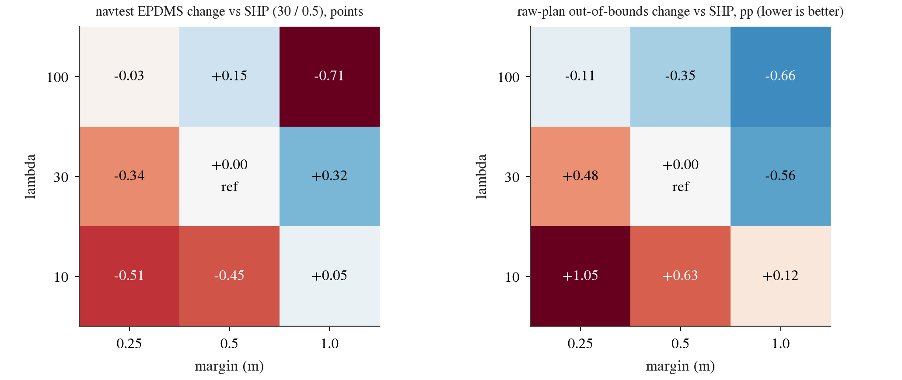

# op_parity hinge-scan: lambda x margin of the drivable hinge at pilot scale (no winner, SH30 stays), and SH30 on WOD val (no cross-domain gain)

Written 2026-10-08. Pre-registration: [plans/2026-10-08-hinge-scan-prereg.md](../plans/2026-10-08-hinge-scan-prereg.md) (committed before any scan arm was scored; one
later edit, also before scoring, dropped an unused background row). Code: `scripts/hinge_scan.py` (`scan`, `wod`), `scripts/hinge_scan_chain.sh` (chain), recipe `scripts/pp_train.py`
(unchanged), scores `jevdrive.bench`, replay `turn_oracle.py replay`, geometry `rh.py proxy`. Tables: [hinge_scan/](hinge_scan/) (`paired.csv`, `arms.csv`, `grid_diffs.csv`, `verdict.json`,
`wod_rfs.csv`, `wod_turn_side.csv`). Figure: [../figs/hinge_scan/grid_heatmap.png](../figs/hinge_scan/grid_heatmap.png).

## Answer

1. **No grid point beats SHP (lambda 30 / margin 0.5) by the pre-registered rule; SH30 stays. No full-scale run was made.** The best EPDMS point, lambda 30 / margin 1.0, is +0.32 [-0.01, +0.68]
   (Bonferroni 99.4% lower bound -0.16, W1 fails) and pays for it: straight EPDMS -0.31 [-0.67, +0.04], EP -0.10 [-0.14, -0.06] (W2 fails).
2. **Lambda and margin both act as one "strength" axis, and the trade-off is monotone.** Raw-plan out-of-bounds falls with either (see table; lambda 10 / margin 0.25 +1.05 pp up to lambda 100 / margin 1.0 -0.66 pp), EPDMS rises
   from the weak corner and saturates, then straight EPDMS and EP start to cost (lambda 100: EP -0.19 to -0.27; lambda 100 / margin 1.0: straight EPDMS -2.13 [-2.95, -1.35]). SHP sits near the knee. At fixed margin 0.5, EPDMS
   by lambda 10 / 30 / 100 is -0.44 / 0 / +0.15; at fixed lambda 30, by margin 0.25 / 0.5 / 1.0 it is -0.34 / 0 / +0.32. So the SH30 gain over P2H10 (lambda 10 / margin 0.3) comes from both: raising only
   lambda (10 -> 30 at margin 0.5) is worth +0.44, raising only margin (0.25 -> 0.5 at lambda 30) +0.34, on one seed each.
3. **Seed noise is small**: SHP-F-s1 - SHP-F-s0 EPDMS +0.06 [-0.17, +0.28] (the W1 floor 0.055), raw out +0.01 pp. A pilot point needs about +0.3 to separate from noise by the Bonferroni interval; only lambda 30 / margin 1.0 gets near it.
4. **WOD val: SH30 does not change cross-domain turning in a useful way.** RFS 7.734 vs P2H10 7.708: +0.026 [-0.027, +0.078]; vs shipped 8.005: -0.271 [-0.477, -0.069]. ADE@3s is slightly worse than P2H10
   (+0.035 m [+0.030, +0.041]). On the 52 turn frames the 5 s endpoint moves a little less inward (mean inward miss 0.19 -> 0.02 m, -0.17 [-0.26, -0.07]) at the price of more frames wide of the top-rated path (9 -> 11 of 52).

## Pilot grid (navtest 12 146 tokens, seed 0, 3 000 x 64; difference to SHP-F-s0, 95% CI, log-cluster paired bootstrap B 4 000)

| lambda / margin | EPDMS | EPDMS straight | EP | raw-plan out % (all) | DAC fail % | inside-cut % > 45 deg | cannot-make-turn % > 45 deg | W1 / W2 / W3 |
|:--|:--|:--|:--|:--|:--|:--|:--|:--|
| 10 / 0.25 | -0.51 [-0.72, -0.31] | -0.13 [-0.38, +0.10] | +0.04 | +1.05 [+0.74, +1.40] | +0.56 | +0.13 [-0.50, +0.67] | +0.33 [-0.07, +0.84] | n / y / n |
| 10 / 0.5 | -0.44 [-0.65, -0.27] | -0.18 [-0.37, -0.01] | +0.04 | +0.63 [+0.40, +0.89] | +0.44 | -0.07 [-0.38, +0.22] | +0.79 [+0.27, +1.40] | n / n / n |
| 10 / 1.0 | +0.05 [-0.14, +0.23] | -0.14 [-0.27, -0.02] | +0.04 | +0.12 [-0.02, +0.28] | -0.12 | 0.00 [-0.49, +0.48] | +0.33 [-0.07, +0.81] | n / n / n |
| 30 / 0.25 | -0.34 [-0.51, -0.18] | -0.16 [-0.36, +0.03] | -0.01 | +0.48 [+0.24, +0.74] | +0.21 | +0.07 [-0.34, +0.46] | +0.26 [0.00, +0.58] | n / y / n |
| **30 / 0.5 (SHP, ref)** | 88.46 | 92.73 | 86.97 | 2.96 | 3.68 | 3.96 | 4.28 | |
| 30 / 1.0 | +0.32 [-0.01, +0.68] | -0.31 [-0.67, +0.04] | -0.10 [-0.14, -0.06] | -0.56 [-0.89, -0.25] | -0.77 | -0.13 [-0.70, +0.41] | -0.40 [-1.12, +0.36] | n / n / y |
| 100 / 0.25 | -0.03 [-0.21, +0.14] | -0.03 [-0.18, +0.11] | -0.19 [-0.24, -0.14] | -0.11 [-0.25, +0.03] | -0.19 | -0.20 [-0.69, +0.20] | -0.20 [-0.77, +0.30] | n / n / y |
| 100 / 0.5 | +0.15 [-0.12, +0.43] | -0.31 [-0.58, -0.04] | -0.25 [-0.29, -0.21] | -0.35 [-0.56, -0.15] | -0.53 | -0.20 [-0.77, +0.27] | -0.46 [-1.16, +0.12] | n / n / y |
| 100 / 1.0 | -0.71 [-1.31, -0.08] | -2.13 [-2.95, -1.35] | -0.27 [-0.38, -0.17] | -0.66 [-1.20, -0.18] | -1.23 | -0.79 [-1.79, 0.00] | -0.53 [-1.24, +0.12] | n / n / y |
| SHP seed 1 (noise) | +0.06 [-0.17, +0.28] | -0.03 [-0.17, +0.12] | +0.05 | +0.01 [-0.18, +0.19] | -0.05 | +0.33 [-0.14, +0.83] | -0.20 [-0.77, +0.37] | |

Rule (prereg): W1 = EPDMS 99.38% lower bound > 0 and diff >= seed spread 0.055; W2 = straight EPDMS and EP diffs >= -0.2 and each 95% upper bound >= 0; W3 = raw-plan out (all) diff <= 0. The 1.0 m margin at lambda 10 and
every lambda-30 / 100 arm with margin >= 0.5 fail W2 mostly on the straight EPDMS / EP point estimate. DAC fail % (= replay out %) and the other rows (EP straight, > 20 deg raw out and inside-cut, Bonferroni bounds) are in
`hinge_scan/paired.csv`. The inside-cut / cannot-make-turn CIs on 1 517 tokens > 45 deg all contain 0 except lambda 10 / margin 0.5 cannot-make-turn (+0.79, worse); they are not gated.

*What to look at:* left, navtest EPDMS change vs SHP (centre, 30 / 0.5); the gain grows toward lambda 30 / margin 1.0 and falls off at lambda 100 / margin 1.0. Right, raw-plan out-of-bounds change (lower is better, blue): falls steadily
with both axes, with no sign of saturation at 100 / 1.0, which is why the cost shows up in EPDMS (straight driving) and not in the boundary metric.

## WOD val (decision 155 harness, 479 rater frames, ADE on 1 437 frames; seed means; bootstrap over sequences B 4 000)

| contrast | RFS | ADE@3s (m) | ADE@5s (m) |
|:--|:--|:--|:--|
| shipped | 8.005 | 1.041 | 2.117 |
| P2H10 | 7.708 | 1.324 | 2.668 |
| SH30 | 7.734 | 1.360 | 2.715 |
| SH30 - P2H10 | +0.026 [-0.027, +0.078] | +0.035 [+0.030, +0.041] | +0.047 [+0.036, +0.060] |
| SH30 - shipped | -0.271 [-0.477, -0.069] | +0.319 [+0.262, +0.376] | +0.599 [+0.495, +0.704] |
| per seed vs shipped (SH30 s0 / s1; P2H10 s0 / s1) | -0.264 / -0.278; -0.287 / -0.306 | | |

SH30 s0 - s1 RFS +0.014 [-0.053, +0.080]. The P2H10 and shipped rows reproduce `wod_parity.md` (7.708, 8.005, -0.297 [-0.501, -0.094]).

Turn frames (intent left / right, 52 of the 479; lateral miss of the plan at 5 s against the top-rated rater trajectory, positive = toward the inside of the turn; per-frame seed means):

| arm | median inward (m) | mean inward (m) | inside > 1 m (frames) | wide > 1 m (frames) |
|:--|--:|--:|--:|--:|
| shipped | 0.63 | 1.13 | 23 | 6 |
| P2H10 | 0.06 | 0.19 | 15 | 9 |
| SH30 | 0.06 | 0.02 | 12 | 11 |

SH30 - P2H10: mean inward miss -0.17 m [-0.26, -0.07]; inside > 1 m -5.8 pp [-13.5, 0.0]. SH30 - shipped: -1.11 m [-1.85, -0.41], -21.2 pp [-36.5, -7.6]. Reading: the stronger navtrain hinge pushes the WOD
turn endpoints further from the inside kerb than P2H10 did, but the shift is a fraction of P2H10's own shift from shipped, the median is unchanged (0.06 m) and RFS does not move. It is a small, scorer-consistent
change in turn side, not a cross-domain turning gain; the RFS loss to shipped (decision 155, ego-state bias) is untouched. Frame counts are small (52); the CIs are the sequence bootstrap of those frames.

## Setup, verified, not verified, deviations

- Pilot recipe identical to SHP (3 000 x 64, `navsim/op-parity-s234`, warmup 100, seed 0, warp frames, no memory tokens), only `--hinge-lam` / `--hinge-margin` changed; all trainings pass `pp_full_check.py train`.
  Scores via `jevdrive.bench` navtest; replay via the four_dirs `Data` path of `turn_oracle.py`; raw-plan geometry via `rh.py proxy --name` (all 12 146 tokens).
- Verified: SHP-F-s0 values reproduce the strong-hinge pilot (EPDMS 88.46, straight 92.73); WOD P2H10 / shipped rows reproduce `wod_parity.md`; replay DAC = bench DAC (the DAC and replay-out rows are identical in `paired.csv`).
- Not verified / limits: one seed per grid point (seed spread measured at the SHP point only; arms with |diff| around 0.3 are within about 5 noise units of nothing at this resolution); the grid is coarse (3 x 3, margins in a 4x range) and pilot scale
  (the full-scale effect of SH30 was +0.87, larger than the pilot's +0.52 vs RH0, so pilot ranks may not carry over); the grid anchors the lambda-10 row at margin 0.25, not P2H10's 0.3; HUGSIM and navhard were not run for scan arms;
  WOD turn side is 52 frames, one served mapping (decision 155's), post hoc `wod_gap_turn_side.py` style read; the lambda 30 / margin 1.0 point (+0.32, raw out -0.56) was not pursued at full scale because it failed W1 / W2 by the rule, and it is the
  only point that could change this on more evidence (a second seed or a full run would be the next step; not done).
- Deviations: none in rules or thresholds. `wod_turn_side.csv` holds the per-arm table and the paired rows in one file (the paired rows fill `metric` / `diff`, the arm rows leave them empty).
  The heatmap's text colour was fixed after first render (cosmetic).
- Cost: 9 pilot trainings (17-18 GB VRAM each, ~7-13 min wall, about 1.5 card-hours), navtest scoring, replay and 10 geometry passes on CPU, WOD serving 2 x one 8 GB / 14-core job (about 0.3 card-hours). About 2 card-hours in total, nothing at full scale.
