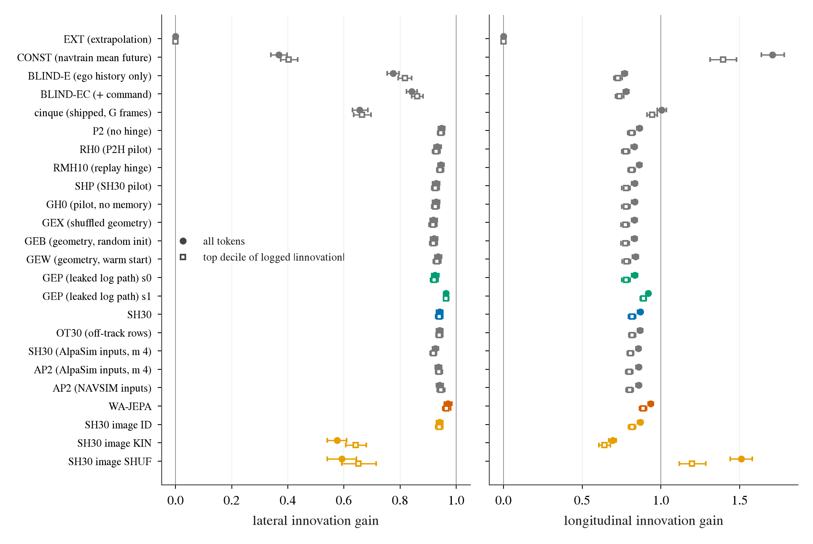
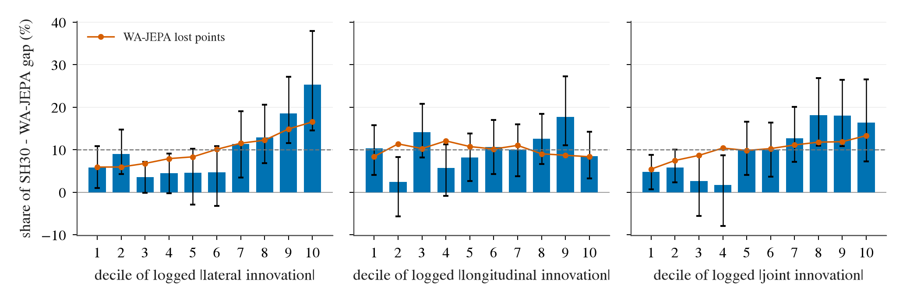
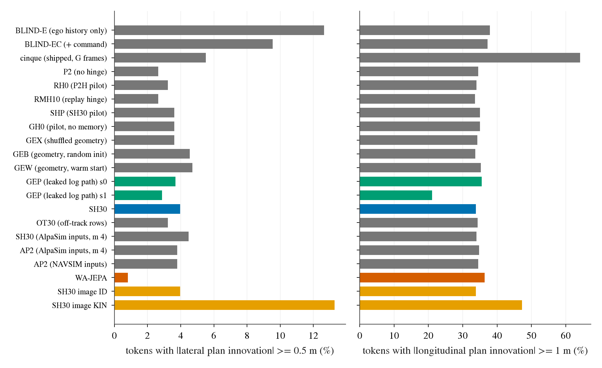

# op_parity innovation gain: does SH30 lack scene-caused change? (lane IG1)

Written 2026-10-09. Measurement only: stored plans, stored per-token scores, the token table; one small GPU job (image ablation).
Pre-registration [plans/2026-10-09-innovation-gain-prereg.md](../plans/2026-10-09-innovation-gain-prereg.md), pushed before any plan statistic.
Code `scripts/innov.py`. Every table: [innovation_gain/tables.md](innovation_gain/tables.md); CSVs and `summary.json` next to it.
navtest 12 146 tokens (gain on the 12 027 where every rung has a plan), 136 logs, 95% CIs are log-cluster bootstraps (B 10 000).
WA-JEPA enters through its stored trajectories and per-token scores only; no WA-JEPA inference was run. Nothing here is a method.

## Definitions (as registered)

- Extrapolation **E-cc**: constant curvature (heading change over the last 1.5 s divided by the arc driven; 0 when that arc is under 1.5 m, 1 717
  tokens) and constant acceleration (difference of the first and last history segment speeds), speed clipped at 0.
- **Innovation** in the Frenet frame of the extrapolated path, at 4 s: lateral = signed offset of the 4 s point from that path; longitudinal = own
  arc length minus the extrapolated arc length. Log innovation x, plan innovation y (same subtraction). Logged |x|: lateral median 0.57 m, P90
  6.65 m; longitudinal median 2.43 m, P90 7.65 m.
- **Gain** = OLS slope of y on x; **top-decile gain** = the same slope on the tokens with |x| above its 90th percentile.
- Registered margin for "clearly below": WA-JEPA gain minus SH30 gain >= 0.10 with a CI excluding 0.

## Verdict against the registered lines

D = WA-JEPA top-decile gain minus SH30's (two-seed mean); S = share of the SH30 - WA-JEPA EPDMS gap (-2.16) in the top three deciles of logged |x|.

| axis | D [95% CI] | margin 0.10 | S [95% CI] | registered cell |
|:--|:--|:--|:--|:--|
| lateral | +0.026 [+0.016, +0.038] | not met | 56.8% [44.3, 72.5] | **PARTIAL** (CI excludes 0, share between 40 and 60%) |
| longitudinal | +0.068 [+0.053, +0.084] | not met | 38.7% [27.8, 52.3] | **FALSIFIED** (share under 40%) |
| overall | | | joint 52.4% [38.3, 68.8] | **PARTIAL** by the letter |

The letter of the rule gives "partial", but its two halves say different things, so read them separately:

1. **P1 fails on both axes.** SH30's gain is not clearly below WA-JEPA's: the difference is 0.03 lateral and 0.07 longitudinal, a quarter and
   two thirds of the registered margin. The supported line needed D >= 0.10 and is not reached anywhere in the primary definition.
2. **The lateral "partial" comes from where the gap is, not from a missing response.** At the same arc length the two models follow the
   logged lateral change equally (gain 0.976 vs 0.982, top decile 0.986 vs 0.987, difference +0.002 [-0.003, +0.005]); at 2 s SH30's lateral
   gain is above WA-JEPA's (0.948 vs 0.932). The 0.03 time-matched deficit is the plan being shorter along the same path. The 57% share is the
   turn-bucket concentration seen through a correlated variable (section P3).
3. **Longitudinally there is a small real deficit, and the gap is not where the innovation is large.** Gain 0.869 vs 0.935; with the
   mechanical term removed (partial gain) 0.796 vs 0.887, difference +0.091 [+0.078, +0.104]. But the top three deciles hold 38.7% of the
   gap against 30% of the tokens, and the top decile alone holds 8.5%.

What is missing on navtest is therefore precision on turning tokens, not the capability the hypothesis names. Confidence: medium. The
longitudinal cell is definition-dependent (next table), so it is one notch weaker than the lateral reading.

| definition | axis | SH30 / WA-JEPA gain | D [95% CI] | S | cell |
|:--|:--|:--|:--|:--|:--|
| **E-cc, 4 s, all tokens (registered)** | lat | 0.941 / 0.971 | +0.026 [+0.016, +0.038] | 56.8% | PARTIAL |
| | lon | 0.869 / 0.935 | +0.068 [+0.053, +0.084] | 38.7% | FALSIFIED |
| E-cc, v0 >= 2 m/s (9 522 tokens) | lat | 0.947 / 0.972 | +0.026 [+0.015, +0.037] | 57.4% | PARTIAL |
| | lon | 0.770 / 0.862 | **+0.119 [+0.091, +0.143]** | 43.2% | PARTIAL |
| E-cv (straight, constant speed), all tokens | lat | 0.957 / 0.980 | +0.026 [+0.012, +0.040] | 73.9% | PARTIAL |
| | lon | 0.932 / 0.974 | +0.026 [+0.016, +0.036] | 24.0% | FALSIFIED |
| E-cv, v0 >= 2 m/s | lat | 0.963 / 0.981 | +0.024 [+0.010, +0.039] | 82.5% | PARTIAL |
| | lon | 0.902 / 0.948 | +0.021 [+0.004, +0.040] | 29.3% | FALSIFIED |

How to read it: the lateral D is 0.024-0.026 under every definition; only its share moves (with a straight-line extrapolation every turn is
"innovation", so the share approaches the turn-bucket share). The longitudinal cell flips once: without standstill and crawl tokens the
top-decile difference passes the margin (0.119), under constant-speed extrapolation it is 0.02. The moving-token longitudinal deficit is the one
place where the hypothesis has support.

## Gain ladder (attenuation control)

*What to look at:* filled dots are the all-token gain, hollow squares the top-decile gain, bars the 95% CI. Every adapter-trained rung sits in a band
of 0.92-0.97 (lateral) and 0.83-0.94 (longitudinal); SH30 (blue) is 0.03 / 0.07 left of WA-JEPA (red). The two reference rungs that matter are
the vision-free regression (BLIND, 0.78-0.84) and the swapped-image SH30 (orange, 0.58-0.69): SH30 sits far above both.

| rung | lateral gain | lateral top decile | longitudinal gain | longitudinal top decile | partial gain lat / lon |
|:--|:--|:--|:--|:--|:--|
| EXT (sanity) | 0 | 0 | 0 | 0 | |
| CONST, navtrain mean future as the plan | 0.367 | 0.403 | 1.708 | 1.395 | -0.001 / 0.000 |
| BLIND-E, ego history only | 0.775 [0.754, 0.796] | 0.817 | 0.769 [0.750, 0.787] | 0.725 | |
| BLIND-EC, ego history + command | 0.842 [0.822, 0.861] | 0.861 | 0.778 [0.760, 0.796] | 0.735 | 0.804 / 0.666 |
| cinque, shipped openpilot (G frames) | 0.656 [0.631, 0.685] | 0.664 | 1.005, intercept -3.57 m | 0.943 | |
| P2-F-s0 (no hinge) | 0.948 | 0.946 | 0.864 | 0.813 | |
| RH0, P2H pilot (s0 / s1) | 0.933 | 0.928 | 0.831 | 0.778 | |
| RMH10 (s0 / s1) | 0.945 | 0.943 | 0.863 | 0.813 | |
| SHP = GH0, SH30 pilot (s0 / s1) | 0.928 | 0.925 | 0.833 | 0.779 | |
| GEX / GEB / GEW pilot arms (2 seeds each) | 0.919 / 0.921 / 0.935 | 0.916 / 0.918 / 0.932 | 0.832 / 0.832 / 0.839 | 0.775 / 0.774 / 0.781 | |
| GEP s0, leaked log path, did not learn to read | 0.924 | 0.921 | 0.834 | 0.778 | |
| **GEP s1, leaked log path, learned to read** | **0.964 [0.957, 0.972]** | 0.964 | **0.920 [0.907, 0.932]** | 0.889 | |
| **SH30 (s0 / s1: 0.941 / 0.940, 0.871 / 0.867)** | **0.941 [0.929, 0.952]** | 0.939 [0.927, 0.952] | **0.869 [0.852, 0.884]** | 0.817 [0.795, 0.839] | 0.926 / 0.796 |
| OT30-F (s0 / s1) | 0.940 | 0.940 | 0.868 | 0.817 | |
| SH30 on AlpaSim inputs, m 4 | 0.926 | 0.918 | 0.857 | 0.807 | |
| AP2-AB-s0, AlpaSim inputs m 4 / NAVSIM inputs | 0.937 / 0.941 | 0.939 / 0.946 | 0.858 / 0.859 | 0.800 / 0.801 | |
| **WA-JEPA** | **0.971 [0.957, 0.984]** | 0.965 [0.952, 0.980] | **0.935 [0.918, 0.951]** | 0.885 [0.863, 0.908] | 0.960 / 0.887 |
| LOG (sanity) | 1 | 1 | 1 | 1 | |

- The absolute slope is not a capability reading. A plan that ignores every input (CONST) gets 0.37 lateral and 1.71 longitudinal from the
  shared subtracted term alone; the partial gain (x next to s_E, v0, a, kappa) sends it to 0 and leaves the order of the trained rungs unchanged.
- **Most of the logged "innovation" is predictable without the image.** A gradient-boosted regressor on ego history and command, fitted on
  navtrain, reaches 0.84 lateral (R2 0.85) and 0.78 longitudinal on navtest: the 1.5 s mean curvature and acceleration lag the current
  yaw rate and jerk, so a large part of the deviation from the extrapolation is kinematic continuation, not scene.
- The upper reference behaves as it should: the leaked-path arm that learned to read (GEP s1) comes within 0.015 of WA-JEPA on both axes, the seed
  that did not read stays at its baseline (0.924 / 0.834). The ladder is sensitive to a model that actually knows the future.
- Sign agreement: SH30 0.975 lateral / 0.945 longitudinal, WA-JEPA 0.984 / 0.948. R2: 0.952 / 0.856 against 0.964 / 0.870.
- Hinge and data rows do not move the gain: P2 0.948, RMH10 0.945, SH30 0.941, OT30 0.940 lateral. AP2 equals SH30.

## Score link: how much of the gap an innovation method could reach

*What to look at:* bars are the share of the -2.16 EPDMS gap in each decile of logged |innovation| (10% would be uniform, dashed), the red line
is WA-JEPA's own lost points. Lateral rises to 25% in the top decile; longitudinal is flat with its top decile at 8.5%.

| top three deciles of | share of gap [95% CI] | EPDMS (upper bound) | SH30 / WA-JEPA lost points there |
|:--|:--|--:|:--|
| lateral |x| (>= 1.99 m) | 56.8% [44.3, 72.5] | 1.23 | 46.3% / 43.6% |
| longitudinal |x| (>= 4.14 m) | 38.7% [27.8, 52.3] | 0.84 | 28.8% / 26.0% |
| joint (larger of the two ranks) | 52.4% [38.3, 68.8] | 1.14 | 40.1% / 37.0% |

Tercile grid: the top lateral tercile holds 59.5% of the gap (-3.7 to -4.0 points per token) at every longitudinal tercile; inside the two lower
lateral terciles the gap grows with longitudinal innovation only from -0.9 to -2.2.

Failures (seed-mean counts; share in the top three deciles, uniform = 30%):

| set | n | lateral | longitudinal | joint |
|:--|--:|:--|:--|:--|
| NC failure (decision 196) | 176.5 | 27% [18, 36] | 41% [30, 53] | 40% [31, 50] |
| NC failure, SH30-specific | 134.5 | 28% [18, 39] | 40% [28, 53] | 43% [34, 52] |
| TTC-only | 87.5 | 59% [46, 73] | 38% [25, 52] | 51% [35, 66] |
| DAC failure | 348 | 61% [51, 70] | 23% [18, 30] | 47% [37, 56] |
| DAC inside-cut | 163.5 | 64% [54, 74] | 21% [14, 29] | 47% [35, 60] |
| DAC cannot-make-turn | 76 | 64% [48, 82] | 25% [14, 39] | 52% [38, 67] |
| WA-JEPA DAC failure (its own) | 219 | 54% [44, 65] | 18% [11, 27] | 41% [32, 49] |
| WA-JEPA NC failure (its own) | 75 | 23% [11, 36] | 43% [27, 57] | 32% [17, 49] |

- The NC failures are not an innovation phenomenon: 57% of them sit in the lowest five lateral deciles and their longitudinal share (41%) is
  barely above uniform. A stopped or slow vehicle ahead is a case where the log continues slowing and the plan does not; it is not found by
  looking where the log changes most.
- DAC failures concentrate where lateral innovation is large, for both types and for WA-JEPA too (54%): this is "turns are where plans leave
  the road", and inside-cut and cannot-make-turn do not differ (64% each).

## False innovation (plan change where the log continues)

*What to look at:* share of the 870 "log continues" tokens (both axes in their lowest three deciles, v0 >= 2 m/s) where the plan itself moves
by >= 0.5 m laterally (left) or >= 1 m longitudinally (right). Laterally SH30 and every strong-hinge arm are at 3-5%, P2 / RMH10 at 2.6%,
WA-JEPA at 0.8%; longitudinally all trained rungs are level.

| set | read-out | P2 (no hinge) | RMH10 | SH30 | AP2 (AlpaSim m 4) | WA-JEPA | log itself |
|:--|:--|--:|--:|--:|--:|--:|--:|
| lateral, log continues (870) | mean abs y (m) | 0.077 | 0.078 | **0.145** | 0.143 | 0.063 | 0.042 |
| | >= 0.5 m / >= 1.0 m | 2.6% / 0.5% | 2.6% / 0.6% | 4.0% / 0.7% | 3.8% / 0.7% | 0.8% / 0.0% | 0 / 0 |
| | SH30 - WA-JEPA, mean abs y | | | +0.082 [+0.068, +0.099] | | | |
| lateral, lowest two deciles (2 430) | mean abs y (m) | 0.072 | 0.073 | 0.129 | 0.126 | 0.058 | 0.024 |
| longitudinal, log continues (870) | mean abs y (m) | 0.873 | 0.872 | 0.877 | 0.888 | 0.947 | 0.571 |
| | >= 1 m / >= 2 m | 34.5% / 8.3% | 33.6% / 8.4% | 33.9% / 8.2% | 34.7% / 8.0% | 36.3% / 10.3% | 15.9% / 0 |
| longitudinal, lowest two deciles (2 430) | SH30 - WA-JEPA, mean abs y | | | +0.006 [-0.038, +0.052] | | | |

- SH30 does invent lateral change where the log has none: 2.3 times WA-JEPA's mean and 1.9 times P2's. It is small in metres (median 0.09 m, 4%
  of tokens above 0.5 m, 0.7% above 1 m) and has no side (signed mean -0.035 m).
- The step is between the lambda 10 / 0.3 m arms and the lambda 30 / 0.5 m arms (P2 0.077, RH0 0.088, RMH10 0.078 against SHP 0.139, SH30 0.145,
  OT30 0.142, AP2 0.143). This contrast was not registered; it suggests the strong drivable hinge pays for its DAC gain with a lateral nudge on
  straight tokens, and is the open-loop quantity closest to lane C1's pre-turn sideways shift (decision 202). The 1-2 m shift itself does not
  appear on navtest in open loop.
- No longitudinal false innovation relative to WA-JEPA.

## P3: turn bucket against innovation

Per-token EPDMS gap regressed on dummies (turn buckets; ten lateral + ten longitudinal innovation deciles).

| contrast (points of gap) | alone | with the other factor in the model |
|:--|:--|:--|
| turn 20-45 deg vs < 5 | -4.25 [-5.90, -2.61] | -5.00 [-7.03, -2.98] |
| turn > 45 deg vs < 5 | -7.29 [-9.19, -5.20] | -7.86 [-10.22, -5.42] |
| lateral innovation, top decile vs lowest five | -4.36 [-6.35, -2.15] | **-0.66 [-2.80, +1.75]** |
| longitudinal innovation, top decile vs lowest five | -0.29 [-1.57, +1.06] | -0.19 [-1.50, +1.16] |

Out-of-fold R2 (5 folds of logs): turn bucket 0.0144, innovation 0.0041, both 0.0140; innovation adds -0.0003 [-0.0029, +0.0020] to the turn
bucket, the turn bucket adds +0.0099 [+0.0032, +0.0162] to innovation.

**P3 is rejected, and in the opposite direction.** Controlling for innovation leaves the turn-bucket effect unchanged; controlling for the turn
bucket removes the lateral-innovation effect. The two are correlated (Spearman 0.76 between |dyaw| and lateral |x|; 0.006 with longitudinal),
and where they separate the turn decides: < 5 deg tokens in the top lateral quintile (232 tokens: lane changes, curvature release) have a gap
of -0.11, > 45 deg tokens in the middle lateral quintile (148) have -8.39. Cells with a sharp turn and almost no lateral innovation are too thin
to read (14 and 54 tokens).

## Image ablation (the direct test of "vision contributes almost nothing to change")

No earlier decision answers this for SH30 (decision 173 is a selector on 479 WOD frames, decision 183 is WA-JEPA), so it was run: SH30-F-s0 / s1
on all navtest tokens with the front encoder tokens replaced by another log's, ego / history / command inputs untouched. KIN = the kinematically
nearest token of another log (median distance 0.05 sd in v0, a, yaw rate; P90 0.16), SHUF = a random one. The unswapped pass reproduces the
stored plans exactly (0.0 m).

| axis | version | gain | R2 | top-decile gain | retention, all | retention, top decile |
|:--|:--|:--|--:|:--|:--|:--|
| lateral | intact | 0.941 | 0.952 | 0.939 | | |
| | KIN | 0.576 [0.540, 0.610] | 0.374 | 0.642 [0.607, 0.680] | 0.61 [0.57, 0.65] | **0.68 [0.65, 0.72]** |
| | SHUF | 0.593 [0.541, 0.645] | 0.129 | 0.652 | 0.63 [0.58, 0.68] | 0.69 [0.63, 0.76] |
| | BLIND-EC (reference) | 0.842 | 0.853 | 0.861 | | |
| longitudinal | intact | 0.869 | 0.856 | 0.817 | | |
| | KIN | 0.693 [0.670, 0.716] | 0.566 | 0.641 [0.607, 0.679] | 0.80 [0.78, 0.82] | **0.78 [0.75, 0.82]** |
| | SHUF | 1.509 (mechanical, R2 0.22) | 0.220 | 1.196 | | |
| | BLIND-EC (reference) | 0.778 | 0.775 | 0.735 | | |

ADE to the log: intact 0.579 m, KIN 1.460 m, SHUF 6.850 m; the KIN plan is 1.36 m from the intact plan.

By the registered reading (KIN top-decile retention >= 0.8: vision contributes almost nothing; <= 0.5: change comes mainly from vision) both
axes are **in between** (0.68 and 0.78), and the claim "vision contributes almost nothing to change" is **not supported**. With another
scene's image and its own correct kinematics SH30 loses a third of its lateral gain and most of its fit (R2 0.95 to 0.37), and falls far below
what a vision-free regressor gets from the same ego inputs (0.84): the plan follows the image where image and kinematics disagree. The
longitudinal response is less image-driven (retention 0.78-0.80; the swapped model sits at the blind level, 0.69 vs 0.78).

## Other boards

- **navhard stage 1** (450 real tokens, 76 logs, G frames; gain only). Time-matched: lateral SH30 0.784 vs WA-JEPA 0.940 (difference +0.156
  [+0.101, +0.211]), longitudinal 1.004 vs 0.916 with an intercept of -2.6 m. The G-frame plans are 2.6 m short, and the lateral difference is
  that shortfall: at matched arc length SH30 is 1.025 [0.987, 1.066] against 0.961 [0.932, 0.982], i.e. not below. No verdict is drawn from 450 tokens.
- **WOD val**: skipped. No score gap to WA-JEPA to apportion (it loses zero-shot, decision 183) and the plans live in another pipeline.
- **HUGSIM**: skipped. Closed loop; stored plans start from off-log states with no matching logged future, so innovation is undefined.

## Limits

- Open loop on logged states. Lane C1's sideways shift appears in closed loop on states the log never visited; this page bounds its open-loop
  counterpart (0.08 m excess, 0.7% of tokens above 1 m), it does not explain it.
- The registered cells depend on the extrapolation for the longitudinal axis (FALSIFIED / PARTIAL / FALSIFIED across the three variants).
- The gain is a slope: it measures proportional response, not precision. Two models with the same gain can differ by 8 EPDMS points on sharp
  turns, which is what happens here.
- Logged innovation is not "scene-caused change": a blind regressor explains 78-85% of its variance. A cleaner target would be the residual
  after the blind prediction; that was not registered and not computed.
- The image swap replaces history frames too (ego motion is read from the image, decision 92), and it injects another scene's content rather
  than removing content. KIN controls the first; nothing here controls the second. Retention is not a variance decomposition.
- The ablated plans were not scored (no EPDMS without the current camera); the hinge contrast in the false-innovation table is post hoc.
- WA-JEPA plans exist for 12 027 of 12 146 tokens; cinque is on G frames, everything else on W frames; P2H10's plain navtest plans are not in the
  bench store (RH0 pilot and RMH10 stand in); GH0 and SHP are the same file.
- Two seeds of SH30, one WA-JEPA checkpoint, one board with a score gap.

## Deviations and cost

- The pool job was declared at 8 GB on the assumption that host-side tokens keep VRAM low; measured peak 14.4 GiB. It finished in 2 min with
  no effect on other jobs; a rerun should declare 16 GB.
- After the first report the arc-length-matched lateral read-out was extended from SH30 / WA-JEPA to four more rungs and to navhard stage 1.
  Registered cells, thresholds and the primary numbers did not change between the two report runs.
- The report directory on the box also holds the run dirs of `innov.py report` (same path).
- Cost: report 45 s on a few cores; ablation 2 min of one card; export 5 s.
