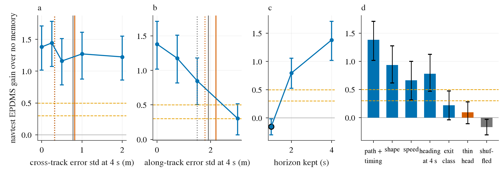

# op_parity path-req: how accurate does a path-predictive memory signal have to be?

Written 2026-10-09. Follow-up of the geo-e2e ([geo_e2e.md](geo_e2e.md), decision 200). Pre-registration:
[plans/2026-10-09-path-req-prereg.md](../plans/2026-10-09-path-req-prereg.md) (committed and pushed before any score was read, with the smoke result
and the measured VRAM). Code: `scripts/path_req.py`, `scripts/path_req_chain.sh`, `pp_train.py --mem-e2e q<kind> / --mem-lr`. Tables:
[path_req/](path_req/) (`tables.md` every arm, `arms.csv`, `curve.json`, `verdict.json`, `ref.json`, `gate_dev.json`). Decision 204.

**Every arm below except QH feeds the policy a field computed from the LOGGED FUTURE trajectory: leaked-label ORACLE PROBES, not a method and never
a reportable inference path.** QH reads the path predicted by a thin head on frozen Cinque tokens (no privileged input; a reference point, not a
method). No WA-JEPA weights or features. Pilot scale (decisions 197 / 200: SH30 pilot recipe, `navsim/op-parity-s234`, 3 000 steps x 64), baseline
H0 = `GH0-F-s0 / s1` reused (88.48), navtest 12 146 tokens, per-token seed means, 95% CI by log-cluster paired bootstrap (B 4 000).

## Answer

1. **Reliability: fixed.** With the tokenizer pre-trained with its own thin head and then trained jointly (QF), the undegraded oracle is read on
   **3 of 3 seeds** (dev ADE 0.365 / 0.367 / 0.378 m vs 0.63 without memory; 2.1-2.2 m with another log's field). Random init is 1 of 3 (QFC),
   random init with a 3.3 x tokenizer learning rate 0 of 3 (QFL). navtest: QF - H0 **+1.38 [+1.02, +1.71]** (per seed +1.52 / +1.24 / +1.38, each CI
   above 0), QF - shuffled control +1.55 [+1.19, +1.89], memory masked at test -1.52 [-1.89, -1.14]. Both registered gates met.
2. **The curve (gain over H0, leaked-label oracle probes).**

   | axis | level | arm | EPDMS gain | read |
   |:--|:--|:--|:--|:--|
   | undegraded | path + timing, 4 s | QF (3 seeds) | **+1.38 [+1.02, +1.71]** | yes |
   | cross-track error, std at 4 s | 0.25 m | QN025 | +1.44 [+1.07, +1.78] | yes |
   | | 0.5 m | QN050 | +1.16 [+0.78, +1.51] | yes |
   | | 1.0 m | QN100 | +1.27 [+0.88, +1.61] | yes |
   | | 2.0 m | QN200 | +1.22 [+0.86, +1.55] | yes |
   | along-track error, std at 4 s | 0.75 m | QL075 | +1.18 [+0.82, +1.51] | yes |
   | | 1.5 m | QL150 | +0.85 [+0.51, +1.18] | yes |
   | | 3.0 m | QL300 | +0.30 [+0.07, +0.51] | yes |
   | horizon kept | 2 s | QT2 | +0.79 [+0.52, +1.06] | yes |
   | | 1 s | QT1 | -0.15 [-0.30, -0.02] | **no** (unmeasured, not "worth 0") |
   | content kept | path shape only | QS | +0.93 [+0.62, +1.27] | yes |
   | | speed profile only | QV | +0.66 [+0.31, +1.00] | yes |
   | | heading at 4 s only | QCH | +0.78 [+0.47, +1.12] | yes |
   | | exit class only (7) | QC7 | +0.22 [-0.04, +0.47] | yes |
   | shuffled control | another log's field | QX | -0.17 [-0.31, -0.03] | no (by design) |
   | **not privileged** | thin-head path | **QH** | **+0.09 [-0.11, +0.28]** | yes (weakly) |

   Registered tolerance levels (last level whose CI low is still >= the line / first level below it), identical for the +0.5 and +0.3 lines:
   cross-track **2.0 m / none found** (the axis never drops; the largest tested level still passes); along-track **1.5 m / 3.0 m**; horizon
   **2 s / 1 s** (the 1 s arm was not read, so the lower end is unmeasured). Content: shape alone and speed profile alone each pass +0.3 (shape
   also +0.5); heading at 4 s passes +0.3 and misses +0.5 by 0.03 on the CI low; the 7-way exit class passes neither.
3. **Where non-privileged predictors sit (navtest, error to the log at 4 s, RMS / robust sigma).** Pilot policy's own plan H0: cross-track
   0.77 / 0.33 m, along-track 1.91 / 1.50 m, ADE 0.640. Full-data SH30: 0.67 / 0.30, 1.71 / 1.35, ADE 0.577. Thin head on frozen Cinque tokens:
   0.82 / 0.32, 2.20 / 1.79, ADE 0.764. Cross-track: all inside the tolerance. Along-track: by RMS (the registered statistic) all three fall
   **between the tested levels** 1.5 and 3.0 m, i.e. the registered rule returns "undetermined"; by robust sigma the two policy plans sit at or
   under 1.5 m and the thin head between. Rule 3 ("must be more accurate than the policy's own plan") does not fire on the noise curve: the
   first failing level, 3.0 m, is above H0's 1.91 m.
4. **The direct read overrides the conversion and is negative.** The thin head's path, fed through the same channel, is read (dev ADE with
   another log's field 1.02 m vs 0.62; QH - QX +0.26 [+0.08, +0.44]) and worth **+0.09 [-0.11, +0.28]** over H0: the whole CI is below +0.3. Its
   plan is no closer to the log (ADE 0.649 vs 0.640). An *independent* error of the same size still pays +0.85 (QL150); an error made from the
   same frozen features pays nothing.
5. **Plain answer.** A path-predictive branch is worth building only if it carries information the frozen-feature policy does not already have.
   A branch that re-predicts the path from the same frozen Cinque features (today's thin head: along-track 2.2 m RMS, worse than the policy's own
   1.9 m) adds nothing when fed back. What a useful branch has to deliver, in the plan the policy ends up with: along-track error at 4 s down from
   1.91 m to about 1.3 m for +0.85 (QL150's plan) or about 1.0 m for +1.4 (QF's plan), and / or the heading at 4 s to about 3.7 deg RMS from 7.4
   (QCH, +0.78, all of it on turns). Cross-track precision is not the requirement: 2 m of cross-track noise at 4 s costs nothing measurable. In
   that sense yes, the signal has to beat the policy's own plan in the two quantities that pay (speed over 2-4 s, heading at 4 s); it does not
   need a precise path. The lane's answer for "feed a frozen-feature path prediction back in" is **negative**; for a branch with new information
   (unfrozen or different features, supervised on speed profile and exit heading) the curve gives the targets above.

What to look at: (a) the gain is flat in cross-track error up to 2 m; (b) it falls with along-track error and reaches the lines between 1.5 and
3 m, with the non-privileged predictors (grey: the pilot policy's own plan; red: the thin head; solid RMS, dotted robust sigma) inside that gap;
(c) 2 s of trajectory keeps +0.79, 1 s was not read (ringed point); (d) shape, speed profile and 4 s heading each keep about half or more of the
gain, the exit class little, and the thin head's own path (red, not privileged) none. Dashed lines: +0.5 and +0.3. Error bars: 95% CI.

## What each kind of content buys (difference to H0)

| arm | < 5 deg | 5-20 deg | 20-45 deg | > 45 deg | NC + TTC fail % | cannot-make-turn %, > 45 deg | inside-cut %, > 45 deg | DAC fail %, > 20 deg | EP |
|:--|:--|:--|:--|:--|:--|:--|:--|:--|:--|
| QF path + timing | +1.28 [+0.84, +1.72] | +1.20 [+0.50, +1.96] | +2.22 [+1.46, +3.11] | +1.22 [+0.07, +2.37] | -0.98 [-1.30, -0.65] | -1.53 [-2.22, -0.84] | +0.87 [+0.08, +1.61] | -0.96 [-1.76, -0.18] | +0.25 [+0.03, +0.47] |
| QS shape only | +0.17 [-0.04, +0.37] | +1.10 [+0.58, +1.64] | +2.27 [+1.08, +3.60] | +2.44 [+1.24, +3.76] | -0.17 [-0.33, -0.02] | -2.64 [-3.68, -1.59] | +0.13 [-0.70, +0.93] | -1.65 [-2.74, -0.60] | +0.28 [+0.17, +0.39] |
| QCH heading at 4 s | +0.09 [-0.13, +0.30] | +1.00 [+0.43, +1.61] | +2.14 [+0.94, +3.45] | +1.86 [+0.70, +3.09] | -0.11 [-0.25, +0.04] | -2.74 [-3.85, -1.62] | +0.30 [-0.53, +1.11] | -1.35 [-2.50, -0.29] | +0.24 [+0.15, +0.33] |
| QC7 exit class | +0.02 [-0.19, +0.22] | +0.71 [+0.21, +1.26] | +1.05 [+0.26, +1.89] | -0.65 [-1.92, +0.59] | -0.06 [-0.19, +0.07] | -0.86 [-1.56, -0.12] | +1.75 [+0.89, +2.75] | +0.13 [-0.76, +0.99] | +0.17 [+0.09, +0.25] |
| QV speed profile only | +1.00 [+0.51, +1.48] | +0.68 [+0.09, +1.34] | +0.54 [-0.44, +1.55] | -0.64 [-1.39, +0.08] | -0.78 [-1.10, -0.44] | +0.13 [-0.57, +0.86] | +0.26 [-0.22, +0.84] | +0.05 [-0.54, +0.68] | -0.04 [-0.24, +0.17] |
| QT2 first 2 s | +0.80 [+0.49, +1.10] | +0.97 [+0.36, +1.68] | +0.54 [-0.22, +1.31] | +0.72 [-0.07, +1.57] | -0.64 [-0.88, -0.39] | -0.63 [-1.54, +0.19] | -0.30 [-0.93, +0.27] | -0.57 [-1.15, -0.05] | +0.03 [-0.12, +0.16] |
| QL300 along-track 3 m | +0.36 [+0.10, +0.60] | +0.50 [+0.02, +0.97] | +0.61 [-0.04, +1.30] | -0.57 [-1.66, +0.50] | -0.30 [-0.45, -0.14] | -1.09 [-1.77, -0.38] | +1.05 [+0.23, +1.85] | -0.13 [-0.76, +0.56] | +0.10 [-0.01, +0.23] |
| QH thin-head path (not privileged) | +0.10 [-0.09, +0.28] | +0.14 [-0.29, +0.55] | +0.17 [-0.53, +0.78] | -0.11 [-0.63, +0.42] | -0.02 [-0.19, +0.17] | -0.23 [-0.87, +0.48] | +0.00 [-0.36, +0.38] | -0.16 [-0.56, +0.27] | +0.21 [+0.12, +0.30] |

All rows but the last are leaked-label oracle probes. Sub-scores of QF: NC +0.77 [+0.47, +1.05], TTC +0.98 [+0.64, +1.30], DAC +0.42 [+0.18, +0.67].

## Reading

1. The gain splits cleanly into two parts that hardly overlap. **Speed over the next seconds** (QV) pays on straight and gently curving road
   through NC and TTC (NC + TTC failures -0.78 pp, < 5 deg +1.00) and does nothing for turns. **Where the path goes** (QS, QCH) pays on turns
   (> 45 deg +2.44 / +1.86, cannot-make-turn -2.6 / -2.7 pp of a 4.2% base, > 20 deg DAC failures -1.65 / -1.35 pp) and does nothing on straight
   road or for collisions. +0.93 and +0.66 add up to slightly more than QF's +1.38.
2. For the turn part the heading at 4 s is almost the whole signal: a 20 m arc that only ends at the right heading gives +0.78 against +0.93 for
   the full shape, with the same cannot-make-turn reduction. Quantised to the turn bucket it loses most of it and trades cannot-make-turn for
   inside cuts (+1.75 pp): the policy needs the heading to roughly 10 deg, not the class. This is the first input that moves decision 153 / 166's
   "cannot make the turn" failures, and it is not geometry.
3. Cross-track noise up to 2 m at 4 s (path ADE 0.74 m, more than the policy's own 0.64 m) changes nothing, while the plans of those arms keep the
   cross-track error of the clean arm (0.56-0.61 m vs 0.77 for H0). The policy takes speed and the turn's direction from the field and keeps its own lateral placement.
4. The along-track axis is the one that degrades: +1.18 / +0.85 / +0.30 at 0.75 / 1.5 / 3.0 m. The plans' own along-track error at 4 s follows
   (0.98 m clean, 1.12 / 1.32 / 1.59, H0 1.91), and the gain is close to linear in it.
5. The same error size means different things for an oracle and for a real predictor. QL150's input has a 1.5 m independent error and is worth
   +0.85; the thin head's along-track error is 2.2 m RMS (1.8 robust) and its path is worth +0.09. The noise curve is an upper bound for a given
   error size, as registered; the direct arm says the bound is far from reached when the predictor shares the policy's features. The useful
   requirement is therefore stated on the outcome (item 5 of the answer), not on the branch's standalone error.
6. For plan.md 2.1 / L1: the branch's target should be the two plan-predictive quantities that pay (speed profile over 2-4 s, heading at 4 s),
   it has to be pre-trained with its own head before it is attached (1 of 3 and 0 of 3 seeds otherwise), and a stage-0 check is now available
   before any pilot: a branch whose own head does not beat the policy's plan on along-track error at 4 s (1.9 m pilot, 1.7 m full) or on heading at
   4 s (7.4 deg) on held-out logs has no reason to help. Decision 196 (53% of NC failures are a stopped / slow vehicle ahead) is the same finding
   from the failure side: the speed part is where NC is.

## Channel-read checks

Every arm: [path_req/tables.md](path_req/tables.md) (arm - QX, memory masked - on, dev ADE on / masked / mismatched per seed). All degraded arms are
read by the registered rule except QT1 (dev ADE with another log's field 0.647 / 0.643 vs 0.620 / 0.623, ratio 1.04 / 1.03; QT1 - QX +0.01
[-0.10, +0.12]): a 1 s stub was not picked up, so its point is unmeasured. QL300's masked read on seed 0 is -0.27 [-0.56, +0.05] with a clear dev
signature (0.535 on, 0.940 mismatched). QC7 is read (dev 0.61 / 0.71, vs QX +0.39 [+0.15, +0.62]) and worth little. QX sits 0.17 below H0, on
> 45 deg -0.99 [-1.49, -0.46]: a trained channel with unrelated content is a small nuisance, as in decision 200.
Tokenizer pre-training (own thin head, dev ADE with the row's own / another log's field): QF 0.07 / 7.0 m, QN200 0.17 / 6.9, QL300 0.64 / 6.3,
QT1 0.58 / 7.4, QS 1.04 / 2.6, QV 0.41 / 6.7, QCH 1.18 / 1.9, QC7 1.24 / 1.7.

## Limits, and what would overturn this

- **QH's training rows are not as held-out as registered.** The thin head was fitted on shards outside the pilot's, but logs are shared across
  shards: its ADE is 0.55 m on the pilot's training rows against 0.71 m on dev and 0.76 m on navtest (0.18 in-sample). So QH was trained with a
  better signal than it gets at test. The prereg's "same distribution in train and test" is wrong. Dev rows are log-disjoint and show the same null
  (dev ADE 0.621 / 0.631 vs 0.630), but a log-disjoint refit of the head could move QH; the direction is unknown. Evidence for item 4: medium-weak.
- One thin head (2 of 8 slots, MLP). A stronger non-privileged predictor is exactly what L1 would build; this lane says what it must reach.
- Noise is Gaussian, independent of the policy's own error, one shape (t^1.5), one axis at a time; no arm between 1.5 and 3.0 m along-track, which
  is where the registered rule lands "undetermined".
- Pilot scale, one tokenizer and field encoding, 2 seeds per degraded arm (3 for QF), one channel. QF is not decision 200's JP (extra arrival-time
  channel, pre-trained start); JP's +1.24 on its one reading seed is in line with QF.
- QS is not perfectly speed-free (the logged path ends where the car is at 4 s; beyond it the field is a straight extension).
- QCH misses the +0.5 line by 0.03 on the CI low; "passes +0.3, not +0.5" is the registered reading.
- Would overturn item 4 / 5: a non-privileged path or speed / heading predictor on the same frozen features whose field, fed through this
  channel with log-disjoint training predictions, gains >= +0.5 with CI low > 0. Would sharpen item 3: arms at 2.0 / 2.5 m along-track.

## Verified / not verified

- Verified: all 50 registered navtest reads complete (12 146 tokens each, none missing); the shards cancelled during the mid-run pause (archived
  `ERROR.20261009-152729`) carry a later DONE; replay DAC equals bench DAC on every failing token of the 35 unmasked reads (0 disagreements, 0
  unreplayed); 39 trainings pass `pp_full_check.py train`; realised input error of the noise arms within 5% of nominal (cross-track) and 2-3% below
  nominal (along-track, clipped at standstill); QX's permutation has no row from its own log; prereg pushed before the first score.
- Not verified: variance beyond 2 seeds on degraded arms; QH with a log-disjoint head; QFC / QFL were not scored on navtest (dev reads only, as registered).
- Not done: L1 (no front-view branch was trained), navhard, HUGSIM, full data.

## Deviations from the pre-registration

- The chain was paused by the main session at 12:43 (box handed to AlpaSim) and resumed at 15:26; 9 of the 30 stage-2 reads were scored after
  the pause. No arm, level, line or read-out changed; no score was read before its gate.
- The statement that QH's training-row predictions are held-out does not hold at log level (first limit above).

## Cost

GPU, summed job wall time: 39 trainings 4.6 h, 14 tokenizer pre-trainings 0.27 h, thin head and smokes about 0.1 h, 50 plan exports about 1.2 h
(estimated at 1.5 min each): about 6.2 card-hours of the 8 budgeted; jobs shared cards three to a card, so card occupancy was lower. CPU: 50
navtest scorings and 3 replays through the pool.
