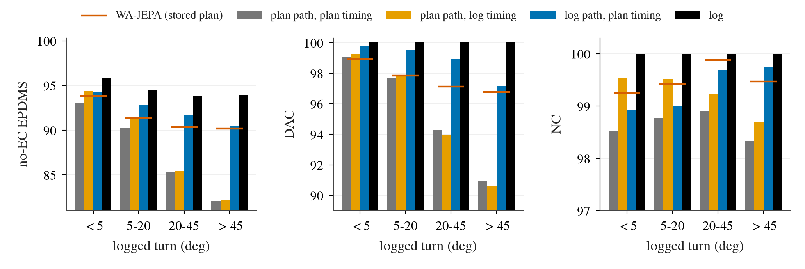
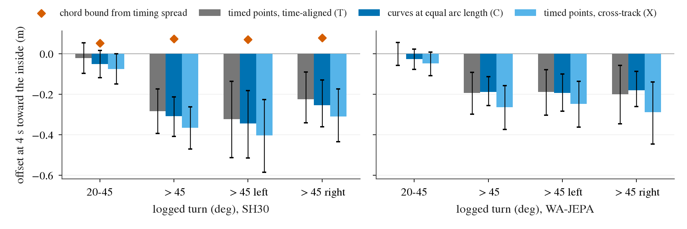

# op_parity path-timing swap: is the turn-token DAC gap a wrong path or a path / timing coupling? (lane SW1)

Written 2026-10-09. Measurement only: stored plans, stored per-token scores, the token table; CPU re-scoring. No model was run, no WA-JEPA inference.
Pre-registration [plans/2026-10-09-path-timing-swap-prereg.md](../plans/2026-10-09-path-timing-swap-prereg.md) (with amendment A), pushed before any
swapped score or offset was read. Code `scripts/pt_swap.py`, `scripts/pt_swap_chain.sh`. Every table: [pt_swap/tables.md](pt_swap/tables.md); CSVs and
`summary.json` next to it. navtest 12 146 tokens, 136 logs; 95% CIs are log-cluster bootstraps (B 10 000). Decision 207.

**The log path and the log timing are privileged inputs. Every swapped cell below is an analysis swap, not a method and not a reportable inference path.**

## What was swapped (as registered)

- **Curve** of a trajectory (plan or log): cubic spline through the origin and its 8 poses over chord length, yaw linear in arc length. **Timing** = its own
  arc length at 0.5 .. 4 s. No curve needed the polyline fallback.
- **PP** = the stored plan (identity gate: all 8 sub-scores equal the bench archive on every token, all 8 members, 0 differing rows).
  **PL** = the plan's curve re-timed with the log's arc-length profile. **LP** = the log's curve driven with the plan's arc-length profile. **LL** = the log.
- Beyond a curve's end: constant-curvature arc from the last pose (main rule), or a straight line (sensitivity, SH30 only: PLX / LPX).
  PL needs some extension on 55% of the > 20 deg token-seeds (> 0.5 m on 42%, > 2 m on 12%), LP on 45% (32%, 8%).
- Scored by `python -m jevdrive.bench score-poses --traffic non_reactive` (no-EC EPDMS, decision 196's convention); failure side from decision 153's replay.
- Models: SH30 (2 seeds, primary), RMH10 (2), P2 (seed 0 only: seed 1's plans are not stored), OT30 (2), WA-JEPA (stored trajectories on 12 027 tokens, comparison column).

## Verdict against the registered lines: FALSIFIED

| line | registered | measured (SH30, > 20 deg, 3 154 tokens x 2 seeds) | band |
|:--|:--|:--|:--|
| (a) share of DAC failures removed by PL | supported >= 40% (CI low > 25%), falsified < 15% | gross **12.6% [7.7, 18.0]**; net **-5.0% [-13.5, +3.7]** (230.5 -> 242.0 failures) | falsified |
| (b) rho = curve offset C / timed offset T (inside positive) | supported < 0.5, falsified >= 0.8 | premise fails: the timed points are not inside on average, T = -0.070 m [-0.101, -0.039], C = -0.076 m [-0.103, -0.049]; C / T = 1.08 [1.01, 1.26] | curve offset = timed offset |

Controls on (a): straight extension gives the same 12.6%; on the token-seeds with extension <= 0.5 m PL removes 19.5% [11.9, 27.5] (partial band), but that
subset is mostly plans re-timed to cover *less* of their path. Where the re-timed plan covers at least the stored plan's arc length, PL removes
**2.0% [0.0, 4.2]** of the DAC failures and adds 30% more; where it covers less, 24.5% [15.1, 34.7]: the horizon effect of decision 178 / 186, not a coupling.
By the registered rule (the band less favourable to the hypothesis) the verdict is falsified.

## The 2 x 2 (no-EC EPDMS x 100, seed means; swapped cells are privileged)

| model | tokens | PP stored plan | PL plan path, log timing | LP log path, plan timing | LL log |
|:--|:--|--:|--:|--:|--:|
| SH30 | all (12 146) | 90.07 | 91.01, +0.95 [+0.57, +1.31] | **93.13**, +3.07 [+2.43, +3.70] | 95.05 |
| SH30 | > 20 deg (3 154) | 83.74 | 83.88, +0.14 [-0.51, +0.84] | **91.13**, +7.39 [+5.83, +8.91] | 93.85 |
| SH30 | > 45 deg (1 517) | 82.07 | 82.22, +0.15 [-0.63, +0.86] | **90.47**, +8.40 [+5.81, +10.88] | 93.92 |
| WA-JEPA | all (12 027) | 92.37 | 92.77, +0.40 [+0.12, +0.68] | **93.92**, +1.55 [+1.16, +1.96] | 95.04 |
| WA-JEPA | > 20 deg | 90.26 | 90.18, -0.08 [-0.56, +0.38] | **92.30**, +2.04 [+1.10, +2.98] | 93.85 |
| WA-JEPA | > 45 deg | 90.16 | 90.10, -0.06 [-0.70, +0.57] | **91.63**, +1.47 [+0.05, +3.00] | 93.92 |

Read it by row: on turn tokens the whole distance to the log sits in the path column, for both models; the timing column is zero there. The timing column is
worth about +1.2 on tokens under 20 deg, through NC and TTC (SH30 NC 98.60 -> 99.38, TTC 98.00 -> 98.87 overall), which is decision 196's longitudinal finding.

What to look at: in the DAC panel the orange bar (plan path, log timing) never leaves the grey bar (stored plan), while the blue bar (log path, plan timing)
goes above WA-JEPA's line in every bucket. In the NC panel the order flips on the two straight buckets: there timing is the larger half.

**SH30 failures removed, > 20 deg / > 45 deg** (gross = share of the stored plan's failures that pass; net counts new failures):

| set | bucket | PP failures (seed mean) | PL gross | PL net | LP gross | LP net |
|:--|:--|--:|--:|--:|--:|--:|
| DAC | > 20 deg | 230.5 | 12.6% [7.7, 18.0] | -5.0% [-13.5, +3.7] | **94.6% [91.9, 97.1]** | 73.8% [61.3, 83.7] |
| DAC | > 45 deg | 137.0 | 10.6% [4.9, 16.9] | -4.0% [-12.6, +3.9] | **94.2% [90.2, 97.8]** | 68.6% [48.7, 82.8] |
| NC + TTC | > 20 deg | 86.0 | 32.6% [22.1, 42.7] | 15.1% [-3.0, +29.2] | **79.1% [70.7, 89.4]** | 66.9% [54.2, 79.2] |
| NC + TTC | > 45 deg | 41.0 | 32.9% [15.8, 46.2] | 20.7% [-7.8, +38.4] | **79.3% [65.3, 96.4]** | 69.5% [53.8, 88.1] |
| NC + TTC | all tokens | 264.0 | 54.0% [44.6, 62.6] | 40.5% [27.4, 51.2] | 54.9% [46.4, 64.5] | 45.8% [35.9, 56.2] |

LP's net is below its gross because the log curve is extended where the plan drives further than the log did; with extension <= 0.5 m LP removes 97.9% gross /
93.4% net of the > 20 deg DAC failures. Even the collisions on turn tokens are mostly a path matter (LP 79%, PL 33%); over all tokens the two halves are equal.

**> 45 deg failure kinds** (% of tokens, decision 153 definitions): stored plan inside-cut 4.28, cannot-make-turn 2.47, other 2.27. PL: 4.88 (+0.59 [+0.15, +1.07]),
2.97 (+0.49 [+0.07, +0.90]), 1.55: re-timing makes both turn failures slightly worse. LP: 2.67, 0.00, 0.16; the remaining inside-cuts are the extended log curve.

**Gap to WA-JEPA** (no-EC gap 2.34 [1.67, 2.97] on 12 146 tokens; 2.16 with EC): PL closes 40% [24, 62] of it, all on tokens under 20 deg; on > 20 deg it closes
2% [-8, +13] of the 6.52 there. LP closes 131% [111, 165] overall and 113% [97, 133] on > 20 deg (104% on > 45 deg): SH30 on the log's path with its own timing scores
above WA-JEPA.

**Other arms**: the decomposition is the same without the hinge and with the weak one. PL / LP gross removal of > 20 deg DAC failures: P2 11.7% / 95.9%, RMH10 12.4% / 94.2%,
OT30 12.3% / 93.9%, WA-JEPA 22.9% / 88.5%. The strong hinge changes how many path failures there are (P2 317 -> SH30 230.5), not what they are.

**By direction** (SH30 DAC failure rate, PP / PL / LP): > 45 deg left 7.24 / 7.79 / 3.05%, right 11.77 / 11.85 / 2.50%. Right turns fail more, and they are path failures
as well (LP removes 95.7% [92.0, 99.3], PL 13.5%).

## Offsets without the scorer (m, inside of the logged turn positive)

T = plan point minus log point at the same time, along the log's normal; C = plan curve minus log curve at the same arc length; X = cross-track distance of the plan
points to the log curve. At 4 s:

| model | bucket | T timed | C curve | X cross-track | mean \|C\| | C > +0.3 m | C < -0.3 m |
|:--|:--|--:|--:|--:|--:|--:|--:|
| SH30 | 20-45 deg | -0.022 [-0.096, +0.054] | -0.051 [-0.118, +0.016] | -0.076 | 0.554 | 28% | 34% |
| SH30 | > 45 deg | -0.284 [-0.394, -0.174] | -0.309 [-0.408, -0.214] | -0.366 | 0.883 | 25% | 51% |
| SH30 | > 45 deg left | -0.323 [-0.512, -0.137] | -0.345 [-0.515, -0.182] | -0.403 | | 25% | 52% |
| SH30 | > 45 deg right | -0.225 [-0.341, -0.091] | -0.254 [-0.361, -0.129] | -0.311 | | 25% | 49% |
| WA-JEPA | 20-45 deg | -0.001 [-0.058, +0.055] | -0.026 [-0.078, +0.023] | -0.048 | 0.353 | 19% | 22% |
| WA-JEPA | > 45 deg | -0.193 [-0.298, -0.092] | -0.188 [-0.256, -0.114] | -0.264 | 0.459 | 16% | 35% |

What to look at: the grey (timed) and blue (curve) bars are the same height in every group, so the lateral error is in the curve, not in the timing; all bars point
outward (negative), the opposite of what an inward chord bias predicts; the red diamonds (the inward offset that averaging over the observed timing spread could
produce, +0.06 to +0.08 m at 4 s) are small and on the other side of zero.

- **No mean inside bias.** SH30's curves are on average *outside* the log's on turns, and two-sided: at 4 s 26% of the > 20 deg tokens are more than 0.3 m inside and
  42% more than 0.3 m outside. The size of the error is what separates the models: mean |C(4 s)| 0.71 m against WA-JEPA's 0.40 m on > 20 deg, 0.88 against 0.46 m on
  > 45 deg. P2 (0.69) and RMH10 (0.69) have SH30's spread; the strong hinge moved the mean outward by about 0.05 m (mean C over the horizon -0.076 against -0.027 / -0.030)
  and left the spread (post hoc).
- **The failures are curve errors of about a metre** (post hoc): SH30's inside-cut tokens have C(4 s) = +0.89 m (> 45 deg: +1.05 m), cannot-make-turn tokens -1.27 m (-1.39 m),
  passing tokens -0.20 m. Their along-track shortfall is ordinary (+0.17 / +0.18 m against +0.19 m for passing tokens).
- **Chord magnitude (E1).** Averaging the log's own curve over the observed spread of the arc-length ratio (moving tokens, ratio clipped to [1/3, 3], per turn x speed
  cell) gives +0.019 m inside over the horizon and +0.063 m [0.057, 0.068] at 4 s on > 20 deg (> 45 deg: +0.073 m). The failures need about 1 m.
- **Relation to the shortfall (E2).** z = curvature x (arc difference)^2 / 2. (T - C) on z has slope 1.13 [0.88, 1.36] where the plan is shorter: the time-aligned
  comparison does contain the geometric term, about 0.03 m at 4 s. C on z: slope -0.16 [-0.40, +0.03], Spearman -0.01: the curve error does not grow with
  curvature x shortfall. C on the signed shortfall: +0.089 m per m [+0.049, +0.134]; a plan that drives 1 m less than the log sits 9 cm further inside.

## What it says

The hypothesis is false on both registered lines and on the two added read-outs. The turn-token DAC gap is the geometric path: put SH30's own speed profile on the
log's path and 95% of its turn DAC failures and 79% of its turn collisions are gone and it scores above WA-JEPA; put the log's speed profile on SH30's path and nothing
changes on turns. The path error is not an inward bias from averaging over timing: it is two-sided, about 0.7 m in size at 4 s (WA-JEPA 0.4 m), slightly outward on
average, and unrelated to curvature x shortfall. Per the registered conclusions, the lever is the path shape itself on turn tokens (which radius / exit, and how
precisely), not the output parameterisation: a path-curve plus speed-profile head, or a non-averaging head motivated by timing uncertainty, would not move turn DAC.
Timing is a real, separate lever of about +0.95 EPDMS, on straight tokens, through NC / TTC (decision 196).

## Limits

- Open loop, non-reactive traffic, no-EC EPDMS; the swapped cells use the log and are upper-bound style read-outs, not attainable scores.
- The log path is one admissible path. "Path error" is distance to the path the human took; a plan on another valid lane counts as error in C, though not in DAC.
- About half of the token-seeds need some extrapolation in each swapped cell. The verdict is the same under both extension rules and in the <= 0.5 m subset once the
  horizon effect is controlled, but LP's net figures (new failures on the extended log curve) depend on the rule (> 45 deg net 68.6% arc, 80.3% straight).
- E1 is a magnitude estimate, not a strict bound (ratio clipped, moving tokens only), and it covers averaging over *timing* only. Averaging over *path* alternatives
  (which exit, which lane) is not tested here and would produce exactly a two-sided curve error; nothing in this lane separates it from plain imprecision.
- The dispersion, failure-kind and direction tables are post hoc. WA-JEPA is one checkpoint with trajectories on 12 027 tokens; P2 is one seed.
- Curves are splines through 9 poses at 2 Hz; offsets under about 0.05 m are below the construction's resolution.
