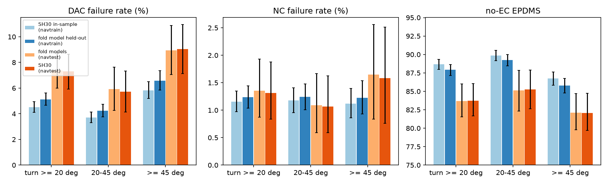
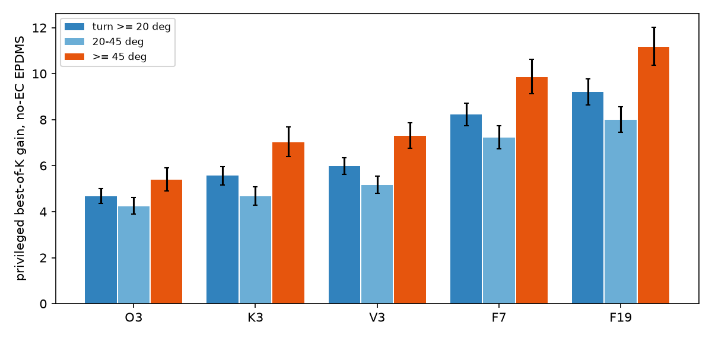

# op_parity sh30-crossfit: held-out SH30 plans and simulator labels for the navtrain turn tokens

Written 2026-10-08. Pre-registration: [plans/2026-10-08-sh30-crossfit-prereg.md](../plans/2026-10-08-sh30-crossfit-prereg.md) (committed before any new score was read).
Code: `scripts/sh30_crossfit.py`, `scripts/sh30_crossfit_chain.sh`; `pp_train.split_rows` gained unit = log. Tables: [sh30_crossfit/](sh30_crossfit/); figures: [figs/sh30_crossfit/](../figs/sh30_crossfit/).

## Answer

1. **K = 5**, log-disjoint folds of navtrain (1 192 logs, `fold = sha256("cf5|" + log) % 5`, splits `navsim/op-parity-cf5f{j}-{train,dev}`). One SH30 recipe training per fold (decision 170, seed 0), 78-80% of SH30's training tokens each. Reason: 40 min per training independent of data size, so K = 5 (3.3 card-h) is the largest K inside 5 card-h, and each model keeps 80% of the data.
2. **Recipe gate passed.** Fold models on navtest EPDMS 89.43 / 89.42 / 89.44 / 89.51 / 89.52, mean 89.46 against SH30 89.55 (89.47 / 89.63) and P2H10 88.67; rule was mean >= 89.05 and every fold >= 88.67. The 20% data cut costs about 0.09.
3. **Held-out plans exported and scored** for all 28 323 turn tokens (median ADE to the log 0.547 m; in-sample SH30 0.52 m).
4. **Verdict (pre-registered rule, pooled >= 20 deg DAC failure): "navtrain turns are easier", the in-sample effect is real but smaller.** Of the 4.51% -> 7.31% gap (+2.79 pp [+1.35, +4.18]) the in-sample part is +0.61 pp [+0.47, +0.77] (21%), the navtrain-vs-navtest difficulty part is +2.25 pp [+0.78, +3.69] (81%, both CIs exclude 0, share 0.21 < 0.33), the weaker-fold-model part is -0.07 pp [-0.32, +0.16] (not distinguishable from 0, below the 25% flag). Held-out plans do **not** reproduce the navtest level (5.13% vs 7.38% for the same model class on navtest). They are far closer than in-sample but not equal.

## Diagnostic (log-clustered 95% CIs, B 10 000, no-EC, navtrain and navtest resampled independently)

B = SH30 in-sample navtrain (2-seed mean), A = fold model held-out navtrain, D = the 5 fold models on navtest (per-token mean), C = SH30 navtest (2-seed mean).
mem = A - B, dom = D - A, mod = C - D (telescopes to C - B).

| bucket | metric | B | A | D | C | mem | dom | mod | gap C-B |
|:--|:--|--:|--:|--:|--:|--:|--:|--:|--:|
| >= 20 deg (28 323 / 3 154) | DAC fail % | 4.51 [4.10, 4.95] | 5.13 [4.66, 5.62] | 7.38 [6.00, 8.73] | 7.31 [5.93, 8.64] | +0.61 [+0.47, +0.77] | +2.25 [+0.78, +3.69] | -0.07 [-0.32, +0.16] | +2.79 [+1.35, +4.18] |
| | NC fail % | 1.16 | 1.24 | 1.36 | 1.32 | +0.08 [+0.03, +0.14] | +0.12 [-0.41, +0.74] | -0.04 | +0.16 |
| | no-EC EPDMS | 88.68 [87.97, 89.35] | 87.92 [87.15, 88.64] | 83.68 [81.56, 86.00] | 83.74 [81.65, 86.04] | -0.76 [-0.92, -0.61] | -4.24 [-6.47, -1.80] | +0.06 | -4.94 [-7.12, -2.56] |
| 20-45 (17 550 / 1 637) | DAC fail % | 3.70 | 4.23 | 5.93 | 5.71 | +0.53 [+0.37, +0.71] | +1.69 [-0.03, +3.49] | -0.21 | +2.01 |
| | no-EC EPDMS | 89.87 | 89.23 | 85.14 | 85.28 | -0.63 | -4.09 [-6.98, -1.25] | +0.14 | -4.59 |
| >= 45 (10 773 / 1 517) | DAC fail % | 5.83 | 6.58 | 8.95 | 9.03 | +0.75 [+0.50, +1.03] | +2.37 [+0.28, +4.40] | +0.08 | +3.20 |
| | no-EC EPDMS | 86.73 | 85.77 | 82.11 | 82.07 | -0.96 | -3.67 [-6.15, -0.89] | -0.03 | -4.66 |

Per fold (held-out navtrain turns of the fold, the fold model on navtest turns): DAC fail held-out 5.00 / 5.82 / 5.46 / 4.17 / 5.18 against in-sample SH30 4.35 / 4.98 / 4.85 / 3.87 / 4.53 and the same model on navtest 7.64 / 7.17 / 7.48 / 7.23 / 7.39 ([diag_perfold.csv](sh30_crossfit/diag_perfold.csv)). Every fold shows the same order.
NC failure is not separated (all CIs overlap). Full table with all CIs: [diag_table.csv](sh30_crossfit/diag_table.csv); figure [diag.png](../figs/sh30_crossfit/diag.png).

## Held-out ceiling table (step 4; one plan per token, privileged best-of-K, no-EC EPDMS, log-clustered CI)

Family: **F19 only** (identity, six single-axis and twelve two-axis points of turn_ceiling's grid). The pre-registered cost ladder chose it: measured 1.68 core-s per token for F19, 2.30 for F27, 2.76 for F33 (13.2 / 18.1 / 21.7 core-h), against a remaining budget of 10.4 core-h that used a conservative estimate of declared cores for the trainings (see cost). F27 / F33 (the joint-axis row and the outer points) were not scored. Stage 0 identity gate: c00 equals the held-out score on all 300 tokens, all sub-scores exactly.

| bucket | n | F19 gain | decision 178 (navtest, F19) |
|:--|--:|--:|--:|
| >= 20 deg | 28 323 | +9.20 [+8.65, +9.78] | +12.20 [+10.57, +13.76] |
| 20-45 | 17 550 | +8.00 [+7.45, ...] | +10.31 |
| >= 45 | 10 773 | +11.17 [+10.37, ...] | +14.24 |
| left / right | 19 689 / 8 634 | +8.13 / +11.65 | +10.78 / +14.57 |

Degrees of freedom (>= 20 deg): offset only +4.68 [+4.36, +5.02], curvature only +5.56 [+5.17, +5.97], speed only +5.98 [+5.63, +6.34], any single axis +8.22 [+7.73, +8.73], F19 +9.20, so two-axis moves add +0.98 over any single axis; O3 - K3 -0.88 [-1.09, -0.69], O3 - V3 -1.30 [-1.51, -1.09], K3 - V3 -0.41 [-0.63, -0.19]. Failure rates, identity -> F19 oracle: DAC 5.13% -> 0.16%, NC 1.24% -> 0.11%, EPDMS 87.92 -> 97.12. Offset is the weakest axis here as on navtest; unlike navtest, speed is now the strongest. Ceiling is lower than navtest's (+9.2 vs +12.2) because the identity plan is better on navtrain turns (87.9 vs 83.7), the oracle ends at 97.1 against 95.9 there.
Figure: [ceiling.png](../figs/sh30_crossfit/ceiling.png). These ceilings are **not de-watered** (decision 178 / turn-ceiling-dewater: EP gains and slow-downs that push failures past the 4 s horizon are credited), and are labels' upper bound, not a method.

## Cost (measured from the pool job records; wall x declared cores)

| step | jobs | card-h (GPU jobs) | core-h declared |
|:--|--:|--:|--:|
| 5 trainings (3 097-3 340 s each, concurrent with other lanes' jobs) | 5 | 4.42 | 26.6 (declared 6 cores each; measured use was 1-2 cores per job) |
| fold navtest runs (bench) | 45 | ~0 | 10.5 |
| navtrain plans + export, 5 models x 12 shards | 125 | 0.21 | 1.9 |
| score-poses: held-out (28 323 x 1 key), 300-token stage 0, F19 all tokens | 21 | 0 | 17.6 |
| total | | about 4.7 | about 56.6 declared |

Card-hours inside the 5 h budget. Declared core-hours exceed 40, driven by the declared 6 cores of the trainings (a measured figure per job was not collected; `cl usage` is not per owner).

## Labels on the box

`$DATA_DIR/runs/op_parity/sh30_crossfit/labels/`: `poses.npz` (held-out plan, key `h`, 28 323 x 8 x 3), `tokens.txt`, `fold_of_token.csv` (token, fold, log), `score.csv` (devkit sub-scores of `h`, non-reactive, v2_navtrain), `poses_f33.npz` (33 candidates around each plan), `cscore_all_F19.csv` (19 candidate scores per token), `cscore_t300_F33.csv`, `cgate.json`. Fold checkpoints `$DATA_DIR/runs/op_parity/runs/CF5f{0..4}-F-s0/ckpt-final.pt`. Splits in `jevdrive/data/splits/defs/navsim/op-parity-cf5f*`.

## Not checked

One seed per fold; fold models are weaker by 0.09 EPDMS than SH30 on navtest, so the labels come from a very slightly weaker policy. A and D each use a different model set than B and C, so "mod" is the only link between them. The in-sample 431 held-out dev tokens were not analysed separately. Navtrain turns being easier is shown as a level difference, not explained (city mix, speed, or log selection were not stratified). F27 / F33 and the joint-axis rows, Shapley sub-score split and small-K / selector rows of decision 178 were not computed. Labels are not de-watered. Held-out plans were exported through the same adapter-base path as nt-cache but not compared to an archived export.
