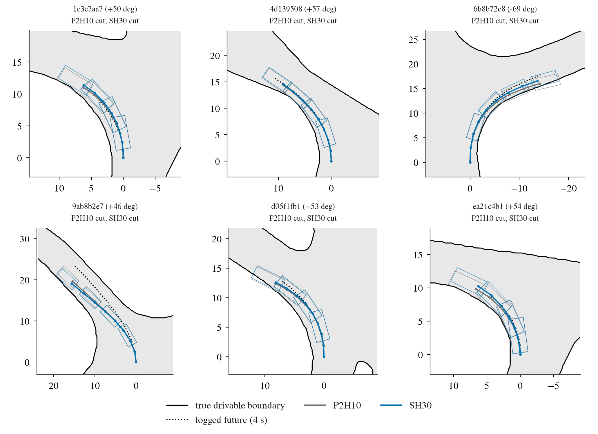
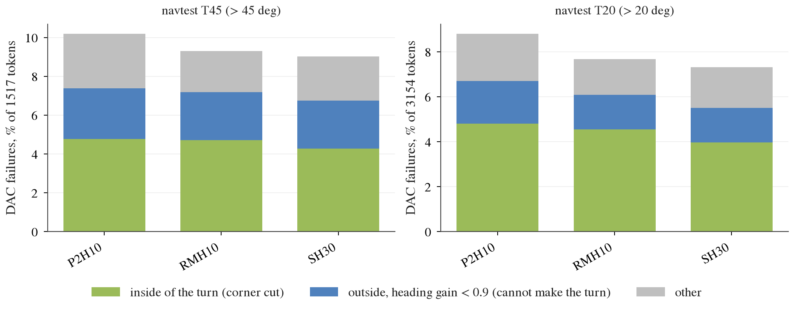

# op_parity strong-hinge: drivable hinge at lambda 30 / margin 0.5 m, full P2H10 recipe, no memory tokens

Written 2026-10-08. Pre-registration: [plans/2026-10-08-strong-hinge-prereg.md](../plans/2026-10-08-strong-hinge-prereg.md) (committed before any SH score). Code: `scripts/strong_hinge.py` (pilot gate),
`scripts/strong_hinge_chain.sh` (chain), reports through `scripts/turn_oracle.py report` (four_dirs replay, strata), `scripts/rh.py proxy / geomtab` (raw vs replay-only), `jevdrive.bench report`.
Tables / CSVs: [strong_hinge/](strong_hinge/). Arms: `SHP-F-s0` (pilot recipe, 3 000 steps, seed 0), `SH30-F-s0 / s1` (P2H10 recipe: 12 navtrain shards, 10 000 x 128, lambda 30, margin 0.5). Baselines are the stored `P2H10-F-s*` (lambda 10 / 0.3) and `RMH10-F-s*` (replay hinge, decision 161); nothing re-trained.

## Answer

**Yes: the objective change holds at full scale on both seeds, and unlike the replay hinge it is a real path improvement, not a replay-only one.**

1. Gate passed: SHP-F-s0 vs RH0-F-s0 EPDMS +0.52 [+0.34, +0.73] (stop below +0.3), straight (< 5 deg) EPDMS +0.15 [-0.06, +0.37] (stop below -0.2). Without memory tokens the pilot reproduces the OSh effect (+0.55).
2. navtest EPDMS **89.55** (89.47 / 89.63) vs P2H10 88.67: **+0.87 [+0.64, +1.15]**; vs RMH10 89.19: +0.35 [+0.14, +0.60]. WA-JEPA gap 3.04 -> 2.16. The gain is DAC (+0.96 of the +0.87 net; EP -0.00, NC / TTC / LK unchanged).
3. **Raw-plan out-of-bounds goes down** (the pre-registered test): all tokens 3.59 -> 2.45% per seed 0 (-1.14 [-1.47, -0.86] pp), seed 1 -1.28 [-1.64, -0.94]; > 20 deg -2.54 / -2.73 pp; replay-only departures do not move (-0.12 [-0.31, +0.06] / -0.21 [-0.39, -0.02] all; +0.10 / +0.03 on > 20 deg). Decision 161's RMH10 did the opposite (raw out +0.34, replay-only -0.49).
4. Sharp-turn inside cut falls modestly, the cannot-make-the-turn rate does not: > 45 deg inside-cut 4.78 -> 4.28% (-0.49 [-0.91, -0.16]), > 20 deg 4.80 -> 3.96% (-0.84 [-1.26, -0.45]), R < 15 m 5.60 -> 4.93% (-0.67 [-1.14, -0.29]); cannot-make-turn > 45 deg -0.13 [-0.42, +0.15].
5. No cost seen on progress or straight driving: EP all -0.00 [-0.03, +0.03], straight EP -0.00 [-0.04, +0.04], straight EPDMS +0.47 [+0.24, +0.74]. The larger margin did not buy DAC with slower driving.
6. Other boards: navhard combined +1.83 [+0.42, +3.37] vs P2H10 (stage 2 +1.64 [+0.33, +3.06]); HUGSIM 64 `spec_plan_smooth` HD +0.006 [-0.015, +0.031], turn23 -0.023 [-0.049, -0.002] (same sign as RMH10's -0.016).

By the pre-registered test (EPDMS CI > 0, raw-plan out-of-bounds down with CI excluding 0, > 45 deg inside-cut point estimate down): all three hold. The effect is still modest on the part decision 153 cares about: > 45 deg DAC failures 10.18 -> 9.03% and the 7.9-point gap to WA-JEPA on > 45 deg tokens (79.49 vs 87.41) is unchanged from RMH10.

## navtest (12 146 tokens; seed means; diff vs P2H10, log-cluster paired bootstrap, 136 logs)

| read-out | P2H10 | RMH10 | SH30 | SH30 - P2H10 [95% CI] | SH30 - RMH10 [95% CI] |
|:--|:--|:--|:--|:--|:--|
| EPDMS all (per seed) | 88.67 (88.58 / 88.77) | 89.19 | 89.55 (89.47 / 89.63) | **+0.87 [+0.64, +1.15]** | +0.35 [+0.14, +0.60] |
| EPDMS straight < 5 deg | 92.94 | 93.15 | 93.41 | +0.47 [+0.24, +0.74] | +0.26 [+0.07, +0.48] |
| EPDMS > 20 deg | 80.28 | 81.35 | 81.49 | +1.21 [+0.71, +1.77] | +0.15 [-0.30, +0.65] |
| EPDMS > 45 deg | 78.61 | 79.49 | 79.49 | +0.88 [+0.39, +1.38] | -0.00 [-0.56, +0.63] |
| sub-scores NC / DAC / DDC / TLC / EP / TTC / LK | 98.58 / 96.17 / 99.50 / 99.73 / 87.16 / 97.96 / 97.39 | 98.63 / 96.69 / 99.52 / 99.74 / 87.10 / 98.06 / 97.34 | 98.60 / 97.13 / 99.48 / 99.74 / 87.16 / 98.00 / 97.37 | DAC +0.96 | DAC +0.45 |
| DAC failures % all | 3.83 | 3.31 | 2.87 | -0.96 [-1.26, -0.71] | -0.45 [-0.69, -0.23] |
| DAC failures % > 20 deg | 8.80 | 7.67 | 7.31 | -1.49 [-2.07, -0.98] | -0.36 [-0.89, +0.10] |
| DAC failures % > 45 deg | 10.18 | 9.29 | 9.03 | -1.15 [-1.70, -0.66] | -0.26 [-0.98, +0.35] |
| inside-cut % > 45 deg | 4.78 | 4.71 | 4.28 | -0.49 [-0.91, -0.16] | -0.43 [-0.88, -0.09] |
| cannot-make-turn % > 45 deg | 2.60 | 2.47 | 2.47 | -0.13 [-0.42, +0.15] | +0.00 [-0.48, +0.47] |
| inside-cut % > 20 deg | 4.80 | 4.55 | 3.96 | -0.84 [-1.26, -0.45] | -0.59 [-0.99, -0.26] |
| inside-cut % R < 15 m (1 653) | 5.60 | 5.38 | 4.93 | -0.67 [-1.14, -0.29] | -0.45 [-0.91, -0.11] |
| EP all / straight / > 20 deg | 87.16 / 88.66 / 85.20 | 87.10 / 88.67 / 84.98 | 87.16 / 88.65 / 85.23 | -0.00 / -0.00 / +0.03 | +0.06 / -0.02 / +0.25 |

Full tables: [oracle_report_sh/tables.md](strong_hinge/oracle_report_sh/tables.md) (arms.csv), [navtest_arms.md](strong_hinge/navtest_arms.md), [navtest_paired.md](strong_hinge/navtest_paired.md), [navtest_strata.md](strong_hinge/navtest_strata.md) (all strata: lowest-gain are > 45 deg and stop / stationary; right turns +1.80 [+0.77, +3.06]). Inside-cut / cannot-make-turn use four_dirs' replay on each arm's DAC-failure tokens (replay DAC = bench DAC on all 2 262 replayed failures, 0 disagreements).

## Raw plan vs replay-only out-of-bounds (decision 161 split; all tokens, devkit replay vs raw 8-pose footprint; arm - ref, pp)

| contrast | stratum | replay out (= DAC fail) | raw plan out | replay only | raw only |
|:--|:--|:--|:--|:--|:--|
| SH30 - P2H10, s0 | all | -0.91 [-1.20, -0.65] | **-1.14 [-1.47, -0.86]** | -0.12 [-0.31, +0.06] | -0.36 [-0.55, -0.19] |
| SH30 - P2H10, s1 | all | -1.02 [-1.33, -0.74] | **-1.28 [-1.64, -0.94]** | -0.21 [-0.39, -0.02] | -0.46 [-0.66, -0.27] |
| SH30 - P2H10, s0 | > 20 deg | -1.33 [-1.89, -0.83] | **-2.54 [-3.34, -1.81]** | +0.10 [-0.43, +0.64] | -1.11 [-1.67, -0.56] |
| SH30 - P2H10, s1 | > 20 deg | -1.65 [-2.37, -1.00] | **-2.73 [-3.51, -1.92]** | +0.03 [-0.55, +0.61] | -1.05 [-1.49, -0.56] |
| SH30 - P2H10, s0 | > 45 deg | -0.86 [-1.44, -0.30] | **-3.23 [-4.37, -2.21]** | +0.59 [0.00, +1.26] | -1.78 [-2.73, -0.86] |
| SH30 - P2H10, s1 | > 45 deg | -1.45 [-2.20, -0.75] | **-3.16 [-4.21, -2.12]** | +0.53 [-0.13, +1.19] | -1.19 [-1.89, -0.44] |
| RMH10 - P2H10, s0 (decision 161) | all | -0.51 | +0.34 [+0.16, +0.52] | -0.49 | +0.35 |

Raw-plan departures on > 20 deg tokens fall from 8.1-8.3% to 5.5-5.6%; the plan itself stays further inside the road, the devkit tracker's cut (replay-only, 3.3% of > 20 deg tokens) is untouched (and slightly higher in the > 45 deg stratum, +0.5-0.6 pp, borderline). SH30 vs RMH10 shows the mirror image: raw out -1.5 pp, replay-only +0.3-1.3 pp. Source: [geom_sh.md](strong_hinge/geom_sh.md). Note: the `raw-plan departure %` row in the oracle report tables counts only DAC-failure tokens (replayed set); the all-token split above is the pre-registered one.

## Pilot (seed 0, 3 000 steps, navtest, vs RH0-F-s0 = P2H pilot)

| | EPDMS | straight EPDMS | DAC fail % | > 20 deg inside-cut % | EP |
|:--|:--|:--|:--|:--|:--|
| RH0 (lambda 10 / 0.3) | 87.93 | 92.58 | 4.19 | 4.95 | 87.00 |
| OSh (lambda 30 / 0.5, shuffled memory, step 2) | 88.48 (+0.55) | 92.65 | 3.54 | 3.99 (-0.95 [-1.47, -0.46]) | 86.99 |
| **SHP (lambda 30 / 0.5, no memory)** | 88.46 (+0.52 [+0.34, +0.73]) | 92.73 (+0.15 [-0.06, +0.37]) | 3.68 (-0.51 [-0.73, -0.31]) | 4.34 (-0.60 [-1.05, -0.19]) | 86.97 |

[oracle_report_pilot/tables.md](strong_hinge/oracle_report_pilot/tables.md), [pilot_gate.json](strong_hinge/pilot_gate.json). The pilot effect on EPDMS is the same without memory tokens (confirming independence from geometry input); the DAC / inside-cut effect is somewhat smaller than with the shuffled-memory arm.

## navhard (G frames, combined / stage 1 / stage 2, 225 groups) and HUGSIM 64 (`spec_plan_smooth`, seed means over scenarios)

| board | SH30 | P2H10 | RMH10 | SH30 - P2H10 [95% CI] | SH30 - RMH10 |
|:--|:--|:--|:--|:--|:--|
| navhard combined | 33.67 (33.47 / 33.86) | 31.84 | 32.09 | **+1.83 [+0.42, +3.37]** | +1.58 [+0.24, +2.97] |
| navhard stage 1 / stage 2 | 75.90 / 44.68 | 74.73 / 43.04 | 74.52 / 44.02 | +1.17 [-0.37, +2.97] / +1.64 [+0.33, +3.06] | +1.38 / +0.67 |
| HUGSIM HD, all 64 | 0.439 (0.443 / 0.434) | 0.433 | 0.435 | +0.006 [-0.015, +0.031] | +0.004 [-0.006, +0.015] |
| HUGSIM HD, turning routes (23) | 0.329 | 0.352 | 0.336 | -0.023 [-0.049, -0.002] | -0.007 [-0.024, +0.004] |
| HUGSIM HD, straight routes (41) | 0.500 | 0.478 | 0.490 | +0.022 [-0.004, +0.059] | +0.010 |
| HUGSIM fg / bg collisions, off-route (seed means) | 28.5 / 8.5 / 1.0 | 30.0 / 6.5 / 2.0 | 29.5 / 6.5 / 3.5 | | |
| HUGSIM stuck / spin / launch stall | 0 / 0 / 1 | 0 / 0 / 1 | 0 / 0 / 1 | | |

[navhard_paired.md](strong_hinge/navhard_paired.md), [hugsim_spec_plan_smooth_arms.md](strong_hinge/hugsim_spec_plan_smooth_arms.md), [_paired.md](strong_hinge/hugsim_spec_plan_smooth_paired.md), [_strata.md](strong_hinge/hugsim_spec_plan_smooth_strata.md). HUGSIM is one run per scenario per seed; the two P2H10 seeds differ by 0.030 HD, so the closed loop is flat. The turn23 loss is small, same sign as the replay hinge, and its CI barely excludes 0.

## Figures

*What to look at:* six > 45 deg navtest tokens, chosen by the fixed rule of the turn-oracle figures (evenly spaced among tokens where both P2H10 and SH30 cut the inside corner; list in `strong_hinge/oracle_report_sh/bev_tokens.txt`). By construction they are tokens SH30 did not fix, so the two plans lie almost on top of each other along the inner kerb and the footprint grazes the boundary in both: the gain of SH30 is not in these cases but in the tokens where P2H10 cut and SH30 did not (not drawn), consistent with the modest -0.49 pp inside-cut change.

*What to look at:* stacked DAC failures per arm, > 45 deg (left) and > 20 deg (right); SH30's green (inside of the turn) segment is shorter than P2H10's and RMH10's, the blue "cannot make the turn" segment is the same.

## Setup, verified, not verified, deviations

- Recipe: `pp_train.py --arm P2 --frames warp --host --hinge-lam 30 --hinge-margin 0.5`, no `--mem`; pilot on `navsim/op-parity-s234` (3 000 x 64, warmup 100); full on `navsim/op-parity-full` (10 000 x 128, warmup 300), seeds 0 / 1. Default P2H path unchanged. Trainings pass `pp_full_check.py train`.
- Verified: gate numbers recomputed by `strong_hinge.py gate` from bench units; replay DAC = bench DAC on all replayed failures (0 disagreements); all scores through `jevdrive.bench` (navtest, navhard G, HUGSIM); P2H10 / RMH10 are the stored bench / legacy results (P2H10 navtest plans from op_lb), P2H10 navhard G via the existing harness link.
- Not verified / limits: two seeds, one hyper-parameter setting (by design, no search); the margin-only vs lambda-only contributions are not separated; navhard CI is over 76 log units; HUGSIM is a single run per scenario; the gain is measured on the NAVSIM devkit's polygons (raw-plan footprint departure from the same drivable map), so it is "the plan stays on the drivable map", not shown against any other map or scorer.
- Deviations: none in rules or thresholds. Process: the chain stopped twice at the replay / report stage on tooling bugs (P2H10's navtest plans live under op_lb, not bench/ol; the report listed a replay file that is part of the full replay run), both fixed before any SH full-scale number was read; the navtest EPDMS of the two SH30 seeds appeared in the chain log during the first stop. `TABLE` in `turn_oracle.py` gained EP rows (straight, > 20 deg); `rh.py geomtab` gained `--res-dir`.
- Cost: pilot ~10 min training; 2 full trainings of ~45 and ~28 min (about 1.2 card-hours), plus bench scoring and HUGSIM through the pool; CPU replays 3 x ~1 min.
