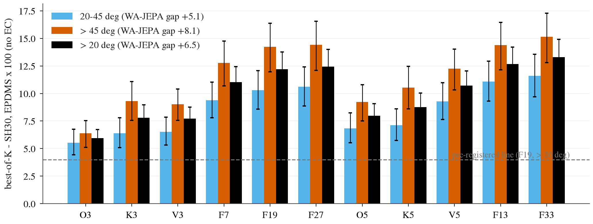
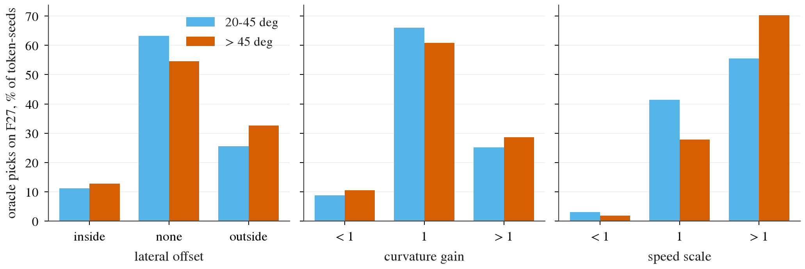
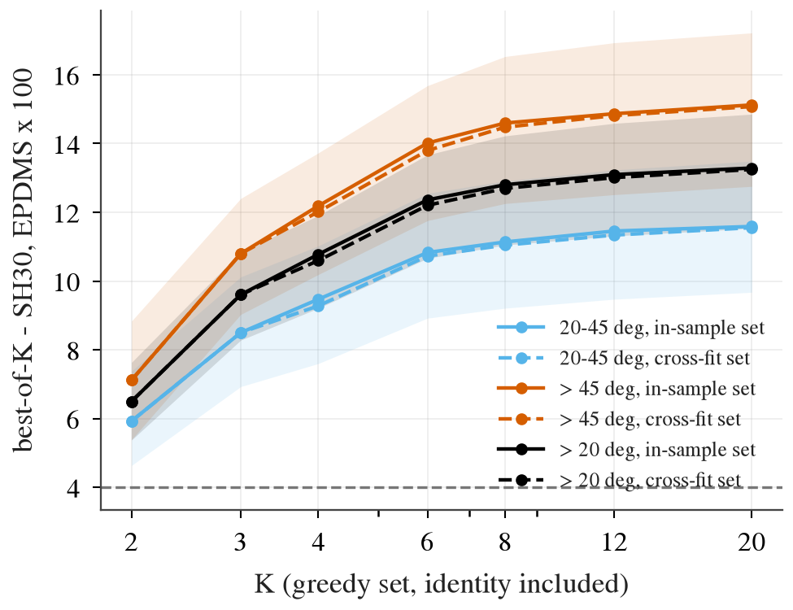

# op_parity turn-ceiling: how much better is the best trajectory in a small family around SH30's own plan?

Written 2026-10-08. Pre-registration and addendum A: [plans/2026-10-08-turn-ceiling-prereg.md](../plans/2026-10-08-turn-ceiling-prereg.md) (the plan
before any score, the addendum after the stage-0 gate failed and before any non-identity score). Code: `scripts/turn_ceiling.py`,
`scripts/turn_ceiling_chain.sh`. Tables: [turn_ceiling/](turn_ceiling/). **Privileged ceiling**: every "oracle" row picks, per token and seed, the
candidate with the highest navtest simulator score. It is an upper bound on selection, not a method. CPU only, no training (stages 0 and 1).

## Answer

**The family contains far better trajectories: best-of-19 is +12.20 EPDMS [+10.57, +13.76] on the 3 154 navtest tokens with > 20 deg of logged
heading change (line: +4.0), about twice SH30's gap to WA-JEPA there (+6.52). The pre-registered line is passed; the line of work continues.**
The gain is not on one degree of freedom, and no fixed transform helps: it is per-token repair of small-margin failures.

1. **Ceiling** (EPDMS x 100 without extended comfort, seed mean, paired log-cluster bootstrap): F19 +12.20 on > 20 deg (about +3.2 navtest-equivalent),
   +10.31 [+8.58, +12.09] on 20-45 deg, +14.24 [+11.96, +16.36] on > 45 deg, +10.78 left / +14.57 right. The oracle reaches 95.9 against
   WA-JEPA's 90.3 and SH30's 83.7; it is below WA-JEPA on 6% of the tokens.
2. **Degrees of freedom are substitutes.** One axis alone (two non-identity values): curvature gain +7.79 [+6.62, +8.97], speed +7.72 [+6.69, +8.75],
   lateral offset +5.95 [+5.10, +6.74]; any single axis (F7) +11.02; needing two or more axes at once only +1.42 [+1.14, +1.72]. Offset is behind
   curvature (-1.84 [-2.66, -1.12]) and speed (-1.78 [-2.45, -1.11]); curvature and speed tie (+0.07 [-0.47, +0.69]).
3. **Nothing systematic.** Every one of the 32 non-identity candidates, applied to all tokens, is worse than SH30 or indistinguishable from it:
   speed x 0.8 -0.33 [-1.37, +0.74], offset +-0.5 m -6.2 / -6.3, curvature x 0.85 -10.4, x 1.15 -18.9, x 1.4 -46.3. The cross-fitted best fixed
   candidate is -0.46 [-1.23, +0.32]. SH30 has no global under-turn, over-turn or lateral bias that a constant correction removes.
4. **Small K.** Identity plus one alternative (speed x 0.6) is already +6.50 [+5.38, +7.63]; K 3 +9.61, K 4 +10.59, K 8 +12.70 (cross-fitted sets;
   in-sample differs by <= 0.2). The curve is steep at K 2-3 because a failing token is repaired by almost any move away from the failing plan.
5. **Sub-scores.** WA-JEPA's lead over SH30 on > 45 deg (7.92 with EC, 8.09 without) is DAC 5.03, rest (DDC + TLC + HC) 1.02, NC 0.74, EP 0.60,
   LK 0.48, TTC 0.21; on 20-45 deg (4.88 / 5.07): DAC 2.49, rest 0.86, NC 0.65, EP 0.50, LK 0.33, TTC 0.24. The F19 oracle recovers more than the
   lead in every term: on > 20 deg DAC +6.47 (1.74 x WA's lead), EP +2.24 (4.1 x), NC +0.90 (1.30 x), LK +0.64, TTC +0.53. Its failure rates on
   > 20 deg: DAC 7.31% -> 0.10% (WA-JEPA 3.04%), NC 1.43% -> 0.06% (0.32%), LK 4.99% -> 0.29% (1.93%).

**Branch reading.** By the letter of the pre-registered rule the verdict is (b) "curvature gain" (O3 - K3 interval below 0 and K3 > V3 in the point
estimate). The pre-registered directional support for (b) fails, so (b) as "under-turn inherited from the base model" is **not** supported: a fixed
gain of 1.15 costs 18.9 points, the oracle moves curvature on only 36% of token-seeds (27% up, 10% down, the two directions carrying equal shares
of the gain), and K3 beats V3 by 0.07 with an interval through 0. (c) is rejected. What the evidence supports is the premise shared by (a) and a
selector: SH30's turn failures are small-margin and repairable by a small move along any axis, the direction differs per token, and the simulator
score identifies it. Whether a learner can identify it without the score is not measured here (decision 168's caveat stands: best-of-K is optimistic
by construction, and decision 173's head recovered 0.15 of a 1.07 ceiling on WOD).

## Ceiling per family and bucket

| family | K | > 20 deg (3 154) | 20-45 deg (1 637) | > 45 deg (1 517) | left > 20 deg (1 975) | right > 20 deg (1 179) |
|:--|--:|:--|:--|:--|:--|:--|
| O3: offset only | 3 | +5.95 [+5.10, +6.74] | +5.54 [+4.43, +6.76] | +6.38 [+5.12, +7.53] | +5.51 [+4.23, +6.80] | +6.67 [+5.39, +7.93] |
| K3: curvature only | 3 | +7.79 [+6.62, +8.97] | +6.38 [+5.08, +7.79] | +9.31 [+7.56, +11.09] | +7.30 [+5.58, +9.03] | +8.61 [+7.14, +10.30] |
| V3: speed only | 3 | +7.72 [+6.69, +8.75] | +6.52 [+5.32, +7.84] | +9.01 [+7.55, +10.40] | +6.68 [+5.26, +8.11] | +9.46 [+8.22, +10.77] |
| F7: any single axis | 7 | +11.02 [+9.55, +12.43] | +9.39 [+7.80, +11.03] | +12.78 [+10.68, +14.76] | +9.94 [+7.84, +12.02] | +12.83 [+11.23, +14.50] |
| **F19: verdict family** | 19 | **+12.20 [+10.57, +13.76]** | +10.31 [+8.58, +12.09] | +14.24 [+11.96, +16.36] | +10.78 [+8.52, +13.01] | +14.57 [+12.77, +16.50] |
| F27: inner product | 27 | +12.44 [+10.79, +14.01] | +10.60 [+8.86, +12.41] | +14.42 [+12.11, +16.56] | +10.96 [+8.68, +13.20] | +14.92 [+13.07, +16.89] |
| F33: + outer points | 33 | +13.30 [+11.58, +14.92] | +11.60 [+9.71, +13.55] | +15.14 [+12.81, +17.29] | +11.57 [+9.22, +13.86] | +16.21 [+14.30, +18.18] |
| WA-JEPA - SH30 (no EC) | | +6.52 [+5.12, +7.84] | +5.07 [+3.46, +6.69] | +8.09 [+6.05, +9.96] | +6.22 [+4.40, +8.00] | +7.03 [+4.94, +8.94] |
| WA-JEPA - SH30 (with EC, archived) | | +6.35 [+4.96, +7.64] | +4.88 [+3.25, +6.47] | +7.92 [+5.90, +9.77] | +5.97 [+4.19, +7.70] | +6.98 [+4.93, +8.88] |

Levels without EC: SH30 83.74 / 85.28 / 82.07, WA-JEPA 90.26 / 90.35 / 90.16 (> 20 / 20-45 / > 45 deg); with EC, archived: 81.49 / 83.35 / 79.49 and
87.84 / 88.23 / 87.41. All families, the > 45 deg left / right buckets and the outer single-axis families: [turn_ceiling/ceiling.md](turn_ceiling/ceiling.md),
[levels.md](turn_ceiling/levels.md); contrasts: [dof.md](turn_ceiling/dof.md). Three-way excess F27 - F19 +0.24 [+0.16, +0.34]; the outer points add
+0.86 [+0.65, +1.07], almost all of it EP from speed x 1.4.

*What to look at: every family, including the three single-axis ones with two alternatives each, is above the dashed pre-registered line; the step
from one axis (O3 / K3 / V3) to any single axis (F7) is large, the step from F7 to the full product (F27) is small.*

## What the oracle picks

On F19 the oracle keeps the identity on 30.7% of token-seeds (38.4% on 20-45 deg, 22.5% on > 45 deg; ties go to the identity). The most frequent
picks all contain speed x 1.2: speed alone 17.9%, with curvature x 1.15 15.7%, with offset -0.5 m 11.6%, +0.5 m 9.5%, with curvature x 0.85 6.5%.
Marginals on F27: speed > 1 on 62.7%, < 1 on 2.5%; curvature > 1 on 26.9%, < 1 on 9.6%; offset toward the outside of the logged turn 28.9%, toward
the inside 12.0%. Tables: [picks.md](turn_ceiling/picks.md), [picks_marginal.md](turn_ceiling/picks_marginal.md).

Two things inflate these shares and are part of why best-of-K is optimistic here. EP is continuous, so wherever a faster candidate stays safe the
oracle takes it: EP is +2.24 of the +12.20, four times WA-JEPA's EP lead. And the score looks at 4 s only: speed x 0.6 as the single alternative is
worth +6.50 because a path that leaves the road or meets an agent late in the horizon no longer gets there, which a closed loop would not reward.
The DAC part (+6.47) is the part that corresponds to SH30's known failure.

*What to look at: on both buckets the oracle leaves offset and curvature at the identity on most token-seeds and moves speed up on most; where it
does move the lateral axes, outward offset and more curvature are 2-3 x as frequent as their opposites, but not exclusive.*

## Small K and fixed transforms

| K (greedy set, identity included) | added | > 20 deg, in-sample | > 20 deg, cross-fit | 20-45 deg, cross-fit | > 45 deg, cross-fit |
|--:|:--|:--|:--|:--|:--|
| 2 | speed x 0.6 | +6.50 [+5.38, +7.63] | +6.50 [+5.38, +7.63] | +5.93 [+4.63, +7.38] | +7.12 [+5.39, +8.83] |
| 3 | speed x 1.4 | +9.61 [+8.28, +10.85] | +9.61 [+8.28, +10.85] | +8.50 [+6.93, +10.12] | +10.80 [+9.03, +12.40] |
| 4 | curvature x 0.85, speed x 1.2 | +10.78 [+9.33, +12.14] | +10.59 [+9.21, +11.90] | +9.28 [+7.60, +11.02] | +12.01 [+10.19, +13.73] |
| 6 | | +12.36 [+10.77, +13.85] | +12.20 [+10.66, +13.67] | +10.73 [+8.92, +12.55] | +13.80 [+11.76, +15.68] |
| 8 | | +12.80 [+11.15, +14.33] | +12.70 [+11.05, +14.22] | +11.05 [+9.21, +12.91] | +14.48 [+12.25, +16.53] |
| 20 | | +13.29 [+11.57, +14.91] | +13.25 [+11.53, +14.86] | +11.55 [+9.67, +13.49] | +15.08 [+12.75, +17.22] |

Sets are chosen from F33 on the > 20 deg tokens; cross-fit = chosen on the other half of the logs. The oracle inside the set is still per token, so
these rows are ceilings too. The only rows without a per-token oracle are the fixed transforms ([fixed.md](turn_ceiling/fixed.md)): none is
positive, see point 3 above. [small_k.md](turn_ceiling/small_k.md).

*What to look at: two candidates already clear the dashed line and the curve flattens after K 6-8; the dashed (cross-fitted) and solid (in-sample)
curves coincide, so the choice of the set is not where the optimism is. The optimism is in the per-token pick.*

## Sub-score split of the gap and of the oracle gain (exact Shapley, EPDMS x 100)

| bucket | gap | total | DAC | NC | TTC | EP | LK | rest |
|:--|:--|:--|:--|:--|:--|:--|:--|:--|
| > 45 deg | WA - SH30, with EC (archived) | +7.92 [+5.90, +9.77] | +4.90 [+3.35, +6.37] | +0.73 [+0.22, +1.30] | +0.19 [+0.05, +0.34] | +0.53 [+0.35, +0.73] | +0.43 [+0.27, +0.60] | +1.14 [+0.47, +1.79] |
| > 45 deg | WA - SH30, no EC | +8.09 [+6.05, +9.96] | +5.03 [+3.44, +6.52] | +0.74 [+0.21, +1.32] | +0.21 [+0.06, +0.37] | +0.60 [+0.40, +0.82] | +0.48 [+0.30, +0.68] | +1.02 [+0.33, +1.70] |
| > 45 deg | oracle F19 - SH30 | +14.24 [+11.96, +16.36] | +8.06 [+6.35, +9.86] | +1.10 [+0.51, +1.74] | +0.45 [+0.21, +0.70] | +2.55 [+2.29, +2.81] | +0.63 [+0.38, +0.93] | +1.46 [+0.75, +2.17] |
| > 45 deg | recovered share, F19 | 1.76 [1.56, 2.10] | 1.60 [1.36, 2.04] | 1.47 [1.07, 3.04] | 2.11 [1.36, 6.10] | 4.25 [3.18, 6.18] | 1.30 [1.11, 1.49] | 1.44 [1.16, 2.62] |
| 20-45 deg | WA - SH30, with EC (archived) | +4.88 [+3.25, +6.47] | +2.42 [+0.97, +3.81] | +0.62 [+0.32, +0.94] | +0.22 [-0.02, +0.46] | +0.45 [+0.30, +0.62] | +0.30 [+0.17, +0.44] | +0.88 [+0.41, +1.43] |
| 20-45 deg | WA - SH30, no EC | +5.07 [+3.46, +6.69] | +2.49 [+1.01, +3.91] | +0.65 [+0.35, +0.98] | +0.24 [-0.02, +0.49] | +0.50 [+0.33, +0.68] | +0.33 [+0.19, +0.49] | +0.86 [+0.39, +1.45] |
| 20-45 deg | recovered share, F19 | 2.03 [1.69, 2.71] | 2.01 [1.50, 3.91] | 1.11 [0.88, 1.53] | 2.47 [-5.39, 13.72] | 3.92 [3.07, 5.31] | 1.94 [1.48, 2.94] | 1.63 [1.26, 2.51] |

rest = DDC + TLC + HC (+ EC in the archived rows). So the 7.92 is 62% drivable area, 9% at-fault collisions, 7% progress, 5% lane keeping, 2% TTC,
14% rest; the 4.88 is 50% / 13% / 9% / 6% / 5% / 18%. All rows incl. F27 / F33 and the > 20 deg bucket: [subscores.md](turn_ceiling/subscores.md);
failure rates: [rates.md](turn_ceiling/rates.md).

## Setup

- **Tokens.** navtest, logged 4 s |heading change| >= 20 deg (bench strata bins 20-45 and > 45): 3 154 tokens in 108 logs; membership checked against
  `navsim/navtest`. SH30 = `SH30-F-s0` / `s1` (decision 170), family built around each seed's exported poses, read-outs are the per-token seed mean.
- **Family** (33 candidates, `turn_ceiling.py candidates`, [family.json](turn_ceiling/family.json)). Curvature gain: every heading relative to t0 x g,
  segment lengths kept. Lateral offset: shift along the pose normal, blended in over the first 6 m of travel. Speed: the same path, arc length x a,
  extended beyond the 4 s end with the last segment's curvature. Inner values offset +-0.5 m, gain 0.85 / 1.15, speed 0.8 / 1.2 (3 x 3 x 3 product),
  outer single-axis points +-1.0 m, 0.7 / 1.4, 0.6 / 1.4. F19 = the product without its 8 three-axis corners; chosen as the verdict family before
  scoring because the agreed line is a best-of-20.
- **Score.** `python -m jevdrive.bench score-poses --traffic non_reactive`: per-token EPDMS without extended comfort (EC needs the neighbouring
  frame's plan). WA-JEPA re-scored by the same formula from its stored sub-scores. CIs: `jevdrive.stats.paired`, clusters = logs, B 10 000; recovered
  shares: ratio of sums over the same log resample, B 4 000.

## Gates

- **Stage 0, first attempt: failed, fixed in tooling.** On 24 tokens the identity candidate matched SH30's archived NC / DAC / DDC / TLC / TTC / LK / HC
  on every token and EP on 22 (archived 0.61 / 0.95, score-poses 1.0 on the other 2, both seeds). Cause: `navtest` scores with the devkit default
  `traffic_agents: non_reactive` (log replay), `score-poses` hard-coded the reactive IDM policy; EP is normalised by the PDM reference unless that
  reference collides. Fix: `score-poses --traffic non_reactive` (default unchanged, part of the run identity, test added, docs/bench.md). Only
  identity rows were read before the fix.
- **Stage 0, second attempt: passed.** 24 and then 300 tokens (150 per bucket) x 66 keys: all 8 sub-scores of both seeds equal the archive on every
  token (max |diff| of the no-EC score 3e-16). Stage 1 re-checks it on all 3 154 tokens: max |diff| 0.0 ([verdict.json](turn_ceiling/verdict.json)).
- **Cost.** Measured 4.74 core-s per token for 66 keys (0.072 core-s per key; non-reactive traffic has no IDM, which was 97% of the reactive cost).
  Stage 1: 4.2 core-h, 234 s from first job start to last job end on 8 pool jobs x 12 cores. No cut of the ladder was needed (F33, 2 seeds).
- **Line.** F19 on > 20 deg: +12.20 >= +4.0. Not ended.

## For the next decision (read-only checks)

- navtrain (`navsim/navtrain`, 103 288 tokens, the op_parity token cache): 28 323 tokens with |dyaw| >= 20 deg (17 550 at 20-45, 10 773 at > 45).
  Main's guess was ~27 k.
- Metric caches on the box: `v1_navtrain` (106 630 tokens, 36 GB, covers all 103 288 and all 28 323 turn tokens) and `v1_e6sub` are v1 (PDMS) caches.
  **No v2 navtrain metric cache exists** (v2: navtest and navhard only), and `score-poses` reads the v2 navtest cache only.
- Building one: the v2 navtest cache (12 146 tokens) was written in about 40 min on 2026-09-24 (file times; the box size that day is not recorded
  here). At that rate the 28 323 turn tokens take about 1.6 h and all of navtrain about 5.7 h (the devkit's `run_metric_caching.py` with a token
  filter, as `navsim_zs_score.sh cache` does). Scoring 33 candidates on the 28 323 tokens then costs about 19 core-h at the measured 0.072 core-s
  per key.

## Verified / not verified

- Verified: identity candidate = archived poses bit for bit, and its 8 sub-scores = the archive on all 3 154 tokens x 2 seeds; the with-EC bucket
  gaps reproduce the stored 7.92 / 4.88; transforms unit-checked on synthetic arcs (standstill plans do not move, gain and speed match the analytic
  arc to <= 6 cm); `tests.test_bench.TestPoses` passes with the new option.
- Not verified / limits: no look at individual tokens or BEV plots of what the picked candidates do; the horizon effect of slower candidates is
  inferred from the K 2 pick, not measured; the EP inflation is not separated from real repairs beyond the Shapley split; one parametrisation
  (the offset ramp length and the grid were fixed before scoring and not varied); no control on straight tokens, so "turn-specific" is not shown;
  learnability of the pick is untested; the v2 cache estimate is an extrapolation and a v1 cache was not tried with the v2 scorer; reactive-traffic
  scores of this family were not read.
- Earlier results touched by the traffic-policy finding: every no-EC EPDMS quoted from `score-poses` before today used reactive traffic
  (turn_oracle stage A, the representation decoders). Their DAC read-outs do not depend on it; their EPDMS levels are not comparable with navtest tables.

## Deviations from the pre-registration

Addendum A (traffic policy, written before any non-identity score). The 300-token smoke was preceded by a 24-token one, as registered. The report
also writes K 6 / 12 small-K rows and the > 45 deg left / right buckets, as registered. Nothing else changed; the line and the family were not moved.
