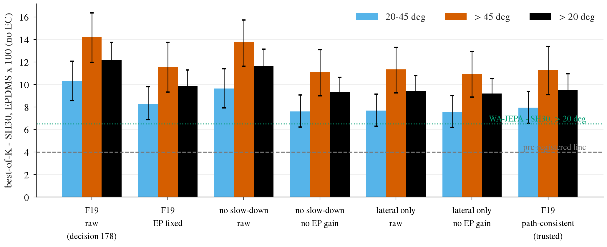
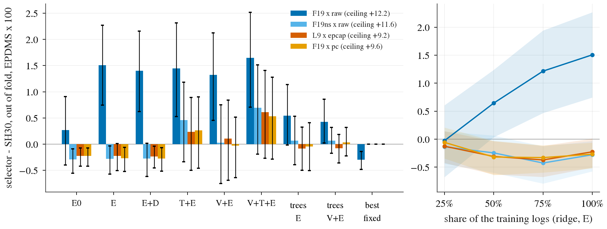

# op_parity turn-ceiling, de-watered: the ceiling survives (+9.55), the pick is not learnable from cheap inputs, and what a selector does learn on the raw score is the horizon artefact

Written 2026-10-08. Follow-up of [turn_ceiling.md](turn_ceiling.md) (decision 178). Pre-registration, committed before any number here was read:
[plans/2026-10-08-turn-ceiling-dewater-prereg.md](../plans/2026-10-08-turn-ceiling-dewater-prereg.md). Code: `scripts/turn_dewater.py` (ceiling / select /
selreport / posthoc), `scripts/turn_dewater_chain.sh`. Tables: [turn_ceiling_dewater/](turn_ceiling_dewater/); figures:
[../figs/turn_ceiling_dewater/](../figs/turn_ceiling_dewater/). Everything is computed from the per-token candidate scores of turn_ceiling (33 candidates x
2 seeds x 3 154 navtest tokens with > 20 deg of logged heading change, non-reactive, no-EC EPDMS x 100): no new simulator scoring, no base-model
training, CPU only. Ceilings are **privileged** (picked by the navtest score); selector rows are out of fold by log.

## Answer

1. **About 2.6 of the +12.20 is water; +9.55 [+8.14, +10.94] is left** (the pre-registered trusted number, F19 under the path-consistent convention;
   line +4.0, WA-JEPA - SH30 there +6.52). The water is almost all EP farming (+2.34 [+1.99, +2.66]); slow-down repairs of map terms are worth only
   +0.31 [+0.15, +0.50] to the oracle, because a lateral candidate repairs the same tokens. Lateral moves alone, with no EP credit, reach +9.20 [+7.83,
   +10.53]: the de-watered ceiling does not need the speed axis. The de-watered line is passed with room.
2. **The de-watered oracle is a rare, large repair.** It keeps SH30's plan on 85% of token-seeds (31% under the raw score) and takes the whole gain
   from the other 15%: DAC +6.30, rest (DDC / TLC / HC) +1.24, NC +0.87, LK +0.63, TTC +0.51, EP 0.00. DAC failures 7.31% -> 0.19%.
3. **The pick is not learnable from ego state + command + SH30's own plan.** Pre-registered primary arm (ridge, `E`), out of fold by log, on the
   trusted family: **-0.27 [-0.52, -0.06]**, recovery -2.8% [-5.5, -0.7] of +9.55, permutation p 1.0; "not learnable at this label scale with these
   inputs". Same on the other two de-watered families (-0.28, -0.23), with a margin rule (-0.09 [-0.30, +0.10]) and with boosted trees (-0.05 [-0.51,
   +0.41]). The learning curve is flat (-0.06 / -0.32 / -0.33 / -0.27 at 25 / 50 / 75 / 100% of the training logs).
4. **On the raw score the same selector looks like it works, and that is the artefact.** F19 x raw: +1.51 [+0.74, +2.27], 12.3% [6.6, 17.6] of
   +12.20 (WOD precedent 14%), permutation p 0.010, curve still rising; "weakly learnable" by the pre-registered rule. It gets there by slowing down
   on 55% of rows. Its picks valued under the path-consistent score (post hoc) are **-3.25 [-4.20, -2.28]**; once slow-down candidates are taken out
   of the family it falls to -0.28 [-0.57, -0.03]. Decision 178's worry about the horizon was right, but about the learner, not about the ceiling.
5. **Scene inputs carry a hint, not a result.** Adding shipped-teacher outputs and frozen vision tokens (`V+T+E`) gives +0.53 [-0.28, +1.28] on the
   trusted family (5.6% [-3.0, 12.9]), +0.61 and +0.69 on the other two de-watered families; the paired difference to `E` is +0.80 [+0.13, +1.43].
   No scene arm has a CI above 0 in absolute terms, and these are exploratory arms (6 arms x 4 families). Post hoc, "this token-seed has a repair" is
   detectable out of fold with AUC 0.69 from `E` and 0.70 with both scene streams (base rate 15.3%, precision at the base rate 29-32%).

**Read.** There is real headroom in SH30's plan neighbourhood, and it is lateral: 15% of turn token-seeds have a nearby trajectory that passes where
SH30's fails. But which tokens, and which way to move, is not in the ego state, the command or the plan, and only faintly in the pooled frozen
scene features with 3 154 labelled tokens; the stream that does predict off-road plans in this repo is map geometry (decision 179: map SDF margin
AUC 0.92, the model's own road edges 0.64). A wrong move is expensive (every fixed transform loses 6 to 19 points), so a weak detector cannot pay.

## 1. De-watered ceilings

Score conventions (sub-scores recombined by the EPDMS formula; the identity scores the same under all): `raw` as scored; `epfix` EP := the identity's;
`epcap` EP := min(candidate, identity), so a slow-down still pays; `pc` (path-consistent) = `epcap`, and a candidate with speed < 1 cannot have a
better DAC / DDC / TLC / LK than the same (offset, gain) at speed 1, whose path it follows a prefix of. Families: F19 as in decision 178; F19ns = F19
without speed < 1 (K 14); L9 = speed at identity, offset x curvature (K 9). Best-of-K minus SH30, seed mean of the per-seed oracle, paired log-cluster
bootstrap (B 10 000, 108 logs):

| family x convention | K | > 20 deg (3 154) | 20-45 deg (1 637) | > 45 deg (1 517) | left > 20 deg | right > 20 deg |
|:--|--:|:--|:--|:--|:--|:--|
| F19 x raw (decision 178) | 19 | +12.20 [+10.57, +13.76] | +10.31 [+8.58, +12.09] | +14.24 [+11.96, +16.36] | +10.78 [+8.52, +13.01] | +14.57 [+12.77, +16.50] |
| F19ns x raw: no speed < 1 | 14 | +11.63 [+10.07, +13.14] | +9.65 [+7.91, +11.40] | +13.77 [+11.64, +15.74] | +10.48 [+8.20, +12.70] | +13.56 [+11.89, +15.39] |
| L9 x raw: speed at identity | 9 | +9.45 [+8.06, +10.79] | +7.69 [+6.29, +9.16] | +11.34 [+9.26, +13.31] | +8.54 [+6.51, +10.56] | +10.97 [+9.28, +12.84] |
| F19 x epfix: EP held at the identity's | 19 | +9.88 [+8.44, +11.30] | +8.29 [+6.88, +9.81] | +11.59 [+9.34, +13.75] | +8.69 [+6.64, +10.77] | +11.86 [+9.97, +13.90] |
| F19ns x epcap | 14 | +9.29 [+7.91, +10.64] | +7.62 [+6.23, +9.08] | +11.10 [+8.99, +13.10] | +8.38 [+6.33, +10.43] | +10.82 [+9.10, +12.73] |
| L9 x epcap (lower bracket) | 9 | +9.20 [+7.83, +10.53] | +7.57 [+6.19, +9.03] | +10.96 [+8.88, +12.93] | +8.32 [+6.30, +10.34] | +10.68 [+8.98, +12.56] |
| **F19 x pc (trusted)** | 19 | **+9.55 [+8.14, +10.94]** | +7.94 [+6.58, +9.39] | +11.30 [+9.10, +13.38] | +8.55 [+6.52, +10.58] | +11.24 [+9.45, +13.17] |
| WA-JEPA - SH30 | | +6.52 [+5.12, +7.84] | +5.07 [+3.46, +6.69] | +8.09 [+6.05, +9.96] | | |
| best of the two seeds' own plans - seed mean | 2 | +0.82 [+0.63, +1.05] | +0.84 [+0.54, +1.15] | +0.80 [+0.57, +1.06] | | |

Read across: the first row minus any other is the water that row removes. F27 / F33 / L13 and the single-axis families under every convention:
[ceiling.md](turn_ceiling_dewater/ceiling.md); the same picks valued by the raw score: [ceiling_rawvalued.md](turn_ceiling_dewater/ceiling_rawvalued.md).

*What to look at: every de-watered bar on > 20 deg (black) sits between +9.2 and +9.9, above the dashed line and above the dotted WA-JEPA gap; the
only step is from the two raw bars that credit EP (first and third) to the rest. Error bars: 95% paired log-cluster bootstrap.*

Where the 2.65 goes ([contrasts.md](turn_ceiling_dewater/contrasts.md), > 20 deg):

| contrast | EPDMS x 100 |
|:--|:--|
| all water: F19 raw - F19 pc | +2.65 [+2.26, +3.00] |
| EP gains: F19 raw - F19 epcap | +2.34 [+1.99, +2.66] |
| slow-down repairs of map terms: F19 epcap - F19 pc | +0.31 [+0.15, +0.50] |
| removing slow-down candidates: F19 raw - F19ns raw | +0.57 [+0.34, +0.81] |
| speed-up: F19ns raw - L9 raw | +2.19 [+1.86, +2.48] |
| speed-up without EP credit: F19ns epcap - L9 epcap | +0.09 [+0.04, +0.14] |
| speed on NC / TTC: F19 pc - L9 epcap | +0.35 [+0.17, +0.55] |

- The horizon artefact is large on the speed axis alone and small in the family: speed-only (V3) drops from +7.72 to +2.06 [+1.59, +2.51] under `pc`,
  and identity + speed x 0.8 from +4.79 to +0.75; inside F19 the same tokens are repaired by a lateral candidate, so the family loses 0.31.
- Speed-up is worth +2.19 with EP credit and +0.09 without: it is EP and nothing else.
- Oracle picks ([picks_axis.md](turn_ceiling_dewater/picks_axis.md)): identity on 30.7% of token-seeds under raw, 84.7% under `pc` (speed > 1 on 61.1%
  -> 5.2%, curvature moved 8.6%, offset moved 4.9%, speed < 1 0.8%).
- Shapley of the trusted row ([subscores.md](turn_ceiling_dewater/subscores.md)): DAC +6.30 [+5.15, +7.47], rest +1.24, NC +0.87, LK +0.63, TTC +0.51,
  EP -0.00; failure rates SH30 -> oracle ([rates.md](turn_ceiling_dewater/rates.md)): DAC 7.31% -> 0.19%, NC 1.43% -> 0.10%, LK 4.99% -> 0.32%
  (WA-JEPA 3.04% / 0.32% / 1.93%).

**The number to trust as closed-loop plausible is +9.55** (fixed in the pre-registration), with +9.20 as its lower bracket; they differ by 0.35, all of
it speed moves repairing NC / TTC. Why this one: it removes everything in the two named sources that is false by construction (EP credit; a slower
traversal of the same path "repairing" a map term) and keeps what may be real (yielding to an agent). It is still a best-of-19 with a privileged
pick, and it is still a 4 s score: a lateral candidate that leaves the road after 4 s is not caught (see limits).

## 2. Selectors, out of fold by log

Rows = (seed, token), 5 folds x 10 repeats by log, hyper-parameters by an inner 4-fold by log, every fit on training folds only. Target = each
candidate's gain over the identity under the family's convention; read-out = the selected candidate's gain, seed mean. Streams: `ego` (20: command,
4-pose history, speed, acceleration), `plan` (15 descriptors of SH30's own plan), `dis` (4: disagreement of the two seeds' plans), `T` (shipped Cinque
outputs, 1 086 -> whitened PCs), `V` (frozen openpilot vision tokens of the newest context frame, 512 -> whitened PCs); PCA fitted on the 8 992 navtest
tokens outside the evaluation set, without labels. Nothing reads the logged future, the turn label or a score-poses column. Heads: `L` ridge on
candidate gains + argmax (primary), `L+m` with a margin, `G` boosted trees on (row, candidate). > 20 deg, EPDMS x 100:

| arm (ridge head) | F19 x raw (+12.20) | F19ns x raw (+11.63) | L9 x epcap (+9.20) | **F19 x pc (+9.55)** | recovery on F19 x pc |
|:--|:--|:--|:--|:--|:--|
| `E0`: ego + command | +0.27 [-0.40, +0.91] | -0.29 [-0.55, -0.09] | -0.22 [-0.42, -0.07] | -0.23 [-0.42, -0.07] | -2.4% |
| **`E`: + plan (primary)** | **+1.51 [+0.74, +2.27]** | -0.28 [-0.57, -0.03] | -0.23 [-0.51, +0.01] | **-0.27 [-0.52, -0.06]** | -2.8% [-5.5, -0.7] |
| `E+D`: + seed disagreement | +1.40 [+0.62, +2.16] | -0.28 [-0.62, +0.01] | -0.24 [-0.45, -0.04] | -0.28 [-0.52, -0.07] | -2.9% |
| `T+E`: + shipped teacher outputs | +1.44 [+0.53, +2.31] | +0.46 [-0.34, +1.18] | +0.24 [-0.50, +0.89] | +0.26 [-0.46, +0.90] | 2.7% [-4.9, 8.9] |
| `V+E`: + frozen vision | +1.32 [+0.45, +2.12] | +0.03 [-0.75, +0.75] | +0.11 [-0.69, +0.84] | -0.03 [-0.64, +0.51] | -0.3% |
| `V+T+E` | +1.65 [+0.71, +2.52] | +0.69 [-0.19, +1.51] | +0.61 [-0.27, +1.41] | +0.53 [-0.28, +1.28] | 5.6% [-3.0, 12.9] |
| `E`, margin head | +1.50 [+0.75, +2.24] | -0.14 [-0.41, +0.11] | -0.07 [-0.36, +0.19] | -0.09 [-0.30, +0.10] | -1.0% |
| `E`, boosted trees | +0.54 [-0.02, +1.14] | +0.06 [-0.39, +0.53] | -0.09 [-0.50, +0.33] | -0.05 [-0.51, +0.41] | -0.5% |
| best fixed candidate in fold | -0.30 [-0.48, -0.14] | 0.00 (identity) | 0.00 | 0.00 | 0% |

Recovery of the matching ceiling on F19 x raw: `E` 12.3% [6.6, 17.6], `V+T+E` 13.5% [6.3, 19.6]. Permutation of all inputs over tokens (100 x 2
repeats): F19 x raw null -0.34 (95% -0.67 .. +0.20) against +1.39, p 0.010; F19 x pc null -0.01 against -0.28, p 1.0. In-sample on the de-watered
families the `E` head is 0.000 (the inner CV picks the largest lambda, i.e. keep the identity); the small negative out-of-fold values are folds in
which it did not. All arms, heads and buckets: [selector.md](turn_ceiling_dewater/selector.md), [selector_contrasts.md](turn_ceiling_dewater/selector_contrasts.md),
[learning_curve.md](turn_ceiling_dewater/learning_curve.md), [selector_picks.md](turn_ceiling_dewater/selector_picks.md),
[selector_verdict.json](turn_ceiling_dewater/selector_verdict.json).

*What to look at: left, only the dark-blue bars (raw score, slow-down available) are clearly above zero; the three de-watered families are at or
below zero for every arm without a scene stream and rise to about +0.5 with both, with intervals through zero. Right, the raw curve rises with more
logs and the de-watered curves do not. Bars and bands: 95% paired log-cluster bootstrap.*

- **Pre-registered verdicts.** F19 x raw: weakly learnable (CI above 0, p 0.010, recovery 12.3% < 14%). F19 x pc: not learnable at this label scale
  with these inputs. Scene streams against `E` on F19 x pc: `T+E` +0.53 [-0.06, +1.05], `V+E` +0.24 [-0.22, +0.67], `V+T+E` +0.80 [+0.13, +1.43];
  by the rule only `V+T+E` "adds", and it adds to a negative floor.
- **What the raw selector learned** ([selector_picks.md](turn_ceiling_dewater/selector_picks.md)): it moves 81.5% of rows, speed < 1 on 54.9%. On the
  de-watered families the `E` head moves 11-15% of rows and loses.
- **Post hoc, not pre-registered** ([posthoc_crossvalued.md](turn_ceiling_dewater/posthoc_crossvalued.md)): the F19 x raw selectors' out-of-fold picks
  valued under other conventions: `E` +1.51 raw, +1.38 `epcap`, **-3.25 [-4.20, -2.28]** `pc`; `V+T+E` +1.65 / +1.46 / -1.88. The gain is not EP; it
  is map-term "repairs" by slowing down, which `pc` does not credit, and the EP paid for them.
- **Post hoc** ([posthoc_detect.md](turn_ceiling_dewater/posthoc_detect.md)): out-of-fold AUC of "a repair exists under `pc`" (15.3% of token-seeds):
  `E0` 0.610, `E` 0.692 [0.660, 0.720], `T+E` 0.693, `V+E` 0.694, `V+T+E` 0.698 [0.668, 0.727]; of "SH30 fails a gate" (10.9%): `E` 0.701, `V+T+E` 0.721.
  Fixed ridge, no tuning. Consistent with decision 179 (own road-edge margin vs DAC failure 0.641, map SDF margin 0.921).
- **Against the WOD precedent** (decision 173: 14% of +1.07 from ego + command + plan). The raw navtest number (12.3%) matches it, and decision 173
  found the same content: the WOD head's gain was a speed-profile change on turn frames, path choice was worth +0.016. On navtest the de-watered
  recovery from the same inputs is -2.8%. WOD's rater score has no artefact of this kind identified, so the 14% is not withdrawn by this; what
  transfers is that neither board shows a learnable lateral pick from System 1's own state.

## Stage 2 (score-supervised training on navtrain turn tokens)

By the pre-registered reading: the ceiling condition holds (+9.55 >= +4.0, lateral alone +9.20), the selector condition does not (every arm's CI on
the trusted family contains 0 or is below it). That is the branch "do not launch the full run; first find an input that is positive out of fold on
the navtest labels". My read:

- Stage 2 as planned (speed candidates in the family, raw EPDMS as the target) should not run: on this evidence it would learn to slow down, and
  the gain would be the horizon artefact. If it runs, the family is lateral only (L9 / L13) and the target is `epcap`.
- The open question is label scale against input. 3 154 tokens are 11% of the navtrain turn set, the `E` curve is flat, and the scene-stream arms
  were not given a curve. The cheap next read is on the labels that exist: unpooled vision tokens or SH30's own hidden state as the input, and the
  `V+T+E` learning curve. A positive out-of-fold arm there would justify the navtrain scoring (about 19 core-h; the v2 turn cache now exists).
  This is a conjecture about what would help, not a result.

## Limits and what was not checked

- No new scoring: the horizon effect is removed by a rule (`pc`), not measured at a longer horizon. A lateral candidate that passes at 4 s and
  leaves the road later (lower curvature gain is the obvious case) is still credited; curvature is moved on 8.6% of token-seeds in the trusted row.
- `pc` takes a min, so real map-term gains of a slower traversal (better tracking) are dropped; NC / TTC repairs by speed are kept although some
  postpone a contact with a static object. Both effects are bounded by the 0.35 bracket.
- Selector inputs: pooled features only (mean of 32 vision tokens, PCA to <= 128); no unpooled tokens, no SH30 hidden state, no map, no fine-tuning.
  The scene arms are exploratory and not corrected for 6 arms x 4 families. One feature recipe, one tree configuration (not tuned).
- The evaluation set is defined by the logged heading change; a deployed selector would need its own gate. No straight-token control.
- Both post-hoc tables were added after the selector tables were read. Reactive traffic, navhard and closed loop were not read. No BEV of
  individual repaired tokens was looked at.

## Deviations from the pre-registration

- The plan gives K 13 for F19ns; the family as defined (F19 without speed < 1) has 14 candidates. The definition was used.
- The margin grid of `L+m` (0 / 0.005 / 0.01 / 0.02 / 0.04 / 0.08 / 0.16) is not in the plan; it was fixed in the code before the run.
- The first launch of `select` was killed by me after 18 min: its forked boosted-tree workers each opened a full OpenMP pool and loaded the box
  (load average about 360). No result of that run was read; the trees now run in the main process. The ceiling tables are from the first launch.
- Post-hoc additions as marked. The trusted number and both lines were not moved.
