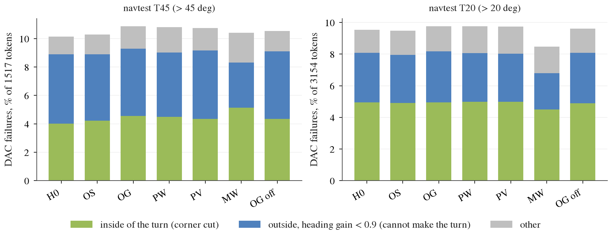
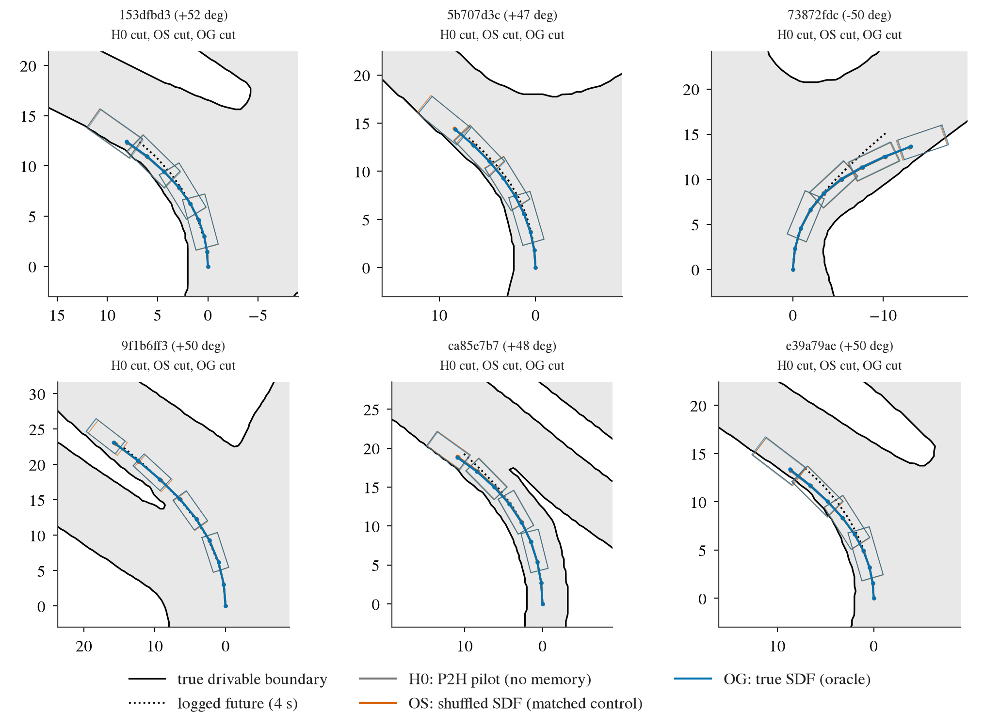
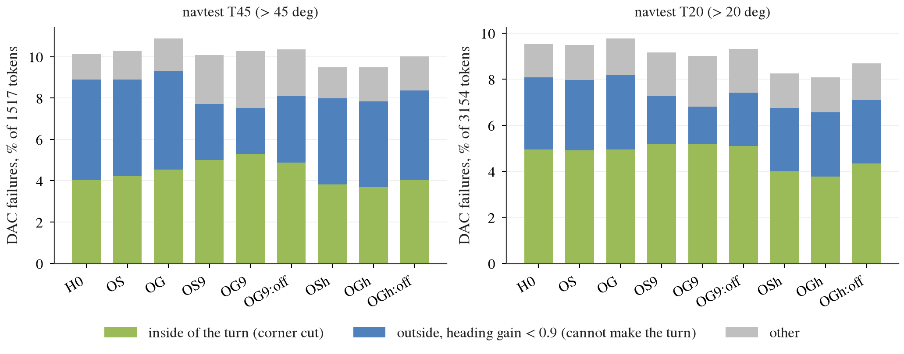
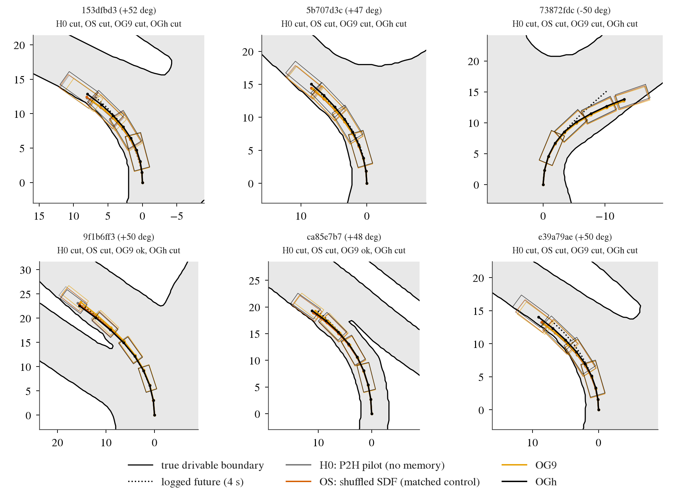

# op_parity turn-oracle: does the P2H plan pathway cut fewer inside corners when it is given the true drivable-boundary geometry?

Written 2026-10-08. Pre-registration and step-2 addendum: [plans/2026-10-08-turn-oracle-prereg.md](../plans/2026-10-08-turn-oracle-prereg.md) (both parts
committed before the reads they govern). Code: `scripts/turn_oracle.py` (banks, replay, gate, report, fresh-head decoder), `scripts/turn_oracle_chain.sh`
(step 1), `scripts/turn_oracle_b_chain.sh` (step 2), four new `--mem` kinds in `scripts/pp_train.py`. Tables: [turn_oracle/](turn_oracle/). The true SDF
is a privileged input: every arm that reads it is an oracle probe, not a method. Pilot scale, seed 0 only (both pre-registered gates stopped the second seed).

## Answer

**No. True geometry does not remove the sharp-turn inside cut, in the P2 plan pathway or in a fresh head.**

1. **Step 1, rule verdict "plan head is the bottleneck" (clear negative on the seed-0 gate).** With the true 0.5 m drivable SDF as 32 adapter memory
   tokens (OG) against the same tokens shuffled across logs (OS), the > 45 deg inside-cut rate is 4.55% vs 4.22%: closure -0.08 [-0.19, +0.02];
   > 20 deg DAC failures +0.29 pp [-0.09, +0.71]. Probe read-outs of the SDF from WA-Cf / Cinque features (PW / PV) do nothing either.
2. **That verdict is weaker than the rule says: the plan pathway never read the tokens.** OG with the memory masked at test scores the same as OG
   (EPDMS +0.02 vs OS, inside cut 4.35%), and dev ADE is 0.615 / 0.617 for OG / OS against 0.621 without memory and 0.421 with WA-Cf tokens in the
   same channel (decision 160). Step 1 alone does not separate "would not use good geometry" from "did not learn to read this input".
3. **Step 2 separates them as far as the cheap variations go, and both answers are negative.**
   - *Fresh head (stage A).* A new thin decoder (decision 147 / 160's, with the SDF hinge) that gets the true SDF next to the Cinque tokens cuts
     > 20 deg DAC failures by 3.1 pp (11.38% -> 8.28%) but closes only 0.21 [0.03, 0.37] of the > 45 deg inside-cut rate (6.66% -> 5.27%). With the
     true SDF and ego state alone (no vision) it reaches 6.82% DAC failures on > 20 deg, the level of WA-Cf features in decision 160 (6.88%), and still
     leaves 4.35% inside cuts on > 45 deg, the same level as P2H (4.0-4.2%). So the geometry is usable for staying on the road in general, and the
     > 45 deg inside cut is the part it does not fix. By the addendum's rule (closure < 0.25): not a missing-geometry problem.
   - *P2 pathway, more training or a stronger objective (stage B).* 9 000 steps instead of 3 000: closure -0.05 [-0.20, +0.06]. Hinge lambda 30 with
     margin 0.5 m: closure +0.03 [-0.09, +0.17]. Neither pair reaches the pre-registered 0.25, so no pilot was run.
4. **What did move the read-outs is on the objective / training side and is independent of the geometry input** (control and oracle move
   together): the stronger hinge lowers > 20 deg inside cuts by 0.9 pp and all-token DAC failures by 0.6 pp (EPDMS +0.68 [+0.44, +0.94]); three
   times the steps removes 2 pp of "cannot make the turn" on > 45 deg but adds 0.8 pp of inside cuts (EPDMS +0.53 [+0.20, +0.84]).

Reading for the branch decision: the evidence is against "unfreeze late vision + drivable-boundary auxiliary loss" as a fix for the inside cut. If
the true boundary, delivered losslessly, does not reduce inside cuts for a fresh head, a sharper boundary inside Cinque's features will not either
(it may still help general > 20 deg DAC, as WA-Cf features and the SDF do offline). The remaining lever this lane saw is the objective: the hinge
weight / margin, in line with decision 161's replay hinge. It was not pursued here (outside the pre-registered branches).

## Step 1: oracle against the matched control (navtest, seed 0, values x 100, diff vs OS with 95% CI over logs)

| read-out | H0: P2H pilot | OS: shuffled SDF | OG: true SDF | PW: SDF from WA-Cf | PV: SDF from Cinque | MW: WA-Cf tokens | OG, memory masked |
|:--|:--|:--|:--|:--|:--|:--|:--|
| EPDMS, all 12 146 | 87.93 | 87.80 | 87.76 (-0.04 [-0.18, +0.11]) | 87.89 (+0.09 [-0.11, +0.28]) | 87.78 (-0.02 [-0.16, +0.11]) | 88.91 (+1.11 [+0.61, +1.56]) | 87.82 |
| EPDMS, straight < 5 deg | 92.58 | 92.51 | 92.54 (+0.03 [-0.10, +0.19]) | 92.61 | 92.49 | 93.03 | 92.53 |
| DAC fail %, > 20 deg (3 154) | 9.54 | 9.48 | 9.77 (+0.29 [-0.09, +0.71]) | 9.77 | 9.73 | 8.47 (-1.01 [-2.01, +0.07]) | 9.61 |
| DAC fail %, > 45 deg (1 517) | 10.15 | 10.28 | 10.88 (+0.59 [+0.05, +1.20]) | 10.81 | 10.74 | 10.42 | 10.55 |
| **inside-cut %, > 45 deg** | 4.02 | 4.22 | 4.55 (+0.33 [-0.07, +0.80]) | 4.48 (+0.26 [-0.34, +0.87]) | 4.35 (+0.13 [-0.26, +0.57]) | 5.14 (+0.92 [-0.11, +2.03]) | 4.35 |
| cannot-make-turn %, > 45 deg | 4.88 | 4.68 | 4.75 (+0.07 [-0.31, +0.43]) | 4.55 | 4.81 | 3.16 (-1.52 [-2.72, -0.22]) | 4.75 |
| raw-plan departure %, > 45 deg | 7.12 | 7.32 | 7.84 (+0.53 [+0.00, +1.12]) | 7.38 | 7.51 | 6.33 | 7.78 |
| inside-cut %, sharp R < 15 m (1 653) | 5.44 | 5.57 | 5.57 (+0.00 [-0.42, +0.43]) | 5.75 | 5.75 | 5.69 | 5.57 |

Gate (`turn_oracle/gate-s0.json`): closure of the > 45 deg inside-cut rate < 0.25 and > 20 deg DAC drop < 0.4 pp -> clear negative, seed 1 not run.
Validity conditions of the rule hold: 64 inside-cut tokens in the control (>= 30), OS - H0 EPDMS -0.13 [-0.31, +0.05] (within 0.5). Full table with
every stratum: `turn_oracle/step1_s0/tables.md`, per-token rows `tokens_T20.csv`.

Two side facts. MW, the only arm whose memory is used, does not reduce inside cuts either (5.14% vs 4.02% for H0): its gain is "cannot make the
turn" and the 20-45 deg bin, as decision 160 found. And at pilot scale the > 45 deg failures split 40% inside / 48% cannot-make-turn, not the
54% / 26% of the full-data P2H10 in four_dirs: more data fixes heading undershoot first, and the inside cut is what is left.

*What to look at: the green segment (first departure on the inside of the turn) is the same height for H0, OS, OG, PW and PV on both strata; only MW
changes the bars, and it shrinks the blue segment (heading undershoot), not the green one.*

*What to look at: six > 45 deg tokens where H0 and the control both cut the inside corner (fixed rule: evenly spaced in the sorted token list,
`turn_oracle/step1_s0/bev_tokens.txt`). The oracle plan lies on top of the other two. Footprints are drawn every second pose.*

## Step 2, stage A: can a fresh head use the true SDF? (thin decoder, navtest > 20 deg tokens, diff vs V+S)

| read-out | V: Cinque tokens | V+S: + shuffled SDF | V+G: + true SDF | G: true SDF + ego only |
|:--|:--|:--|:--|:--|
| DAC fail %, > 20 deg (3 154) | 10.59 | 11.38 | 8.28 (-3.11 [-4.19, -2.04]) | 6.82 (-4.57 [-6.43, -2.90]) |
| inside-cut %, > 20 deg | 5.77 | 6.44 | 4.50 (-1.93 [-3.05, -0.84]) | 3.61 (-2.82 [-4.48, -1.21]) |
| DAC fail %, > 45 deg (1 517) | 12.52 | 13.05 | 10.15 (-2.90 [-4.40, -1.49]) | 8.31 (-4.75 [-7.42, -2.26]) |
| **inside-cut %, > 45 deg** | 6.20 | 6.66 | 5.27 (-1.38 [-2.62, -0.14]) | 4.35 (-2.31 [-4.68, -0.12]) |
| cannot-make-turn %, > 45 deg | 4.22 | 4.48 | 3.16 (-1.32 [-2.30, -0.51]) | 2.57 (-1.91 [-3.45, -0.62]) |
| raw-plan departure %, > 45 deg | 8.70 | 8.64 | 7.19 (-1.45 [-2.54, -0.40]) | 4.09 (-4.55 [-6.71, -2.47]) |

Closure V+G vs V+S on > 45 deg: inside cut 0.21 [0.03, 0.37], DAC 0.22 [0.12, 0.31] -> "not usable even by a fresh head" by the addendum's
threshold (< 0.25); the interval reaches into "partly". V reproduces decision 160's 10.59% exactly. The G arm is not in the rule: it shows that
3 072 SDF values beside 16 384 vision dimensions are under-used by this MLP, and that even as the only input the SDF leaves two thirds of the
> 45 deg inside cuts. Tables: `turn_oracle/stageA/`.

## Step 2, stage B: the P2 pathway with more training or a stronger hinge (navtest, seed 0, each oracle arm vs its own shuffled control)

| read-out | OS9 (9 000 steps) | OG9 | OG9, memory masked | OSh (hinge 30, 0.5 m) | OGh | OGh, memory masked |
|:--|:--|:--|:--|:--|:--|:--|
| EPDMS, all | 88.33 | 88.38 | 88.29 | 88.48 | 88.58 | 88.32 |
| EPDMS, straight < 5 deg | 92.72 | 92.71 | 92.71 | 92.65 | 92.73 | 92.69 |
| DAC fail %, all | 4.08 | 3.99 | 4.15 | 3.54 | 3.33 | 3.68 |
| DAC fail %, > 20 deg | 9.16 | 9.00 | 9.32 | 8.24 | 8.08 | 8.69 |
| DAC fail %, > 45 deg | 10.09 | 10.28 | 10.35 | 9.49 | 9.49 | 10.02 |
| **inside-cut %, > 45 deg** | 5.01 | 5.27 | 4.88 | 3.82 | 3.69 | 4.02 |
| cannot-make-turn %, > 45 deg | 2.70 | 2.24 | 3.23 | 4.15 | 4.15 | 4.35 |
| inside-cut %, > 20 deg | 5.20 | 5.20 | 5.10 | 3.99 | 3.77 | 4.34 |

| pair | closure of the > 45 deg inside-cut rate | oracle - control, pp | > 20 deg DAC fail, oracle - control | qualifies (>= 0.25 and DAC drop >= 0.4 pp) |
|:--|:--|:--|:--|:--|
| OG9 vs OS9 | -0.05 [-0.20, +0.06] | +0.26 [-0.33, +0.94] | -0.16 [-0.75, +0.51] | no |
| OGh vs OSh | +0.03 [-0.09, +0.17] | -0.13 [-0.65, +0.35] | -0.16 [-0.67, +0.34] | no |

No pair qualifies (`turn_oracle/gate-b.json`), so the single pilot of the addendum was not run. Under the stronger hinge the channel starts to be
read (masking the memory of OGh costs 0.26 EPDMS and 0.35 pp of all-token DAC failures), but the effect against the shuffled control is inside the
noise and is not on the > 45 deg inside cut. Tables: `turn_oracle/stageB_s0/`.

*What to look at: within each pair (OS9 / OG9, OSh / OGh) the bars are equal; between recipes they are not: 9 000 steps shrinks the blue segment and
grows the green one, the stronger hinge shrinks the green one on > 20 deg.*

*What to look at: the same kind of tokens (H0 and OS both cut) with the two step-2 oracle arms. All plans follow the logged future (dotted) to within
a few decimetres, and the logged path itself passes close to the inside curb: the cut is a footprint graze on a path that imitates the log, which
is why knowing the boundary does not change it unless the objective asks for clearance.*

## Setup

- **Recipe.** Decision 160's stage-1 H0 (the P2H pilot: `pp_train --arm P2 --frames warp --hinge-lam 10`, split `navsim/op-parity-s234`, 25 415 train
  tokens, 3 000 steps x 64, seed 0) plus `--mem <kind>`. All memory arms have the same parameters (adapter 2.66 M), 32 tokens, row stream and memory
  drop 0.25. H0 = `RH0-F-s0` and MW = `RMW-F-s0` are the decision-160 checkpoints and navtest reads, reused.
- **Injection.** The adapter's memory channel (LayerNorm, linear, 2-layer decoder, a bias on the hidden tokens of the 9 context frames): the channel
  decision 160 showed the plan pathway uses. Encoding: the decision-148 label raster (128 x 96 cells of 0.5 m, x -8..56 m, y +-24 m) losslessly,
  token k = raster rows 4k..4k+3, values clip(SDF, +-6 m) / 3, 64 constant dimensions as a scale reference. Map geometry only, no route.
- **Banks** (`turn_oracle/bank_stats.json`). OS: rows permuted inside each data dir, every row to another log (band MAE vs the true raster 3.9-4.2 m).
  PW / PV: turn_probe's MLP, navtrain 5-fold out-of-fold over logs, navtest from turn_probe's stored prediction; boundary-band MAE navtrain / navtest
  0.59 / 0.75 m (WA-Cf) and 0.84 / 1.02 m (Cinque); the 1 m -> 0.5 m resampling of these arms costs 0.03 m.
- **Read-outs.** navtest through `jevdrive.bench`; turn strata by logged 4 s heading change. Inside cut = DAC < 1 and the first footprint corner outside
  along the LQR replay is on the side of the turn; cannot-make-turn = DAC < 1, outside, heading gain < 0.9 (four_dirs D1i / D1u, applied to the
  heading strata), from four_dirs' instrumented replay (`fd_navsim._init / work`, unchanged) on each arm's DAC-failure tokens. CIs: log-cluster paired
  bootstrap (`jevdrive.stats.paired`, B 4 000); closure CIs: ratio over the same log resample.
- **Stage A.** `rep.py decode`'s net and loop (2 x 1024 MLP, 4 000 steps, hinge lambda 10, margin 0.3, seed 0) on z-scored inputs; SDF as the 1 m raster
  (3 072 values); scored with `jevdrive.bench score-poses` and replayed on all 3 154 > 20 deg tokens.

## Verified / not verified

- Verified: replay DAC equals bench DAC on every failing token of every arm (500-509 per model, 0 disagreements, a side found for all); stage A replay
  DAC equals `score-poses` DAC on all 4 x 3 154 rows; stage A arm V reproduces decision 160 (10.59%); the shuffled bank has no row from its own log;
  label coverage 1.0 on all four data dirs; all trainings pass `pp_full_check.py train`.
- Not verified / limits: one seed and pilot scale everywhere (both gates stopped seed 1, so no seed variance; the intervals are over logs only); one
  injection path and one encoding (a convolutional reader or geometry in the ego MLP was pre-registered as out of scope), so "the P2 pathway cannot
  use geometry" is shown only for this channel; the fresh head is a small MLP that over-fits the vision tokens (train imitation loss 0.011), which is
  why G beats V+G; stage A's closure interval [0.03, 0.37] straddles the 0.25 threshold; the stage B hinge setting is a single point.
- Not done: navhard (its synthetic frames have no SDF labels), HUGSIM, full-data runs, seed 1, the pilot (no candidate qualified).

## Deviations from the pre-registration

None in the rules or thresholds. Process: the first run of the step-2 chain stopped at the stage A replay on an argument-parser bug (`--procs`
attached to the wrong sub-command); fixed and resumed before any stage A number was read. The stage A fit log (raw-footprint departure rates of the
four decoders) was seen during that fix, before the scored table. "Full 2-seed run" was declared in the pre-registration as two seeds at pilot scale.

## Reused instead of re-run

`RH0-F-s0`, `RMW-F-s0` (training and navtest reads, decision 160); SDF labels `runs/op_probe/labels/`; feature caches `runs/op_probe/feats/`; turn_probe's
navtest predictions and probe code; `rep.py decode`'s decoder; four_dirs' replay and bucket definitions; `jevdrive.bench` for every score.

## Cost

About 1.3 card-hours in total (step 1: banks 3 min, 4 trainings of 7 min; step 2: 2 trainings of 14 min, 2 of 6 min, decoder 1 min; navtest plan
jobs), against a budget of 2 + 4. CPU: 11 navtest reads, 3 replays (10-30 s each on 48 cores), one `score-poses` run.
