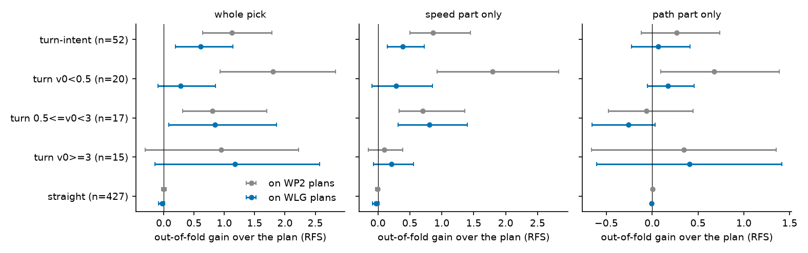
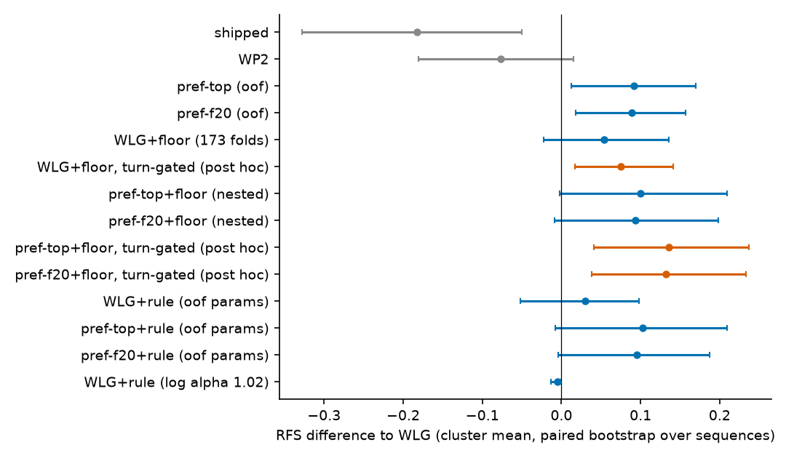

# The floor head's gain is a turn-intent speed cut that WLG already half absorbs: out of fold it adds +0.054 [-0.023, +0.136] on WLG and +0.00 on the preference plans, and no fixed rule reproduces it

Written 2026-10-08. Open loop on WOD-E2E val (479 rater frames), nothing submitted. Pre-registration (committed before any new score, rule
family added in addendum A before any rule was scored): [plans/2026-10-08-turn-prior-prereg.md](../plans/2026-10-08-turn-prior-prereg.md).
Code: `scripts/turn_prior.py` (prep, desc, stack, rule, figs; all CPU). Tables: [turn_prior/](turn_prior/); figures:
[../figs/turn_prior/](../figs/turn_prior/). Conventions of [s2_thinhead.md](s2_thinhead.md) and [wod_pref.md](wod_pref.md): cluster-mean RFS, paired
bootstrap over sequences (B 4 000), an arm = the per-frame mean of the two seeds, candidates = F20 (WP2 path family 5 x speed 4), the head = the
decision-173 `E` ridge (ego + command + plan descriptor), 5-fold by sequence x 10 repeats. Reproduction gate: the head on WP2 gives +0.148
[+0.062, +0.248], frame-wise identical to the stored `E|b|L` (max difference 0.0000).

## Answer

- **What the head does on the 52 turn-intent frames** ([turn_prior/desc_picks.csv](turn_prior/desc_picks.csv)). It changes 90 % of them (WP2 plans) and
  mostly the speed profile: hold 50 %, creep 20 %, median 5 s travel 0.44 of the plan's; where it moves the path it moves it 2-4 m to the outside of
  the turn (mean -3.2 m towards the turn), i.e. "slow down and stay outside" against a plan that cuts inside. The gain is the speed part
  (+0.87 [+0.50, +1.45] of +1.12); the path part alone is +0.27 [-0.12, +0.74]. Left turns carry more (+1.23 [+0.73, +2.32], 23 frames) than right
  turns (+0.65 [-0.06, +1.77], 29 frames).
- **It overlaps WLG exactly where WLG works, and not elsewhere.** v0 < 0.5 m/s (20 frames): +1.80 [+0.93, +2.83] on WP2, 90 % hold picks (the
  standstill-start turns); WLG already lifts these frames by +1.55 [+0.80, +2.43] and the head's gain on WLG is +0.28 [-0.10, +0.86]. 0.5-3 m/s
  (17 frames): +0.80 -> +0.84 [+0.08, +1.86] on WLG, hold / creep 76 % of picks, median travel 0.47 -> 0.67 of the plan, speed part
  +0.81 [+0.31, +1.40]: this is the part WLG leaves. >= 3 m/s (15 frames): speed kept (median ratio 1.0), path moved outward, +1.18 [-0.15, +2.57] on
  WLG, no supported component.
- **One-sentence rule: "on turn intent below about 3 m/s, cut the 5 s travel to roughly half and stay a few metres outside the plan's turn" is what the
  picks look like, but it does not survive as a fixed rule.** The speed prior derived from WOD logs is the identity (median logged / plan 5 s travel
  on 281 r2-dev turn rows at 0.5-3 m/s: 1.02), and as a post-rule it scores -0.005 [-0.013, -0.000] on WLG. The rule family fitted out of fold
  (alpha, 1.2 m outward nudge, v-range; 24 configs) picks the same configuration in all five folds (alpha 0.7, nudge 1.2 m, all v0) and gives
  +0.030 [-0.052, +0.098] on WLG; it moves the turn frames by +0.68 (frame mean) but the cluster-mean is dominated by a few frames that lose 3-5
  RFS points (turn-intent, cluster mean: -0.04 [-0.48, +0.84]). The head picks per frame; a constant scale is not that.
- **Additivity (pre-registered contrasts).** Out of fold the floor head on WLG's candidates is +0.054 [-0.023, +0.136] over WLG (permutation: null
  [-0.030, +0.008], p 0.005; the gain needs the real inputs, but the CI includes 0), +0.237 [+0.091, +0.390] over shipped. On top of the preference
  plans, with the head fitted on WLG candidates only so that no scored frame is fitted or selected on by either stage (nested): +0.008 [-0.060, +0.081]
  over `top` and +0.004 [-0.068, +0.081] over `f20`, +0.100 [-0.003, +0.209] / +0.093 [-0.009, +0.199] over WLG. By the pre-registered rule
  none of these delivers (lower bound over WLG <= 0) and none is additive (lower bound over the base < 0).
- **Why the all-frame number is small:** the head helps turn-intent frames on WLG (+0.61 [+0.19, +1.14], frame mean +0.86) and costs
  straight frames (-0.027 [-0.086, +0.019]; straight standstill -0.125 [-0.347, -0.004]). Post hoc, using the head only where the command says left /
  right gives +0.075 [+0.017, +0.142] over WLG and +0.136 [+0.041, +0.237] / +0.132 [+0.038, +0.233] over WLG on the preference plans (over
  the preference base +0.044 [-0.013, +0.108] / +0.043 [-0.020, +0.112]). These gated arms were defined after seeing the strata (no permutation
  control, one of 15 arms): weak, not a delivery under the pre-registration.
- **Training arm (3b) not run.** The pre-registered trigger needs the five folds to agree and the nudge to be 0 (so that a label retime is the whole
  rule); the folds agree but on a 1.2 m outward nudge, which a retimed-label recipe cannot express, and the speed-only part of the grid peaks at
  +0.038 [+0.007, +0.074] (alpha 0.85, all v0, in sample).

## Arms ([turn_prior/stack_arms.csv](turn_prior/stack_arms.csv), [rule_arms.csv](turn_prior/rule_arms.csv); figure 2)

`d vs base`: over the plan the stage is applied to (WLG, or the preference arm); `perm p`: 200 input permutations x 3 fold repeats.

| arm | RFS | d vs WLG [CI] | d vs shipped [CI] | d vs its base [CI] | perm p |
|---|---:|---|---|---|---:|
| shipped | 8.005 | -0.183 [-0.328, -0.050] | - | | |
| WP2 | 8.111 | -0.077 [-0.180, +0.015] | +0.106 [-0.060, +0.279] | | |
| WLG | 8.188 | - | +0.183 [+0.050, +0.328] | | |
| pref-top (oof, decision 171) | 8.279 | +0.091 [+0.012, +0.170] | +0.274 [+0.136, +0.418] | | |
| pref-f20 (oof, decision 171) | 8.277 | +0.089 [+0.018, +0.156] | +0.272 [+0.132, +0.420] | | |
| WLG + floor head (173 folds) | 8.242 | +0.054 [-0.023, +0.136] | +0.237 [+0.091, +0.390] | +0.054 [-0.023, +0.136] | 0.005 |
| WLG + floor head (pref folds) | 8.226 | +0.038 [-0.054, +0.126] | +0.221 [+0.068, +0.379] | +0.038 [-0.054, +0.126] | |
| pref-top + floor head (nested) | 8.287 | +0.100 [-0.003, +0.209] | +0.282 [+0.135, +0.440] | +0.008 [-0.060, +0.081] | 0.020 |
| pref-f20 + floor head (nested) | 8.281 | +0.093 [-0.009, +0.199] | +0.276 [+0.125, +0.433] | +0.004 [-0.068, +0.081] | 0.030 |
| pref-top + floor head (head on pref plans, not nested) | 8.319 | +0.131 [+0.041, +0.230] | +0.314 [+0.175, +0.460] | +0.040 [-0.018, +0.102] | |
| pref-f20 + floor head (head on pref plans, not nested) | 8.304 | +0.116 [+0.027, +0.209] | +0.299 [+0.157, +0.448] | +0.027 [-0.031, +0.088] | |
| WLG + floor head, turn-gated (post hoc) | 8.263 | +0.075 [+0.017, +0.142] | +0.258 [+0.125, +0.407] | +0.075 [+0.017, +0.142] | |
| pref-top + floor head, turn-gated (post hoc) | 8.323 | +0.136 [+0.041, +0.237] | +0.319 [+0.174, +0.470] | +0.044 [-0.013, +0.108] | |
| pref-f20 + floor head, turn-gated (post hoc) | 8.320 | +0.132 [+0.038, +0.233] | +0.315 [+0.170, +0.468] | +0.043 [-0.020, +0.112] | |
| WLG + rule (out-of-fold params) | 8.217 | +0.030 [-0.052, +0.098] | +0.212 [+0.067, +0.362] | +0.030 [-0.052, +0.098] | |
| WLG + rule (alpha from logs, 1.02) | 8.182 | -0.005 [-0.013, -0.000] | +0.177 [+0.042, +0.321] | -0.005 [-0.013, -0.000] | |
| pref-top + rule (out-of-fold params) | 8.290 | +0.103 [-0.008, +0.209] | +0.286 [+0.135, +0.439] | +0.011 [-0.070, +0.084] | |
| pref-f20 + rule (out-of-fold params) | 8.283 | +0.095 [-0.004, +0.187] | +0.278 [+0.127, +0.430] | +0.006 [-0.078, +0.075] | |

The two non-nested rows fit the head on frames whose pref plans came from models that saw the scored fold's labels; they read higher (+0.04 / +0.03
over the base) than the nested rows (+0.01 / +0.00), which is the size of the leak the nested design removes (or of the plan-distribution
mismatch the nested head pays; this run cannot separate the two).

## Strata ([turn_prior/desc_picks.csv](turn_prior/desc_picks.csv), [stack_strata.csv](turn_prior/stack_strata.csv), figure 1)

Floor head, out of fold, gain over the plan it is applied to; n in brackets. Cluster-mean RFS; the sparse strata also have a frame-mean column in the
CSVs (cluster-mean and frame-mean differ a lot on 15-20 frame strata).

| stratum | WP2 plans | WLG plans | speed part on WLG | hold + creep share (WP2 / WLG) | median 5 s travel, pick / plan (WP2 / WLG) |
|---|---|---|---|---|---|
| turn-intent [52] | +1.124 [+0.643, +1.787] | +0.610 [+0.194, +1.141] | +0.387 [+0.151, +0.722] | 0.70 / 0.60 | 0.44 / 0.77 |
| turn, v0 < 0.5 [20] | +1.800 [+0.928, +2.831] | +0.281 [-0.095, +0.855] | +0.283 [-0.092, +0.857] | 0.90 / 0.68 | 0.05 / 0.23 |
| turn, 0.5-3 [17] | +0.799 [+0.308, +1.698] | +0.844 [+0.084, +1.859] | +0.809 [+0.313, +1.401] | 0.83 / 0.76 | 0.47 / 0.67 |
| turn, >= 3 [15] | +0.948 [-0.305, +2.223] | +1.177 [-0.147, +2.572] | +0.214 [-0.069, +0.555] | 0.28 / 0.31 | 1.00 / 1.00 |
| straight [427] | +0.000 [-0.035, +0.038] | -0.027 [-0.086, +0.019] | -0.026 [-0.084, +0.020] | | |
| left [23] | +1.225 [+0.727, +2.318] | +0.567 [+0.188, +1.383] | | | |
| right [29] | +0.648 [-0.061, +1.774] | +0.272 [-0.277, +1.163] | | | |

Out-of-fold parameters of the rule ([turn_prior/rule_params.csv](turn_prior/rule_params.csv)): all five folds select alpha 0.7, 1.2 m outward, v0 in
[0, inf), train gain +0.47 to +1.02 on 36-44 turn frames. In-sample grid ([rule_grid_insample.csv](turn_prior/rule_grid_insample.csv)): no
configuration has a lower bound above +0.007 over all frames; the best is alpha 0.5 + nudge on 0.5-3 m/s, +0.043 [+0.005, +0.091], fitted and scored
on the same frames.

## Figures

Figure 1: the head's out-of-fold gain by stratum on WP2 and WLG plans, whole pick / speed part / path part. Look at the turn v0 < 0.5 row (blue falls
from +1.8 to +0.3, the WLG overlap), the 0.5-3 row (unchanged, speed part) and the >= 3 row (path, CIs include 0).

Figure 2: every arm against WLG. Look at the nested stacks and the rule arms (CIs reach 0), against the orange post-hoc turn-gated arms (lower bound
just above 0).

## What was not verified

- Closed loop, the harness path, and WOD test: everything here is open-loop RFS on the 479 rater frames. 52 turn-intent frames (15-20 per v0 stratum) carry
  the effect; the strata above are descriptive and their CIs are wide.
- No System-1 training arm (3b not triggered), so whether a turn speed prior can be trained in is open; the log-derived prior (alpha 1.02) says the
  logs do not contain it: the head's "slower than the plan" is a rater preference (a safety margin on turns), not imitation of the log.
- The head in the stack: no MLP head, no vision stream (decision 173 settled that); the nested design fits the head on WLG candidates and applies it
  to preference-plan candidates, so it pays a small distribution mismatch; the cleaner alternative (preference runs re-trained on nested folds) was
  not run.
- Right turns: the right-turn gain is not distinguished from 0 on either plan set (29 frames).

## Deviations

- The rule's form (speed scale + outward nudge) comes from the picks on the scored frames; only its parameters are out of fold or from logs (stated in
  addendum A).
- The turn-gated arms are post hoc (defined after the strata were seen); no permutation control was run for them or for the rule arms. 15 arms were
  scored in total; read the lower bounds near +0.02 as weak.
- 2a uses two fold sets: the decision-173 random folds (primary, comparable to the +0.148) and the wod_pref folds (the nested stack); they differ by
  0.016 on WLG (+0.054 vs +0.038).
- The rule's training-fold objective is the plain mean over turn-intent frames (not cluster-mean) because there are only 36-44 of them.
