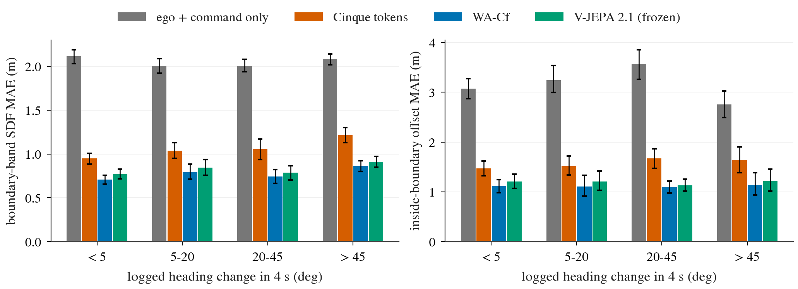
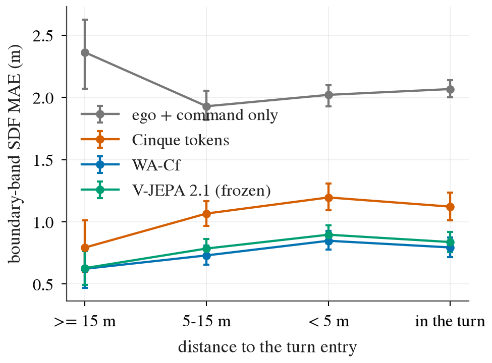
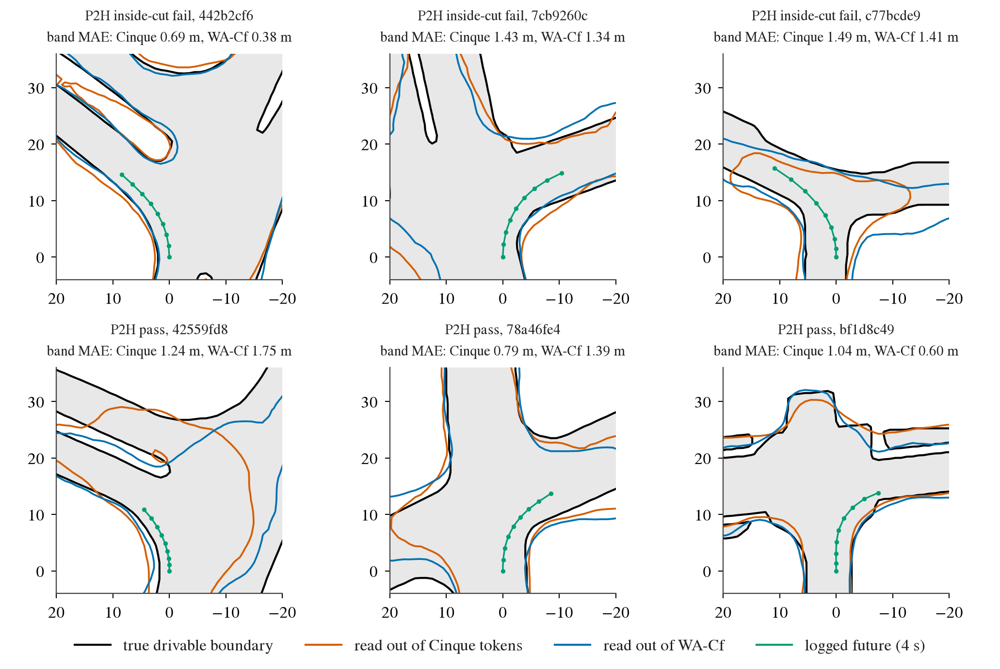

# op_parity turn-probe: is junction / road-boundary geometry readable from the frozen Cinque tokens on sharp turns?

Written 2026-10-07. Pre-registration: [plans/2026-10-07-turn-probe-prereg.md](../plans/2026-10-07-turn-probe-prereg.md) (committed before any read; no
deviation of the rule). Code: `scripts/turn_probe.py` (fit / report), `scripts/turn_probe_chain.sh`. Tables: [turn_probe/](turn_probe/)
(`strata.csv`, `contrasts.csv`, `failsets.csv`, `entry.csv`, `r2.csv`, `verdict.json`, `tables.md` with every probe / metric / split; small gate in
`turn_probe/small/`). Read-out probes only: no driving model trained, cached features and labels only.

## Answer

**By the pre-registered rule: "representation lacks it (turn-specific)".** On navtest turns > 45 deg the same MLP probe locates the drivable
boundary 0.35 m [0.32, 0.39] worse from Cinque's tokens than from WA-Cf (1.21 vs 0.86 m, +41%; R1 passes), and Cinque degrades more from
straight to sharp turns than WA-Cf does (difference in differences +0.11 m [0.07, 0.15]; R2 passes); the ridge probe agrees in sign on both
(+0.39, +0.14). Validity G0 passes (skill over the ego + command floor on > 45 deg: Cinque 0.42, WA-Cf 0.59).

**How strong that verdict is: weak support for the specific fix.** Three things the rule does not show:

1. **The deficit is mostly general, not turn-specific.** Cinque is already 0.24 m (+34%) worse on straight tokens; the turn-specific part is
   0.11 of the 0.35 m gap on > 45 deg (ratio of ratios 1.05 [1.01, 1.09]). On the path-conditioned corridor metric the DiD is not detected
   (+0.08 [-0.01, +0.18]); on the 408 held-out navtrain tokens the gap is the same size (+0.29) and the DiD is not detected (35 sharp-turn tokens).
2. **Readable geometry is not what made WA-Cf work as a memory.** Frozen original V-JEPA 2.1 (VJ21) reads the boundary almost as well as WA-Cf
   on every stratum (0.91 vs 0.86 m on > 45 deg, Cinque 1.21), yet decision 160 found VJ21 no better than Cinque for the thin plan decoder
   (T20 DAC failures 11.79% vs 10.59%, closure 0.35) and only the NAVSIM-fine-tuned WA-Cf passed. So this probe's quantity is not sufficient
   for the driving gain: an encoder can hold the boundary to within 0.9 m and still not help the planner.
3. **The failure-subset read supports the mechanism only partly.** On the 77 sharp-turn tokens where P2H cuts the inside corner, Cinque's
   read-out puts the inside boundary 1.22 m [0.79, 1.75] further out than it is (WA-Cf 0.51, difference 0.71 [0.41, 1.08]); on passing
   sharp-turn tokens 0.19 vs -0.03. The excess over passes is larger for Cinque (+1.03 vs +0.54, difference +0.49 [0.19, 0.87]; ridge
   +0.51 [-0.10, +1.20]). But the ego-only floor shows the same +1.23 on those tokens, and unsigned errors are not larger for Cinque there
   (band excess 0.17 vs 0.19): the failing tokens are tight inside corners where any probe regresses toward a wider road, and Cinque regresses
   more.

Reading for the decision "unfreeze late vision + drivable-area auxiliary loss" vs "plan head": the probe does not clear the encoder, and it
does not single out junction geometry either. It says Cinque's tokens carry coarser road-edge geometry everywhere (about 0.25-0.35 m in boundary
location, 0.5 m on the inside edge of turns) and over-estimate inside room on exactly the corner-cut tokens; it does not say that supplying
that geometry closes the driving gap (VJ21 has it and did not, decision 160). A drivable-area auxiliary loss on unfrozen late vision is
supported as a way to sharpen edge geometry, with a prior that it buys part of the 160 gain at most; the plan-head line is not ruled out
(decision 153: 40% of sharp-turn failures are head-side by the decoder read).

## Key table (navtest, MLP probe, boundary-band SDF MAE in m, 95% CI over 136 logs, B 4 000)

| stratum (logged heading change in 4 s) | n (logs) | E: ego + command floor | V: Cinque | WA: WA-Cf | VJ21 (reference) | V - WA | rel |
|:--|--:|:--|:--|:--|:--|:--|--:|
| all | 12 146 (136) | 2.07 [2.02, 2.12] | 1.01 [0.95, 1.08] | 0.75 [0.70, 0.80] | 0.81 [0.75, 0.86] | +0.27 [+0.24, +0.29] | +35% |
| straight < 5 deg | 6 400 (135) | 2.11 [2.03, 2.19] | 0.95 [0.88, 1.01] | 0.71 [0.66, 0.76] | 0.77 [0.72, 0.83] | +0.24 [+0.21, +0.27] | +34% |
| 5-20 deg | 2 592 (118) | 2.00 [1.92, 2.09] | 1.04 [0.95, 1.13] | 0.79 [0.71, 0.88] | 0.84 [0.76, 0.94] | +0.25 [+0.22, +0.27] | +31% |
| turn 20-45 deg | 1 637 (105) | 2.01 [1.94, 2.08] | 1.05 [0.94, 1.17] | 0.74 [0.66, 0.82] | 0.79 [0.70, 0.87] | +0.31 [+0.26, +0.37] | +42% |
| turn > 45 deg | 1 517 (101) | 2.08 [2.02, 2.14] | 1.21 [1.13, 1.30] | 0.86 [0.80, 0.92] | 0.91 [0.85, 0.97] | +0.35 [+0.32, +0.39] | +41% |

| rule (navtest, band MAE) | threshold | MLP (decides) | ridge (sign check) | verdict |
|:--|:--|:--|:--|:--|
| G0 skill over E on > 45 deg, V / WA | both >= 0.15 | 0.42 / 0.59 | 0.22 / 0.40 | pass |
| R1 V - WA on > 45 deg | CI low > 0 and >= 10% of WA | +0.35 [+0.32, +0.39], +41% | +0.39 [+0.35, +0.43], +30% | pass |
| R2 DiD (> 45 deg - straight), V minus WA | CI low > 0 | +0.11 [+0.07, +0.15] | +0.14 [+0.09, +0.19] | pass |
| report: DiD 20-45 deg | - | +0.07 [+0.02, +0.13] | +0.18 [+0.11, +0.23] | |

Inside-boundary offset MAE on > 45 deg (free distance from the logged path to the boundary on the turn's inside, read off the predicted raster,
m): V 1.63 [1.39, 1.91], WA 1.14 [0.94, 1.38], VJ21 1.22, E 2.75; V - WA +0.49 [+0.40, +0.59]. By arc length 5 / 10 / 15 / 20 m: V 1.50 / 1.49 /
1.63 / 1.91, WA 0.94 / 0.97 / 1.15 / 1.50: the gap is about 0.5 m at every distance, not concentrated far ahead. Raster R^2 on navtest (ridge /
MLP): E 0.15 / 0.37, V 0.66 / 0.80, WA 0.78 / 0.89, VJ21 0.76 / 0.87: the V and WA values reproduce decision 146's 0.66 / 0.78 and 0.80 / 0.89.

*What to look at: the Cinque bar (red) sits above WA-Cf (blue) by a similar amount in every turn bin, a little more on the two turn bins; frozen
V-JEPA 2.1 (green) is next to WA-Cf everywhere. The grey floor (ego + command only) is far above all three, so the probes read the image.*

## Floor control

The ego-only probe (20 numbers: command one-hot, velocity, acceleration, 1.5 s pose history) has band MAE 2.0-2.1 m in every stratum and raster
R^2 0.37 (MLP): the band target is not predictable from speed / command. The path-conditioned inside offset is harder for it (2.75-3.56 m).
Every vision arm halves the floor. The floor matters for the failure subset below: its signed inside bias on the corner-cut tokens equals
Cinque's.

## P2H failure subsets (navtest > 45 deg; labels from `results/four_dirs/nav_tokens_navtest.csv`, bucket `D1' >45`, either seed; MLP)

| group | n (logs) | metric | E | V | WA | VJ21 | V - WA |
|:--|--:|:--|:--|:--|:--|:--|:--|
| inside-cut fail | 77 (35) | band MAE | 1.96 | 1.37 [1.24, 1.53] | 1.04 [0.90, 1.17] | 1.06 | +0.34 [0.22, 0.48] |
| inside-cut fail | 77 (35) | inside MAE | 2.08 | 1.72 [1.37, 2.16] | 1.09 [0.86, 1.38] | 1.15 | +0.63 [0.40, 0.91] |
| inside-cut fail | 77 (35) | inside signed bias (+ = more room than there is) | +1.23 [0.67, 1.70] | +1.22 [0.79, 1.75] | +0.51 [0.22, 0.82] | +0.77 | +0.71 [0.41, 1.08] |
| other DAC fail | 88 (29) | band MAE | 2.29 | 1.25 [1.05, 1.48] | 0.90 [0.74, 1.09] | 0.98 | +0.35 [0.26, 0.46] |
| other DAC fail | 88 (29) | inside signed bias | -0.42 | -0.14 [-0.76, 0.42] | -0.36 [-0.87, 0.06] | -0.67 | +0.22 [-0.16, 0.59] |
| pass | 1 352 (100) | band MAE | 2.08 | 1.20 [1.12, 1.29] | 0.85 [0.79, 0.91] | 0.90 | +0.35 [0.32, 0.39] |
| pass | 1 352 (100) | inside signed bias | -0.10 | +0.19 [-0.12, 0.45] | -0.03 [-0.28, 0.19] | +0.04 | +0.22 [0.09, 0.34] |
| inside-cut fail - pass | | band MAE | | +0.17 [0.02, 0.34] | +0.19 [0.05, 0.33] | | -0.02 [-0.13, 0.12] |
| inside-cut fail - pass | | inside signed bias | | +1.03 [0.54, 1.61] | +0.54 [0.20, 0.87] | | +0.49 [0.19, 0.87] |

The pre-stated direction holds for the signed bias (Cinque > 0 on corner cuts, larger than WA-Cf, not on passes), consistent with decision
146's margin bias (+0.75 vs +0.38 on P2's failures). The unsigned error does not single these tokens out for Cinque, and the tokens are selected
on P2H's own failures (decision 160, deviation 8: selection-biased toward Cinque-feature errors).

## Distance to the turn entry (navtest > 20 deg; entry = first 5 deg of heading change on the logged future; MLP, band MAE in m)

| group | n (logs) | V | WA | VJ21 | V - WA |
|:--|--:|:--|:--|:--|:--|
| entry >= 15 m ahead | 32 (20) | 0.79 [0.60, 1.01] | 0.62 [0.47, 0.77] | 0.63 | +0.17 [0.07, 0.29] |
| entry 5-15 m ahead | 343 (76) | 1.07 [0.97, 1.17] | 0.73 [0.65, 0.81] | 0.79 | +0.34 [0.27, 0.40] |
| entry < 5 m ahead | 792 (94) | 1.20 [1.09, 1.31] | 0.85 [0.78, 0.93] | 0.90 | +0.35 [0.30, 0.40] |
| in the turn (>= 5 deg already turned over the 1.5 s history) | 1 987 (105) | 1.12 [1.01, 1.23] | 0.79 [0.72, 0.87] | 0.84 | +0.33 [0.29, 0.37] |

*What to look at: the Cinque - WA-Cf distance is the same 0.33-0.35 m before the entry, at the entry and inside the turn. There is no sign that
Cinque sees the junction late and then catches up; the first bin has 32 tokens (a 4 s future rarely contains an entry >= 15 m ahead).*

## BEV examples (sharp turns, MLP read-out; tokens picked by a fixed rule: quartiles of the sorted token list, 3 inside-cut failures and 3 passes)

*What to look at: grey = true drivable area, black = its boundary; red = zero contour of the SDF read out of Cinque's tokens, blue = out of
WA-Cf; green = the logged 4 s future (x forward up, left on the left). Both read-outs find the junction layout; Cinque's contour is the looser
one at corners and islands (top left, bottom left). Six tokens are illustration only (`turn_probe/bev_tokens.txt`).*

## Setup

- **Rows.** Train `navsim/op-parity-s234-train@v1` (25 415 tokens, navtrain shards s2-s4 minus dev logs); held-out navtrain
  `navsim/op-parity-s234-dev@v1` (408 tokens, 32 logs, log-disjoint); test = all 12 146 navtest tokens. Ridge lambda on a 10% hash-of-log subset
  of the train split (ridge fit on the other 22 971 rows); the MLP trains on all 25 415.
- **Arms** (probe input = z-scored [X, E]; X is 32 x 512 = 16 384-d for every vision arm): E only; V = Cinque `view_39` (the tokens the P2 recipe
  consumes); WA = WA-Cf (decision 160 stage-1 memory source); VJ21 = frozen V-JEPA 2.1, PCA 512 per token (reference, not in the rule).
- **Probes**: op_probe's ridge and 2-layer MLP (1024 hidden, 3 000 steps, seed 0), unchanged and identical per arm.
- **Targets**: 1 m ego-frame drivable SDF raster (labels of the decision-148 hinge) + 8 corridor distances (left / right at 5 / 10 / 15 / 20 m of
  arc length). **Primary metric**: |pred - true| over raster cells with |true SDF| <= 2 m, x 0-32 m, |y| < 16 m, per token. Chosen because the
  target does not depend on the route (the probe need not guess where the car goes, so ego speed / command cannot score), it counts only cells
  at the road edge in metres of edge location, and it covers the 4 s reach of a turning car.
- **CI**: cluster bootstrap over logs, ratio of sums, B 4 000, seed 0, one resample shared by all arms and strata (own helper instead of
  `jevdrive.stats`, because the difference in differences needs the joint resample).

## Reused instead of re-run

Feature caches `runs/op_probe/feats/{P2-F-s0, WA, VJ21}` and `runs/op_probe/rep/vj21_pca.npz` (no extraction); SDF labels
`runs/op_probe/labels/`; probe code `opb_probe.ridge_fit / mlp_fit_predict`; P2H failure labels from four_dirs. Not repeated: the whole-navtest
probe comparison of decision 146 (reproduced here as a check), the thin-decoder DAC by turn bin (op_probe view-by-turn), the junction
look-ahead AUC of decision 160 (V 0.805, WA-Cf 0.850, VJ21 0.823).

## Verified / not verified

- Verified: the batched corridor code reproduces `opb_probe.corridor` (max abs difference 1e-6 m on 100 rows); raster R^2 reproduces decision 146
  for V and WA on both probes; train / held-out splits disjoint (`splits.check_disjoint`); the report rerun gives byte-identical `strata.csv`.
- Small gate (4 000 train rows, ridge): skill on > 45 deg V 0.14 / WA 0.31, R1 +0.37 [0.33, 0.41], DiD +0.15 [0.09, 0.21]. The first chain run
  stopped here because its gate line required both arms >= 0.15; the pre-registration stops the lane only if both arms are below 0.15, so the
  gate line was corrected and the chain rerun. The rule itself was not changed; G0 on the full read is the per-arm one.
- Not verified: one probe seed; the MLP is the only non-linear probe (no attention pooling); held-out navtrain has 35 sharp-turn tokens, so
  the in-domain DiD has no power; the VJ21 PCA was fit on rows that include the held-out navtrain logs (unsupervised, navtrain only);
  whether WA-Cf's nuPlan video SSL saw navtest logs is unchecked (decision 160's caveat, it would flatter WA on navtest only: the held-out
  navtrain gap is as large); P2H failure labels are taken from four_dirs as they are.
- The probe measures what a fresh read-out can extract, not what the P2 plan pathway extracts.

## Cost

GPU: 2 fits through the pool, 101 s + 203 s on one card (about 0.09 card-h). CPU: three report jobs, about 1 min each on 8 cores.
