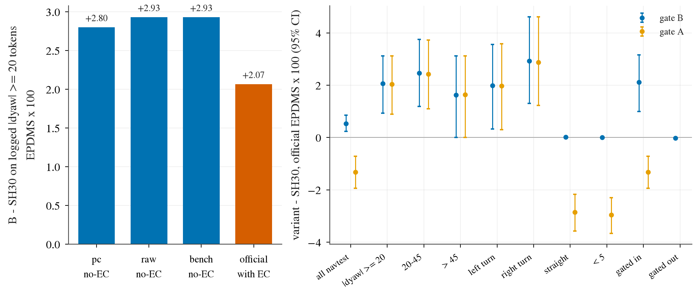

# op_parity turn selector bench: the decision-191 selector (N7) on SH30 as a bench model, official navtest / navhard

Written 2026-10-08. Pre-registration: [plans/2026-10-08-turn-selector-bench-prereg.md](../plans/2026-10-08-turn-selector-bench-prereg.md) (committed before any new number).
Code: `scripts/turn_selbench.py` (refit / repro / select stage), `scripts/turn_selbench_report.py`, `scripts/turn_selbench_chain.sh`; bench models `SH30-F-s{0,1}@{warp,gimm}:tsA|tsB|ts0` in `jevdrive/bench` (docs/bench.md).
Tables: [turn_selector_bench/](turn_selector_bench/) (`official_delta`, `gate_coverage`, `decomposition`, `subscores`, `bench/navtest_*`, `bench/navhard_*`); figure: [figs/turn_selector_bench/turn_selector_bench.png](../figs/turn_selector_bench/turn_selector_bench.png).

## Answer

**Gate B (selector only where SH30's own plan turns >= 20 deg over 4 s) is an entry by the registered line: official navtest EPDMS 90.08 vs SH30 89.55, +0.53 [+0.24, +0.85]** (two SH30 seeds, 12 146 tokens, with EC, paired log-cluster CI; per seed 89.97 / 90.20 vs 89.47 / 89.63).
Straight tokens +0.01 [+0.00, +0.04] (line: >= -0.10). The gap to WA-JEPA (91.71) goes from -2.16 to -1.63 [-2.25, -1.01]: about a quarter closed, not the leaderboard.
Gate A (selector on every token) is **not** deployable: -1.32 [-1.93, -0.72]; straights -2.86 [-3.57, -2.17], driven by LK -2.18 and EC -5.01.
Navhard (gimm, two-stage, B): combined 35.21 vs 33.67, +1.54 [-0.20, +3.38] (stage 1 +1.15, stage 2 +1.27, both CIs include 0); vs WA-JEPA 35.41: -0.20 [-3.95, +3.67]. A: 34.79, +1.13 [-1.06, +3.47].

## Gates (all passed before any non-identity score was read)

- **G-repro**: 191 kept no weights; the refit (same config (64, 0.1, 0.05), seeds 200..204, same 28 323 rows) reproduces the stored picks on the 3 154 turn tokens **exactly** (pick agreement 1.000, gain +2.7514 [+1.55, +3.82] = 191's +2.75).
- **G-feat**: features recomputed from the SH30 forward + exported poses (select stage) match 191's `margins.npz` own-edge margins to 2.4e-7 m, and the ungated N7 picks on the turn tokens equal the stored ones (agreement 1.000).
- **G-id**: `ts0` on 6 whole navtest logs (474 tokens, `navsim/op-parity-tsbench-smoke`) equals the archived SH30-F-s0 / s1 bench scores bit for bit on all 10 terms (max abs diff 0); `ts0` on full navhard s0 reproduces the archived 33.4738 / 75.8626 / 44.7926 exactly.

## Gate coverage (B vs the privileged logged bucket |dyaw| >= 20 deg)

B passes 26.1% of tokens; precision 93.2%, recall 93.7% (seed 0; seed 1 93.3 / 93.6). The selector moves 70.6-71.5% of the gated-in tokens, 19.8-20.0% of all tokens, and 0.2% of logged-straight tokens. A passes everything and moves 75% of straight tokens.

## Official deltas vs SH30 (navtest, EPDMS x 100, with EC, seed mean, 95% CI)

| stratum | n | SH30 | B | B - SH30 | A - SH30 |
|:--|--:|--:|--:|:--|:--|
| all navtest | 12146 | 89.55 | 90.08 | **+0.53 [+0.24, +0.85]** | -1.32 [-1.93, -0.72] |
| logged \|dyaw\| >= 20 | 3154 | 81.49 | 83.56 | +2.07 [+0.93, +3.12] | +2.04 [+0.89, +3.12] |
| logged 20-45 | 1637 | 83.35 | 85.82 | +2.47 [+1.19, +3.75] | +2.42 [+1.10, +3.73] |
| logged > 45 | 1517 | 79.49 | 81.12 | +1.63 [+0.01, +3.13] | +1.64 [+0.01, +3.13] |
| left turn | 1737 | 82.26 | 84.24 | +1.98 [+0.33, +3.56] | +1.98 [+0.31, +3.58] |
| right turn | 1010 | 76.79 | 79.72 | +2.93 [+1.31, +4.61] | +2.88 [+1.23, +4.62] |
| manoeuvre straight | 5267 | 93.24 | 93.26 | +0.01 [+0.00, +0.04] | -2.86 [-3.57, -2.17] |
| logged < 5 | 6400 | 93.41 | 93.42 | +0.00 [-0.01, +0.02] | -2.96 [-3.66, -2.31] |
| B gated in (token-seeds) | 6336 | 81.15 | 83.26 | +2.11 [+1.00, +3.16] | |
| B gated out (token-seeds) | 17956 | 92.51 | 92.49 | -0.02 [-0.04, -0.01] | |

The turn gain is the same under A and B (the gate only protects the rest); the gated-out loss of B (-0.02) is the EC pairing of a frame whose neighbour was moved.

## Decomposition on the 3 154 logged turn tokens (EPDMS x 100 gain over SH30)

| step | B | A |
|:--|:--|:--|
| 1 `pc` no-EC (candidate score table, 191's convention) | +2.80 [+1.63, +3.85] | +2.75 [+1.55, +3.82] |
| 2 raw no-EC (same picks, candidate scores, no `pc`) | +2.93 [+1.74, +4.00] | +2.91 [+1.69, +3.99] |
| 3 bench no-EC (bench run's own sub-scores) | +2.93 [+1.74, +4.00] | +2.91 [+1.69, +3.99] |
| 4 official with EC | +2.07 [+0.94, +3.09] | +2.04 [+0.88, +3.10] |

`pc` did not inflate the reading (raw is +0.13 higher: `pc` caps EP gains and slow-down credit, the selector gains little from them); steps 2 and 3 agree to the digit, so the candidate table and the bench scorer are the same. Moving from no-EC to official costs **0.86 (29%)**: extended comfort, not the convention, is what the 191 reading was missing.

## Sub-scores, full navtest, B vs SH30 (x 100, paired 95% CI)

| term | SH30 | B | delta |
|:--|--:|--:|:--|
| EPDMS | 89.55 | 90.08 | +0.53 [+0.24, +0.85] |
| NC | 98.60 | 98.69 | +0.08 [+0.01, +0.16] |
| DAC | 97.13 | 97.97 | +0.83 [+0.50, +1.18] |
| DDC | 99.48 | 99.54 | +0.06 [-0.01, +0.12] |
| TLC | 99.74 | 99.74 | +0.00 |
| EP | 87.16 | 87.13 | -0.04 [-0.07, -0.00] |
| TTC | 98.00 | 98.17 | +0.18 [+0.04, +0.31] |
| LK | 97.37 | 97.08 | -0.29 [-0.49, -0.11] |
| HC | 98.35 | 98.37 | +0.01 [-0.02, +0.04] |
| EC | 88.71 | 86.18 | -2.52 [-3.05, -2.00] |

DAC is the gain (+0.83, i.e. the 191 repair); the price is EC (-2.52 on the term, token-level: the picked candidates differ between neighbouring frames) and LK (-0.29, offset candidates). WA-JEPA (stored) is ahead of B on every term except HC (98.31 vs 98.37); on EC it is at 88.05 against B 86.18 and SH30 88.71.

## Verdict by the registered lines

- Entry line (full-navtest lower bound > 0 and straight >= -0.10): **passed for B** (lower bound +0.24, straight +0.01). It is an entry for the registered primary only; A fails it.
- Scenario 3 (EC eats more than half of the raw no-EC turn gain): **no**, 29% lost. Scenario 4 (straights lose > 0.10): **no for B, yes for A** (-2.86). Scenario 5: no. Scenario 2: not needed (full-navtest lower bound already > 0).
- Still true: the turn-token EC drop is real (-2.52 on the EC term over all navtest), so a selector that is consistent across frames (previous pick as input or hysteresis) is the obvious next design, to be built on navtrain sequences, not tuned on navtest. Not started.

## Cost (estimate from pool job walls; not metered per job)

Whole chain including smoke and three restarts: refit 41 s (1 card, 4 cores), repro 3 s, 9 select jobs (a few minutes each, 4 cores), 9 navtest-scale scorings of 6 shards x about 13 cores x about 5 min plus 5 navhard harness runs of 16 cores: about 35 core-h, well under 0.5 card-h; wall about 40 min from the first submit to DONE excluding my debugging. Budget 3 h / 2 card-h / 80 core-h.

## Not checked / caveats

- Navhard runs use `@gimm` frames (the decision-170 convention) while the selector's vision tokens were trained on warp-protocol navtrain tokens; the navhard result is read as-is, CIs on 225 groups are wide (lower bounds -0.20 / -1.06).
- One refit of one selector; no second seed of the fold labels; only SH30 (the selector depends on SH30's hidden state and road-edge head, so another base needs its own labels).
- The gate threshold (20 deg) was fixed in advance and not scanned; gate C (navtrain-tuned) was not built. Gate B's 6.3% false positives and 6.4% misses are untested for what they cost or gain separately.
- Open-loop, non-reactive, 4 s only; no HUGSIM or closed loop (out of scope); candidates failing after 4 s are still credited.
- navtest has now been read by 14 arms; only N7 and gate B were pre-registered tests here. The navhard index (`runs/navsim_zs/index/navhard_two_stage_slim.pkl`) had been removed by the 2026-10-08 cleanup and was rebuilt with the shipped builder (`navsim_zs_index.py`); the identity run reproduces the archived navhard numbers exactly.
