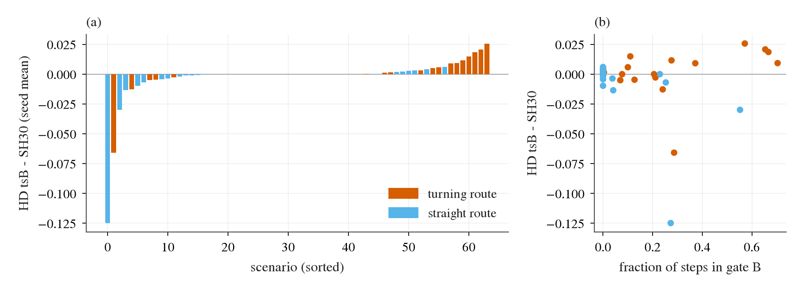

# op_parity turn selector in HUGSIM closed loop: SH30 + selector (gate B) vs SH30

Written 2026-10-08. Pre-registration: [plans/2026-10-08-turn-selector-hugsim-prereg.md](../plans/2026-10-08-turn-selector-hugsim-prereg.md) (committed before any closed-loop score; two criterion amendments are recorded in its addendum).
Code: `scripts/turn_selhug.py` (per-step `Selector`, gates, `check` / `trt` / `idcheck` / `pilot`), `scripts/turn_selhug_report.py`, `scripts/turn_selhug_chain.sh`; plumbing in `lib/parity_hugsim.py`, `experiments/hugsim/lib/zs_agent.py`,
`experiments/hugsim/archive/hugsim_zs_server.py` (`--taps`), `pp_hugsim.py serve --select`, bench models `SH30-F-s{0,1}:tsB | :ts0` on `--bench hugsim` (run dir `SH30-F-s0-tsB_spec_plan_smooth`).
Tables: [turn_selector_hugsim/](turn_selector_hugsim/) (`hd_paired`, `failure_counts`, `gate_pick`, `control_stats`, `gate_*.json`). Figure: [figs/turn_selector_hugsim/turn_selector_hugsim.png](../figs/turn_selector_hugsim/turn_selector_hugsim.png).

## Answer

**Harmless, by the registered lines: the selector does not change HUGSIM closed-loop performance; it does make the steering rougher.**
HD (preset `spec_plan_smooth`, per-scenario mean of the two SH30 seeds, paired bootstrap over scenarios), tsB - SH30:

| set | n | SH30 | tsB | diff [95% CI] | per seed |
|:--|--:|--:|--:|:--|:--|
| turn23 (primary) | 23 | 0.329 | 0.331 | **+0.002 [-0.006, +0.007]** | +0.012 / -0.009 |
| all64 | 64 | 0.439 | 0.436 | -0.002 [-0.007, +0.002] | +0.001 / -0.005 |
| straight41 | 41 | 0.500 | 0.496 | -0.004 [-0.012, -0.000] | -0.005 / -0.003 |

Registered lines: helps = turn23 CI lower bound > 0 (no: -0.006); harms = upper bound < 0, or instability counts up >= 2, or straight point estimate < -0.03 with upper bound < 0 (none holds: +0.007; stuck + spin + launch stall + off-route 2.0 -> 2.5, seed means; straight -0.004);
harmless = CI contains 0 and no instability rise (holds). The straight-route CI touches zero from below (upper bound -0.000), driven by one extra bg collision per seed on straight routes (1.5 -> 2.5); the registered harms line needs a point estimate below -0.03, so it does not fire, but it is not a clean zero.
The expected gain (0 to +0.03 on turn23, prereg, from decisions 153 / 159 and the 0.5-1.5 s curvature the controller reads) did not appear: the CI excludes +0.007.

| seed-mean counts | set | fg | bg | off-route | stuck | spin | launch stall | complete |
|:--|:--|--:|--:|--:|--:|--:|--:|--:|
| SH30 | all64 | 28.5 | 8.5 | 1.0 | 0 | 0 | 1.0 | 26.0 |
| tsB | all64 | 27.5 | 10.0 | 1.5 | 0 | 0 | 1.0 | 25.0 |
| SH30 / tsB | turn23 | 9.5 / 8.5 | 7.0 / 7.5 | 1.0 / 1.5 | 0 / 0 | 0 / 0 | 0 / 0 | 5.5 / 5.5 |

54 of 64 scenarios move by < 0.01 HD. The largest moves are one straight scenario (2800_3000-easy-00, -0.125) and one turning scenario (164701907483-easy-00, -0.066); positive moves are at most +0.026. Two seeds are two models, each scenario is run once per seed (HUGSIM reruns of the same model are identical in 92-97% of scenarios, see prereg), so single-scenario moves are not evidence of mechanism.

## Gate and switching (closed loop, both seeds, per 0.25 s step)

| set | steps | gate B fires | plan changed (applied) | selector would move (ungated pick != identity) | moved given gate | pick switches, both steps in gate | pick switches, all consecutive pairs |
|:--|--:|--:|--:|--:|--:|--:|--:|
| turn23 | 3 176 | 14.9% | 11.2% | 67.3% | 75.2% | 47.5% (417 pairs) | 8.8% |
| straight41 | 4 339 | 2.7% | 1.3% | 59.8% | 46.2% | 33.0% (103 pairs) | 0.9% |
| all64 | 7 515 | 7.9% | 5.5% | 63.0% | 69.4% | 44.6% (520 pairs) | 4.3% |

Inside the gate the pick changes between consecutive steps in 45% of the pairs, the closed-loop face of the EC loss of decision 193. Without the gate the selector would move 63% of all steps (the gate A regime, not deployable in navtest either). `ts0` (forced identity, same servers) gives the same logging on SH30's own drive; its HD on 11 scenarios is in `gate_id_s0.json`.

## Steering and lateral jerk (v > 1 m/s steps; tsB - SH30, paired over scenarios, seeds averaged)

| set | lateral jerk rms (m/s^3) | mean abs step change of steer | p95 abs step change of steer |
|:--|:--|:--|:--|
| turn23 | 0.352 -> 0.420, +0.068 [+0.024, +0.117] | 0.0084 -> 0.0107, +0.0024 [+0.0007, +0.0045] | 0.0253 -> 0.0330, +0.0077 [+0.0016, +0.0142] |
| straight41 | 0.186 -> 0.191, +0.006 [-0.007, +0.022] | 0.0030 -> 0.0032, +0.0002 [-0.0000, +0.0006] | 0.0074 -> 0.0085, +0.0012 [-0.0000, +0.0030] |
| all64 | 0.245 -> 0.273, +0.028 [+0.009, +0.051] | 0.0049 -> 0.0059, +0.0010 [+0.0004, +0.0019] | 0.0138 -> 0.0173, +0.0035 [+0.0011, +0.0062] |

On turning routes the lateral jerk is about 19% higher and the steering step changes about 27% (mean) / 30% (p95) higher, CIs excluding 0. That did not turn into failures or an HD loss here, but it is the closed-loop cost of per-step independent picks, in the same direction as the navtest EC loss. Descriptive only (no registered line).

*What to look at:* (a) per-scenario HD difference tsB - SH30 (seed mean), sorted; the bulk is at zero, turning routes (orange) lean positive on the right and the two largest losses are on the left. (b) The same difference against the fraction of steps in gate B: no dose-response; the large losses sit at 0.27-0.55 gate share, so does the best gain.

## What differs from the navtest setting

Same weights (N7 bundle of decision 193), same gate (heading at 4 s >= 20 deg of the model's own plan, threshold not tuned), same per-seed edge calibration. Differences, none fixed:
- Visual tokens, hidden states, road edges and plan come from the HUGSIM-rendered openpilot frames through the served TensorRT ONNX (three extra graph outputs `view_39`, `select_4`, `mean`; `--taps`); the selector was trained on warp-frame caches. Not tested separately.
- Ego features are the model-clock ones the bias server already receives; camera offset = HUGSIM `rear_offset`; margins use the NAVSIM ego footprint, not the dataset's car.
- Decision every 0.25 s simulator step, no temporal consistency; picked candidate enters as the (candidate - identity) difference on the 8 rear-axle poses, interpolated to the 33-point plan (held beyond 4 s); the controller then reads the 0.5-1.5 s mean curvature recomputed from it and the 3 s plan waypoints.
  Offset candidates (+-0.5 m, blended in over 6 m) have little authority over a 0.5-1.5 s curvature, curvature-gain and speed candidates do. Round trip plan -> 8 poses -> plan: median 2.4 cm, max 13 cm (G-eqv).

## Gates (all before any full-run score)

- G-eqv (navtest, seed 0, 320 rows): per-step `Selector` vs the batch `select` stage, gate agreement 1.000, pick agreement 1.000.
- G-id (`ts0` vs archived SH30 on 11 fixed scenarios, seed 0): same end 11 / 11, |dHD| < 0.05 in 11 / 11, mean |dHD| 0.004 (max 0.027). Criterion (iv), plan points: first evaluation 0.187 m failed the registered 0.05 m because it included far plan points (5.6 s and beyond, 0.03-0.125 m fp16 resolution); restricted to points <= 3.9 s: 0.047 m, pass. Amendment made after seeing the identity data, before any tsB score.
- G-pilot (`tsB`, same 11): everything passed except per-step round trip < 100 ms (p95 264 ms, queueing of 6 slots on one bias server); replaced by wall ratio tsB / ts0 <= 1.3 (measured 1.006). Amended after the pilot, whose HD numbers were in the same json and were seen; thresholds of the full-run lines were not touched.
- TensorRT engines of the tapped ONNX built once beforehand (about 100 s per seed).

## Cost

Wall 20:45 to 21:23 on 2026-10-08 including gates (40 min); the full 2 x all64 `tsB` run took about 15 minutes; roughly 2 card-hours booked by the pool (computing + held-idle, a loose upper bound), against a 5 h / 8 card-hour budget. No stall, no failed scenario, no retries needed.

## Not checked

`ts0` all64 (not needed: G-id passed on all registered criteria as amended), gate A, other presets (`spec`, `exam`), a different selector threshold, a second run of `tsB` (reruns of the same model are near identical, so run-to-run noise is small, but each seed is one model), domain-matched HUGSIM tokens, ablating the three candidate axes, clips (the outcome differences are small and not mechanism-bearing, so the optional GIFs were skipped).
Would need: a time-consistent selector (previous pick as input or hysteresis, trained on navtrain sequences), a HUGSIM-domain selector (labels from closed-loop frames), CARLA wiring on the B2D policy server; WOD and retraining stay out of scope.
