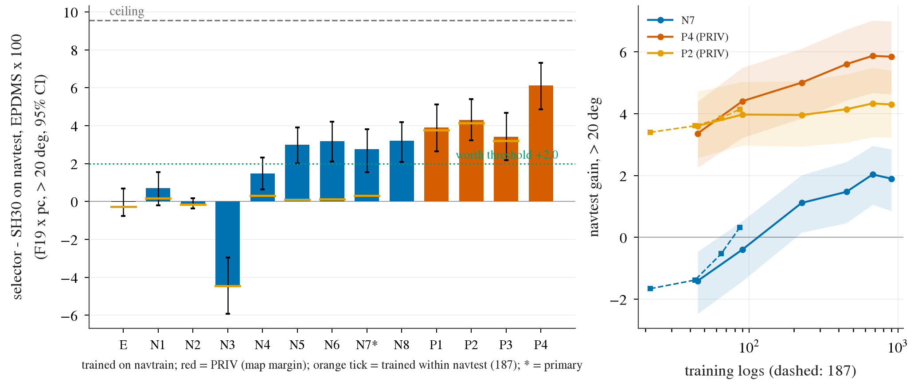

# op_parity turn selector navtrain: selectors trained on the navtrain held-out labels, read out on navtest turns

Written 2026-10-08. Pre-registration: [plans/2026-10-08-turn-selector-navtrain-prereg.md](../plans/2026-10-08-turn-selector-navtrain-prereg.md) (committed before any selector reading; the 300-token smoke printed navtest numbers of heads trained on 300 tokens before the full run, after the primary arm was fixed).
Code: `scripts/tsn_extract.py`, `scripts/turn_selnt.py`, `scripts/turn_selnt_chain.sh`. Tables: [turn_selector_navtrain/](turn_selector_navtrain/); figure: [figs/turn_selector_navtrain/selector_navtrain.png](../figs/turn_selector_navtrain/selector_navtrain.png).

## Answer

**Yes.** The primary arm N7 (E + unpooled frozen vision tokens + SH30 hidden state + own-edge margin of every candidate; all non-privileged), trained on 28 323 navtrain turn tokens (features from the fold model that held the log out) and read out on navtest > 20 deg (3 154 tokens x SH30 s0 / s1, no navtest label used for fitting or selection), gains **+2.75 [+1.55, +3.82] EPDMS x 100 on F19 x pc** (97.5% CI [+1.36, +3.95]; recovery 28.8% [17.4, 38.5] of +9.55). L9 x epcap +2.80 [+1.58, +3.91] (consistent). By the registered rule: lower bound > 0, point >= +2.0, so **the line does not end and the gain counts as worth a full-scale method**. Decision 187's within-navtest N7 was +0.32 [-0.65, +1.26]; the navtrain labels made the difference (learning curve below).

## Arms (F19 x pc, navtest > 20 deg, gain over SH30, EPDMS x 100, 95% CI unless noted)

| arm | input | navtrain OOF | navtest > 20 | 20-45 | > 45 | adjusted CI | recovery | DAC fail % after (identity 7.31) | within navtest (187) |
|:--|:--|--:|:--|:--|:--|:--|:--|--:|:--|
| E | ego + plan | +0.32 | -0.02 [-0.77, +0.69] | +0.63 | -0.73 | | -0.2% | 6.80 | -0.27 |
| N1 | E + own-edge margins (ridge) | +0.63 | +0.70 [-0.21, +1.54] | +1.08 | +0.29 | [-0.61, +1.87] | 7.3% | 6.18 | +0.16 |
| N2 | E + own-edge margins (trees) | +0.29 | -0.10 [-0.37, +0.17] | -0.03 | -0.17 | [-0.48, +0.28] | -1.0% | 7.26 | -0.16 |
| N3 | own-edge rule | -3.09 | -4.45 [-5.92, -2.96] | -1.67 | -7.45 | | -46.6% | 11.51 | -4.45 |
| N4 | E + hidden (PCA, ridge) | +1.02 | +1.49 [+0.65, +2.33] | +1.87 | +1.08 | [+0.32, +2.68] | 15.6% | 5.47 | +0.30 |
| N5 | E + vision tokens (attention) | +1.53 | +2.99 [+2.02, +3.90] | +2.69 | +3.31 | [+1.64, +4.27] | 31.3% | 4.07 | +0.11 |
| N6 | E + hidden (MLP) | +1.48 | +3.18 [+2.11, +4.22] | +2.91 | +3.47 | [+1.65, +4.58] | 33.3% | 3.69 | +0.13 |
| **N7 (primary)** | tokens + hidden + own-edge + E | +1.43 | **+2.75 [+1.55, +3.82]** | +2.84 | +2.66 | [+1.36, +3.95] (97.5%) | 28.8% [17.4, 38.5] | 4.30 | +0.32 |
| N8 | tokens + own-edge + E | +1.62 | +3.20 [+2.09, +4.19] | +2.64 | +3.79 | [+1.66, +4.56] | 33.5% | 3.63 | n/a |
| P1 PRIV | E + map margins (ridge) | +2.74 | +3.90 [+2.65, +5.12] | +2.81 | +5.07 | [+2.30, +5.42] | 40.8% | 2.16 | +3.77 |
| P2 PRIV | trees | +2.85 | +4.30 [+3.23, +5.40] | +3.07 | +5.63 | [+2.95, +5.74] | 45.0% | 1.51 | +4.15 |
| P3 PRIV | rule | +2.37 | +3.41 [+2.19, +4.67] | +2.71 | +4.17 | [+1.88, +5.00] | 35.7% | 1.60 | +3.21 |
| P4 PRIV | E + map margins (NN) | +4.11 | +6.12 [+4.87, +7.31] | +4.27 | +8.11 | [+4.53, +7.59] | 64.0% [56.4, 71.0] | 0.71 | n/a |

Adjusted CI: primary at 97.5%, other model-side arms Bonferroni m = 8 (the prereg text said 7, a miscount of E, N1-N6, N8; 8 is stricter), privileged m = 4. L9 x epcap for every arm and the 20-45 / > 45 splits are in [turn_selector_navtrain/arms.md](turn_selector_navtrain/arms.md); N7 L9 x epcap +2.80, P4 +6.10. Single-init gains of N7 are +2.07 / +1.63 / +2.00 / +1.88 / +2.10; the 5-init ensemble (the registered primary reading) is +2.75, so ensembling is worth about 0.7. Token-permutation null (each pick applied to a random other token): every arm's null mean is negative (N7 -8.9, range -10.5 to -7.7), permutation p = 0.005 for all positive arms ([spread_null_axes.md](turn_selector_navtrain/spread_null_axes.md)). The selector is not slowing down: N7 picks speed < 1 on 4.2% of token-seeds (offsets moved 58%, curvature 54%); it moves on 76.5% of token-seeds though only about 15% have a repair.

Other non-privileged arms with Bonferroni lower bound > 0 (leads, cannot rescue or change the verdict): N8, N6, N5, N4. The E arm trained on navtrain is flat (-0.02), as in 186.

## Learning curve (> 20 deg, F19 x pc, number of navtrain turn logs; mean over repeats of per-repeat picks, no ensembling)

| arm | 5% (45 logs) | 10% (90) | 25% (225) | 50% (450) | 75% (675) | 100% (900) |
|:--|:--|:--|:--|:--|:--|:--|
| N7 | -1.41 | -0.39 | +1.12 | +1.47 | +2.04 | +1.90 |
| P4 PRIV | +3.36 | +4.41 | +5.01 | +5.61 | +5.88 | +5.85 |
| P2 PRIV | +3.61 | +3.97 | +3.96 | +4.15 | +4.34 | +4.30 |

N7 at 10% (about the 3 k tokens of decision 187) is -0.39, close to 187's +0.32; it then rises to +2.0 at 75% and is flat from 75 to 100% (rising rule 75 -> 100 >= +0.3: no for all three). Tokens beyond about 600 logs from this source add little; a better head or more varied labels would be needed to climb further. (A 75% point was added to the registered 5 / 10 / 25 / 50 / 100% so that 187's rising rule applies.)

## Gates (all passed, before any fit)

- G-leak, all 28 323 tokens: (a) fold of every token = sha256 fold = fold of the model run, the log is outside that fold's training split; (b) extracted plan equals the stored fold-model plan, max |d| 0.023 m over the first 15 plan points (fp16 rounding; tolerance 0.03 m); (c) the wrong fold's model fails the same tolerance on 91% of rows (the fold models share init and recipe, so their plans are close: median 0.07 m; a mis-assignment of tokens would be caught row by row, not by a margin); (d) navtest and navtrain tokens disjoint, and no log is shared (108 navtest logs, 900 navtrain turn logs); (e) c00 equals the held-out score on all tokens (max abs 0).
- G-E: navtest-internal E arm, 10 repeats, -0.268 [-0.522, -0.064] (decision 186: -0.27).
- G-margin: identity map-margin AUC for DAC failure 0.928 (>= 0.85), own-edge 0.629 (in 0.58-0.72).
- G-hidden: per-coordinate correlation of fold-model and SH30-F-s0 hidden state on navtest turns, median 0.9965 (>= 0.8); hidden-space alignment is not an issue, N7 stays primary.
- Deviations from the plan text: the plan-equality tolerance and the wrong-fold criterion were set after the smoke showed fp16 noise at the far plan points (the first criterion, max |d| < 0.05 m over all 33 points, failed on rounding); the learning curve got a 75% point; Bonferroni m = 8 instead of 7.

## Cost (measured, pool job wall x declared cores)

41 pool jobs for the whole chain including smoke: about 2.0 core-h, 0.3 card-h (upper bound), chain wall about 8 min after the smoke; the budget was 4 h, 3 card-h, 60 core-h. No simulator scoring.

## Not checked

One seed per fold model and one seed of SH30 labels; train features from fold models, test features from SH30 (hidden correlation 0.997, but not a test with fold-model features on navtest plans). Hyperparameters: 4 head configs, selected by navtrain OOF gain (the selected config differs by arm; N7 L9 reuses the F19 choice). Gains are seed means over the two SH30 seeds, which share tokens (CIs cluster by log). No closed loop, no reactive traffic, no straight-driving control, no per-city / speed stratification, no longer horizon than 4 s; the pc convention caps EP and slow-down repairs but candidates that fail after 4 s are still credited. The ensemble reading is the registered one, single inits are +1.6 to +2.1. F27 / F33 candidates were not scored. Navtest has now been read by 13 arms; only N7 was a registered test.
