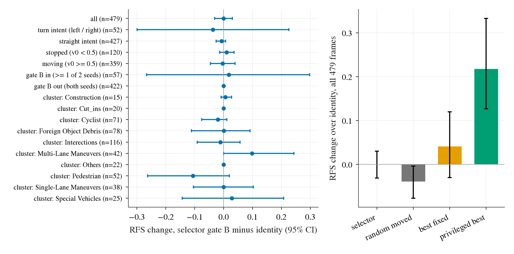

# op_parity turn selector on WOD-E2E val: the decision-193 selector (N7, gate B), applied unchanged, does not move RFS

Written 2026-10-08. Pre-registration: [plans/2026-10-08-turn-selwod-prereg.md](../plans/2026-10-08-turn-selwod-prereg.md) (committed before any RFS of a candidate, pick or `ts0` was read).
Code: `scripts/turn_selwod.py` (extract / select / spans), `scripts/turn_selwod_report.py`, `scripts/turn_selwod_chain.sh`. Tables: [turn_selector_wod/](turn_selector_wod/) (`SH30_strata.csv`, `SH30.json`, `SH30_gates.json`, same for `WLG`).
Figures: [effect_and_ceiling.png](../figs/turn_selector_wod/effect_and_ceiling.png), [pick_marginals.png](../figs/turn_selector_wod/pick_marginals.png).

## Answer

**Verdict by the registered lines: does not transfer.** SH30 + selector (gate B, 0.5-5 s candidates, two seeds, seed-mean per-frame RFS) vs the same run's identity plan, 479 rater frames, cluster-mean RFS:
**-0.0004 [-0.031, +0.030]** (7.7344 -> 7.7340). Per seed -0.005 [-0.043, +0.029] / +0.004 [-0.029, +0.041]. Frame-mean cross-check (`jevdrive.stats.paired`, by sequence) -0.007 [-0.042, +0.026].
The CI excludes any gain above +0.030 and any harm above 0.031; it does **not** exclude the navtest-scaled gain (+0.02). Gate A (selector on every frame): -0.332 [-0.457, -0.220] (harms, as on navtest). WLG (mismatch case): -0.009 [-0.038, +0.020].

*What to look at:* left, every stratum CI straddles 0 (gated-out frames are exactly 0 by construction; the only visible movement is Pedestrian -0.11 and Multi-Lane +0.10, both CIs touch 0). Right, the same 479 frames: the selector sits at the identity, a random moved candidate is below it, the family's privileged ceiling is +0.22.

## Gates (all before the selector's RFS was read)

G-gen (candidate code on 8 poses equals `turn_ceiling.transform`): max diff 0. G-map (dense plan to WOD waypoints): < 1e-5 m. G-eqv (batch pick = closed-loop per-step `Selector.run`): 1.000 on 479 frames, all four arms.
G-feat (tapped TensorRT run vs archived run, same weights): waypoint diff median 0.03 m, max 0.18 m, 0% of rows over 0.25 m; wrong-seed control 71-72% over (SH30). G-id: `ts0` 7.7344 vs archived 7.7337 (diff +0.0007; line 0.01), 95.8% of frames within 0.05 (line 95%; the wrong-seed control is 64%).
The plan-gate tolerance was changed from the first draft (2 fp16 ulps per coordinate) to a waypoint-level 0.25 m after seeing plan-level noise (not RFS); the prereg records this. WLG: own rows 0% over, but the control (the other WLG seed) is only 42% over 0.25 m (the seeds are close), so its G-feat teeth criterion is not met; its G-id passes (8.1866 vs 8.1869). WLG is exploratory.

## Power, as it turned out

Gate B fires on 55 / 56 frames (11.5% / 11.7%; 57 in the union) of 479, so only those frames can change. Realised SE of the primary 0.0157, MDE (80%, 2.8 SE) **0.044**; the registered guess for per-frame diff SD 1.0 gave 0.045, the realised SD on gated rows is 1.10. The navtest-relative gain (+2.6% on gated frames) scaled to WOD is +0.020, below the MDE.
So the test could have detected a transfer of about twice the navtest-scaled size; it cannot see navtest-sized transfer. "Does not transfer" here means CI [-0.031, +0.030]. Gated rows (57): +0.018 [-0.267, +0.298]; turn-intent frames (52): -0.037 [-0.300, +0.226]. H4 (0.5-4 s candidates, change held): +0.009 [-0.019, +0.040]; same conclusion.

## Context readings

**1. Family ceiling on WOD (privileged best of F19 around SH30's plan, per frame).** Overall +1.10 [+0.94, +1.26] (seed-wise +1.11); on gated frames only (others identity) +0.218 [+0.127, +0.333], i.e. +2.09 per gated frame; turn-intent frames +1.65. By axis (overall): offset O3 +0.17, curvature K3 +0.10, speed V3 +0.85, F7 +0.92. On the gated frames alone: O3 +0.056, K3 +0.053, V3 +0.124, F7 +0.157. The family has plenty to give on WOD (it equals the F20 +1.07 of decision 168), mostly speed; inside the gate it is +0.22, five times the MDE.

**2. Gate and picks.** WOD gate B 11.5% vs navtest 26.1%; 65-67% of turn-intent frames pass, 4.9% of straight-intent frames (21 frames). The selector moves 84-86% of gated frames (navtest 76-77%). Axis marginals among moved plans (WOD s0/s1 vs navtest): offset moved 67/71% vs 77/78%, curvature 70/71% vs 71/72%, speed 13/12.5% vs 9.8/9.0%, speed < 1 about 5% of moved (navtest 5.8%). Offset direction differs: left 24-25% / right 44-46% on WOD against left 43-46% / right 32-34% on navtest ([pick_marginals.png](../figs/turn_selector_wod/pick_marginals.png)). Picks look like navtest's in axis mix; the offset direction does not.

**3. Does the pick track the RFS-best candidate?** No. On gated frames Spearman between predicted gain and realised RFS change of the 18 moved candidates is 0.11 / 0.12 (mean), top-1 agreement 1.9% (18 candidates: chance ~5.6%), the pick beats 43 / 42% of the moved candidates (ties count as not beaten). Mean realised gain of the pick per gated frame -0.02 / -0.10; 29% of picks gain, 27% / 20% lose. A perfect gate on the selector's own picks (apply only where the pick helps) would give +0.037 [+0.017, +0.060] overall (WLG +0.02 to +0.03), still small: what is wrong is the pick, not the gate.

**4. Candidate by candidate (gated frames, applied everywhere, mean RFS change).** Only slowing down helps: c01 (speed x0.8) +0.28, c07 (curvature 0.85, speed 0.8) +0.03; every other candidate is negative (-0.11 to -1.07; speed x1.2 -0.54 to -1.07; curvature x1.15 -0.68, offset +0.5 -0.40, offset -0.5 -0.15). Pick histogram: the selector picks speed < 1 on about 5% of moved plans and spends most picks on curvature 0.85 / 1.15 and offsets, which are negative on average here.
Decomposition over all 479 frames (gate B): identity 0; selector -0.000 [-0.031, +0.030]; random moved candidate -0.039 [-0.077, -0.004]; best single constant candidate (c01, chosen with privileged knowledge) +0.041 [-0.030, +0.120]; privileged per-frame best +0.218 [+0.127, +0.333]. So the zero is "picks the wrong one": the family has +0.22 inside the gate, mostly slowing, and a constant slow-down with the best constant would itself not be separable from 0, while the selector's picks are only slightly better than random moved ones (it avoids the worst, +0.04).

**WLG (exploratory mismatch).** Same selector on WLG-full plans and hidden states: gate fires on 8.1-8.4%, selector -0.009 [-0.038, +0.020] (gated rows -0.175 [-0.57, +0.33]), privileged best +0.19 in the gate (+0.66 overall), Spearman 0.11, top-1 2.7%, random moved -0.033. Same picture; no sign that the base model matters at this resolution.

## What differs from the navtest setting

Camera mapping (cached warp frames vs front3 reprojection), frame rate and policy slots (8 + zero 2 Hz warp in training vs 20 Hz real frames with 9 real slots in the WOD harness, decision 176, kept at 9), edge calibration (navsim-fitted per seed, not refit; camera offset from the WOD FRONT extrinsic; same Pacifica footprint, rear-axle origin), horizon (selector and gate on 4 s, RFS reads 3 s and 5 s; candidates applied to 0.5-5 s in the primary, 4 s held in H4), scoring (simulator sub-scores with `pc` vs a rater trust-region score with no map), one frame per sequence (no EC pairing), gate coverage (11.5% vs 26.1%). Details and the rationale are in the prereg.

## Cost

Measured from the logs, not metered per job: extraction 0.83 s per frame (479 frames about 7 min per arm, four arms in parallel on 14 cores each, plus a few minutes of first-time TensorRT builds), select < 1 min per arm, report about 1 min. About 8 core-h and well under 1 card-h in total; wall about 1.3 h including three restarts for harness problems. Budget 3 h / 2 card-h / 40 core-h.

## Not checked, and what the out-of-scope items would need

- `processed/wod_zeroshot/sets.json` (the harness's span table) is missing on the box; this lane rebuilt the spans of the rater sequences into `runs/op_parity/turn_selwod/spans_rater.json` and touched no shared file. Other lanes that call `Z.load_spans()` will fail.
- Not checked: other seeds of the selector's fold labels; the gate threshold (20 deg, fixed); a selector with the speed axis trained on a score that rewards slowing; the 8 + zero slot configuration on WOD for the selector's hidden-state input; test split (not used).
- Out of scope and not started: a selector trained on WOD rater labels (decision 173's head is the closest thing: +0.148, speed only; the family has +0.22 inside this gate, so a WOD-trained selector would be a different method, not a transfer), mixing the two boards' labels (needs WOD rater labels at candidate level, only 479 frames exist), a frame-consistent selector (WOD has one rater frame per sequence, so it cannot be evaluated here).
