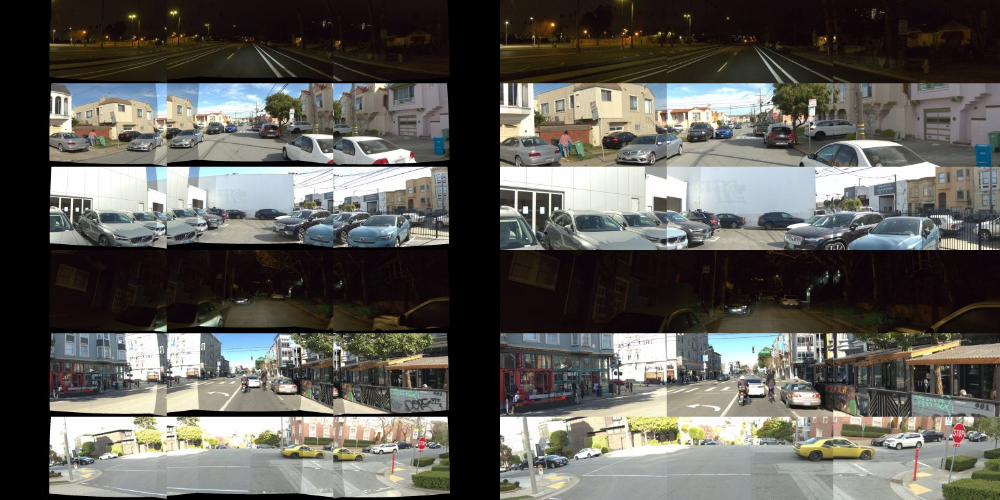

# WA-JEPA (NAVSIM specialist) zero-shot on WOD-E2E val: RFS 7.59 (V1, NAVSIM-geometry reprojection) vs shipped openpilot 8.005, -0.42 [-0.68, -0.17]; loses to shipped, WP2, WLG and the log under all three image mappings

Written 2026-10-08. Pre-registration: [plans/2026-10-08-wa-xboard-prereg.md](../plans/2026-10-08-wa-xboard-prereg.md) (committed before any prediction was scored; addendum for one
history-less target and the `xca` operator also before). Code: `scripts/wa_xboard.py` (render / req / convert / g0 / montage), `scripts/wa_xboard_run.py` (WA-JEPA in its env),
`scripts/wa_xboard_chain.sh`, `scripts/wa_xboard_report.py`. Tables: [wa_xboard/](wa_xboard/) (`arms`, `paired`, `strata`, `clusters`, `g0.json`, `tables.md`).

## Answer

WA-JEPA, released weights run as shipped (repo feature builder, fp32, 4-step flow, flow seed 1), never trained on WOD, on the 479 rater frames (478 sequences); cluster-mean RFS,
paired bootstrap over sequences (B 4 000), ADE on 1 437 frames against the log. Three image mappings, all reported; V1 was the a-priori primary (closest to NAVSIM geometry).

| arm | RFS | ADE@3s | ADE@5s* | dRFS vs shipped [95% CI] | vs WP2 | vs WLG | vs P2H10 |
|:--|--:|--:|--:|:--|:--|:--|:--|
| shipped openpilot | 8.005 | 1.041 | 2.117 | ref | | | |
| WP2 / WLG (WOD-trained) | 8.111 / 8.187 | 0.574 / 0.580 | 1.457 / 1.483 | +0.106 / +0.182 | | | |
| P2H10 (navtrain adapter) | 7.708 | 1.324 | 2.668 | -0.297 | | | |
| log (logged future) | 8.131 | 0 | 0 | +0.126 | | | |
| **WA-JEPA V1 reproject** | **7.587** | 1.193 | 2.864 | **-0.418 [-0.679, -0.170]** | -0.524 [-0.767, -0.285] | -0.600 [-0.856, -0.357] | -0.121 [-0.322, +0.067] n.s. |
| WA-JEPA V2 crop | 7.478 | 1.253 | 2.929 | -0.527 [-0.777, -0.288] | -0.633 [-0.873, -0.386] | -0.709 [-0.953, -0.470] | -0.230 [-0.437, -0.025] |
| WA-JEPA V3 front only | 7.332 | 1.262 | 2.998 | -0.673 [-0.942, -0.408] | -0.780 [-1.038, -0.521] | -0.855 [-1.125, -0.588] | -0.377 [-0.594, -0.167] |
| IMG0 (images black, state real) | 4.805 | 2.154 | 4.608 | -3.200 [-3.440, -2.963] | | | |
| STATE0 (V1 images, ego + command + history zeroed) | 6.033 | 5.372 | 7.736 | -1.971 [-2.284, -1.655] | | | |
| V1, flow seed 2 (sensitivity) | 7.684 | 1.164 | 2.779 | -0.321 [-0.559, -0.093] | | | |

\*WA-JEPA outputs 4.0 s; 4.25-5.0 s is the constant-velocity continuation of its 3.5-4.0 s motion (primary). The same operator applied to shipped / WP2 / WLG / log (`-x4` rows) moves
them by < +0.02 RFS (shipped 8.023, WP2 8.129, WLG 8.193, log 8.235), so the operator is not a confound for the comparison; the ADE@5s column of WA-JEPA is nevertheless
inflated by it, ADE@3s is not. Constant-acceleration continuation (`xca`) lowers WA-JEPA by 0.06-0.10 (V1 7.530), same conclusions. Full per-reference rows: `wa_xboard/paired.csv`.

Verdicts by the pre-registered rule: V1, V2, V3 each **lose** to shipped, WP2, WLG and log (CI upper bound < 0). Against P2H10 (the other NAVSIM-trained policy on this board) V1 is not separable
(-0.12 [-0.32, +0.07]), V2 / V3 lose. The three mappings do not change the sign or significance of any comparison to the WOD-side models; they change the size (-0.42 to -0.67 vs shipped).
V1 - V2 +0.109 [-0.081, +0.299] n.s.; V1 - V3 +0.256 [+0.136, +0.382] (the side views carry points). The flow-noise seed alone moves V1 by 0.096 [0.039, 0.162], so the V1 / V2 gap is inside it.

**Controls.** Images matter a lot: V1 - IMG0 +2.78 [+2.56, +3.01] (ADE@3s -0.96 m). State and command matter too: V1 - STATE0 +1.55 [+1.30, +1.82], ADE@3s -4.18 m (without ego motion the plan stops
short, 5 s displacement 0.75 of the log). Ego-only (IMG0) is 4.8, far below the ego-only baselines of docs/waymo-e2e.md (cv 7.1): WA-JEPA's black-image plan is not a competent ego-only extrapolator, so
the image contribution is "everything", not a delta over a good prior.

## Strata (RFS, 479 rater frames; V1 - shipped with CI)

| stratum | n | V1 | shipped | WLG | V1 - shipped | V1 - WLG |
|:--|--:|--:|--:|--:|:--|:--|
| all | 479 | 7.587 | 8.005 | 8.187 | -0.418 [-0.679, -0.170] | -0.600 [-0.856, -0.357] |
| stopped (v0 < 0.5) | 120 | 6.926 | 7.954 | 7.991 | -1.027 [-1.561, -0.499] | -1.064 [-1.594, -0.551] |
| stopped, log stays | 25 | 6.745 | 8.380 | 8.369 | -1.635 [-2.977, -0.407] | -1.624 [-2.969, -0.391] |
| stopped, log moves | 95 | 6.979 | 7.705 | 7.759 | -0.726 [-1.313, -0.165] | -0.780 [-1.360, -0.228] |
| launch (v < 2, log > 5 m) | 111 | 7.320 | 7.317 | 7.225 | +0.002 [-0.474, +0.499] | +0.094 [-0.402, +0.588] |
| moving (v >= 0.5) | 359 | 7.795 | 7.981 | 8.239 | -0.186 [-0.448, +0.080] | -0.443 [-0.733, -0.165] |
| 0.5-5 m/s | 179 | 7.376 | 7.508 | 7.629 | -0.131 [-0.572, +0.291] | -0.252 [-0.690, +0.172] |
| 5-12 m/s | 142 | 8.146 | 8.342 | 8.564 | -0.196 [-0.635, +0.182] | -0.419 [-0.853, -0.042] |
| >= 12 m/s | 38 | 7.211 | 8.283 | 8.848 | -1.072 [-1.648, -0.237] | -1.638 [-2.440, -0.724] |
| intent straight | 427 | 7.669 | 8.132 | 8.355 | -0.463 [-0.737, -0.207] | -0.686 [-0.955, -0.426] |
| intent turn | 52 | 6.720 | 6.756 | 6.685 | -0.036 [-0.788, +0.726] | +0.036 [-0.642, +0.793] |
| night | 133 | 7.551 | 7.610 | 7.976 | -0.060 [-0.562, +0.512] | -0.425 [-0.950, +0.147] |
| day | 325 | 7.533 | 8.100 | 8.201 | -0.566 [-0.862, -0.272] | -0.667 [-0.966, -0.372] |

The loss is concentrated at standstill (stops when the log stays are the worst, -1.64: WA-JEPA starts moving) and at >= 12 m/s (-1.07), and on day frames; on turns (intent), launches and night
V1 is level with shipped (CIs wide, n = 52 / 111 / 133). V2 and V3 lose on turns (-0.80 / -1.07 vs shipped): the side-camera mapping is what keeps V1's turns level, so turning is where the mapping
confound is largest. Per cluster (`clusters.csv`): no cluster has V1 above shipped with a CI above 0; the largest losses are Others -1.35 [-2.48, -0.22], Multi-Lane -0.79, Intersections -0.51
(n = 22 / 42 / 116); Cut-ins, Single-Lane and Special Vehicles are level (n 20-38, CIs +-0.7-1.0). Median 5 s displacement over the log (log > 2 m): V1 1.02, V2 0.92, shipped 0.96, WLG 1.00.

## Input mapping (as run)

Written before scoring in the prereg; summary. Frames: WOD f, f-5, f-10, f-15 (2 Hz of real 10 Hz frames, oldest first); cameras [L0, F0, R0, B0] per frame, B0 black (front-3 only is on disk);
history poses = `pp_wod.wod_ego` (past_states 9 / 11 / 13 / 15, chord yaw, already relative to the current pose); ego = vx from positions, vy 0, ax / ay as given; command intent ->
[left, straight, right, unknown]. One rater target has no f-5 / f-10 / f-15 (clip start): last-frame padding. Image variants: **V1** NAVSIM rig (K 1545, Brown-Conrady distortion, L0 / F0 / R0 sensor2ego rotations,
pure-rotation reprojection from WOD FRONT / FRONT_LEFT / FRONT_RIGHT, 2x supersample then INTER_AREA to 512 x 256); **V2** WOD cameras cropped 2:1 to 512 x 256 without geometry; **V3** V1 F0 only.
G0 passed: NAVSIM undistort / project round trip < 5e-5 px, WOD identity render 0.0 gray levels, coverage of the virtual cameras by front-3 L0 0.67, F0 0.93, R0 0.66, reproduction of the
`wajepa_run` path (the runner's own `--check` validated it against the repo agent earlier).

*What to look at:* each row is one target (newest frame); left three tiles V1 (L0, F0, R0), right three V2. V1 has black wedges at the outer edges of L0 / R0 (no WOD camera sees them) and F0 is a
slightly wider, barrel-distorted view like NAVSIM's; V2 fills the tiles but with the WOD field of view and no distortion. Differences in how the road and kerbs sit are the mapping confound.

## Bench2Drive closed loop for WA-JEPA: cost estimate (read-only, not run)

Basis: `docs/bench2drive-cost.md` full220 (3.11 h, 8 workers, 633 881 ticks, 3 033 ticks / route at 20 Hz sim); measured here 1.08 s / sample for fp32 batch-1 WA-JEPA on a card shared with other lanes (1 437 samples in ~22 min; a clean-card figure and bf16 latency were not measured). At the NAVSIM 2 Hz decision rate: 63 400 decisions over 220 routes = ~19 card-hours of inference
if serial (+303 s of policy time on a 300 s route, i.e. about 2x the sim wall), so ~6-8 h wall on the 3-card box with 8 workers if three cards serve eight concurrent fp32 callers at the measured latency,
~12-16 h at HUGSIM's 4 Hz. bf16 (the repo's HUGSIM adapter precision) would shorten it; not tested. Missing for a run: (1) no CARLA runner (bench.md: WA-JEPA NAVSIM / CARLA stages unwrapped); (2) the
camera rig L0 / F0 / R0 / B0 at the NAVSIM K (1920 x 1080 distorted) in CARLA, which costs ~33 ms / camera / tick (bench2drive-cost.md), 4 cameras; (3) a 2 Hz four-frame image and pose buffer;
(4) command from B2D's route (left / straight / right) and ego velocity / acceleration from the simulator; (5) a trajectory-to-control layer (the HUGSIM iLQR path of decision 138 or the
b2d-controller stack) for 0.5 s waypoints; (6) a decision on the closed-loop scope (the standing scope is a ghost test on leaderboard models only). Estimate, not measurement.

## Not verified

- The mapping confound is not removed: no rear camera, 0.66 / 0.67 coverage of L0 / R0, pure-rotation reprojection (no parallax; WOD camera height 1.81 m vs NAVSIM 1.53 m).
  V1 vs V3 shows the side views matter by +0.26, so a better mapping could close part of the gap; how much is untested. The ordering V1 > V2 > V3 is inside the flow-seed noise for V1 vs V2.
- One flow seed in the primary table (config seed 1); seed 2 gives +0.10 on V1. Open loop, one split, 479 rater frames (CI +-0.25).
- The 4 s -> 5 s continuation is a modelling choice (operators bracket it within 0.1 RFS; ADE@5s of WA-JEPA is not comparable at the metre level).
- WA-JEPA runs fp32 (its NAVSIM path), shipped ONNX / TRT paths for openpilot rows are the stored runs.
- WA-JEPA never saw WOD; shipped openpilot never saw NAVSIM or WOD: the comparison measures cross-board transfer of two different recipes, not model quality on their home boards.
