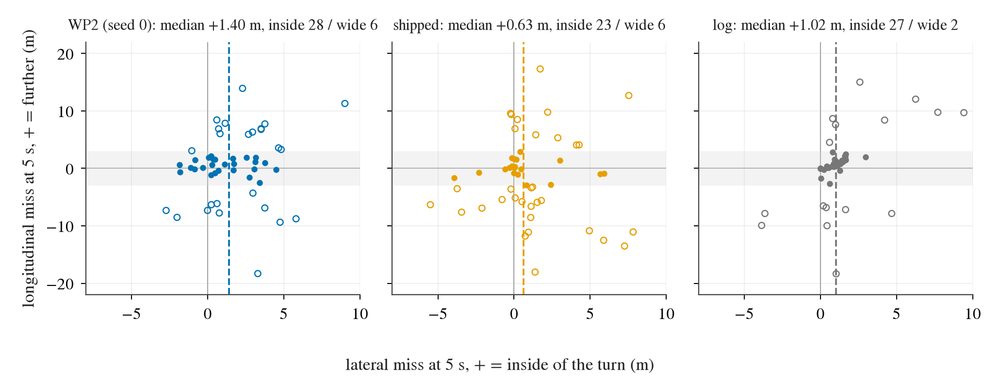

# Where WP2 loses RFS on WOD-E2E val: half of the 1.48 below the top-rated trajectory is speed profile, a quarter path; WP2 and the log lose it on different frames; nothing is recoverable offline

Written 2026-10-07. Offline on the stored val predictions (no training, no serving, nothing submitted). Pre-registration:
[plans/2026-10-07-wod-gap-prereg.md](../plans/2026-10-07-wod-gap-prereg.md) (committed before anything was scored; additions made after the first read are
marked *post hoc*). Code: `scripts/wod_gap.py` (one run, 12 s; reuses `pp_wod_diag.retime` and the RFS port). Tables: [wod_gap/](wod_gap/); figures:
[../figs/wod_gap/](../figs/wod_gap/). Conventions as in [wod_parity.md](wod_parity.md): 479 rater frames (478 sequences), cluster-mean RFS, paired
bootstrap over sequences, B 4 000. "Points" are RFS points of the cluster mean: each frame carries the weight 1 / (frames in its cluster x 10 clusters), so the
points of disjoint groups add up to the gap. WP2 = per-frame mean of the two seeds' scores; geometric quantities count each (frame, seed) as half a frame.

## Answer

| arm | RFS | gap to top-rated | frames with a gap | floored at 4.0 (frames / share of gap) | outside every rater's region (frames / points) | inside a lower-rated rater's region (frames / points) | loss at 3 s / 5 s / floor credit (points) |
|:--|--:|--:|--:|:--|:--|:--|:--|
| top-rated rater trajectory | 9.587 | 0 | | | | | |
| second-rated / worst-rated | 8.694 / 7.715 | 0.893 / 1.872 | | | | | |
| log | 8.131 | 1.456 | 231 | 9.4 % / 40 % | 22.8 % / 1.035 | 25.9 % / 0.421 | 0.763 / 0.926 / -0.233 |
| **WP2** | **8.111** | **1.476** | 267 (either seed) | 9.1 % / 34 % | 25.5 % / 1.006 | 29.1 % / 0.470 | 0.628 / 1.034 / -0.186 |
| shipped | 8.005 | 1.582 | 271 | 10.0 % / 34 % | 28.4 % / 1.118 | 28.2 % / 0.464 | 0.650 / 1.128 / -0.196 |
| WP1 | 8.012 | 1.575 | | 9.8 % / 34 % | 29.2 % / 1.124 | 27.5 % / 0.451 | 0.645 / 1.134 / -0.204 |

The script reproduces decision 163 exactly (shipped 8.005, WP2 8.111, WP1 8.012, log 8.131; WP2 - shipped +0.106 [-0.060, +0.279]).

1. **Where the 1.48 is.** WP2 is inside the top-rated trust region at both horizons on 45 % of frames (no loss). 29 % sit fully inside a lower-rated
   rater's region and take that label (0.47 points, 32 % of the gap): a valid but less preferred behaviour. 25.5 % are outside every region (1.01 points,
   68 %); 9.1 % hit the 4.0 floor and carry 34 % of the gap. The 5 s check costs 1.03, the 3 s check 0.63 (the floor gives 0.19 back); on 84 % of the frames
   with a gap the larger miss is at 5 s.
2. **Speed or path.** WP2's own path re-timed to the top-rated speed profile scores 8.833 (+0.722 [+0.523, +0.932], 49 % of the gap; seeds +0.730 /
   +0.713); the top-rated path at WP2's speed profile scores 8.407 (+0.296 [+0.173, +0.438], 20 %). By the pre-registered rule the speed profile is
   **"part"** (0.489, just under the 0.5 for "carries"), the path **"not"**; the rest (about 30 %) needs both. The same split holds for shipped (55 % / 16 %),
   WP1 (54 % / 17 %) and the log itself (47 % / 15 %): the longitudinal profile is where every arm, human log included, differs most from what the raters rank first.
3. **WP2 is not a copy of the log on RFS.** The totals agree (WP2 - log -0.020 [-0.246, +0.205]) but the frames do not: 267 WP2 frames and 231 log frames
   have a gap, 187 in common; per-frame gap correlation WP2 vs log 0.38 (WP2 vs shipped 0.68). WP2 is **worse than the log at standstill** (v0 < 0.5 m/s, 120 frames:
   -0.762 [-1.206, -0.337]; launch frames -0.852 [-1.411, -0.309]) and **better than the log at 5-12 m/s** (142 frames: +0.474 [+0.128, +0.815]), in
   Cyclist (+0.891 [+0.312, +1.478]) and Cut_ins (+2.376 [+1.110, +3.680], 20 frames). In points: WP2 loses 0.201 more than the log on stopped frames and
   0.089 more at 0.5-5 m/s, and 0.262 less at 5-12 m/s. So the log's 8.13 is not a per-frame ceiling for WP2: the equality is a cancellation (this
   qualifies decision 163's "bounded near the log" reading; see "Against decisions 162 / 163").
4. **Recoverable without training: no.** Trajectory ensembling, arc-length scaling (global and stratified) and per-stratum arm selection all have
   out-of-fold CIs containing 0 against WP2 (B and C below). The in-sample numbers look like gains (+0.11 to +0.20) and are optimism.

## Ranked failure types of WP2 (against the top-rated trajectory)

Type = the miss in the top-rated trajectory's own longitudinal / lateral frame at the horizon with the larger normalised miss: `behind` / `ahead`
(longitudinal only; WP2 shorter / further than top-rated), `lateral`, `both`. Context = stopped (v0 < 0.5 m/s) or moving. "speed / path label" = points of
frames (gap >= 0.5) where only the speed swap / only the path swap recovers at least half of the frame's gap. "log / shipped on the same frames" = what
those arms lose on exactly these frames; "log same type" = fraction where the log has a gap of the same type.

| # | type, context | frames | points lost | share | floored | median miss at 5 s (lon / abs lat, m) | speed / path label (points) | problem | shipped on the same frames | log on the same frames (same type) |
|--:|:--|--:|--:|--:|--:|:--|:--|:--|--:|:--|
| 1 | lateral, moving | 37.5 | 0.262 | 18 % | 24 % | +0.8 / 1.8 | 0.028 / 0.207 | path | 0.256 | 0.164 (44 %) |
| 2 | behind, stopped | 40 | 0.255 | 17 % | 18 % | -10.2 / 0.2 | 0.231 / 0.001 | speed (launches too little) | 0.215 | 0.120 (56 %) |
| 3 | behind, moving | 52.5 | 0.251 | 17 % | 4 % | -8.1 / 0.2 | 0.192 / 0.004 | speed (too short) | 0.251 | 0.332 (68 %) |
| 4 | ahead, moving | 50 | 0.217 | 15 % | 12 % | +9.2 / 0.3 | 0.206 / 0.001 | speed (too far); 0.087 of the 0.245 "ahead" points are truncated top-rated trajectories, see below | 0.202 | 0.114 (54 %) |
| 5 | both, moving | 36 | 0.209 | 14 % | 25 % | -6.9 / 2.5 | 0.095 / 0.006, joint 0.101 | speed and path together (a different manoeuvre) | 0.213 | 0.172 (47 %) |
| 6 | both, stopped | 25.5 | 0.162 | 11 % | 22 % | -7.8 / 3.4 | 0.049 / 0.005, joint 0.105 | speed and path together | 0.151 | 0.127 (61 %) |
| 7 | lateral, stopped | 13.5 | 0.092 | 6 % | 26 % | -0.1 / 1.7 | 0.034 / 0.031 | mixed; partly creep past a near-stationary top-rated trajectory (typing caveat) | 0.044 | 0.036 (44 %) |
| 8 | ahead, stopped | 6.5 | 0.028 | 2 % | 23 % | +7.9 / 0.1 | 0.028 / 0 | speed | 0.028 | 0.007 (23 %) |

By type: `behind` 0.506 (34 %), `both` 0.371 (25 %), `lateral` 0.354 (24 %), `ahead` 0.245 (17 %). Longitudinal-only types are 51 % of the gap, which
matches the swap (49 %). Shipped has the same list with more `behind, moving` (0.379) and `both, moving` (0.326) and less `lateral, moving` (0.208); the log's
list is dominated by `behind, moving` (0.611, 42 % of its gap). Tables: `wod_gap/ranked_{WP2,shipped,log}.md`, finer cells (type x speed bin x lead) in
`ranked_*_fine.md`.

- **Rows 2 and 3 (too short, 0.51 points)** are the largest block and the only one that is cleanly one-dimensional: the path is fine, the plan covers
  8-10 m less than the top-rated trajectory in 5 s. At standstill the log shares only half of it (0.120 of 0.255): the log launches where WP2 and shipped do
  not. Moving, the log is worse than WP2 on the same frames (0.332 vs 0.251): there WP2's shortfall is the imitated one.
- **Row 1 (lateral, moving)** is the only row where WP2 is worse than shipped by type total (lateral 0.354 vs 0.247 for shipped); it sits at 0.5-5 m/s without a
  lead (`ranked_WP2_fine`: 17.5 frames, 0.129) and in turns (turn intent: 0.193 of the 0.360 lost there is lateral; the top-rated path at WP2's speed recovers
  +1.52 on turn frames).
- **WP2 vs shipped by stratum** (seed-mean CIs; both seeds agree in sign, per-seed CIs in `strata.md`): stopped -0.356 [-0.696, -0.057], turn intent -0.650 [-1.286, -0.075] (52 frames),
  straight intent +0.223 [+0.063, +0.394], mid speed +0.228 [+0.009, +0.474], no lead +0.279 [+0.015, +0.574]. These are a few of about 50 stratum
  contrasts with lower bounds near 0: read as weak. The pattern (WP2 gains on straight / moving frames and gives part of it back at standstill and in turns)
  is what the stratified corrections below try to use, and they do not hold out of fold.

## Strata (WP2; full table with per-seed columns, floored fractions and both swaps: `wod_gap/strata.md`)

| stratum | n | RFS top / log / WP2 / shipped | WP2 points lost (share) | log points lost | WP2 - log [95% CI] | WP2 - shipped [95% CI] | WP2 at top-rated speed / top-rated path at WP2 speed (d RFS) | WP2 median lon miss at 5 s (m) |
|:--|--:|:--|:--|--:|:--|:--|:--|--:|
| all | 479 | 9.587 / 8.131 / 8.111 / 8.005 | 1.476 | 1.456 | -0.020 [-0.246, +0.205] | +0.106 [-0.060, +0.279] | +0.722 / +0.296 | -0.3 |
| stopped v < 0.5 | 120 | 9.657 / 8.360 / 7.598 / 7.954 | 0.536 (36 %) | 0.335 | **-0.762 [-1.206, -0.337]** | -0.356 [-0.696, -0.057] | +1.068 / +0.236 | -4.3 |
| stopped, log stays | 25 | 9.388 / 8.176 / 7.983 / 8.380 | 0.065 | 0.038 | -0.193 [-1.040, +0.350] | -0.397 [-1.213, -0.010] | +0.657 / +0.223 | -1.3 |
| stopped, log moves | 95 | 9.672 / 8.230 / 7.362 / 7.705 | 0.471 (32 %) | 0.297 | **-0.868 [-1.446, -0.281]** | -0.343 [-0.735, -0.002] | +1.336 / +0.232 | -5.6 |
| launch (v < 2, log > 5 m) | 111 | 9.556 / 7.835 / 6.983 / 7.317 | 0.591 (40 %) | 0.383 | **-0.852 [-1.411, -0.309]** | -0.335 [-0.696, +0.002] | +1.238 / +0.513 | -3.6 |
| slow 0.5-5 | 179 | 9.439 / 7.925 / 7.671 / 7.508 | 0.601 (41 %) | 0.512 | -0.254 [-0.626, +0.126] | +0.164 [-0.076, +0.422] | +0.635 / +0.449 | -0.1 |
| mid 5-12 | 142 | 9.436 / 8.096 / 8.570 / 8.342 | 0.267 (18 %) | 0.529 | **+0.474 [+0.128, +0.815]** | +0.228 [+0.009, +0.474] | +0.478 / +0.317 | +0.9 |
| fast >= 12 | 38 | 9.611 / 8.646 / 8.869 / 8.283 | 0.071 (5 %) | 0.080 | +0.223 [-0.563, +1.139] | +0.585 [+0.015, +1.380] | +0.200 / +0.043 | +0.7 |
| turn intent | 52 | 9.205 / 6.627 / 6.107 / 6.756 | 0.360 (24 %) | 0.294 | -0.521 [-1.249, +0.227] | -0.650 [-1.286, -0.075] | +0.833 / **+1.515** | +0.8 |
| straight intent | 427 | 9.598 / 8.349 / 8.355 / 8.132 | 1.116 (76 %) | 1.162 | +0.006 [-0.219, +0.235] | +0.223 [+0.063, +0.394] | +0.681 / +0.152 | -0.6 |
| lead_prob > 0.5 | 165 | 9.518 / 8.335 / 8.304 / 8.381 | 0.479 (32 %) | 0.588 | -0.031 [-0.349, +0.277] | -0.077 [-0.312, +0.132] | +0.916 / +0.164 | -1.1 |
| no lead | 314 | 9.605 / 8.009 / 7.965 / 7.686 | 0.997 (68 %) | 0.868 | -0.044 [-0.541, +0.415] | +0.279 [+0.015, +0.574] | +0.572 / +0.357 | +0.1 |
| night | 133 | 9.665 / 8.328 / 7.915 / 7.610 | 0.405 (27 %) | 0.296 | -0.414 [-0.974, +0.113] | +0.305 [-0.077, +0.731] | +0.848 / +0.235 | -0.3 |
| day | 325 | 9.564 / 8.012 / 8.139 / 8.100 | 0.954 (65 %) | 1.070 | +0.127 [-0.155, +0.405] | +0.040 [-0.138, +0.224] | +0.679 / +0.366 | -0.2 |
| Interections | 116 | 9.595 / 8.367 / 7.919 / 7.743 | 0.168 | 0.123 | -0.448 [-0.775, -0.123] | +0.176 [-0.107, +0.466] | +0.796 / +0.158 | +0.3 |
| Special Vehicles | 25 | 9.160 / 8.254 / 7.314 / 7.468 | 0.185 | 0.091 | -0.939 [-1.876, -0.008] | -0.154 [-0.922, +0.579] | +1.178 / +0.498 | -0.1 |
| Cyclist | 71 | 9.831 / 7.559 / 8.450 / 8.228 | 0.138 | 0.227 | **+0.891 [+0.312, +1.478]** | +0.222 [-0.128, +0.613] | +0.671 / +0.012 | -2.8 |
| Cut_ins | 20 | 9.900 / 6.018 / 8.394 / 8.769 | 0.151 | 0.388 | **+2.376 [+1.110, +3.680]** | -0.375 [-0.865, +0.127] | +1.014 / +0.211 | -4.9 |

Stratum RFS columns are cluster means within the stratum (they do not add); the points columns add to the "all" row within each partition. Stopped +
launch is the largest single block (36-40 % of WP2's gap) and the only one where the log is clearly ahead of WP2; turns are the lateral block (the
top-rated path alone recovers +1.5 there against +0.15 on straight frames).

## The log against the top-rated trajectory: what the raters prefer where the human log scores low

The log is outside the top-rated region on 233 frames (231 with a gap, 1.456 points). Signed miss = log minus top-rated in the top-rated frame (negative =
the raters' first choice travels further than the log). Table: `wod_gap/rater_pref.md`.

| log type, context | frames | points | floored | mean v0 (m/s) | lead | median lon miss 3 s / 5 s (m) | median abs lat 5 s (m) | 5 s path length top / log (median) | mean accel over 5 s, log / top (m/s2) | score of the rater trajectory nearest the log / top score |
|:--|--:|--:|--:|--:|--:|:--|--:|--:|:--|:--|
| behind, moving | 67 | 0.611 (42 %) | 36 % | 7.0 | 52 % | -8.6 / -16.6 | 0.2 | 2.25 | -1.38 / +0.01 | 7.5 / 10.0 |
| ... of which 5-12 m/s with lead | 23 | 0.285 | 43 % | 8.1 | 100 % | -11.3 / -20.6 | 0.3 | 2.22 | -1.85 / -0.18 | 7.7 / 10.0 |
| ... of which 5-12 m/s, no lead | 14 | 0.127 | 50 % | 8.3 | 0 % | -10.5 / -18.2 | 0.2 | 2.01 | -1.81 / -0.28 | 7.0 / 10.0 |
| behind, stopped | 29 | 0.147 (10 %) | 7 % | 0.1 | 31 % | -2.9 / -7.0 | 0.2 | 1.69 | +0.69 / +1.53 | 7.9 / 9.8 |
| lateral, moving | 38 | 0.187 (13 %) | 21 % | 5.2 | 26 % | +0.4 / +0.8 | 1.3 | 0.97 | +0.08 / +0.03 | 9.2 / 9.7 |
| both, moving | 26 | 0.182 (13 %) | 23 % | 4.0 | 8 % | -4.7 / -9.9 | 4.9 | 1.95 | -0.47 / +0.15 | 7.7 / 10.0 |
| both, stopped | 21 | 0.113 (8 %) | 14 % | 0.1 | 10 % | -2.9 / -5.9 | 3.0 | 1.71 | +0.51 / +0.85 | 7.1 / 9.5 |
| ahead, moving | 34 | 0.141 (10 %) | 6 % | 7.3 | 21 % | +1.9 / +10.3 | 0.2 | 0.67 | +0.30 / -0.68 | 7.8 / 9.5 |
| lateral, stopped | 12 | 0.064 (4 %) | 0 % | 0.1 | 17 % | +0.4 / +1.5 | 1.4 | 0.91 | +0.74 / +0.67 | 8.3 / 9.8 |

- **The raters' first choice mostly goes further than the human, not slower.** `behind` is 0.757 of the log's 1.456 points (52 %); with `both` (which is
  also behind, by 6-10 m) it is 72 %. On the 67 moving `behind` frames the log decelerates at -1.4 m/s2 over the 5 s and covers less than half of the
  top-rated distance; the top-rated trajectory holds speed (+0.0 m/s2). Half of them have a lead, 36 % are floored, and the top score there is 10.0 on
  every frame. Cut_ins is the extreme: log RFS 6.02 against 9.90 for top-rated, median 12 m short at 5 s (figure 08: the driver brakes to a near stop
  behind the cut-in, the 10-rated trajectory changes lane and keeps going). At standstill the top-rated trajectory launches harder (+1.5 vs +0.7 m/s2).
- **"Slower than the log" is small and mostly a metric artefact** (*post hoc*): 39 of the 479 top-rated trajectories end before 5 s while still moving
  (> 1 m/s at their last step) and are padded by the metric with their last waypoint; 25 of the log's 34 moving `ahead` frames (74 %) are these, none of
  the `behind` ones. On truncated frames every arm is "ahead" at 5 s (WP2 and log median +8.6 m) and these 39 frames hold 0.12-0.16 points of each arm's gap, part of which no 5 s plan
  can avoid except by stopping where the label stops. Genuine "raters brake earlier than the driver" is at most ~9 moving frames.
- **A different path** (lateral 50 frames, 0.25 points, 1.3-1.4 m at 5 s with the same path length; `both` 47 frames, 0.30 points, 3-5 m lateral and 6-10 m
  further): where the log is rated low for its path the top-rated trajectory is a different lane or gap, not a wider margin of the same manoeuvre.
- The rater trajectory nearest the log is the top-rated one on 45 % of all frames (mean label 8.4 against 9.6 for top-rated); on the log's `behind, moving`
  frames it is the top-rated one on 6 % and is labelled 7.5: the raters saw a log-like option there and ranked it 2.5 points lower.
- Rater trajectories lag the log by about 0.07 s at their first waypoint (first step 0.72-0.80 of v0 x 0.25 s, later steps 1.00); at 7 m/s that is
  0.5 m against a 4 m longitudinal threshold, and it is part of the official labels.

Consequence for imitation: an imitator of the log inherits a 1.46 gap of which about 1.05 is "the preferred trajectory makes more progress or takes
another gap". WP2 already deviates from the log in that direction when moving (mid speed +0.47 over the log; on the log's `behind, moving` frames WP2 loses 0.212
against the log's 0.611) and in the wrong direction at standstill.

## B. Seed ensemble (no fitted parameter)

| arm | RFS | d RFS vs WP2 seed mean [95% CI] | d RFS vs shipped [95% CI] | ADE@3s / @5s vs log (m, 1 437 frames) | d ADE@3s vs WP2 | ADE@5s vs top-rated (m, 479) |
|:--|--:|:--|:--|:--|:--|--:|
| WP2 (mean of the seeds' scores) | 8.111 | ref | +0.106 [-0.060, +0.279] | 0.574 / 1.457 | ref | 2.407 |
| ENS2 = mean trajectory of s0, s1 | 8.102 | **-0.009 [-0.024, +0.006]** | +0.098 [-0.069, +0.272] | 0.572 / 1.453 | -0.002 [-0.002, -0.002] | 2.405 |
| ENS3 = (ENS2 + shipped) / 2 | 8.129 | **+0.018 [-0.093, +0.123]** | +0.124 [+0.005, +0.245] | 0.749 / 1.684 | +0.175 [+0.144, +0.208] | 2.329 |
| shipped | 8.005 | -0.106 [-0.279, +0.060] | ref | 1.041 / 2.117 | +0.466 | 2.460 |

Neither ensemble is recoverable score: averaging the two seeds changes nothing (they agree to 0.005 RFS and their mean trajectory is 0.002 m closer to
the log); averaging with shipped is +0.018 over WP2 with a CI of +/-0.11 and costs 0.18 m ADE. ENS3 vs shipped has a CI that just excludes 0 (+0.005):
one marginal contrast among many, read as weak.

## C. Speed-profile correction (arc length x k along the unchanged path; k by 5-fold over sequences x 20 repeats)

| variant | k fitted on all 479 | in-sample d RFS vs WP2 | **out-of-fold d RFS vs WP2 [95% CI]** | optimism | out-of-fold vs shipped | recoverable |
|:--|:--|:--|:--|--:|:--|:--|
| C1 global k | 0.96 (folds 0.94-0.98) | +0.026 [-0.020, +0.081] | **+0.014 [-0.022, +0.057]** | 0.012 | +0.120 [-0.042, +0.286] | no |
| C2a k per speed bin | stopped 1.38, slow 0.90, mid 1.00, fast 0.96 (stopped over folds 0.00-1.40) | +0.114 [+0.008, +0.230] | **+0.018 [-0.072, +0.107]** | 0.095 | +0.125 [-0.036, +0.289] | no |
| C2b k per speed bin x lead | 8 values, 0.00-1.38 | +0.203 [+0.064, +0.355] | **+0.072 [-0.046, +0.198]** | 0.131 | +0.179 [+0.014, +0.348] | no |
| C3a arm per speed bin (*post hoc*; WP2 / shipped / ENS3) | stopped shipped, slow ENS3, mid ENS3, fast WP2 | +0.087 [-0.034, +0.206] | **+0.022 [-0.089, +0.135]** | 0.065 | +0.128 [+0.025, +0.238] | no |
| C3b arm per stopped / moving x turn / straight (*post hoc*) | 4 choices | +0.101 [+0.028, +0.186] | **+0.035 [-0.048, +0.125]** | 0.066 | +0.141 [+0.022, +0.266] | no |
| oracle: top-rated speed profile per frame (not deployable) | | +0.722 | | | | |

C2 was run because A's rule reads the speed profile as "part" of the gap. No variant meets the pre-registered rule (out-of-fold CI lower bound > 0). The
stratified fits pick large corrections in-sample (launch 38 % further from standstill, 10 % shorter at 0.5-5 m/s) and lose 0.10-0.13 of their 0.11-0.20
when the parameters are fitted on other sequences; the standstill k swings from 0.00 to 1.40 across folds, i.e. the stopped stratum wants "stay" on some
frames and "launch much more" on others, which one multiplier cannot serve. The same procedure on shipped (C1 k 1.04, out-of-fold +0.046 [-0.023, +0.116])
and on the log (C1 k 0.98, +0.005) is equally null. The longitudinal half of the gap is real (oracle +0.72) but frame-specific: which frames should go
further is not a function of speed bin and lead. Curves: `wod_gap/scale_curve.csv`; table: `wod_gap/scale.md`.

## Against decisions 162 / 163

- **163, "RFS bounded by the log's 8.13; WP2 has closed ~85 % of the room"**: the totals are right, the reading needs a qualifier. WP2 is not near the
  log frame by frame (gap correlation 0.38); it is +0.47 [+0.13, +0.82] above the log at 5-12 m/s and -0.76 [-1.21, -0.34] below it at standstill. The
  log is not a ceiling for a model trained on it (one reading, not tested: an imitator outputs what drivers usually do in similar frames, which is rated
  higher than the single logged outcome where the driver braked hard), and WP2 has not reached the log where the log is good (standstill, launch). A plan with WP2's moving
  behaviour and the log's standstill behaviour would lose 0.20 points less (arithmetic on the points table, not a tested arm).
- **163, "WP2 removes shipped's 4 % slow bias"**: consistent (C1 prefers k 1.04 for shipped and 0.96 for WP2, both n.s.).
- **162** (P2H): not re-tested. The sign at standstill differs between the two adapters: P2H rolled away from rest (+0.94 m at 3 s vs shipped), WP2 is 5.6 m
  short of the top-rated trajectory at 5 s on stopped frames whose log moves and scores -0.34 vs shipped there. Same stratum, opposite errors; the
  standstill / launch decision is the weak point of both recipes on WOD.
- New relative to both: the 4.0 floor concentrates the loss (9 % of frames, a third of the gap), a third of the gap is a lower-rated but valid mode, and
  8 % of the top-rated labels are truncated before 5 s.

## Figures (selection rule fixed in the plan: per top type, the frame with the largest loss and the one at the type's median loss; both seeds same type)

Ego at the origin heading up; black = top-rated rater trajectory, grey dashed = the other two (scores in the legend); grey boxes = the top-rated trust region
at 3 s and 5 s; dots = each trajectory at 3 s and 5 s; the lateral axis is stretched. Per-figure numbers: `wod_gap/figures.md`.

| figure | type | what to look at |
|:--|:--|:--|
| [00](../figs/wod_gap/00_lateral_moving_max_d1d943b7.png) | lateral, moving (max) | Right turn in a construction zone, 6.6 m/s. WP2 (both seeds) turns 2.8 m wider than the 10-rated path and is floored; shipped has the right path but runs 10 m long at 5 s (floored too); the log stops after 4 m (6.0). Three different failures on one frame. |
| [01](../figs/wod_gap/01_lateral_moving_median_dabe56f0.png) | lateral, moving (median) | Typing caveat: v0 0.6 m/s behind a lead, the top-rated trajectory moves 1 m and its last heading is sideways, so WP2's 3 m creep counts as lateral. The loss is really "moves too far when the raters hold" (WP2 6.0, shipped 8.0, log 10.0). |
| [02](../figs/wod_gap/02_behind_stopped_max_1c606b71.png) | behind, stopped (max) | Launch from rest: log and the 10-rated trajectory reach 23 m in 5 s, WP2 15-16 m (4.0 / 4.8), shipped 17.7 m (6.7). The path is identical; only the launch is short. |
| [03](../figs/wod_gap/03_behind_stopped_median_46eaaa7a.png) | behind, stopped (median) | Cyclist, standstill: the log and the top-rated trajectory move off (15-17 m), WP2 and shipped stay (< 1 m) and score 7.0 from the two lower-rated short trajectories (8 at 3 s, 6 at 5 s): a lower-rated valid mode, not a floor. |
| [04](../figs/wod_gap/04_behind_moving_max_61a2063c.png) | behind, moving (max) | Cut-in at 0.6 m/s: the 10-rated trajectory moves left and reaches 19 m; WP2, shipped and the log all go straight for 13-15 m. Nobody takes the gap; the log gets 8.0 from the 8-rated trajectory. |
| [05](../figs/wod_gap/05_behind_moving_median_845032ec.png) | behind, moving (median) | Debris, 2.1 m/s: the seeds split (s0 inside the 8-rated region, s1 short at 5.6); shipped swings 9 m right and is floored. WP2's gain over shipped here is the path. |
| [06](../figs/wod_gap/06_ahead_moving_max_106e85c9.png) | ahead, moving (max) | 17 m/s behind a lead: log, shipped and top-rated end within 5 m of each other; WP2 is 9 m further at 5 s (6.2). A real "too fast behind a lead" frame. |
| [07](../figs/wod_gap/07_ahead_moving_median_2902b032.png) | ahead, moving (median) | Truncated label: the 8-rated trajectory ends at 26 m (3 s), so its 5 s box sits at its 3 s point; log, WP2 and shipped all continue to 35-38 m and all score 7.0. Not a model failure. |
| [08](../figs/wod_gap/08_both_moving_max_474a369c.png) | both, moving (max) | Cut-in at 11 m/s: the driver brakes to 18 m (log floored, 4.0); the 10-rated trajectory changes lane left and covers 56 m; WP2 and shipped keep the lane at 33-37 m (5.4 / 6.0). What the raters prefer over the log, and why WP2 beats the log in Cut_ins without matching the top-rated manoeuvre. |
| [09](../figs/wod_gap/09_both_moving_median_04b162cc.png) | both, moving (median) | Lane change at 5 m/s: the 10-rated trajectory moves 2 m left and reaches 25 m; log, WP2 and shipped stay in lane for 12-14 m and all take the 8-rated trajectory's label. A lower-rated mode shared with the log. |

## Checks

- The per-frame decomposition equals `jevdrive.waymo.rater_feedback_score` to < 1e-9 for every arm; top-rated RFS = the maximum label on every frame.
- `retime` of a plan onto its own arc length returns it (max 0.0 m); k = 1 reproduces WP2 exactly.
- Bootstrap: sequences resampled (478), cluster mean recomputed per draw; reproduces wod_parity's WP2 - shipped CI to the third decimal.
- Split `wod/val` from `jevdrive.data.splits`; all rater sequences are members (478 of the 479: one val sequence has two rater frames and one has none in
  the box's frame sets, so "one rater frame per sequence" in docs/waymo-e2e.md is off by one).

## Caveats

- Open loop, 479 frames, about 50 stratum contrasts plus 12 fitted variants. The conclusions rest on the global swaps (both seeds, CIs far from 0), the
  additive points table, and out-of-fold nulls; single stratum CIs near 0 are weak.
- Typing uses the top-rated trajectory's own frame at the worse horizon. For near-stationary top-rated trajectories the longitudinal axis is their last moving
  direction and can be arbitrary (figure 01), so part of `lateral, stopped / slow` is a longitudinal error. The swap attribution does not depend on the typing.
- The speed swap extrapolates a path along its last direction when the imposed profile is longer than the path; for plans that stay at rest this is a
  straight line ahead, so "WP2 path at top-rated speed" at standstill tests the profile, not a path WP2 produced.
- Swap shares are not additive (49 % + 20 %, the rest is joint); the points of the type table are.
- "Recoverable" was tested only for the three pre-registered operator families and two post hoc arm selections. Operators that use the scene (lead distance,
  the lead head, launch detection) were not tried and would need the stored auxiliary outputs or new serving.
- The truncated-label finding, the nearest-rater column, per-seed stratum columns and C3 were added after the first read (*post hoc*).
- Val rater labels were used for analysis and the k-fold fits only; no test-set submission.

## Post hoc (main session, 2026-10-07): which side of the top-rated path on turn frames

Question: figure 00 shows WP2 turning 2.8 m wider than the 10-rated path; is "wide" the typical turn failure on WOD, or the navtest one (inside-corner
cut, decision 153)? Read from `wod_gap/frames.csv`, 52 turn-intent frames (23 left, 29 right; median v0 1.2 m/s, logged 5 s distance 11.9 m), lateral
miss at 5 s in the top-rated trajectory's frame, signed toward the turn side. Code: `scripts/wod_gap_turn_side.py`; table `wod_gap/turn_side.csv`.

Look at: the dashed median and the filled dots (|longitudinal miss| < 3 m, where the lateral sign is not an along-path shortfall).

| arm | median inward miss (m) | inside > 1 m / wide > 1 m (of 52) | frames with lon miss < 3 m | median inward there (m) | inside / wide there |
|:--|--:|:--|--:|--:|:--|
| WP2 (seed 0) | +1.40 | 28 / 6 | 26 | +0.59 | 12 / 3 |
| shipped | +0.63 | 23 / 6 | 19 | +0.06 | 4 / 2 |
| log | +1.02 | 27 / 2 | 36 | +1.03 | 19 / 0 |

- WP2 ends on the **inside** of the top-rated path, not wide: figure 00 is the exception. WP2 is about 0.5 m further inside than shipped (paired median of
  the difference +0.56 m; with the longitudinal miss small, +0.59 vs +0.06). Same direction as the navtest inside-corner cut.
- The log itself sits about 1 m inside the top-rated path on turns, 19 / 0 when its longitudinal miss is small, and the offset does not grow with the
  distance driven (terciles of logged distance: +0.93 / +1.33 / +0.88 m). Either raters rank a wider line first, or the rater trajectories and the logged
  states differ by a reference offset (on straight moving frames the log is +0.50 m longitudinal, 0.00 lateral against the top-rated). Not resolved here;
  the WP2-vs-shipped comparison does not depend on it.
- Caveats: one seed of WP2 (the table stores s0 geometry only), 52 frames, no CIs; a trajectory short on the same arc reads as "inside" in this frame, hence
  the lon-miss filter.
