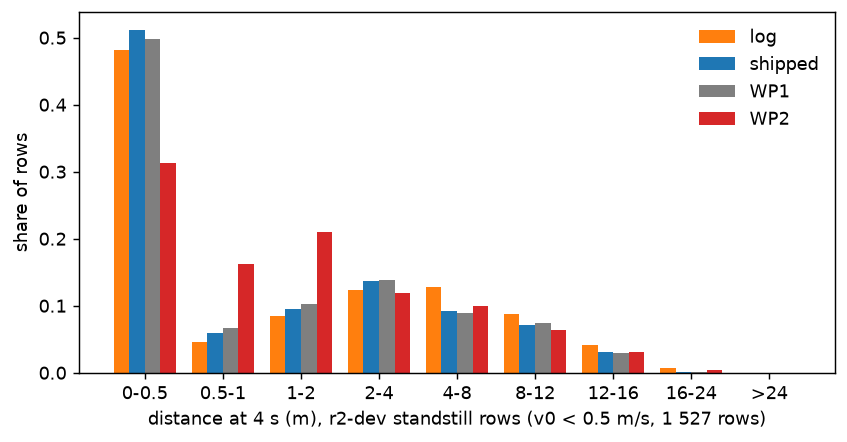

# WP2 at standstill on WOD-E2E val: half of the gap to the log is the base model's late launch, half is the ego-only adapter acting blind at rest; gating the adapter off below 0.5 m/s removes the second half

Written 2026-10-08. Pre-registration and its addendum: [plans/2026-10-08-wod-launch-prereg.md](../plans/2026-10-08-wod-launch-prereg.md) (the plan was
committed before any new arm or label was read; the addendum after the Step 1 read and before any Step 2 arm was trained). Code:
`scripts/wod_launch.py` (labels, bias arms, token path), `scripts/wod_launch_report.py` (tables), `scripts/wod_launch_figs.py`,
`scripts/wod_launch_chain.sh` (the lane), `scripts/pp_train.py --stop-gate` (the Step 2 flag). Tables: [wod_launch/](wod_launch/); figures:
[../figs/wod_launch/](../figs/wod_launch/). Conventions as in [wod_gap.md](wod_gap.md): 479 rater frames, cluster-mean RFS, paired bootstrap over
sequences (B 4 000), WP2 = per-frame mean of the two seeds' scores, open loop. Strata: `stopped` v0 < 0.5 m/s (120 frames), `SL` stopped and the log
moves >= 1 m in 5 s (95), `SS` stopped and the log stays (25), `moving` v0 >= 0.5 (359). d5 = displacement at 5 s.

## Answer

1. **Why.** On the 120 standstill rater frames WP2 is 0.762 RFS below the log. Half of that is the base model (log - shipped +0.406 [+0.033,
   +0.761]): every arm launches late when the log moves off 0.5-3 s after the frame (planned 5 s distance 55-69 % of the logged one for shipped, WP1
   and WP2 alike). The other half is the WOD input channel (WP1 - WP2 +0.384 [+0.087, +0.735]): serving WP2 with its adapter bias zeroed returns the
   standstill score to shipped's (+0.357 [+0.051, +0.714], both seeds). WP2 is not shorter than shipped at rest (mean d5 difference +0.03 m); the
   bias, which reads only the ego state and therefore sees nothing at rest, shifts every standstill plan the same way: creep where the car should
   stay, shorter long launches, and a lateral drift. The supervision horizon, the frame protocol, the command, the acceleration and the speed scalar
   are not the cause.
2. **Fix (WLG).** The same recipe with the adapter gated off on rows fed a speed below 0.5 m/s, in training and serving (`pp_train --stop-gate
   0.5`), full scale, 2 seeds: `stopped` **+0.393 [+0.096, +0.745]** against WP2 (seeds +0.410 / +0.376), `moving` -0.022 [-0.062, +0.016], all
   frames 8.187 vs 8.111 (+0.076 [-0.016, +0.180]); against shipped +0.182 [+0.049, +0.327] on all frames (WP2: +0.106 [-0.060, +0.279]). By the
   pre-registered rule the WP2-specific standstill loss is **fixed** and nothing is given back on moving frames. Training with the gate adds nothing
   over switching the bias off at serving time on the existing WP2 weights (7.991 vs 7.957 on `stopped`): the plan pathway does not learn to launch
   from the standstill rows it now receives.
3. **What is left.** WLG at standstill is shipped (+0.037), still 0.37 below the log (-0.369 [-0.710, -0.006]) and 1.67 below the top-rated
   trajectory. That half is anticipation at stop-controlled junctions (35 % of the standstill loss; all arms go half the logged distance), it is
   shared with the base model, and a linear read of the frozen tokens predicts "launch within 4 s" worse (AUC 0.76) than the plan already does (0.85):
   no evidence that this recipe can train it away.
4. **Traffic lights** do not cost the models points on WOD: red hold is the best standstill context for every arm and no arm differs there; the
   green launch is the one context where WP2 was clearly below shipped (-0.65 [-1.30, -0.10], 21 frames).

## Step 1: where the standstill gap comes from

Reference gap R = RFS(log) - RFS(WP2) on `stopped` = 0.762 (decision 164). Recovery r = (RFS(arm) - RFS(WP2)) / R; labels by the pre-registered
rule (carries: r >= 0.5 and CI excludes 0; part: 0.25 <= r < 0.5 and CI excludes 0).

| candidate | intervention | d RFS on `stopped` [95% CI] | r | label |
|:--|:--|:--|--:|:--|
| (e) base model | log - shipped (stored) | +0.406 [+0.033, +0.761] | 0.53 | half of R |
| (e) fine-tune without inputs | shipped - WP1 (stored) | -0.029 [-0.065, +0.001] | -0.04 | none |
| (e) input channel | WP1 - WP2 (stored) | +0.384 [+0.087, +0.735] | 0.50 | half of R |
| (b) ego channel | WP2 served with the bias zeroed | +0.357 [+0.051, +0.714] (seeds +0.377 / +0.336) | 0.47 | **part** |
| (b) constant part only | every frame gets WP2's mean bias | +0.264 [-0.152, +0.666] | 0.35 | not |
| (b) ego-dependent part only | bias minus its mean | +0.136 [-0.119, +0.403] | 0.18 | not |
| (b) command zeroed / acceleration zeroed | | +0.003 [-0.271, +0.299] / -0.004 [-0.054, +0.040] | 0.00 | not |
| (b) speed input +1 / +3 m/s | history untouched | -0.005 [-0.015, +0.006] / -0.003 [-0.035, +0.029] | 0.00 | not |
| (b) speed +1 / +3 m/s with a matching history | | -0.015 [-0.091, +0.059] / +0.079 [-0.357, +0.475] | 0.10 | not |
| (c) frame protocol | training protocol (token path, image pair (f - 2, f)) instead of the harness, 67 covered stopped frames | +0.003 [+0.000, +0.005] | 0.004 | not |
| (f) supervision horizon | WP2's waypoints after 4 s replaced by its own constant-velocity / constant-acceleration continuation | +0.070 [-0.013, +0.164] / +0.048 [+0.009, +0.088] | 0.09 / 0.06 | not |

1. **Two halves** (`wod_launch/place.md`). The base model already scores 0.41 below the log at standstill and the plan fine-tune without inputs does
   not change that (WP1 = shipped). The WOD input channel costs another 0.38, and serving WP2 with its bias zeroed gives all of it back: zero-bias WP2
   scores 7.957 on `stopped` against shipped's 7.954. The anchor rows hold: with the inputs off the fine-tuned weights are shipped.
2. **WP2 is not shorter than shipped at standstill** (`wod_launch/place_swaps.md`). Mean d5 difference on `stopped` +0.03 m [-0.35, +0.40]; medians
   4.2 m (WP2), 3.4 m (shipped), 6.1 m (log), 10.4 m (top-rated). What the bias does is compress and bend the plan: the share of plans under 1 m drops
   from 28 % to 17 % (the log: 21 %), the 90th percentile of d5 drops from 15.5 to 13.1 m (log 18.0), the mean lateral offset at 5 s doubles (0.65 vs
   0.30 m), and the floored share doubles (15 % vs 7 %). WP2's path at shipped's speed profile is -0.152 [-0.301, -0.035] against shipped, shipped's
   path at WP2's speed -0.189 [-0.489, +0.065]: path and speed each carry about half. Where the log stays (`SS`, 25 frames) WP2 creeps (median 1.0 m
   vs 0.6 m) and loses 0.40 to shipped.
3. **Why** (not dependent on the rater labels; `wod_launch/targets_*.md`, figure `d4_hist_dev.png`). The adapter reads only the ego state. At rest
   that state is zeros: of the bias's rms 1.07 on standstill frames, 1.00 is one fixed vector and 0.38 varies (command, residual acceleration). Under the
   imitation loss the adapter is the free parameter (the plan pathway is held by the anchor rows), so the pressure to launch more, which the base
   model's late launches create on every standstill row whose log moves, is expressed as an image-independent offset. On r2-dev standstill rows (in
   distribution, token path) the share of plans with d4 < 0.5 m is 48 % for the log, 51 % for shipped, 50 % for WP1 and **31 % for WP2**; the 0.5-2 m
   share is 13 % / 16 % / 17 % / **37 %**. WP2 fills the valley between stay and go. Its mean distance is closer to the log's (M 0.88 vs 0.83) and its
   go / stay ranking is better (AUC 0.85 vs 0.80), which is what the loss asks for; RFS punishes the in-between plan.
4. **The base model's half is late launching, shared by every arm** (`wod_launch/anticipation_val.md`, 48 869 even val frames, against the log). On
   standstill rows whose log launches 0.5-3 s later, the planned 5 s distance is 55-69 % of the logged one for shipped, WP1 and WP2 alike (WP2 is
   0.1-0.4 m further than shipped there, not shorter); on rows whose log launches within 0.5 s it is 95-99 %; on rows that do not launch in 5 s all three
   creep 1.3 m. In distribution it is the same: median d4 / logged d4 on launching r2-dev rows is 0.65 / 0.64 / 0.63. So "in-distribution
   under-launch" is **yes** by the pre-registered thresholds (R4 < 0.75) but it is not WP2's: the recipe inherits it and does not train it away.
5. **No sign of an unused signal.** A logistic probe on frozen pooled tokens (current slot and the one 1 s earlier; fitted on 32 251 r2-train
   standstill rows) predicts "launch within 4 s" with AUC 0.76 [0.69, 0.82] on r2-dev and 0.75 [0.72, 0.78] on val, below the plan's own distance used
   as a score (0.85 WP2, 0.80 shipped). The plan head already ranks stay / go better than a linear read of the features it is given. Shipped's plan
   spread (sigma of x at 4 s) is 2.2 m on launching rows against 0.7 m on staying ones (AUC 0.74): the head knows when it is unsure.
6. **Not the cause**: the supervision horizon (the imitation loss covers 0.5-4.0 s, WOD waypoints at 4.5-5 s come from plan points it never
   touches; replacing them changes `stopped` by +0.05 to +0.07 and nothing elsewhere; plan speed over 4-5 s is 1.26x that over 3-4 s on launching
   frames, 1.34x for shipped, i.e. no kink), the frame protocol (token path and harness agree to 0.007 m at standstill), the command, the given
   acceleration, the speed scalar (0.07 m of d5 per m/s; the adapter reads motion from the pose history: 0.7-0.9 m per m/s).

Base rates (`wod_launch/targets_base.md`): of standstill rows, the log launches within 4 s (d4 >= 2 m) on 39 % of r2-train, 39 % of r2-dev, 35 % of all
even val frames and **68 % of the rater frames**. The rater frames are picked at launch moments, so a late launcher pays more there than on ordinary
frames.

## Step 1 (a): scene context of the standstill frames, and whether traffic lights cost points

Labels: zero-shot Qwen3-VL-4B, option scoring, FRONT camera (`wod_launch/context_vlm.csv`, `context_extra.csv`); 40 standstill frames hand-labelled
from the images before the VLM labels were opened (`context_hand.csv`). Agreement (`context_agreement.md`):

| question | agreement on 40 | note |
|:--|--:|:--|
| light (red or yellow / green / none for ego) | 92.5 % | 2 green and 1 red read as "no light"; no red / green swap |
| stop sign in the FRONT image | 87.5 % | 4 false positives; the ego's own sign is outside the FRONT crop on most stop-controlled junctions |
| stop-controlled junction, FRONT + FRONT_RIGHT (*post hoc*) | 85.7 % of 35 | hand label inferred from the front image (5 "unknown" dropped); 5 false positives, no miss |
| lead vehicle, two frames (none / stopped / moving) | **52.5 %** | unreliable (13 "no lead" frames read as "moving lead"): not used |
| lead from shipped's lead head, prob > 0.5 and < 20 m (*post hoc*) | 92.5 % | rule set on the same 40 frames (in sample); no stopped / moving-off split |
| crossing pedestrian / vehicle | 80.0 % | recall 4 of 11: the class is under-counted |

Context of each standstill frame, by priority red > green > stop sign > lead > crossing > open (`context_table.md`; per-frame labels in
`frames.csv`). RFS columns are frame means inside the class; "points" are WP2's cluster-weighted loss against the top-rated trajectory.

| context | n | log launches | RFS top / log / shipped / WP1 / WP2 | d5 median top / log / shipped / WP2 (m) | share of WP2's standstill points | WP2 - log [95% CI] | WP2 - shipped [95% CI] |
|:--|--:|--:|:--|:--|--:|:--|:--|
| red or yellow light | 26 | 85 % | 9.85 / 8.40 / 8.34 / 8.37 / 8.29 | 4.1 / 3.8 / 0.4 / 2.0 | 15 % | -0.11 [-0.76, +0.57] | -0.06 [-0.67, +0.47] |
| green light | 21 | 90 % | 9.71 / 8.60 / 8.20 / 8.22 / 7.55 | 16.8 / 12.2 / 14.1 / 12.1 | 25 % | -1.05 [-1.96, -0.29] | -0.65 [-1.30, -0.10] |
| stop-controlled junction | 45 | 80 % | 9.58 / 7.96 / 7.14 / 7.19 / 6.78 | 12.0 / 9.8 / 4.8 / 5.3 | 35 % | -1.18 [-1.82, -0.56] | -0.36 [-0.74, +0.00] |
| lead within 20 m | 11 | 55 % | 9.45 / 8.78 / 8.82 / 8.79 / 7.86 | 1.8 / 1.0 / 1.6 / 2.8 | 14 % | -0.92 [-2.32, +0.26] | -0.96 [-2.29, -0.00] |
| crossing | 1 | | | | 2 % | | |
| open (no light, sign, lead) | 16 | 69 % | 9.75 / 8.86 / 7.81 / 7.84 / 7.60 | 9.8 / 6.5 / 1.4 / 2.3 | 10 % | -1.26 [-2.02, -0.59] | -0.21 [-1.05, +0.55] |

- **Stop-controlled junctions are the largest block** (a third of the standstill loss, 45 frames): the top-rated trajectory goes 12 m, the log 10 m,
  shipped and WP2 5 m. The cue to go is not in the frame (the driver's own decision after the stop); every arm is equally late.
- **Green launch** is the one context where WP2 is clearly below shipped (-0.65, n 21, weak): shipped's median plan (14.1 m) is longer than the
  log's (12.2 m) and WP2 pulls it back to the log (12.1 m) while the raters' first choice goes 16.8 m.
- **Red hold** costs no arm anything against the others (8.3-8.4 for log, shipped, WP1, WP2); the log itself moves within 5 s on 85 % of these
  frames (median 3.8 m: the light changes, or a turn on red) and shipped stays (0.4 m).
- With a lead, WP2 creeps toward it (2.8 m vs the log's 1.0 m) and scores 0.9 below shipped and the log (11 frames).
- By the pre-registered reading the contexts with a visible cue (green, open) hold 34 % of WP2's standstill points: the loss is **mostly
  anticipation** (launching before the frame shows a reason), not a failure to react to a visible cue.

**Do traffic lights cost points on WOD?** (`context_lights.md`; all 479 frames; gap to the top-rated trajectory, frame means)

| light for the ego | n | top - log | top - shipped | top - WP2 | WP2 - shipped [95% CI] |
|:--|--:|--:|--:|--:|:--|
| red or yellow | 56 | 1.53 | 1.39 | 1.36 | +0.03 [-0.33, +0.39] |
| green | 68 | 2.04 | 1.63 | 1.61 | +0.02 [-0.36, +0.43] |
| none | 355 | 1.29 | 1.71 | 1.51 | +0.20 [+0.03, +0.37] |
| stopped at red | 26 | 1.45 | 1.50 | 1.56 | -0.06 [-0.67, +0.47] |
| stopped at green | 21 | 1.12 | 1.52 | 2.17 | -0.65 [-1.30, -0.10] |
| stopped, no light | 73 | 1.38 | 2.10 | 2.52 | -0.42 [-0.77, -0.10] |
| moving at green | 47 | 2.45 | 1.68 | 1.37 | +0.31 [-0.12, +0.83] |

No: frames with a light are not where the models lose more than elsewhere (red 1.36-1.39, green 1.61-1.63, no light 1.51-1.71), and a red light is
the model's best standstill context. The standstill loss sits where there is no light (73 of the 120 frames, mostly stop signs). The human log is the
arm that loses at green lights while moving (2.45: it slows where the raters' first choice keeps going, decision 164).

## Step 2: the stop gate

Branch rule: (b) is the only candidate with a label (part, r 0.47), so Step 2 is WL-ego, in the form of addendum 1: **WLG** = the WP2 recipe with
the whole ego row zeroed (`present = 0`, bias exactly 0) on every row fed vx < 0.5 m/s, in training and at serving (`wod_launch.py gbias`). Same rows,
row order, seeds, steps as WP2-full.

**Pilot** (4 874 rows, 600 steps x 64, seed 0; against the stored WP2-pilot-s0; `wod_launch/gate_WLG.json`): `stopped` -0.042 [-0.142, +0.057],
`moving` +0.010 [-0.041, +0.078], all -0.003. Passes the harm-only gate of addendum 3 (>= -0.05 on both). It would have failed the gate as first
registered (`stopped` >= 0); the pilot-scale WP2 has no standstill deficit (+0.015 vs shipped), so the pilot could only show harm.

**Full** (179 405 rows, 10 000 steps x 128, seeds 0 / 1; `wod_launch/fix_WLG_strata.md`, per-frame `fix_WLG_frames.csv`):

| stratum | n | RFS WLG / WP2 / shipped / log | WLG - WP2 [95% CI] (seeds) | WLG - shipped [95% CI] | WLG - log [95% CI] | d5 median WLG / WP2 / shipped / log (m) |
|:--|--:|:--|:--|:--|:--|:--|
| all | 479 | 8.187 / 8.111 / 8.005 / 8.131 | +0.076 [-0.016, +0.180] (+0.080 / +0.072) | **+0.182 [+0.049, +0.327]** | +0.056 [-0.162, +0.281] | 16.2 / 15.8 / 16.2 / 14.9 |
| **stopped** | 120 | 7.991 / 7.598 / 7.954 / 8.360 | **+0.393 [+0.096, +0.745]** (+0.410 / +0.376) | +0.037 [+0.006, +0.077] | -0.369 [-0.710, -0.006] | 3.4 / 4.2 / 3.4 / 6.1 |
| SL (log moves) | 95 | 7.759 / 7.362 / 7.705 / 8.230 | +0.397 [+0.043, +0.814] (+0.426 / +0.369) | +0.055 [+0.013, +0.105] | -0.470 [-0.937, +0.012] | 4.1 / 4.8 / 4.3 / 9.0 |
| SS (log stays) | 25 | 8.369 / 7.983 / 8.380 / 8.176 | +0.386 [+0.004, +1.194] (+0.376 / +0.396) | -0.011 [-0.038, +0.003] | +0.193 [-0.118, +0.656] | 0.6 / 1.0 / 0.6 / 0.0 |
| launch (v < 2, log > 5 m) | 111 | 7.225 / 6.983 / 7.317 / 7.835 | +0.242 [-0.030, +0.564] (+0.263 / +0.222) | -0.092 [-0.313, +0.118] | -0.610 [-1.190, -0.066] | 8.3 / 8.4 / 8.1 / 11.0 |
| **moving** | 359 | 8.239 / 8.260 / 7.981 / 8.122 | **-0.022 [-0.062, +0.016]** (-0.022 / -0.022) | +0.257 [+0.063, +0.469] | +0.116 [-0.128, +0.370] | 26.2 / 25.9 / 26.1 / 21.5 |
| slow 0.5-5 | 179 | 7.629 / 7.671 / 7.508 / 7.925 | -0.043 [-0.112, +0.027] (-0.021 / -0.065) | +0.121 [-0.125, +0.381] | -0.297 [-0.667, +0.079] | 11.1 / 11.2 / 12.4 / 9.5 |
| mid 5-12 | 142 | 8.564 / 8.570 / 8.342 / 8.096 | -0.006 [-0.053, +0.034] | +0.222 [-0.024, +0.480] | +0.468 [+0.116, +0.816] | 36.3 / 36.1 / 35.2 / 33.9 |
| fast >= 12 | 38 | 8.848 / 8.869 / 8.283 / 8.646 | -0.020 [-0.085, +0.047] | +0.565 [+0.017, +1.337] | +0.202 [-0.587, +1.145] | 73.6 / 73.4 / 68.0 / 69.9 |
| night | 133 | 7.976 / 7.915 / 7.610 / 8.328 | +0.061 [-0.168, +0.331] | +0.366 [+0.087, +0.766] | -0.353 [-0.951, +0.203] | 15.1 / 14.3 / 15.5 / 13.2 |
| day | 325 | 8.201 / 8.139 / 8.100 / 8.012 | +0.062 [-0.021, +0.142] | +0.101 [-0.060, +0.275] | +0.189 [-0.079, +0.453] | 18.0 / 17.5 / 18.1 / 15.9 |

ADE against the log (1 437 frames): @3s 0.580 vs WP2 0.574 (+0.006 [+0.000, +0.012]), @5s 1.483 vs 1.457 (+0.027 [+0.012, +0.042]); against shipped
-0.460 / -0.633. Training dev ADE 0.635 (WP2 0.628 / 0.630), drift with inputs off 0.043 m.

- **Verdict by the pre-registered rule**: `stopped` CI lower bound > 0 and `moving` not lost (CI contains 0, point >= -0.05): **fixed**. The standstill
  CI is wide (+0.10 to +0.75; 120 frames) and the gain is exactly the size of the deficit it removes (WP2 - shipped -0.356), so read it as "the
  WP2-specific standstill loss is gone", not as a gain over shipped at standstill (+0.037).
- **All frames**: +0.076 over WP2 with a CI that contains 0; against shipped the CI now excludes 0 (+0.182 [+0.049, +0.327]; WP2's did not). One
  contrast among many on 479 frames: weak, but both seeds agree (+0.080 / +0.072 over their WP2 seed).
- **Moving frames**: -0.022, the same in both seeds, inside the CI. The slow bin (-0.043) holds the frames just above the gate; the cost of the
  discontinuity there, if any, is below what 179 frames resolve. ADE to the log gets 0.006-0.027 m worse because the standstill plans no longer
  follow the log's mean.
- **Night / day**: +0.061 / +0.062, no difference; night against shipped +0.366 [+0.087, +0.766].
- **SS** (the P2H failure type, decision 162): no creep comes back; WLG is shipped there (8.369 vs 8.380).

**Serving-side gate on the existing WP2 weights** (reference, no training; `wod_launch/gate_composite.md`): `stopped` +0.357 [+0.051, +0.714],
`moving` -0.005, all frames +0.077 [-0.013, +0.178] against WP2 and +0.183 [+0.051, +0.327] against shipped. The on / off choice made on the training
folds (5-fold over sequences x 20) picks the gate in every fold, so the out-of-fold numbers are the same. Trained WLG and this reference agree to
0.03 on `stopped` and 0.001 on all frames: the gate is the whole effect.

**Turn-intent frames by v0** (*post hoc*, at the coordinator's request; `wod_launch/turn_v0.md`; inward miss = lateral miss at 5 s against the
top-rated path, + = inside of the turn, convention of `wod_gap_turn_side.py`; medians, both seeds in brackets; RFS = frame mean)

| v0 | n | arm | RFS | inward miss median (m) | inside > 1 m / wide > 1 m |
|:--|--:|:--|--:|:--|:--|
| < 0.5 | 20 | shipped | 7.45 | +0.11 | 7 / 3 |
| | | WP2 | 5.86 | +2.63 (+2.64 / +2.61) | 13 / 2 |
| | | WP1 | 7.42 | +0.15 | 7 / 3 |
| | | WP2 + serving gate | 7.42 | +0.11 (+0.11 / +0.10) | 7 / 3 |
| | | **WLG** | **7.42** | **+0.12 (+0.12 / +0.12)** | 7 / 3 |
| | | log | 6.56 | +0.94 | 10 / 2 |
| 0.5-3 | 17 | shipped | 6.07 | +0.82 | 8 / 2 |
| | | WP2 | 5.66 | +1.81 (+1.72 / +1.89) | 10 / 3 |
| | | WP2 + serving gate | 5.56 | +1.81 | 10 / 3 |
| | | WLG | 5.83 | +1.94 (+1.86 / +1.95) | 10 / 2 |
| | | log | 6.07 | +1.11 | 11 / 0 |
| >= 3 | 15 | shipped | 6.41 | +1.10 | 8 / 1 |
| | | WP2 | 6.25 | +0.87 (+0.76 / +1.00) | 6 / 0 |
| | | WLG | 6.31 | +0.76 (+0.76 / +0.90) | 5 / 1 |
| | | log | 6.85 | +0.93 | 6 / 0 |
| all turns | 52 | shipped / WP2 / WLG / log | 6.70 / 5.91 / 6.58 / 6.48 | +0.63 / +1.29 / +0.71 / +1.02 | 23 / 6, 29 / 5, 22 / 6, 27 / 2 |

The standstill-start turns carry WP2's extra inside-corner miss and the gate removes it: +2.63 m -> +0.12 m, RFS 5.86 -> 7.42, identical to shipped
and WP1, for the trained arm and the serving gate alike. The adapter's standstill offset is the cause there. At 0.5-3 m/s, just above the gate, the
extra inward miss stays (+1.8 to +1.9 m against shipped's +0.8; 17 frames, RFS 5.83 vs 6.07): that part is the adapter with real ego input and the
gate does not touch it. No CIs in this table (15-20 frames per cell).

**Cost** (pool job wall time, cards shared with another lane): Step 1 0.5 card-hours (labels 10 min, token path 2.4 min, two harness jobs 16 min);
Step 2 3.4 card-hours (pilot 1 min training + 23 min serving; full 2 x 54 min training + 43 / 31 min serving).

## Figures

Left: the road and wide frames the model is fed at t0 (the harness renderer). Right: BEV, ego at the star heading up, lateral axis stretched; markers at
3 s and 5 s; black = top-rated rater trajectory, grey dashed = the other two, orange = log, blue = shipped, red = WP2 (two seeds), green = WLG. Selection
fixed before looking (per context the frame with WP2's largest loss; for green and stop sign also the median-loss frame; one log-stays frame). Numbers:
`wod_launch/figures.csv`.

| figure | context | what to look at |
|:--|:--|:--|
| [00](../figs/wod_launch/00_red_max_loss_774c537b.png) | red, max loss | Stopped at a red light, raters hold (10: 0.0 m). The log creeps 1.3 m (8.0), shipped and WLG plan 5.9 m (6.0), WP2 4.0 m and is floored. Every arm rolls into a red here; the gate only restores shipped's version of it. |
| [01](../figs/wod_launch/01_green_max_loss_c5cee37f.png) | green, max loss | Green launch: the 10-rated trajectory covers 25.6 m, the log, shipped, WP2 and WLG all 15-16 m and all are floored (4.0-4.1). The base model's late launch, untouched by the gate. |
| [02](../figs/wod_launch/02_green_median_loss_15fd1819.png) | green, median loss | The common case: top-rated 18.3 m, log 11.8 m, every arm 13.4-13.8 m, all score 8.0 from the second rater. A lower-rated valid mode. |
| [03](../figs/wod_launch/03_stop_sign_max_loss_f13fbfd6.png) | stop sign, max loss | Stop-controlled junction: top-rated 18.7 m; the log goes 6.3 m and scores 3.0, shipped / WLG 9.2 m (4.0), WP2 6.9 m (3.5). Nobody launches as the raters want. |
| [04](../figs/wod_launch/04_stop_sign_median_loss_4b390f75.png) | stop sign, median loss | Log 18.0 m (8.0), shipped and WLG 7.5 m (5.5), WP2 6.0 m (4.1): the half-distance launch of the stop-sign block, and WP2's compression on top of it. |
| [05](../figs/wod_launch/05_lead_max_loss_f4195a30.png) | lead, max loss | Top-rated 22.1 m; log 10.2 m, WP2 10.6 m, shipped / WLG 8.8 m; all at or near the floor. WP2 is the longer plan here, and the gate takes that back. |
| [06](../figs/wod_launch/06_open_max_loss_74cf0a3e.png) | open, max loss | Left turn from rest: raters and the log go 17-18 m. WP2 starts the turn (8-12 m, on the inside of the path, 4.0-5.0); shipped and WLG stay (1.6-1.8 m) and score 8.0 from the third rater, who stays. The gate wins on RFS by not committing. |
| [07](../figs/wod_launch/07_lead_log_stays_fa998930.png) | lead, log stays | Fire engine across the junction at night; raters and the log hold. WP2 plans 4 m sideways in both seeds (floored, 4.0); shipped and WLG creep 1.7 m straight and score 10. The image-independent offset in its plainest form. |

Look at: the first three bins. The log, shipped and WP1 put about half of the standstill rows under 0.5 m at 4 s; WP2 moves a third of those into
0.5-2 m (r2-dev, in distribution, token path).

## Checks

- The report reproduces decision 163 (shipped 8.005, WP2 8.111, WP1 8.012, log 8.131) and decision 164's R (0.762).
- WP2 re-served through the multi-bias harness path vs the stored runs: plan xy 0.010 m mean (p99 0.063, max 0.23 m); RFS on `stopped` 7.600 vs 7.598.
- Token path vs harness for shipped on the 245 covered rater frames: 0.014 m mean (decision 163's G0: 0.022 m).
- Gate bookkeeping: 121 frames are fed a speed below 0.5 m/s (position-derived); 120 of them are the `stopped` stratum (metric speed), one is not.
- Splits from `jevdrive.data.splits` (`wod/val`, `wod/r2-train`, `wod/r2-dev`); the probe and every training statistic use train rows only.

## Deviations from the pre-registration

- **WL-ego's form** (addendum 1): the registered "zero the speed and pose-history inputs on standstill rows with p = 0.5" is a no-op because those
  inputs are already zero at rest; the same intent is implemented as the whole ego row zeroed (`present = 0`) on every row fed vx < 0.5 m/s, in
  training and serving. Chosen after the Step 1 read.
- **Pilot gate** (addendum 3): relaxed to harm-only (>= -0.05 on `stopped` and on `moving`) after seeing that the pilot-scale WP2 has no standstill
  deficit to fix (WP2-pilot - shipped on `stopped` +0.015).
- **Lead labels**: the VLM lead question failed the 80 % line; the remaining 80 standstill frames were not hand-labelled as the plan allowed.
  Shipped's lead head replaced it (threshold set on the 40 hand frames) and the stopped / moving-off split was dropped, so "lead moving off" is not
  answered. The "visible cue" classes became green + open.
- **Stop sign**: one question added on the FRONT + FRONT_RIGHT pair after the hand check.
- The path / speed swap against shipped, the d5 distribution table, the serving-gate reference and the turn table were added after the first read
  (*post hoc*); the turn table at the coordinator's request.

## Caveats

- Open loop; 479 frames, 120 at standstill; about 30 contrasts in Step 1 plus the context cells (11-45 frames each). CIs with a bound near 0 are weak:
  that includes WP2 - shipped on `stopped` (decision 164) and every per-context contrast. The Step 1 conclusion rests on the zero-bias arm (both
  seeds, same sign and size), on the exact return to shipped's score, and on the train / dev distributions that do not use rater labels.
- The gate was chosen from val rater frames. The serving-gate reference is therefore reported out of fold as well (the choice is one bit and every
  fold makes the same one, so the two numbers coincide); the mechanism evidence (item 3) is label-free.
- The gate is a step at 0.5 m/s. Open loop that is free; closed loop the plan changes regime as the car starts to roll. Not tested.
- Context labels are zero-shot VLM answers checked on 40 frames; crossing is under-counted and the lead rule is in sample.
- (d) is read against the log (the training target), not against rater preference. "Late" means later than the driver, and the raters' first choice
  goes further still.
- The base model's half (0.41 at standstill, the stop-sign block) is untouched by Step 2.

## What was reused

Stored predictions of decision 163 (shipped, WP1, WP2, WP2-pilot), the decision 155 harness and its multi-bias path (decision 162), the RFS port and
its per-frame parts (`wod_gap.parts`), `pp_wod_diag.retime`, the train token cache of decision 163 (`cache/wod_r2`), the val trunk cache
(`processed/op_adapt/wodval`), the Alpamayo JPEG export (`t2_jpg`) for the labeller and the hand check, Qwen3-VL-4B from the HF cache (decision 84's
labeller). Nothing of decisions 111 / 119 / 141 (closed-loop launch behaviour) was re-tested.
