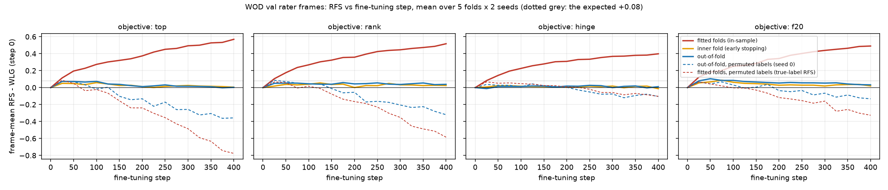
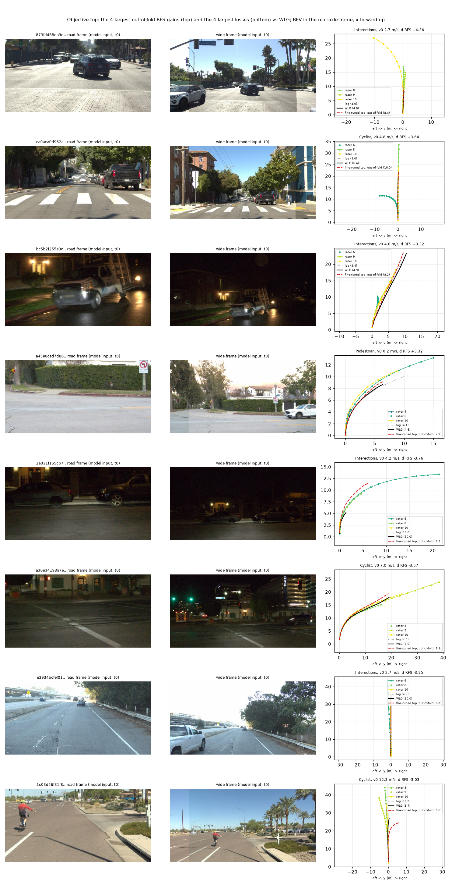

# Rater preference fine-tuned into System 1 on WOD-E2E val: out-of-fold +0.09 RFS over WLG for two of four objectives, at the expected size, with weak CIs; in-sample is four times larger

Written 2026-10-08. Pre-registration: [plans/2026-10-08-wod-pref-prereg.md](../plans/2026-10-08-wod-pref-prereg.md) (committed before any fine-tuned
plan was scored). Code: `scripts/wod_pref.py` (prep, train, pick, report, figs), `scripts/wod_pref_chain.sh` (the lane). Tables:
[wod_pref/](wod_pref/); figures: [../figs/wod_pref/](../figs/wod_pref/). Folds: `wod/pref5-f0..4` (478 sequences, cluster-stratified).
Conventions as in [wod_launch.md](wod_launch.md): 479 rater frames, cluster-mean RFS, paired bootstrap over sequences (B 4 000), an arm = the
per-frame mean of the two seeds' scores, open loop. All numbers here are on the token path (the training path), for WLG as well.

## Answer

- **Out-of-fold, preference training moves RFS by about the expected +0.08, not more.** Regression to the top-rated trajectory (`top`) gives
  +0.091 [+0.012, +0.170] over WLG (8.188 -> 8.279), the sampled-reward objective on the F20 candidates (`f20`) +0.089 [+0.018, +0.156]; the
  score-weighted objective (`rank`) +0.045 [-0.009, +0.103] and the trust-region hinge of the metric (`hinge`) +0.005 [-0.023, +0.035] are nulls.
  Four objectives were compared and the two lower bounds sit at +0.01 / +0.02: by the pre-registered reading these are weak.
- **By the pre-registered rule only `f20` "delivers"** (CI excludes 0, no stratum or cluster with a CI entirely below 0). `top` fails it on one
  cluster: Single-Lane Maneuvers -0.227 [-0.495, -0.014] (38 frames). No objective is a clear null on every count, so the lane does not end as
  a null; it ends as "the effect exists and is small".
- **In-sample is +0.25 to +0.35 for every objective** (fitted frames, same early-stopping step): the plan pathway fits 287 frames easily and
  about a quarter of that transfers for `top` / `f20`, none for `hinge`. The out-of-fold curve peaks at 50-100 steps (+0.07 to +0.10) and decays
  towards 0 by 400 steps while the fitted folds keep rising to +0.5 (figure 1).
- **Permutation control** (labels moved between frames of the same v0 bin, seed 0): `top` -0.111 [-0.259, +0.037] and `rank` -0.132, so for
  these two the gain needs the frame's own labels (`top` seed 0 minus its control +0.195 [+0.051, +0.348]). For `f20` the control is
  +0.012 [-0.114, +0.138] and the difference +0.029 [-0.084, +0.135]: its gain is not shown to be frame-specific on seed 0 (seed 0 alone
  is +0.041, seed 1 +0.137).
- **Share of the decision-168 ceiling: 8-9 %** (+0.09 of +1.068 on WP2; the same F20 ceiling recomputed on the WLG token-path plans is
  +1.010 [+0.829, +1.200], share 9 %).
- **Cost in imitation:** ADE to the log on the rater frames rises by 0.13 m at 3 s and 0.20 m at 5 s for `top` (0.09 / 0.13 for `f20`), and the
  WOD-train dev ADE from 0.673 to 0.775 m (`top`) / 0.726 m (`f20`), with the WOD-train anchor rows at 75 % of every batch.

## Setup (as pre-registered)

- Start: `WLG-full-s{0,1}`; trainable: ego adapter + plan pathway (16.2 M), vision frozen, standstill gate kept.
- Batch 64 = 16 preference rows + 48 WOD-train rows (the unchanged WLG recipe); loss = WLG loss + 1.0 x preference loss + 30 x distillation of
  the non-plan heads on the preference rows; 400 steps, AdamW, warm-up 20 steps then constant, plans of all 479 frames stored every 25 steps.
- Outer fold k is scored, fold (k + 1) % 5 picks the step (best frame-mean RFS, step 0 allowed), the other three folds (about 287 frames) are fitted.
- Learning rate 1e-5 (plan pathway) / 1e-4 (adapter), chosen in the pilot (fold 0, `top`, seed 0) among three by the inner fold only
  ([wod_pref/pilot.csv](wod_pref/pilot.csv): inner gain +0.095 / +0.124 / +0.088 at 3e-6 / 1e-5 / 3e-5; the pilot's out-of-fold was -0.02 / 0.00 / +0.01).
- Gates: P0 the new rater-frame tokens against the `wodval` cache on 245 even frames, plan difference 0.004 m (max 0.024); P1 WLG token path
  against the stored harness run, plan difference 0.011 m, RFS 8.188 against 8.187.

## Objective x out-of-fold ([wod_pref/main.md](wod_pref/main.md), [per_seed.md](wod_pref/per_seed.md))

| objective | out-of-fold vs WLG | in-sample vs WLG | permutation control, out-of-fold (seed 0) | seed 0 minus its control | seed 0 / seed 1 out-of-fold |
|---|---|---|---|---|---|
| top (regress to the top-rated) | +0.091 [+0.012, +0.170] | +0.352 [+0.254, +0.453] | -0.111 [-0.259, +0.037] | +0.195 [+0.051, +0.348] | +0.084 / +0.099 |
| rank (score-weighted soft-min) | +0.045 [-0.009, +0.103] | +0.345 [+0.251, +0.453] | -0.132 [-0.280, +0.010] | +0.166 [+0.035, +0.306] | +0.034 / +0.056 |
| hinge (metric, log domain) | +0.005 [-0.023, +0.035] | +0.251 [+0.173, +0.341] | +0.004 [-0.140, +0.157] | -0.011 [-0.159, +0.127] | -0.008 / +0.018 |
| f20 (sampled reward on F20) | +0.089 [+0.018, +0.156] | +0.282 [+0.179, +0.390] | +0.012 [-0.114, +0.138] | +0.029 [-0.084, +0.135] | +0.041 / +0.137 |

Selected steps over the 10 fold-runs range from 25 to 375 for every objective (medians 112 / 137 / 237 / 87): the 96-frame inner fold is a
noisy stopping signal.

## Strata and clusters ([wod_pref/strata.md](wod_pref/strata.md))

Out-of-fold difference to WLG; only cells whose CI excludes 0 or that matter for the rule are listed, the rest contain 0.

| stratum | n | top | f20 |
|---|---:|---|---|
| standstill (v0 < 0.5) | 120 | -0.009 [-0.170, +0.128] | +0.002 [-0.044, +0.044] |
| launch (v0 < 2, log > 5 m) | 111 | +0.206 [-0.008, +0.414] | +0.204 [+0.034, +0.370] |
| moving (v0 >= 0.5) | 359 | +0.103 [+0.012, +0.202] | +0.117 [+0.026, +0.209] |
| turn (intent left / right) | 52 | +0.100 [-0.195, +0.480] | +0.241 [-0.021, +0.532] |
| night / day | 133 / 325 | +0.042 / +0.081 (both contain 0) | +0.099 / +0.076 (both contain 0) |
| Cut_ins | 20 | +0.495 [+0.149, +0.930] | +0.254 [-0.067, +0.612] |
| Construction | 15 | +0.242 [-0.002, +0.552] | +0.156 [+0.030, +0.320] |
| Multi-Lane Maneuvers | 42 | -0.141 [-0.351, +0.045] | +0.061 [-0.140, +0.271] |
| Single-Lane Maneuvers | 38 | -0.227 [-0.495, -0.014] | -0.103 [-0.351, +0.056] |

- Standstill does not move for any objective (rank +0.008, hinge +0.006): the stop-sign launch deficit of decision 169 is not reached by this
  route. The gain is on moving and slow-launch frames.
- Of the clusters where Poutine lost (Spotlight, Construction, Multi-lane): val has no Spotlight; Construction is positive for all four
  objectives; Multi-Lane is negative for `top` (CI contains 0) and flat for the others. Single-Lane Maneuvers is negative for all four
  (-0.08 to -0.23), the cluster where WLG is already highest (8.48).
- `rank` has one positive cell (Pedestrian +0.068 [+0.002, +0.150]); `hinge` none.

## Drift from imitation ([wod_pref/ade.md](wod_pref/ade.md))

| objective | d ADE@3s to the log (WLG 0.834 m) | d ADE@5s (WLG 1.919 m) | plan moved vs WLG, mean | d 5 s displacement, all / standstill | r2-dev ADE, 0.673 m at step 0 |
|---|---|---|---:|---|---:|
| top | +0.131 [+0.100, +0.165] | +0.197 [+0.134, +0.265] | 0.56 m | +0.45 m / +0.60 m | 0.775 |
| rank | +0.068 [+0.051, +0.088] | +0.087 [+0.054, +0.122] | 0.34 m | +0.03 m / +0.01 m | 0.722 |
| hinge | +0.018 [+0.011, +0.026] | +0.030 [+0.015, +0.046] | 0.17 m | +0.03 m / -0.03 m | 0.692 |
| f20 | +0.087 [+0.062, +0.114] | +0.133 [+0.083, +0.183] | 0.43 m | -0.08 m / -0.14 m | 0.726 |

`top` makes the plan go further (+0.45 m at 5 s, +0.60 m from standstill), as the raters prefer, but standstill RFS does not follow;
`f20` gains the same RFS without going further on average.

## Figures

- 
  [figs/wod_pref/curves.png](../figs/wod_pref/curves.png): frame-mean RFS minus step 0 against the fine-tuning step, mean over 5 folds x 2 seeds.
  Look at the gap between the red line (fitted folds, rising to +0.4 to +0.6) and the blue line (out-of-fold, peaking below +0.1 at 50-100
  steps and returning towards 0): the model memorises the fitted frames; the dashed lines (permuted labels) fall below 0 for `top` / `rank`
  and stay near the solid blue line for `hinge` / `f20` early on.
- 
  [figs/wod_pref/frames.png](../figs/wod_pref/frames.png): objective `top`, the 4 largest out-of-fold gains (top) and the 4 largest losses
  (bottom): the road and wide frames the model is fed at t0, and a BEV with WLG (black), the fine-tuned out-of-fold plan (red dashed, seed 0),
  the three rated trajectories coloured by score and the log. Look at the gains (the plan lengthened into a rated trajectory's region) against
  the losses (a plan that was already scored 10 pushed further or bent away; the last row ends with a kink to the right). Table:
  [wod_pref/figure_frames.csv](wod_pref/figure_frames.csv).

## All-479 checkpoints (not submitted)

`$DATA_DIR/runs/op_parity/runs/WPF-top-all-s{0,1}/ckpt-final.pt` (112 steps) and `WPF-f20-all-s{0,1}/ckpt-final.pt` (87 steps): every rater frame
fitted, steps = the median of the selected steps, loadable with `pp_train.load_pmodel`. In-sample RFS on the 479 frames 8.42 / 8.43 (`top`),
8.35 / 8.37 (`f20`) frame mean. No ONNX was exported and nothing was submitted.

## Verified / not verified

- Verified: token path against the harness for WLG (P1); the new token cache against the existing one (P0); every scored frame comes from a
  model that neither fitted nor early-stopped on it (fold roles are stored per run and asserted against the registered splits); step-0 plans
  agree across folds and objectives; no pool job is left.
- Not verified: the fine-tuned models through the harness (no per-fold ONNX: the harness needs 14 cores for about 25 minutes per pair of tags
  and the CPU quota was held by other lanes); closed loop; WOD test. The figures were looked at once (both).

## Caveats and deviations

- The pilot's learning-rate choice (3 options) used the inner fold of outer fold 0, which is the scored fold of outer fold 1: a small leak of
  fold-1 labels into one three-way choice, as pre-registered.
- Four objectives x 17 strata: the two positive all-frame CIs have lower bounds of +0.01 / +0.02; single-cluster cells are weak.
- The permutation control ran on seed 0 only; `f20` seed 0 is the weaker of its two seeds, so "not frame-specific" for `f20` is not settled.
- One rater frame (`2dd9daa2312e66da3c0ea477145b70b8-147`) has only two real frames of history in the shards; its older slots are zero tokens
  (a late stream start).
- Deviation: the pre-registration saves an all-479 checkpoint for objectives that "deliver" (`f20` only); `top` was saved as well because its
  all-frame CI excludes 0.
- Budget: about 1.8 card-hours (prep 3 min, pilot 3 runs, 60 fold-runs in 12 pool jobs, 4 final runs).
