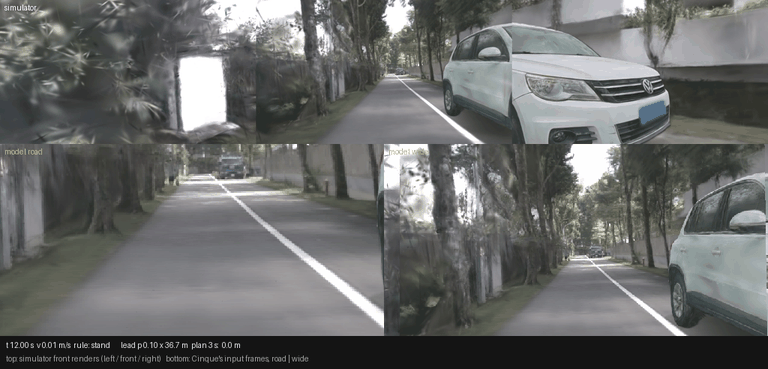

# op_resume pilot: 5 of 6 stuck HUGSIM runs launch (stuck HD +0.122), but the missed-lead case collides 2.5 s after a firing: gate STOP

Written 2026-10-05. Pre-registration (commit 5dbcdaac, before any scored run): [../plans/2026-10-05-op-resume-prereg.md](../plans/2026-10-05-op-resume-prereg.md).
Rule: `jevdrive/openpilot/resume.py` defaults. Tables: [pilot/hugsim.csv](pilot/hugsim.csv), [pilot/b2d.csv](pilot/b2d.csv), [pilot/summary.json](pilot/summary.json)
(`scripts/or_report.py pilot`). Runs: `$DATA_DIR/runs/op_resume/{hugsim,b2d}/pilot/`. Shipped Cinque; both arms ran the same day on the
same code (`spec` = rule off). Cost: HUGSIM 2 units x 8 scenes (~40-47 worker-min each, 5 workers), B2D 2 units x 3 routes; < 1 GPU h.
Tags: **[E]** measured, **[I]** inference.

## HUGSIM [E]

| scene | set | HD spec | HD rule | RC spec | RC rule | end spec -> rule | firings | first at (s) | launched | hand-backs |
|---|---|---|---|---|---|---|---|---|---|---|
| 0418-hard | stuck | 0.173 | 0.156 | 1.000 | 1.000 | complete -> complete | 1 | 18.0 | yes | plan |
| 0411-medium | stuck | 0.062 | 0.180 | 0.062 | 0.180 | max_steps -> max_steps | 2 | 15.75 | yes | lead_abort x2 |
| 034-easy-00 | stuck | 0.897 | 0.863 | 0.930 | 1.000 | max_steps -> complete | 1 | 23.25 | yes | speed |
| 095-medium-01 | stuck | 0.199 | 0.745 | 0.199 | 0.745 | max_steps -> max_steps | 4 | 24.75 | yes | plan x4 |
| 113792265837-easy | stuck | 0.112 | 0.228 | 0.112 | 0.373 | max_steps -> max_steps | 4 | 15.75 | yes | speed x3, timeout |
| 3000_3200-medium | stuck, lead 5-8 m | 0.268 | 0.269 | 0.275 | 0.275 | max_steps -> max_steps | 0 (held by the lead gate) | - | - | - |
| 0051-easy | not stuck | 1.000 | 1.000 | 1.000 | 1.000 | complete -> complete | 0 | - | - | - |
| 124-extreme-01 | not stuck (risk case) | 0.094 | 0.144 | 0.094 | 0.151 | max_steps -> **fg_collision** | 1 | 16.5 | yes | plan |

- Stuck 6: fired 5, **launched 5**; HD rule - spec **+0.122 [-0.000, +0.307]**, RC +0.166 [+0.032, +0.336]; max_steps 5 -> 4; no collision ending.
  The rule fires once the car has stood 10 s with the lead head clear (t 15.75-24.75 s) and hands back after 1-2 s, mostly to the model's own
  plan ("plan": the plan asks for as much as the profile once the car rolls). 0418-hard (the GIF) then drives on by itself, as decision 119
  saw for the base iLQR's creep. 095-medium and 113792265837-easy re-stop and need 4 firings each; 0411-medium aborts twice when the lead
  head sees a lead within 15 m.
- 3000_3200-medium (lead head 5-8 m) does not fire: the lead gate holds as designed.
- Note: today's `spec` rerun of 0418-hard completes (HD 0.173, RC 1.0); in decision 118's run it stood to max_steps (0.002). The pre-registered
  stuck list is decision 118's; reruns differ (worker scheduling of attack actors), so "stuck" is a property of a run, not of a scene.

**The guard failure: 124-extreme-01.** The rule fired at 16.5 s (lead head p 0.13 at 33.7 m: clear), launched to 2.0 m/s in 1.25 s and handed
back to the model's plan at 18.0 s (2.37 m/s). The plan kept accelerating (3.6 m/s at 19.0 s) and the run ended in a foreground collision at
19.25 s, 2.75 s after the firing. In the `spec` run the car stood to max_steps. HD still rose (0.094 -> 0.144: the route progress before the
collision outweighs the standstill), but the pre-registered line is the collision. [I] The model's own plan and lead head drove into the actor
after the hand-back; the rule started the motion. This is the risk the prereg named for this scene (a lead the head misses).

## B2D, seed 2 [E]

| route | DS spec | DS rule | red light spec / rule | stop infr. | vehicle coll. | rule firings |
|---|---|---|---|---|---|---|
| 17280 (stop sign) | 100 | 80 | 0 / 0 | 0 / 1 | 0 / 0 | 0 |
| 24944 (red light) | 70 | 70 | 1 / 1 | 0 / 0 | 0 / 0 | 0 |
| 9196 (red light + lead stop) | 100 | 60 | 0 / 0 | 0 / 0 | 0 / 1 | 0 |

The rule never fired on B2D (`interface.json` lon.resume = `timer+rule`; the plan log has `rr` every tick, `stand` 408 ticks on 9196): the
5 s timer moves the car before 10 s of continuous standstill, as the offline replay predicted. With no firing the rule arm runs the same agent,
so the -20 / -40 DS on 17280 / 9196 are repeat noise (prereg section 4; decision 118.5 saw the same size). B2D gate condition: not triggered
(0 firings, 0 at a light).

## Gate verdict (prereg section 4)

1. Launch: 5 of 6 stuck launched (>= 3): **pass**.
2. HUGSIM guard: 0051-easy unchanged; 124-extreme-01 HD +0.050 (no HD regression), but **a collision ending 2.75 s after a firing: FAIL**.
   3000_3200-medium did not fire: pass.
3. B2D guard: the rule did not fire: pass (nothing to measure).

**STOP: the full stage (HUGSIM 64 + B2D guard subset) is not run.** Per the pre-registration this is reported, not retuned.

## Caveats

- n = 6 / 2 / 3, one run each. The stuck-set CI lower bound is -0.000; the fix effect is large on 3 scenes (095-medium +0.55) and small or
  negative on two (0418-hard -0.017, 034-easy -0.034, both completed in both arms).
- The ground-truth box columns of `or_offline.py` / `or_report.py` assumed ego-relative `obj_boxes`; in 124-extreme-01 the box coordinates
  stay at (11.5, 2.2) while the ego moves 5 m, so they are not ego-relative and the "in-lane box ahead" readings (prereg section 2's
  "box ~11 m ahead" for 124-extreme-01, "~25 m" for 0528-medium) are not trustworthy. The rule never reads them.
- On B2D the rule is inert behind the 5 s timer; whether it would help or hurt B2D is untested by this pilot.
- Options that would need a new pre-registration (not run): hand back only after the model's plan has kept a moving plan for some time, or
  keep the lead-head abort active during the cooldown that follows a hand-back (124-extreme-01 collided in the cooldown, at 3.6 m/s under the
  model's own plan, so the abort would have needed the head to see the actor, which it did not: p <= 0.13).

## GIF

`figs/resume_0418.gif` (`scripts/or_gif.py`, the pre-registered fixed case, rule arm rerun with dump_every 1; HD 0.184, complete). Top: the
simulator's left / front / right renders. Bottom: the two frames Cinque actually received (road | wide, decoded from the packed YUV after
the HUGSIM rig warp). Look at the status line: the car stands at ~0.02 m/s with the lead head at p 0.04 / 39 m (the road ahead is empty in
both model frames), the rule fires at 18.0 s, launches 0.4 -> 1.6 m/s in 1 s and hands back ("plan") at 19.0 s; the model then keeps
driving and completes the route.
