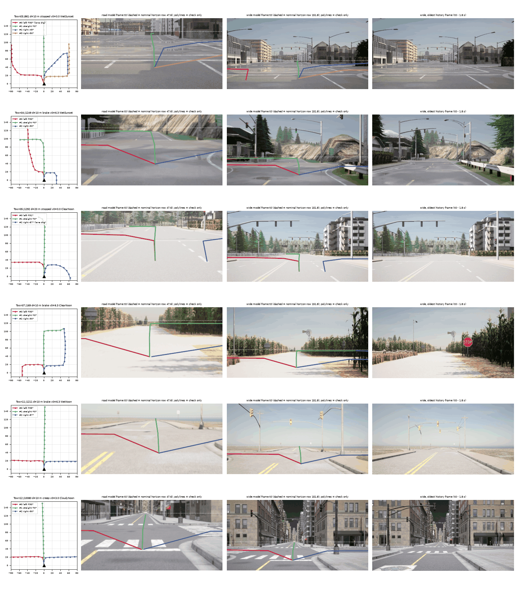
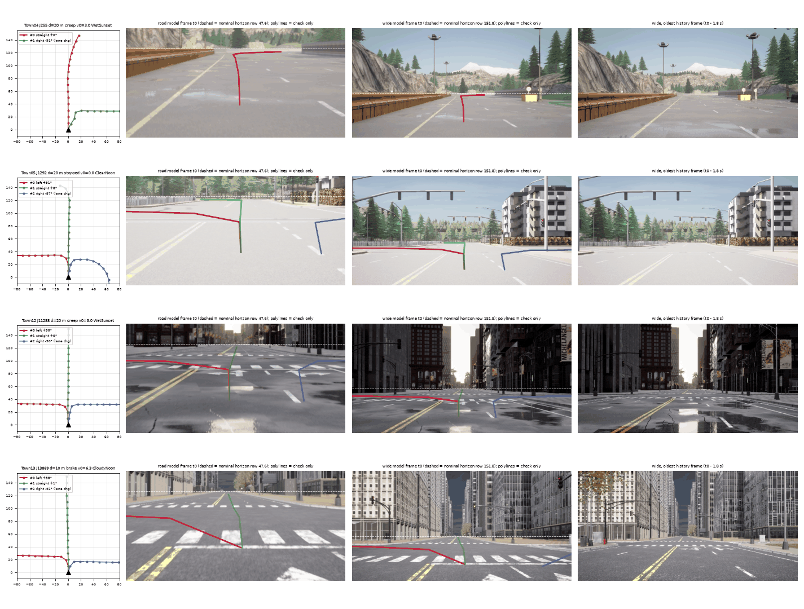

# CARLA counterfactual route pairs: the stage-3 fine-tune material (2026-10-04)

Material only, nothing trained. Executes `carla_pairs_plan.md`: the same junction pose rendered once, every exit of the approach road as its
own clean polyline, frames in the openpilot model-input format from a camera at the openpilot device height. Code: `scripts/carla_pairs_plan.py`
(poses + polylines, CPU), `carla_pairs_render.py` (CARLA server + client), `carla_pairs_pack.py`, `carla_pairs_sheet.py`, `carla_pairs_stats.py`,
`carla_pairs_splits.py`, chain `run_carla_pairs.sh`.

## Results

| set | poses | (pose, exit) rows | 3-exit poses (4-exit) | junctions | lane-change rows | dev poses | size |
|---|--:|--:|--:|--:|--:|--:|--:|
| `s2000` (target stage) | 2 000 | 4 872 | 852 (10) | 559 | 178 | 183 | 7.9 GB |
| `s10000` (all feasible poses, ids prefixed `B`) | 8 607 | 21 151 | 3 917 (10) | 1 310 | 605 | 790 | 33.8 GB |

- **No pose lies on a junction that any Bench2Drive route crosses** (172 junctions, both route files; asserted in the planner and again when the
  splits are registered). Dev = 10% of the sampled junctions by hash, so train and dev share no junction either.
- **Rate is good, so the set was scaled.** Measured per CARLA server (reduced profile, 4 logical cores, one co-located RTX 6000D card shared with the
  `jfa` lane): 12.3 renders per pose, **0.66 s per pose (p50 0.49 s, p90 1.07 s), 18.6 render+pack ticks/s**. 2 000 poses took ~14 min wall on two servers
  (shards of equal cost: small-town poses 2.2-2.7 poses/s, Large-Map poses ~1.0 poses/s). Card 2 stayed at 0-76% GPU util and ~12 GB VRAM.
  The full 8 607-pose set: 0.63 s per pose (p90 0.97 s), 19.8 ticks/s per server, ~60 min wall on two servers; Large-Map settle wall mean 0.28 s, p90 0.45 s, max 7.8 s; Large-Map loads 44 s mean (max 96 s). 16 poses unsettled, 2 render errors (frame timeouts, redone after a server restart), both shards were aborted once by a client-side CARLA time-out and resumed from disk (no pose lost).
- **10 000 is not reachable, 8 607 is the ceiling at 3 poses per road.** After the hold-out, 4 439 training approach roads exist, and each pose needs
  d + travelled history + 6 m of free approach lane (`need_m`), so short roads give fewer than 3 poses. The planner draws only feasible (d, profile) combinations.
- **Large-Map tile streaming (Town11/12/13/15, 75% of the poses):** a teleport to the next junction needs on average 5.3 settle ticks (p90 9) before two
  consecutive renders agree to < 0.35 grey levels; mean settle wall 0.39 s, p90 0.61 s, max 12 s (a far jump). 6 of 2 000 poses never settled within 60 ticks
  (flagged `unsettled` in `render_*.jsonl`, frames kept). Poses are ordered by a nearest-neighbour tour over the junctions of a town, which keeps the jumps short.
  Town load: small maps 4.2 s, Large Maps 30 s (max 91 s). Both render rates above include all of it.
- **Server crashes:** 1 Signal-11 server death on the first Large-Map load after a small map (shard restarted, 0 poses lost), and one `spawn collision`
  of the hero actor at a first pose (fixed: `try_spawn_actor` with offsets). The renderer now restarts the server and resumes (`restarts` in the jsonl). Frames
  are written per pose (tmp + rename), so any restart resumes.
- **No 1-tick lag after a teleport**: after each history frame the world was ticked once more without moving: mean difference to the first render 0.25 grey
  levels (max 3.2), against 7.8 between consecutive poses (lag check on the 171-pose pilot, `--lagcheck`).

## Contact sheets (model-input view, polylines overlaid)

What to look at (`carla_pairs_sheet.png`, six 3-exit approaches from six towns): left = BEV of every exit polyline (x forward, left on the left, markers every 10 m);
middle two = the road and the wide model frame at t0 exactly as the model gets them (512 x 256), dashed line = the nominal horizon row (47.6 road, 151.8 wide);
right = the oldest history frame. The coloured lines are the exit polylines projected onto the ground plane (camera 1.22 m, rpy 0): a geometry check, never part
of the input. Check: (1) the dashed row sits on the true horizon / the vanishing point of the road; (2) the polylines of all exits leave from the ego lane and fan out
into the real branches at the junction mouth; (3) the three exits share one image; (4) no hood, no windshield tint, no vehicle body in view.

`carla_pairs_lanechange.png`: poses where an exit is not legal from the ego lane (`lane_change` rows): that polyline starts on the ego lane and blends onto the lane
that has the exit by the connector start. The 10-m vertices cut the corner of every 90-degree turn (vertex at the junction mouth, next one already on the exit); this
is the spec and the same as the real-data labels.

## What was rendered, and how it differs from the real-data pipeline

**Against the B2D evaluation rig (2026-10-05, docs/openpilot-interface.md).** The B2D `spec` preset now mounts the openpilot cameras at 1.22 m
too, so the height matches; what still differs: x 3.8 m (front bumper line) on B2D against 1.519 m here, B2D's wide frame comes from CARLA's
own wide sensor (f 567) and the road frame from a separate road sensor, against one pinhole cut twice here; B2D has the MKZ body, traffic and real
20 Hz history, these pairs have none and a synthetic 5 Hz history. Not re-rendered; a model trained on these pairs and scored on B2D carries
this shift. The legacy B2D `drive` preset (1.433 m windshield top) differs in height as well.

- **Rig.** Free RGB camera, no vehicle: 1.22 m above the road surface (openpilot device height), level (pitch = road pitch, roll 0, calibration rpy 0), 1.519 m
  ahead of the rear axle (the Waymo FRONT / P4 camera position that `camgeom`'s rotation-only warp assumes), 1260 x 750 render, f = 1113.5 px. Both model frames are cut
  from the render with the same rays as the real-data path (`jevdrive.camgeom` `OP_K`: road f 910 cy 47.6, wide f 455 cy 151.8 in 512 x 256, so the horizon rows are the
  nominal ones), bilinear sampling, BT.601 YCbCr, packed like `wod_zeroshot_openpilot._pack`. This replaces the pilot's 1.806 m P4 renders.
- **Wide camera from one pinhole, not from three.** The wide model frame spans +-29.7 deg, the road frame +-15.7 deg. A pinhole front camera covers both, which is what the
  front + 45-degree side cameras of `p5_openpilot.render` deliver after the rotation-only stitch, without the seams. `--compare3` renders both rigs for the same poses:
  front-only vs three-camera, road frame mean |dY| 2.5-3.7 grey levels after removing the mean, wide 5.4-10 (the side cameras auto-expose on their own, so the three-camera
  stitch has brightness seams; the means differ by 1.5-9 levels). 3 poses only, a plausibility check, not an equivalence test.
- **Exposure** adapts fast (`exposure_speed_up/down` 100), and the first frame after a teleport is only taken once two renders agree; weather is one of 9 presets
  (6 day, 3 sunset; no night), mean t0 road luminance 157 (min 60, max 227).
- **History is synthetic.** 10 frames at 5 Hz, t0 - 1.8 s ... t0, along the ego lane: profile `stopped` (one render repeated), `creep` 3 m/s, `cruise` 8 m/s, `brake`
  (constant deceleration to a stop at the connector start, v0 = min(sqrt(4 d), 9) m/s); lateral offset ~N(0, 0.25 m) clipped +-0.5 m plus 0.04 m per-frame jitter, yaw offset ~N(0, 0.8 deg)
  clipped +-2 deg plus 0.15 deg jitter. **No traffic, no pedestrians, no pitch on braking**: openpilot reads motion from the frame history and the world is empty and static.
- **Hero actor.** On Large Maps a `role_name=hero` vehicle (physics off) follows the camera 60 m behind and 2 m below the road so tile streaming and actor dormancy work;
  spawning the camera far from the hero crashed the server (docs/carla.md). The hero is never in view.

## Polylines

Same convention as the real sidecars: `route_poly.hindsight` of the path the ego would drive, ego rear-axle frame at t0 (x forward, y left), 16 vertices at 10 m, vertex 0 =
origin exactly, `pmask`; the turn statistics (`turn_deg`, `turn_s`, ...) come from the same function.
- Exit set = every exit of the approach road (union over its lanes, left-to-right index, u-turn leftmost). Ego lane = the lane with the most legal exits; an exit that
  lane lacks is routed from the nearest lane that has it and blended laterally over the approach (`lane_change` True, 178 of 4 872 rows); a 3-exit road therefore always
  gives 3 polylines from one pose. At d = 10 m a lane change is abrupt (61 of the 178 rows): filter on `lane_change & (d < 20)` if that matters.
- The ego starts off the lane centre (pose noise); the path converges onto the lane over 20 m (smoothstep). Without it the start kink merged with the junction turn and
  hid it from the turn statistic (3% of left/right rows had no turn >= 25 deg, now 97% do; 97.1% of the left/right rows have the sign of `turn_deg` equal to the sign of `angle`).
- Beyond the first junction the path keeps its lane, else takes the straightest successor, and ends (pmask False) where that successor is a > 25 deg turn (T junctions).
  Mean valid vertices 15.98 of 16.
- 14% of the `straight` rows contain a >= 25 deg turn later in the 150 m (median 86 m ahead): a road bend or a second junction, labelled as it is.

### What the noise must cover (lane level vs road level)

These polylines are **lane-level** (the centre line of a legal lane). The real-data labels are lane-level too (the driven path), so label and noise conventions agree; the gap is
to a **road-level navigation polyline** at test time, which runs along the road, not the lane. `lane_off_m` (per row and per pose) is the distance from the road's centre line
(inner edge of the nearest same-direction lane) to the ego lane's centre; `n_lanes` the number of same-direction lanes. Over the 2 000 poses: `lane_off_m` p50 1.55 m, p90 2.0 m, p99 8.8 m,
max 19 m (multi-carriageway roads). 94% of the rows (4 558 of 4 872) are on roads with one lane per direction, where the offset is half a lane (~1.5-1.75 m).
The default `NavNoise` (1 m lateral sd, AR(1) 30 m) covers p50 and p90 at about 1-2 sigma but not the multi-lane tail. For the CARLA rows either train with an additional systematic shift
of `u * lane_off_m` toward the road centre (u ~ U(0, 1)) on the approach part, or snap the clean polyline to the road level before noise; neither is done here (not a material decision).

## Format and how it joins the op_adapt_H tables

`<root>` = `$DATA_DIR/runs/op_route_cmd/carla_pairs_<tag>/packed/` (box; `$DATA_DIR` = `/root/autodl-tmp/ujs`; big data stays there).

- `samples/route_carla/imgs.npy` (n_poses, 10, 2, 6, 128, 256) uint8, exactly the shape of op_adapt_H's `imgs.npy` rows ([road, wide] packed, t0 - 1.8 s ... t0), and
  `samples/route_carla/tab.npz`: the `Samples` columns (`id`, `split` train / dev, `v0`, `bin` stop / low / mid / high, `cluster` = "Town:J<id>", `slot_valid`, `img_valid`,
  `img_t`, `tc` = [1, 0]) plus `town`, `junction`, `road`, `lane`, `d`, `profile`, `accel`, `weather`, `n_exits`, `lane_off_m`, `n_lanes`, `pose_hist` (10, 3): history in the t0 frame
  (x, y, yaw). Read it with `OP_H_ROOT=<root> Samples("route_carla")`. There is no `fut20` / teacher column: the exit-conditioned target (the path in `poly`, the model's own
  plan, or a teacher run on the frame with the polyline) is the trainer's decision.
- `route.npz`: one row per (pose, exit), `id` = `<pose id>-x<index from left>`, with **every field of the real-data sidecars** (`id split cluster scene cmd v0 poly pmask plen dur turn_deg
  turn_s turn_end_s turn_rmin n_turn in_turn max_turn_deg jct_s turn_junction jct_dist n_exit taken_cls status`; `cmd` / `taken_cls` = the exit class, `jct_dist` = d, `dur` = nan), so
  `route_poly.attach(<root>/route.npz, ids)` reads it unchanged, plus `pose_id`, `pose_row` (row in `imgs.npy` / `tab.npz`), `junction`, `road`, `lane`, `d`, `profile`, `weather`,
  `index_from_left`, `angle` (connector heading change, deg, left +), `legal`, `lane_change`, `exit_road`, `exit_dir`, `conn_road`, `conn_lane`, `lane_off_m`, `n_lanes`. A trainer picks an
  exit row, takes `imgs[pose_row]` and `poly`, and applies `noise_polyline` per sample as for the real data. The positive pair is two rows with the same `pose_row`.
- Splits (junction level, `jevdrive/data/splits/defs/b2d/`): `route-carla-train`, `route-carla-dev` (junctions with poses), `route-carla-heldout` (the 172 B2D junctions).
- Per-pose frames before packing (`render/frames/<town>/<pose id>.npz`, with the raw rig poses) and the render logs (`render/render_*.jsonl`: settle ticks, wall times, restarts,
  lag check) are kept next to the packed data; plan = `carla_plan_<tag>/<ts>/poses.pkl` (full pose dicts).

## Where the data is (box)

- `s2000`: `$DATA_DIR/runs/op_route_cmd/carla_pairs_s2000/{packed,render,plan.path}`; `s10000`: `.../carla_pairs_s10000/` (same layout, pose ids prefixed `B`; roads overlap with s2000, poses do not, do not mix the two without the prefix). Contact-sheet figures here: `../figs/`.
- Splits registered from the s10000 junction lists (1 310 junctions); the s2000 junctions follow the same hash rule for dev.

## Doubts

- **The world is empty and static** (no NPCs, no pedestrians, no parked cars): the frame history carries only the ego's own motion, and the junctions look cleaner than a B2D scenario.
  A model fine-tuned on this learns exit-following in an empty city; the eval side (B2D routes, other junctions) has traffic.
- **Synthetic history**: lane-centred kinematics with small noise; no pitch, no sway beyond +-0.5 m / 2 deg.
- **Visual diversity is low**: Town11/12/13 hold 75% of the poses (the structure of the plan, 92% of the roads); 9 weather presets, no night, no rain on the lens.
- **4+ exits and u-turns are nearly absent** (10 four-exit poses in Town03, 5 u-turn rows in 2 000): "third road from the left" exists, the fourth does not.
- **Lane-change polylines** are a constructed blend, not a driven path; `lane_change` marks them.
- **Free camera, not an in-car camera**: no windshield, no hood; the road surface, lane paint and signage differ from a real windshield view only through the render. The camera is 1.519 m ahead of the
  rear axle with a level pitch, so the horizon rows are nominal by construction; a real car pitches.
- **The three-camera equivalence is checked on 3 poses** (see above).
- **6 of 2 000 poses unsettled** (60-tick cap), frames kept.
