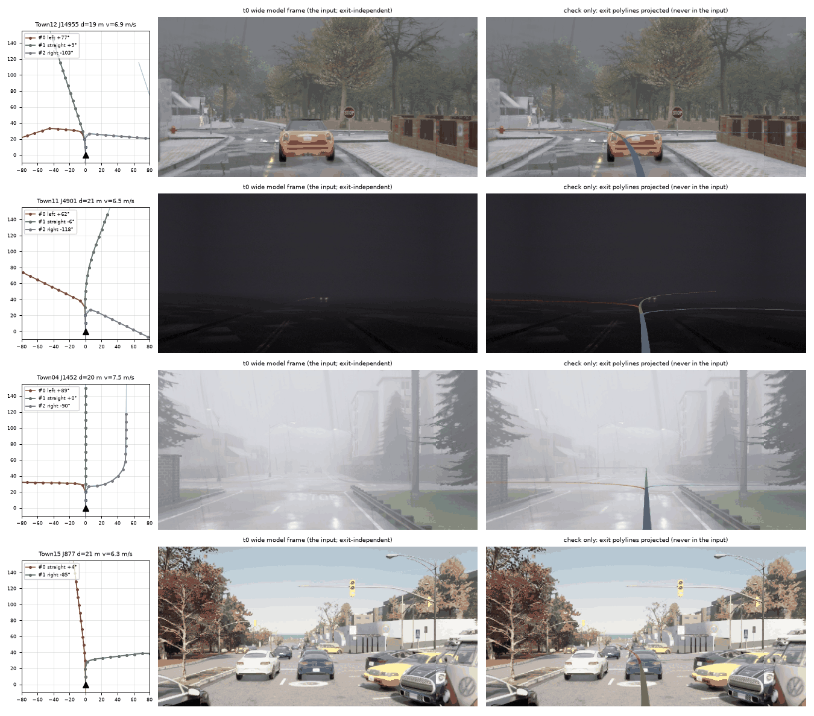

# CARLA counterfactual route-polyline pairs (stage 3): feasibility, cost, plan

Stage 3 of op_route_cmd: the same junction, the same approach images, a different exit, so each exit gets its own clean
route polyline. The image is exit-independent, so the cost is per approach pose, not per exit. This note gives the
map census, the hold-out, the rendering path, a cost estimate and a staged plan. The pilot here is CPU-only: all three
cards were leased by the `jcl` lane, so nothing new was rendered.

## Results

**Feasible and cheap.** After holding out every junction a Bench2Drive route crosses, the B2D towns still have 1 557
junctions with a choice, 4 439 approach roads with at least two exits and 10 628 (approach road, exit) polylines. 1 746
of those roads have 3 exits. The polylines come straight from the map (`carla.Map` built from the xodr, no server; the
census takes 4 s on 4 cores). Rendering is the only GPU cost. The estimate is 0.5 card-hours for 2 000 poses and about
2 card-hours for 10 000 (table below). The render rate is borrowed from other rigs, not measured on this one.

**4+ exits are almost absent in CARLA.** Only 4 approach roads in all 12 towns have 4 exits (all in Town03, at its 5-leg
junction), and there are only 10 u-turn connectors in total. So "third road from the left" exists in CARLA (the third
exit of a 3-exit approach: 2 248 roads), but a 4th or 5th exit, and u-turns, must come from real data or not be trained.

### Map census (script `scripts/carla_topo.py`, raw `carla_topo_summary.json`)

Units:
- **legs**: the junction's distinct outgoing roads.
- **approach road**: (junction, incoming road, direction). Its exits are the union over its lanes; this is the
  navigation-level choice.
- **approach lane**: one incoming lane. Its legal exits are the connectors from that lane.
- The last three columns are after the strict hold-out (junctions on any B2D route).

| town | junctions | with a choice | legs 2/3/4/5+ | approach roads with choice | road exits 2/3/4 | approach lanes | lane legal exits 1/2/3/4 | (lane, exit) polylines | (road, exit) polylines | train roads | train roads 3+ | train polylines |
|---|--:|--:|--|--:|--|--:|--|--:|--:|--:|--:|--:|
| Town01 | 12 | 12 | 0/12/0/0 | 36 | 36/0/0 | 36 | 0/36/0/0 | 72 | 72 | 30 | 0 | 60 |
| Town02 | 8 | 8 | 0/8/0/0 | 24 | 24/0/0 | 24 | 0/24/0/0 | 48 | 48 | 18 | 0 | 36 |
| Town03 | 31 | 25 | 11/14/5/1 | 55 | 31/20/4 | 138 | 70/52/14/2 | 224 | 138 | 42 | 12 | 100 |
| Town04 | 27 | 25 | 3/15/9/0 | 60 | 24/36/0 | 161 | 106/19/36/0 | 252 | 156 | 37 | 16 | 90 |
| Town05 | 21 | 21 | 0/8/13/0 | 72 | 20/52/0 | 150 | 33/116/1/0 | 268 | 196 | 53 | 36 | 142 |
| Town06 | 23 | 12 | 10/3/1/0 | 17 | 17/0/0 | 146 | 137/9/0/0 | 155 | 34 | 16 | 0 | 32 |
| Town07 | 31 | 22 | 9/19/3/0 | 67 | 55/12/0 | 88 | 21/56/11/0 | 166 | 146 | 56 | 4 | 116 |
| Town10HD | 9 | 9 | 0/8/1/0 | 20 | 16/4/0 | 50 | 29/21/0/0 | 71 | 44 | 12 | 0 | 24 |
| Town11 | 174 | 173 | 2/114/57/1 | 575 | 344/231/0 | 580 | 5/344/231/0 | 1 386 | 1 381 | 549 | 211 | 1 309 |
| Town12 | 628 | 591 | 80/298/229/0 | 1 743 | 856/887/0 | 2 473 | 563/1 211/699/0 | 5 082 | 4 373 | 1 398 | 561 | 3 357 |
| Town13 | 774 | 743 | 58/437/259/0 | 2 227 | 1 233/994/0 | 2 864 | 641/1 257/966/0 | 6 053 | 5 448 | 2 133 | 906 | 5 172 |
| Town15 | 99 | 73 | 60/19/2/0 | 106 | 98/8/0 | 272 | 153/119/0/0 | 391 | 220 | 95 | 0 | 190 |
| **total** | **1 837** | **1 714** | 233/955/579/2 | **5 002** | 2 754/2 244/4 | **6 982** | 1 758/3 264/1 958/2 | **14 168** | **12 256** | **4 439** | **1 746** | **10 628** |

- Exit classes over the approach roads with a choice: left 3 909, straight 4 206, right 4 131, u-turn 10. Six
  connectors (Town11 4, Town13 2) could not be walked out of their junction and are dropped.
- **Free approach length.** This is how much clean incoming lane lies upstream of the entry, before the previous
  junction. A pose at distance d with 2 s of history at speed v needs d + 2v metres of it. Of the lanes on roads with a
  choice, 5 785 have >= 20 m, 5 543 have >= 45 m (enough for d = 30 m at 7.5 m/s) and 5 038 have >= 80 m. Town01/02/07
  are the short ones.
- Town11/12/13 hold 92% of the training approach roads. These are Large Maps: tile streaming applies (see doubts).

### Hold-out

A junction is held out as a whole (town, junction id), not per entry lane. `img2_bank.carla_split` drops train samples
only when they share a (map, entry lane) with a test sample, which is weaker. The junction rule is stricter, so
neighbouring entries of a test junction cannot leak.

| held out | junctions | train junctions left | train approach roads | of which 3 exits | train polylines |
|---|--:|--:|--:|--:|--:|
| decision-95 closed-loop routes | 14 | 1 701 | 4 951 | 2 200 | 12 106 |
| img_carla test (60 routes) | 58 | 1 656 | 4 778 | 2 046 | 11 606 |
| img_carla test + dev (78 routes) | 72 | 1 642 | 4 724 | 1 998 | 11 450 |
| **any B2D route (226 traversals of both route files), recommended** | **172** | **1 557** | **4 439** | **1 746** | **10 628** |

Recommendation: use the last row. Every B2D route junction is a potential closed-loop test junction, and the cost is
only 6% of the polylines.

- **The existing 179-junction set** (`runs/op_img_cmd/carla/carla.pkl`, 696 samples) is a subset of those 172
  held-out junctions. It is therefore test-side material: an exit-following eval with ~500 counterfactual polylines can
  be built from it right now (see pilot). It is not training material.
- **The B2D closed-loop logs** (5 489 recordings, 11.2 M ticks, ego pose only, no images) cover the same held-out
  junctions, so they add no training pairs. They are useful for two things: realistic approach speed profiles (for the
  synthetic history below), and the eval side. A re-render of a log means either a full closed-loop re-run with sensors
  (traffic is not reproduced; runs are not deterministic, decision 65) or a camera teleported along the logged ego
  poses in a world without that traffic.

### Pilot (CPU only; figure `../figs/carla_pilot.png`)

What to look at:
- **Left (bird's-eye view, ego frame, x forward up, left on the left):** every exit polyline of the approach road, 16
  points at 10 m, labelled with its index from the left, class and turn angle. The faint line is the dense path.
- **Middle:** the openpilot wide model frame at t0, which is the same input for every exit.
- **Right:** the polylines projected into that frame. This is only a geometry check; the polylines never enter the
  model input.

The projected lines should leave along the ego lane and fan out into the real branches at the junction mouth.
Rows 1-3 are 3-exit approaches (Town12 J14955, Town11 J4901 in fog, Town04 J1452). Row 4 is a 2-exit approach (Town15
J877).

Samples: 4 approach poses from the train split (tag d20, about 20 m before the connector). They give 11 polylines in
4 counterfactual groups. All exits are legal from the ego lane. Per-polyline fields are in `carla_pilot_samples.json`.

The images are the existing op_img_cmd renders: the P4 Waymo-like 3-camera rig, camera 1.806 m above the road. They
are **not** the openpilot rig at 1.22 m, so they are fine for the geometry check but not as fine-tune material.

One flaw shows up. Town04's right exit reaches a T-junction about 50 m later, and the "straightest successor" rule
picks one of two 90-degree options at random. The tail beyond the first junction needs a stated rule (below).

## Cost estimate

**Assumptions.** The openpilot native rig is road + wide, both 1928x1208 every tick, 4.66 MP. Stage C of the runbook
(front3 1600x900, 4.32 MP, 6 servers per card on an RTX 6000D) measured 36.4 renders/s per card. The 5-camera worst case
on a contended card scales to about 20/s for 2 cameras. **Planning range: 20-35 renders/s per card**, 6 servers per card,
about 1 core per server (no route client, no scenario tree).

A pose is 10 history frames on the 5 Hz lattice (t0 - 1.8 s ... t0) plus 2 settle ticks, so 12 renders. Server start
plus map load costs 30-90 s per server per town (Town12/13 at the top). Polylines and the planning step are CPU-only:
under 5 min for 10k poses.

| | 2 000 poses | 10 000 poses | 30 000 poses (all train lanes x 3 d x 2 v) |
|---|--:|--:|--:|
| renders (12 per pose) | 24 k | 120 k | 360 k |
| render card-h at 20-35 /s | 0.19-0.33 | 0.95-1.7 | 2.9-5.0 |
| setup card-h (6 servers x 12 towns, staggered) | ~0.15 | ~0.15 | ~0.15 |
| **total card-h** | **~0.35-0.5** | **~1.1-1.9** | **~3-5** |
| wall on 1 card / 3 cards | ~25 min / ~10 min | ~1.5-2 h / ~40 min | ~4-5 h / ~1.5 h |
| CPU | ~6-8 cores per card | same | same |
| disk, packed model frames (393 KB per frame, history shared by the 3 distances of one approach) | ~6-8 GB | ~30-40 GB | ~90-120 GB |
| trunk bank, if the polyline enters after the vision trunk (2.4 MB per pose; exits share it) | 5 GB | 24 GB | 72 GB |

**Free-roam alternative.** An autopilot ego with cameras on only in the last ~50 m before each junction costs about
the same per pose: ~40 frames per approach for 3 poses, plus spawn/destroy of the camera pair. Rendering continuously
costs about 3x more (~32 frames per pose, 2-4k poses per card-hour). Its history is real (dynamics, stops, traffic)
instead of synthetic.

**GPU now.** All three cards are leased by `jcl` (junction closed loop). The render stage waits for one free card: a
`python -m jevdrive.cl lease op-route-carla --gpus 1` row once `jcl` releases one, or a share of `jcl`'s card if it runs
below its 6 servers.

## Plan and staging

1. **Pose plan** (`carla_pairs_plan.py`, envs/carla, CPU, minutes).
   - Inputs: `carla_topo` training approach roads (strict hold-out) with free length >= d + 2v + 5 m.
   - Per approach road: the lane with the most legal exits, plus the other lanes for a second pass.
   - Distances d in {10, 20, 30} m; speed profiles {stopped, 3 m/s creeping, 7-9 m/s cruise with the decel to reach
     the junction}; weather and time of day from the B2D weather list.
   - Group id = (town, junction, road, lane, d, profile, weather).
   - Per exit: polyline from `carla_topo.walk_path` / `poly_ego`.
   - Tail rule beyond the first junction: keep the lane, else the successor nearest straight, ties broken toward the
     same road id. The tail is the same for every exit only where the paths merge, so it is not a pair confound.
2. **Render smoke** (one server, 20 poses: Town05 + Town12).
   - Teleport mode: no ego vehicle; a camera pair with comma intrinsics (`zeroshot_rigs.OP_FOCAL`) at 1.22 m, level,
     calib rpy 0. History poses run along the lane centreline with the speed profile, lateral noise ±0.3 m and yaw
     noise ±1°.
   - The same packed-frame adapter as the openpilot closed-loop path.
   - Check sheet: horizon rows and height against the openpilot spec, no hood, no tinted glass, Large-Map tiles
     loaded after a teleport (first frame vs settled frame), and the 5 Hz lattice.
   - Measure renders/s and settle ticks needed.
3. **One card, 6 servers, 300 poses.** Measure poses/s and stall/restart rate. Rerun the same 20 poses in free-roam
   mode and compare the frames and the cost, then decide the mode.
4. **Batch: 2 000 poses, then 10 000**, ordered by town and then by a nearest-neighbour tour, inside
   `scripts/tmux_run.sh` + `jevdrive.run.Run`, with DONE / ERROR / STATUS. Output:
   `$DATA_DIR/runs/op_route_cmd/carla/{frames/<approach>.npz, pairs.parquet}`. The splits are registered as
   `b2d/route-carla-{train,dev}` (dev = 10% of training junctions, junction-level), with the 172 held-out junctions
   recorded in the split notes.
5. **Eval side** (optional, cheap): the 179 existing op_img_cmd approaches plus their exit polylines, re-rendered at
   the 1.22 m rig by teleport, as the held-out exit-following test.

Per-sample fields (one row per (pose, exit)):

| field | content |
|---|---|
| `id` | pose id + exit index |
| `group` | pose id; rows of one group share the frames |
| `poly` | (16, 2), ego rear-axle frame, x forward, y left, 0 ... 150 m at 10 m |
| `mask` | (16,) |
| `cls` | left / straight / right / uturn |
| `index_from_left` | among the road's exits (u-turn leftmost) |
| `n_exits` | |
| `angle` | deg, left + |
| `dist` | rear axle to the connector start along the approach |
| `legal` / `lane_change` | whether the ego lane has the connector |
| `exit`, `conn` | road ids |
| `town`, `junction` | |
| `frames` | path + slot range |
| `pose_hist` | (10, 3) |
| `v` | |
| `weather` | |

## Doubts

- **Lane-level vs road-level polyline.** The clean polyline here is the centreline of a legal lane. That is lane-level
  geometry. A navigation SD polyline follows the road and may be off by half a road width; the noise function must
  cover that gap, or the polyline should be snapped to the road reference line. For an exit that is illegal from the ego
  lane, the nearest lane that has it is used (`lane_change`). 1 758 approach lanes have only one legal exit.
- **The rig is the main unknown.** At 1.22 m inside the MKZ, the hood fills 20% of the road frame and the tinted
  windshield darkens the image (`zeroshot_rigs` note); the closed loop therefore uses 1.433 m. Teleport mode with no ego
  vehicle avoids both problems. In free-roam mode the cameras would sit at 1.22 m ahead of the windshield, near the
  bumper (parallax of about 1.5 m forward). The smoke must check this.
- **Teleport history is synthetic.** It is lane-centred kinematics with noise: no pitch on braking, no traffic
  continuity, and TM traffic seen only where it happens to be. openpilot reads motion from the frame history, so a too
  clean history may be a cue. The free-roam comparison in step 3 decides.
- **Coverage.** 4+-exit approaches and u-turns do not exist in CARLA in useful numbers. Large Maps (Town11/12/13)
  dominate, with their limited visual diversity; Town12 is also B2D's training town.
- **Borrowed numbers.** The render rate comes from other rigs, and Large-Map tile streaming after a teleport is
  unmeasured. Both are measured in step 2 before any batch.
