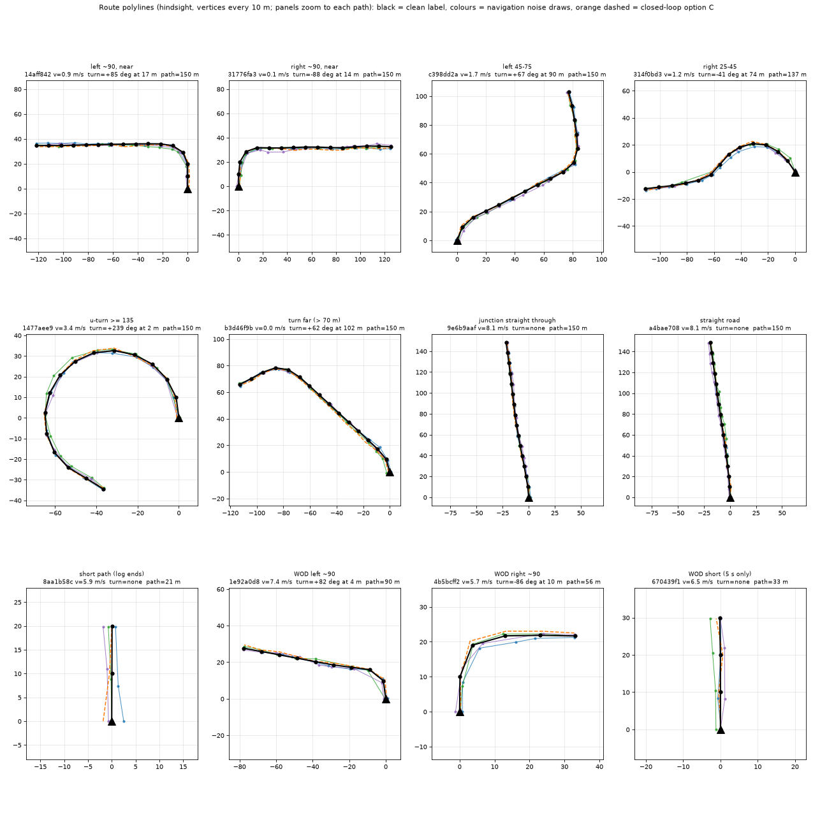
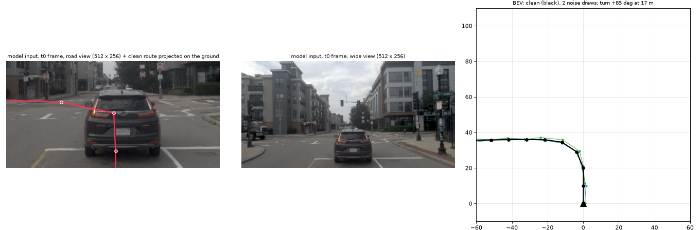

# Route polyline material: counts, format, merge notes (2026-10-04)

Preparation only, nothing trained. CPU only on the box (navtrain 28 s on 32 workers, WOD 12 s on 24). Code: `lib/route_poly.py` (label + noise),
`scripts/route_nav.py`, `scripts/route_wod.py`, `scripts/route_report.py`, `scripts/route_figs.py`; tests `tests/test_route_poly.py`, `tests/test_route_wod.py`.
Raw numbers: `counts.json`, `counts_tables.md`. Figures: [`../figs/route_samples.png`](../figs/route_samples.png), [`../figs/route_input_frame.png`](../figs/route_input_frame.png).

## Counts

A sample = one frame of the pool (navtrain token; WOD-E2E frame with a logged future). "Turn >= 25 deg" = the first **complete** turn on the driven path within 150 m
(curvature > 0.02 /m, i.e. R < 50 m, merged over 8 m gaps; net heading change >= 25 deg; starts > 2 m ahead; a turn the available path ends in the middle of is not counted).
Frames of one turn are strongly correlated: "events" counts runs of consecutive frames with a turn, the effective sample size is closer to it than to the frame count.

| source | samples | logs / sequences | turn >= 25 deg | left / right | turn <= 30 m | turn <= 60 m | events |
|---|---:|---:|---:|---:|---:|---:|---:|
| navtrain (`navsim/navtrain`, all tokens) | 103 288 | 1 192 | **32 269** (31%) | 18 577 / 13 692 | 14 690 | 22 484 | 6 205 |
| navtrain, decision-93 junction frames (branch, >= 2 exit classes, taken known; 2 482 segments) | 11 310 | 744 | **4 713** (42%) | 2 101 / 2 612 | 2 438 | 3 283 | 1 450 |
| WOD-E2E train (`wod/train`) | 415 663 | 2 037 | **52 135** (13%) | 25 210 / 26 925 | 37 076 | 46 360 | 949 |
| WOD-E2E val (`wod/val`; eval only, never train on it) | 106 360 | 479 | 9 799 | 3 903 / 5 896 | 6 391 | 8 372 | 232 |

By turn angle bin (|net heading change|, samples; left / right in brackets):

| source | 25-45 | 45-75 | 75-105 (the 90 deg turn) | 105-135 | >= 135 (U-turn, loops) |
|---|---:|---:|---:|---:|---:|
| navtrain | 3 290 (1 359 / 1 931) | 9 649 (6 478 / 3 171) | 15 085 (7 340 / 7 745) | 1 806 (1 274 / 532) | 2 439 (2 126 / 313) |
| navtrain decision-93 | 437 (144 / 293) | 1 245 (651 / 594) | 2 719 (1 080 / 1 639) | 209 (164 / 45) | 103 (62 / 41) |
| WOD train | 2 244 (984 / 1 260) | 4 892 (2 231 / 2 661) | 42 647 (20 696 / 21 951) | 1 590 (854 / 736) | 762 (445 / 317) |
| WOD val | 801 (429 / 372) | 1 211 (517 / 694) | 7 550 (2 810 / 4 740) | 83 (80 / 3) | 154 (67 / 87) |

Other counts:
- navtrain: 72 284 samples have the full 150 m path (91 097 have >= 50 m, median 150 m); 23 850 are already inside a maneuver at s = 0; 5 494 have a second turn within the horizon.
  Of the 32 269 turn samples, 28 942 lie mostly inside a nuPlan lane connector / intersection (`turn_junction`), 3 327 are road bends of R < 50 m.
  The map finds a connector / intersection on the driven path within the horizon for 96 707 samples (`jct_s`).
- WOD: only 55 180 train frames (13%) have the full 150 m (median 67 m, 5th percentile = 5 s of future only), because the logged future is 5 s per frame; see chaining below.
  Turns concentrate in 608 of 2 037 train sequences (129 of 479 val).
- Junction exits ("third road from the left"): only the navtrain junction frames carry exit counts (`n_exit` of the branching lane within 30 m: straight+right 5 196 frames,
  straight+left 3 408, left+right 2 514, left+straight+right 2 456 of the decision-93 frames); WOD has none (no map).

## Definitions and construction

- **Clean label** (`route_poly.hindsight`): the logged future path in the ego frame at sample time (rear axle, x forward, y left), smoothed (Gaussian 1.5 m, ends extended linearly),
  resampled at **10 m** arc-length vertices up to **150 m**: `poly (16, 2)`, vertex 0 = the ego origin exactly, `pmask (16,)` marks the vertices that exist (path shorter -> padded
  with zeros and masked). `plen` = path length within the horizon. No time cap on the future: the path is "where the car went", the wait at a light is irrelevant.
- **navtrain**: poses of the same OpenScene log at 2 Hz from the token onwards until 160 m of path, the log end or 90 s; a gap in the 2 Hz clock ends the path (234 of the 1 192 logs have gaps).
  Map extras from nuPlan (never part of a model input): `jct_s` (arc length to the first connector / intersection on the driven path), `turn_junction`, and from the decision-93
  inventory `jct_dist`, `n_exit`, `taken_cls`, `status` (branch / in_junction / no_junction_30m).
- **WOD-E2E**: 5 s of future per frame is too short, so frames are chained: frame f -> f+25 (2.5 s) -> f+50 ..., each link a rigid 2D fit (rotation + translation) between the 20 positions
  that both frames log at the same absolute 4 Hz instants. Up to 8 links (22.5 s), `dur` = usable seconds (median 12.5, 5th percentile 5). Link check: 458 824 of 458 829 candidate links have
  rms residual <= 0.3 m (median 1 mm, p99.9 11 cm); independent check of the composition (chained position at 5 s against the logged `future[19]`, 30 000 frames): median 1 mm, p99 7.6 cm, max 0.40 m.
  Map-free: `jct_s` / `jct_dist` = nan, `n_exit` = -1, `turn_junction` = False (a bend counts as a turn).
- **Splits**: `route_nav.py` asserts that every token is in `navsim/navtrain` and that it is disjoint from `navsim/navtest` and `navsim/navhard_two_stage`; `route_wod.py` reads `wod/train` + `wod/val`
  only (`wod/test` has no future and is asserted disjoint). Run dirs record the split ids. Every row keeps its split (`split`: navtrain / train / val) and `cluster` (log / sequence), so the trainer
  applies its own carve: op_adapt_H's tables already hold `split` train / dev per row (navsim/op-adapt-h-nav-{train,dev}, wod/r2-{train,dev}).
- **Sanity**: map-derived `taken_cls` of the decision-93 frames against the sign of the hindsight turn (left / right frames whose first turn starts within `jct_dist + 40 m`): 2 370 frames, sign agrees 92.9%;
  86.6% of the 5 390 `straight`-taken frames have no turn >= 25 deg starting within 60 m. The figure shows 12 stratified samples (9 navtrain, 3 WOD) and the projection onto the model's road image.

## Figures

What to look at (`route_samples.png`): 12 stratified frames (9 navtrain, 3 WOD; one per category named in the panel title), each panel zoomed to its path, ego at the origin, x to the right,
y forward. Black = the clean label (vertices every 10 m); the three coloured lines are draws of the default navigation noise, the orange dashed line a draw of the closed-loop option C. Check that
the noise stays a believable map-matching error (about 1 m lateral, smooth along the route, a skipped vertex now and then) and never changes which exit is meant; the last row shows masking when the logged
future is short (log end, WOD 5 s).

What to look at (`route_input_frame.png`): a navtrain frame that waits at an intersection with a left turn 17 m ahead. Left: the road view of the t0 frame as the model sees it (512 x 256) with
the clean polyline projected onto the ground plane (the line turns left at the intersection mouth as the car will); middle: the wide view; right: the same sample in BEV with two noise draws.
The projection is a geometry check only; the polyline is a separate input, nothing is drawn into the image.

## Where the data is (box, `$DATA_DIR` = `/root/autodl-tmp/ujs`; big arrays stay there, docs/storage.md)

| what | path |
|---|---|
| navtrain labels | `processed/op_route_cmd/navtrain/route.npz` (103 288 rows, 65 MB) |
| WOD-E2E labels | `processed/op_route_cmd/wod/route.npz` (522 023 rows, 346 MB) |
| run dirs / logs | `runs/op_route_cmd/{navtrain,wod,carla_topo,carla_pilot}/<ts>/` |
| negatives sample | repo: `results/negatives_sample.{npz,csv}` (small) |
| CARLA | no data yet; plan in `carla_pairs_plan.md` |

Commands (box): `scripts/tmux_run.sh route_nav experiments/op_route_cmd/scripts/run_nav.sh 32`, `scripts/tmux_run.sh route_wod experiments/op_route_cmd/scripts/run_wod.sh 24`, then
`python experiments/op_route_cmd/scripts/route_report.py` (envs/jevdrive). Reruns are deterministic (the navtrain labeller was rerun after a refactor: identical arrays).

## Format notes for the merge

**One sidecar per source, keyed by the sample `id`** of op_adapt_H's tables (`tab["id"]`: navtrain token, WOD `<sequence>-<frame:03d>`, CARLA frame name), not a parallel dataset.
`route.npz` fields, all aligned row by row (n rows):

| field | shape / dtype | meaning |
|---|---|---|
| `id`, `split`, `cluster`, `scene`, `cmd` | str | key; navtrain / train / val; log or sequence; logged driving command (navtrain) or WOD intent |
| `v0` | f32 | t0 speed, m/s |
| `poly` | (n, 16, 2) f32 | clean polyline, ego rear-axle frame, x forward, y left, vertices at s = 0, 10 .. 150 m |
| `pmask` | (n, 16) bool | vertex exists |
| `plen`, `dur` | f32 | path length within the horizon (m); usable future seconds (WOD only) |
| `turn_deg`, `turn_s`, `turn_end_s`, `turn_rmin` | f32 | first complete turn >= 25 deg ahead: net heading change (left +), start / end arc length, minimum radius; nan if none |
| `n_turn`, `in_turn`, `max_turn_deg` | i16 / bool / f32 | turns >= 25 deg within the horizon; a maneuver is active at s = 0; largest complete maneuver >= 8 deg |
| `jct_s`, `turn_junction` | f32 / bool | navtrain only (nan / False in WOD): next connector on the path; the turn lies in a junction |
| `jct_dist`, `n_exit`, `taken_cls`, `status` | f32 / i16 / str | navtrain only: decision-93 branching point within 30 m (nan / -1 / "" otherwise) |

Reading it from a trainer: `from route_poly import attach` (`sys.path.insert(0, REPO / "lib")`), then
`r = attach(DATA/"processed/op_route_cmd/navtrain/route.npz", tab["id"])` gives arrays aligned to the table rows plus `has_route` (rows without a route: `pmask` all False, nan floats).
In op_adapt_H's `Samples.__init__` that is one line after `self.t = ...` (`self.route = attach(...)` per domain, nav -> navtrain, wod -> wod); coverage of the existing pools is
100% (nav 2 400 rows, 748 with a turn; wod 2 780, 351 with a turn). CARLA rows (`carla` pool, `lcarla`) have no route yet (stage 3). op_img_cmd's `geom/ft.pkl` and the `img-ft-{train,dev}` pool are
navtrain tokens, so they attach the same way.

Train-time noise (not stored): `route_poly.noise_polyline(poly, pmask, rng, NavNoise(...)) -> (poly (16, 2), mask (16,))`, per sample, batch helper `noise_batch`.
- Default `NavNoise`: lateral offset sd 1 m, AR(1) along the route with 30 m correlation length (smooth, one value per vertex), vertices every 10 m, along-track jitter sd 1.5 m, 5% of the interior
  vertices dropped (neighbours joined by a straight segment), the first vertex stays at the ego origin (moves laterally only). Every parameter is a field.
- `C_OPTION = NavNoise(along=0, p_drop=0)` is the closed-loop option C of `turn_calibration_options.py`; `route_poly.noisy_road` (the function that `turn_calibration_sparse.py` now imports
  instead of defining it) is bit-identical to the old one (test `test_option_c_bit_identical_to_the_original` against a frozen copy; `turn_calibration_options.py` / `junction_cl_report.py` import unchanged).
  Open and closed loop therefore share one definition; the training default additionally jitters / drops.
- Use a fresh draw per sample per epoch; set the rng from the sample index for reproducible evals. Statistics are unit-tested (lateral sd 1.0, correlation exp(-10/30), jitter sd, drop rate).
- Do not noise the loss target; the target stays the logged future (or the teacher plan), the clean polyline is only for diagnostics and for CARLA / eval label geometry.

Notes for whoever fixes the model-side encoding (not decided here): 16 x 2 floats + mask is the whole input; polylines are long-range (150 m), so normalise by 150 m or feed
(x, y) in metres through the existing intent-adapter style token path; the polyline is exit-agnostic, so the same image with different polylines is the positive pair (CARLA stage 3); vertex 0 is always
(0, 0) (before noise) and carries no information, the ego heading is x forward by definition. The logged driving command of navtrain (`cmd`) is a different, coarser signal and is not needed.

## Doubts

- **WOD intent vs hindsight.** WOD's `GO_STRAIGHT` intent coexists with a hindsight 90 deg turn: of the 32 265 frames with a turn starting within 15 m, GO_STRAIGHT frames turn left 12 275 and right 12 528 times;
  GO_LEFT agrees (3 759 left vs 824 right), GO_RIGHT agrees (2 474 right vs 405 left). The geometry of the 12 inspected GO_STRAIGHT cases is a clean 90 deg turn (chain residuals are millimetres), so the intent label
  is the coarse one, not the polyline. Do not mix WOD `intent` with the polyline as two commands without a rule. (Not investigated further whether WOD intents are by design the lane-level command of the next 5 s.)
- **WOD horizon.** Median path 67 m; the 150 m horizon is mostly masked in slow urban scenes. Only the 2.5 s link chain gets beyond 5 s; links across a stopped phase assume an unrotated car (spread < 0.5 m).
  WOD turns are geometric (R < 50 m bends count), no map, no exit count.
- **Turn threshold.** R < 50 m / >= 25 deg is the closed-loop `maneuvers` definition; wide slow bends are not turns, roundabout loops produce > 180 deg (U-turn bin 2 439 navtrain samples are mostly loops / ramps, 103 of them are in the decision-93 junction set).
- **Class balance.** The 90 deg bin dominates (47% navtrain, 82% WOD train); 25-45 deg is the thin bin (3 290 / 2 244). Right turns are rarer than left in navtrain (42%), and nearly all U-turns are left (RHT).
- **Not independent.** 6 205 / 949 events behind 32 k / 52 k frames; WOD turn frames sit in 608 sequences. Count events, not frames, when comparing against decision-93 style segment numbers.
- **Junction vs bend** is only known for navtrain (`turn_junction`; "mostly inside a connector or intersection polygon", nuPlan intersection polygons are generous).
- `jct_dist` / `n_exit` use the decision-93 definition (branching lane within 30 m of the ego lane, exits by connector heading class); lane-change exits are not included.
- Singapore logs (left-hand traffic) are inside navtrain; the polyline is geometry, so left-hand traffic only shows in which side the oncoming lane is (negatives) and in `tc` of the sample table.
