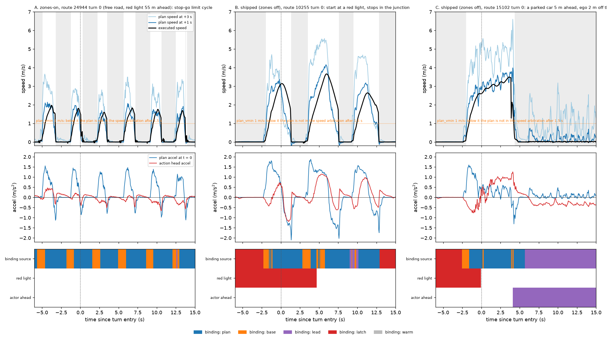
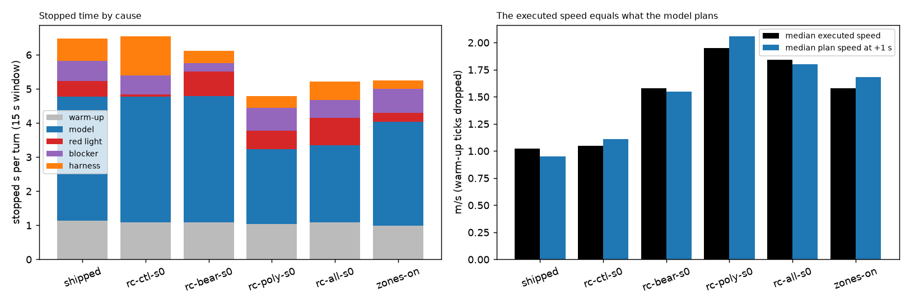

# Why the B2D 25-turn runs crawl (decision 128 point 5)

Existing logs only (ticks.jsonl + plans.jsonl of the 25-turn runs: shipped, rc-ctl / bear / poly / all, and the zones-on shipped arm `ol-s2`), CPU analysis, no new run.
Code: `scripts/crawl_dump.py` (box, joins ticks and plans per turn window), `scripts/crawl.py` (attribution), `scripts/crawl_fig.py`, `scripts/crawl_route.py` (whole-route control).
Data: `results/crawl.json` (per interval and per arm), `results/crawl_route.json`. Window = entry .. +15 s of each entered turn (as split.md); stopped = v < 0.3 m/s; a stopped interval is a run >= 1 s.

## Result

**The stops are the model's own plan. The "median ~1 m/s" is not a crawl: speed is bimodal (stopped 40%, moving at 1.3-5 m/s 45%) and the median falls on the edge.** In every arm the executed speed equals what the plan head asks for (median executed vs plan speed at +1 s: shipped 1.02 / 0.95, rc-bear 1.58 / 1.55, zones-on 1.58 / 1.68 m/s), and 70-90% of the stopped time is the plan speed at +3 s < 1 m/s with the action head accel near 0 (median +0.04 m/s^2 over the stops; -0.5 .. -1.3 in the second before a stop). Harness rules shorten the stops, add a limit cycle, and cost 0.2-1.2 s per turn; they do not create the stopping. Zones-on crawls the same, so it is not a lateral-failure artefact either.

Figure `figs/crawl_cases.png`: plan speed (+1 s, +3 s), executed speed, plan accel and action accel, and the binding source of the speed arbitration (the min over base / plan / lead / latch) for three turns. Look at A: six stops of ~2 s every ~3.5 s on a free road, plan speed collapsing while the car rolls at 1.5-2 m/s, action accel going negative before each stop; at each stop the base profile launches the car (orange) and the plan resumes binding once v >= 1 m/s.

Figure `figs/crawl_budget.png`: per entered turn, stopped seconds by cause and median executed vs plan speed. Look at the blue block (model) in every arm and at the black / blue bars matching.

## Stopped seconds per entered turn (15 s window, intervals >= 1 s)

| arm | turns entered | stopped share of ticks | of which 5 s static warm-up | median v, no warm-up | median plan v at +1 s | s per turn: warm-up / model / red light / blocker / harness |
|---|--:|--:|--:|--:|--:|---|
| shipped | 20 | 0.455 | 0.066 | 1.02 | 0.95 | 1.1 / 3.6 / 0.5 / 0.6 / 0.7 |
| rc-ctl-s0 | 21 | 0.447 | 0.063 | 1.05 | 1.11 | 1.1 / 3.7 / 0.1 / 0.6 / 1.2 |
| rc-bear-s0 | 21 | 0.438 | 0.065 | 1.58 | 1.55 | 1.1 / 3.7 / 0.7 / 0.2 / 0.4 |
| rc-poly-s0 | 22 | 0.337 | 0.062 | 1.95 | 2.06 | 1.0 / 2.2 / 0.5 / 0.7 / 0.3 |
| rc-all-s0 | 21 | 0.371 | 0.065 | 1.84 | 1.80 | 1.1 / 2.3 / 0.8 / 0.5 / 0.5 |
| zones-on (shipped) | 23 | 0.366 | 0.059 | 1.58 | 1.68 | 1.0 / 3.0 / 0.3 / 0.7 / 0.2 |

Cause per interval, first match on > 50% of its ticks: warm-up (reason no_trajectory, the 5 s static start: 4 turns per arm enter inside it, 1 s per turn); blocker (ground-truth lead gap < 10 m at v < 1.5, pedestrian within 8 m, or an actor within 8 m ahead and 2 m aside); red light (ground-truth light red / yellow within -5 .. 30 m of the line; the harness ignores lights, the model does not); model (plan speed at +3 s < 1 m/s); harness (plan wants to go, car stopped). Shipped: 48 intervals = model 32 (73 s), harness 6 (13 s), blocker 2 (12 s), red light 4 (9 s), warm-up 4 (23 s).

## Candidate causes

1. **Model plan / action says slow or stop: yes, dominant.** Binding source in the stopped ticks (shipped): plan 1176, lead 463, base 456, latch 243 of ~2340. Plan speed at +1 s ~0 and action accel ~0 while stopped; plan accel (+1.5) is stiffer than the action head accel (+0.3 .. +1.0) in the launches (panel A, B), the decision 119 pattern. Stops come after rolling: 31 of 32 shipped model stops were preceded by >= 1.5 m/s in the previous 3 s (13 by >= 2.5 m/s), i.e. the plan collapses while moving, it is not a low-speed trap. 60-70% of stops end with the plan itself asking to go (plan speed at +3 s >= 1 m/s on the last 0.25 s). Stop length median 1.95 s, spacing of onsets 4-6 s. Ground truth around the model-only stops: 25-30% of that time has no light, no actor within 15 m, no lead within 30 m (free road); the rest has some actor within 15 m (about half), a light within 80 m or a lead within 30 m. Not specific to junctions or desire: stopped share 0.39 in junction ticks vs 0.45 outside, 0.39 with the route desire pulse vs 0.48 without (shipped); rc-bear 0.39 / 0.41 and 0.39 / 0.41.
2. **Harness longitudinal: shortens and re-launches, does not cause.**
   - Plan speed arbitration only binds when v >= `plan_vmin` (1.0 m/s) or within 1.5 s of last binding. A stop therefore lasts ~1.5-2 s, then the base governor (cruise 8 m/s, amax 1.5) launches the car against a plan that still says stop in 30-40% of stops (shipped 10 of 25, zones-on 11 of 33 with plan still ~0 at launch); once v >= 1 the plan binds again and the car re-stops or follows it. This is the limit cycle in panel A (period ~3.5 s). It is a harness rule (plan_vmin + binding_t), declared as our longitudinal scheduler.
   - Latch (plan-intent stop held until release): only 5-16 episodes per arm, median 2.8-3.8 s, 80% end by the 5 s timeout; in 19 of 558 latched ticks (shipped) the plan wanted to go. Holds time, never decides it (shipped 243 ticks of 2340 stopped).
   - `coast_v` 2.5: not involved (it only converts a brake request while the profile moves). Set speed 8 m/s and the curvature cap (alat 2 -> 3.6 m/s at R 6.4): never binding at a stop.
   - Controller `invalid_motion` / `stationary_trajectory`: reason strings of the hold, downstream of the arbitrated zero path. One real quirk: 24758 turn 0 (three arms) rolls back at v = -0.17 m/s for 4.4 s after the stop with reason invalid_motion (the "harness" interval, 6 of 48 in shipped are of this and launch types).
   - Traffic-light timer resume: not involved (tl_stop off, red-light stops are 0.1-0.8 s per turn, shipped route 10255 even launches through a red at turn entry).
3. **Lead-vehicle logic**: lead binds 463 of the stopped ticks (shipped), 83-90% of the lead-bound ticks have a real vehicle ahead (ground truth gap < 30 m or actor within 20 m ahead and 3 m aside); ghost leads (lead prob > 0.5, nothing there) are 5-20% of lead stops. Case C: a parked car 4.9 m ahead at the junction exit, ego 2 m off the route; the model sees it (lead prob 0.6-0.9) and the plan flickers go / stop. A real blocker, 0.2-0.7 s per turn (2 s in shipped 15102 turn 0 alone).
4. **Traffic blocking**: 0.2-0.7 s per turn (blocker), plus the actor-within-15 m context of ~half of the model stops; the log has no actor trajectories, so a yield the model learned (cross traffic) cannot be told from hesitation. Scenario junction rules are not in the harness (CARLA traffic manager only moves other actors).

## Same junctions, zones on, and HUGSIM

- Zones-on (`ol-s2`, route-steered turns, the car stays on the lane, dev < 1.5 m in 100% of its model stops): stopped share 0.37 vs 0.46 shipped zones-off, median speed 1.58 vs 1.02 m/s, model-stop seconds 3.0 vs 3.6 per turn, stop-go period ~4 s. It also crawls; lateral failure explains at most ~0.5 s of it.
- Whole route (control, `results/crawl_route.json`): stopped share by time since the start, shipped 0.49 (< 35 s) -> 0.92 (> 120 s); zones-on 0.39 -> 0.84. After the turn failure the car sits stuck, so only the early bins are comparable; they say the same as the windows (rc arms 0.34-0.44 in the first 35 s). Junction ticks vs road ticks give no difference.
- Decision 124 HUGSIM has no junction windows and a different harness (action-based lateral, iLQR / action accel longitudinal, no plan-min arbitration, no latch), so no like-for-like number exists. The signature matches decision 119's HUGSIM diagnosis: at standstill plan speed ~0.01 m/s and action accel median -0.05 .. 0.05, "the model wants to stop". Not re-measured.

## Caveats

Single seed per arm, 20-23 entered turns; intervals are logged-plan attributions, not counterfactuals: the plan responds to the car's own motion, so "the model wants to stop" is what the closed loop produced under this harness (plan_vmin / launch rule included). The 25-30% of model stops with nothing in ground truth could still be a legitimate yield (no actor trajectories logged). No confirming run: all three cards were leased by other lanes (`op-route-ft-desire-off`, `rft-pre`) at the time.

## Smallest test of the harness rule

Arm `plan_vmin = 0` (plan always in the arbitration; one config key under `arb`, no code change) on routes 24944, 10255, 26153 (3 routes, zones off, shipped, seed 2), readout: stopped share and number of stop-go cycles in the window against this table. Pre-registered reading: if the launches against the plan were what keeps the loop alive, stops lengthen (the model holds as long as it wants) and the cycle disappears; if stopped share falls, the model's stop wish was self-induced by the base launch. A route-aware floor on the plan stop (ignore plan stops when no light / actor is in the way) is a different, privileged per-board trick and would have to be labelled.

## Confirming run: `plan_vmin = 0` (2026-10-05)

Shipped, B2D `spec`, zones off, seed 2, routes 24944 / 10255 / 26153, one config key (`DRIVE_ARGS` += `"plan_vmin": 0`; arb in all three attempts shows it). Lane `scripts/vmin_lane.py`, readout `scripts/crawl_dump.py --arms shipped,vmin0 --routes ...` + `scripts/vmin_report.py`, data `results/vmin0.json`. Baseline = the existing guard shipped units on the same three routes (same config: spec, zones off, aligned camera, seed 2, desire on). One run, one seed, 3 routes.

| arm | turns entered (of 5 labelled) | stopped share, 15 s turn windows | stop-go cycles per entered turn | stop length median / max | took exit |
|---|--:|--:|--:|--:|--:|
| baseline (plan_vmin 1.0) | 3 | 0.54 | 3.3 (5, 3, 2) | 2.1 / 5.5 s | 0 of 3 |
| `plan_vmin = 0` | **0** | n/a | n/a | n/a | 0 of 0 |

Whole attempt (the vmin0 cars never reach a turn window, so this is the only comparable view): vmin0 stopped share 0.98 / 0.93 / 0.94 over 67-70 s per route (24944 / 10255 / 26153), path length 2.3 / 13.2 / 8.1 m, max speed 1.9 / 4.1 / 2.5 m/s (all of it in the 5 s warm-up and the first seconds after). After that v = 0.0 for the rest of the route (reason `stationary_trajectory` / `stop_hold`), never one launch. Runs ended `finished` with no turn entered.

Reading against the pre-registered branches: the first one, stops lengthen and the cycle disappears, holds in the extreme. With the plan always in the arbitration, the model's stop wish is never overridden, and it does not release: a standing car sees a standing scene, plan speed stays ~0, and the stop lasts the whole route (>60 s against 2 s). The second branch (stopped share falls, the stop wish was induced by the base launch) is not supported. So the base launch at `plan_vmin` is what produces every move after the first stop; the limit cycle in the 25-turn crawl is the harness rule re-starting a car that the model would otherwise leave parked. This strengthens the main reading: the model's plan is the stopper (it holds indefinitely once the harness stops overriding it), and the harness rule adds motion, not stopping. It also means the crawl is not an artefact of the launch rule that a different `plan_vmin` could remove; removing the rule gives a parked car.

Caveats: 3 routes, 1 seed; in the baseline the cycle starts only after rolling >= 1 m/s, here the car is stopped from the early warm-up on, so the two arms differ from the first seconds on, not only at the turns. A route-aware floor on the plan stop is still the per-board trick named above and is not tested.
