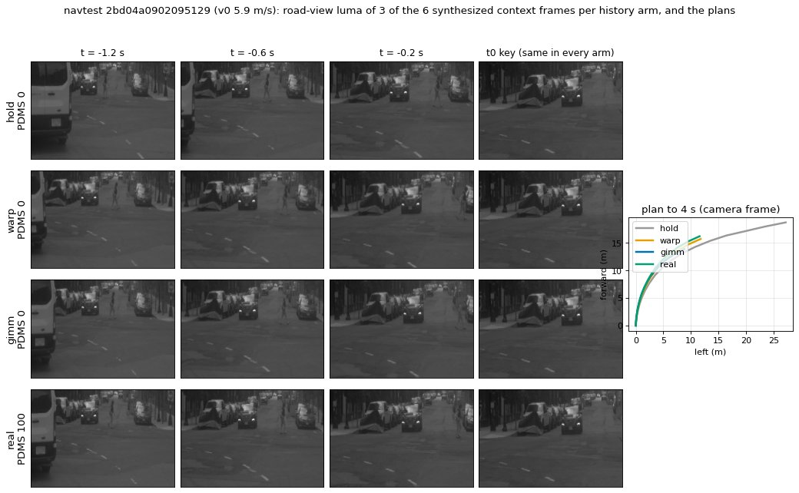

# History-frame quality: does the synthesized history limit openpilot on NAVSIM? (lane C, 2026-10-04)

Pre-registration: [plans/2026-10-04-history-quality-prereg.md](../plans/2026-10-04-history-quality-prereg.md), with addendum 1
(sample extended from 504 to 1 500 tokens after reading only real − gimm on the 504; written before the extension was scored).
Numbers: [history_quality/results.json](history_quality/results.json) (pooled, primary), [history_quality/results_n504.json](history_quality/results_n504.json) (first look).
Code: `scripts/hq_real.py` (fetch + render), `hq_fetch.sh` / `hq_fetch2.sh`, `hq_chain.sh`, `hq_report.py`; the `rotL` / `rotR`
probe is in `jevdrive.op_interp.align_history`.

## Answer
- **The real 10 Hz history adds +0.51 [−0.51, +1.54] PDMS over the shipped GIMM history** (navtest subset, n 1 499, 78 logs;
  log-cluster CI [−0.95, +2.01]). By the pre-registered line this is *small / undetermined*: not "limits" (needs ≥ +1.0 with CI
  lower > 0), and 1 point is not ruled out. GIMM recovers 98% of the hold → real gap (WOD: 89%); warp 87%.
- The real history changes the plan's *shape*, not its score: EP +2.95, DAC −1.73. Plans get faster (pv0 / v 0.862 vs 0.818,
  paired −0.046 [−0.050, −0.041] for GIMM) and leave the drivable area more often. GIMM's smooth flow under-reads the ego motion,
  and the slower plan happens to suit the tight NAVSIM scoring (same trade as decision 104 point 7 / point 9).
- Synthetic history inflates openpilot's history-yaw following a little: G at 3–8 m/s is 6.2° with GIMM and 4.4° with real
  frames (+1.8 [+1.5, +2.2]), below the pre-registered 2° line for "amplifies". On navhard stage 1 (n 161 in that bin) +3.0 [+2.1, +4.0].
- No deployable interpolator was screened: the pre-registered gate (H1 "limits") was not met, so C1 (GIMM at CAM_F0 resolution)
  and the navtest / navhard full runs of a chosen arm were not run. Shipped GIMM stays.

## Ladder (navtest subset S_nt+, n 1 499 tokens, 78 logs, official v1 PDMS)

| history arm (6 context frames) | PDMS | NC | DAC | EP | TTC | C | road / wide PSNR vs real (dB) |
|:--|--:|--:|--:|--:|--:|--:|:--|
| hold (previous key) | 54.18 | 79.49 | 77.79 | 58.28 | 67.18 | 70.45 | 21.9 / 20.6 |
| CPU ego-motion warp (true height) | 80.60 | 97.16 | 94.53 | 68.37 | 93.60 | 100 | 25.7 / 24.2 |
| GIMM (shipped) | 83.97 | 98.07 | 95.53 | 73.32 | 94.60 | 100 | 28.0 / 26.9 |
| real nuPlan 10 Hz CAM_F0 | 84.48 | 97.87 | 93.80 | 76.27 | 95.13 | 100 | – |

| paired delta | PDMS [token CI] | [log-cluster CI] | DAC / EP |
|:--|:--|:--|:--|
| **real − GIMM** | **+0.51 [−0.51, +1.54]** | [−0.95, +2.01] | −1.73 / +2.95 |
| GIMM − warp | +3.37 [+2.25, +4.47] | [+2.23, +4.50] | +1.00 / +4.95 |
| real − warp | +3.88 [+2.76, +5.00] | [+2.57, +5.24] | −0.73 / +7.90 |
| warp − hold | +26.42 [+23.96, +28.89] | [+22.60, +30.08] | |
| GIMM − hold | +29.78 [+27.49, +32.09] | | |

First look (504 tokens, 26 logs; included in the pooled set): real − GIMM +1.23 [−0.50, +2.95], GIMM − warp +2.92 [+1.17, +4.67].
GIMM − warp has the same sign as decision 104 point 9 on navtrain (+1.83).

real − GIMM by slice (pooled): stop +2.26 [+0.04, +4.58] (n 123), 0.5–3 m/s +1.48 [−0.13, +3.09], 3–8 m/s +0.80 [−0.91, +2.46],
> 8 m/s −2.04 [−4.41, +0.20]; straight +1.43 [+0.52, +2.30] (n 1 020), left −0.23 [−3.86, +3.30], right −3.02 [−6.92, +0.69].
Real history helps at low speed and on straight roads (more progress) and costs at high speed and in turns (more off-road): the
faster plan meets the tracker lag and the narrow scoring map (decision 112's L and M classes).

## openpilot readouts (pooled)

| arm | plan speed pv0 / v (v > 3, median) | lane-width ratio (model / map, median) | plan drift vs real at 4 s (mean / median, m) | heading diff vs real at 3 s (deg) |
|:--|--:|--:|--:|--:|
| hold | 1.70 | 0.669 | 15.3 / 11.3 | 5.1 |
| warp | 0.842 | 0.660 | 2.47 / 1.60 | 1.49 |
| GIMM | 0.818 | 0.664 | 2.19 / 1.71 | 1.78 |
| real | 0.862 | 0.665 | – | – |

- Lane width is ~0.66 in every arm: the camera-height scale error of decision 104 does not depend on the history.
- History-yaw gain |G| (deg of planned heading at 3 s per ±10 deg/s injected yaw, decision 92's E1; the plan yaw is clockwise, so
  the raw G is negative and the table shows its magnitude):

| speed bin | n | warp | GIMM | real | GIMM − real |
|:--|--:|--:|--:|--:|:--|
| stop | 123 | 19.6 | 20.5 | 21.2 | −0.65 [−0.95, −0.37] |
| 0.5–3 m/s | 337 | 13.6 | 14.8 | 14.3 | +0.53 [+0.23, +0.86] |
| 3–8 m/s | 743 | 5.2 | 6.2 | 4.4 | **+1.81 [+1.47, +2.18]** |
| > 8 m/s | 296 | 0.9 | 1.4 | 0.8 | +0.58 [+0.38, +0.82] |

  Decision 92 saw navtrain mid-speed G (GIMM) at ~2× WOD (8.2 vs 2.9). With real NAVSIM frames the mid-speed G is 4.4: GIMM
  explains about a third of that gap, the rest is domain or sample. The stop and slow-roll G (14–21°) is the model's own and is
  the same with real history.

## navhard
- **Stage 1** (real scenes, 302 stage-1 tokens of the same 78 logs; plan readouts only, no subset score): GIMM vs real plan drift
  2.5 m at 4 s, heading 2.9°; speed ratio 0.795 vs 0.847; mid-speed |G| 9.1 vs 6.1 (+3.0 [+2.1, +4.0]). Synthetic history matters
  more on navhard's stage-1 scenes than on navtest, in the yaw-following sense.
- **Stage 2 (question 3)**: each synthetic scene ships only four 2 Hz 3DGS renders along its synthetic history
  (`synthetic_scene_pickles`; neighbouring synthetic scenes reuse render frames), and the devkit has no renderer. What we can
  change: how the six context frames are made from those four renders (hold / warp / GIMM / any interpolator) and any input
  transform of the renders (e.g. decision 94's rot0 + selector). What we cannot: render quality, the 2 Hz rate, the synthetic
  trajectory itself. A real-history arm does not exist there. Given the navtest result (+0.5, and a speed / off-road trade rather
  than a gain), a better interpolator is not expected to move stage 2 by more than about a point; the stage-2 lever remains
  the history *rotation* (decision 94, 112: 32% of native DAC failures pass without it).

## Checks
- nuPlan v1.1 CAM_F0 is 10 Hz (100 ms). The 40 sampled t0 keyframes in the nuPlan archive are byte-identical to the OpenScene
  copies (both rounds). Context-frame time error vs t0 − 0.2k: ≤ 0.5 ms. Key timing: all within 0.5 ms except one token
  (09779eb483435cab: OpenScene's −1.5 / −1.0 keys are the images at −1.0 / −0.5 s), kept as is.
- 28 of the 1 519 drawn navtest tokens were dropped (a needed frame missing from the tar index); 1 499 scored in all four arms.
- GIMM rows copied from `lb_navtest/gimm.npy` reproduce the shipped plans exactly (max difference 0.000 m).
- Data: 1.9 GB of CAM_F0 JPEGs fetched by byte range through the box's proxy (`$DATA_DIR/runs/op_lb/hq/jpg`); nothing else of
  nuPlan was downloaded.

## Review sheet

*What to look at: one navtest token (the moving token with the largest real − GIMM gain, so the extreme case, not a typical
one), left turn at 5.9 m/s. Rows are the four history arms, columns three of the six context frames and the t0 key, which is the
same in every arm. hold repeats the previous key, so the scene jumps every 0.5 s; warp and GIMM
are smooth and close to real at this size (PSNR 25.7 / 28.0 dB on average). On the right, real's plan goes a little further
than GIMM's and warp's along the same turn; hold's plan runs away. This is the speed / progress difference the table shows on average.*

## Limits
- Subset of navtest (1 499 of 12 146 tokens, 78 of 147 logs), single model (native Cinque), single run; the real arm is a
  diagnostic upper bound that uses data the benchmark does not give and is not a submittable arm.
- The pooled sample contains the 504 tokens already looked at (addendum 1).
- No navtrain screen: the gate for a deployable candidate was not met; navtrain real frames (trainval archives) were not fetched.
