# navhard stage-2 off-road diagnosis

Definitions: [../../plans/2026-10-03-navhard-offroad-diagnosis-plan.md](../../plans/2026-10-03-navhard-offroad-diagnosis-plan.md). Tables: `tables/`, raw numbers: `numbers.json`, `counterfactuals.json`, `gains.json`, `gain_navtest.json`, `gain_navhard.json`, `camera_summary.json`. Written by main from the executor's final report (the executor could not write this file); numbers are the executor's, the harness reproduces the official combined scores (native 33.33, N4 36.07). Conclusions in Chinese: research/decisions/088.md.

## Output path
openpilot Cinque emits one plan (single Gaussian, 33 knots at t = 10 (i/32)^2 s, position / velocity / acceleration / orientation / orientation rate, camera frame). We take x, y, yaw, convert to the rear axle and interpolate to NAVSIM's 8 poses at 0.5-4.0 s; the plan's action (curvature) head is not used. The devkit's LQR + bicycle tracks the 8 poses for 4 s with no replanning. The native model runs with desire off on all 5 912 navhard tokens: the route command never reaches it. N4 picks among 1 024 anchors plus 22 scaled copies of the native plan.

## Wrong direction (case 01) is a class driven by the history's ego motion
The right turn is in the raw plan, not introduced by the tracker; sign and frame conventions check out. Both model inputs come from CAM_F0 only (no side cameras); a 1-2 degree yaw change of the virtual camera does not remove the turn. Removing the rotation from the four history frames does.

| native, 312 opposite-side stage-2 tokens | still opposite | DAC pass |
|:--|--:|--:|
| base | 100% | 46.8% |
| history rotation removed | 15% | 71.8% |
| history mirrored | 7% | 60.3% |
| command-matching desire pulse | 75-84% | no gain |
| wide input blanked (100 tokens) | 91% | 46% |
| inputs cropped to central 25% (100 tokens) | 25% | 61% |

Opposite-side rate: native 1.3% in stage 1, 5.7% in stage 2; N4 2.2% / 6.6%. In 96% of the native opposite-side tokens the plan follows the sign of the history yaw.

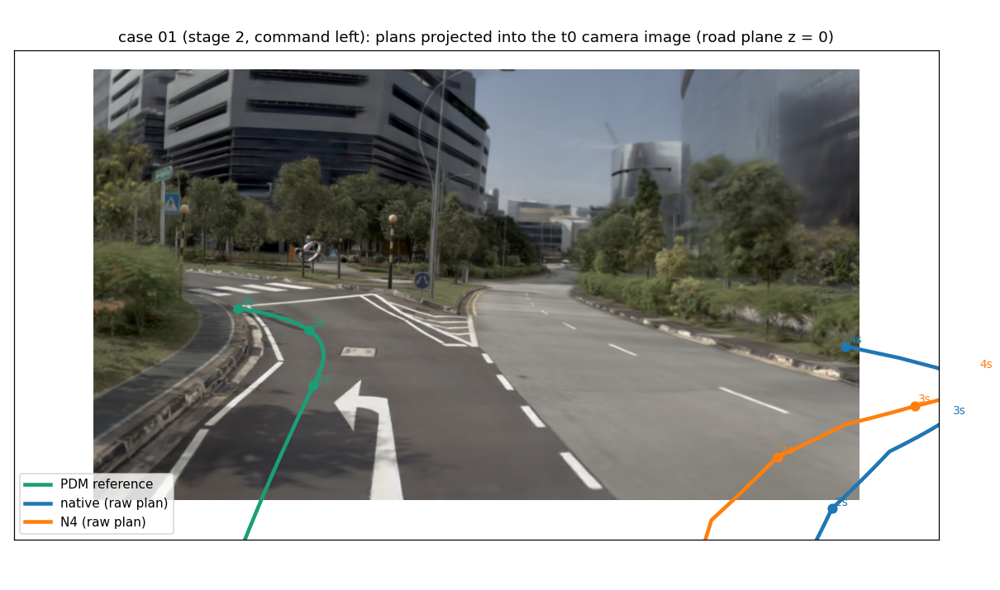
Look at where the two plans land (the wide carriageway on the right) against the reference (the left-turn lane).

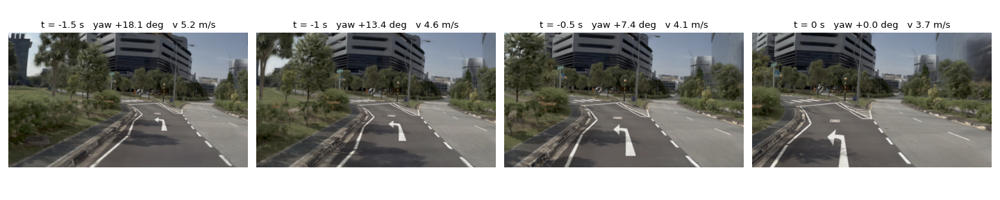 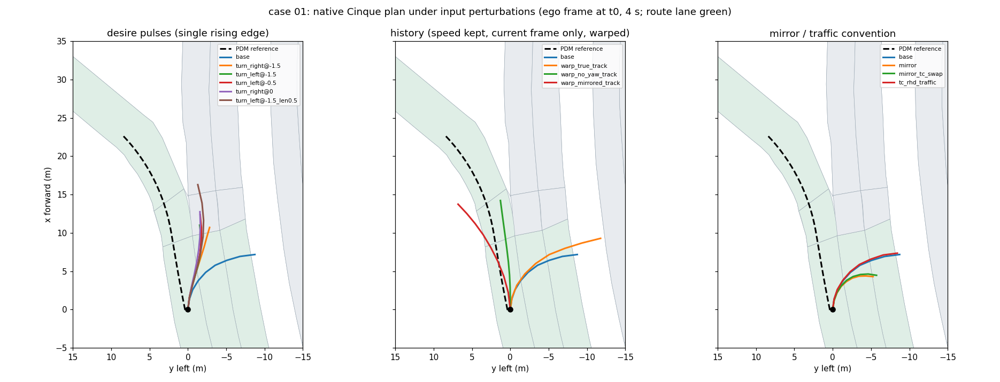 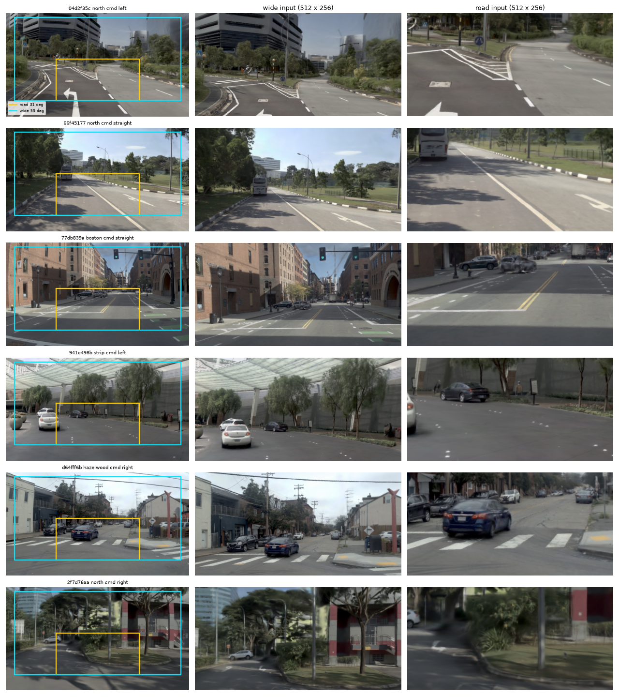 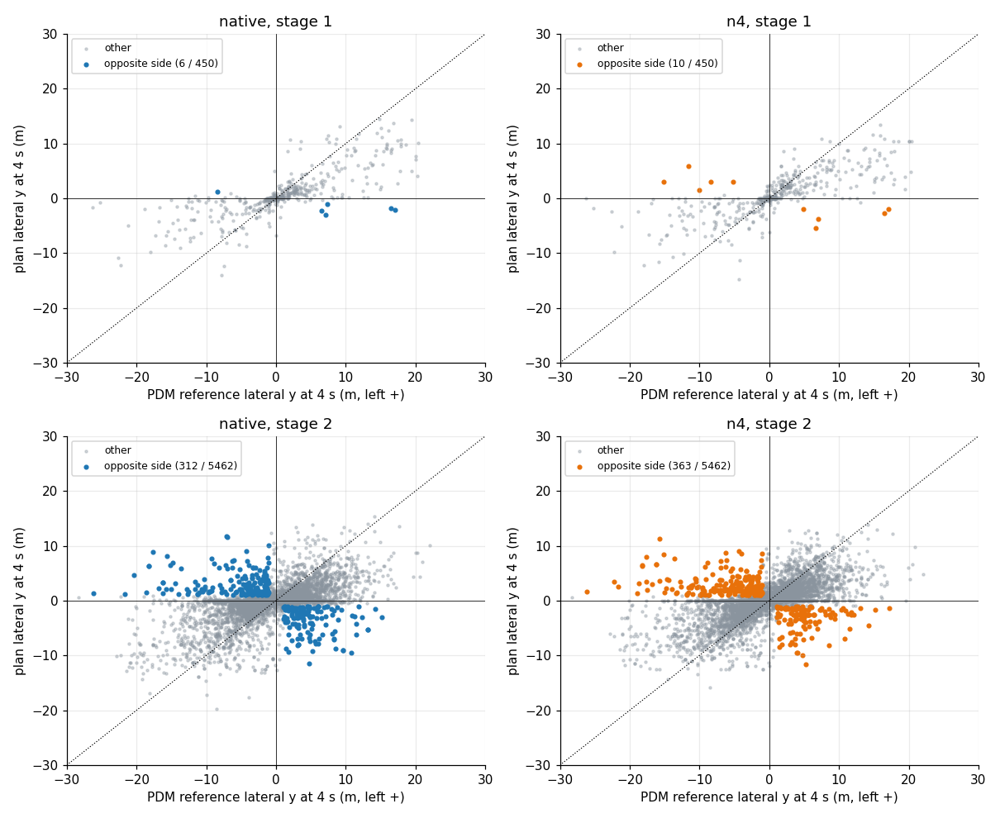
History frames with the stated ego yaw; plan end under each input perturbation; the wide and road inputs the model actually receives for six wrong-direction scenes; opposite-side rate by stage and command.

## Stage-2 drivable-area failures
Native 1 266 (23.2%), N4 1 308 (23.9%). Median overshoot at first departure 4.7 cm; half of the failures leave within 1.5 s. Failing plans move away from the reference (gap closed at 4 s: -107%). Classes (native / N4): wrong direction 166 / 178, early clip 480 / 481, junction 276 / 373, late undershoot 66 / 57, other 278 / 219.

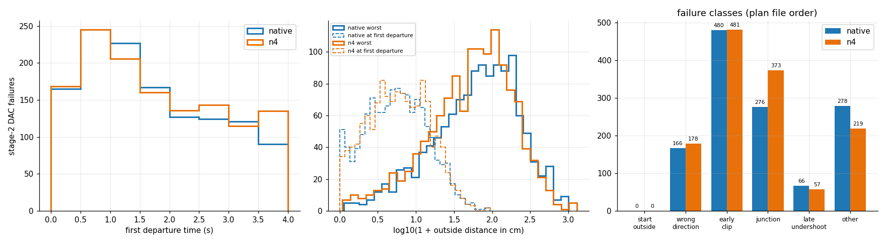 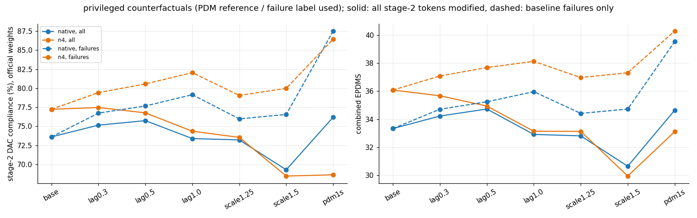
Cumulative first-departure time; stage-2 DAC under the privileged counterfactuals. Examples per class: 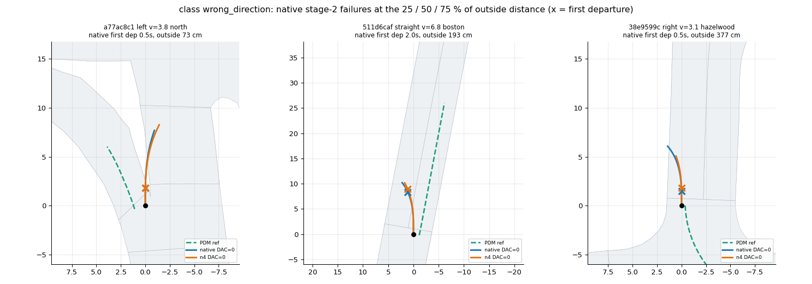 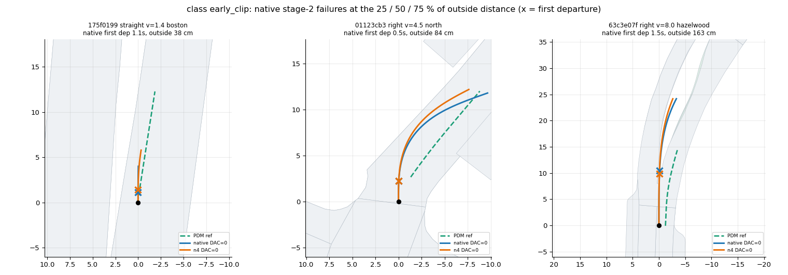 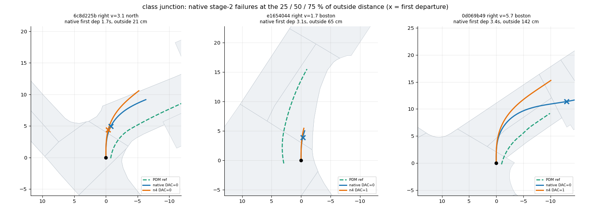 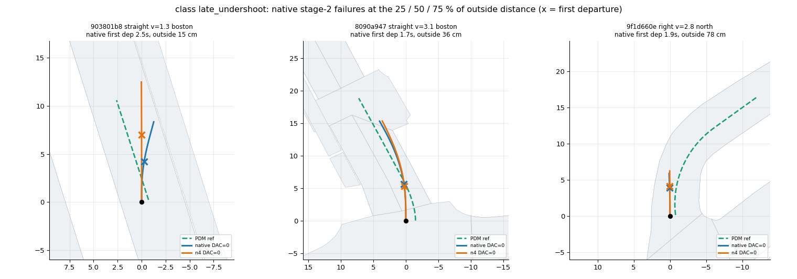 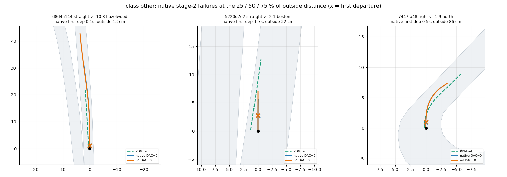

Privileged counterfactuals applied to every token gain about as much as they lose (lateral profile 0.5 s earlier: native stage-2 DAC 73.6 -> 75.7; lateral x1.5 toward the reference: 69.3). Even replacing the first second by the reference leaves more than half of the failures.

## Amplitude
On navtest the plan under-turns: slope of plan lateral on human lateral 0.87 / 0.77 / 0.75 / 0.74 at 1 / 2 / 3 / 4 s; only 3% of tokens exceed 1.5x the human. A lateral gain fitted on navtrain (1.143) lowers held-out lateral MSE by 16% and lowers the official scores: navtest PDMS -3.38 [-3.74, -3.02], navhard combined -1.71 [-3.79, +0.28].

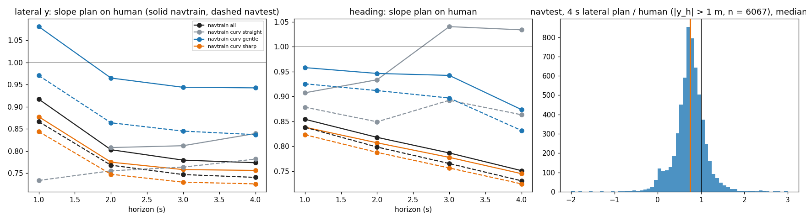
Plan-to-human lateral ratio by horizon, curvature and speed.

## Road edge
In 59% (native) / 74% (N4) of the failures the model's own road-edge output lies more than 1 m beyond the map boundary at the departing corner (median +1.5 / +2.0 m) and the plan stays inside it. The plan crosses a correctly placed own edge in 7.3% / 3.8%.

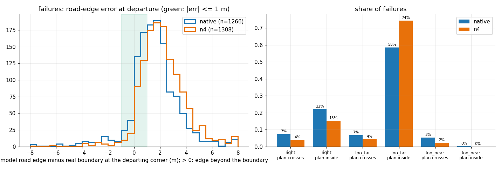

## Sub-metric loss (N4, combined EPDMS points if the term were perfect)
DAC 12.5, EC 7.6, EP 5.9, DDC 4.7, NC 3.5, LK 2.9, TLC 0.7, TTC 0.7, HC 0.4. Starts below 1 m/s cost N4 about 0.6.

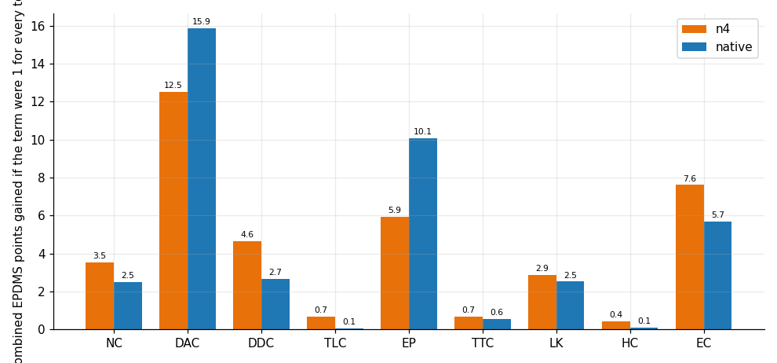
