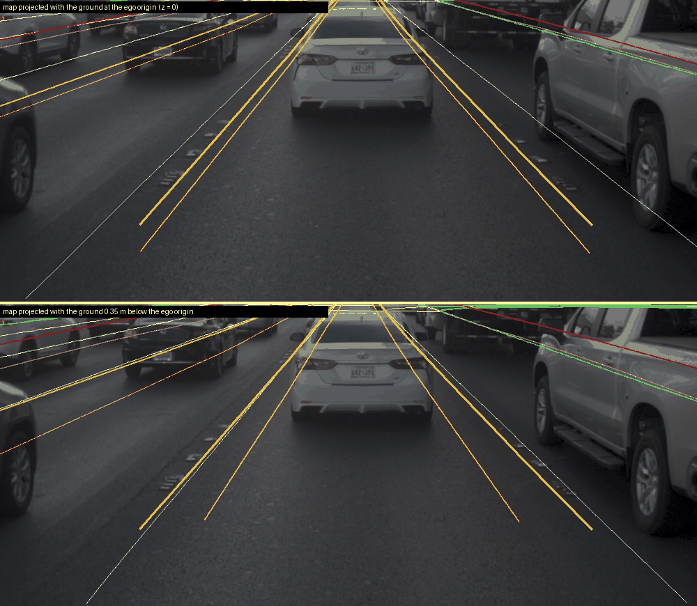
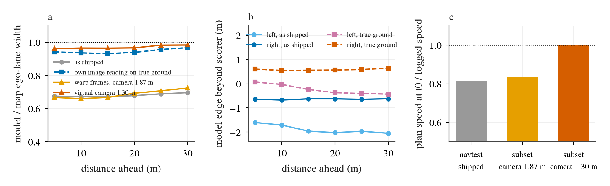

# Road-edge width diagnosis (NAVSIM)

Written by main from the executor's final report; numbers not recomputed. Plan with hypotheses H1-H5 and two
addenda: [plans/2026-10-04-roadedge-diagnosis-plan.md](../../plans/2026-10-04-roadedge-diagnosis-plan.md).
Decision: [104](../../../../research/decisions/104.md). Data: `scale.json`, `height.json`, `rescale_*.json`,
`navtrain_rescale.txt`, `tables/*.csv` in this folder.

## Root cause: camera height, so openpilot sees a world scaled by ~0.7

- NAVSIM's ego origin is the rear axle, ~0.35 m above ground (nearby box bottoms: median z -0.35 m, IQR -0.46 to
  -0.28, 9,781 boxes, 40 test logs). CAM_F0 is therefore ~1.87 m above the road, not 1.52 m. openpilot was trained
  on windshield cameras (~1.22 m).
- Ego lane width (model / map, navtest real frames) is 0.672-0.696 at every distance 5-30 m (2.28 vs 3.38 m),
  symmetric (both sides ~0.5 m inside, centre offset < 0.06 m). Constant with distance means scale, not pitch or
  intrinsics. Road width ratio 0.71-0.75; plan speed at t0 0.81 of logged (n 8,693); model lane-line z puts the road
  1.34 m below the camera.
- The image reading is right: with the map drawn at ground -0.35 m, map lane lines land on the painted markers, and
  the model's lane lines cast as camera rays land on the same pixels. On the true ground the model's lanes are
  0.93-0.97 and its road 1.00-1.06 of the map.

*What to look at: map lane lines (projected at true ground) and the model's lane lines (as camera rays) coincide on
the painted markers; the metric mismatch is in depth/scale, not in where the model looks.*

*What to look at: lane and road ratios are flat across distance, the signature of a scale error.*

## Intervention (pre-registered, 400 navtest tokens)

| Arm | Lane ratio | Road ratio | Plan speed / logged |
|:--|--:|--:|--:|
| Camera 1.87 m (control) | 0.687 | 0.728 | 0.836 |
| Virtual camera 1.30 m | 0.968 | 0.934 | 0.998 |

Lane-ratio gain 1.41x vs the 1.25x line: confirmed. Shipped GIMM frames match the control (0.689 / 0.815), so frame
interpolation is not the cause. **Not yet scored on PDMS / EPDMS.**

## Other hypotheses

- **Decision 88's "edge 1-2 m too wide"** was measured only at the corner where failing plans leave the road. Over
  all real sections the model's edges are inside the scorer polygon (median -1.6 to -2.1 m left, -0.6 m right).
- **Scorer map (H2, partly).** The polygon equals the outermost lane boundary in 87-90% of sections; the devkit
  never caches nuPlan's generic drivable-area layer, which would widen it by > 0.5 m in 28%. With scale undone the
  curb-side edge sits +0.55 to +0.64 m beyond the polygon. Eye classification of 40 pre-registered cases: ~15 real
  pavement outside the polygon, 16 junction/bend geometry, 5 non-road, 4 unclear. 38% < the 50% line: not the main
  cause, real for about a third.
- **Synthetic views (H3, rejected).** Stage 2 adds ~+0.3 m of edge beyond the polygon vs stage 1; lane ratio
  unchanged.
- **Plan vs edge (H4).** At equal distance the plan's lateral offset is 1.40-1.52x the logged one, as a 0.72-scaled
  world predicts; decision 88's under-turn per unit time is the same plan driven at 0.81 speed.
- **Selection (H5, rejected).** Edge > 1 m beyond the polygon: 15% of sections in DAC passes vs 55% in failures;
  it marks bends and junctions.

## Output-side rescale (addendum 1): rejected

k picked on navtrain (per-token k median 1.40, or constants; U1.15 +0.38, P1.15 +0.14, k ~ 1.4 arms -3.8 to -5.2).
Native navtest 84.18, navhard 33.33.

| Arm | navtest PDMS delta [95% CI] | navhard delta [95% CI] |
|:--|--:|--:|
| U-own | -5.09 [-5.67, -4.52] | -13.83 [-17.58, -10.12] |
| P-own | -4.71 [-5.20, -4.21] | -6.81 [-9.77, -4.02] |
| U1.15 | +0.15 [-0.17, +0.47] | -5.48 [-8.90, -2.14] |
| P1.15 | -0.46 [-0.78, -0.13] | -2.56 [-4.55, -0.69] |

DAC falls as k rises. Reading (inference): the over-tight plan offsets the scorer's lagging LQR tracker (TRK: 37% /
72% of the planned lateral move at 1 / 2 s), so scaling the plan alone breaks that cancellation.

## Other boards and open items

- CARLA camera is at 1.43 m; lanes read 0.82-0.89 of truth (coarse metric). HUGSIM not measured.
- The same height error affects every NAVSIM input we render (Alpamayo, N-series features).
- Next: score the virtual-camera adapter (1.30 m vs 1.87 m control) on navtest + navhard, with and without TRK
  pre-compensation.
