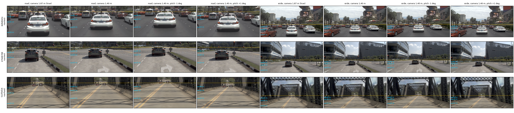

# Virtual camera rig for openpilot on NAVSIM (lane EDGE-FIX, partial)

Stopped early on 2026-10-04 by main's call. A cross-board view comparison may redefine the rig, so no test-board score
exists yet. Pre-registration: [plans/2026-10-04-roadedge-diagnosis-plan.md](../../plans/2026-10-04-roadedge-diagnosis-plan.md),
addenda 3 and 4, both written before any of these scores. Root cause: decision 104 / [report.md](report.md).

## Rig: openpilot's model frames (from openpilot's code, `jevdrive/openpilot/frames.py`)

| frame | K | hfov | horizon row (of 256) | above / below horizon |
|:--|:--|--:|--:|--:|
| road | f 910, cx 256, cy 47.6 | 31.4 deg | 47.6 (18.6% of the rows) | 3.0 / 12.9 deg |
| wide | f 455, cx 256, cy 151.8 = (256 + 47.6) / 2 | 58.7 deg | 151.8 (59.3%) | 18.5 / 12.9 deg |

- Both frames are calibrated (level) frames, so a road-heavy road frame and a sky-heavy wide frame is openpilot's own layout.
  The 120 deg physical wide camera is cropped to 58.7 deg by modeld.
- Our NAVSIM frames use the same K with calib = the level ego axes, so the horizon rows are 47.6 / 151.8 by construction.
  The model's own reading agrees: lane-line z slope gives -0.15 to +0.03 deg, road_transform pitch -0.27 to -0.33 deg.
- CAM_F0 (f 1545, 63.7 x 38.5 deg) covers 100% of both frames at every height and pitch tried. A wide frame stitched from
  CAM_L0 + CAM_F0 + CAM_R0 would change no pixel, so it was not run.
- Height: CAM_F0 is ~1.87 m above the road. openpilot's windshield camera sits at ~1.22 m.

## Navtrain selection (official v1 PDMS, lb_navtrain 3 000 tokens, paired 95% CI)

Pipeline: `op_lb run --vcam H --vpitch P`. The 4 keys are rendered for a camera H m above the road (ground homography). The 6
context frames come from the CPU ego-motion warp at the same height. `vh187` is the true-height control from the same code;
its keys are bit-identical to the shipped frame cache.

| arm | PDMS | delta [95% CI] | DAC | EP | NC | TTC |
|:--|--:|:--|--:|--:|--:|--:|
| vh187 control (warp) | 80.29 | - | | | | |
| vh122 | 78.32 | -1.97 [-3.08, -0.85] | -3.20 | +3.71 | -1.20 | -4.87 |
| vh130 | 80.20 | -0.09 [-1.08, +0.89] | -1.73 | +4.55 | -0.65 | -3.27 |
| **vh140 (H\*)** | 81.01 | +0.72 [-0.14, +1.60] | -0.83 | +4.51 | -0.17 | -2.10 |
| shipped GIMM run (native height) | 82.12 | +1.83 [+1.07, +2.56] | +0.43 | +3.33 | +0.20 | +0.20 |

Horizon switch at 1.40 m (delta vs vh140):

| pitch | PDMS | delta [95% CI] |
|:--|--:|:--|
| -1 deg | 79.17 | -1.84 [-2.54, -1.12] |
| -0.3 deg | 80.34 | -0.67 [-1.20, -0.12] |
| **+0.3 deg (P\*)** | 81.17 | +0.17 [-0.36, +0.68] |
| +1 deg | 79.94 | -1.07 [-1.88, -0.28] |

Reading:
- A lower camera buys progress (EP +4.5: the plan speed comes back, as decision 104 predicted) and loses drivable area,
  collisions and TTC. The DAC loss shrinks as H rises toward the true height.
- Height and pitch both peak in the interior of the sweep, and pitch is flat within +-0.3 deg (no horizon error).
- The warp interpolator itself costs 1.83 against GIMM. The best virtual rig (81.17) is still below the shipped GIMM run
  (82.12), so any gain must be judged against a GIMM control. The pre-registered GIMM check (keys at 1.40 m -> GIMM ->
  rollout) was stopped before the GIMM synthesis.

## Other boards (CPU, existing renders; static frame replays)

| board | camera height | 1.22 / h | model lane-line z | lane width vs truth | implied pitch | wide coverage |
|:--|--:|--:|--:|--:|--:|--:|
| NAVSIM | 1.87 m | 0.65 | 1.34 m | 0.67-0.70 (map) | ~0 deg | 100% |
| CARLA B2D | 1.433 m | 0.85 | 1.29 m | 0.85 (map, 315 closed-loop readings) | -0.02 deg | 100% (road: last row clamped) |
| HUGSIM nuScenes | ~1.19 m | 1.03 | 1.155 m | 0.83 vs 3.5 m guess | -0.54 deg | 100% |
| HUGSIM PandaSet | 1.50 m | 0.81 | 1.30 m | 0.84 vs 3.5 m | -0.13 deg | 94.9% (5.1% black) |
| HUGSIM Waymo | 1.79 m | 0.68 | 1.30 m | 0.86 vs 3.5 m | -0.08 deg | 94.9% (5.1% black) |
| HUGSIM KITTI-360 | 1.55 m nominal (z says ~0.9) | 0.79 | 0.87 m | 0.84 vs 3.5 m | -1.60 deg (cam_rect pitched 5 deg) | 100% |

- CARLA's lane ratio 0.851 equals 1.22 / 1.433, so the height scale law holds there.
- On HUGSIM the model's z saturates near 1.3 m, and lane widths come from frames with mostly low lane probability.
- KITTI-360 is the only board with a real horizon tilt.
- Alpamayo and the N-series NAVSIM features use the same 1.87 m CAM_F0 geometry: `OpenpilotMaps` with default
  `depress=1.0`, and Alpamayo's rotation-only reprojection to its own 1.433 m rig.

## Review sheet

*What to look at: the dashed line is openpilot's nominal horizon row, and it passes through the road's vanishing point in
every rig. The blue ticks mark where flat ground at 10 / 20 / 40 m lands. At 1.40 m the same ground sits higher in the frame,
so lanes and cars look the way a lower windshield camera would see them. Pitch +-1 deg only slides the picture.*

## Files

- Rollouts: `$DATA_DIR/runs/op_lb/lb_navtrain/plans/vh*@cinque.npz`, plus test-board controls `lb_navtest/plans/vh187@cinque*.npz`
  and `lb_navhard/plans/vh187@cinque_Oit_dw3-s0*.npz` (navhard vh187 native is incomplete).
- Code: `scripts/op_lb.py run --vcam / --vpitch`, `edge_vcam_chain.sh`, `edge_vcam_report.py`, `edge_vcam_keys.py`,
  `edge_vcam_figs.py`.
