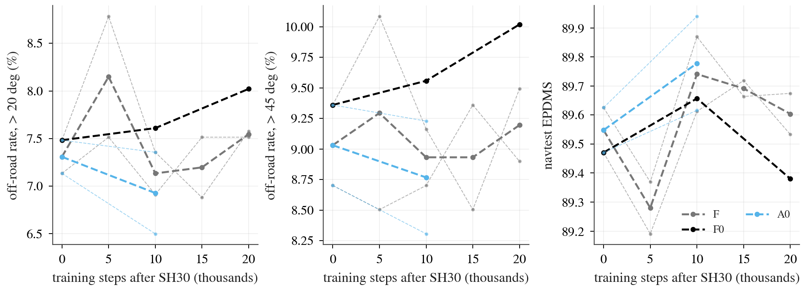

# VT reads (generated by `scripts/vt_read.py`; do not edit)

Generated 2026-10-10 23:54:58 CST from the `jevdrive.bench` navtest reads present on the box. Units: scores in points (x 100), rates in percentage points of the bucket's tokens, `diff [lo, hi]` = arm minus control, same seed (or the per-token mean of both seeds), by-log cluster bootstrap, B 10 000 (`jevdrive.stats`). A control without a snapshot at the arm's step is read at its nearest registered snapshot (column `ctrl`). Definitions: header of `scripts/vt_read.py`. Every number is in `reads.parquet` (long format); this file shows the selections below. These are trends at a small dose; the tables carry no interpretation.

## Snapshots present

| arm | navtest reads present (final = last registered step) | registered, not read yet | test-time options read |
|:--|--:|--:|--:|
| SH30-s0 | k00 | none | n/a |
| SH30-s1 | k00 | none | n/a |
| F-s0 | k05 k10 k15 k20 | k25 k30 k35 k40 k45 k50 k55 k60 | n/a |
| F-s1 | k05 k10 k15 k20 | k25 k30 k35 k40 k45 k50 k55 k60 | n/a |
| F0-s0 | k10 k20 | k30 k40 k50 k60 | n/a |
| A0-s0 | k10 | k20 k30 k40 k50 | n/a |
| A0-s1 | k10 | k20 k30 k40 k50 | n/a |
| A-s0 | none | k05 k10 k15 k20 k25 k30 k35 k40 k45 k50 | none |
| A-s1 | none | k05 k10 k15 k20 k25 k30 k35 k40 k45 k50 | none |
| B-s0 | none | k05 k10 k15 k20 k25 k30 k35 k40 k45 k50 | none |
| B-s1 | none | k05 k10 k15 k20 k25 k30 k35 k40 k45 k50 | none |
| C-s0 | none | k05 k10 k15 k20 k25 k30 k35 k40 | n/a |
| W-s0 | none | k05 k10 k15 k20 k25 k30 k35 k40 k45 k50 | none |
| W-s1 | none | k05 k10 k15 k20 k25 k30 k35 k40 k45 k50 | none |

Replay identity: the instrumented replay of the failing tokens reproduces the stored 8 sub-scores on 14 / 14 models (max |difference| 4.9e-12).

## Figure

Off-road (DAC failure) rate on > 20 deg and > 45 deg tokens and the full navtest EPDMS against training steps; step 0 is `SH30-F-s<seed>`. One colour per arm, controls (F, F0, A0) dashed, thin lines are single seeds and the thick line their mean. What to look at: whether a trained-vision arm (A, B, C, W; solid) separates from its dashed control as steps grow, in the left two panels downward and in the right panel not downward. PDF: `trend.pdf`.

## First snapshot (`vt_read.py first`)

| comparison | seed | step | ctrl step | off-road > 45 | cut-inside > 45 | under-turn > 45 | off-road > 20 | EPDMS all | vision disp. |
|:--|--:|--:|--:|--:|--:|--:|--:|--:|--:|
| F - SH30 | mean | k05 | k00 | +0.26 [-0.29, +0.85] | +0.36 [+0.04, +0.69] | -0.23 [-0.55, +0.09] | +0.84 [+0.43, +1.24] | -0.27 [-0.41, -0.13] | n/a |
| F - SH30 | 0 | k05 | k00 | +0.73 [+0.00, +1.52] | +0.79 [+0.29, +1.34] | -0.59 [-1.06, -0.23] | +1.30 [+0.66, +2.03] | -0.28 [-0.53, -0.05] | n/a |
| F - SH30 | 1 | k05 | k00 | -0.20 [-0.79, +0.49] | -0.07 [-0.43, +0.27] | +0.13 [-0.29, +0.63] | +0.38 [-0.15, +0.87] | -0.26 [-0.46, -0.04] | n/a |
| F0 - F | 0 | k10 | k10 | +0.40 [-0.29, +1.08] | +0.33 [-0.19, +0.88] | +0.00 [-0.61, +0.61] | +0.25 [-0.25, +0.78] | +0.04 [-0.13, +0.22] | n/a |
| A0 - F | mean | k10 | k10 | -0.16 [-0.49, +0.17] | -0.16 [-0.51, +0.15] | +0.07 [-0.20, +0.31] | -0.21 [-0.46, +0.06] | +0.04 [-0.05, +0.13] | n/a |
| A0 - F | 0 | k10 | k10 | +0.07 [-0.42, +0.58] | +0.07 [-0.40, +0.54] | +0.07 [-0.30, +0.38] | +0.00 [-0.34, +0.36] | +0.00 [-0.12, +0.13] | n/a |
| A0 - F | 1 | k10 | k10 | -0.40 [-0.92, +0.13] | -0.40 [-0.79, -0.06] | +0.07 [-0.32, +0.47] | -0.41 [-0.75, -0.09] | +0.07 [-0.04, +0.19] | n/a |

## Trend per comparison

One row per snapshot and seed label; `ctrl` is the control's snapshot actually used.

### F - SH30 (reference, not a registered comparison)

| seed | step | ctrl | EPDMS all | EPDMS < 5 | off-road > 20 | off-road > 45 | cut-inside > 45 | under-turn > 45 | NC all | EP all | vision disp. |
|:--|--:|--:|--:|--:|--:|--:|--:|--:|--:|--:|--:|
| mean | k05 | k00 | -0.27 [-0.41, -0.13] | +0.02 [-0.10, +0.15] | +0.84 [+0.43, +1.24] | +0.26 [-0.29, +0.85] | +0.36 [+0.04, +0.69] | -0.23 [-0.55, +0.09] | -0.02 [-0.11, +0.06] | +0.18 [+0.14, +0.21] | n/a |
| mean | k10 | k00 | +0.19 [+0.04, +0.35] | +0.07 [-0.03, +0.16] | -0.17 [-0.63, +0.30] | -0.10 [-0.51, +0.38] | +0.07 [-0.19, +0.32] | -0.07 [-0.30, +0.17] | +0.05 [-0.02, +0.11] | +0.17 [+0.12, +0.22] | n/a |
| mean | k15 | k00 | +0.14 [-0.03, +0.31] | +0.09 [-0.06, +0.25] | -0.11 [-0.54, +0.33] | -0.10 [-0.58, +0.39] | -0.16 [-0.54, +0.21] | -0.07 [-0.38, +0.26] | +0.13 [+0.04, +0.22] | +0.09 [+0.04, +0.15] | n/a |
| mean | k20 | k00 | +0.06 [-0.15, +0.26] | +0.12 [-0.06, +0.30] | +0.24 [-0.19, +0.72] | +0.16 [-0.36, +0.77] | +0.82 [+0.49, +1.21] | -0.36 [-0.68, -0.07] | +0.12 [-0.02, +0.26] | -0.23 [-0.28, -0.18] | n/a |
| 0 | k05 | k00 | -0.28 [-0.53, -0.05] | +0.10 [-0.08, +0.26] | +1.30 [+0.66, +2.03] | +0.73 [+0.00, +1.52] | +0.79 [+0.29, +1.34] | -0.59 [-1.06, -0.23] | -0.02 [-0.14, +0.09] | +0.48 [+0.42, +0.54] | n/a |
| 0 | k10 | k00 | +0.14 [-0.04, +0.32] | +0.05 [-0.07, +0.17] | -0.13 [-0.62, +0.40] | -0.20 [-0.86, +0.48] | +0.33 [+0.00, +0.67] | -0.46 [-0.89, -0.08] | -0.04 [-0.13, +0.04] | +0.36 [+0.31, +0.41] | n/a |
| 0 | k15 | k00 | +0.25 [+0.01, +0.49] | +0.14 [-0.08, +0.35] | -0.60 [-1.19, -0.04] | -0.86 [-1.59, -0.15] | -0.33 [-0.79, +0.07] | -0.33 [-0.81, +0.13] | +0.27 [+0.14, +0.40] | -0.50 [-0.57, -0.43] | n/a |
| 0 | k20 | k00 | +0.06 [-0.15, +0.27] | +0.10 [-0.11, +0.32] | +0.10 [-0.38, +0.56] | +0.13 [-0.57, +0.89] | +0.26 [-0.31, +0.84] | -0.20 [-0.63, +0.22] | +0.11 [-0.04, +0.26] | -0.06 [-0.12, -0.00] | n/a |
| 1 | k05 | k00 | -0.26 [-0.46, -0.04] | -0.05 [-0.23, +0.14] | +0.38 [-0.15, +0.87] | -0.20 [-0.79, +0.49] | -0.07 [-0.43, +0.27] | +0.13 [-0.29, +0.63] | -0.02 [-0.13, +0.08] | -0.13 [-0.17, -0.09] | n/a |
| 1 | k10 | k00 | +0.24 [+0.03, +0.45] | +0.08 [-0.08, +0.24] | -0.22 [-0.79, +0.36] | +0.00 [-0.54, +0.58] | -0.20 [-0.61, +0.17] | +0.33 [+0.07, +0.64] | +0.14 [+0.04, +0.23] | -0.03 [-0.09, +0.04] | n/a |
| 1 | k15 | k00 | +0.04 [-0.18, +0.24] | +0.05 [-0.17, +0.26] | +0.38 [-0.19, +0.93] | +0.66 [+0.06, +1.29] | +0.00 [-0.46, +0.50] | +0.20 [-0.09, +0.58] | -0.02 [-0.13, +0.10] | +0.69 [+0.60, +0.77] | n/a |
| 1 | k20 | k00 | +0.05 [-0.23, +0.33] | +0.15 [-0.07, +0.35] | +0.38 [-0.37, +1.22] | +0.20 [-0.99, +1.47] | +1.38 [+0.71, +2.24] | -0.53 [-1.03, -0.11] | +0.13 [-0.04, +0.28] | -0.40 [-0.45, -0.34] | n/a |

### F0 - F

| seed | step | ctrl | EPDMS all | EPDMS < 5 | off-road > 20 | off-road > 45 | cut-inside > 45 | under-turn > 45 | NC all | EP all | vision disp. |
|:--|--:|--:|--:|--:|--:|--:|--:|--:|--:|--:|--:|
| 0 | k10 | k10 | +0.04 [-0.13, +0.22] | +0.09 [-0.12, +0.30] | +0.25 [-0.25, +0.78] | +0.40 [-0.29, +1.08] | +0.33 [-0.19, +0.88] | +0.00 [-0.61, +0.61] | +0.17 [+0.06, +0.30] | -0.31 [-0.36, -0.27] | n/a |
| 0 | k20 | k20 | -0.15 [-0.39, +0.07] | -0.04 [-0.22, +0.14] | +0.44 [-0.18, +1.10] | +0.53 [-0.33, +1.40] | +0.00 [-0.71, +0.74] | +0.13 [-0.39, +0.66] | -0.07 [-0.16, +0.04] | +0.24 [+0.18, +0.30] | n/a |

### A0 - F

| seed | step | ctrl | EPDMS all | EPDMS < 5 | off-road > 20 | off-road > 45 | cut-inside > 45 | under-turn > 45 | NC all | EP all | vision disp. |
|:--|--:|--:|--:|--:|--:|--:|--:|--:|--:|--:|--:|
| mean | k10 | k10 | +0.04 [-0.05, +0.13] | -0.01 [-0.09, +0.07] | -0.21 [-0.46, +0.06] | -0.16 [-0.49, +0.17] | -0.16 [-0.51, +0.15] | +0.07 [-0.20, +0.31] | +0.01 [-0.04, +0.07] | -0.08 [-0.11, -0.05] | n/a |
| 0 | k10 | k10 | +0.00 [-0.12, +0.13] | -0.02 [-0.14, +0.11] | +0.00 [-0.34, +0.36] | +0.07 [-0.42, +0.58] | +0.07 [-0.40, +0.54] | +0.07 [-0.30, +0.38] | +0.02 [-0.05, +0.08] | -0.09 [-0.12, -0.06] | n/a |
| 1 | k10 | k10 | +0.07 [-0.04, +0.19] | -0.00 [-0.09, +0.09] | -0.41 [-0.75, -0.09] | -0.40 [-0.92, +0.13] | -0.40 [-0.79, -0.06] | +0.07 [-0.32, +0.47] | +0.01 [-0.06, +0.08] | -0.07 [-0.11, -0.03] | n/a |

## Full decomposition at the latest snapshot

Arm minus control per sub-metric and turn bucket (every snapshot is in `reads.parquet`). Seed mean where both seeds exist, else the seed shown.

### F - SH30, k20, seed mean

| metric | all | <5 | 5-20 | 20-45 | >45 | >20 |
|:--|--:|--:|--:|--:|--:|--:|
| EPDMS | +0.06 [-0.15, +0.26] | +0.12 [-0.06, +0.30] | +0.23 [-0.26, +0.78] | -0.15 [-0.78, +0.48] | -0.31 [-1.04, +0.32] | -0.22 [-0.76, +0.26] |
| NC | +0.12 [-0.02, +0.26] | +0.18 [+0.01, +0.35] | +0.20 [-0.08, +0.62] | +0.06 [-0.47, +0.53] | -0.21 [-0.57, +0.08] | -0.07 [-0.40, +0.22] |
| DAC | -0.01 [-0.18, +0.16] | +0.05 [-0.02, +0.13] | +0.10 [-0.33, +0.56] | -0.31 [-0.94, +0.31] | -0.16 [-0.77, +0.36] | -0.24 [-0.72, +0.19] |
| DDC | -0.03 [-0.07, +0.01] | +0.01 [-0.00, +0.03] | -0.03 [-0.10, +0.00] | +0.03 [-0.07, +0.14] | -0.28 [-0.54, -0.05] | -0.12 [-0.27, +0.01] |
| TLC | +0.04 [+0.00, +0.08] | +0.03 [-0.02, +0.09] | +0.00 [+0.00, +0.00] | +0.12 [+0.00, +0.32] | +0.03 [+0.00, +0.11] | +0.08 [+0.00, +0.19] |
| EP | -0.23 [-0.28, -0.18] | -0.47 [-0.54, -0.40] | -0.17 [-0.24, -0.09] | -0.05 [-0.15, +0.04] | +0.49 [+0.34, +0.65] | +0.21 [+0.10, +0.32] |
| TTC | +0.14 [+0.02, +0.25] | +0.24 [+0.08, +0.40] | +0.12 [-0.15, +0.44] | +0.09 [-0.24, +0.44] | -0.23 [-0.52, +0.04] | -0.06 [-0.29, +0.16] |
| LK | +0.16 [+0.04, +0.29] | +0.09 [-0.03, +0.21] | +0.08 [-0.13, +0.30] | +0.21 [-0.29, +0.70] | +0.59 [+0.15, +1.09] | +0.40 [+0.05, +0.74] |
| HC | +0.00 [+0.00, +0.00] | +0.00 [+0.00, +0.00] | +0.00 [+0.00, +0.00] | +0.00 [+0.00, +0.00] | +0.00 [+0.00, +0.00] | +0.00 [+0.00, +0.00] |
| EC | -0.20 [-0.43, -0.00] | -0.20 [-0.37, -0.06] | -0.19 [-0.63, +0.23] | +0.00 [-0.63, +0.68] | -0.47 [-1.69, +0.54] | -0.23 [-0.90, +0.39] |
| offroad | +0.01 [-0.16, +0.18] | -0.05 [-0.13, +0.02] | -0.10 [-0.56, +0.33] | +0.31 [-0.31, +0.94] | +0.16 [-0.36, +0.77] | +0.24 [-0.19, +0.72] |
| cut_in | +0.12 [+0.02, +0.22] | -0.02 [-0.05, +0.02] | -0.08 [-0.27, +0.12] | +0.31 [-0.34, +0.97] | +0.82 [+0.49, +1.21] | +0.55 [+0.20, +0.93] |
| under | -0.04 [-0.14, +0.05] | -0.02 [-0.08, +0.02] | +0.00 [-0.36, +0.30] | +0.15 [-0.03, +0.34] | -0.36 [-0.68, -0.07] | -0.10 [-0.27, +0.08] |

### F0 - F, k20, seed 0

| metric | all | <5 | 5-20 | 20-45 | >45 | >20 |
|:--|--:|--:|--:|--:|--:|--:|
| EPDMS | -0.15 [-0.39, +0.07] | -0.04 [-0.22, +0.14] | -0.07 [-0.47, +0.37] | -0.51 [-1.23, +0.13] | -0.40 [-1.18, +0.37] | -0.46 [-1.06, +0.12] |
| NC | -0.07 [-0.16, +0.04] | -0.07 [-0.22, +0.09] | +0.00 [-0.19, +0.24] | -0.09 [-0.34, +0.11] | -0.13 [-0.40, +0.13] | -0.11 [-0.29, +0.05] |
| DAC | -0.12 [-0.38, +0.09] | +0.00 [-0.13, +0.10] | -0.04 [-0.43, +0.38] | -0.37 [-1.09, +0.30] | -0.53 [-1.40, +0.33] | -0.44 [-1.10, +0.18] |
| DDC | +0.03 [-0.01, +0.07] | +0.00 [-0.03, +0.03] | -0.04 [-0.10, +0.00] | +0.03 [-0.13, +0.20] | +0.30 [+0.06, +0.54] | +0.16 [+0.02, +0.31] |
| TLC | -0.01 [-0.05, +0.02] | -0.02 [-0.10, +0.05] | +0.00 [+0.00, +0.00] | +0.00 [+0.00, +0.00] | +0.00 [+0.00, +0.00] | +0.00 [+0.00, +0.00] |
| EP | +0.24 [+0.18, +0.30] | +0.30 [+0.20, +0.40] | +0.11 [+0.02, +0.20] | +0.11 [+0.01, +0.21] | +0.34 [+0.22, +0.45] | +0.22 [+0.12, +0.32] |
| TTC | -0.05 [-0.19, +0.09] | -0.08 [-0.23, +0.07] | +0.15 [-0.12, +0.47] | -0.18 [-0.68, +0.30] | -0.13 [-0.35, +0.00] | -0.16 [-0.43, +0.11] |
| LK | +0.07 [-0.07, +0.22] | +0.05 [-0.13, +0.23] | +0.00 [-0.34, +0.34] | +0.00 [-0.48, +0.49] | +0.33 [-0.06, +0.70] | +0.16 [-0.17, +0.49] |
| HC | +0.00 [-0.02, +0.02] | +0.02 [+0.00, +0.05] | +0.00 [+0.00, +0.00] | +0.00 [+0.00, +0.00] | -0.07 [-0.23, +0.00] | -0.03 [-0.11, +0.00] |
| EC | -0.27 [-0.50, -0.05] | +0.06 [-0.19, +0.32] | -0.43 [-0.91, +0.00] | -0.87 [-1.63, -0.14] | -0.70 [-1.88, +0.57] | -0.79 [-1.47, -0.07] |
| offroad | +0.12 [-0.09, +0.38] | +0.00 [-0.10, +0.13] | +0.04 [-0.38, +0.43] | +0.37 [-0.30, +1.09] | +0.53 [-0.33, +1.40] | +0.44 [-0.18, +1.10] |
| cut_in | +0.07 [-0.07, +0.21] | +0.03 [+0.00, +0.08] | +0.15 [-0.11, +0.40] | +0.12 [-0.46, +0.79] | +0.00 [-0.71, +0.74] | +0.06 [-0.39, +0.57] |
| under | -0.04 [-0.18, +0.13] | -0.03 [-0.08, +0.00] | -0.31 [-0.64, -0.04] | +0.18 [-0.38, +1.00] | +0.13 [-0.39, +0.66] | +0.16 [-0.29, +0.75] |

### A0 - F, k10, seed mean

| metric | all | <5 | 5-20 | 20-45 | >45 | >20 |
|:--|--:|--:|--:|--:|--:|--:|
| EPDMS | +0.04 [-0.05, +0.13] | -0.01 [-0.09, +0.07] | +0.03 [-0.14, +0.19] | +0.20 [-0.15, +0.54] | +0.07 [-0.25, +0.39] | +0.14 [-0.12, +0.38] |
| NC | +0.01 [-0.04, +0.07] | +0.03 [-0.04, +0.11] | -0.01 [-0.07, +0.05] | -0.03 [-0.27, +0.17] | +0.03 [-0.08, +0.14] | +0.00 [-0.14, +0.11] |
| DAC | +0.06 [-0.02, +0.14] | -0.02 [-0.07, +0.02] | +0.10 [-0.08, +0.25] | +0.24 [-0.12, +0.58] | +0.16 [-0.17, +0.49] | +0.21 [-0.06, +0.46] |
| DDC | -0.00 [-0.02, +0.01] | +0.00 [-0.01, +0.01] | +0.01 [-0.02, +0.04] | -0.03 [-0.13, +0.04] | -0.02 [-0.11, +0.06] | -0.02 [-0.09, +0.03] |
| TLC | +0.01 [-0.01, +0.03] | +0.02 [-0.02, +0.06] | +0.00 [+0.00, +0.00] | +0.00 [+0.00, +0.00] | +0.00 [+0.00, +0.00] | +0.00 [+0.00, +0.00] |
| EP | -0.08 [-0.11, -0.05] | -0.05 [-0.08, -0.03] | -0.07 [-0.10, -0.02] | -0.17 [-0.25, -0.10] | -0.11 [-0.18, -0.05] | -0.15 [-0.21, -0.08] |
| TTC | -0.01 [-0.08, +0.05] | +0.01 [-0.04, +0.07] | -0.19 [-0.35, -0.07] | +0.15 [-0.18, +0.50] | +0.03 [-0.21, +0.25] | +0.10 [-0.12, +0.30] |
| LK | +0.02 [-0.04, +0.08] | +0.01 [-0.07, +0.09] | +0.06 [-0.06, +0.19] | +0.00 [-0.19, +0.20] | +0.03 [-0.17, +0.22] | +0.02 [-0.12, +0.14] |
| HC | +0.00 [+0.00, +0.00] | +0.00 [+0.00, +0.00] | +0.00 [+0.00, +0.00] | +0.00 [+0.00, +0.00] | +0.00 [+0.00, +0.00] | +0.00 [+0.00, +0.00] |
| EC | -0.06 [-0.21, +0.06] | -0.03 [-0.15, +0.08] | +0.00 [-0.27, +0.24] | +0.04 [-0.42, +0.50] | -0.43 [-1.00, +0.09] | -0.19 [-0.53, +0.14] |
| offroad | -0.06 [-0.14, +0.02] | +0.02 [-0.02, +0.07] | -0.10 [-0.25, +0.08] | -0.24 [-0.58, +0.12] | -0.16 [-0.49, +0.17] | -0.21 [-0.46, +0.06] |
| cut_in | -0.08 [-0.16, -0.02] | -0.01 [-0.03, +0.00] | -0.12 [-0.20, -0.04] | -0.24 [-0.56, +0.06] | -0.16 [-0.51, +0.15] | -0.21 [-0.45, +0.02] |
| under | +0.04 [-0.01, +0.09] | +0.02 [+0.00, +0.04] | +0.08 [-0.05, +0.24] | +0.03 [-0.11, +0.15] | +0.07 [-0.20, +0.31] | +0.05 [-0.12, +0.19] |

## Longitudinal: NC failures by class (decision 196) and plan arc length

Counts are tokens of the full navtest (seed mean where both seeds exist) at the latest snapshot; `A` = stationary or slow lead in the own lane (A1 stopped, A2 moving). `arc / log` = plan 4 s arc length over the logged one (ratio of sums); `arc / ctrl` = over the first control's.

| arm | seed | step | NC fail | TTC-only | A | A1 | A2 | B | C | D | E | A rate - first control (pp) | arc / log | arc / ctrl |
|:--|--:|--:|--:|--:|--:|--:|--:|--:|--:|--:|--:|--:|--:|--:|
| SH30 | mean | k00 | 176.5 | 87.5 | 93.5 | 58.5 | 35.0 | 23.0 | 13.5 | 16.5 | 30.0 | n/a | 0.997 [0.993, 1.000] | n/a |
| F | mean | k20 | 161.5 | 84.5 | 85.5 | 59.0 | 26.5 | 18.5 | 10.0 | 18.0 | 29.5 | -0.07 [-0.17, +0.04] | 0.993 [0.990, 0.996] | 0.996 [0.996, 0.997] vs SH30 |
| F0 | 0 | k20 | 176.0 | 97.0 | 94.0 | 60.0 | 34.0 | 18.0 | 10.0 | 16.0 | 38.0 | +0.03 [-0.04, +0.10] | 1.000 [0.997, 1.004] | 1.003 [1.002, 1.004] vs F |
| A0 | mean | k10 | 170.0 | 89.0 | 90.5 | 57.0 | 33.5 | 20.0 | 13.5 | 13.0 | 33.0 | +0.01 [-0.03, +0.05] | 0.997 [0.993, 1.000] | 0.999 [0.998, 0.999] vs F |

## Weight displacement and dev ADE (`evals.json`, at the snapshot steps)

Relative L2 displacement from the starting point in percent (vision total and stages, policy, adapter), dev ADE in metres; full eval history: `disp.csv`.

| arm | seed | step | vis | vis_stem | vis_s0 | vis_s1 | vis_s2 | vis_s3 | vis_head | policy | adapter | ade | ade_masked | head_ade |
|:--|--:|--:|--:|--:|--:|--:|--:|--:|--:|--:|--:|--:|--:|--:|
| F | 0 | k00 |  |  |  |  |  |  |  | 0.000 | 0.000 | 0.561 |  |  |
| F | 0 | k05 |  |  |  |  |  |  |  | 0.619 | 5.674 | 0.568 |  |  |
| F | 0 | k10 |  |  |  |  |  |  |  | 1.143 | 9.740 | 0.560 |  |  |
| F | 0 | k15 |  |  |  |  |  |  |  | 1.616 | 13.369 | 0.563 |  |  |
| F | 0 | k20 |  |  |  |  |  |  |  | 2.055 | 16.737 | 0.554 |  |  |
| F | 0 | k25 |  |  |  |  |  |  |  | 2.461 | 19.794 | 0.551 |  |  |
| F | 0 | k30 |  |  |  |  |  |  |  | 2.842 | 22.671 | 0.552 |  |  |
| F | 1 | k00 |  |  |  |  |  |  |  | 0.000 | 0.000 | 0.558 |  |  |
| F | 1 | k05 |  |  |  |  |  |  |  | 0.623 | 5.660 | 0.560 |  |  |
| F | 1 | k10 |  |  |  |  |  |  |  | 1.146 | 9.713 | 0.557 |  |  |
| F | 1 | k15 |  |  |  |  |  |  |  | 1.617 | 13.416 | 0.553 |  |  |
| F | 1 | k20 |  |  |  |  |  |  |  | 2.054 | 16.706 | 0.554 |  |  |
| F | 1 | k25 |  |  |  |  |  |  |  | 2.458 | 19.761 | 0.540 |  |  |
| F | 1 | k30 |  |  |  |  |  |  |  | 2.835 | 22.537 | 0.558 |  |  |
| F0 | 0 | k00 |  |  |  |  |  |  |  | 0.000 | 0.000 | 0.561 |  |  |
| F0 | 0 | k10 |  |  |  |  |  |  |  | 0.996 | 11.101 | 0.549 |  |  |
| F0 | 0 | k20 |  |  |  |  |  |  |  | 1.675 | 18.235 | 0.553 |  |  |
| A0 | 0 | k00 |  |  |  |  |  |  |  | 0.000 | 0.000 | 1.105 | 0.561 | 9.847 |
| A0 | 0 | k10 |  |  |  |  |  |  |  | 1.137 | 13.532 | 0.561 | 0.560 | 0.805 |
| A0 | 0 | k20 |  |  |  |  |  |  |  | 2.031 | 21.247 | 0.553 | 0.551 | 0.818 |
| A0 | 1 | k00 |  |  |  |  |  |  |  | 0.000 | 0.000 | 1.161 | 0.558 | 9.876 |
| A0 | 1 | k10 |  |  |  |  |  |  |  | 1.139 | 13.863 | 0.562 | 0.558 | 0.813 |
| A | 0 | k00 | 0.000 | 0.000 | 0.000 | 0.000 | 0.000 | 0.000 | 0.000 | 0.000 | 0.000 | 1.105 | 0.561 | 9.847 |
| A | 0 | k05 | 0.623 | 0.506 | 0.579 | 0.632 | 0.641 | 0.654 | 0.513 | 0.619 | 8.575 | 0.563 | 0.568 | 0.804 |
| A | 1 | k00 | 0.000 | 0.000 | 0.000 | 0.000 | 0.000 | 0.000 | 0.000 | 0.000 | 0.000 | 1.161 | 0.558 | 9.876 |
| A | 1 | k05 | 0.624 | 0.500 | 0.582 | 0.635 | 0.644 | 0.650 | 0.496 | 0.622 | 8.993 | 0.551 | 0.562 | 0.774 |
| B | 0 | k00 | 0.000 | 0.000 | 0.000 | 0.000 | 0.000 | 0.000 | 0.000 | 0.000 | 0.000 | 1.105 | 0.561 | 9.847 |
| B | 0 | k05 | 0.628 | 0.503 | 0.584 | 0.636 | 0.646 | 0.661 | 0.511 | 0.619 | 8.597 | 0.561 | 0.566 | 0.797 |
| B | 1 | k00 | 0.000 | 0.000 | 0.000 | 0.000 | 0.000 | 0.000 | 0.000 | 0.000 | 0.000 | 1.161 | 0.558 | 9.876 |
| B | 1 | k05 | 0.626 | 0.488 | 0.588 | 0.639 | 0.648 | 0.647 | 0.491 | 0.622 | 8.933 | 0.553 | 0.564 | 0.782 |
| C | 0 | k00 | 0.000 | 0.000 | 0.000 | 0.000 | 0.000 | 0.000 | 0.000 | 0.000 | 0.000 | 0.561 |  |  |
| W | 0 | k00 | 0.000 | 0.000 | 0.000 | 0.000 | 0.000 | 0.000 | 0.000 | 0.000 | 0.000 | 1.233 | 0.561 | 9.855 |

## Stage-0 probe on the branch tokens (decision 160)

Thin decoder (`rep.py decode`, unchanged) on [tokens, ego], DAC failure rate on the 3 154 navtest tokens > 20 deg; references from decision 160: V 10.59%, WA-Cf 6.88%. `V` below is the same decoder refitted on Cinque's frozen tokens in the same run (reproduction and the paired reference).

Not run yet (`vt_read.py probe --tags ...`).

## Final checkpoints: boards and test-time options

| board | model (final) | metric | value | control | ctrl step | diff |
|:--|--:|--:|--:|--:|--:|--:|
| hugsim | SH30-s0 | hdscore | 0.443 |  |  |  |
| hugsim | SH30-s1 | hdscore | 0.434 |  |  |  |

Test-time options minus the unmodified final checkpoint (`:noside` masks the memory, `:mshuf` feeds another log's memory, `:sideoff` masks W's side views); a negative EPDMS difference = the channel is read:

None read yet.

## W: > 45 deg cut-inside by whether the inner curb was inside the normal field of view at t0

Strata (fixed token sets, `runs/corridor/fov/`): `edge out / in` = share of the inner-curb samples inside the wide frame's horizontal view at t0 is 0 / above 0; `SH30 cut-in, point out / in` = the tokens where `SH30-F-s<seed>` cut inside, by whether its departure point was inside the view (per seed only).

No snapshot of these arms yet.

## Registered verdicts (computed, not judged)

Turn line (prereg): on the > 20 deg off-road rate, arm minus control at the latest snapshot. **closing** = diff <= -0.5 pp, CI upper bound < 0 and the mean of the last three snapshots below the first three; **flat** = |diff| < 0.3 pp, CI contains 0, vision displacement >= 1% (A / B: masked-memory drop >= 0.2 EPDMS); **not measured** = displacement < 0.5%, or (A / B) masked-memory drop < 0.2 and the Stage-0 probe unmoved (its paired CI against V contains 0); otherwise undetermined. W (amendment 1): on the > 45 deg cut-inside rate, **seeing the curb helps** = diff <= -1.0 pp and CI upper bound < 0; **not used** = |diff| < 0.5 pp, CI contains 0 and the masked-side-view drop < 0.2. A line whose inputs are missing is `pending`; a verdict before the final checkpoint is provisional. Guardrail: CI lower bound of the full and the < 5 deg EPDMS difference >= -0.3.

No snapshot of a trained-vision arm yet.

Seeds pointing in opposite directions on the line's quantity (the conclusion drops one grade): none.

### No-regression rule (amendment 2) and what moved

Cells: EPDMS and the nine sub-metrics x (all + four turn buckets) on navtest at the latest snapshot, plus navhard (combined, stage 1, stage 2) and HUGSIM where read. `down` = CI entirely below 0, `up` = entirely above 0. An arm is a candidate against a control only with no `down` cell; boards not read yet are listed as missing. With 50 navtest cells at 95%, about 1.25 cells fall on each side by chance when nothing differs.

| comparison | seed | snapshot | up | down | not moved (cells) | no-regression | seeds significant in opposite directions |
|:--|--:|--:|--:|--:|--:|--:|--:|
| F - SH30 | mean | k20 (provisional) | TLC all +0.04 [+0.00, +0.08]; TTC all +0.14 [+0.02, +0.25]; LK all +0.16 [+0.04, +0.29]; NC <5 +0.18 [+0.01, +0.35]; TTC <5 +0.24 [+0.08, +0.40]; EP >45 +0.49 [+0.34, +0.65]; LK >45 +0.59 [+0.15, +1.09] | EP all -0.23 [-0.28, -0.18]; EC all -0.20 [-0.43, -0.00]; EP <5 -0.47 [-0.54, -0.40]; EC <5 -0.20 [-0.37, -0.06]; EP 5-20 -0.17 [-0.24, -0.09]; DDC >45 -0.28 [-0.54, -0.05] | 37 | **not a candidate** (missing: hugsim, navhard) | none |
| F0 - F | 0 | k20 (provisional) | EP all +0.24 [+0.18, +0.30]; EP <5 +0.30 [+0.20, +0.40]; EP 5-20 +0.11 [+0.02, +0.20]; EP 20-45 +0.11 [+0.01, +0.21]; DDC >45 +0.30 [+0.06, +0.54]; EP >45 +0.34 [+0.22, +0.45] | EC all -0.27 [-0.50, -0.05]; EC 20-45 -0.87 [-1.63, -0.14] | 42 | **not a candidate** (missing: hugsim, navhard) | none |
| A0 - F | mean | k10 (provisional) | none | EP all -0.08 [-0.11, -0.05]; EP <5 -0.05 [-0.08, -0.03]; EP 5-20 -0.07 [-0.10, -0.02]; TTC 5-20 -0.19 [-0.35, -0.07]; EP 20-45 -0.17 [-0.25, -0.10]; EP >45 -0.11 [-0.18, -0.05] | 44 | **not a candidate** (missing: hugsim, navhard) | none |

## Not produced

- Prereg read 5 (arm C: straight-road ADE on native frames against the shipped model, decision 137's forgetting read) is not part of this script.
- HUGSIM for A0 / A / B / C / W: `jevdrive.bench` has no serving path for the branch encoder or the in-place trained encoder (amendment 2 point 3); only F / F0 are queued.
- navhard reference `SH30-F-s{0,1}` on protocol W frames appears in the board table once `bench run --model SH30-F-s0 SH30-F-s1 --bench navhard` has been run.
