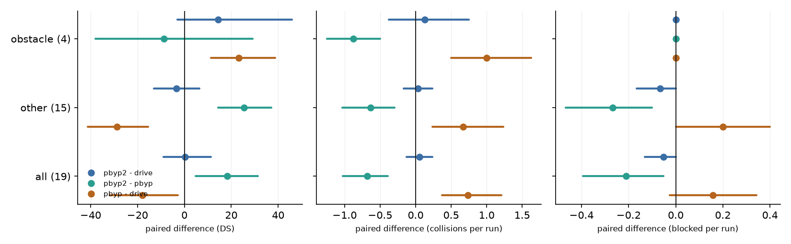
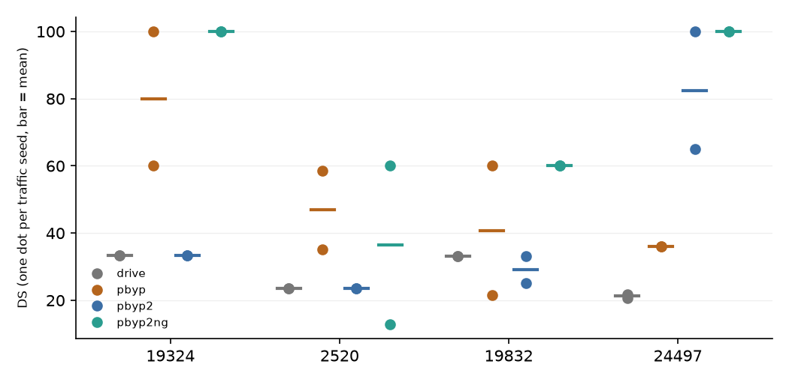

# pbyp2: the privileged bypass with the projection fix, static >= 5 s, red-light memory and a same-direction gap check

Diagnostic batch, 19 routes x 2 traffic seeds. Every number is a read at this size, not a confirmation; registered confirmation lines are listed with their value and marked not evaluated. `drive` and `pbyp` are the existing runs of the earlier batch (not rerun); `pbyp2` ran with the same base configuration. Definitions: [plans/2026-10-02-pbyp2-vred2.md](../plans/2026-10-02-pbyp2-vred2.md); classes of activations: [bypass_misfire.md](bypass_misfire.md).

## Arms

| arm     |   runs |   crashes |    DS |     RC |   red_light |   stop_sign |   collisions |   blocked |   timeouts |   v_mean |
|:--------|-------:|----------:|------:|-------:|------------:|------------:|-------------:|----------:|-----------:|---------:|
| drive   |     38 |         0 | 65.9  |  83.27 |          13 |           2 |           11 |         2 |          0 |     2.2  |
| pbyp    |     38 |         0 | 48.02 |  87.07 |          14 |           0 |           39 |         8 |          0 |     1.82 |
| pbyp2   |     38 |         0 | 66.24 |  86.35 |          14 |           2 |           13 |         0 |          0 |     2.31 |
| pbyp2ng |      8 |         0 | 74.12 | 100    |           0 |           0 |            7 |         0 |          0 |     2.63 |

Official infraction counts summed over the runs; DS, RC and mean speed averaged over runs; 38 runs expected per arm (pbyp2ng, the diagnostic ablation of the section below, ran on the 4 obstacle routes only: 8 runs). `crashes` are program crashes, excluded from the paired reads.

## Paired differences (mean over routes of the per-route mean over the two seeds; [95% route-cluster CI])

Obstacle routes: 24497, 2520, 19324, 19832 (the scenario places a static obstacle); other routes: the remaining 15. Counts are per run, so +0.50 is one extra event in one of the two runs of a route.

| contrast | routes | n routes | DS | RC | collisions | blocked | red light | outside lanes |
|:--|:--|--:|:--|:--|:--|:--|:--|:--|
| pbyp2 - drive | obstacle routes | 4 | +14.33 [-2.98, +45.96] | +21.44 [+0.00, +50.52] | +0.12 [-0.38, +0.75] | +0.00 [+0.00, +0.00] | +0.00 [+0.00, +0.00] | +0.00 [+0.00, +0.00] |
| pbyp2 - drive | other routes | 15 | -3.39 [-13.02, +6.38] | -1.81 [-14.68, +7.75] | +0.03 [-0.17, +0.23] | -0.07 [-0.17, +0.00] | +0.03 [-0.07, +0.13] | +0.07 [+0.00, +0.20] |
| pbyp2 - drive | all routes | 19 | +0.34 [-8.96, +11.32] | +3.08 [-8.93, +14.03] | +0.05 [-0.13, +0.24] | -0.05 [-0.13, +0.00] | +0.03 [-0.05, +0.13] | +0.05 [+0.00, +0.16] |
| pbyp2 - pbyp | obstacle routes | 4 | -8.80 [-37.89, +29.02] | -44.74 [-65.25, -15.96] | -0.88 [-1.25, -0.50] | +0.00 [+0.00, +0.00] | +0.00 [+0.00, +0.00] | -0.25 [-0.75, +0.00] |
| pbyp2 - pbyp | other routes | 15 | +25.43 [+14.44, +37.05] | +11.02 [+2.32, +24.12] | -0.63 [-1.03, -0.30] | -0.27 [-0.47, -0.10] | +0.00 [-0.13, +0.13] | -0.43 [-0.70, -0.17] |
| pbyp2 - pbyp | all routes | 19 | +18.22 [+4.71, +31.40] | -0.72 [-15.50, +14.17] | -0.68 [-1.03, -0.39] | -0.21 [-0.39, -0.05] | +0.00 [-0.11, +0.11] | -0.39 [-0.63, -0.16] |
| pbyp - drive | obstacle routes | 4 | +23.12 [+11.22, +38.68] | +66.18 [+64.60, +67.18] | +1.00 [+0.50, +1.62] | +0.00 [+0.00, +0.00] | +0.00 [+0.00, +0.00] | +0.25 [+0.00, +0.75] |
| pbyp - drive | other routes | 15 | -28.82 [-41.16, -15.51] | -12.83 [-29.36, +0.58] | +0.67 [+0.23, +1.23] | +0.20 [+0.00, +0.40] | +0.03 [+0.00, +0.10] | +0.50 [+0.23, +0.77] |
| pbyp - drive | all routes | 19 | -17.88 [-31.91, -2.77] | +3.80 [-15.80, +22.94] | +0.74 [+0.37, +1.21] | +0.16 [-0.03, +0.34] | +0.03 [+0.00, +0.08] | +0.45 [+0.21, +0.68] |

## DS on the four obstacle routes (the estimate of what a correct bypass is worth)

| arm | mean DS over the 4 routes [95% route CI] | per route (mean of 2 seeds) |
|:--|:--|:--|
| drive | 27.8 [22.4, 33.2] | 19324 33.4, 19832 33.1, 24497 21.2, 2520 23.5 |
| pbyp | 50.9 [38.4, 70.2] | 19324 80.0, 19832 40.8, 24497 36.0, 2520 46.9 |
| pbyp2 | 42.1 [26.0, 69.2] | 19324 33.4, 19832 29.2, 24497 82.5, 2520 23.5 |

pbyp2 - drive on the obstacle routes: +14.33 [-2.98, +45.96]; pbyp2 - pbyp: -8.80 [-37.89, +29.02]. CI of pbyp2 - drive includes 0.

Repeat noise: 13 routes with 2-4 identical `drive` runs: per-route DS standard deviation mean 4.7, median 0.0, max 30.5; 5 of 13 routes changed DS between repeats (results/report.md). A difference whose CI includes 0 is within that noise at this size.

## Per route (mean over the two seeds)

|   route | obstacle   |   DS_drive |   DS_pbyp |   DS_pbyp2 |   collisions_drive |   collisions_pbyp |   collisions_pbyp2 |   vehicle_blocked_drive |   vehicle_blocked_pbyp |   vehicle_blocked_pbyp2 |
|--------:|:-----------|-----------:|----------:|-----------:|-------------------:|------------------:|-------------------:|------------------------:|-----------------------:|------------------------:|
|   15102 |            |     100    |    100    |     100    |                0   |               0   |                0   |                     0   |                    0   |                       0 |
|   15483 |            |     100    |     71.28 |      85    |                0   |               0   |                0   |                     0   |                    0   |                       0 |
|   15612 |            |      47.41 |     29.4  |      85    |                0   |               1   |                0   |                     0.5 |                    0.5 |                       0 |
|   16390 |            |      70    |     29.64 |      70    |                0   |               1   |                0   |                     0   |                    0   |                       0 |
|   16508 |            |     100    |     67.04 |     100    |                0   |               0   |                0   |                     0   |                    0   |                       0 |
|   16529 |            |      70    |     39.4  |      70    |                0   |               0.5 |                0   |                     0   |                    0.5 |                       0 |
|   17280 |            |      80    |      1.26 |      80    |                0   |               1   |                0   |                     0   |                    1   |                       0 |
|   19324 | yes        |      33.36 |     80    |      33.36 |                0   |               0.5 |                0   |                     0   |                    0   |                       0 |
|   19832 | yes        |      33.14 |     40.8  |      29.16 |                0   |               2   |                1   |                     0   |                    0   |                       0 |
|   22535 |            |     100    |     60    |     100    |                0   |               1   |                0   |                     0   |                    0   |                       0 |
|   24497 | yes        |      21.22 |     36    |      82.5  |                1   |               2   |                0.5 |                     0   |                    0   |                       0 |
|   24944 |            |      70    |     54.4  |      56    |                0   |               0.5 |                0.5 |                     0   |                    0   |                       0 |
|    2520 | yes        |      23.5  |     46.91 |      23.5  |                1   |               1.5 |                1   |                     0   |                    0   |                       0 |
|   27043 |            |      60    |     60    |      60    |                1   |               1   |                1   |                     0   |                    0   |                       0 |
|   27297 |            |      70    |      7.07 |      47.6  |                0   |               4   |                1   |                     0   |                    1   |                       0 |
|   27870 |            |      85    |     38.45 |      70    |                0   |               1   |                0   |                     0   |                    1   |                       0 |
|   28147 |            |     100    |    100    |     100    |                0   |               0   |                0   |                     0   |                    0   |                       0 |
|   37969 |            |      60    |      8.66 |      11.13 |                1   |               1.5 |                1   |                     0   |                    0   |                       0 |
|    9196 |            |      28.44 |     42    |      55.25 |                1.5 |               1   |                0.5 |                     0.5 |                    0   |                       0 |

## Activations by class (classes of results/bypass_misfire.md)

| class | pbyp non-target | pbyp2 non-target | pbyp obstacle routes | pbyp2 obstacle routes |
|:--|--:|--:|--:|--:|
| scenario_obstacle | 0 | 0 | 8 | 8 |
| behind_route_start | 8 | 0 | 4 | 0 |
| beyond_route_end | 14 | 0 | 3 | 0 |
| red_light_queue | 3 | 0 | 0 | 0 |
| moving_traffic_pause | 1 | 0 | 1 | 0 |
| all | 26 | 0 | 16 | 8 |

Non-target = 15 routes x 2 seeds, obstacle = 4 routes x 2 seeds. `scenario_obstacle` = the scenario's own static obstacle (correct); every other class is a misfire. Cones that the ego's own contact pushed above the 0.5 m/s of the `never moves` rule would be labelled `moving_traffic_pause` by the old classifier; they are counted as `scenario_obstacle` (blocker is a `static.prop` on an obstacle route): 2 activations of pbyp2, 0 of pbyp relabelled.

### Every pbyp2 activation

| route | seed | t0 [s] | class | blocker | blocker s | ext [m] | ego s | ego v | lane | static for [s] | resumes after [s] | outcome within 15 s | events in episode |
|:--|--:|--:|:--|:--|--:|--:|--:|--:|:--|--:|--:|:--|:--|
| 19324 | 0 | 5.0 | scenario_obstacle | vehicle.dodge.charger_police_2020 | 52.1 | - | 0.0 | 0.0 | same dir | 5.0 | - | none_in_15s |  |
| 19324 | 1 | 5.0 | scenario_obstacle | vehicle.dodge.charger_police_2020 | 52.1 | - | 0.0 | 0.0 | same dir | 5.0 | - | none_in_15s |  |
| 19832 | 0 | 5.0 | scenario_obstacle | vehicle.mercedes.coupe_2020 | 52.0 | - | 0.0 | 0.0 | same dir | 5.0 | - | none_in_15s | collisions_vehicle@167.5;collisions_vehicle@167.5 |
| 19832 | 1 | 5.0 | scenario_obstacle | vehicle.mercedes.coupe_2020 | 52.0 | - | 0.0 | 0.0 | same dir | 5.0 | - | none_in_15s |  |
| 24497 | 0 | 13.7 | scenario_obstacle | static.prop.trafficwarning | 47.9 | - | 24.2 | 0.1 | same dir | 5.0 | - | none_in_15s |  |
| 24497 | 1 | 13.7 | scenario_obstacle | static.prop.trafficwarning | 47.9 | - | 23.3 | 0.0 | same dir | 5.0 | - | none_in_15s | collisions_layout@37.5 |
| 2520 | 0 | 14.1 | scenario_obstacle | static.prop.trafficwarning | 52.0 | - | 21.4 | 0.0 | same dir | 5.0 | - | none_in_15s | collisions_layout@32.2 |
| 2520 | 1 | 14.1 | scenario_obstacle | static.prop.trafficwarning | 52.0 | - | 22.4 | 0.0 | same dir | 5.0 | - | none_in_15s | collisions_layout@40.2 |

## Suppression and gap-hold diagnostics (runs with at least one of them; snapshots are 0.2 s)

|   route |   seed |   activations |   gap_hold_snapshots |   red_memory_snapshots |   max_outside_m |
|--------:|-------:|--------------:|---------------------:|-----------------------:|----------------:|
|   24944 |      0 |             0 |                    0 |                      2 |               0 |
|   24497 |      0 |             1 |                   24 |                      0 |               0 |
|   24497 |      1 |             1 |                   99 |                      0 |               0 |
|   19324 |      0 |             1 |                  888 |                      0 |               0 |
|   19324 |      1 |             1 |                  878 |                      0 |               0 |
|    2520 |      0 |             1 |                  862 |                      0 |               0 |
|    2520 |      1 |             1 |                  858 |                      0 |               0 |
|   19832 |      0 |             1 |                  894 |                      0 |               0 |
|   19832 |      1 |             1 |                  929 |                      0 |               0 |

Activations with a blocker outside the route: 0. Activations before the ego first moved on a route without a scenario obstacle: 0 .

## Collisions of pbyp2 on the obstacle routes

One row per (route, seed, actor, time); `xN` = the number of official collision records of that contact (the leaderboard records each contact event).
| route | seed | t [s] | against | actor direction | actor v | ego v | phase vs the obstacle | path shifted | ego lat [m] | actor lat [m] | closing speed (+ = ego approaching) | activation class |
|:--|--:|--:|:--|:--|--:|--:|:--|--:|--:|--:|--:|:--|
| 19832 | 0 | 167.5 (x2) | vehicle.mercedes.coupe_2020 3697 | same direction | 0.0 | 0.3 | entering (ramp) | no | -0.3 | 1.1 | 0.3 | scenario_obstacle |
| 2520 | 0 | 32.2 (x1) | static.prop.trafficwarning 3697 | same direction | 0.3 | 0.3 | entering (ramp) | no | -0.6 | 0.2 | 0.1 | scenario_obstacle |
| 24497 | 1 | 37.5 (x1) | static.prop.trafficwarning 122 | same direction | 0.0 | 0.0 | entering (ramp) | yes | -1.3 | -0.0 | -0.0 | scenario_obstacle |
| 2520 | 1 | 40.2 (x1) | static.prop.trafficwarning 3697 | same direction | 0.0 | 0.0 | entering (ramp) | no | -0.5 | 0.0 | -0.0 | scenario_obstacle |

Phases: before ramp / entering (ramp) = pulling out, abeam obstacle, just past obstacle, returning, after return; `no state yet` and `cleared` are outside an active bypass state. Old pbyp for comparison: 12 collisions on these routes, 5 while pulling into the adjacent lane against same-direction vehicles (results/bypass_misfire.md section 5).

## Collisions of pbyp2 on the other routes

| route | seed | kind | t [s] | against | in activation episode of class | drive collisions in the paired run |
|:--|--:|:--|--:|:--|:--|--:|
| 24944 | 0 | collisions_vehicle | 52.5 | vehicle.nissan.patrol_2021 | outside any activation | 0 |
| 27043 | 0 | collisions_vehicle | 19.3 | vehicle.mini.cooper_s_2021 | outside any activation | 1 |
| 27297 | 0 | collisions_vehicle | 12.6 | vehicle.dodge.charger_2020 | outside any activation | 0 |
| 27297 | 0 | collisions_vehicle | 12.6 | vehicle.dodge.charger_2020 | outside any activation | 0 |
| 37969 | 0 | collisions_layout | 21.4 | static.terrain | outside any activation | 1 |
| 27043 | 1 | collisions_vehicle | 23.2 | vehicle.ford.mustang | outside any activation | 1 |
| 37969 | 1 | collisions_layout | 18.3 | static.terrain | outside any activation | 1 |
| 9196 | 1 | collisions_vehicle | 29.8 | vehicle.carlamotors.firetruck | outside any activation | 2 |

## Diagnostic ablation: pbyp2ng = pbyp2 without any gap check (obstacle routes only)

Added after the pbyp2 batch showed the frozen same-direction gap rule stalling the car on three of the four obstacle routes (plans section 10). Same projection fix, static >= 5 s and light memory as pbyp2; no same-direction check and no oncoming-lane check. 4 obstacle routes x 2 seeds = 8 runs; a diagnostic read of what the corrected activation alone is worth.

| contrast | routes | n routes | DS | RC | collisions | blocked |
|:--|:--|--:|:--|:--|:--|:--|
| pbyp2ng - drive | obstacle routes | 4 | +46.32 [+19.92, +72.71] | +66.18 [+64.60, +67.18] | +0.38 [-0.50, +1.25] | +0.00 [+0.00, +0.00] |
| pbyp2ng - pbyp2 | obstacle routes | 4 | +31.99 [+15.24, +54.36] | +44.74 [+15.96, +65.25] | +0.25 [-0.38, +1.12] | +0.00 [+0.00, +0.00] |
| pbyp2ng - pbyp | obstacle routes | 4 | +23.19 [-2.82, +52.80] | +0.00 [+0.00, +0.00] | -0.62 [-1.62, +0.50] | +0.00 [+0.00, +0.00] |

| arm | mean DS over the 4 routes [95% route CI] | per route (mean of 2 seeds) |
|:--|:--|:--|
| drive | 27.8 [22.4, 33.2] | 19324 33.4, 19832 33.1, 24497 21.2, 2520 23.5 |
| pbyp | 50.9 [38.4, 70.2] | 19324 80.0, 19832 40.8, 24497 36.0, 2520 46.9 |
| pbyp2 | 42.1 [26.0, 69.2] | 19324 33.4, 19832 29.2, 24497 82.5, 2520 23.5 |
| pbyp2ng | 74.1 [48.2, 100.0] | 19324 100.0, 19832 60.0, 24497 100.0, 2520 36.5 |

Activations:

| route | seed | t0 [s] | class | blocker | ego s | ego v | outcome within 15 s | events in episode |
|:--|--:|--:|:--|:--|--:|--:|:--|:--|
| 19324 | 0 | 5.0 | scenario_obstacle | vehicle.dodge.charger_police_2020 | 0.0 | 0.0 | none_in_15s |  |
| 19324 | 1 | 5.0 | scenario_obstacle | vehicle.dodge.charger_police_2020 | 0.0 | 0.0 | none_in_15s |  |
| 19832 | 0 | 5.0 | scenario_obstacle | vehicle.mercedes.coupe_2020 | 0.0 | 0.0 | none_in_15s | collisions_vehicle@22.1 |
| 19832 | 1 | 5.0 | scenario_obstacle | vehicle.mercedes.coupe_2020 | 0.0 | 0.0 | none_in_15s | collisions_vehicle@21.7 |
| 24497 | 0 | 13.7 | scenario_obstacle | static.prop.trafficwarning | 24.2 | 0.0 | none_in_15s |  |
| 24497 | 1 | 13.7 | scenario_obstacle | static.prop.trafficwarning | 23.0 | 0.0 | none_in_15s |  |
| 2520 | 0 | 14.1 | scenario_obstacle | static.prop.trafficwarning | 22.1 | 0.0 | collision | collisions_vehicle@21.6 |
| 2520 | 1 | 14.1 | scenario_obstacle | static.prop.trafficwarning | 22.0 | 0.0 | collision | collisions_vehicle@21.5;collisions_vehicle@21.5;collisions_vehicle@21.5;collisions_vehicle@21.5 |

Collisions:

| route | seed | t [s] | against | actor direction | actor v | ego v | phase vs the obstacle | path shifted | ego lat [m] | actor lat [m] | activation class |
|:--|--:|--:|:--|:--|--:|--:|:--|--:|--:|--:|:--|
| 19832 | 0 | 22.1 (x1) | vehicle.chevrolet.impala 3723 | same direction | 6.9 | 2.2 | entering (ramp) | yes | -1.0 | -3.2 | scenario_obstacle |
| 2520 | 0 | 21.6 (x1) | vehicle.ford.mustang 3750 | same direction | 2.3 | 5.8 | entering (ramp) | yes | -1.8 | -3.4 | scenario_obstacle |
| 19832 | 1 | 21.7 (x1) | vehicle.chevrolet.impala 3723 | same direction | 9.7 | 1.4 | entering (ramp) | yes | -0.9 | -3.2 | scenario_obstacle |
| 2520 | 1 | 21.5 (x4) | vehicle.ford.mustang 3750 | same direction | 6.0 | 6.2 | entering (ramp) | yes | -1.4 | -3.3 | scenario_obstacle |

## Registered lines (plan 4.3), pbyp2

| line | read | status |
|:--|:--|:--|
| harmless on non-target routes: DS CI lower bound >= -5, no new blocked, no new collision | DS -3.39 [-13.02, +6.38]; blocked -2, collisions +1 | not evaluated at this size (15 routes < 30) |
| useful on target routes: DS CI lower bound > 0 | DS +14.33 [-2.98, +45.96]; collisions +1, blocked +0 | not evaluated at this size (4 routes < 30) |

Figure: paired differences per route set (dot: mean over routes, bar: 95% route-cluster CI) for pbyp2 - drive, pbyp2 - pbyp and the old pbyp - drive; DS on the left, collisions per run in the middle, blocked per run on the right. Look at the `other routes` rows (did the loss of old pbyp disappear) and at whether the obstacle-route bars still clear zero.

Figure: DS of the four obstacle routes, one dot per traffic seed for drive, pbyp and pbyp2 (bar: mean of the two seeds). Look at how far pbyp2 sits above drive on each route and whether the two seeds agree.

