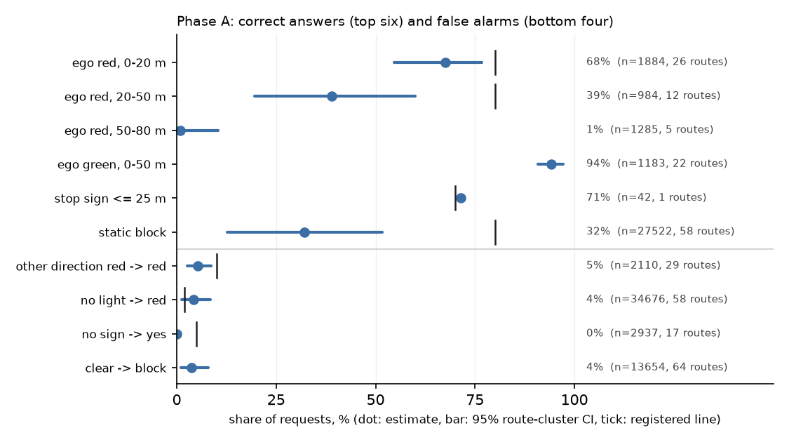

# Phase A (final): VLM answers against ground truth, 41333 requests, 64 routes

| readout | value [95% CI] | requests | routes | registered line | pass |
|:--|:--|--:|--:|:--|:--|
| ego red / yellow answered red, 0-50 m | 57.8% [45.0, 68.2] | 2868 | 26 | >= 80% | **no** |
| ... 0-20 m | 67.6% [54.6, 76.8] | 1884 | 26 |  |  |
| ... 20-50 m | 38.9% [19.5, 60.0] | 984 | 12 |  |  |
| ... 50-80 m (listed, not scored) | 0.9% [0.0, 10.5] | 1285 | 5 |  |  |
| ego red / yellow answered green, 0-50 m | 25.8% [14.4, 40.8] | 2868 | 26 |  |  |
| ... route 27043 alone (old frames) | 86.5% [86.5, 86.5] | 104 | 1 |  |  |
| ego green answered green, 0-50 m | 94.2% [90.9, 97.3] | 1183 | 22 |  |  |
| another direction red, ego not red: answered red | 5.2% [2.7, 8.7] | 2110 | 29 | <= 10% | yes |
| ... new frames only (lights logged) | 4.4% [1.9, 8.1] | 980 | 15 |  |  |
| answer light_for_other_lane, any frame | 0.2% [0.1, 0.3] | 41333 | 64 |  |  |
| no light: answered red | 4.3% [1.2, 8.5] | 34676 | 58 | <= 2% | **no** |
| no light: answered green | 3.2% [1.4, 5.4] | 34676 | 58 |  |  |
| check: ego green -> another light red (new frames) | 100.0% [100.0, 100.0] | 175 | 8 |  |  |
| stop sign within 25 m answered yes | 71.4% [71.4, 71.4] | 42 | 1 | >= 70% | yes |
| no stop sign within 80 m answered yes | 0.0% [0.0, 0.0] | 2937 | 17 | <= 5% | yes |
| stop sign 25-80 m answered yes (listed) | 0.5% [0.0, 5.6] | 199 | 2 |  |  |
| static block answered static_block | 32.2% [12.7, 51.6] | 27522 | 58 | >= 80% | **no** |
| clear answered static_block | 3.7% [1.1, 7.9] | 13654 | 64 |  |  |
| bypass side correct given block seen (new frames) | 20.4% [19.0, 21.8] | 705 | 2 |  |  |

Latency over 41333 requests: p50 349 ms, p95 641 ms, p99 2060 ms (line: p95 <= 600 ms: **no**); answered 100.0%. L for Phase B = 0.65 s.
Green after red: 63 transitions, 0 never reached K = 2 green answers, median delay 0.5 s.

Gates: Q-light FAIL, Q-sign pass, Q-block FAIL, latency FAIL.

Requests by source: new 3178 (19 routes), old 38155 (58 routes)

Q-light confusion (rows: truth within 50 m, else no_light / far; columns: answer):

| row_0         |   green_for_ego |   light_for_other_lane |   no_light |   red_or_yellow_for_ego |
|:--------------|----------------:|-----------------------:|-----------:|------------------------:|
| green         |            1197 |                      5 |         31 |                      72 |
| light 50-80 m |              95 |                      8 |       1435 |                      11 |
| no_light      |            1148 |                     32 |      32778 |                    1524 |
| red_or_yellow |             757 |                     18 |        459 |                    1763 |

Request accounting on the new frames (deviation D14; not a gate). `pending` = still in flight when the route ended (frames saved, no answer line); `dropped` = no answer although a later request was answered; `unanswered` = 1 - answered / issued; `lost` = (dropped + failed) / issued, the rate the unit check holds <= 2%.

| unit | routes | issued | answered | pending at route end | dropped | failed | unanswered (worst route) | lost | latency p50 / p95 ms | latency > 2.5 s (TTL) |
|:--|--:|--:|--:|--:|--:|--:|--:|--:|--:|--:|
| v2-drive-s0-tgt | 6 | 316 | 292 | 24 | 0 | 0 | 7.6% (17.6%) | 0.0% | 1377 / 3593 | 29.5% |
| v2-drive-s1-dev | 10 | 1332 | 1308 | 24 | 0 | 0 | 1.8% (13.7%) | 0.0% | 564 / 3366 | 11.2% |
| v2-drive-s1-tgt | 9 | 1595 | 1578 | 17 | 0 | 0 | 1.1% (10.2%) | 0.0% | 500 / 3057 | 6.7% |
| all new units | 25 | 3243 | 3178 | 65 | 0 | 0 | 2.0% (17.6%) | 0.0% | 543 / 3314 | 10.6% |
| old frames |  |  | 38155 |  |  |  |  |  | 339 / 594 | 0.0% |

Figure: share of correct answers (top six) and of false alarms (bottom four) with 95% route-cluster intervals; the tick on a row is its registered line. Look at which dots sit on the wrong side of their tick.
