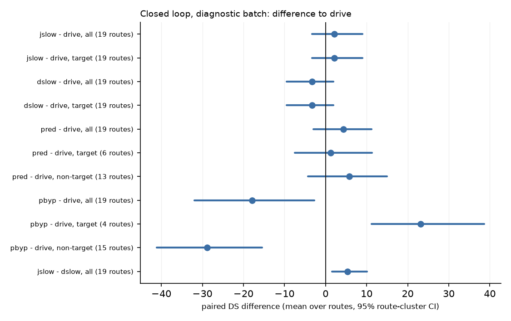

# vlm_arb closed loop: diagnostic batch (19 routes x 2 traffic seeds)

Every number here is a diagnostic read on a small batch, not a confirmation. Registered confirmation lines are listed with their value and marked not evaluated at this size.

## Arms

| arm   |   runs |   crashes |    DS |    RC |   red_light |   stop_sign |   collisions |   blocked |   timeouts |   scenario_timeouts |   v_mean |
|:------|-------:|----------:|------:|------:|------------:|------------:|-------------:|----------:|-----------:|--------------------:|---------:|
| drive |     38 |         0 | 65.9  | 83.27 |          13 |           2 |           11 |         2 |          0 |                   0 |     2.2  |
| jslow |     38 |         0 | 68.02 | 83.97 |          11 |           2 |           10 |         0 |          0 |                   0 |     2.02 |
| dslow |     38 |         0 | 62.65 | 79.54 |          15 |           2 |           10 |         2 |          0 |                   0 |     1.98 |
| pred  |     38 |         0 | 70.23 | 83.99 |           5 |           2 |           13 |         0 |          0 |                   0 |     1.87 |
| pbyp  |     38 |         0 | 48.02 | 87.07 |          14 |           0 |           39 |         8 |          0 |                   0 |     1.82 |

Expected runs per arm: 38. Official infraction counts (Bench2Drive results.json); `crashes` are program crashes by official status, excluded from the paired reads.

## Paired differences (DS unless the set says RC), mean over routes [95% route-cluster CI]

| contrast | routes | difference | routes n | pairs | d collisions | d red light | d stop sign | d blocked |
|:--|:--|:--|--:|--:|--:|--:|--:|--:|
| jslow - drive | all | +2.12 [-3.29, +9.00] | 19 | 38 | -1 | -2 | +0 | -2 |
| jslow - drive | target | +2.12 [-3.29, +9.00] | 19 | 38 | -1 | -2 | +0 | -2 |
| jslow - drive | target RC | +0.71 [-5.19, +6.16] | 19 | 38 | -1 | -2 | +0 | -2 |
| dslow - drive | all | -3.25 [-9.53, +1.89] | 19 | 38 | -1 | +2 | +0 | +0 |
| dslow - drive | target | -3.25 [-9.53, +1.89] | 19 | 38 | -1 | +2 | +0 | +0 |
| dslow - drive | target RC | -3.73 [-13.91, +3.84] | 19 | 38 | -1 | +2 | +0 | +0 |
| pred - drive | all | +4.33 [-3.00, +11.16] | 19 | 38 | +2 | -8 | +0 | -2 |
| pred - drive | target | +1.26 [-7.50, +11.29] | 6 | 12 | +0 | +1 | +0 | -1 |
| pred - drive | non-target | +5.75 [-4.26, +14.94] | 13 | 26 | +2 | -9 | +0 | -1 |
| pred - drive | target RC | +5.38 [+0.00, +16.13] | 6 | 12 | +0 | +1 | +0 | -1 |
| pbyp - drive | all | -17.88 [-31.91, -2.77] | 19 | 38 | +28 | +1 | -2 | +6 |
| pbyp - drive | target | +23.12 [+11.22, +38.68] | 4 | 8 | +8 | +0 | +0 | +0 |
| pbyp - drive | non-target | -28.82 [-41.16, -15.51] | 15 | 30 | +20 | +1 | -2 | +6 |
| pbyp - drive | target RC | +66.18 [+64.60, +67.18] | 4 | 8 | +8 | +0 | +0 | +0 |
| jslow - dslow | all | +5.37 [+1.60, +10.08] | 19 | 38 | +0 | -4 | +0 | -2 |

Speed match: mean speed drive 2.20, jslow 2.02, dslow 1.98 m/s; per run |dslow - jslow| mean 0.32 m/s (38 runs).

## Retention of the privileged gain (target routes)

- vbyp / pbyp, RC: not run (gate)
- vbyp / pbyp, DS: not run (gate)
- vred / pred, DS: not run (gate)

## Repeat noise (identical drive runs, traffic seed 0)

13 routes with 2-4 identical runs: per-route DS standard deviation mean 4.7, median 0.0, max 30.5; 5 of 13 routes changed DS between repeats. A paired difference inside this spread is not a finding.

## Registered lines (plan 4.3)

| line | read | status |
|:--|:--|:--|
| harmless, pred on non-target routes: CI lower bound >= -5, no new blocked, no new collision | +5.75 [-4.26, +14.94]; blocked -1, collisions +2 | not evaluated at this size (13 routes < 30) |
| harmless, pbyp on non-target routes: CI lower bound >= -5, no new blocked, no new collision | -28.82 [-41.16, -15.51]; blocked +6, collisions +20 | not evaluated at this size (15 routes < 30) |
| useful, vred | not run: its Phase A question did not pass | not evaluated |
| useful, vbyp | not run: its Phase A question did not pass | not evaluated |
| jslow separation: vs drive and vs dslow | vs drive +2.12 [-3.29, +9.00]; vs dslow +5.37 [+1.60, +10.08] | not evaluated at this size (19 routes < 30) |
| stacking, vall | not run: Q-light did not pass | not evaluated |

Figure: paired DS difference to drive per arm on all, target and non-target routes (dot: mean over routes, bar: 95% route-cluster CI). Look at whether a bar clears zero and how wide it is against the repeat noise above.

See also [phase_a.md](phase_a.md).

See also [lightsweep.md](lightsweep.md).
