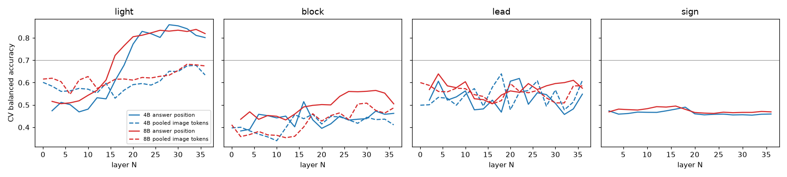

# vlm_cmp: Qwen3-VL-4B against 8B as the slow-channel model, offline, same frames

Plan and pre-registration: [../plans/2026-10-03-vlm-4b-vs-8b.md](../plans/2026-10-03-vlm-4b-vs-8b.md) (frozen before any answer was read). Code: `scripts/vlm_cmp_*.py`.
Run: `$DATA_DIR/runs/vlm_cmp/main/20261002-232404` (box wall clock about 2 h 20 min on GPU 0: extraction 82 min, two-frame 24 min, heads 8 min, latency bench 25 min).
The summary block is hand-written; everything after the line "Generated tables" is produced by `scripts/vlm_cmp_report.py` from the run dir.

## Summary

**Data.** 33 806 framed requests exist (21 routes, 42 units, 214 attempts); the run uses a deterministic quota sample, the **core set of 1 263 requests on all 21 routes**
(test 528, val 265, train 470; 696 two-frame instants), every event instant (yellow onset, red onset, red to green) kept, hold and queue frames down-weighted. Rates are rates of this
sample. Both models: same frames, same code path (GPU decode, one prefill of the images per frame shared by all question suffixes, option scoring at a forced `ANSWER:`,
float32 output head), bf16, batch 1. Resolutions are the earlier 559 / 1153 / 2335 / native token budgets (about 553 / 1147 / 2.3k / 4.5k tokens with the prompt). Route-cluster CIs, 21 routes, many rows come from 2 routes (stop signs, cones, stopped vehicles): those say "too few routes".

**4B vs 8B at 1153 tokens (the closed-loop server's setting), paired, same frames** (points; CI in brackets):

| capability | 4B | 8B | 8B - 4B | latency 8B / 4B |
|:--|:--|:--|:--|:--|
| ego red answered red | 90% | 78% | **-12 [-23, -1]** (4B better) | 1.67 (211 vs 126 ms p50, one question) |
| ego red answered green (false release) | 5% | 17% | **+12 [+3, +24]** (4B better); at every resolution 8B is worse here | |
| ego green answered green | 81% | 84% | +3 [-2, +10] noise (at native: 93 vs 95, noise) | |
| other-direction red answered red / no light answered red | 15% / 0% | 14% / 0% | noise / identical | |
| stop sign within 25 m / false yes | 49% / 2% | 49% / 3% | identical (2 routes) | |
| static block, cones / stopped vehicles / queues | 97% / 0% / 0% | 69% / 0% / 0% | cones -27 (2 routes); stopped vehicle 0% for both at every resolution and in the two-frame run | |
| moving lead answered moving_lead | 38% | 64% | **+26 [+7, +54]** (8B better) | |
| bypass side correct (99% of truth is left_free) | 59% | 37% | **-22 [-35, -13]** (8B answers none_free more) | |
| directive prompt, strict accuracy | 25% | 32% | **+6 [+2, +12]** (both far below the composition) | 1.58 (254 vs 161 ms) |
| directive composed from the separate questions, strict | 66% | 64% | -2 [-7, +4] noise | 1.44 (302 vs 209 ms, four questions on one prefill) |
| two-frame directive, strict (696 instants) | 49% | 47% | -1 [-13, +6] noise | 1.62 (453 vs 279 ms) |

Where the 8B buys something: recognising a moving lead (single frame, +12 to +31 points depending on resolution, CI above 0 at every resolution) and, in the two-frame run, keeping the light reading intact
(ego green answered green 83% vs 61% for the 4B at the same instants; red onset answered red 72% vs 54%; moving lead 62% vs 5%). It does not buy a better ego-red reading: it is lower than the 4B at every resolution
(recall -6 to -12 points, red answered green +5 to +12 points, CI above 0 at 559, 1153, 2335 and native, within noise at some position rows) and the false-release row is the one that decided
the closed loop. It costs 1.4 to 1.7 times the latency at every setting (one question 211 / 126 ms, p95 within 1-2 ms of p50 for both) and 1.9 times the memory
(18.7 against 9.8 GiB resident, 19.0 against 10.1 GiB peak at 1153 tokens; both numbers include a 1.4 / 2.3 GiB float32 head copy that a deployment would not need).
**Inside the noise:** ego green recall, other-direction red, no-light false alarms, stop-sign rows, side-by-composition rows, composed directive accuracy at 559-2335, two-frame accuracy 8B vs 4B.
No capability row shows the 8B clearly better on the thing the stack needs most (an ego red that is not read as green).

**Directive prompt vs separate questions.** The one-prompt directive is far worse than the same models' separate answers combined by the stack's own priority order (strict 25% / 32% against 66% / 64%; accepted 44% / 49% against 74% / 73%).
The failure is systematic, not noise: both models answer `slow` for most `proceed` and half of `stop_at_line` rows, `stop_at_line` for 207 of 234 stopped-on-green rows (`go_now` recall 1% / 11%), never `pass_left` (0 of 147 strict rows; the 8B answers `wait` for 80 of 197 pass_left rows), and the stopped-vehicle blocks are not seen by either model. What the directive prompt does well: `slow` at junctions (recall 72% / 23%, the composition cannot answer it) and `stop_at_line` for a stopped car on red (99%). The prompt is the single registered wording; no wording search was made, so this is a floor for this prompt, not a statement about all directive prompts.

**What two frames add** (previous directive stated in the prompt, same instants): directive strict accuracy 20% -> 49% (4B, +29 [+18, +40]) and 26% -> 47% (8B, +21 [+13, +30]); red to green after holding: `go_now` 1% -> 59% (4B) and 9% -> 64% (8B), but this mostly comes from the prompt text that carries the previous directive and the "keep it until clearly green" rule: the 4B's light answer for the same instants **falls** (77% -> 49%) while the 8B's does not (83% -> 81%). Yellow onset: no usable gain, 3 routes, directive stop_at_line 24 -> 37% (4B), 51 -> 29% (8B), CIs span 0. Red onset after green: lower, not higher (4B light 84 -> 54%, 8B 84 -> 72%). Stopped lead versus moving lead: the single frame scored 0% on stopped leads (static_block) and the two-frame prompt also scores 0% (0 of 120 for both models), and the 4B's moving-lead answer collapses (59% -> 5% when moving); the 8B holds 62%. Latency cost of the second moment: x1.73 (4B, 161 -> 279 ms directive) and x1.78 (8B, 254 -> 453 ms). Verdict: a previous-directive hold rule can be carried in the prompt (the held-on-red rows stay at 99-100%), but a second frame does not make the models see a yellow onset or a stopped lead, and for the 4B it hurts the light read.

**Layer at which each label is linearly readable** (CV balanced accuracy within 0.05 of the best layer and at least 0.70; in-domain supervised, not zero-shot): ego light state from the answer position of the light prompt: 4B layer 20-24 (22 at 1153), 8B layer 18-32 (20 at 1153), the 8B's curve is ahead by 0.09-0.11 at layers 16-18 (CI above 0), equal from layer 22. Cutting at layer 22 (4B, 1153 tokens) costs 92 / 93 ms against 126 ms full (-27%) with CV balanced accuracy 0.83 [0.76, 0.90] against 0.87 [0.81, 0.92] zero-shot: no gain over the zero-shot reading, as in `vlm_thin.md`; test (8 routes) 0.80 (table 5.1). The 8B at layer 20: 142 / 144 ms against 211 (-33%), CV 0.81, test 0.73. Pooled image tokens: not readable at 1153 (best 0.68, both models), 0.68-0.72 at the larger sizes. **Stop sign, static block and lead moving-or-stopped are not linearly readable at any layer in either model** (best CV balanced accuracy 0.49-0.51 / 0.46-0.59 / 0.58-0.68); the sign has 2 routes and the block label is confounded with the route (cones on 2 routes, stopped vehicles on 2), so this says "not readable with 21 routes", not "not in the features". The zero-shot balanced accuracies printed beside the lead rows count a "clear" answer as wrong and are not comparable to the heads.

**Latency and memory** (batch 1, JPEG bytes in, answer out, GPU 0 alone, n = 100): one question, one pass: 4B 70 / 126 / 254 / 565 ms and 8B 115 / 211 / 438 / 942 ms at 559 / 1153 / 2335 / native tokens (p95 within 1-2 ms); the p95 <= 600 ms line holds for the 8B up to 2335 tokens. Four separate questions on one prefill: 4B 209 ms, 8B 302 ms at 1153. Directive: 161 / 254 ms. Two-moment directive: 279 / 453 ms. Weights 9.8 / 18.7 GiB resident (including the float32 head copy), peak 10.0 / 18.9 GiB at 1153 and 10.6 / 19.6 GiB at native.

**Deviations from the brief.** (1) Core set of 1 263 requests of 33 806, not all (cost: 8B extraction 3.4 s per frame for four resolutions and five questions); every route and every event instant kept. (2) One card (GPU 0), both models extracted at the same time on it (latency measured afterwards, alone, one model at a time); GPU 1 and GPU 2 not used. (3) Two-frame run only at 1153 tokens (four images, about 2 300 tokens), not at all four resolutions. (4) The zero-shot option scores use a prefix cache shared by all questions of a frame; checked equal to a full forward on 8 frame-resolution pairs per model (same answer in all, first-token log-probability differences up to 0.75 nats (4B) / 1.08 nats (8B) from bf16 kernel rounding, hidden-state relative difference <= 0.008) and to the earlier `vlm_thin` 4B cache on the 10 overlapping frames (same answer, probability difference <= 0.023). (5) No pass_right frame exists and `wait` has 7 rows; the bypass-side and `wait` / `pass_right` directives cannot be scored. (6) The sign head cannot be fitted on the registered split (both sign routes are test routes): CV only, 2 routes.

**Verified vs inferred.** Verified: every number in the tables is computed from the cached option log-probabilities and the logged ground truth; latencies and memory are measured; the equivalence checks above ran. Inferred: that the 8B's weaker red reading comes from the model and not from the prompt wording (one wording was used, no search); that the directive failures are properties of this prompt; that the not-readable labels would stay unreadable with more routes. Not tested: closed-loop effect, any other prompt wording, 8B with a different light question, other 8B checkpoints.

Latency note: the cut-latency rows of the 4B at 559 tokens, layers 26-32, show a p95 of 84-88 ms against p50 58-65: a transient disturbance during that point of the bench (another job on the box); the p50 values follow the trend of the neighbouring layers.

---
Generated tables (`scripts/vlm_cmp_report.py`; the "visual tokens" figure in the headings of section 2 is not filled in by the script, see the summary for the token counts).

## 1. Frames

Core set of 1263 requests on 21 routes (train 470, val 265, test 528), 1197 with an earlier frame, 696 two-frame instants. Requests per route and category are in `frames.csv` of the run dir. The all-request count was 33 806 (plan section 2).

Directive truth of the core set: proceed 271, slow 57, stop_at_line 497, go_now 234, pass_left 197, pass_right 0, wait 7; rows without an ambiguity note (strict): 833 of 1263. Ambiguity notes: red_past_line 128, green_moving 116, yellow 61, block_not_a_scenario 57, moving_lead 36, sign_stopped 32.

Requests by position of the car (ego light within range): red A 274 / B 128 / C 9, green A 240 / B 97 / C 13.

## 2. Zero-shot readings, one forward pass with option scoring (same frames, same code path)

How to read: each cell is the rate of the named answer among the rows of the named truth, with the route-cluster CI, hits / rows and, in brackets, the number of routes the rows come from. `8B - 4B` is the paired difference in percentage points on the same rows; `read` is mechanical (CI above 0 = 8B higher, below 0 = 4B higher, else within noise; fewer than 3 routes = too few routes). Position A / B / C = before the stop line / between line and junction entrance / inside the junction. Directive rows are scored against the truth mapping of plan section 3; `composed` is the directive built from the separate questions (never answers `slow`).

### 2.1 Resolution r559

| readout | 4B | 8B | 8B - 4B (points) | read |
|:--|:--|:--|:--|:--|
| ego red answered red, all | 91% [81, 99] 372/411 (13) | 83% [71, 96] 341/411 (13) | -7.5 [-16.3, -0.9] | lower |
| ... 0-20 m | 96% [92, 99] 348/364 (13) | 88% [76, 97] 319/364 (13) | -8.0 [-17.6, -0.7] | lower |
| ... 20-50 m | 51% [32, 100] 24/47 (2) | 47% [29, 92] 22/47 (2) | -4.3 [-7.7, -2.9] | too few routes |
| ... position A before the stop line | 89% [80, 99] 245/274 (11) | 81% [67, 98] 221/274 (11) | -8.8 [-20.4, +0.9] | within noise |
| ... position B between line and junction entrance | 97% [93, 100] 124/128 (10) | 91% [82, 99] 116/128 (10) | -6.2 [-13.8, -1.3] | lower |
| ... position C inside the junction | 33% [33, 33] 3/9 (1) | 44% [44, 44] 4/9 (1) | +11.1 [+11.1, +11.1] | too few routes |
| ego red answered green, all | 5% [1, 8] 19/411 (13) | 12% [3, 23] 50/411 (13) | +7.5 [+1.5, +16.3] | higher |
| ... position A | 5% [1, 9] 15/274 (11) | 15% [2, 28] 40/274 (11) | +9.1 [+0.5, +20.8] | higher |
| ... position B | 3% [0, 7] 4/128 (10) | 8% [1, 15] 10/128 (10) | +4.7 [+1.3, +9.0] | higher |
| ... position C | 0% [0, 0] 0/9 (1) | 0% [0, 0] 0/9 (1) | +0.0 [+0.0, +0.0] | too few routes |
| ego green answered green, all | 83% [75, 92] 290/350 (14) | 79% [69, 90] 276/350 (14) | -4.0 [-14.7, +6.1] | within noise |
| ... position A | 89% [81, 99] 214/240 (14) | 86% [75, 100] 206/240 (14) | -3.3 [-15.6, +9.2] | within noise |
| ... position B | 67% [48, 88] 65/97 (13) | 60% [41, 82] 58/97 (13) | -7.2 [-26.2, +7.3] | within noise |
| ... position C | 85% [71, 100] 11/13 (2) | 92% [86, 100] 12/13 (2) | +7.7 [+0.0, +14.3] | too few routes |
| ego green answered red | 13% [6, 22] 47/350 (14) | 17% [7, 28] 60/350 (14) | +3.7 [-6.3, +14.5] | within noise |
| other-direction red (ego not red) answered red | 15% [10, 21] 83/542 (17) | 17% [10, 25] 94/542 (17) | +2.0 [-4.5, +8.6] | within noise |
| no light at all answered red | 0% [0, 0] 0/292 (7) | 0% [0, 0] 0/292 (7) | +0.0 [+0.0, +0.0] | within noise |
| stop sign within 25 m answered yes | 49% [0, 74] 42/86 (2) | 50% [3, 74] 43/86 (2) | +1.2 [+0.0, +3.4] | too few routes |
| no sign within 80 m answered yes | 1% [0, 4] 14/1094 (19) | 2% [0, 4] 17/1094 (19) | +0.3 [+0.0, +0.6] | within noise |
| sign at 25-80 m answered yes (listed) | 10% [0, 47] 8/83 (2) | 10% [2, 41] 8/83 (2) | +0.0 [-5.9, +1.5] | too few routes |
| static block answered static_block, all | 17% [0, 39] 60/357 (19) | 14% [0, 32] 49/357 (19) | -3.1 [-8.1, +0.0] | within noise |
| ... cones routes | 97% [97, 97] 60/62 (2) | 79% [72, 87] 49/62 (2) | -17.7 [-25.0, -10.0] | too few routes |
| ... stopped-vehicle routes | 0% [0, 0] 0/85 (2) | 0% [0, 0] 0/85 (2) | +0.0 [+0.0, +0.0] | too few routes |
| ... other routes (queues) | 0% [0, 0] 0/210 (15) | 0% [0, 0] 0/210 (15) | +0.0 [+0.0, +0.0] | within noise |
| stopped lead (< 0.5 m/s) answered static_block | 0% [0, 0] 0/242 (21) | 0% [0, 0] 0/242 (21) | +0.0 [+0.0, +0.0] | within noise |
| clear answered static_block | 0% [0, 1] 2/760 (21) | 0% [0, 0] 0/760 (21) | -0.3 [-0.6, +0.0] | within noise |
| moving_lead truth answered moving_lead | 32% [18, 62] 47/146 (16) | 63% [47, 88] 92/146 (16) | +30.8 [+16.6, +50.8] | higher |
| lead moving (>= 0.5 m/s) answered moving_lead | 34% [17, 60] 83/243 (21) | 60% [46, 80] 147/243 (21) | +26.3 [+14.7, +40.4] | higher |
| bypass side correct, static-block rows with a side truth | 52% [31, 70] 185/357 (19) | 32% [15, 48] 113/357 (19) | -20.2 [-30.7, -8.2] | lower |
| directive: strict accuracy (rows without an ambiguity note) | 25% [17, 35] 212/833 (21) | 32% [23, 41] 266/833 (21) | +6.5 [+1.4, +12.5] | higher |
| directive: accepted accuracy, all rows | 44% [33, 53] 554/1263 (21) | 49% [38, 58] 617/1263 (21) | +5.0 [+1.4, +9.2] | higher |
| directive: accepted accuracy, ambiguous rows only | 80% [67, 89] 342/430 (21) | 82% [72, 88] 351/430 (21) | +2.1 [-4.5, +9.2] | within noise |
| directive: strict recall of proceed | 3% [0, 6] 3/119 (21) | 20% [4, 39] 24/119 (21) | +17.6 [+4.1, +33.3] | higher |
| directive: strict recall of slow | 81% [68, 96] 46/57 (9) | 26% [6, 55] 15/57 (9) | -54.4 [-68.9, -34.9] | lower |
| directive: strict recall of stop_at_line | 59% [41, 79] 163/276 (12) | 71% [56, 90] 196/276 (12) | +12.0 [+2.7, +25.7] | higher |
| directive: strict recall of go_now | 0% [0, 0] 0/234 (14) | 13% [4, 26] 31/234 (14) | +13.2 [+4.0, +24.9] | higher |
| directive: strict recall of pass_left | 0% [0, 0] 0/147 (4) | 0% [0, 0] 0/147 (4) | +0.0 [+0.0, +0.0] | within noise |
| directive: strict recall of pass_right | n/a | n/a | n/a | n/a |
| directive: strict recall of wait | n/a | n/a | n/a | n/a |
| composed from the questions: strict accuracy | 66% [55, 76] 549/833 (21) | 64% [52, 75] 532/833 (21) | -2.0 [-7.0, +1.9] | within noise |
| composed: accepted accuracy, all rows | 74% [65, 81] 935/1263 (21) | 72% [63, 79] 907/1263 (21) | -2.2 [-6.1, +1.0] | within noise |
| composed: accepted accuracy, ambiguous rows only | 90% [84, 94] 386/430 (21) | 87% [81, 92] 375/430 (21) | -2.6 [-7.3, +1.2] | within noise |
| composed: strict recall of proceed | 92% [82, 97] 109/119 (21) | 92% [82, 98] 110/119 (21) | +0.8 [-2.4, +3.7] | within noise |
| composed: strict recall of slow | 0% [0, 0] 0/57 (9) | 0% [0, 0] 0/57 (9) | +0.0 [+0.0, +0.0] | within noise |
| composed: strict recall of stop_at_line | 76% [60, 97] 210/276 (12) | 76% [62, 93] 210/276 (12) | +0.0 [-6.7, +4.8] | within noise |
| composed: strict recall of go_now | 84% [75, 95] 196/234 (14) | 83% [72, 94] 194/234 (14) | -0.9 [-14.3, +10.7] | within noise |
| composed: strict recall of pass_left | 23% [0, 59] 34/147 (4) | 12% [0, 37] 18/147 (4) | -10.9 [-28.3, +0.0] | within noise |
| composed: strict recall of pass_right | n/a | n/a | n/a | n/a |
| composed: strict recall of wait | n/a | n/a | n/a | n/a |
| composed: strict accuracy, rows whose truth is not slow | 71% [58, 83] 549/776 (21) | 69% [55, 81] 532/776 (21) | -2.2 [-7.5, +2.0] | within noise |
| directive: strict accuracy, rows whose truth is not slow | 21% [13, 30] 166/776 (21) | 32% [23, 42] 251/776 (21) | +11.0 [+5.8, +17.5] | higher |

### 2.2 Resolution r1153

| readout | 4B | 8B | 8B - 4B (points) | read |
|:--|:--|:--|:--|:--|
| ego red answered red, all | 90% [82, 98] 369/411 (13) | 78% [64, 93] 320/411 (13) | -11.9 [-23.4, -1.2] | lower |
| ... 0-20 m | 94% [88, 99] 342/364 (13) | 82% [67, 94] 300/364 (13) | -11.5 [-23.7, -0.3] | lower |
| ... 20-50 m | 57% [41, 100] 27/47 (2) | 43% [41, 46] 20/47 (2) | -14.9 [-53.8, +0.0] | too few routes |
| ... position A before the stop line | 90% [81, 100] 247/274 (11) | 76% [63, 95] 209/274 (11) | -13.9 [-28.1, +0.5] | within noise |
| ... position B between line and junction entrance | 91% [82, 99] 117/128 (10) | 84% [67, 97] 107/128 (10) | -7.8 [-15.7, -1.7] | lower |
| ... position C inside the junction | 56% [56, 56] 5/9 (1) | 44% [44, 44] 4/9 (1) | -11.1 [-11.1, -11.1] | too few routes |
| ego red answered green, all | 5% [1, 9] 21/411 (13) | 17% [6, 32] 70/411 (13) | +11.9 [+3.4, +24.3] | higher |
| ... position A | 4% [0, 7] 10/274 (11) | 18% [5, 33] 49/274 (11) | +14.2 [+3.3, +29.0] | higher |
| ... position B | 9% [1, 18] 11/128 (10) | 16% [3, 33] 21/128 (10) | +7.8 [+1.7, +15.7] | higher |
| ... position C | 0% [0, 0] 0/9 (1) | 0% [0, 0] 0/9 (1) | +0.0 [+0.0, +0.0] | too few routes |
| ego green answered green, all | 81% [72, 90] 284/350 (14) | 84% [75, 94] 295/350 (14) | +3.1 [-2.2, +10.0] | within noise |
| ... position A | 90% [82, 100] 216/240 (14) | 90% [80, 100] 217/240 (14) | +0.4 [-6.0, +10.2] | within noise |
| ... position B | 59% [37, 81] 57/97 (13) | 68% [48, 89] 66/97 (13) | +9.3 [+1.2, +17.5] | higher |
| ... position C | 85% [71, 100] 11/13 (2) | 92% [83, 100] 12/13 (2) | +7.7 [-16.7, +28.6] | too few routes |
| ego green answered red | 15% [7, 26] 54/350 (14) | 11% [4, 20] 38/350 (14) | -4.6 [-10.5, +0.0] | within noise |
| other-direction red (ego not red) answered red | 15% [9, 22] 83/542 (17) | 14% [8, 21] 77/542 (17) | -1.1 [-6.3, +3.2] | within noise |
| no light at all answered red | 0% [0, 0] 0/292 (7) | 0% [0, 0] 0/292 (7) | +0.0 [+0.0, +0.0] | within noise |
| stop sign within 25 m answered yes | 49% [0, 74] 42/86 (2) | 49% [0, 74] 42/86 (2) | +0.0 [+0.0, +0.0] | too few routes |
| no sign within 80 m answered yes | 2% [0, 7] 24/1094 (19) | 3% [0, 9] 30/1094 (19) | +0.5 [+0.0, +1.8] | within noise |
| sign at 25-80 m answered yes (listed) | 10% [0, 47] 8/83 (2) | 10% [0, 47] 8/83 (2) | +0.0 [+0.0, +0.0] | too few routes |
| static block answered static_block, all | 17% [0, 39] 60/357 (19) | 12% [0, 28] 43/357 (19) | -4.8 [-11.3, +0.0] | within noise |
| ... cones routes | 97% [97, 97] 60/62 (2) | 69% [67, 72] 43/62 (2) | -27.4 [-30.0, -25.0] | too few routes |
| ... stopped-vehicle routes | 0% [0, 0] 0/85 (2) | 0% [0, 0] 0/85 (2) | +0.0 [+0.0, +0.0] | too few routes |
| ... other routes (queues) | 0% [0, 0] 0/210 (15) | 0% [0, 0] 0/210 (15) | +0.0 [+0.0, +0.0] | within noise |
| stopped lead (< 0.5 m/s) answered static_block | 0% [0, 0] 0/242 (21) | 0% [0, 0] 0/242 (21) | +0.0 [+0.0, +0.0] | within noise |
| clear answered static_block | 1% [0, 3] 8/760 (21) | 0% [0, 0] 0/760 (21) | -1.1 [-3.5, +0.0] | within noise |
| moving_lead truth answered moving_lead | 38% [23, 68] 55/146 (16) | 64% [43, 91] 93/146 (16) | +26.0 [+7.1, +53.8] | higher |
| lead moving (>= 0.5 m/s) answered moving_lead | 40% [23, 65] 98/243 (21) | 59% [41, 79] 143/243 (21) | +18.5 [+4.0, +37.7] | higher |
| bypass side correct, static-block rows with a side truth | 59% [40, 76] 212/357 (19) | 37% [17, 55] 132/357 (19) | -22.4 [-34.6, -12.5] | lower |
| directive: strict accuracy (rows without an ambiguity note) | 25% [17, 34] 211/833 (21) | 32% [22, 41] 263/833 (21) | +6.2 [+1.8, +11.6] | higher |
| directive: accepted accuracy, all rows | 44% [33, 53] 551/1263 (21) | 49% [38, 58] 621/1263 (21) | +5.5 [+2.2, +9.4] | higher |
| directive: accepted accuracy, ambiguous rows only | 79% [67, 88] 340/430 (21) | 83% [75, 89] 358/430 (21) | +4.2 [-2.7, +11.6] | within noise |
| directive: strict recall of proceed | 3% [0, 7] 4/119 (21) | 20% [5, 39] 24/119 (21) | +16.8 [+4.0, +32.9] | higher |
| directive: strict recall of slow | 72% [55, 93] 41/57 (9) | 23% [4, 49] 13/57 (9) | -49.1 [-64.3, -33.3] | lower |
| directive: strict recall of stop_at_line | 59% [42, 79] 164/276 (12) | 72% [57, 91] 200/276 (12) | +13.0 [+3.8, +26.6] | higher |
| directive: strict recall of go_now | 1% [0, 2] 2/234 (14) | 11% [3, 21] 26/234 (14) | +10.3 [+2.8, +19.4] | higher |
| directive: strict recall of pass_left | 0% [0, 0] 0/147 (4) | 0% [0, 0] 0/147 (4) | +0.0 [+0.0, +0.0] | within noise |
| directive: strict recall of pass_right | n/a | n/a | n/a | n/a |
| directive: strict recall of wait | n/a | n/a | n/a | n/a |
| composed from the questions: strict accuracy | 66% [53, 77] 548/833 (21) | 64% [52, 75] 535/833 (21) | -1.6 [-7.3, +4.2] | within noise |
| composed: accepted accuracy, all rows | 74% [65, 81] 933/1263 (21) | 73% [64, 80] 917/1263 (21) | -1.3 [-5.1, +2.7] | within noise |
| composed: accepted accuracy, ambiguous rows only | 90% [84, 94] 385/430 (21) | 89% [85, 93] 382/430 (21) | -0.7 [-3.6, +2.6] | within noise |
| composed: strict recall of proceed | 87% [74, 97] 103/119 (21) | 92% [80, 98] 109/119 (21) | +5.0 [-3.1, +15.9] | within noise |
| composed: strict recall of slow | 0% [0, 0] 0/57 (9) | 0% [0, 0] 0/57 (9) | +0.0 [+0.0, +0.0] | within noise |
| composed: strict recall of stop_at_line | 76% [60, 94] 209/276 (12) | 73% [61, 88] 202/276 (12) | -2.5 [-12.3, +5.9] | within noise |
| composed: strict recall of go_now | 81% [70, 93] 190/234 (14) | 86% [77, 96] 201/234 (14) | +4.7 [-2.4, +14.8] | within noise |
| composed: strict recall of pass_left | 31% [0, 87] 46/147 (4) | 16% [0, 50] 23/147 (4) | -15.6 [-37.1, +0.0] | within noise |
| composed: strict recall of pass_right | n/a | n/a | n/a | n/a |
| composed: strict recall of wait | n/a | n/a | n/a | n/a |
| composed: strict accuracy, rows whose truth is not slow | 71% [57, 82] 548/776 (21) | 69% [56, 81] 535/776 (21) | -1.7 [-7.7, +4.7] | within noise |
| directive: strict accuracy, rows whose truth is not slow | 22% [14, 30] 170/776 (21) | 32% [23, 42] 250/776 (21) | +10.3 [+5.4, +16.4] | higher |

### 2.3 Resolution r2335

| readout | 4B | 8B | 8B - 4B (points) | read |
|:--|:--|:--|:--|:--|
| ego red answered red, all | 88% [81, 96] 361/411 (13) | 82% [72, 93] 336/411 (13) | -6.1 [-9.3, -3.2] | lower |
| ... 0-20 m | 91% [84, 98] 333/364 (13) | 85% [74, 95] 310/364 (13) | -6.3 [-10.1, -3.0] | lower |
| ... 20-50 m | 60% [44, 100] 28/47 (2) | 55% [41, 92] 26/47 (2) | -4.3 [-7.7, -2.9] | too few routes |
| ... position A before the stop line | 88% [80, 99] 242/274 (11) | 81% [69, 95] 222/274 (11) | -7.3 [-11.3, -3.5] | lower |
| ... position B between line and junction entrance | 89% [80, 98] 114/128 (10) | 85% [72, 97] 109/128 (10) | -3.9 [-8.0, +0.0] | within noise |
| ... position C inside the junction | 56% [56, 56] 5/9 (1) | 56% [56, 56] 5/9 (1) | +0.0 [+0.0, +0.0] | too few routes |
| ego red answered green, all | 9% [3, 15] 37/411 (13) | 14% [6, 24] 58/411 (13) | +5.1 [+1.9, +10.0] | higher |
| ... position A | 8% [1, 15] 23/274 (11) | 14% [5, 26] 39/274 (11) | +5.8 [+1.7, +12.9] | higher |
| ... position B | 11% [2, 20] 14/128 (10) | 15% [3, 28] 19/128 (10) | +3.9 [+0.0, +8.0] | within noise |
| ... position C | 0% [0, 0] 0/9 (1) | 0% [0, 0] 0/9 (1) | +0.0 [+0.0, +0.0] | too few routes |
| ego green answered green, all | 88% [80, 95] 309/350 (14) | 88% [81, 95] 309/350 (14) | +0.0 [-3.8, +4.4] | within noise |
| ... position A | 96% [91, 100] 231/240 (14) | 95% [88, 100] 228/240 (14) | -1.2 [-2.6, +0.0] | within noise |
| ... position B | 68% [47, 89] 66/97 (13) | 70% [53, 87] 68/97 (13) | +2.1 [-10.6, +17.0] | within noise |
| ... position C | 92% [86, 100] 12/13 (2) | 100% [100, 100] 13/13 (2) | +7.7 [+0.0, +14.3] | too few routes |
| ego green answered red | 10% [4, 18] 35/350 (14) | 9% [4, 17] 32/350 (14) | -0.9 [-5.0, +3.2] | within noise |
| other-direction red (ego not red) answered red | 13% [8, 19] 71/542 (17) | 13% [8, 20] 72/542 (17) | +0.2 [-3.3, +3.5] | within noise |
| no light at all answered red | 0% [0, 0] 0/292 (7) | 0% [0, 0] 0/292 (7) | +0.0 [+0.0, +0.0] | within noise |
| stop sign within 25 m answered yes | 49% [0, 74] 42/86 (2) | 49% [0, 74] 42/86 (2) | +0.0 [+0.0, +0.0] | too few routes |
| no sign within 80 m answered yes | 3% [0, 8] 28/1094 (19) | 3% [0, 11] 36/1094 (19) | +0.7 [+0.0, +2.5] | within noise |
| sign at 25-80 m answered yes (listed) | 10% [0, 47] 8/83 (2) | 12% [0, 59] 10/83 (2) | +2.4 [+0.0, +11.8] | too few routes |
| static block answered static_block, all | 17% [0, 39] 60/357 (19) | 12% [0, 29] 44/357 (19) | -4.5 [-10.7, +0.0] | within noise |
| ... cones routes | 97% [97, 97] 60/62 (2) | 71% [69, 73] 44/62 (2) | -25.8 [-28.1, -23.3] | too few routes |
| ... stopped-vehicle routes | 0% [0, 0] 0/85 (2) | 0% [0, 0] 0/85 (2) | +0.0 [+0.0, +0.0] | too few routes |
| ... other routes (queues) | 0% [0, 0] 0/210 (15) | 0% [0, 0] 0/210 (15) | +0.0 [+0.0, +0.0] | within noise |
| stopped lead (< 0.5 m/s) answered static_block | 0% [0, 0] 0/242 (21) | 0% [0, 0] 0/242 (21) | +0.0 [+0.0, +0.0] | within noise |
| clear answered static_block | 2% [0, 5] 12/760 (21) | 0% [0, 0] 1/760 (21) | -1.4 [-5.1, +0.3] | within noise |
| moving_lead truth answered moving_lead | 47% [30, 82] 69/146 (16) | 62% [43, 89] 91/146 (16) | +15.1 [-1.6, +38.2] | within noise |
| lead moving (>= 0.5 m/s) answered moving_lead | 46% [29, 69] 111/243 (21) | 62% [43, 82] 150/243 (21) | +16.0 [+2.2, +34.2] | higher |
| bypass side correct, static-block rows with a side truth | 61% [42, 76] 217/357 (19) | 37% [15, 57] 132/357 (19) | -23.8 [-33.6, -14.2] | lower |
| directive: strict accuracy (rows without an ambiguity note) | 26% [17, 35] 215/833 (21) | 30% [21, 40] 252/833 (21) | +4.4 [+0.4, +9.7] | higher |
| directive: accepted accuracy, all rows | 44% [34, 54] 562/1263 (21) | 50% [39, 59] 628/1263 (21) | +5.2 [+1.9, +8.9] | higher |
| directive: accepted accuracy, ambiguous rows only | 81% [70, 89] 347/430 (21) | 87% [81, 92] 376/430 (21) | +6.7 [-0.4, +15.1] | within noise |
| directive: strict recall of proceed | 4% [0, 9] 5/119 (21) | 22% [6, 41] 26/119 (21) | +17.6 [+5.4, +32.9] | higher |
| directive: strict recall of slow | 70% [48, 89] 40/57 (9) | 26% [11, 49] 15/57 (9) | -43.9 [-55.9, -28.4] | lower |
| directive: strict recall of stop_at_line | 60% [42, 80] 165/276 (12) | 72% [56, 91] 198/276 (12) | +12.0 [+3.6, +24.3] | higher |
| directive: strict recall of go_now | 2% [0, 6] 5/234 (14) | 6% [2, 12] 13/234 (14) | +3.4 [-1.4, +10.3] | within noise |
| directive: strict recall of pass_left | 0% [0, 0] 0/147 (4) | 0% [0, 0] 0/147 (4) | +0.0 [+0.0, +0.0] | within noise |
| directive: strict recall of pass_right | n/a | n/a | n/a | n/a |
| directive: strict recall of wait | n/a | n/a | n/a | n/a |
| composed from the questions: strict accuracy | 68% [56, 79] 564/833 (21) | 65% [52, 76] 539/833 (21) | -3.0 [-7.8, +0.9] | within noise |
| composed: accepted accuracy, all rows | 75% [66, 82] 951/1263 (21) | 73% [64, 81] 927/1263 (21) | -1.9 [-5.3, +0.7] | within noise |
| composed: accepted accuracy, ambiguous rows only | 90% [85, 94] 387/430 (21) | 90% [86, 94] 388/430 (21) | +0.2 [-2.0, +3.3] | within noise |
| composed: strict recall of proceed | 81% [65, 94] 96/119 (21) | 91% [78, 98] 108/119 (21) | +10.1 [-1.4, +24.5] | within noise |
| composed: strict recall of slow | 0% [0, 0] 0/57 (9) | 0% [0, 0] 0/57 (9) | +0.0 [+0.0, +0.0] | within noise |
| composed: strict recall of stop_at_line | 74% [58, 91] 204/276 (12) | 72% [58, 87] 200/276 (12) | -1.4 [-8.1, +4.1] | within noise |
| composed: strict recall of go_now | 91% [81, 99] 212/234 (14) | 89% [81, 97] 209/234 (14) | -1.3 [-5.7, +3.8] | within noise |
| composed: strict recall of pass_left | 35% [0, 97] 52/147 (4) | 15% [0, 43] 22/147 (4) | -20.4 [-48.4, +0.0] | within noise |
| composed: strict recall of pass_right | n/a | n/a | n/a | n/a |
| composed: strict recall of wait | n/a | n/a | n/a | n/a |
| composed: strict accuracy, rows whose truth is not slow | 73% [60, 85] 564/776 (21) | 69% [56, 81] 539/776 (21) | -3.2 [-8.3, +1.0] | within noise |
| directive: strict accuracy, rows whose truth is not slow | 23% [14, 31] 175/776 (21) | 31% [21, 41] 237/776 (21) | +8.0 [+3.7, +13.8] | higher |

### 2.4 Resolution r4573

| readout | 4B | 8B | 8B - 4B (points) | read |
|:--|:--|:--|:--|:--|
| ego red answered red, all | 91% [85, 98] 373/411 (13) | 81% [71, 91] 332/411 (13) | -10.0 [-18.2, -4.5] | lower |
| ... 0-20 m | 95% [89, 99] 344/364 (13) | 84% [72, 94] 304/364 (13) | -11.0 [-19.5, -4.9] | lower |
| ... 20-50 m | 62% [47, 100] 29/47 (2) | 60% [44, 100] 28/47 (2) | -2.1 [-2.9, +0.0] | too few routes |
| ... position A before the stop line | 92% [85, 100] 253/274 (11) | 80% [69, 91] 220/274 (11) | -12.0 [-24.3, -4.6] | lower |
| ... position B between line and junction entrance | 90% [81, 99] 115/128 (10) | 84% [67, 97] 107/128 (10) | -6.2 [-15.0, +0.0] | within noise |
| ... position C inside the junction | 56% [56, 56] 5/9 (1) | 56% [56, 56] 5/9 (1) | +0.0 [+0.0, +0.0] | too few routes |
| ego red answered green, all | 7% [2, 11] 27/411 (13) | 17% [8, 27] 68/411 (13) | +10.0 [+4.0, +19.0] | higher |
| ... position A | 5% [0, 9] 14/274 (11) | 17% [8, 30] 47/274 (11) | +12.0 [+4.0, +25.5] | higher |
| ... position B | 10% [1, 19] 13/128 (10) | 16% [3, 33] 21/128 (10) | +6.2 [+0.0, +15.0] | within noise |
| ... position C | 0% [0, 0] 0/9 (1) | 0% [0, 0] 0/9 (1) | +0.0 [+0.0, +0.0] | too few routes |
| ego green answered green, all | 93% [89, 98] 326/350 (14) | 95% [91, 99] 332/350 (14) | +1.7 [-1.9, +5.3] | within noise |
| ... position A | 96% [91, 100] 231/240 (14) | 96% [90, 100] 230/240 (14) | -0.4 [-1.6, +0.0] | within noise |
| ... position B | 87% [75, 97] 84/97 (13) | 92% [84, 99] 89/97 (13) | +5.2 [-7.4, +17.8] | within noise |
| ... position C | 85% [67, 100] 11/13 (2) | 100% [100, 100] 13/13 (2) | +15.4 [+0.0, +33.3] | too few routes |
| ego green answered red | 5% [2, 9] 18/350 (14) | 3% [1, 6] 12/350 (14) | -1.7 [-5.3, +1.9] | within noise |
| other-direction red (ego not red) answered red | 12% [6, 17] 63/542 (17) | 10% [5, 16] 53/542 (17) | -1.8 [-5.3, +1.4] | within noise |
| no light at all answered red | 0% [0, 0] 0/292 (7) | 0% [0, 0] 0/292 (7) | +0.0 [+0.0, +0.0] | within noise |
| stop sign within 25 m answered yes | 49% [0, 74] 42/86 (2) | 49% [0, 74] 42/86 (2) | +0.0 [+0.0, +0.0] | too few routes |
| no sign within 80 m answered yes | 2% [0, 7] 23/1094 (19) | 3% [0, 10] 34/1094 (19) | +1.0 [+0.0, +3.2] | within noise |
| sign at 25-80 m answered yes (listed) | 10% [0, 47] 8/83 (2) | 12% [0, 59] 10/83 (2) | +2.4 [+0.0, +11.8] | too few routes |
| static block answered static_block, all | 17% [0, 39] 60/357 (19) | 11% [0, 27] 41/357 (19) | -5.3 [-12.8, +0.0] | within noise |
| ... cones routes | 97% [97, 97] 60/62 (2) | 66% [62, 70] 41/62 (2) | -30.6 [-34.4, -26.7] | too few routes |
| ... stopped-vehicle routes | 0% [0, 0] 0/85 (2) | 0% [0, 0] 0/85 (2) | +0.0 [+0.0, +0.0] | too few routes |
| ... other routes (queues) | 0% [0, 0] 0/210 (15) | 0% [0, 0] 0/210 (15) | +0.0 [+0.0, +0.0] | within noise |
| stopped lead (< 0.5 m/s) answered static_block | 0% [0, 0] 0/242 (21) | 0% [0, 0] 0/242 (21) | +0.0 [+0.0, +0.0] | within noise |
| clear answered static_block | 1% [0, 4] 10/760 (21) | 0% [0, 0] 0/760 (21) | -1.3 [-3.9, +0.0] | within noise |
| moving_lead truth answered moving_lead | 45% [29, 79] 66/146 (16) | 57% [38, 86] 83/146 (16) | +11.6 [+0.6, +24.8] | higher |
| lead moving (>= 0.5 m/s) answered moving_lead | 46% [29, 71] 112/243 (21) | 58% [40, 80] 140/243 (21) | +11.5 [+1.5, +23.6] | higher |
| bypass side correct, static-block rows with a side truth | 62% [42, 79] 223/357 (19) | 39% [17, 60] 141/357 (19) | -23.0 [-32.7, -14.5] | lower |
| directive: strict accuracy (rows without an ambiguity note) | 25% [17, 33] 209/833 (21) | 30% [20, 38] 246/833 (21) | +4.4 [+1.2, +8.4] | higher |
| directive: accepted accuracy, all rows | 46% [36, 54] 578/1263 (21) | 49% [38, 58] 621/1263 (21) | +3.4 [+0.3, +6.7] | higher |
| directive: accepted accuracy, ambiguous rows only | 86% [77, 92] 369/430 (21) | 87% [81, 92] 375/430 (21) | +1.4 [-5.6, +9.1] | within noise |
| directive: strict recall of proceed | 7% [0, 15] 8/119 (21) | 24% [7, 43] 28/119 (21) | +16.8 [+6.0, +29.1] | higher |
| directive: strict recall of slow | 63% [45, 83] 36/57 (9) | 28% [14, 50] 16/57 (9) | -35.1 [-48.2, -21.1] | lower |
| directive: strict recall of stop_at_line | 58% [41, 78] 160/276 (12) | 72% [57, 91] 200/276 (12) | +14.5 [+6.3, +25.8] | higher |
| directive: strict recall of go_now | 2% [0, 6] 5/234 (14) | 1% [0, 3] 2/234 (14) | -1.3 [-5.6, +2.8] | within noise |
| directive: strict recall of pass_left | 0% [0, 0] 0/147 (4) | 0% [0, 0] 0/147 (4) | +0.0 [+0.0, +0.0] | within noise |
| directive: strict recall of pass_right | n/a | n/a | n/a | n/a |
| directive: strict recall of wait | n/a | n/a | n/a | n/a |
| composed from the questions: strict accuracy | 72% [60, 83] 601/833 (21) | 67% [54, 77] 557/833 (21) | -5.3 [-11.9, -0.1] | lower |
| composed: accepted accuracy, all rows | 78% [69, 86] 990/1263 (21) | 75% [66, 83] 953/1263 (21) | -2.9 [-7.6, +0.8] | within noise |
| composed: accepted accuracy, ambiguous rows only | 90% [86, 94] 389/430 (21) | 92% [88, 96] 396/430 (21) | +1.6 [-0.9, +5.3] | within noise |
| composed: strict recall of proceed | 82% [68, 92] 97/119 (21) | 91% [78, 98] 108/119 (21) | +9.2 [-1.1, +19.9] | within noise |
| composed: strict recall of slow | 0% [0, 0] 0/57 (9) | 0% [0, 0] 0/57 (9) | +0.0 [+0.0, +0.0] | within noise |
| composed: strict recall of stop_at_line | 80% [66, 95] 220/276 (12) | 71% [57, 85] 197/276 (12) | -8.3 [-21.7, +0.9] | within noise |
| composed: strict recall of go_now | 97% [93, 100] 226/234 (14) | 97% [93, 100] 226/234 (14) | +0.0 [-4.4, +4.2] | within noise |
| composed: strict recall of pass_left | 39% [0, 97] 58/147 (4) | 18% [0, 50] 26/147 (4) | -21.8 [-51.6, +0.0] | within noise |
| composed: strict recall of pass_right | n/a | n/a | n/a | n/a |
| composed: strict recall of wait | n/a | n/a | n/a | n/a |
| composed: strict accuracy, rows whose truth is not slow | 77% [64, 89] 601/776 (21) | 72% [58, 84] 557/776 (21) | -5.7 [-12.8, -0.1] | lower |
| directive: strict accuracy, rows whose truth is not slow | 22% [15, 30] 173/776 (21) | 30% [20, 39] 230/776 (21) | +7.3 [+3.3, +12.5] | higher |

## 3. Directive prompt against the separate questions

Accuracy rows are in section 2 (`directive:` and `composed:` rows). Paired difference directive - composed on the same rows, per model, and the confusion tables at r1153 (all rows of the core set, counts; truth = primary directive).

| row | 4B directive - composed | 8B directive - composed |
|:--|:--|:--|
| strict accuracy (rows without an ambiguity note) | -40.5 [-52.8, -28.4] (25% vs 66%) lower | -32.7 [-41.1, -24.7] (32% vs 64%) lower |
| accepted accuracy, all rows | -30.2 [-40.1, -21.6] (44% vs 74%) lower | -23.4 [-31.2, -16.7] (49% vs 73%) lower |
| accepted accuracy, ambiguous rows only | -10.5 [-23.8, -0.2] (79% vs 90%) lower | -5.6 [-15.7, +1.1] (83% vs 89%) within noise |
| strict accuracy, rows whose truth is not slow | -48.7 [-60.4, -37.3] (22% vs 71%) lower | -36.7 [-45.6, -28.4] (32% vs 69%) lower |
| strict recall of proceed | -83.2 [-92.1, -73.1] (3% vs 87%) lower | -71.4 [-87.8, -52.4] (20% vs 92%) lower |
| strict recall of slow | +71.9 [+55.9, +90.9] (72% vs 0%) higher | +22.8 [+5.1, +47.7] (23% vs 0%) higher |
| strict recall of stop_at_line | -16.3 [-31.3, -2.1] (59% vs 76%) lower | -0.7 [-6.8, +6.7] (72% vs 73%) within noise |
| strict recall of go_now | -80.3 [-92.9, -68.5] (1% vs 81%) lower | -74.8 [-87.9, -62.0] (11% vs 86%) lower |
| strict recall of pass_left | -31.3 [-74.2, +0.0] (0% vs 31%) within noise | -15.6 [-37.1, +0.0] (0% vs 16%) within noise |
| strict recall of pass_right | n/a | n/a |
| strict recall of wait | n/a | n/a |

**4B directive prompt, r1153: truth x answer**

| truth (primary)   |   proceed |   slow |   stop_at_line |   go_now |   pass_left |   pass_right |   wait |
|:------------------|----------:|-------:|---------------:|---------:|------------:|-------------:|-------:|
| proceed           |         5 |    209 |             48 |        0 |           0 |            0 |      9 |
| slow              |         4 |     41 |             12 |        0 |           0 |            0 |      0 |
| stop_at_line      |         0 |    233 |            264 |        0 |           0 |            0 |      0 |
| go_now            |         0 |     25 |            207 |        2 |           0 |            0 |      0 |
| pass_left         |         1 |     72 |            120 |        0 |           0 |            0 |      4 |
| pass_right        |         0 |      0 |              0 |        0 |           0 |            0 |      0 |
| wait              |         0 |      6 |              1 |        0 |           0 |            0 |      0 |

**4B composed from the separate questions, r1153: truth x composed**

| truth (primary)   |   proceed |   slow |   stop_at_line |   go_now |   pass_left |   pass_right |   wait |
|:------------------|----------:|-------:|---------------:|---------:|------------:|-------------:|-------:|
| proceed           |       230 |      0 |             31 |        3 |           6 |            1 |      0 |
| slow              |        37 |      0 |             15 |        5 |           0 |            0 |      0 |
| stop_at_line      |        79 |      0 |            414 |        4 |           0 |            0 |      0 |
| go_now            |         9 |      0 |             35 |      190 |           0 |            0 |      0 |
| pass_left         |       122 |      0 |             15 |        0 |          46 |           14 |      0 |
| pass_right        |         0 |      0 |              0 |        0 |           0 |            0 |      0 |
| wait              |         5 |      0 |              2 |        0 |           0 |            0 |      0 |

**8B directive prompt, r1153: truth x answer**

| truth (primary)   |   proceed |   slow |   stop_at_line |   go_now |   pass_left |   pass_right |   wait |
|:------------------|----------:|-------:|---------------:|---------:|------------:|-------------:|-------:|
| proceed           |        32 |    134 |             43 |        7 |           0 |            0 |     55 |
| slow              |         9 |     13 |             22 |        7 |           0 |            0 |      6 |
| stop_at_line      |        17 |    113 |            364 |        0 |           0 |            0 |      3 |
| go_now            |         0 |     15 |            186 |       26 |           0 |            0 |      7 |
| pass_left         |        12 |     36 |             69 |        0 |           0 |            0 |     80 |
| pass_right        |         0 |      0 |              0 |        0 |           0 |            0 |      0 |
| wait              |         2 |      4 |              1 |        0 |           0 |            0 |      0 |

**8B composed from the separate questions, r1153: truth x composed**

| truth (primary)   |   proceed |   slow |   stop_at_line |   go_now |   pass_left |   pass_right |   wait |
|:------------------|----------:|-------:|---------------:|---------:|------------:|-------------:|-------:|
| proceed           |       240 |      0 |             28 |        3 |           0 |            0 |      0 |
| slow              |        33 |      0 |             19 |        5 |           0 |            0 |      0 |
| stop_at_line      |       104 |      0 |            370 |       23 |           0 |            0 |      0 |
| go_now            |        10 |      0 |             23 |      201 |           0 |            0 |      0 |
| pass_left         |       137 |      0 |             17 |        0 |          23 |           20 |      0 |
| pass_right        |         0 |      0 |              0 |        0 |           0 |            0 |      0 |
| wait              |         6 |      0 |              1 |        0 |           0 |            0 |      0 |

Directive accuracy over resolutions (strict / accepted; composed strict / accepted):

| model | r559 | r1153 | r2335 | r4573 |
|:--|:--|:--|:--|:--|
| 4B | 25% / 44%; 66% / 74% | 25% / 44%; 66% / 74% | 26% / 44%; 68% / 75% | 25% / 46%; 72% / 78% |
| 8B | 32% / 49%; 64% / 72% | 32% / 49%; 64% / 73% | 30% / 50%; 65% / 73% | 30% / 49%; 67% / 75% |

## 4. Two frames (current + about 1 s earlier) with the previous directive, r1153, four images

696 instants (every event instant, a systematic subsample of the rest). The single-frame numbers are the same model at the same instants (section 2 answers restricted to them). Cells: estimate [CI] hits/rows (routes); `2f - 1f` = paired difference in points. The previous directive is the model's own single-frame directive at the earlier frame.

| instants | 4B 1f | 4B 2f | 2f - 1f | read | 8B 1f | 8B 2f | 2f - 1f | read |
|:--|:--|:--|:--|:--|:--|:--|:--|:--|
| directive strict accuracy, all instants | 20% [14, 26] 87/435 (21) | 49% [36, 60] 212/435 (21) | +28.7 [+18.0, +39.5] | higher | 26% [19, 33] 114/435 (21) | 47% [33, 59] 206/435 (21) | +21.1 [+12.6, +29.8] | higher |
| directive accepted accuracy, all instants | 41% [29, 50] 283/696 (21) | 57% [44, 66] 394/696 (21) | +15.9 [+6.7, +25.8] | higher | 48% [37, 56] 335/696 (21) | 57% [45, 67] 398/696 (21) | +9.1 [+3.3, +15.6] | higher |
| yellow onset (green 1 s ago, yellow now): directive stop_at_line | 24% [0, 100] 15/63 (3) | 37% [12, 100] 23/63 (3) | +12.7 [+0.0, +15.2] | within noise | 51% [42, 100] 32/63 (3) | 29% [8, 100] 18/63 (3) | -22.2 [-33.3, +0.0] | within noise |
| ... light answered red_or_yellow | 92% [88, 100] 58/63 (3) | 63% [17, 100] 40/63 (3) | -28.6 [-79.2, +3.0] | within noise | 54% [29, 100] 34/63 (3) | 22% [0, 100] 14/63 (3) | -31.7 [-39.4, +0.0] | within noise |
| red onset (green 1 s ago, red now): directive stop_at_line | 2% [0, 8] 1/50 (6) | 0% [0, 0] 0/50 (6) | -2.0 [-7.9, +0.0] | within noise | 82% [45, 100] 41/50 (6) | 20% [7, 32] 10/50 (6) | -62.0 [-82.7, -35.4] | lower |
| ... light answered red_or_yellow | 84% [45, 100] 42/50 (6) | 54% [19, 79] 27/50 (6) | -30.0 [-52.4, -13.3] | lower | 84% [45, 100] 42/50 (6) | 72% [30, 94] 36/50 (6) | -12.0 [-28.9, -3.6] | lower |
| red to green, car was held (speed < 1 m/s 1 s ago): directive go_now | 1% [0, 2] 1/154 (11) | 59% [43, 82] 91/154 (11) | +58.4 [+42.5, +81.6] | higher | 9% [0, 18] 14/154 (11) | 64% [51, 81] 98/154 (11) | +54.5 [+41.1, +70.9] | higher |
| ... light answered green | 77% [68, 90] 118/154 (11) | 49% [35, 68] 75/154 (11) | -27.9 [-44.4, -12.7] | lower | 83% [73, 95] 128/154 (11) | 81% [66, 95] 124/154 (11) | -2.6 [-19.1, +11.1] | within noise |
| ... directive stop_at_line (still held) | 79% [66, 96] 122/154 (11) | 40% [18, 56] 62/154 (11) | -39.0 [-72.5, -12.8] | lower | 71% [53, 93] 110/154 (11) | 34% [18, 46] 52/154 (11) | -37.7 [-60.3, -19.0] | lower |
| red to green, car moving: directive proceed / go_now | 2% [0, 5] 1/45 (4) | 71% [37, 100] 32/45 (4) | +68.9 [+40.0, +100.0] | higher | 7% [0, 16] 3/45 (4) | 42% [0, 100] 19/45 (4) | +35.6 [+9.4, +100.0] | higher |
| ... light answered green | 89% [74, 100] 40/45 (4) | 60% [26, 100] 27/45 (4) | -28.9 [-50.0, -4.8] | lower | 82% [63, 100] 37/45 (4) | 71% [42, 100] 32/45 (4) | -11.1 [-18.6, +0.0] | within noise |
| ego red, all instants: light answered red | 89% [82, 98] 213/239 (13) | 78% [64, 92] 187/239 (13) | -10.9 [-26.1, +0.5] | within noise | 75% [61, 94] 180/239 (13) | 62% [41, 90] 148/239 (13) | -13.4 [-21.3, -3.3] | lower |
| ego red, ego stopped (hold): directive stop_at_line | 100% [100, 100] 102/102 (11) | 99% [96, 100] 101/102 (11) | -1.0 [-3.8, +0.0] | within noise | 99% [97, 100] 101/102 (11) | 95% [88, 99] 97/102 (11) | -3.9 [-10.6, +0.0] | within noise |
| ego green: light answered green | 80% [71, 90] 210/264 (14) | 61% [45, 80] 160/264 (14) | -18.9 [-30.9, -4.9] | lower | 84% [75, 94] 221/264 (14) | 83% [71, 96] 220/264 (14) | -0.4 [-11.7, +11.9] | within noise |
| stopped lead (< 0.5 m/s), ego moving: answered static_block | 0% [0, 0] 0/31 (6) | 0% [0, 0] 0/31 (6) | +0.0 [+0.0, +0.0] | within noise | 0% [0, 0] 0/31 (6) | 0% [0, 0] 0/31 (6) | +0.0 [+0.0, +0.0] | within noise |
| stopped lead, ego stopped: answered static_block | 0% [0, 0] 0/89 (10) | 0% [0, 0] 0/89 (10) | +0.0 [+0.0, +0.0] | within noise | 0% [0, 0] 0/89 (10) | 0% [0, 0] 0/89 (10) | +0.0 [+0.0, +0.0] | within noise |
| moving lead (>= 0.5 m/s), ego moving: answered moving_lead | 59% [30, 85] 23/39 (13) | 5% [0, 20] 2/39 (13) | -53.8 [-80.6, -22.6] | lower | 77% [50, 100] 30/39 (13) | 62% [33, 89] 24/39 (13) | -15.4 [-33.3, -4.9] | lower |
| moving lead, ego stopped: answered moving_lead | 38% [20, 66] 41/108 (21) | 0% [0, 0] 0/108 (21) | -38.0 [-65.5, -19.2] | lower | 54% [32, 78] 58/108 (21) | 38% [21, 64] 41/108 (21) | -15.7 [-40.0, +1.0] | within noise |
| static block, stopped-vehicle routes: answered static_block | 0% [0, 0] 0/42 (2) | 0% [0, 0] 0/42 (2) | +0.0 [+0.0, +0.0] | too few routes | 0% [0, 0] 0/42 (2) | 0% [0, 0] 0/42 (2) | +0.0 [+0.0, +0.0] | too few routes |
| ... directive pass_left / pass_right / wait (strict rows) | 0% [0, 0] 0/42 (2) | 0% [0, 0] 0/42 (2) | +0.0 [+0.0, +0.0] | too few routes | 0% [0, 0] 0/42 (2) | 0% [0, 0] 0/42 (2) | +0.0 [+0.0, +0.0] | too few routes |
| clear: answered static_block | 1% [0, 2] 3/401 (20) | 0% [0, 0] 0/401 (20) | -0.7 [-2.1, +0.0] | within noise | 0% [0, 0] 0/401 (20) | 0% [0, 0] 0/401 (20) | +0.0 [+0.0, +0.0] | within noise |

Two-frame answers, 8B against 4B on the same instants:

| instants | 4B 2f | 8B 2f | 8B - 4B (2f) | read |
|:--|:--|:--|:--|:--|
| directive strict accuracy, all instants | 49% [36, 60] 212/435 (21) | 47% [33, 59] 206/435 (21) | -1.4 [-12.9, +6.1] | within noise |
| directive accepted accuracy, all instants | 57% [44, 66] 394/696 (21) | 57% [45, 67] 398/696 (21) | +0.6 [-7.7, +7.4] | within noise |
| yellow onset (green 1 s ago, yellow now): directive stop_at_line | 37% [12, 100] 23/63 (3) | 29% [8, 100] 18/63 (3) | -7.9 [-12.1, +0.0] | within noise |
| ... light answered red_or_yellow | 63% [17, 100] 40/63 (3) | 22% [0, 100] 14/63 (3) | -41.3 [-66.7, +0.0] | within noise |
| red onset (green 1 s ago, red now): directive stop_at_line | 0% [0, 0] 0/50 (6) | 20% [7, 32] 10/50 (6) | +20.0 [+8.3, +30.8] | higher |
| ... light answered red_or_yellow | 54% [19, 79] 27/50 (6) | 72% [30, 94] 36/50 (6) | +18.0 [+4.2, +35.2] | higher |
| red to green, car was held (speed < 1 m/s 1 s ago): directive go_now | 59% [43, 82] 91/154 (11) | 64% [51, 81] 98/154 (11) | +4.5 [-11.7, +20.8] | within noise |
| ... light answered green | 49% [35, 68] 75/154 (11) | 81% [66, 95] 124/154 (11) | +31.8 [+13.3, +47.9] | higher |
| ... directive stop_at_line (still held) | 40% [18, 56] 62/154 (11) | 34% [18, 46] 52/154 (11) | -6.5 [-21.8, +11.1] | within noise |
| red to green, car moving: directive proceed / go_now | 71% [37, 100] 32/45 (4) | 42% [0, 100] 19/45 (4) | -28.9 [-76.6, +0.0] | within noise |
| ... light answered green | 60% [26, 100] 27/45 (4) | 71% [42, 100] 32/45 (4) | +11.1 [-4.8, +34.8] | within noise |
| ego red, all instants: light answered red | 78% [64, 92] 187/239 (13) | 62% [41, 90] 148/239 (13) | -16.3 [-29.3, +1.8] | within noise |
| ego red, ego stopped (hold): directive stop_at_line | 99% [96, 100] 101/102 (11) | 95% [88, 99] 97/102 (11) | -3.9 [-8.2, -0.9] | lower |
| ego green: light answered green | 61% [45, 80] 160/264 (14) | 83% [71, 96] 220/264 (14) | +22.7 [+8.1, +37.9] | higher |
| stopped lead (< 0.5 m/s), ego moving: answered static_block | 0% [0, 0] 0/31 (6) | 0% [0, 0] 0/31 (6) | +0.0 [+0.0, +0.0] | within noise |
| stopped lead, ego stopped: answered static_block | 0% [0, 0] 0/89 (10) | 0% [0, 0] 0/89 (10) | +0.0 [+0.0, +0.0] | within noise |
| moving lead (>= 0.5 m/s), ego moving: answered moving_lead | 5% [0, 20] 2/39 (13) | 62% [33, 89] 24/39 (13) | +56.4 [+26.7, +82.5] | higher |
| moving lead, ego stopped: answered moving_lead | 0% [0, 0] 0/108 (21) | 38% [21, 64] 41/108 (21) | +38.0 [+21.0, +64.2] | higher |
| static block, stopped-vehicle routes: answered static_block | 0% [0, 0] 0/42 (2) | 0% [0, 0] 0/42 (2) | +0.0 [+0.0, +0.0] | too few routes |
| ... directive pass_left / pass_right / wait (strict rows) | 0% [0, 0] 0/42 (2) | 0% [0, 0] 0/42 (2) | +0.0 [+0.0, +0.0] | too few routes |
| clear: answered static_block | 0% [0, 0] 0/401 (20) | 0% [0, 0] 0/401 (20) | +0.0 [+0.0, +0.0] | within noise |

4B: the two-frame directive equals the previous (single-frame) directive in 48% of the 696 instants; the single-frame directive at the current frame differs from the previous one in 17%.

8B: the two-frame directive equals the previous (single-frame) directive in 71% of the 696 instants; the single-frame directive at the current frame differs from the previous one in 32%.

Latency cost of the second moment (bench, section 6): 4B: directive p50 / p95 161 / 162 ms (peak 10.1 GiB), two-moment directive 279 / 281 ms (peak 10.4 GiB), ratio of p50 1.73. 8B: directive p50 / p95 254 / 255 ms (peak 19.0 GiB), two-moment directive 453 / 454 ms (peak 19.4 GiB), ratio of p50 1.78.

## 5. Frozen features and a linear head per layer (in-domain supervised: fitted on CARLA frames, not zero-shot)

How to read: `src` = where the feature is taken (`ans_<q>`: hidden state at the answer position of question q after layer N; `pool`: mean of the image tokens of both cameras at layer N, the same for every question). `readable N` = the smallest layer whose 7-fold route-grouped CV balanced accuracy is within 0.05 of the best layer's, if that best is >= 0.70 (plan section 5). `CV bacc` = out-of-fold balanced accuracy over all 21 routes at that layer with a route-cluster CI; `test bacc` = head fitted on the 9 train routes, scored on the 8 test routes (n/a: a class is missing from the train routes, so no head can be fitted on the registered split); `zero-shot` = balanced accuracy of the zero-shot answers of the same model and resolution on the same rows; `cut latency` = bench p50 / p95 of running only the first N layers (light prompt, linear head cost excluded), `full` = the whole model, one forward pass. The sign label rests on two routes (both test routes) and the lead label on the routes with a logged lead.

### 5.1 Resolution r1153

| model | label | src | readable N | CV bacc at N | test bacc at N | best N (CV bacc) | zero-shot bacc | cut latency p50 / p95 ms at N | full p50 ms |
|:--|:--|:--|--:|:--|:--|:--|:--|:--|--:|
| 4B | light | ans_light | 22 | 0.83 [0.76, 0.90] | 0.80 | 28 (0.86) | 0.87 [0.81, 0.92] | 92 / 93 | 126 |
| 4B | light | pool | not readable | best 0.68 | | N=34 | 0.87 [0.81, 0.92] | | 126 |
| 4B | light | ans_dir | 22 | 0.76 [0.66, 0.84] | 0.70 | 34 (0.79) | 0.87 [0.81, 0.92] | 92 / 93 | 126 |
| 4B | sign | ans_sign | not readable | best 0.49 | | N=18 | 0.73 [0.47, 1.00] | | 126 |
| 4B | sign | pool | not readable | best 0.49 | | N=34 | 0.73 [0.47, 1.00] | | 126 |
| 4B | sign | ans_dir | not readable | best 0.51 | | N=36 | 0.73 [0.47, 1.00] | | 126 |
| 4B | block | ans_block | not readable | best 0.51 | | N=16 | 0.39 [0.31, 0.51] | | 126 |
| 4B | block | pool | not readable | best 0.46 | | N=18 | 0.39 [0.31, 0.51] | | 126 |
| 4B | block | ans_dir | not readable | best 0.51 | | N=36 | 0.39 [0.31, 0.51] | | 126 |
| 4B | lead | ans_block | not readable | best 0.62 | | N=22 | 0.20 [0.11, 0.33] | | 126 |
| 4B | lead | pool | not readable | best 0.64 | | N=18 | 0.20 [0.11, 0.33] | | 126 |
| 4B | lead | ans_dir | not readable | best 0.63 | | N=4 | 0.20 [0.11, 0.33] | | 126 |
| 8B | light | ans_light | 20 | 0.81 [0.72, 0.91] | 0.73 | 34 (0.84) | 0.83 [0.77, 0.90] | 142 / 144 | 211 |
| 8B | light | pool | not readable | best 0.68 | | N=32 | 0.83 [0.77, 0.90] | | 211 |
| 8B | light | ans_dir | 20 | 0.75 [0.65, 0.84] | 0.72 | 26 (0.78) | 0.83 [0.77, 0.90] | 142 / 144 | 211 |
| 8B | sign | ans_sign | not readable | best 0.49 | | N=16 | 0.73 [0.47, 1.00] | | 211 |
| 8B | sign | pool | not readable | best 0.50 | | N=34 | 0.73 [0.47, 1.00] | | 211 |
| 8B | sign | ans_dir | not readable | best 0.50 | | N=36 | 0.73 [0.47, 1.00] | | 211 |
| 8B | block | ans_block | not readable | best 0.56 | | N=32 | 0.38 [0.29, 0.50] | | 211 |
| 8B | block | pool | not readable | best 0.51 | | N=30 | 0.38 [0.29, 0.50] | | 211 |
| 8B | block | ans_dir | not readable | best 0.59 | | N=30 | 0.38 [0.29, 0.50] | | 211 |
| 8B | lead | ans_block | not readable | best 0.64 | | N=4 | 0.29 [0.20, 0.40] | | 211 |
| 8B | lead | pool | not readable | best 0.60 | | N=0 | 0.29 [0.20, 0.40] | | 211 |
| 8B | lead | ans_dir | not readable | best 0.67 | | N=8 | 0.29 [0.20, 0.40] | | 211 |

### 5.2 Resolution r559

| model | label | src | readable N | CV bacc at N | test bacc at N | best N (CV bacc) | zero-shot bacc | cut latency p50 / p95 ms at N | full p50 ms |
|:--|:--|:--|--:|:--|:--|:--|:--|:--|--:|
| 4B | light | ans_light | 24 | 0.86 [0.79, 0.94] | 0.69 | 34 (0.88) | 0.88 [0.83, 0.92] | 52 / 53 | 70 |
| 4B | light | pool | not readable | best 0.66 | | N=32 | 0.88 [0.83, 0.92] | | 70 |
| 4B | sign | ans_sign | not readable | best 0.49 | | N=18 | 0.74 [0.49, 1.00] | | 70 |
| 4B | sign | pool | not readable | best 0.50 | | N=36 | 0.74 [0.49, 1.00] | | 70 |
| 4B | block | ans_block | not readable | best 0.50 | | N=28 | 0.40 [0.32, 0.51] | | 70 |
| 4B | block | pool | not readable | best 0.40 | | N=26 | 0.40 [0.32, 0.51] | | 70 |
| 4B | lead | ans_block | not readable | best 0.68 | | N=22 | 0.17 [0.09, 0.30] | | 70 |
| 4B | lead | pool | not readable | best 0.61 | | N=10 | 0.17 [0.09, 0.30] | | 70 |
| 8B | light | ans_light | 20 | 0.80 [0.72, 0.89] | 0.77 | 36 (0.83) | 0.83 [0.78, 0.90] | 75 / 76 | 115 |
| 8B | light | pool | not readable | best 0.67 | | N=30 | 0.83 [0.78, 0.90] | | 115 |
| 8B | sign | ans_sign | not readable | best 0.49 | | N=16 | 0.74 [0.50, 1.00] | | 115 |
| 8B | sign | pool | not readable | best 0.50 | | N=36 | 0.74 [0.50, 1.00] | | 115 |
| 8B | block | ans_block | not readable | best 0.54 | | N=36 | 0.39 [0.30, 0.50] | | 115 |
| 8B | block | pool | not readable | best 0.46 | | N=26 | 0.39 [0.30, 0.50] | | 115 |
| 8B | lead | ans_block | not readable | best 0.64 | | N=12 | 0.30 [0.23, 0.40] | | 115 |
| 8B | lead | pool | not readable | best 0.61 | | N=36 | 0.30 [0.23, 0.40] | | 115 |

### 5.3 Resolution r2335

| model | label | src | readable N | CV bacc at N | test bacc at N | best N (CV bacc) | zero-shot bacc | cut latency p50 / p95 ms at N | full p50 ms |
|:--|:--|:--|--:|:--|:--|:--|:--|:--|--:|
| 4B | light | ans_light | 20 | 0.85 [0.78, 0.94] | 0.71 | 22 (0.87) | 0.88 [0.83, 0.92] |  | 254 |
| 4B | light | pool | 28 | 0.68 [0.57, 0.78] | 0.51 | 34 (0.72) | 0.88 [0.83, 0.92] |  | 254 |
| 4B | sign | ans_sign | not readable | best 0.52 | | N=6 | 0.73 [0.47, 1.00] | | 254 |
| 4B | sign | pool | not readable | best 0.50 | | N=36 | 0.73 [0.47, 1.00] | | 254 |
| 4B | block | ans_block | not readable | best 0.54 | | N=28 | 0.41 [0.32, 0.54] | | 254 |
| 4B | block | pool | not readable | best 0.49 | | N=26 | 0.41 [0.32, 0.54] | | 254 |
| 4B | lead | ans_block | not readable | best 0.61 | | N=22 | 0.23 [0.14, 0.35] | | 254 |
| 4B | lead | pool | not readable | best 0.59 | | N=8 | 0.23 [0.14, 0.35] | | 254 |
| 8B | light | ans_light | 32 | 0.87 [0.81, 0.93] | 0.86 | 36 (0.89) | 0.85 [0.80, 0.90] |  | 438 |
| 8B | light | pool | 24 | 0.69 [0.58, 0.80] | 0.55 | 34 (0.73) | 0.85 [0.80, 0.90] |  | 438 |
| 8B | sign | ans_sign | not readable | best 0.50 | | N=16 | 0.73 [0.46, 1.00] | | 438 |
| 8B | sign | pool | not readable | best 0.50 | | N=34 | 0.73 [0.46, 1.00] | | 438 |
| 8B | block | ans_block | not readable | best 0.55 | | N=22 | 0.38 [0.28, 0.50] | | 438 |
| 8B | block | pool | not readable | best 0.46 | | N=18 | 0.38 [0.28, 0.50] | | 438 |
| 8B | lead | ans_block | not readable | best 0.62 | | N=24 | 0.31 [0.22, 0.41] | | 438 |
| 8B | lead | pool | not readable | best 0.62 | | N=34 | 0.31 [0.22, 0.41] | | 438 |

### 5.4 Resolution r4573

| model | label | src | readable N | CV bacc at N | test bacc at N | best N (CV bacc) | zero-shot bacc | cut latency p50 / p95 ms at N | full p50 ms |
|:--|:--|:--|--:|:--|:--|:--|:--|:--|--:|
| 4B | light | ans_light | 22 | 0.85 [0.77, 0.94] | 0.93 | 36 (0.89) | 0.90 [0.85, 0.94] |  | 565 |
| 4B | light | pool | 30 | 0.69 [0.60, 0.79] | 0.58 | 34 (0.73) | 0.90 [0.85, 0.94] |  | 565 |
| 4B | sign | ans_sign | not readable | best 0.50 | | N=16 | 0.73 [0.48, 1.00] | | 565 |
| 4B | sign | pool | not readable | best 0.50 | | N=36 | 0.73 [0.48, 1.00] | | 565 |
| 4B | block | ans_block | not readable | best 0.56 | | N=26 | 0.39 [0.30, 0.52] | | 565 |
| 4B | block | pool | not readable | best 0.48 | | N=14 | 0.39 [0.30, 0.52] | | 565 |
| 4B | lead | ans_block | not readable | best 0.67 | | N=20 | 0.23 [0.14, 0.36] | | 565 |
| 4B | lead | pool | not readable | best 0.58 | | N=16 | 0.23 [0.14, 0.36] | | 565 |
| 8B | light | ans_light | 18 | 0.81 [0.72, 0.92] | 0.80 | 36 (0.84) | 0.87 [0.81, 0.92] |  | 942 |
| 8B | light | pool | 24 | 0.72 [0.61, 0.85] | 0.53 | 32 (0.73) | 0.87 [0.81, 0.92] |  | 942 |
| 8B | sign | ans_sign | not readable | best 0.50 | | N=16 | 0.73 [0.47, 1.00] | | 942 |
| 8B | sign | pool | not readable | best 0.50 | | N=36 | 0.73 [0.47, 1.00] | | 942 |
| 8B | block | ans_block | not readable | best 0.58 | | N=22 | 0.36 [0.27, 0.48] | | 942 |
| 8B | block | pool | not readable | best 0.46 | | N=36 | 0.36 [0.27, 0.48] | | 942 |
| 8B | lead | ans_block | not readable | best 0.61 | | N=26 | 0.29 [0.20, 0.40] | | 942 |
| 8B | lead | pool | not readable | best 0.59 | | N=22 | 0.29 [0.20, 0.40] | | 942 |

### 5.5 CV balanced accuracy per layer at r1153, 4B and 8B, with the paired difference 8B - 4B at the same layer

Rows = layers; per label and source `4B / 8B (8B - 4B [CI])`. Same frames and folds for both; layer N of the 4B and of the 8B are both of 36 layers.

| N | light (ans_light) | light (pool) | block (ans_block) | block (pool) | lead (ans_block) | lead (pool) | sign (ans_sign) |
|--:|:--|:--|:--|:--|:--|:--|:--|
| 0 |  | 0.60 / 0.62 (+0.01 [-0.07, +0.10]) |  | 0.40 / 0.41 (+0.01 [-0.06, +0.09]) |  | 0.50 / 0.60 (+0.10 [-0.01, +0.22]) |  |
| 2 | 0.47 / 0.52 (+0.04 [-0.06, +0.15]) | 0.58 / 0.62 (+0.04 [-0.03, +0.10]) | 0.38 / 0.44 (+0.05 [-0.03, +0.13]) | 0.40 / 0.36 (-0.04 [-0.15, +0.08]) | 0.52 / 0.57 (+0.05 [-0.06, +0.17]) | 0.50 / 0.59 (+0.09 [-0.02, +0.21]) | 0.47 / 0.47 (-0.00 [-0.04, +0.02]) |
| 4 | 0.51 / 0.51 (-0.01 [-0.11, +0.10]) | 0.56 / 0.60 (+0.04 [-0.01, +0.12]) | 0.39 / 0.47 (+0.08 [-0.03, +0.17]) | 0.38 / 0.37 (-0.02 [-0.09, +0.06]) | 0.61 / 0.64 (+0.03 [-0.06, +0.13]) | 0.53 / 0.56 (+0.03 [-0.04, +0.11]) | 0.46 / 0.48 (+0.02 [-0.00, +0.07]) |
| 6 | 0.50 / 0.51 (+0.01 [-0.09, +0.11]) | 0.56 / 0.55 (-0.02 [-0.07, +0.06]) | 0.46 / 0.44 (-0.02 [-0.10, +0.05]) | 0.37 / 0.38 (+0.01 [-0.06, +0.08]) | 0.52 / 0.59 (+0.06 [-0.03, +0.19]) | 0.53 / 0.56 (+0.03 [-0.05, +0.10]) | 0.46 / 0.48 (+0.02 [-0.02, +0.08]) |
| 8 | 0.47 / 0.52 (+0.05 [-0.04, +0.15]) | 0.57 / 0.61 (+0.04 [+0.01, +0.08]) | 0.45 / 0.45 (+0.00 [-0.11, +0.10]) | 0.36 / 0.37 (+0.01 [-0.06, +0.08]) | 0.54 / 0.58 (+0.04 [-0.04, +0.16]) | 0.50 / 0.57 (+0.08 [-0.01, +0.17]) | 0.47 / 0.48 (+0.01 [-0.03, +0.06]) |
| 10 | 0.48 / 0.54 (+0.06 [-0.01, +0.15]) | 0.57 / 0.63 (+0.06 [+0.02, +0.09]) | 0.44 / 0.45 (+0.01 [-0.09, +0.09]) | 0.34 / 0.36 (+0.02 [-0.03, +0.08]) | 0.56 / 0.60 (+0.04 [-0.08, +0.16]) | 0.55 / 0.57 (+0.03 [-0.08, +0.14]) | 0.47 / 0.48 (+0.02 [-0.02, +0.08]) |
| 12 | 0.53 / 0.57 (+0.03 [-0.06, +0.13]) | 0.55 / 0.57 (+0.02 [-0.02, +0.06]) | 0.45 / 0.43 (-0.02 [-0.09, +0.05]) | 0.40 / 0.35 (-0.04 [-0.11, +0.05]) | 0.48 / 0.53 (+0.05 [-0.01, +0.10]) | 0.57 / 0.55 (-0.03 [-0.11, +0.07]) | 0.47 / 0.49 (+0.03 [-0.01, +0.09]) |
| 14 | 0.53 / 0.61 (+0.08 [+0.01, +0.17]) | 0.60 / 0.59 (-0.01 [-0.03, +0.02]) | 0.40 / 0.46 (+0.06 [-0.02, +0.13]) | 0.46 / 0.36 (-0.10 [-0.19, -0.00]) | 0.48 / 0.52 (+0.04 [-0.03, +0.11]) | 0.49 / 0.54 (+0.04 [-0.02, +0.11]) | 0.47 / 0.49 (+0.02 [-0.02, +0.07]) |
| 16 | 0.61 / 0.72 (+0.11 [+0.02, +0.20]) | 0.53 / 0.61 (+0.08 [+0.04, +0.14]) | 0.51 / 0.49 (-0.02 [-0.08, +0.05]) | 0.44 / 0.40 (-0.04 [-0.16, +0.08]) | 0.52 / 0.50 (-0.02 [-0.13, +0.10]) | 0.58 / 0.50 (-0.07 [-0.16, +0.02]) | 0.48 / 0.49 (+0.01 [-0.01, +0.05]) |
| 18 | 0.68 / 0.76 (+0.09 [+0.03, +0.14]) | 0.57 / 0.62 (+0.05 [+0.00, +0.10]) | 0.43 / 0.50 (+0.06 [-0.03, +0.15]) | 0.46 / 0.46 (+0.00 [-0.07, +0.09]) | 0.47 / 0.54 (+0.08 [-0.04, +0.25]) | 0.64 / 0.52 (-0.12 [-0.26, +0.03]) | 0.49 / 0.48 (-0.01 [-0.05, +0.01]) |
| 20 | 0.77 / 0.81 (+0.03 [-0.01, +0.09]) | 0.59 / 0.61 (+0.02 [-0.03, +0.07]) | 0.40 / 0.50 (+0.11 [+0.05, +0.16]) | 0.41 / 0.43 (+0.01 [-0.09, +0.13]) | 0.61 / 0.56 (-0.04 [-0.26, +0.21]) | 0.48 / 0.60 (+0.12 [+0.00, +0.26]) | 0.46 / 0.47 (+0.01 [-0.01, +0.04]) |
| 22 | 0.83 / 0.81 (-0.02 [-0.06, +0.03]) | 0.60 / 0.62 (+0.03 [-0.02, +0.08]) | 0.42 / 0.50 (+0.08 [+0.03, +0.15]) | 0.45 / 0.45 (+0.00 [-0.08, +0.11]) | 0.62 / 0.56 (-0.06 [-0.28, +0.18]) | 0.56 / 0.56 (+0.00 [-0.11, +0.15]) | 0.46 / 0.46 (+0.01 [-0.01, +0.04]) |
| 24 | 0.82 / 0.82 (+0.00 [-0.04, +0.05]) | 0.59 / 0.62 (+0.03 [-0.01, +0.08]) | 0.45 / 0.54 (+0.09 [-0.02, +0.17]) | 0.45 / 0.46 (+0.02 [-0.07, +0.10]) | 0.50 / 0.60 (+0.09 [-0.07, +0.29]) | 0.56 / 0.55 (-0.01 [-0.14, +0.17]) | 0.46 / 0.46 (+0.00 [-0.03, +0.04]) |
| 26 | 0.80 / 0.83 (+0.03 [+0.01, +0.07]) | 0.61 / 0.63 (+0.02 [-0.06, +0.10]) | 0.43 / 0.56 (+0.13 [+0.01, +0.22]) | 0.43 / 0.43 (+0.00 [-0.09, +0.11]) | 0.55 / 0.57 (+0.01 [-0.06, +0.09]) | 0.61 / 0.56 (-0.04 [-0.16, +0.10]) | 0.46 / 0.47 (+0.01 [-0.02, +0.05]) |
| 28 | 0.86 / 0.83 (-0.03 [-0.07, +0.03]) | 0.65 / 0.63 (-0.02 [-0.09, +0.05]) | 0.44 / 0.56 (+0.12 [+0.04, +0.19]) | 0.42 / 0.50 (+0.09 [-0.01, +0.17]) | 0.55 / 0.59 (+0.04 [-0.05, +0.14]) | 0.49 / 0.53 (+0.04 [-0.04, +0.13]) | 0.46 / 0.47 (+0.01 [-0.03, +0.06]) |
| 30 | 0.85 / 0.83 (-0.02 [-0.06, +0.02]) | 0.65 / 0.65 (+0.00 [-0.05, +0.06]) | 0.44 / 0.56 (+0.12 [+0.05, +0.18]) | 0.44 / 0.51 (+0.06 [-0.02, +0.13]) | 0.51 / 0.60 (+0.09 [-0.04, +0.23]) | 0.57 / 0.51 (-0.06 [-0.11, +0.03]) | 0.46 / 0.47 (+0.01 [-0.03, +0.05]) |
| 32 | 0.84 / 0.83 (-0.01 [-0.05, +0.03]) | 0.67 / 0.68 (+0.01 [-0.06, +0.07]) | 0.47 / 0.56 (+0.09 [+0.04, +0.15]) | 0.43 / 0.48 (+0.04 [-0.08, +0.15]) | 0.46 / 0.60 (+0.14 [-0.01, +0.30]) | 0.48 / 0.51 (+0.03 [-0.05, +0.14]) | 0.45 / 0.47 (+0.01 [-0.02, +0.06]) |
| 34 | 0.81 / 0.84 (+0.03 [-0.01, +0.07]) | 0.68 / 0.68 (+0.00 [-0.08, +0.07]) | 0.46 / 0.55 (+0.09 [+0.04, +0.16]) | 0.44 / 0.46 (+0.03 [-0.07, +0.11]) | 0.48 / 0.61 (+0.13 [-0.03, +0.31]) | 0.51 / 0.59 (+0.07 [-0.03, +0.20]) | 0.46 / 0.47 (+0.01 [-0.01, +0.05]) |
| 36 | 0.80 / 0.82 (+0.02 [-0.02, +0.06]) | 0.63 / 0.67 (+0.04 [-0.02, +0.12]) | 0.46 / 0.50 (+0.04 [-0.00, +0.09]) | 0.41 / 0.49 (+0.08 [+0.01, +0.13]) | 0.55 / 0.57 (+0.03 [-0.09, +0.14]) | 0.61 / 0.59 (-0.02 [-0.12, +0.07]) | 0.46 / 0.47 (+0.01 [-0.01, +0.04]) |

Figure: out-of-fold balanced accuracy of the linear head against the layer N it reads (r1153), solid = answer-position state of the question's own prompt, dashed = pooled image tokens, blue 4B, red 8B, grey line = 0.70. Look at where each curve first leaves the floor and whether the 8B curve sits left of the 4B one.

## 6. Latency and memory (batch 1, quiet card, JPEG bytes in, answer out)

n = 100 core instants evenly spaced over the sorted ids, 5 warm-up requests discarded, one process alone on the card. `q1` = one question in one forward pass (the closed-loop path), `dir` = the directive prompt, `four` = the four separate questions on one prefill, `two` = the two-moment directive (4 images). `peak` = peak allocated GPU memory during the variant, weights included (resident weights: 4B 9.8 GiB, 8B 18.7 GiB; both include a float32 copy of the output head used for exact option scoring, 4B 1.4 GiB and 8B 2.3 GiB, that a deployment would not need).

| variant | 4B p50 / p95 / p99 ms | 8B p50 / p95 / p99 ms | 8B / 4B (p50) | 4B peak GiB | 8B peak GiB |
|:--|:--|:--|--:|--:|--:|
| q1_r559 | 70 / 70 / 70 | 115 / 115 / 116 | 1.64 | 9.9 | 18.8 |
| q1_r1153 | 126 / 127 / 127 | 211 / 212 / 212 | 1.67 | 10.0 | 18.9 |
| q1_r2335 | 254 / 255 / 255 | 438 / 439 / 440 | 1.72 | 10.2 | 19.2 |
| q1_r4573 | 565 / 567 / 568 | 942 / 944 / 952 | 1.67 | 10.6 | 19.6 |
| dir_r559 | 107 / 107 / 107 | 161 / 162 / 163 | 1.51 | 10.0 | 18.9 |
| dir_r1153 | 161 / 162 / 162 | 254 / 255 / 256 | 1.58 | 10.1 | 19.0 |
| dir_r2335 | 299 / 300 / 300 | 477 / 479 / 483 | 1.60 | 10.4 | 19.4 |
| dir_r4573 | 611 / 613 / 614 | 990 / 993 / 994 | 1.62 | 11.0 | 20.0 |
| four_r559 | 155 / 156 / 156 | 208 / 210 / 211 | 1.34 | 10.0 | 18.9 |
| four_r1153 | 209 / 210 / 210 | 302 / 307 / 310 | 1.44 | 10.1 | 19.0 |
| two_r559 | 161 / 162 / 163 | 254 / 257 / 262 | 1.58 | 10.1 | 19.0 |
| two_r1153 | 279 / 281 / 281 | 453 / 454 / 455 | 1.62 | 10.4 | 19.4 |

Cut latency (first N layers, light prompt, p50 / p95 ms):

| N | 4B r1153 | 8B r1153 | 8B / 4B | 4B r559 | 8B r559 | 8B / 4B |
|--:|:--|:--|--:|:--|:--|--:|
| 2 | 46 / 46 | 66 / 67 | 1.45 | 24 / 24 | 34 / 34 | 1.40 |
| 4 | 51 / 51 | 74 / 75 | 1.47 | 26 / 27 | 38 / 39 | 1.46 |
| 6 | 55 / 55 | 83 / 84 | 1.51 | 29 / 29 | 43 / 44 | 1.50 |
| 8 | 60 / 60 | 92 / 92 | 1.53 | 32 / 32 | 48 / 49 | 1.49 |
| 10 | 64 / 65 | 100 / 101 | 1.56 | 34 / 35 | 52 / 53 | 1.52 |
| 12 | 69 / 70 | 109 / 109 | 1.57 | 37 / 37 | 56 / 56 | 1.52 |
| 14 | 74 / 75 | 117 / 118 | 1.59 | 40 / 40 | 61 / 62 | 1.53 |
| 16 | 79 / 79 | 125 / 127 | 1.60 | 42 / 42 | 65 / 66 | 1.55 |
| 18 | 83 / 84 | 134 / 135 | 1.61 | 45 / 45 | 70 / 71 | 1.57 |
| 20 | 88 / 88 | 142 / 144 | 1.62 | 47 / 48 | 75 / 76 | 1.58 |
| 22 | 92 / 93 | 151 / 152 | 1.63 | 50 / 50 | 79 / 80 | 1.59 |
| 24 | 97 / 98 | 159 / 161 | 1.64 | 52 / 53 | 84 / 85 | 1.60 |
| 26 | 102 / 102 | 168 / 169 | 1.65 | 58 / 84 | 89 / 89 | 1.54 |
| 28 | 106 / 107 | 176 / 178 | 1.66 | 61 / 85 | 94 / 95 | 1.55 |
| 30 | 111 / 112 | 185 / 186 | 1.66 | 64 / 88 | 99 / 100 | 1.55 |
| 32 | 116 / 116 | 193 / 194 | 1.67 | 65 / 88 | 104 / 104 | 1.60 |
| 34 | 121 / 121 | 202 / 203 | 1.67 | 66 / 67 | 108 / 109 | 1.64 |
| 36 | 125 / 126 | 210 / 211 | 1.68 | 68 / 69 | 113 / 114 | 1.65 |

## 7. Summary table 4B vs 8B at r1153 (the resolution of the closed-loop server)

Every capability row with both estimates, the paired difference (same frames, route-cluster CI) and the mechanical read. Zero-shot rows only; head and latency rows below. Rows with fewer than 3 routes behind them cannot carry a conclusion.

| capability | 4B | 8B | 8B - 4B (points) | read |
|:--|:--|:--|:--|:--|
| ego red answered red, all | 90% [82, 98] 369/411 (13) | 78% [64, 93] 320/411 (13) | -11.9 [-23.4, -1.2] | lower |
| ... position A before the stop line | 90% [81, 100] 247/274 (11) | 76% [63, 95] 209/274 (11) | -13.9 [-28.1, +0.5] | within noise |
| ... position B between line and junction entrance | 91% [82, 99] 117/128 (10) | 84% [67, 97] 107/128 (10) | -7.8 [-15.7, -1.7] | lower |
| ... position C inside the junction | 56% [56, 56] 5/9 (1) | 44% [44, 44] 4/9 (1) | -11.1 [-11.1, -11.1] | too few routes |
| ego red answered green, all | 5% [1, 9] 21/411 (13) | 17% [6, 32] 70/411 (13) | +11.9 [+3.4, +24.3] | higher |
| ego green answered green, all | 81% [72, 90] 284/350 (14) | 84% [75, 94] 295/350 (14) | +3.1 [-2.2, +10.0] | within noise |
| other-direction red (ego not red) answered red | 15% [9, 22] 83/542 (17) | 14% [8, 21] 77/542 (17) | -1.1 [-6.3, +3.2] | within noise |
| no light at all answered red | 0% [0, 0] 0/292 (7) | 0% [0, 0] 0/292 (7) | +0.0 [+0.0, +0.0] | within noise |
| stop sign within 25 m answered yes | 49% [0, 74] 42/86 (2) | 49% [0, 74] 42/86 (2) | +0.0 [+0.0, +0.0] | too few routes |
| no sign within 80 m answered yes | 2% [0, 7] 24/1094 (19) | 3% [0, 9] 30/1094 (19) | +0.5 [+0.0, +1.8] | within noise |
| static block answered static_block, all | 17% [0, 39] 60/357 (19) | 12% [0, 28] 43/357 (19) | -4.8 [-11.3, +0.0] | within noise |
| ... cones routes | 97% [97, 97] 60/62 (2) | 69% [67, 72] 43/62 (2) | -27.4 [-30.0, -25.0] | too few routes |
| ... stopped-vehicle routes | 0% [0, 0] 0/85 (2) | 0% [0, 0] 0/85 (2) | +0.0 [+0.0, +0.0] | too few routes |
| ... other routes (queues) | 0% [0, 0] 0/210 (15) | 0% [0, 0] 0/210 (15) | +0.0 [+0.0, +0.0] | within noise |
| stopped lead (< 0.5 m/s) answered static_block | 0% [0, 0] 0/242 (21) | 0% [0, 0] 0/242 (21) | +0.0 [+0.0, +0.0] | within noise |
| clear answered static_block | 1% [0, 3] 8/760 (21) | 0% [0, 0] 0/760 (21) | -1.1 [-3.5, +0.0] | within noise |
| moving_lead truth answered moving_lead | 38% [23, 68] 55/146 (16) | 64% [43, 91] 93/146 (16) | +26.0 [+7.1, +53.8] | higher |
| bypass side correct, static-block rows with a side truth | 59% [40, 76] 212/357 (19) | 37% [17, 55] 132/357 (19) | -22.4 [-34.6, -12.5] | lower |
| directive: strict accuracy (rows without an ambiguity note) | 25% [17, 34] 211/833 (21) | 32% [22, 41] 263/833 (21) | +6.2 [+1.8, +11.6] | higher |
| directive: accepted accuracy, all rows | 44% [33, 53] 551/1263 (21) | 49% [38, 58] 621/1263 (21) | +5.5 [+2.2, +9.4] | higher |
| composed from the questions: strict accuracy | 66% [53, 77] 548/833 (21) | 64% [52, 75] 535/833 (21) | -1.6 [-7.3, +4.2] | within noise |
| composed: accepted accuracy, all rows | 74% [65, 81] 933/1263 (21) | 73% [64, 80] 917/1263 (21) | -1.3 [-5.1, +2.7] | within noise |

Two-frame rows (4B / 8B, r1153): see section 4. Head rows: section 5. Latency ratios: section 6.

## 8. Checks

- 4B selftest (8 frame x resolution checks): shared-prefix cache path vs one full forward without cache: max |log-prob difference| of the first-token options 0.75 nats (bf16 rounding of the forward kernels; the option log-probs here are mostly -20 to 0), max relative difference of the answer-position hidden states 0.0079, same answer in all: True.
- 8B selftest (8 frame x resolution checks): shared-prefix cache path vs one full forward without cache: max |log-prob difference| of the first-token options 1.08 nats (bf16 rounding of the forward kernels; the option log-probs here are mostly -20 to 0), max relative difference of the answer-position hidden states 0.0065, same answer in all: True.
- 4B light option scores against the earlier vlm_thin cache (r1153) on the 10 core frames that are in both (same unit, route, time, attempt 1): same answer in 100.0%, max |probability difference| 0.023 (different preprocessing path details: prefix cache, float32 head over the whole vocabulary).
