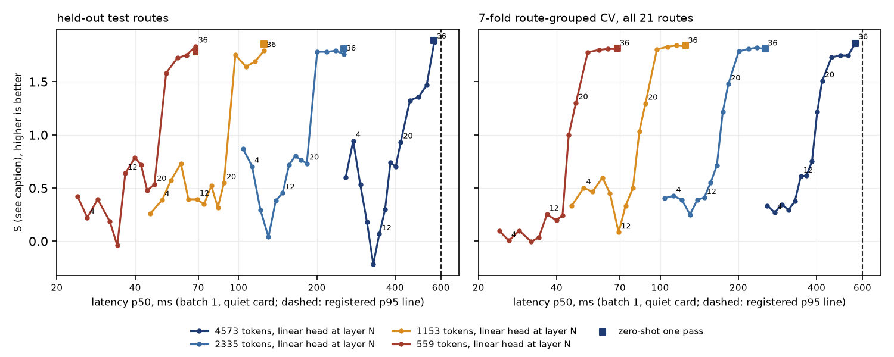

# vlm_thin: Qwen3-VL-4B light reading with a cut language model and a thin head

Plan and pre-registration: [../plans/2026-10-02-vlm-thin.md](../plans/2026-10-02-vlm-thin.md). Generated by `scripts/vlm_thin_report.py`
from the run `$DATA_DIR/runs/vlm_thin/20261002-114036`; the summary block below is hand-written, everything after it is generated.

## Summary

Data: 3281 labelled requests with frames on 21 routes (train 9 routes / 1107 requests, val 4 / 722, test 8 / 1452; test holds 180 ego-red,
57 ego-green, 765 no-light-at-all frames). The ~38k older requests have no saved frames and are not part of this study.

- **Plain inefficiency is most of the 0.8-1.1 s.** The reference `generate` path takes 767 / 861 ms (p50 / p95); GPU preprocessing alone takes it to
  678 / 773; one forward pass with the four options scored at the answer position takes 564 / 565 ms at the native 4573 tokens with the same
  accuracy within noise (ego red 78/85 vs 79/85, red answered green 5 vs 4, ego green 63/68 vs 66/68, no light answered red 0/80). Of the 564 ms,
  235 ms is the vision tower and 328 ms the 36 language layers; preprocessing is 2.6 ms. `torch.compile` gave no gain (692 / 693 ms).
- **Image resolution is the large lever, and the zero-shot reading barely moves**: 254 / 125 / 68 ms at 2335 / 1153 / 559 visual tokens; test S
  1.89 / 1.81 / 1.86 / 1.78 at 4573 / 2335 / 1153 / 559 (ego red recall 94 / 92 / 95 / 96%, ego green recall 100 / 96 / 93 / 84%, red answered green
  6 / 8 / 2 / 2%). Ego green recall is the cell that loses at the lowest resolution (84% [42, 100]).
- **Truncation: the answer-position hidden state is only readable from about layer 24 of 36.** Below N = 20 a linear head fails in every resolution
  (test S <= 0.95, CV S <= 1.51; at N <= 16 CV S <= 0.75); at N = 24-32 it matches the zero-shot reading in the 7-fold CV (CV S 1.73-1.84 vs
  1.81-1.86 zero-shot) with a latency saving of 19-22% (N = 24 vs 36: 457 vs 565 ms native, 201 vs 254 ms at 2335, 97 vs 125 ms at 1153, 53 vs 68 ms
  at 559). On the 8 held-out test routes the native-resolution heads at N = 24-32 are worse than the zero-shot reading on ego green (49-61% vs 100%),
  the other resolutions are within noise. The vision tower is the floor: vision-only features (mean + max of the merged tokens) are useless
  (test S <= 0.71, CV S 0.40-0.66); the pooled image-token feature never gets near the answer-position head at N >= 24 (best val S 0.98 at native, 0.36-0.69 at the other resolutions, against 1.8-1.9).
- **A head fitted on CARLA frames did not beat the zero-shot one-pass reading anywhere** (test and CV), and this train split is thin (147 red frames,
  119 from one route). Heads are in-domain supervised, the zero-shot rows are not.
- **Registered selection rule** (section 5 of the plan): r559 (0.3 Mpx, 559 tokens), answer-position hidden state at N = 36, linear head (lambda 10): val S 1.915,
  tied with zero-shot at that resolution; 68 / 69 ms p50 / p95. The cut did not win the rule: at 559 tokens the whole model is already 68 ms, so a cut
  saves 5 ms (N = 32, post-hoc rule restricted to N < 36: 63 / 64 ms, Phase A 3b2 below).
- **Phase A on the 8 test routes** (3a zero-shot generate, 3b the chosen head): Q-light lines pass in both (ego red recall 95.6% [88.3, 100] and 96.1% [89.0, 100];
  other-direction red answered red 6.4% and 9.7% against the <= 10% line; no light answered red 0.0%); Q-sign passes on one route (76.2%, 42 frames);
  Q-block fails (zero-shot: cones 99.5%, stopped vehicle 0.0%; the joint-prompt answers are the same in 3a and 3b); the latency line fails for 3a
  (p95 885 ms) and passes for the light channel in 3b (p95 69 ms), but the joint prompt that answers sign / block / side still takes p95 1607 ms.
  The test has 8 routes, 5 with an ego red, 3 with an ego green, 1 with a stop sign: the CIs are wide and the sign and bypass-side rows rest on one route.
- Not verified: closed-loop behaviour, the other three questions with a fast path, anything about routes outside these 21.

## 1. Training-free speed levers (full model, no training)

Accuracy on the 233 sweep frames with the sweep's own labels (85 ego red, 68 ego green, 80 no light; cell = estimate [95% route-cluster CI] hits/frames); latency from the bench (100 test frames, batch 1, quiet card).

| variant                                                            | ego red: red       | ego red: green   | ego green: green    | no light: red   | latency p50 / p95 ms   | note                                                     |
|:-------------------------------------------------------------------|:-------------------|:-----------------|:--------------------|:----------------|:-----------------------|:---------------------------------------------------------|
| generate, HF reference path (PIL + CPU processor), full resolution | 93% [88, 99] 79/85 | 5% [0, 10] 4/85  | 97% [91, 100] 66/68 | 0% [0, 0] 0/80  | 767 / 861              |                                                          |
| generate, GPU preprocessing, full resolution                       | 93% [88, 99] 79/85 | 5% [0, 10] 4/85  | 97% [91, 100] 66/68 | 0% [0, 0] 0/80  | 678 / 773              | accuracy of the variant it shares math with (not re-run) |
| one forward pass, option scoring, 4573 tokens                      | 92% [86, 97] 78/85 | 6% [1, 11] 5/85  | 93% [86, 98] 63/68  | 0% [0, 0] 0/80  | 564 / 565              |                                                          |
| one forward pass, option scoring, 2335 tokens                      | 91% [85, 96] 77/85 | 7% [2, 13] 6/85  | 91% [85, 98] 62/68  | 0% [0, 0] 0/80  | 254 / 254              |                                                          |
| one forward pass, option scoring, 1153 tokens                      | 89% [82, 97] 76/85 | 6% [0, 13] 5/85  | 87% [80, 95] 59/68  | 0% [0, 0] 0/80  | 125 / 126              |                                                          |
| one forward pass, option scoring, 559 tokens                       | 89% [80, 99] 76/85 | 5% [0, 10] 4/85  | 84% [66, 98] 57/68  | 0% [0, 0] 0/80  | 68 / 69                |                                                          |
| one forward pass, option scoring, 4573 tokens, torch.compile       | 92% [86, 97] 78/85 | 6% [1, 11] 5/85  | 93% [86, 98] 63/68  | 0% [0, 0] 0/80  | 692 / 693              | accuracy of the variant it shares math with (not re-run) |

## 2. Truncation sweep at 4573 visual tokens (two cameras)

| feature                                       |   N | head   |   val S | test red   | test red->green   | test green   | test no-light red   | test other-dir red   |   CV S | latency p50 / p95 ms   |
|:----------------------------------------------|----:|:-------|--------:|:-----------|:------------------|:-------------|:--------------------|:---------------------|-------:|:-----------------------|
| ans                                           |   2 | lin    |    0.08 | 57%        | 21%               | 26%          | 2%                  | 32%                  |   0.33 | 258 / 260              |
| ans                                           |   2 | mlp    |    0.09 | 61%        | 9%                | 4%           | 0%                  | 12%                  |   0.54 | 258 / 260              |
| ans                                           |   4 | lin    |    0.79 | 63%        | 17%               | 49%          | 0%                  | 26%                  |   0.27 | 276 / 277              |
| ans                                           |   4 | mlp    |    0.78 | 52%        | 24%               | 53%          | 11%                 | 14%                  |   0.47 | 276 / 277              |
| ans                                           |   6 | lin    |    0.51 | 59%        | 23%               | 18%          | 1%                  | 28%                  |   0.35 | 294 / 295              |
| ans                                           |   6 | mlp    |    0.56 | 45%        | 33%               | 42%          | 0%                  | 4%                   |   0.52 | 294 / 295              |
| ans                                           |   8 | lin    |    0.46 | 46%        | 37%               | 9%           | 0%                  | 32%                  |   0.29 | 312 / 313              |
| ans                                           |   8 | mlp    |    0.16 | 41%        | 36%               | 28%          | 0%                  | 13%                  |   0.42 | 312 / 313              |
| ans                                           |  10 | lin    |    0.35 | 17%        | 67%               | 30%          | 2%                  | 36%                  |   0.38 | 330 / 331              |
| ans                                           |  10 | mlp    |    0.37 | 38%        | 37%               | 28%          | 0%                  | 17%                  |   0.34 | 330 / 331              |
| ans                                           |  12 | lin    |    0.31 | 16%        | 61%               | 53%          | 1%                  | 27%                  |   0.61 | 348 / 349              |
| ans                                           |  12 | mlp    |    0.29 | 25%        | 46%               | 53%          | 15%                 | 23%                  |   0.53 | 348 / 349              |
| ans                                           |  14 | lin    |    0.29 | 34%        | 43%               | 40%          | 2%                  | 31%                  |   0.62 | 366 / 367              |
| ans                                           |  14 | mlp    |   -0.06 | 29%        | 48%               | 53%          | 24%                 | 31%                  |   0.46 | 366 / 367              |
| ans                                           |  16 | lin    |    0.28 | 69%        | 12%               | 18%          | 0%                  | 24%                  |   0.75 | 384 / 385              |
| ans                                           |  16 | mlp    |    0.41 | 68%        | 15%               | 23%          | 19%                 | 27%                  |   0.68 | 384 / 385              |
| ans                                           |  18 | lin    |    0.89 | 69%        | 20%               | 21%          | 0%                  | 14%                  |   1.22 | 402 / 403              |
| ans                                           |  18 | mlp    |    0.19 | 68%        | 22%               | 21%          | 0%                  | 15%                  |   1.21 | 402 / 403              |
| ans                                           |  20 | lin    |    0.94 | 76%        | 14%               | 32%          | 0%                  | 17%                  |   1.51 | 420 / 421              |
| ans                                           |  20 | mlp    |    0.33 | 66%        | 27%               | 28%          | 0%                  | 14%                  |   1.44 | 420 / 421              |
| ans                                           |  24 | lin    |    1.87 | 83%        | 3%                | 53%          | 0%                  | 7%                   |   1.73 | 457 / 457              |
| ans                                           |  24 | mlp    |    1.71 | 89%        | 3%                | 70%          | 0%                  | 3%                   |   1.72 | 457 / 457              |
| ans                                           |  28 | lin    |    1.89 | 90%        | 3%                | 49%          | 0%                  | 4%                   |   1.75 | 493 / 494              |
| ans                                           |  28 | mlp    |    1.82 | 90%        | 2%                | 67%          | 0%                  | 2%                   |   1.78 | 493 / 494              |
| ans                                           |  32 | lin    |    1.87 | 90%        | 4%                | 61%          | 0%                  | 6%                   |   1.75 | 529 / 530              |
| ans                                           |  32 | mlp    |    1.83 | 90%        | 2%                | 67%          | 0%                  | 2%                   |   1.8  | 529 / 530              |
| ans                                           |  36 | lin    |    1.86 | 92%        | 5%                | 100%         | 0%                  | 7%                   |   1.87 | 565 / 567              |
| ans                                           |  36 | mlp    |    1.56 | 87%        | 3%                | 65%          | 0%                  | 12%                  |   1.81 | 565 / 567              |
| pool                                          |   2 | lin    |    0.83 | 77%        | 3%                | 0%           | 24%                 | 38%                  |   0.4  | 258 / 260              |
| pool                                          |   2 | mlp    |    0.64 | 73%        | 16%               | 23%          | 50%                 | 47%                  |   0.27 | 258 / 260              |
| pool                                          |   4 | lin    |    0.83 | 79%        | 2%                | 0%           | 4%                  | 37%                  |   0.54 | 276 / 277              |
| pool                                          |   4 | mlp    |    0.29 | 71%        | 10%               | 19%          | 49%                 | 37%                  |   0.45 | 276 / 277              |
| pool                                          |   6 | lin    |    0.83 | 80%        | 2%                | 0%           | 4%                  | 37%                  |   0.51 | 294 / 295              |
| pool                                          |   6 | mlp    |   -0.01 | 72%        | 7%                | 14%          | 48%                 | 41%                  |   0.42 | 294 / 295              |
| pool                                          |   8 | lin    |    0.83 | 81%        | 2%                | 0%           | 4%                  | 37%                  |   0.61 | 312 / 313              |
| pool                                          |   8 | mlp    |    0.5  | 74%        | 8%                | 19%          | 48%                 | 38%                  |   0.35 | 312 / 313              |
| pool                                          |  10 | lin    |    0.83 | 74%        | 5%                | 5%           | 3%                  | 34%                  |   0.59 | 330 / 331              |
| pool                                          |  10 | mlp    |    0.39 | 78%        | 3%                | 4%           | 4%                  | 27%                  |   0.35 | 330 / 331              |
| pool                                          |  12 | lin    |    0.83 | 71%        | 9%                | 5%           | 4%                  | 34%                  |   0.59 | 348 / 349              |
| pool                                          |  12 | mlp    |    0.5  | 71%        | 9%                | 60%          | 5%                  | 26%                  |   0.54 | 348 / 349              |
| pool                                          |  14 | lin    |    0.8  | 48%        | 33%               | 12%          | 4%                  | 27%                  |   0.72 | 366 / 367              |
| pool                                          |  14 | mlp    |    0.01 | 62%        | 21%               | 46%          | 23%                 | 31%                  |   0.6  | 366 / 367              |
| pool                                          |  16 | lin    |    0.72 | 42%        | 38%               | 21%          | 4%                  | 24%                  |   0.77 | 384 / 385              |
| pool                                          |  16 | mlp    |    0.05 | 59%        | 22%               | 49%          | 5%                  | 26%                  |   0.71 | 384 / 385              |
| pool                                          |  18 | lin    |    0.82 | 53%        | 28%               | 21%          | 4%                  | 26%                  |   0.81 | 402 / 403              |
| pool                                          |  18 | mlp    |   -0    | 73%        | 11%               | 11%          | 5%                  | 29%                  |   0.5  | 402 / 403              |
| pool                                          |  20 | lin    |    0.85 | 47%        | 33%               | 21%          | 3%                  | 23%                  |   0.87 | 420 / 421              |
| pool                                          |  20 | mlp    |    0.2  | 65%        | 17%               | 21%          | 4%                  | 27%                  |   0.76 | 420 / 421              |
| pool                                          |  24 | lin    |    0.66 | 88%        | 4%                | 12%          | 4%                  | 32%                  |   0.85 | 457 / 457              |
| pool                                          |  24 | mlp    |    0.2  | 73%        | 14%               | 47%          | 3%                  | 25%                  |   0.63 | 457 / 457              |
| pool                                          |  28 | lin    |    0.71 | 90%        | 8%                | 9%           | 4%                  | 27%                  |   0.92 | 493 / 494              |
| pool                                          |  28 | mlp    |   -0.29 | 73%        | 18%               | 51%          | 4%                  | 11%                  |   0.83 | 493 / 494              |
| pool                                          |  32 | lin    |    0.98 | 76%        | 14%               | 23%          | 4%                  | 24%                  |   1.09 | 529 / 530              |
| pool                                          |  32 | mlp    |   -0.03 | 62%        | 24%               | 49%          | 4%                  | 9%                   |   0.88 | 529 / 530              |
| pool                                          |  36 | lin    |    0.68 | 69%        | 11%               | 21%          | 0%                  | 21%                  |   0.94 | 565 / 567              |
| pool                                          |  36 | mlp    |    0.46 | 68%        | 11%               | 63%          | 4%                  | 7%                   |   0.74 | 565 / 567              |
| vision tower only                             |   0 | lin    |   -0.32 | 68%        | 8%                | 12%          | 1%                  | 23%                  |   0.52 | 238 / 239              |
| vision tower only                             |   0 | mlp    |   -0.06 | 56%        | 27%               | 33%          | 48%                 | 29%                  |   0.42 | 238 / 239              |
| zero-shot, one pass, option scoring (no head) |  36 | -      |    1.86 | 94%        | 6%                | 100%         | 0%                  | 6%                   |        | 564 / 565              |

## 2. Truncation sweep at 2335 visual tokens (two cameras)

| feature                                       |   N | head   |   val S | test red   | test red->green   | test green   | test no-light red   | test other-dir red   |   CV S | latency p50 / p95 ms   |
|:----------------------------------------------|----:|:-------|--------:|:-----------|:------------------|:-------------|:--------------------|:---------------------|-------:|:-----------------------|
| ans                                           |   2 | lin    |    0.15 | 68%        | 10%               | 30%          | 1%                  | 37%                  |   0.41 | 104 / 105              |
| ans                                           |   2 | mlp    |    0.52 | 56%        | 14%               | 33%          | 1%                  | 25%                  |   0.42 | 104 / 105              |
| ans                                           |   4 | lin    |    0.85 | 73%        | 2%                | 0%           | 0%                  | 37%                  |   0.43 | 113 / 114              |
| ans                                           |   4 | mlp    |    0.73 | 59%        | 2%                | 11%          | 0%                  | 25%                  |   0.4  | 113 / 114              |
| ans                                           |   6 | lin    |    0.8  | 50%        | 27%               | 7%           | 1%                  | 32%                  |   0.39 | 121 / 123              |
| ans                                           |   6 | mlp    |    0.85 | 46%        | 19%               | 5%           | 0%                  | 19%                  |   0.56 | 121 / 123              |
| ans                                           |   8 | lin    |    0.59 | 38%        | 44%               | 19%          | 9%                  | 44%                  |   0.25 | 130 / 131              |
| ans                                           |   8 | mlp    |    0.82 | 56%        | 12%               | 7%           | 0%                  | 20%                  |   0.46 | 130 / 131              |
| ans                                           |  10 | lin    |    0.81 | 56%        | 26%               | 11%          | 2%                  | 45%                  |   0.39 | 139 / 140              |
| ans                                           |  10 | mlp    |    0.79 | 54%        | 10%               | 7%           | 2%                  | 30%                  |   0.45 | 139 / 140              |
| ans                                           |  12 | lin    |    0.56 | 51%        | 29%               | 39%          | 15%                 | 38%                  |   0.41 | 148 / 149              |
| ans                                           |  12 | mlp    |    0.45 | 51%        | 18%               | 18%          | 21%                 | 40%                  |   0.41 | 148 / 149              |
| ans                                           |  14 | lin    |    0.69 | 60%        | 19%               | 40%          | 10%                 | 35%                  |   0.55 | 156 / 157              |
| ans                                           |  14 | mlp    |    0.72 | 68%        | 7%                | 11%          | 25%                 | 43%                  |   0.55 | 156 / 157              |
| ans                                           |  16 | lin    |    0.63 | 59%        | 18%               | 40%          | 1%                  | 24%                  |   0.71 | 165 / 166              |
| ans                                           |  16 | mlp    |    0.53 | 67%        | 13%               | 42%          | 23%                 | 38%                  |   0.71 | 165 / 166              |
| ans                                           |  18 | lin    |    0.69 | 72%        | 19%               | 23%          | 0%                  | 13%                  |   1.22 | 174 / 175              |
| ans                                           |  18 | mlp    |    0.27 | 72%        | 18%               | 21%          | 0%                  | 16%                  |   1.19 | 174 / 175              |
| ans                                           |  20 | lin    |    0.84 | 70%        | 18%               | 21%          | 0%                  | 12%                  |   1.48 | 183 / 184              |
| ans                                           |  20 | mlp    |    0.75 | 65%        | 28%               | 26%          | 0%                  | 13%                  |   1.51 | 183 / 184              |
| ans                                           |  24 | lin    |    1.83 | 84%        | 6%                | 100%         | 0%                  | 5%                   |   1.79 | 201 / 201              |
| ans                                           |  24 | mlp    |    1.68 | 83%        | 7%                | 56%          | 0%                  | 6%                   |   1.62 | 201 / 201              |
| ans                                           |  28 | lin    |    1.83 | 86%        | 6%                | 98%          | 0%                  | 4%                   |   1.81 | 218 / 219              |
| ans                                           |  28 | mlp    |    1.76 | 82%        | 4%                | 40%          | 0%                  | 6%                   |   1.63 | 218 / 219              |
| ans                                           |  32 | lin    |    1.86 | 88%        | 5%                | 96%          | 0%                  | 6%                   |   1.82 | 236 / 237              |
| ans                                           |  32 | mlp    |    1.8  | 85%        | 6%                | 74%          | 0%                  | 6%                   |   1.75 | 236 / 237              |
| ans                                           |  36 | lin    |    1.86 | 85%        | 6%                | 96%          | 0%                  | 5%                   |   1.81 | 254 / 254              |
| ans                                           |  36 | mlp    |    1.68 | 79%        | 7%                | 47%          | 0%                  | 13%                  |   1.79 | 254 / 254              |
| pool                                          |   2 | lin    |    0.09 | 37%        | 45%               | 25%          | 1%                  | 33%                  |   0.44 | 104 / 105              |
| pool                                          |   2 | mlp    |   -0.1  | 21%        | 69%               | 42%          | 49%                 | 37%                  |   0.37 | 104 / 105              |
| pool                                          |   4 | lin    |   -0.21 | 45%        | 37%               | 21%          | 1%                  | 29%                  |   0.47 | 113 / 114              |
| pool                                          |   4 | mlp    |   -0.34 | 54%        | 30%               | 26%          | 46%                 | 39%                  |   0.4  | 113 / 114              |
| pool                                          |   6 | lin    |    0.01 | 48%        | 34%               | 21%          | 0%                  | 31%                  |   0.44 | 121 / 123              |
| pool                                          |   6 | mlp    |   -0.23 | 69%        | 12%               | 23%          | 47%                 | 41%                  |   0.36 | 121 / 123              |
| pool                                          |   8 | lin    |    0.3  | 51%        | 32%               | 21%          | 0%                  | 31%                  |   0.47 | 130 / 131              |
| pool                                          |   8 | mlp    |   -0.18 | 76%        | 8%                | 18%          | 43%                 | 39%                  |   0.36 | 130 / 131              |
| pool                                          |  10 | lin    |    0.27 | 43%        | 36%               | 21%          | 0%                  | 31%                  |   0.47 | 139 / 140              |
| pool                                          |  10 | mlp    |   -0.29 | 38%        | 47%               | 40%          | 6%                  | 28%                  |   0.22 | 139 / 140              |
| pool                                          |  12 | lin    |    0.66 | 31%        | 49%               | 21%          | 0%                  | 31%                  |   0.42 | 148 / 149              |
| pool                                          |  12 | mlp    |   -0.02 | 52%        | 27%               | 40%          | 46%                 | 34%                  |   0.42 | 148 / 149              |
| pool                                          |  14 | lin    |    0.21 | 21%        | 57%               | 21%          | 1%                  | 27%                  |   0.51 | 156 / 157              |
| pool                                          |  14 | mlp    |   -0.26 | 49%        | 42%               | 25%          | 32%                 | 39%                  |   0.39 | 156 / 157              |
| pool                                          |  16 | lin    |    0.13 | 24%        | 56%               | 21%          | 2%                  | 25%                  |   0.47 | 165 / 166              |
| pool                                          |  16 | mlp    |   -0.38 | 40%        | 48%               | 37%          | 23%                 | 27%                  |   0.59 | 165 / 166              |
| pool                                          |  18 | lin    |    0.13 | 20%        | 58%               | 21%          | 2%                  | 22%                  |   0.53 | 174 / 175              |
| pool                                          |  18 | mlp    |   -0.11 | 44%        | 47%               | 21%          | 19%                 | 33%                  |   0.38 | 174 / 175              |
| pool                                          |  20 | lin    |    0.69 | 23%        | 56%               | 21%          | 1%                  | 21%                  |   0.67 | 183 / 184              |
| pool                                          |  20 | mlp    |   -0.04 | 41%        | 45%               | 21%          | 3%                  | 31%                  |   0.28 | 183 / 184              |
| pool                                          |  24 | lin    |   -0.18 | 64%        | 28%               | 21%          | 2%                  | 28%                  |   0.58 | 201 / 201              |
| pool                                          |  24 | mlp    |   -0.21 | 72%        | 20%               | 28%          | 4%                  | 30%                  |   0.31 | 201 / 201              |
| pool                                          |  28 | lin    |    0.09 | 71%        | 22%               | 19%          | 2%                  | 26%                  |   0.61 | 218 / 219              |
| pool                                          |  28 | mlp    |   -0.24 | 68%        | 22%               | 21%          | 4%                  | 15%                  |   0.53 | 218 / 219              |
| pool                                          |  32 | lin    |    0.09 | 57%        | 33%               | 21%          | 3%                  | 26%                  |   0.94 | 236 / 237              |
| pool                                          |  32 | mlp    |   -0.3  | 27%        | 58%               | 54%          | 4%                  | 9%                   |   0.68 | 236 / 237              |
| pool                                          |  36 | lin    |   -0.27 | 43%        | 37%               | 18%          | 0%                  | 22%                  |   0.65 | 254 / 254              |
| pool                                          |  36 | mlp    |    0.15 | 39%        | 39%               | 53%          | 4%                  | 5%                   |   0.59 | 254 / 254              |
| vision tower only                             |   0 | lin    |   -0.52 | 31%        | 46%               | 21%          | 0%                  | 24%                  |   0.55 | 94 / 95                |
| vision tower only                             |   0 | mlp    |   -0.35 | 27%        | 56%               | 44%          | 12%                 | 14%                  |   0.4  | 94 / 95                |
| zero-shot, one pass, option scoring (no head) |  36 | -      |    1.86 | 92%        | 8%                | 96%          | 0%                  | 7%                   |        | 254 / 254              |

## 2. Truncation sweep at 1153 visual tokens (two cameras)

| feature                                       |   N | head   |   val S | test red   | test red->green   | test green   | test no-light red   | test other-dir red   |   CV S | latency p50 / p95 ms   |
|:----------------------------------------------|----:|:-------|--------:|:-----------|:------------------|:-------------|:--------------------|:---------------------|-------:|:-----------------------|
| ans                                           |   2 | lin    |    0.66 | 74%        | 12%               | 7%           | 43%                 | 52%                  |   0.33 | 46 / 46                |
| ans                                           |   2 | mlp    |   -0.11 | 57%        | 14%               | 16%          | 11%                 | 20%                  |   0.34 | 46 / 46                |
| ans                                           |   4 | lin    |    0.59 | 63%        | 12%               | 4%           | 16%                 | 36%                  |   0.5  | 51 / 51                |
| ans                                           |   4 | mlp    |    0.18 | 55%        | 17%               | 35%          | 0%                  | 15%                  |   0.38 | 51 / 51                |
| ans                                           |   6 | lin    |    0.8  | 72%        | 4%                | 2%           | 13%                 | 43%                  |   0.47 | 55 / 55                |
| ans                                           |   6 | mlp    |    0.84 | 72%        | 2%                | 0%           | 8%                  | 31%                  |   0.47 | 55 / 55                |
| ans                                           |   8 | lin    |    0.83 | 73%        | 1%                | 2%           | 0%                  | 39%                  |   0.6  | 60 / 61                |
| ans                                           |   8 | mlp    |    0.73 | 70%        | 2%                | 0%           | 0%                  | 30%                  |   0.6  | 60 / 61                |
| ans                                           |  10 | lin    |    0.82 | 65%        | 15%               | 5%           | 16%                 | 51%                  |   0.45 | 64 / 65                |
| ans                                           |  10 | mlp    |    0.61 | 66%        | 9%                | 0%           | 12%                 | 44%                  |   0.32 | 64 / 65                |
| ans                                           |  12 | lin    |    0.59 | 71%        | 13%               | 21%          | 39%                 | 50%                  |   0.08 | 69 / 70                |
| ans                                           |  12 | mlp    |    0.34 | 68%        | 9%                | 11%          | 39%                 | 44%                  |   0.27 | 69 / 70                |
| ans                                           |  14 | lin    |    0.77 | 61%        | 21%               | 28%          | 34%                 | 42%                  |   0.33 | 74 / 74                |
| ans                                           |  14 | mlp    |    0.75 | 71%        | 8%                | 28%          | 43%                 | 44%                  |   0.48 | 74 / 74                |
| ans                                           |  16 | lin    |    0.52 | 48%        | 32%               | 37%          | 0%                  | 30%                  |   0.5  | 79 / 79                |
| ans                                           |  16 | mlp    |    0.59 | 61%        | 19%               | 35%          | 8%                  | 39%                  |   0.52 | 79 / 79                |
| ans                                           |  18 | lin    |    0.32 | 51%        | 42%               | 23%          | 0%                  | 18%                  |   1.03 | 83 / 84                |
| ans                                           |  18 | mlp    |   -0.41 | 45%        | 47%               | 21%          | 0%                  | 17%                  |   1.18 | 83 / 84                |
| ans                                           |  20 | lin    |    0.63 | 59%        | 36%               | 32%          | 0%                  | 18%                  |   1.3  | 88 / 88                |
| ans                                           |  20 | mlp    |    0.33 | 57%        | 35%               | 25%          | 0%                  | 12%                  |   1.31 | 88 / 88                |
| ans                                           |  24 | lin    |    1.46 | 88%        | 7%                | 95%          | 0%                  | 5%                   |   1.81 | 97 / 98                |
| ans                                           |  24 | mlp    |    1.15 | 82%        | 9%                | 32%          | 0%                  | 7%                   |   1.56 | 97 / 98                |
| ans                                           |  28 | lin    |    1.63 | 81%        | 13%               | 96%          | 0%                  | 4%                   |   1.83 | 107 / 108              |
| ans                                           |  28 | mlp    |    1.33 | 59%        | 29%               | 33%          | 0%                  | 7%                   |   1.58 | 107 / 108              |
| ans                                           |  32 | lin    |    1.72 | 84%        | 10%               | 95%          | 0%                  | 5%                   |   1.84 | 116 / 116              |
| ans                                           |  32 | mlp    |    1.48 | 81%        | 6%                | 37%          | 0%                  | 9%                   |   1.65 | 116 / 116              |
| ans                                           |  36 | lin    |    1.8  | 91%        | 7%                | 95%          | 0%                  | 7%                   |   1.83 | 125 / 126              |
| ans                                           |  36 | mlp    |    1.1  | 77%        | 12%               | 28%          | 0%                  | 11%                  |   1.63 | 125 / 126              |
| pool                                          |   2 | lin    |   -0.1  | 17%        | 70%               | 21%          | 9%                  | 32%                  |   0.52 | 46 / 46                |
| pool                                          |   2 | mlp    |   -0.15 | 19%        | 65%               | 53%          | 48%                 | 30%                  |   0.38 | 46 / 46                |
| pool                                          |   4 | lin    |   -0.34 | 36%        | 52%               | 21%          | 1%                  | 31%                  |   0.52 | 51 / 51                |
| pool                                          |   4 | mlp    |   -0.39 | 45%        | 47%               | 32%          | 36%                 | 30%                  |   0.33 | 51 / 51                |
| pool                                          |   6 | lin    |   -0.23 | 38%        | 49%               | 21%          | 1%                  | 31%                  |   0.55 | 55 / 55                |
| pool                                          |   6 | mlp    |   -0.31 | 42%        | 44%               | 26%          | 41%                 | 31%                  |   0.33 | 55 / 55                |
| pool                                          |   8 | lin    |    0.01 | 39%        | 44%               | 21%          | 1%                  | 30%                  |   0.51 | 60 / 61                |
| pool                                          |   8 | mlp    |   -0.2  | 42%        | 41%               | 25%          | 33%                 | 40%                  |   0.28 | 60 / 61                |
| pool                                          |  10 | lin    |   -0.01 | 36%        | 46%               | 21%          | 0%                  | 30%                  |   0.55 | 64 / 65                |
| pool                                          |  10 | mlp    |   -0.28 | 25%        | 62%               | 32%          | 8%                  | 23%                  |   0.29 | 64 / 65                |
| pool                                          |  12 | lin    |    0.55 | 16%        | 70%               | 21%          | 0%                  | 30%                  |   0.65 | 69 / 70                |
| pool                                          |  12 | mlp    |   -0.12 | 17%        | 63%               | 25%          | 9%                  | 28%                  |   0.48 | 69 / 70                |
| pool                                          |  14 | lin    |    0.69 | 10%        | 77%               | 21%          | 0%                  | 24%                  |   0.6  | 74 / 74                |
| pool                                          |  14 | mlp    |   -0.34 | 13%        | 72%               | 21%          | 24%                 | 33%                  |   0.58 | 74 / 74                |
| pool                                          |  16 | lin    |    0.1  | 15%        | 66%               | 21%          | 0%                  | 26%                  |   0.59 | 79 / 79                |
| pool                                          |  16 | mlp    |   -0.17 | 22%        | 70%               | 21%          | 39%                 | 37%                  |   0.53 | 79 / 79                |
| pool                                          |  18 | lin    |   -0.01 | 13%        | 67%               | 21%          | 1%                  | 27%                  |   0.51 | 83 / 84                |
| pool                                          |  18 | mlp    |   -0.24 | 46%        | 47%               | 21%          | 38%                 | 38%                  |   0.37 | 83 / 84                |
| pool                                          |  20 | lin    |    0.15 | 10%        | 71%               | 21%          | 0%                  | 23%                  |   0.5  | 88 / 88                |
| pool                                          |  20 | mlp    |   -0.27 | 31%        | 61%               | 21%          | 19%                 | 37%                  |   0.47 | 88 / 88                |
| pool                                          |  24 | lin    |   -0.14 | 23%        | 66%               | 21%          | 1%                  | 29%                  |   0.61 | 97 / 98                |
| pool                                          |  24 | mlp    |   -0.36 | 34%        | 59%               | 21%          | 11%                 | 31%                  |   0.49 | 97 / 98                |
| pool                                          |  28 | lin    |    0.49 | 57%        | 34%               | 21%          | 3%                  | 27%                  |   0.52 | 107 / 108              |
| pool                                          |  28 | mlp    |   -0.29 | 45%        | 48%               | 23%          | 4%                  | 16%                  |   0.54 | 107 / 108              |
| pool                                          |  32 | lin    |    0.2  | 39%        | 51%               | 23%          | 3%                  | 24%                  |   0.76 | 116 / 116              |
| pool                                          |  32 | mlp    |   -0.21 | 23%        | 56%               | 68%          | 4%                  | 7%                   |   0.68 | 116 / 116              |
| pool                                          |  36 | lin    |   -0.45 | 19%        | 60%               | 25%          | 1%                  | 22%                  |   0.55 | 125 / 126              |
| pool                                          |  36 | mlp    |   -0.38 | 19%        | 63%               | 56%          | 3%                  | 7%                   |   0.51 | 125 / 126              |
| vision tower only                             |   0 | lin    |   -0.41 | 8%         | 68%               | 21%          | 1%                  | 20%                  |   0.66 | 40 / 40                |
| vision tower only                             |   0 | mlp    |   -0.5  | 27%        | 56%               | 49%          | 33%                 | 16%                  |   0.53 | 40 / 40                |
| zero-shot, one pass, option scoring (no head) |  36 | -      |    1.86 | 95%        | 2%                | 93%          | 0%                  | 7%                   |        | 125 / 126              |

## 2. Truncation sweep at 559 visual tokens (two cameras)

| feature                                       |   N | head   |   val S | test red   | test red->green   | test green   | test no-light red   | test other-dir red   |   CV S | latency p50 / p95 ms   |
|:----------------------------------------------|----:|:-------|--------:|:-----------|:------------------|:-------------|:--------------------|:---------------------|-------:|:-----------------------|
| ans                                           |   2 | lin    |    0.77 | 82%        | 4%                | 9%           | 44%                 | 61%                  |   0.1  | 24 / 24                |
| ans                                           |   2 | mlp    |    0.76 | 55%        | 8%                | 2%           | 20%                 | 35%                  |   0.3  | 24 / 24                |
| ans                                           |   4 | lin    |    0.32 | 72%        | 11%               | 4%           | 42%                 | 58%                  |   0    | 26 / 27                |
| ans                                           |   4 | mlp    |    0.18 | 59%        | 17%               | 5%           | 1%                  | 35%                  |   0.12 | 26 / 27                |
| ans                                           |   6 | lin    |    0.62 | 77%        | 11%               | 12%          | 39%                 | 52%                  |   0.1  | 29 / 29                |
| ans                                           |   6 | mlp    |    0.49 | 64%        | 14%               | 4%           | 1%                  | 52%                  |   0.31 | 29 / 29                |
| ans                                           |   8 | lin    |    0.52 | 76%        | 16%               | 5%           | 46%                 | 58%                  |  -0    | 32 / 32                |
| ans                                           |   8 | mlp    |    0.47 | 69%        | 6%                | 9%           | 0%                  | 47%                  |   0.27 | 32 / 32                |
| ans                                           |  10 | lin    |    0.39 | 62%        | 26%               | 5%           | 45%                 | 57%                  |   0.03 | 34 / 35                |
| ans                                           |  10 | mlp    |    0.27 | 67%        | 7%                | 14%          | 1%                  | 51%                  |   0.26 | 34 / 35                |
| ans                                           |  12 | lin    |    0.23 | 71%        | 4%                | 5%           | 7%                  | 48%                  |   0.25 | 37 / 37                |
| ans                                           |  12 | mlp    |   -0.69 | 71%        | 3%                | 5%           | 33%                 | 49%                  |   0.17 | 37 / 37                |
| ans                                           |  14 | lin    |    0.12 | 73%        | 6%                | 12%          | 0%                  | 43%                  |   0.2  | 40 / 40                |
| ans                                           |  14 | mlp    |    0.05 | 78%        | 3%                | 5%           | 3%                  | 52%                  |   0.13 | 40 / 40                |
| ans                                           |  16 | lin    |    0.51 | 67%        | 9%                | 14%          | 0%                  | 38%                  |   0.24 | 42 / 43                |
| ans                                           |  16 | mlp    |    0.37 | 68%        | 10%               | 11%          | 12%                 | 45%                  |   0.18 | 42 / 43                |
| ans                                           |  18 | lin    |    0.61 | 56%        | 31%               | 23%          | 0%                  | 13%                  |   1    | 45 / 45                |
| ans                                           |  18 | mlp    |    0.69 | 57%        | 33%               | 21%          | 1%                  | 20%                  |   0.77 | 45 / 45                |
| ans                                           |  20 | lin    |    0.78 | 61%        | 31%               | 23%          | 0%                  | 11%                  |   1.3  | 47 / 48                |
| ans                                           |  20 | mlp    |    0.69 | 59%        | 32%               | 25%          | 0%                  | 9%                   |   1.32 | 47 / 48                |
| ans                                           |  24 | lin    |    1.63 | 86%        | 7%                | 79%          | 0%                  | 9%                   |   1.78 | 53 / 54                |
| ans                                           |  24 | mlp    |    1.26 | 74%        | 6%                | 58%          | 0%                  | 1%                   |   1.56 | 53 / 54                |
| ans                                           |  28 | lin    |    1.76 | 86%        | 7%                | 93%          | 0%                  | 5%                   |   1.8  | 58 / 59                |
| ans                                           |  28 | mlp    |    1.19 | 64%        | 11%               | 68%          | 0%                  | 1%                   |   1.59 | 58 / 59                |
| ans                                           |  32 | lin    |    1.86 | 90%        | 6%                | 91%          | 0%                  | 8%                   |   1.81 | 63 / 64                |
| ans                                           |  32 | mlp    |    1.28 | 66%        | 7%                | 51%          | 0%                  | 2%                   |   1.61 | 63 / 64                |
| ans                                           |  36 | lin    |    1.92 | 96%        | 4%                | 91%          | 0%                  | 10%                  |   1.81 | 68 / 69                |
| ans                                           |  36 | mlp    |    1.33 | 71%        | 16%               | 37%          | 0%                  | 3%                   |   1.65 | 68 / 69                |
| pool                                          |   2 | lin    |   -0.08 | 63%        | 23%               | 2%           | 2%                  | 35%                  |   0.54 | 24 / 24                |
| pool                                          |   2 | mlp    |   -0.4  | 46%        | 44%               | 28%          | 46%                 | 43%                  |   0.32 | 24 / 24                |
| pool                                          |   4 | lin    |   -0.41 | 70%        | 17%               | 0%           | 0%                  | 34%                  |   0.54 | 26 / 27                |
| pool                                          |   4 | mlp    |   -0.48 | 59%        | 30%               | 32%          | 42%                 | 35%                  |   0.35 | 26 / 27                |
| pool                                          |   6 | lin    |   -0.44 | 69%        | 18%               | 0%           | 0%                  | 35%                  |   0.49 | 29 / 29                |
| pool                                          |   6 | mlp    |   -0.42 | 53%        | 31%               | 11%          | 39%                 | 40%                  |   0.39 | 29 / 29                |
| pool                                          |   8 | lin    |   -0.2  | 73%        | 13%               | 0%           | 0%                  | 31%                  |   0.5  | 32 / 32                |
| pool                                          |   8 | mlp    |   -0.41 | 44%        | 42%               | 28%          | 28%                 | 31%                  |   0.29 | 32 / 32                |
| pool                                          |  10 | lin    |   -0.3  | 71%        | 13%               | 0%           | 0%                  | 31%                  |   0.55 | 34 / 35                |
| pool                                          |  10 | mlp    |   -0.38 | 41%        | 47%               | 19%          | 5%                  | 26%                  |   0.24 | 34 / 35                |
| pool                                          |  12 | lin    |    0.08 | 69%        | 16%               | 0%           | 0%                  | 33%                  |   0.52 | 37 / 37                |
| pool                                          |  12 | mlp    |   -0.34 | 37%        | 45%               | 54%          | 27%                 | 27%                  |   0.44 | 37 / 37                |
| pool                                          |  14 | lin    |    0.17 | 59%        | 23%               | 0%           | 0%                  | 32%                  |   0.44 | 40 / 40                |
| pool                                          |  14 | mlp    |   -0.32 | 38%        | 44%               | 32%          | 8%                  | 34%                  |   0.42 | 40 / 40                |
| pool                                          |  16 | lin    |   -0.07 | 56%        | 30%               | 4%           | 0%                  | 37%                  |   0.5  | 42 / 43                |
| pool                                          |  16 | mlp    |   -0.2  | 34%        | 45%               | 16%          | 13%                 | 31%                  |   0.49 | 42 / 43                |
| pool                                          |  18 | lin    |   -0.03 | 50%        | 29%               | 2%           | 0%                  | 35%                  |   0.57 | 45 / 45                |
| pool                                          |  18 | mlp    |   -0.42 | 57%        | 27%               | 5%           | 39%                 | 41%                  |   0.47 | 45 / 45                |
| pool                                          |  20 | lin    |    0.2  | 46%        | 34%               | 4%           | 0%                  | 35%                  |   0.51 | 47 / 48                |
| pool                                          |  20 | mlp    |   -0.17 | 51%        | 38%               | 16%          | 41%                 | 44%                  |   0.51 | 47 / 48                |
| pool                                          |  24 | lin    |    0.04 | 59%        | 23%               | 0%           | 0%                  | 27%                  |   0.58 | 53 / 54                |
| pool                                          |  24 | mlp    |   -0.15 | 72%        | 17%               | 0%           | 23%                 | 42%                  |   0.38 | 53 / 54                |
| pool                                          |  28 | lin    |    0.28 | 82%        | 7%                | 4%           | 2%                  | 31%                  |   0.59 | 58 / 59                |
| pool                                          |  28 | mlp    |   -0.13 | 61%        | 29%               | 54%          | 4%                  | 12%                  |   0.46 | 58 / 59                |
| pool                                          |  32 | lin    |    0.36 | 59%        | 22%               | 65%          | 2%                  | 13%                  |   0.75 | 63 / 64                |
| pool                                          |  32 | mlp    |   -0.03 | 57%        | 27%               | 72%          | 4%                  | 5%                   |   0.72 | 63 / 64                |
| pool                                          |  36 | lin    |   -0.25 | 77%        | 7%                | 9%           | 0%                  | 35%                  |   0.8  | 68 / 69                |
| pool                                          |  36 | mlp    |   -0.27 | 61%        | 21%               | 54%          | 3%                  | 12%                  |   0.48 | 68 / 69                |
| vision tower only                             |   0 | lin    |   -0.51 | 44%        | 32%               | 5%           | 0%                  | 22%                  |   0.62 | 20 / 20                |
| vision tower only                             |   0 | mlp    |   -0.56 | 42%        | 36%               | 44%          | 22%                 | 20%                  |   0.46 | 20 / 20                |
| zero-shot, one pass, option scoring (no head) |  36 | -      |    1.92 | 96%        | 2%                | 84%          | 0%                  | 8%                   |        | 68 / 69                |

Figure: S = red recall - red answered green + green recall - no-light false alarm of the linear head on the answer-position hidden state at layer N (labelled), one line per image resolution, against p50 latency (log axis); left = the 8 held-out test routes, right = the 7-fold route-grouped CV over all 21 routes (zero-shot squares: all frames); dashed = the registered p95 <= 600 ms line (p50 plotted, p95 is within a few ms of it here). Look at where each line leaves the zero-shot square and how far left of the dashed line the early cuts sit.

## 3a. Phase A on the test routes: (a) full zero-shot Qwen3-VL-4B, generate

| readout | value [95% CI] | requests | routes | registered line | pass |
|:--|:--|--:|--:|:--|:--|
| ego red / yellow answered red, 0-50 m | 95.6% [88.3, 100.0] | 180 | 5 | >= 80% | yes |
| ... 0-20 m | 95.1% [87.1, 100.0] | 164 | 5 |  |  |
| ... 20-50 m | 100.0% [100.0, 100.0] | 16 | 1 |  |  |
| ... 50-80 m (listed, not scored) | n/a | 0 | 0 |  |  |
| ego red / yellow answered green, 0-50 m | 4.4% [0.0, 11.7] | 180 | 5 |  |  |
| ... route 27043 alone (old frames) | n/a | 0 | 0 |  |  |
| ego green answered green, 0-50 m | 100.0% [100.0, 100.0] | 57 | 3 |  |  |
| another direction red, ego not red: answered red | 6.4% [1.6, 12.0] | 503 | 7 | <= 10% | yes |
| ... new frames only (lights logged) | 6.4% [1.6, 12.0] | 503 | 7 |  |  |
| answer light_for_other_lane, any frame | 0.0% [0.0, 0.0] | 1452 | 8 |  |  |
| no light: answered red | 0.0% [0.0, 0.0] | 765 | 3 | <= 2% | yes |
| no light: answered green | 0.0% [0.0, 0.0] | 765 | 3 |  |  |
| check: ego green -> another light red (new frames) | 100.0% [100.0, 100.0] | 64 | 3 |  |  |
| stop sign within 25 m answered yes | 76.2% [76.2, 76.2] | 42 | 1 | >= 70% | yes |
| no stop sign within 80 m answered yes | 0.1% [0.0, 0.4] | 1211 | 6 | <= 5% | yes |
| stop sign 25-80 m answered yes (listed) | 4.0% [0.0, 44.4] | 199 | 2 |  |  |
| static block answered static_block | 44.4% [0.0, 94.4] | 847 | 6 | >= 80% | **no** |
| ... routes with cones (ConstructionObstacle*) | 99.5% [99.5, 99.5] | 378 | 1 |  |  |
| ... routes with a stopped vehicle (Accident*, ParkedObstacle*, HazardAtSideLane*, VehicleOpensDoor*) | 0.0% [0.0, 0.0] | 388 | 1 |  |  |
| clear answered static_block | 1.1% [0.0, 4.1] | 539 | 8 |  |  |
| ego red 0-50 m, another approach green, all routes: answered red (new frames, listed) | 94.4% [87.2, 100.0] | 144 | 5 |  |  |
| ... answered green | 5.6% [0.0, 12.8] | 144 | 5 |  |  |
| ego red 0-50 m, another approach green, route 27043: answered red (new frames, listed) | 100.0% [100.0, 100.0] | 26 | 1 |  |  |
| ... answered green | 0.0% [0.0, 0.0] | 26 | 1 |  |  |
| ego red 0-50 m, another approach green, without 27043: answered red (new frames, listed) | 93.2% [84.9, 100.0] | 118 | 4 |  |  |
| ... answered green | 6.8% [0.0, 15.1] | 118 | 4 |  |  |
| ego red 0-50 m, no other light green, all routes: answered red (new frames, listed) | 100.0% [100.0, 100.0] | 36 | 2 |  |  |
| ... answered green | 0.0% [0.0, 0.0] | 36 | 2 |  |  |
| ego red 0-50 m, no other light green, route 27043: answered red (new frames, listed) | n/a | 0 | 0 |  |  |
| ... answered green | n/a | 0 | 0 |  |  |
| ego red 0-50 m, no other light green, without 27043: answered red (new frames, listed) | 100.0% [100.0, 100.0] | 36 | 2 |  |  |
| ... answered green | 0.0% [0.0, 0.0] | 36 | 2 |  |  |
| bypass side correct given block seen (new frames) | 26.6% [26.6, 26.6] | 376 | 1 |  |  |

Latency over 1452 requests: p50 792 ms, p95 885 ms, p99 902 ms (line: p95 <= 600 ms: **no**); answered 100.0%. L for Phase B = 0.90 s.
Green after red: 4 transitions, 0 never reached K = 2 green answers, median delay 0.5 s.

Gates: Q-light pass, Q-sign pass, Q-block FAIL, latency FAIL.

Requests by source: new 1452 (8 routes)

Q-light confusion (rows: truth within 50 m, else no_light / far; columns: answer):

| row_0         |   green_for_ego |   no_light |   red_or_yellow_for_ego |
|:--------------|----------------:|-----------:|------------------------:|
| green         |              63 |          0 |                       1 |
| no_light      |              18 |       1156 |                      31 |
| red_or_yellow |              10 |          0 |                     173 |

## 3b. Phase A on the test routes: (b) variant chosen by the registered rule: {"res": "r559", "feat": "ans", "N": 36, "head": "lin"}

| readout | value [95% CI] | requests | routes | registered line | pass |
|:--|:--|--:|--:|:--|:--|
| ego red / yellow answered red, 0-50 m | 96.1% [89.0, 100.0] | 180 | 5 | >= 80% | yes |
| ... 0-20 m | 95.7% [85.9, 100.0] | 164 | 5 |  |  |
| ... 20-50 m | 100.0% [100.0, 100.0] | 16 | 1 |  |  |
| ... 50-80 m (listed, not scored) | n/a | 0 | 0 |  |  |
| ego red / yellow answered green, 0-50 m | 3.9% [0.0, 11.0] | 180 | 5 |  |  |
| ... route 27043 alone (old frames) | n/a | 0 | 0 |  |  |
| ego green answered green, 0-50 m | 91.2% [75.0, 100.0] | 57 | 3 |  |  |
| another direction red, ego not red: answered red | 9.7% [4.3, 15.1] | 503 | 7 | <= 10% | yes |
| ... new frames only (lights logged) | 9.7% [4.3, 15.1] | 503 | 7 |  |  |
| answer light_for_other_lane, any frame | 0.0% [0.0, 0.0] | 1452 | 8 |  |  |
| no light: answered red | 0.0% [0.0, 0.0] | 765 | 3 | <= 2% | yes |
| no light: answered green | 0.0% [0.0, 0.0] | 765 | 3 |  |  |
| check: ego green -> another light red (new frames) | 100.0% [100.0, 100.0] | 64 | 3 |  |  |
| stop sign within 25 m answered yes | 76.2% [76.2, 76.2] | 42 | 1 | >= 70% | yes |
| no stop sign within 80 m answered yes | 0.1% [0.0, 0.4] | 1211 | 6 | <= 5% | yes |
| stop sign 25-80 m answered yes (listed) | 4.0% [0.0, 44.4] | 199 | 2 |  |  |
| static block answered static_block | 44.4% [0.0, 94.4] | 847 | 6 | >= 80% | **no** |
| ... routes with cones (ConstructionObstacle*) | 99.5% [99.5, 99.5] | 378 | 1 |  |  |
| ... routes with a stopped vehicle (Accident*, ParkedObstacle*, HazardAtSideLane*, VehicleOpensDoor*) | 0.0% [0.0, 0.0] | 388 | 1 |  |  |
| clear answered static_block | 1.1% [0.0, 4.1] | 539 | 8 |  |  |
| ego red 0-50 m, another approach green, all routes: answered red (new frames, listed) | 95.1% [89.0, 100.0] | 144 | 5 |  |  |
| ... answered green | 4.9% [0.0, 11.0] | 144 | 5 |  |  |
| ego red 0-50 m, another approach green, route 27043: answered red (new frames, listed) | 92.3% [92.3, 92.3] | 26 | 1 |  |  |
| ... answered green | 7.7% [7.7, 7.7] | 26 | 1 |  |  |
| ego red 0-50 m, another approach green, without 27043: answered red (new frames, listed) | 95.8% [87.4, 100.0] | 118 | 4 |  |  |
| ... answered green | 4.2% [0.0, 12.6] | 118 | 4 |  |  |
| ego red 0-50 m, no other light green, all routes: answered red (new frames, listed) | 100.0% [100.0, 100.0] | 36 | 2 |  |  |
| ... answered green | 0.0% [0.0, 0.0] | 36 | 2 |  |  |
| ego red 0-50 m, no other light green, route 27043: answered red (new frames, listed) | n/a | 0 | 0 |  |  |
| ... answered green | n/a | 0 | 0 |  |  |
| ego red 0-50 m, no other light green, without 27043: answered red (new frames, listed) | 100.0% [100.0, 100.0] | 36 | 2 |  |  |
| ... answered green | 0.0% [0.0, 0.0] | 36 | 2 |  |  |
| bypass side correct given block seen (new frames) | 26.6% [26.6, 26.6] | 376 | 1 |  |  |

Latency over 1452 requests: p50 68 ms, p95 69 ms, p99 70 ms (line: p95 <= 600 ms: yes); answered 100.0%. L for Phase B = 0.10 s.
Green after red: 4 transitions, 0 never reached K = 2 green answers, median delay 0.5 s.

Gates: Q-light pass, Q-sign pass, Q-block FAIL, latency pass.

Requests by source: new 1452 (8 routes)

Q-light confusion (rows: truth within 50 m, else no_light / far; columns: answer):

| row_0         |   green_for_ego |   no_light |   red_or_yellow_for_ego |
|:--------------|----------------:|-----------:|------------------------:|
| green         |              57 |          0 |                       7 |
| no_light      |              14 |       1149 |                      42 |
| red_or_yellow |               9 |          0 |                     174 |

## 3b2. Phase A on the test routes: (b2, post hoc) best truncated variant (N < 36): {"res": "r559", "feat": "ans", "N": 32, "head": "lin"}

| readout | value [95% CI] | requests | routes | registered line | pass |
|:--|:--|--:|--:|:--|:--|
| ego red / yellow answered red, 0-50 m | 90.0% [72.6, 96.8] | 180 | 5 | >= 80% | yes |
| ... 0-20 m | 89.0% [62.0, 96.5] | 164 | 5 |  |  |
| ... 20-50 m | 100.0% [100.0, 100.0] | 16 | 1 |  |  |
| ... 50-80 m (listed, not scored) | n/a | 0 | 0 |  |  |
| ego red / yellow answered green, 0-50 m | 6.1% [0.8, 13.7] | 180 | 5 |  |  |
| ... route 27043 alone (old frames) | n/a | 0 | 0 |  |  |
| ego green answered green, 0-50 m | 91.2% [75.0, 100.0] | 57 | 3 |  |  |
| another direction red, ego not red: answered red | 7.6% [2.9, 12.0] | 503 | 7 | <= 10% | yes |
| ... new frames only (lights logged) | 7.6% [2.9, 12.0] | 503 | 7 |  |  |
| answer light_for_other_lane, any frame | 0.0% [0.0, 0.0] | 1452 | 8 |  |  |
| no light: answered red | 0.0% [0.0, 0.0] | 765 | 3 | <= 2% | yes |
| no light: answered green | 0.0% [0.0, 0.0] | 765 | 3 |  |  |
| check: ego green -> another light red (new frames) | 100.0% [100.0, 100.0] | 64 | 3 |  |  |
| stop sign within 25 m answered yes | 76.2% [76.2, 76.2] | 42 | 1 | >= 70% | yes |
| no stop sign within 80 m answered yes | 0.1% [0.0, 0.4] | 1211 | 6 | <= 5% | yes |
| stop sign 25-80 m answered yes (listed) | 4.0% [0.0, 44.4] | 199 | 2 |  |  |
| static block answered static_block | 44.4% [0.0, 94.4] | 847 | 6 | >= 80% | **no** |
| ... routes with cones (ConstructionObstacle*) | 99.5% [99.5, 99.5] | 378 | 1 |  |  |
| ... routes with a stopped vehicle (Accident*, ParkedObstacle*, HazardAtSideLane*, VehicleOpensDoor*) | 0.0% [0.0, 0.0] | 388 | 1 |  |  |
| clear answered static_block | 1.1% [0.0, 4.1] | 539 | 8 |  |  |
| ego red 0-50 m, another approach green, all routes: answered red (new frames, listed) | 88.9% [70.8, 97.7] | 144 | 5 |  |  |
| ... answered green | 6.2% [0.0, 13.7] | 144 | 5 |  |  |
| ego red 0-50 m, another approach green, route 27043: answered red (new frames, listed) | 84.6% [84.6, 84.6] | 26 | 1 |  |  |
| ... answered green | 15.4% [15.4, 15.4] | 26 | 1 |  |  |
| ego red 0-50 m, another approach green, without 27043: answered red (new frames, listed) | 89.8% [67.2, 100.0] | 118 | 4 |  |  |
| ... answered green | 4.2% [0.0, 12.6] | 118 | 4 |  |  |
| ego red 0-50 m, no other light green, all routes: answered red (new frames, listed) | 94.4% [87.5, 100.0] | 36 | 2 |  |  |
| ... answered green | 5.6% [0.0, 12.5] | 36 | 2 |  |  |
| ego red 0-50 m, no other light green, route 27043: answered red (new frames, listed) | n/a | 0 | 0 |  |  |
| ... answered green | n/a | 0 | 0 |  |  |
| ego red 0-50 m, no other light green, without 27043: answered red (new frames, listed) | 94.4% [87.5, 100.0] | 36 | 2 |  |  |
| ... answered green | 5.6% [0.0, 12.5] | 36 | 2 |  |  |
| bypass side correct given block seen (new frames) | 26.6% [26.6, 26.6] | 376 | 1 |  |  |

Latency over 1452 requests: p50 63 ms, p95 64 ms, p99 65 ms (line: p95 <= 600 ms: yes); answered 100.0%. L for Phase B = 0.10 s.
Green after red: 4 transitions, 0 never reached K = 2 green answers, median delay 0.5 s.

Gates: Q-light pass, Q-sign pass, Q-block FAIL, latency pass.

Requests by source: new 1452 (8 routes)

Q-light confusion (rows: truth within 50 m, else no_light / far; columns: answer):

| row_0         |   green_for_ego |   no_light |   red_or_yellow_for_ego |
|:--------------|----------------:|-----------:|------------------------:|
| green         |              57 |          1 |                       6 |
| no_light      |              14 |       1159 |                      32 |
| red_or_yellow |              13 |          7 |                     163 |

## 4. Light readouts on the test routes side by side

Cells: estimate [95% route-cluster CI] n = frames in the denominator. Zero-shot rows have seen no CARLA frame; the head row was fitted on CARLA frames of other routes (in-domain supervised), so it is a different kind of evidence.

| variant                                                                               | evidence                          | ego red: red        | ego red: green     | ego green: green     | no light: red   | other dir red: red   | latency p50 / p95 ms            |
|:--------------------------------------------------------------------------------------|:----------------------------------|:--------------------|:-------------------|:---------------------|:----------------|:---------------------|:--------------------------------|
| openjev, as logged in the closed loop (System One endpoint)                           | zero-shot, other model            | 67% [32, 83] n=180  | 26% [10, 56] n=180 | 91% [83, 100] n=57   | 0% [0, 0] n=765 | 4% [1, 7] n=503      | 523 / 3100 (logged, under load) |
| (a) Qwen3-VL-4B zero-shot, generate                                                   | zero-shot                         | 96% [88, 100] n=180 | 4% [0, 12] n=180   | 100% [100, 100] n=57 | 0% [0, 0] n=765 | 6% [2, 12] n=503     | 792 / 885                       |
| Qwen3-VL-4B zero-shot, one pass, 4573 tokens                                          | zero-shot                         | 94% [85, 99] n=180  | 6% [1, 15] n=180   | 100% [100, 100] n=57 | 0% [0, 0] n=765 | 6% [1, 12] n=503     | 564 / 565                       |
| Qwen3-VL-4B zero-shot, one pass, 2335 tokens                                          | zero-shot                         | 92% [80, 98] n=180  | 8% [2, 20] n=180   | 96% [83, 100] n=57   | 0% [0, 0] n=765 | 7% [3, 12] n=503     | 254 / 254                       |
| Qwen3-VL-4B zero-shot, one pass, 1153 tokens                                          | zero-shot                         | 95% [82, 100] n=180 | 2% [0, 8] n=180    | 93% [75, 100] n=57   | 0% [0, 0] n=765 | 7% [2, 13] n=503     | 125 / 126                       |
| Qwen3-VL-4B zero-shot, one pass, 559 tokens                                           | zero-shot                         | 96% [88, 100] n=180 | 2% [0, 8] n=180    | 84% [42, 100] n=57   | 0% [0, 0] n=765 | 8% [3, 13] n=503     | 68 / 69                         |
| (b) chosen: {"res": "r559", "feat": "ans", "N": 36, "head": "lin"}                    | head fitted on CARLA train routes | 96% [89, 100] n=180 | 4% [0, 11] n=180   | 91% [75, 100] n=57   | 0% [0, 0] n=765 | 10% [4, 15] n=503    | 68 / 69                         |
| (b2, post hoc) best truncated: {"res": "r559", "feat": "ans", "N": 32, "head": "lin"} | head fitted on CARLA train routes | 90% [73, 97] n=180  | 6% [1, 14] n=180   | 91% [75, 100] n=57   | 0% [0, 0] n=765 | 8% [3, 12] n=503     | 63 / 64                         |

Joint-prompt latency (the sign / block / side answers of both tables): p50 1343 ms, p95 1607 ms.

