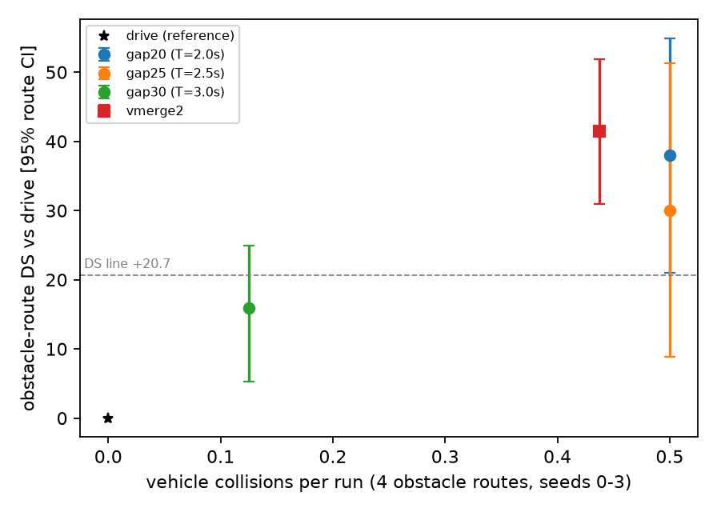

# vmerge3 gap-rule sweep: DS against collisions of the perceived non-privileged bypass

**What to look at:** `vmerge3_gap_frontier.png`, x = vehicle collisions per run on the 4 obstacle routes (seeds 0-3), y = obstacle DS vs drive with the route-cluster CI; drive sits at (0, 0) (drive has no vehicle collision on these routes), the dashed line is +20.7. Headway T = 3.0 s sits low-left (few collisions, DS +15.9, below the line); T = 2.5 and 2.0 s jump to 0.5 collisions per run with DS +30 / +38, level with the privileged vmerge2 (0.44 per run, +41.4). The frontier has no knee between 3.0 and 2.5 s: collisions go from 0.125 to 0.5 per run in one step, and DS gain comes with them.

Summary (registered line, point estimates): gap20 DS yes, full-route collisions 0.211 (8 / 38) vs 0.158: **no**; gap25 DS yes, collisions on the obstacle routes 0.5 per run, full routes not run; gap30 DS no (+15.9), collisions 0.237 (9 / 38): no. **No arm is acceptable.** The excess collisions of gap20 are on the obstacle routes (2 / 8 at seeds 0-1 against 0 for drive); on the 15 other routes it has 6 / 30 = drive's 6 / 30.

Deviations from the pre-registration, stated: (1) the stage-1 "best arm" rule (lowest acceptable T, collisions per run <= drive's on the obstacle routes) was degenerate, drive has 0 collisions on those routes, so no arm qualified and the rule said to skip stage 2; stage 2 (15 other routes x seeds 0-1) was run for gap20 anyway at the coordinator's request, as the arm with the best DS. gap25 has no full-route runs. (2) The pull-out flag comes from plans.jsonl (bypass path active within 3 s before to 1 s after the contact stamp); `pullout_coll` / `side_pullout` count first contacts per actor and can exceed the official count. The seed 2-3 runs of gap30 are new runs; seeds 0-1 are the earlier vm3norel runs. Route CIs rest on 4 routes; the full-route collision rates (8 / 38 vs 6 / 38) are not separable from noise. Latency fixed (D8).

Plan: [../plans/2026-10-04-vmerge3.md](../plans/2026-10-04-vmerge3.md) (addendum, pre-registered). Arms are `vm3norel` (perceived bypass, no release check) with the follower headway T of the start rule d = T + T x v: `gap20` T = 2.0 s, `gap25` 2.5 s, `gap30` 3.0 s (seeds 0, 1 are the earlier vm3norel runs, seeds 2, 3 new). References: `drive`, `vmerge2` (privileged bypass). Collision counts: `coll_vehicle` = official vehicle collisions; `pullout_coll` / `side_pullout` count first contacts per actor, so they can exceed it (the scorer merges contacts within a cool-down). Pull-out collision = contact while the bypass path is active; side = pull-out contact with the other vehicle >= 1 m lateral.

## obstacle routes, seeds 0-3

| arm     |   runs |     DS |     RC |   coll_vehicle |   coll_per_run |   pullout_coll |   side_pullout |   timeouts |   blocked |   crashes |
|:--------|-------:|-------:|-------:|---------------:|---------------:|---------------:|---------------:|-----------:|----------:|----------:|
| drive   |     16 | 27.459 | 33.446 |              0 |          0     |              0 |              0 |          0 |         0 |         0 |
| vmerge2 |     16 | 68.886 | 87.778 |              7 |          0.438 |              7 |              6 |          0 |         0 |         0 |
| gap20   |     16 | 65.417 | 83.74  |              8 |          0.5   |              9 |              7 |          0 |         0 |         0 |
| gap25   |     16 | 57.534 | 80.316 |              8 |          0.5   |              9 |              8 |          0 |         0 |         0 |
| gap30   |     16 | 43.35  | 51.269 |              2 |          0.125 |              2 |              2 |          0 |         0 |         0 |

## obstacle routes, seeds 0-1

| arm     |   runs |     DS |      RC |   coll_vehicle |   coll_per_run |   pullout_coll |   side_pullout |   timeouts |   blocked |   crashes |
|:--------|-------:|-------:|--------:|---------------:|---------------:|---------------:|---------------:|-----------:|----------:|----------:|
| drive   |      8 | 27.804 |  33.824 |              0 |          0     |              0 |              0 |          0 |         0 |         0 |
| vmerge2 |      8 | 72.625 | 100     |              5 |          0.625 |              4 |              3 |          0 |         0 |         0 |
| gap20   |      8 | 73.904 |  83.599 |              2 |          0.25  |              3 |              2 |          0 |         0 |         0 |
| gap25   |      8 | 64.486 |  92.428 |              4 |          0.5   |              5 |              4 |          0 |         0 |         0 |
| gap30   |      8 | 34.438 |  43.1   |              1 |          0.125 |              1 |              1 |          0 |         0 |         0 |

## all 19 routes, seeds 0-1 (arms that have them)

| arm     |   runs |     DS |     RC |   coll_vehicle |   coll_per_run |   pullout_coll |   side_pullout |   timeouts |   blocked |   crashes |
|:--------|-------:|-------:|-------:|---------------:|---------------:|---------------:|---------------:|-----------:|----------:|----------:|
| drive   |     38 | 65.898 | 83.266 |              6 |          0.158 |              0 |              0 |          0 |         2 |         0 |
| vmerge2 |     38 | 76.67  | 92.035 |             11 |          0.289 |              4 |              3 |          0 |         4 |         0 |
| gap20   |     38 | 76.292 | 90.071 |              8 |          0.211 |              3 |              2 |          0 |         2 |         0 |
| gap25   |      8 | 64.486 | 92.428 |              4 |          0.5   |              5 |              4 |          0 |         0 |         0 |
| gap30   |     38 | 70.611 | 84.021 |              9 |          0.237 |              2 |              1 |          0 |         2 |         0 |

## Paired differences, seeds 0-3 (mean over routes [95% route-cluster CI], 2000 draws)

| contrast | routes | n routes | DS | collisions_vehicle |
|:--|:--|--:|:--|:--|
| gap20 - drive | obstacle | 4 | +37.96 [+21.00, +54.91] | +0.50 [+0.25, +1.00] |
| gap20 - drive | all | 19 | +8.68 [-2.18, +19.89] | +0.11 [-0.08, +0.32] |
| gap25 - drive | obstacle | 4 | +30.08 [+8.89, +51.26] | +0.50 [+0.19, +0.75] |
| gap25 - drive | all | 4 | +30.08 [+8.89, +51.26] | +0.50 [+0.19, +0.75] |
| gap30 - drive | obstacle | 4 | +15.89 [+5.24, +24.99] | +0.12 [+0.00, +0.38] |
| gap30 - drive | all | 19 | +6.66 [-0.54, +14.26] | +0.08 [+0.00, +0.16] |
| vmerge2 - drive | obstacle | 4 | +41.43 [+31.00, +51.86] | +0.44 [+0.12, +0.81] |
| vmerge2 - drive | all | 19 | +9.22 [-0.20, +19.79] | +0.12 [+0.00, +0.26] |
| gap20 - vmerge2 | obstacle | 4 | -3.47 [-26.12, +17.41] | +0.06 [-0.50, +0.56] |
| gap20 - vmerge2 | all | 19 | -1.38 [-6.59, +3.22] | +0.01 [-0.12, +0.14] |
| gap25 - vmerge2 | obstacle | 4 | -11.35 [-38.33, +19.62] | +0.06 [-0.62, +0.50] |
| gap25 - vmerge2 | all | 4 | -11.35 [-38.33, +19.62] | +0.06 [-0.62, +0.50] |
| gap30 - vmerge2 | obstacle | 4 | -25.54 [-29.78, -18.31] | -0.31 [-0.75, +0.12] |
| gap30 - vmerge2 | all | 19 | -3.39 [-10.19, +3.90] | -0.01 [-0.16, +0.11] |

## Paired differences, seeds 0-1 (mean over routes [95% route-cluster CI], 2000 draws)

| contrast | routes | n routes | DS | collisions_vehicle |
|:--|:--|--:|:--|:--|
| gap20 - drive | obstacle | 4 | +46.10 [+27.34, +64.86] | +0.25 [+0.00, +0.75] |
| gap20 - drive | all | 19 | +10.39 [-1.50, +23.06] | +0.05 [-0.11, +0.26] |
| gap25 - drive | obstacle | 4 | +36.68 [+21.91, +55.14] | +0.50 [+0.12, +0.88] |
| gap25 - drive | all | 4 | +36.68 [+21.91, +55.14] | +0.50 [+0.12, +0.88] |
| gap30 - drive | obstacle | 4 | +6.63 [+0.00, +19.53] | +0.12 [+0.00, +0.38] |
| gap30 - drive | all | 19 | +4.71 [-2.02, +11.93] | +0.08 [+0.00, +0.16] |
| vmerge2 - drive | obstacle | 4 | +44.82 [+25.27, +58.89] | +0.62 [+0.12, +1.25] |
| vmerge2 - drive | all | 19 | +10.77 [+0.29, +22.18] | +0.13 [-0.03, +0.32] |
| gap20 - vmerge2 | obstacle | 4 | +1.28 [-31.55, +34.11] | -0.38 [-1.12, +0.25] |
| gap20 - vmerge2 | all | 19 | -0.38 [-8.18, +7.79] | -0.08 [-0.29, +0.08] |
| gap25 - vmerge2 | obstacle | 4 | -8.14 [-37.74, +32.34] | -0.12 [-1.12, +0.75] |
| gap25 - vmerge2 | all | 4 | -8.14 [-37.74, +32.34] | -0.12 [-1.12, +0.75] |
| gap30 - vmerge2 | obstacle | 4 | -38.19 [-58.65, -17.73] | -0.50 [-1.12, +0.00] |
| gap30 - vmerge2 | all | 19 | -6.06 [-16.86, +3.05] | -0.05 [-0.26, +0.11] |

## Registered line

Acceptable = obstacle-route DS vs drive >= +20.7 and full-route vehicle collisions per run <= 0.158 (drive, seeds 0-1).

| arm | obstacle DS vs drive (seeds 0-3) | >= +20.7 | obstacle coll / run (seeds 0-3) vs drive | full-route coll / run (seeds 0-1) | <= 0.158 | verdict |
|:--|:--|:--|:--|:--|:--|:--|
| gap20 | +37.96 [+21.00, +54.91] | yes | 0.500 vs 0.000 | 0.211 (8 / 38) | no | fails collisions |
| gap25 | +30.08 [+8.89, +51.26] | yes | 0.500 vs 0.000 | not run | - | obstacle only: DS line met, full-route collisions not run |
| gap30 | +15.89 [+5.24, +24.99] | no | 0.125 vs 0.000 | 0.237 (9 / 38) | no | fails DS and collisions |

## Vehicle collisions

| arm     |   seed |   route |     t |   ego_v | actor                     |   actor_v |   rel_long |   rel_lat |   head_diff | pullout   | side   | byp_state   |
|:--------|-------:|--------:|------:|--------:|:--------------------------|----------:|-----------:|----------:|------------:|:----------|:-------|:------------|
| drive   |      0 |   27043 |  24.2 |     4.9 | ford.mustang              |     nan   |      nan   |     nan   |         nan | False     | False  |             |
| drive   |      0 |   37969 |  41.2 |     5.3 | lincoln.mkz_2020          |     nan   |      nan   |     nan   |         nan | False     | False  |             |
| drive   |      0 |    9196 |  31.3 |     1.9 | carlamotors.firetruck     |     nan   |      nan   |     nan   |         nan | False     | False  |             |
| drive   |      1 |   27043 |  24.3 |     4.8 | ford.mustang              |       0   |       -5.1 |      -1.7 |           1 | False     | False  |             |
| drive   |      1 |   37969 |  37.3 |     1.6 | ford.mustang              |       0   |       -5.3 |      -1.6 |          14 | False     | False  |             |
| drive   |      1 |    9196 |  30.6 |     1.7 | carlamotors.firetruck     |       1.8 |       -3.3 |       1.6 |          52 | False     | False  |             |
| drive   |      2 |   27043 |  24.3 |     2.3 | ford.mustang              |       0   |       -5.4 |      -1.8 |          23 | False     | False  |             |
| drive   |      2 |   37969 |  36.4 |     3.8 | ford.mustang              |       0   |       -6.1 |      -1.9 |           4 | False     | False  |             |
| drive   |      2 |    9196 |  30.6 |     4.1 | carlamotors.firetruck     |       3.1 |        1.9 |       2.9 |           9 | False     | False  |             |
| drive   |      3 |   27043 |  24.3 |     4.1 | ford.mustang              |       0   |       -5.6 |      -1.9 |          17 | False     | False  |             |
| drive   |      3 |   37969 |  41.7 |     5.3 | mercedes.coupe_2020       |       0   |       -7.8 |      -0.7 |           2 | False     | False  |             |
| drive   |      3 |    9196 |  30.7 |     3.8 | carlamotors.firetruck     |      15.4 |        7.5 |       0.9 |          16 | False     | False  |             |
| vmerge2 |      0 |   27043 |  20.4 |     3.1 | mini.cooper_s_2021        |       0   |       -4.7 |      -1.7 |          19 | False     | False  |             |
| vmerge2 |      0 |    9196 |  35.8 |     3.4 | carlamotors.firetruck     |       1.6 |       -1.3 |       3.4 |          35 | False     | False  |             |
| vmerge2 |      0 |   19324 |  30.2 |     0.5 | dodge.charger_2020        |       0.5 |        4.8 |       0   |         161 | True      | False  |             |
| vmerge2 |      0 |    2520 |  32.2 |     0   | lincoln.mkz_2017          |       6.6 |        1.8 |      -3.2 |         125 | True      | True   |             |
| vmerge2 |      0 |   19832 |  26.6 |     3.4 | dodge.charger_2020        |       4.9 |        2.6 |      -1.7 |           8 | True      | True   |             |
| vmerge2 |      1 |   27043 |  20.3 |     3.8 | mini.cooper_s_2021        |       0   |       -4.4 |      -2.3 |          30 | False     | False  |             |
| vmerge2 |      1 |   37969 |  46.9 |     3.6 | dodge.charger_2020        |       3.6 |        0.2 |      -1.8 |           1 | False     | False  |             |
| vmerge2 |      1 |    9196 |  35.9 |     3.8 | carlamotors.firetruck     |       1.3 |       -0.6 |       3.5 |          23 | False     | False  |             |
| vmerge2 |      1 |   17280 |  18.4 |     0.3 | nissan.patrol_2021        |       0   |        4.1 |      -2.8 |         113 | False     | False  |             |
| vmerge2 |      1 |   19832 |  38.4 |     3.6 | lincoln.mkz_2020          |       0   |       -4.8 |      -2.6 |          34 | True      | True   |             |
| vmerge2 |      2 |   27043 |  20.3 |     3.3 | mini.cooper_s_2021        |       3   |       -1.6 |      -2.3 |          14 | False     | False  |             |
| vmerge2 |      2 |   37969 |  46.9 |     3.3 | dodge.charger_2020        |       0   |       -1.1 |      -1.9 |           1 | False     | False  |             |
| vmerge2 |      2 |    9196 |  36   |     3.4 | carlamotors.firetruck     |       1.4 |       -0.2 |       3.8 |          29 | False     | False  |             |
| vmerge2 |      2 |   17280 |  18.6 |     0.1 | nissan.patrol_2021        |       0.3 |        3.5 |       0   |          95 | False     | False  |             |
| vmerge2 |      2 |    2520 |  33   |     0   | dodge.charger_2020        |       0   |        4.1 |       2.3 |         144 | True      | True   |             |
| vmerge2 |      2 |    2520 | 125.1 |     0   | chevrolet.impala          |       0   |       -0.2 |       3.7 |          91 | True      | True   |             |
| vmerge2 |      3 |   27043 |  20.4 |     4.9 | mini.cooper_s_2021        |       1.2 |       -5.2 |      -0.6 |           6 | False     | False  |             |
| vmerge2 |      3 |   37969 |  46.9 |     3.5 | dodge.charger_2020        |       0   |       -2.1 |      -1.9 |           1 | False     | False  |             |
| vmerge2 |      3 |    9196 |  35.9 |     2.4 | carlamotors.firetruck     |       1.4 |       -0.2 |       3.2 |          19 | False     | False  |             |
| vmerge2 |      3 |   17280 |  19.1 |     0.1 | nissan.patrol_2021        |       0.1 |        3.7 |      -2.6 |         101 | False     | False  |             |
| vmerge2 |      3 |   19832 |  29.7 |     0.2 | mercedes.coupe_2020       |       0   |       -0.6 |       1.9 |           3 | True      | True   |             |
| gap20   |      0 |   27043 |  20.3 |     3.4 | mini.cooper_s_2021        |       3   |       -1.6 |      -2.3 |          12 | False     | False  |             |
| gap20   |      0 |    9196 |  35.8 |     3.4 | carlamotors.firetruck     |       1.6 |        0.2 |       3.4 |          20 | False     | False  |             |
| gap20   |      0 |   17280 |  19.1 |     4.5 | nissan.patrol_2021        |       3.3 |       -5   |      -3.4 |         160 | False     | False  |             |
| gap20   |      0 |    2520 |  38.1 |     4.2 | chevrolet.impala          |       0.1 |        0.9 |      -3.7 |         156 | True      | True   |             |
| gap20   |      1 |   27043 |  20.4 |     3.4 | mini.cooper_s_2021        |       2.4 |       -2.5 |      -2.7 |          30 | False     | False  |             |
| gap20   |      1 |    9196 |  35.9 |     3.5 | carlamotors.firetruck     |       1.3 |       -1.4 |       3.3 |          28 | False     | False  |             |
| gap20   |      1 |   17280 |  18.9 |     0   | nissan.patrol_2021        |       0   |        3.4 |      -3.3 |         135 | False     | False  |             |
| gap20   |      1 |    2520 |  33.9 |     0   | dodge.charger_2020        |       0   |        4.8 |       0.8 |         172 | True      | False  |             |
| gap20   |      1 |    2520 | 123.6 |     0.3 | mini.cooper_s_2021        |       8   |        1.5 |     -11.3 |          78 | True      | True   |             |
| gap20   |      2 |   19324 |  49.6 |     2.2 | chevrolet.impala          |       0   |       -5.3 |      -2.2 |          46 | True      | True   |             |
| gap20   |      2 |    2520 |  22.1 |     4.1 | ford.mustang              |       0   |       -9.7 |      -1.2 |           7 | True      | True   |             |
| gap20   |      2 |   19832 |  41   |     3.8 | mercedes.coupe_2020       |       0   |       -2.2 |       3.5 |          21 | True      | True   |             |
| gap20   |      3 |   24497 |  24.1 |     4.1 | dodge.charger_2020        |       0.5 |       -5.7 |      -0.9 |          27 | True      | False  |             |
| gap20   |      3 |    2520 |  32.7 |     0   | dodge.charger_2020        |       0   |        3.1 |       3.1 |         107 | True      | True   |             |
| gap20   |      3 |    2520 | 125.4 |     1.4 | chevrolet.impala          |       0   |       -4.4 |       2.8 |          63 | True      | True   |             |
| gap25   |      0 |   24497 |  59   |     3.1 | audi.tt                   |      11.5 |       13.9 |       4.5 |          23 | True      | True   |             |
| gap25   |      0 |   19324 |  51.2 |     0.1 | dodge.charger_police_2020 |       0.1 |        2.9 |       1.8 |          73 | True      | True   |             |
| gap25   |      0 |    2520 |  37   |     3.3 | chevrolet.impala          |       0.3 |       -7.7 |       1.4 |          12 | True      | True   |             |
| gap25   |      0 |    2520 |  42.6 |     0.3 | mini.cooper_s_2021        |       0.3 |        4.7 |      -0.1 |         165 | True      | False  |             |
| gap25   |      1 |   24497 |  59.6 |     4.9 | mini.cooper_s_2021        |       8   |        0.6 |      -3.5 |           9 | True      | True   |             |
| gap25   |      2 |   19324 |  50.9 |     0.1 | dodge.charger_police_2020 |       0   |        3   |       1.7 |          74 | True      | True   |             |
| gap25   |      3 |   19324 |  51.1 |     0.1 | dodge.charger_police_2020 |       0   |        3   |       1.6 |          74 | True      | True   |             |
| gap25   |      3 |    2520 |  37   |     0   | chevrolet.impala          |       0   |       -5.1 |      -2.7 |          55 | True      | True   |             |
| gap25   |      3 |    2520 |  37.9 |     0   | ford.mustang              |       0   |        2.8 |       3.1 |         123 | True      | True   |             |
| gap30   |      0 |   27043 |  20.5 |     5.1 | mini.cooper_s_2021        |       0   |       -6.9 |       0   |           1 | False     | False  |             |
| gap30   |      0 |   37969 |  53   |     3.9 | lincoln.mkz_2017          |       0   |       -2.8 |      -1.9 |           4 | False     | False  |             |
| gap30   |      0 |    9196 |  35.7 |     2.1 | carlamotors.firetruck     |       1.3 |       -1.6 |       3.3 |          37 | False     | False  |             |
| gap30   |      0 |   19324 |  50.7 |     0.1 | dodge.charger_police_2020 |       0   |        3   |       1.6 |          75 | True      | True   |             |
| gap30   |      1 |   27043 |  20.4 |     4.9 | mini.cooper_s_2021        |       0   |       -5.7 |      -0.2 |           3 | False     | False  |             |
| gap30   |      1 |   22535 |  35   |     5.7 | lincoln.mkz_2017          |       8   |        4.4 |       0.1 |          38 | True      | False  |             |
| gap30   |      1 |   37969 |  47   |     3.3 | dodge.charger_2020        |       7.1 |        4.3 |      -1.6 |           3 | False     | False  |             |
| gap30   |      1 |    9196 |  36   |     5.4 | carlamotors.firetruck     |       2.8 |        0.4 |       3.7 |          26 | False     | False  |             |
| gap30   |      1 |   17280 |  18.7 |     0   | nissan.patrol_2021        |       0   |        3.6 |      -3.1 |         125 | False     | False  |             |
| gap30   |      3 |   19324 |  51.4 |     0.1 | dodge.charger_police_2020 |       0   |        2.9 |       1.8 |          74 | True      | True   |             |
