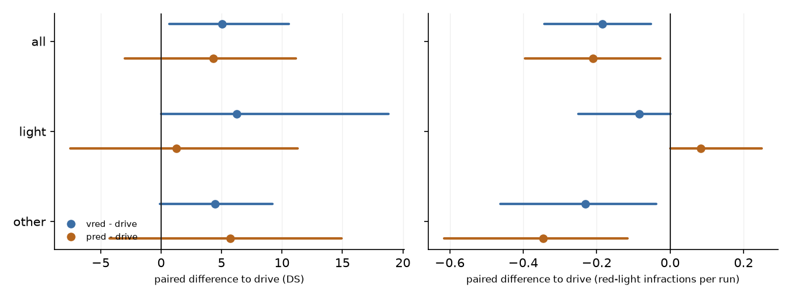
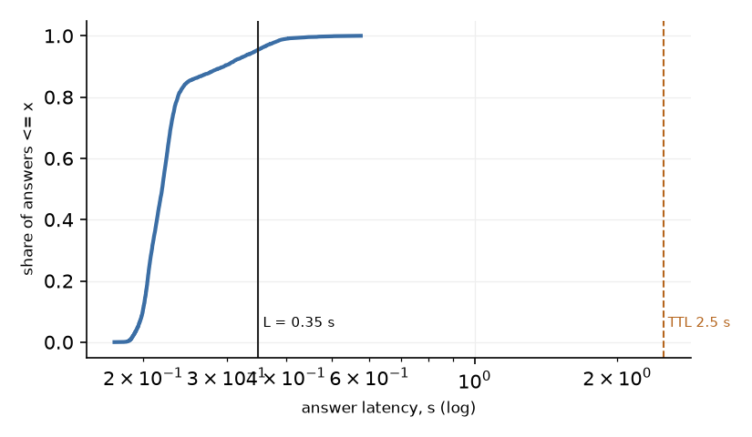

# vred: zero-shot Qwen3-VL-4B reads the traffic light, closed loop (19 routes x 2 traffic seeds)

Plan and execution log: [../plans/2026-10-02-vlm-vred.md](../plans/2026-10-02-vlm-vred.md). Offline lines of this variant: [vred_phase_a.md](vred_phase_a.md); latency calibration: [vred_calibration.md](vred_calibration.md).

## Summary (diagnostic read, 19 routes, nothing here is a confirmation)

- Phase A of the variant (3281 requests, 21 routes): ego red answered red 91.2% [85.1, 97.9] (line 80%), other-direction false positive 6.5% [3.4, 10.6] (line 10%), no-light answered red 0.0% (line 2%), latency p50 / p95 127 / 128 ms: all lines pass at the point estimate.
- Latency under load: one server per card, 3 workers per card; calibration p95 349 ms, so **L = 0.35 s**. In the batch: 6138 answers, p50 219 / p95 345 / p99 400 ms, 4.5% slower than L, 0.0% slower than the 2.5 s TTL, 100% answered.
- Red-light infractions 13 (`drive`) -> 6 (`vred`); `pred` 5. DS 65.9 -> 70.9 (`pred` 70.2): paired `vred - drive` +5.03 [+0.68, +10.56] on all routes, +6.26 [+0.00, +18.79] on the 6 scenario-set light routes, +4.46 [-0.08, +9.23] on the other 13 (several of them have a light: sensitivity set below). Retention of the `pred` gain: red-light infractions per run 0.88 [0.30, 2.25], DS 1.16 [-5.62, 7.74] on all routes (the `pred` DS gain is itself inside the noise, so the DS ratio carries no information).
- Harm on the routes without a logged light (7 routes): DS -0.15 [-0.45, 0.00], no new blocked, no new collision. On the 13 scenario-set "other" routes: 1 run with more blocked events, 1 run with more collisions than its `drive` pair, summed collisions 9 vs 9.
- The DS gain is concentrated on four routes (15612 +37.6, 24944 +30, 27870 +15, 16529 +15); repeat noise of identical `drive` runs reaches 30 DS per route (results/report.md).
- Remaining 6 red-light infractions: 2 = the light turned red a moment after the car crossed the line on green (16390, same in `drive` and `pred`); 2 = the light turned yellow 5 m before the line at 5 m/s, red answered with ~0.7 s delay and the car stopped 1.8 m past the line (27297); 2 = R2 held the car, but its stop target (junction entrance) is 3.2-3.6 m beyond the light's stop line and the car crept across it at 1-2 m/s (15612 seed 1, 16529 seed 0). Details below.
- Registered confirmation lines: not evaluated (19 routes < 30).

Diagnostic batch. Every number is a read, not a confirmation: registered confirmation lines are listed with their value and marked not evaluated (19 routes < 30). `drive` and `pred` are the existing runs of the earlier batch (not rerun); `vred` ran with the same base configuration (decision-82 resume setting, deviation D5), rows R2 + R5, light question answered by zero-shot Qwen3-VL-4B (one forward pass, option scoring, both cameras, 1153 visual tokens); R3 off (deviation D18).

## Arms

| arm   |   runs |   crashes |    DS |    RC |   red_light |   stop_sign |   collisions |   blocked |   timeouts |   v_mean |
|:------|-------:|----------:|------:|------:|------------:|------------:|-------------:|----------:|-----------:|---------:|
| drive |     38 |         0 | 65.9  | 83.27 |          13 |           2 |           11 |         2 |          0 |     2.2  |
| pred  |     38 |         0 | 70.23 | 83.99 |           5 |           2 |           13 |         0 |          0 |     1.87 |
| vred  |     38 |         0 | 70.92 | 83.86 |           6 |           2 |           11 |         2 |          0 |     2.01 |

Official infraction counts summed over the runs; DS, RC, mean speed averaged over runs; expected runs per arm: 38. `crashes` are program crashes (excluded from the paired reads).

## Paired differences to `drive` (mean over routes of the per-route mean over the two seeds; [95% route-cluster CI])

`light routes` = 16390, 15612, 15483, 27043, 15102, 28147 (scenario types with a traffic light, as in results/report.md; primary); `other routes` = the remaining 13. `logged-light routes` = 15102, 15483, 15612, 16390, 16508, 16529, 24944, 27043, 27297, 27870, 28147, 9196 (sensitivity: an ego light was seen within 50 m in the vred logs); `no logged light` = the rest. Counts are per run (difference of the per-route mean over seeds), so +0.50 is one extra event in one of two runs of a route.

| contrast | routes | n routes | DS | RC | red light | blocked | collisions | mean speed m/s |
|:--|:--|--:|:--|:--|:--|:--|:--|:--|
| vred - drive | all routes | 19 | +5.03 [+0.68, +10.56] | +0.59 [-3.31, +5.10] | -0.18 [-0.34, -0.05] | +0.00 [-0.08, +0.08] | +0.00 [+0.00, +0.00] | -0.19 [-0.43, +0.03] |
| vred - drive | light routes | 6 | +6.26 [+0.00, +18.79] | +5.38 [+0.00, +16.13] | -0.08 [-0.25, +0.00] | -0.08 [-0.25, +0.00] | +0.00 [+0.00, +0.00] | -0.15 [-0.69, +0.31] |
| vred - drive | other routes | 13 | +4.46 [-0.08, +9.23] | -1.61 [-4.84, +0.00] | -0.23 [-0.46, -0.04] | +0.04 [+0.00, +0.12] | +0.00 [+0.00, +0.00] | -0.21 [-0.47, +0.01] |
| vred - drive | logged-light routes | 12 | +8.05 [+1.25, +15.66] | +0.94 [-5.25, +8.07] | -0.29 [-0.50, -0.08] | +0.00 [-0.12, +0.12] | +0.00 [+0.00, +0.00] | -0.34 [-0.68, -0.01] |
| vred - drive | no logged light | 7 | -0.15 [-0.45, +0.00] | +0.00 [+0.00, +0.00] | +0.00 [+0.00, +0.00] | +0.00 [+0.00, +0.00] | +0.00 [+0.00, +0.00] | +0.07 [+0.01, +0.15] |
| pred - drive | all routes | 19 | +4.33 [-3.00, +11.16] | +0.72 [-5.22, +6.24] | -0.21 [-0.39, -0.03] | -0.05 [-0.13, +0.00] | +0.05 [+0.00, +0.13] | -0.33 [-0.60, -0.06] |
| pred - drive | light routes | 6 | +1.26 [-7.50, +11.29] | +5.38 [+0.00, +16.13] | +0.08 [+0.00, +0.25] | -0.08 [-0.25, +0.00] | +0.00 [+0.00, +0.00] | -0.16 [-0.71, +0.33] |
| pred - drive | other routes | 13 | +5.75 [-4.26, +14.94] | -1.43 [-9.25, +4.84] | -0.35 [-0.62, -0.12] | -0.04 [-0.12, +0.00] | +0.08 [+0.00, +0.19] | -0.41 [-0.70, -0.12] |
| pred - drive | logged-light routes | 12 | +9.85 [+1.71, +18.13] | +4.44 [+0.00, +10.76] | -0.33 [-0.62, -0.04] | -0.08 [-0.21, +0.00] | +0.04 [+0.00, +0.12] | -0.40 [-0.77, -0.04] |
| pred - drive | no logged light | 7 | -5.12 [-15.58, +0.21] | -5.65 [-17.28, +0.32] | +0.00 [+0.00, +0.00] | +0.00 [+0.00, +0.00] | +0.07 [+0.00, +0.21] | -0.20 [-0.56, +0.02] |

Harm on the other routes (26 runs): runs with more blocked events than their `drive` pair 1; runs with more collisions 1; summed collisions vred 9 vs drive 9; summed blocked 2 vs 1.

## Retention of the privileged gain: (vred - drive) / (pred - drive)

Ratio of the route means of the paired differences, [95% route-cluster CI]. The denominator is itself small and its interval includes zero in several rows: read the point estimate with that in mind.

| quantity | routes | retention |
|:--|:--|:--|
| DS | all routes | 1.16 [-5.62, 7.74] (+5.03 / +4.33, 19 routes) |
| red-light infractions per run | all routes | 0.88 [0.30, 2.25] (-0.18 / -0.21, 19 routes) |
| DS | light routes | 4.95 [-5.07, 4.95] (+6.26 / +1.26, 6 routes) |
| red-light infractions per run | light routes | -1.00 [nan, 0.00] (-0.08 / +0.08, 6 routes) |
| DS | other routes | 0.78 [-4.65, 4.81] (+4.46 / +5.75, 13 routes) |
| red-light infractions per run | other routes | 0.67 [0.25, 1.00] (-0.23 / -0.35, 13 routes) |
| DS | logged-light routes | 0.82 [0.25, 2.14] (+8.05 / +9.85, 12 routes) |
| red-light infractions per run | logged-light routes | 0.88 [0.36, 2.50] (-0.29 / -0.33, 12 routes) |
| DS | no logged light | 0.03 [0.00, 0.03] (-0.15 / -5.12, 7 routes) |
| red-light infractions per run | no logged light | n/a |

## In-batch latency of the light answers

`latency_ms` = from the hand-over of the frames to the answer (frame conversion, JPEG encoding, wait for a pool thread, HTTP, server queue and service). L = 0.35 s: an answer is used at t_q + max(L, latency). TTL = 2.5 s.

| requests | answered ok | p50 ms | p95 ms | p99 ms | max ms | share > L | share > 1 s | share > TTL (2.5 s) | server queue p95 ms | server service p50 ms | effective delay p95 s |
|--:|--:|--:|--:|--:|--:|--:|--:|--:|--:|--:|--:|
| 6138 | 100.00% | 219 | 345 | 400 | 576 | 4.5% | 0.00% | 0.00% | 126 | 159 | 0.35 |

Calibration for L (shadow run, same concurrency): see `calibration.md`; p95 there 349 ms.

## In-loop reading quality (answers logged during the vred runs against the simulator's light state)

Same label rows as Phase A (`vlm_arb_phase_a`), but on the frames the car saw while the VLM was driving: the car stops at red lights, so the frames are not the shadow distribution. Estimate [95% route-cluster CI].

| readout | value | requests | routes | registered line |
|:--|:--|--:|--:|:--|
| ego red / yellow answered red, 0-50 m | 91.9% [84.0, 98.7] | 959 | 11 | >= 80% |
| ... 0-20 m | 96.2% [90.3, 99.3] | 768 | 11 |  |
| ... 20-50 m | 74.3% [69.2, 100.0] | 191 | 2 |  |
| ego red / yellow answered green, 0-50 m | 3.5% [0.8, 7.4] | 959 | 11 |  |
| ego green answered green, 0-50 m | 74.1% [47.1, 95.4] | 406 | 12 |  |
| another direction red, ego not red: answered red | 9.8% [3.1, 19.4] | 1639 | 15 | <= 10% |
| no light: answered red | 0.0% [0.0, 0.0] | 3431 | 7 | <= 2% |

## Per route (DS and red-light counts are means / sums over the two seeds; R2 stops = episodes of R2 holding the car; light: yes = scenario set, * = ego light seen in the vred logs)

|   route | light   |   DS_drive |   DS_vred |   dDS |   DS_pred |   red_drive |   red_vred |   red_pred |   R2_stops_s0 |   R2_stops_s1 |   blocked_vred |   coll_drive |   coll_vred |   v_drive |   v_vred |
|--------:|:--------|-----------:|----------:|------:|----------:|------------:|-----------:|-----------:|--------------:|--------------:|---------------:|-------------:|------------:|----------:|---------:|
|   27043 | yes*    |       60   |      60   |   0   |      60   |           0 |          0 |          0 |             1 |             1 |              0 |            2 |           2 |      2.9  |     3.6  |
|   15102 | yes*    |      100   |     100   |   0   |     100   |           0 |          0 |          0 |             1 |             1 |              0 |            0 |           0 |      2.42 |     1.1  |
|   24944 | *       |       70   |     100   |  30   |     100   |           2 |          0 |          0 |             1 |             2 |              0 |            0 |           0 |      1.56 |     1.42 |
|   27870 | *       |       85   |     100   |  15   |     100   |           1 |          0 |          0 |             1 |             1 |              0 |            0 |           0 |      3.65 |     2.74 |
|   22535 |         |      100   |     100   |   0   |     100   |           0 |          0 |          0 |             0 |             0 |              0 |            0 |           0 |      3.33 |     3.62 |
|   37969 |         |       60   |      59   |  -1   |      23.6 |           0 |          0 |          0 |             0 |             0 |              0 |            2 |           2 |      3.22 |     3.34 |
|   24497 |         |       21.2 |      21.2 |   0   |      21.7 |           0 |          0 |          0 |             0 |             0 |              0 |            2 |           2 |      0.23 |     0.23 |
|   27297 | *       |       70   |      70   |   0   |     100   |           2 |          2 |          0 |             1 |             1 |              0 |            0 |           0 |      3.17 |     3.21 |
|    9196 | *       |       28.4 |      27.4 |  -1   |      34   |           2 |          0 |          0 |             1 |             1 |              2 |            3 |           3 |      1.35 |     0.37 |
|   28147 | yes*    |      100   |     100   |   0   |     100   |           0 |          0 |          0 |             1 |             1 |              0 |            0 |           0 |      2.22 |     2.13 |
|   16390 | yes*    |       70   |      70   |   0   |      70   |           2 |          2 |          2 |             0 |             0 |              0 |            0 |           0 |      4.16 |     4.16 |
|   15612 | yes*    |       47.4 |      85   |  37.6 |      70   |           2 |          1 |          2 |             2 |             1 |              0 |            0 |           0 |      0.97 |     1.24 |
|   15483 | yes*    |      100   |     100   |   0   |      85   |           0 |          0 |          1 |             1 |             1 |              0 |            0 |           0 |      1.66 |     1.19 |
|   17280 |         |       80   |      80   |   0   |      80   |           0 |          0 |          0 |             0 |             0 |              0 |            0 |           0 |      4.9  |     4.96 |
|   16529 | *       |       70   |      85   |  15   |     100   |           2 |          1 |          0 |             2 |             1 |              0 |            0 |           0 |      2.17 |     1.08 |
|   16508 | *       |      100   |     100   |   0   |     100   |           0 |          0 |          0 |             0 |             0 |              0 |            0 |           0 |      3.22 |     3.17 |
|   19324 |         |       33.4 |      33.4 |   0   |      33.4 |           0 |          0 |          0 |             0 |             0 |              0 |            0 |           0 |      0.23 |     0.23 |
|    2520 |         |       23.5 |      23.5 |   0   |      23.5 |           0 |          0 |          0 |             0 |             0 |              0 |            2 |           2 |      0.25 |     0.25 |
|   19832 |         |       33.1 |      33.1 |   0   |      33.1 |           0 |          0 |          0 |             0 |             0 |              0 |            0 |           0 |      0.23 |     0.23 |

## Green after red

16 red-to-green changes of the ego light while R2 held the car. Seconds after the light turned green (median [p5, p95]): second consecutive green answer in force 0.9 [0.9, 13.1] (1 never reached); R2 released 1.0 [0.5, 20.3]; car rolling (> 1 m/s) 2.0 [1.5, 21.3] (0 never).

|   route |   seed |   t_green |   answer |   r2_end |   roll |
|--------:|-------:|----------:|---------:|---------:|-------:|
|   27043 |      0 |      13.1 |      0.9 |      0.5 |    1.5 |
|   27043 |      1 |      13.1 |      0.9 |      0.5 |    1.5 |
|   15102 |      0 |      44.6 |      0.9 |      1   |    2   |
|   15102 |      1 |      44.6 |      0.9 |      1   |    2   |
|   24944 |      1 |      29.6 |      1.4 |      1.5 |    1.5 |
|   27870 |      0 |      14.6 |      0.9 |      1   |    1.5 |
|   27870 |      1 |      14.6 |      0.9 |      1   |    1.5 |
|    9196 |      0 |      29.6 |      0.9 |      1   |    2   |
|    9196 |      1 |      29.6 |      0.9 |      1   |    2   |
|   28147 |      0 |       5.6 |      1.4 |      1.5 |    1.5 |
|   28147 |      1 |       5.6 |      1.4 |      1.5 |    1.5 |
|   15612 |      0 |      15.6 |     39.4 |     37.5 |   38.5 |
|   15483 |      0 |      22.1 |      0.9 |      1   |    2   |
|   15483 |      1 |      22.1 |      1.9 |      2   |    3   |
|   16529 |      0 |      29.6 |    nan   |     14.5 |   15.5 |
|   16529 |      1 |      29.6 |      0.9 |      1   |    2   |

## R5 fallback

2 episodes in the 38 vred runs.

|   route |   seed |    t |   duration_s | cause        | light   |
|--------:|-------:|-----:|-------------:|:-------------|:--------|
|   15612 |      0 | 53.1 |            1 | held > T_max | [0]     |
|   16529 |      0 | 44.1 |            1 | held > T_max | [2]     |

## Remaining red-light infractions in vred (6)

The machine label in the last column of the table is unreliable (it reads every run with an R2 episode as "held"); the causes below were read from the timelines and `ticks.jsonl` by hand. Columns: stop line = the tick where the logged ego light's stop line was passed on yellow / red; rolling on red = first tick past it on red with v > 0.5 m/s.

|   route |   seed |   light_id |   t_line | state_at_line   |   t_red_rolling |   v_line | cause                                                |
|--------:|-------:|-----------:|---------:|:----------------|----------------:|---------:|:-----------------------------------------------------|
|   27297 |      0 |       4173 |     10.7 | yellow          |            12.3 |      4.7 | R2 held at the line, crossed anyway (pushed through) |
|   27297 |      1 |       4171 |     11   | yellow          |            12.5 |      3.1 | R2 held at the line, crossed anyway (pushed through) |
|   16390 |      0 |       6911 |    nan   | nan             |           nan   |    nan   | crossing not found in the log (n_cross=0)            |
|   16390 |      1 |       6908 |    nan   | nan             |           nan   |    nan   | crossing not found in the log (n_cross=0)            |
|   15612 |      1 |        881 |      7.9 | red             |             7.9 |      2.1 | R2 held at the line, crossed anyway (pushed through) |
|   16529 |      0 |       1498 |     10   | red             |            10   |      1.1 | R2 held at the line, crossed anyway (pushed through) |

Route 27297 seed 0, light 4173, stop line at t = 10.7 s (yellow), rolling on red at t = 12.3 s: R2 held at the line, crossed anyway (pushed through)

|    t |   v |   line_m | rules   | fresh   | last_K   | answer_in_force          | truth          |
|-----:|----:|---------:|:--------|:--------|:---------|:-------------------------|:---------------|
|  3.6 | 0   |    22.32 | -       | True    | gre,gre  | gre (q 3.1, lat 0.19 s)  | tl 0 @ 18.59 m |
|  4.1 | 0   |    22.32 | -       | True    | gre,gre  | gre (q 3.6, lat 0.19 s)  | tl 0 @ 18.59 m |
|  4.6 | 0   |    22.32 | -       | True    | gre,gre  | gre (q 4.1, lat 0.20 s)  | tl 0 @ 18.59 m |
|  5.1 | 0   |    22.32 | -       | True    | gre,gre  | gre (q 4.6, lat 0.33 s)  | tl 0 @ 18.59 m |
|  5.6 | 0   |    22.32 | -       | True    | gre,gre  | gre (q 5.1, lat 0.19 s)  | tl 0 @ 18.59 m |
|  6.1 | 1.2 |    22.32 | -       | True    | gre,gre  | gre (q 5.6, lat 0.21 s)  | tl 0 @ 18.59 m |
|  6.6 | 2.1 |    22.32 | -       | True    | gre,gre  | gre (q 6.1, lat 0.20 s)  | tl 0 @ 18.59 m |
|  7.1 | 3.2 |    21.38 | -       | True    | gre,gre  | gre (q 6.6, lat 0.21 s)  | tl 0 @ 18.59 m |
|  7.6 | 4.2 |    19.51 | -       | True    | gre,gre  | gre (q 7.1, lat 0.20 s)  | tl 0 @ 17.57 m |
|  8.1 | 5   |    17.27 | -       | True    | gre,gre  | gre (q 7.6, lat 0.20 s)  | tl 0 @ 15.53 m |
|  8.6 | 5.2 |    14.76 | -       | True    | gre,gre  | gre (q 8.1, lat 0.33 s)  | tl 0 @ 13.49 m |
|  9.1 | 5.2 |    12.19 | -       | True    | gre,gre  | gre (q 8.6, lat 0.21 s)  | tl 0 @ 10.43 m |
|  9.6 | 5.3 |     9.41 | -       | True    | gre,gre  | gre (q 9.1, lat 0.21 s)  | tl 0 @ 8.4 m   |
| 10.1 | 5.3 |     6.75 | -       | True    | gre,red  | red (q 9.6, lat 0.34 s)  | tl 1 @ 5.34 m  |
| 10.6 | 5.1 |     4.09 | R2      | True    | red,red  | red (q 10.1, lat 0.21 s) | tl 1 @ 3.3 m   |
| 11.1 | 2.6 |     2.36 | R2      | True    | red,red  | red (q 10.6, lat 0.20 s) | tl 1 @ 0.24 m  |
| 11.6 | 0   |     1.56 | R2      | True    | red,red  | red (q 11.1, lat 0.21 s) | tl 1 @ -1.8 m  |
| 12.1 | 0   |     1.61 | R2      | True    | red,gre  | gre (q 11.6, lat 0.21 s) | tl 1 @ -1.8 m  |
| 12.6 | 0.8 |     1.28 | R2      | True    | gre,red  | red (q 12.1, lat 0.27 s) | tl 1 @ -1.8 m  |

Route 27297 seed 1, light 4171, stop line at t = 11.0 s (yellow), rolling on red at t = 12.5 s: R2 held at the line, crossed anyway (pushed through)

|    t |   v |   line_m | rules   | fresh   | last_K   | answer_in_force          | truth          |
|-----:|----:|---------:|:--------|:--------|:---------|:-------------------------|:---------------|
|  3.6 | 0   |    22.32 | -       | True    | gre,gre  | gre (q 3.1, lat 0.29 s)  | tl 0 @ 18.59 m |
|  4.1 | 0   |    22.32 | -       | True    | gre,gre  | gre (q 3.6, lat 0.22 s)  | tl 0 @ 18.59 m |
|  4.6 | 0   |    22.32 | -       | True    | gre,gre  | gre (q 4.1, lat 0.20 s)  | tl 0 @ 18.59 m |
|  5.1 | 0   |    22.32 | -       | True    | gre,gre  | gre (q 4.6, lat 0.21 s)  | tl 0 @ 18.59 m |
|  5.6 | 0   |    22.32 | -       | True    | gre,gre  | gre (q 5.1, lat 0.21 s)  | tl 0 @ 18.59 m |
|  6.1 | 1.3 |    22.32 | -       | True    | gre,gre  | gre (q 5.6, lat 0.22 s)  | tl 0 @ 18.59 m |
|  6.6 | 2.1 |    22.32 | -       | True    | gre,gre  | gre (q 6.1, lat 0.31 s)  | tl 0 @ 18.59 m |
|  7.1 | 3.1 |    21.37 | -       | True    | gre,gre  | gre (q 6.6, lat 0.22 s)  | tl 0 @ 18.59 m |
|  7.6 | 4.1 |    19.54 | -       | True    | gre,gre  | gre (q 7.1, lat 0.22 s)  | tl 0 @ 17.57 m |
|  8.1 | 5   |    17.32 | -       | True    | gre,gre  | gre (q 7.6, lat 0.21 s)  | tl 0 @ 15.53 m |
|  8.6 | 5   |    14.82 | -       | True    | gre,gre  | gre (q 8.1, lat 0.35 s)  | tl 0 @ 13.49 m |
|  9.1 | 5.2 |    12.23 | -       | True    | gre,gre  | gre (q 8.6, lat 0.21 s)  | tl 0 @ 10.43 m |
|  9.6 | 5   |     9.53 | -       | True    | gre,gre  | gre (q 9.1, lat 0.21 s)  | tl 0 @ 8.4 m   |
| 10.1 | 4.7 |     7.09 | -       | True    | gre,red  | red (q 9.6, lat 0.21 s)  | tl 1 @ 5.34 m  |
| 10.6 | 4.1 |     4.84 | R2      | True    | red,red  | red (q 10.1, lat 0.21 s) | tl 1 @ 3.3 m   |
| 11.1 | 2.9 |     3.19 | R2      | True    | red,red  | red (q 10.6, lat 0.21 s) | tl 1 @ 1.26 m  |
| 11.6 | 1.8 |     1.97 | R2      | True    | red,red  | red (q 11.1, lat 0.22 s) | tl 1 @ -0.78 m |
| 12.1 | 0   |     1.5  | R2      | True    | red,red  | red (q 11.6, lat 0.27 s) | tl 1 @ -1.8 m  |
| 12.6 | 0.7 |     1.32 | R2      | True    | red,red  | red (q 12.1, lat 0.21 s) | tl 1 @ -1.8 m  |

Route 15612 seed 1, light 881, stop line at t = 7.9 s (red), rolling on red at t = 7.9 s: R2 held at the line, crossed anyway (pushed through)

|   t |   v |   line_m | rules   | fresh   | last_K   | answer_in_force         | truth         |
|----:|----:|---------:|:--------|:--------|:---------|:------------------------|:--------------|
| 0.1 | 0   |     5.78 | -       | False   |          | -                       | nan           |
| 0.6 | 0   |     5.78 | -       | True    | red      | red (q 0.1, lat 0.41 s) | tl 2 @ 2.16 m |
| 1.1 | 0   |     5.78 | R2      | True    | red,red  | red (q 0.6, lat 0.37 s) | tl 2 @ 2.16 m |
| 1.6 | 0   |     5.78 | R2      | True    | red,red  | red (q 1.1, lat 0.36 s) | tl 2 @ 2.16 m |
| 2.1 | 0   |     5.78 | R2      | True    | red,red  | red (q 1.6, lat 0.32 s) | tl 2 @ 2.16 m |
| 2.6 | 0   |     5.78 | R2      | True    | red,red  | red (q 2.1, lat 0.33 s) | tl 2 @ 2.16 m |
| 3.1 | 0   |     5.78 | R2      | True    | red,red  | red (q 2.6, lat 0.46 s) | tl 2 @ 2.16 m |
| 3.6 | 0   |     5.78 | R2      | True    | red,red  | red (q 3.1, lat 0.34 s) | tl 2 @ 2.16 m |
| 4.1 | 0   |     5.78 | R2      | True    | red,red  | red (q 3.6, lat 0.40 s) | tl 2 @ 2.16 m |
| 4.6 | 0   |     5.78 | R2      | True    | red,red  | red (q 4.1, lat 0.40 s) | tl 2 @ 2.16 m |
| 5.1 | 0   |     5.78 | R2      | True    | red,red  | red (q 4.6, lat 0.22 s) | tl 2 @ 2.16 m |
| 5.6 | 0   |     5.78 | R2      | True    | red,red  | red (q 5.1, lat 0.22 s) | tl 2 @ 2.16 m |
| 6.1 | 1.1 |     5.78 | R2      | True    | red,red  | red (q 5.6, lat 0.22 s) | tl 2 @ 2.16 m |
| 6.6 | 1.8 |     5.78 | R2      | True    | red,red  | red (q 6.1, lat 0.21 s) | tl 2 @ 2.16 m |
| 7.1 | 2.2 |     5.19 | R2      | True    | red,red  | red (q 6.6, lat 0.35 s) | tl 2 @ 2.16 m |
| 7.6 | 2.3 |     4.05 | R2      | True    | red,red  | red (q 7.1, lat 0.23 s) | tl 2 @ 1.16 m |
| 8.1 | 1.9 |     3.06 | R2      | True    | red,gre  | gre (q 7.6, lat 0.31 s) | tl 2 @ 0.16 m |

Route 16529 seed 0, light 1498, stop line at t = 10.0 s (red), rolling on red at t = 10.0 s: R2 held at the line, crossed anyway (pushed through)

|    t |   v |   line_m | rules   | fresh   | last_K   | answer_in_force         | truth         |
|-----:|----:|---------:|:--------|:--------|:---------|:------------------------|:--------------|
|  1.1 | 0   |     5.33 | R2      | True    | red,red  | red (q 0.6, lat 0.19 s) | tl 2 @ 2.16 m |
|  1.6 | 0   |     5.33 | R2      | True    | red,red  | red (q 1.1, lat 0.23 s) | tl 2 @ 2.16 m |
|  2.1 | 0   |     5.33 | R2      | True    | red,red  | red (q 1.6, lat 0.22 s) | tl 2 @ 2.16 m |
|  2.6 | 0   |     5.33 | R2      | True    | red,red  | red (q 2.1, lat 0.23 s) | tl 2 @ 2.16 m |
|  3.1 | 0   |     5.33 | R2      | True    | red,red  | red (q 2.6, lat 0.22 s) | tl 2 @ 2.16 m |
|  3.6 | 0   |     5.33 | R2      | True    | red,red  | red (q 3.1, lat 0.23 s) | tl 2 @ 2.16 m |
|  4.1 | 0   |     5.33 | R2      | True    | red,red  | red (q 3.6, lat 0.22 s) | tl 2 @ 2.16 m |
|  4.6 | 0   |     5.33 | R2      | True    | red,red  | red (q 4.1, lat 0.24 s) | tl 2 @ 2.16 m |
|  5.1 | 0   |     5.33 | R2      | True    | red,red  | red (q 4.6, lat 0.22 s) | tl 2 @ 2.16 m |
|  5.6 | 0   |     5.33 | R2      | True    | red,red  | red (q 5.1, lat 0.22 s) | tl 2 @ 2.16 m |
|  6.1 | 1.1 |     5.33 | R2      | True    | red,red  | red (q 5.6, lat 0.20 s) | tl 2 @ 2.16 m |
|  6.6 | 1.7 |     5.33 | R2      | True    | red,red  | red (q 6.1, lat 0.21 s) | tl 2 @ 2.16 m |
|  7.1 | 2.1 |     4.6  | R2      | True    | red,red  | red (q 6.6, lat 0.22 s) | tl 2 @ 2.16 m |
|  7.6 | 2.2 |     3.56 | R2      | True    | red,red  | red (q 7.1, lat 0.19 s) | tl 2 @ 2.16 m |
|  8.1 | 1.4 |     2.57 | R2      | True    | red,red  | red (q 7.6, lat 0.23 s) | tl 2 @ 0.16 m |
|  8.6 | 0   |     2.41 | R2      | True    | red,gre  | gre (q 8.1, lat 0.20 s) | tl 2 @ 0.16 m |
|  9.1 | 0   |     2.42 | -       | True    | gre,gre  | gre (q 8.6, lat 0.20 s) | tl 2 @ 0.16 m |
|  9.6 | 0.1 |     2.53 | -       | True    | gre,red  | red (q 9.1, lat 0.20 s) | tl 2 @ 0.16 m |
| 10.1 | 1.2 |     2.27 | R2      | True    | red,red  | red (q 9.6, lat 0.23 s) | tl 2 @ 0.16 m |

### Cause of each remaining infraction (checked by hand against the timelines and ticks.jsonl)

| run | cause | evidence |
|:--|:--|:--|
| 16390 seed 0 and seed 1 | **light turned red after the car had crossed the stop line on green** (not a reading or latency failure; `drive` and `pred` also have 2 here) | ticks: tl 0 at tl_dist +0.16 (t = 7.4 s), tl 0 at -1.84 (7.6), tl 2 at -1.84 (7.8) in both seeds, v 4.0-4.8 m/s |
| 27297 seed 0 and seed 1 | **answered late** (light yellow 5.3 m before the line at 5.1-5.3 m/s; first red answer in force at the t = 10.6 tick, line 4.1 m) and **stopped past the line**: R2 stopped the car 1.8 m beyond the stop line (tl_dist -1.8), then it crept forward under R2 (v 0.7-0.8 m/s at t = 12.6) and was counted as running the red. `pred` has 0 here | timeline: tl 1 @ 5.34 m answered red at q 9.6 (immediate), K = 2 and 0.2-0.3 s latency put R2 on at 10.6 |
| 15612 seed 1 | **R2 held, the car crept across the line**: standing since t = 0.6 under R2, it started rolling at t = 5.7 (plan `go` flag on) toward R2's stop target, the junction entrance, which is 3.6 m beyond the light's stop line (line 5.78 m vs tl_dist 2.16 m); crossed at 2.1 m/s on red (7.9 s) | plans.jsonl: `src` R2, `go` true from 5.2 s, v 0.7 at 5.8 s, 1.0 at 6.0 s; answers red throughout |
| 16529 seed 0 | the same creep (line 5.33 m vs tl_dist 2.16 m), the car stopped at the line (tl_dist 0.16, v 0) at 8.6 s, **the answer turned green while the red light was almost overhead** (two green answers at q 8.1 and 8.6, truth red), R2 released at 9.1 s, the car rolled on red at 10.0 s | timeline above; this is a reading error, caused by the car standing under the light |

Other effects of the same geometry, from the logs: (1) 15612 seed 0 stopped 2.84 m beyond the light's stop line, the light turned green at t = 15.6 s but the VLM kept alternating green / red answers (never two consecutive green) for 37 s, so R2 was released only by R5 after 25 s (53.1 s): the release delay of 39 s in the green-after-red table. (2) 16529 seed 0: R5 released a hold after 25 s on a still-red light at t = 44.1 (the red phase outlasted T_max). (3) In-loop ego-green recall is 74.1% [47.1, 95.4] against 95.7% offline: the car standing under the light cannot see it.

## Registered lines (plan 4.3), vred

| line | read | status |
|:--|:--|:--|
| harmless on non-target routes: DS CI lower bound >= -5, no new blocked, no new collision | DS +4.46 [-0.08, +9.23]; blocked +1, collisions +0 | not evaluated at this size (13 routes < 30) |
| useful on target routes: red-light infractions fall, DS CI lower bound > 0, retention >= 50% | DS +6.26 [+0.00, +18.79]; red light -1 runs; retention (DS, light routes) 4.95 [-5.07, 4.95] (+6.26 / +1.26, 6 routes) | not evaluated at this size (6 routes < 30) |

Deviations and limits: [plan section 2](../plans/2026-10-02-vlm-vred.md) (D17-D24: Qwen3-VL-4B replaces openjev as the gated model; R3 off; per-card batch-1 servers; latency definition; calibration run is a closed-loop shadow run).

Figure: paired difference to `drive` per route set for `vred` and the privileged `pred` (dot: mean over routes, bar: 95% route-cluster CI), DS on the left and red-light infractions per run on the right. Look at whether `vred` sits near `pred` and whether any bar clears zero.

Figure: cumulative distribution of the in-batch answer latency, with L and the TTL. Look at how far the curve stays left of L and the size of the tail beyond it.
