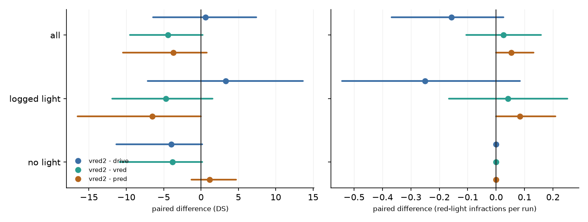
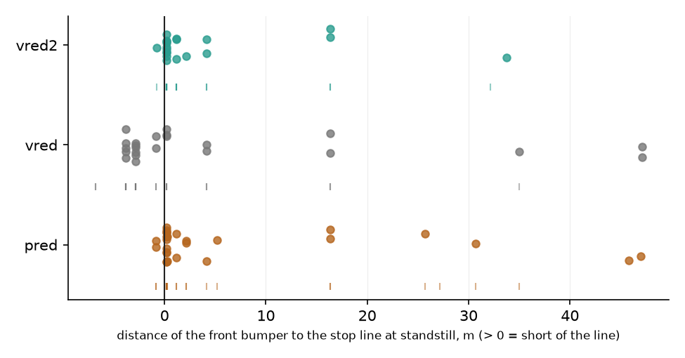
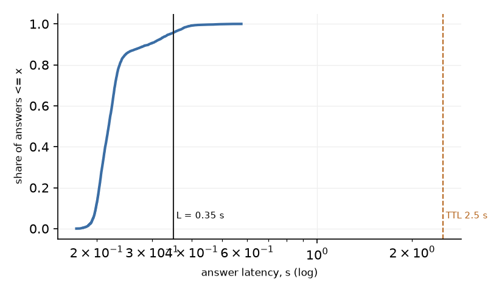

# vred2: R2 stops short of the traffic light's stop line (zero-shot Qwen3-VL-4B reads the light), closed loop

Diagnostic batch, 19 routes x 2 traffic seeds. Every number is a read, not a confirmation; registered confirmation lines are listed with their value and marked not evaluated. `drive`, `pred` and `vred` are the existing runs (not rerun); `vred2` = `vred` with one change: R2's stop target is the stop line of the light that governs the ego lane at the next junction on the route (map; the light's state is not read for it), target = bumper-to-line distance - 0.5 m as in `pred`, instead of the junction entrance. K, release rule, L = 0.35 s, model, resolution and serving are as in `vred`. Plan: [plans/2026-10-02-pbyp2-vred2.md](../plans/2026-10-02-pbyp2-vred2.md).

## Arms

| arm   |   runs |   crashes |    DS |    RC |   red_light |   stop_sign |   collisions |   blocked |   timeouts |   v_mean |
|:------|-------:|----------:|------:|------:|------------:|------------:|-------------:|----------:|-----------:|---------:|
| drive |     38 |         0 | 65.9  | 83.27 |          13 |           2 |           11 |         2 |          0 |     2.2  |
| pred  |     38 |         0 | 70.23 | 83.99 |           5 |           2 |           13 |         0 |          0 |     1.87 |
| vred  |     38 |         0 | 70.92 | 83.86 |           6 |           2 |           11 |         2 |          0 |     2.01 |
| vred2 |     38 |         0 | 66.52 | 81.37 |           7 |           2 |           14 |         2 |          0 |     1.76 |

Official infraction counts summed over the runs; DS, RC and mean speed averaged over runs; 38 runs expected per arm.

## Paired differences (mean over routes of the per-route mean over the two seeds; [95% route-cluster CI])

`logged-light routes` = routes on which an ego light was seen within 50 m in the vred2 logs (15102, 15483, 15612, 16390, 16508, 16529, 24944, 27043, 27297, 27870, 28147, 9196); `no logged light` = the other 7. Counts are per run.

| contrast | routes | n routes | DS | red light | blocked | collisions | mean speed m/s |
|:--|:--|--:|:--|:--|:--|:--|:--|
| vred2 - drive | all routes | 19 | +0.62 [-6.43, +7.41] | -0.16 [-0.37, +0.03] | +0.00 [-0.08, +0.08] | +0.08 [+0.00, +0.21] | -0.44 [-0.72, -0.17] |
| vred2 - drive | logged-light routes | 12 | +3.32 [-7.13, +13.64] | -0.25 [-0.54, +0.08] | +0.00 [-0.12, +0.12] | +0.12 [+0.00, +0.33] | -0.53 [-0.90, -0.15] |
| vred2 - drive | no logged light | 7 | -3.99 [-11.32, +0.14] | +0.00 [+0.00, +0.00] | +0.00 [+0.00, +0.00] | +0.00 [+0.00, +0.00] | -0.30 [-0.69, +0.02] |
| vred2 - vred | all routes | 19 | -4.40 [-9.53, +0.22] | +0.03 [-0.11, +0.16] | +0.00 [-0.08, +0.08] | +0.08 [+0.00, +0.21] | -0.26 [-0.50, -0.03] |
| vred2 - vred | logged-light routes | 12 | -4.73 [-11.88, +1.56] | +0.04 [-0.17, +0.25] | +0.00 [-0.12, +0.12] | +0.12 [+0.00, +0.33] | -0.19 [-0.51, +0.04] |
| vred2 - vred | no logged light | 7 | -3.84 [-10.87, +0.14] | +0.00 [+0.00, +0.00] | +0.00 [+0.00, +0.00] | +0.00 [+0.00, +0.00] | -0.36 [-0.79, +0.00] |
| vred2 - pred | all routes | 19 | -3.71 [-10.47, +0.78] | +0.05 [+0.00, +0.13] | +0.05 [+0.00, +0.13] | +0.03 [-0.08, +0.16] | -0.12 [-0.22, -0.02] |
| vred2 - pred | logged-light routes | 12 | -6.53 [-16.50, +0.00] | +0.08 [+0.00, +0.21] | +0.08 [+0.00, +0.21] | +0.08 [+0.00, +0.25] | -0.13 [-0.27, +0.01] |
| vred2 - pred | no logged light | 7 | +1.13 [-1.30, +4.69] | +0.00 [+0.00, +0.00] | +0.00 [+0.00, +0.00] | -0.07 [-0.21, +0.00] | -0.10 [-0.25, -0.00] |
| vred - drive | all routes | 19 | +5.03 [+0.68, +10.56] | -0.18 [-0.34, -0.05] | +0.00 [-0.08, +0.08] | +0.00 [+0.00, +0.00] | -0.19 [-0.43, +0.03] |
| vred - drive | logged-light routes | 12 | +8.05 [+1.25, +15.66] | -0.29 [-0.50, -0.08] | +0.00 [-0.12, +0.12] | +0.00 [+0.00, +0.00] | -0.34 [-0.68, -0.01] |
| vred - drive | no logged light | 7 | -0.15 [-0.45, +0.00] | +0.00 [+0.00, +0.00] | +0.00 [+0.00, +0.00] | +0.00 [+0.00, +0.00] | +0.07 [+0.01, +0.15] |

Harm on routes without a logged light (14 runs): runs with more blocked events than their `drive` pair 0; with more collisions 0.

Repeat noise: 13 routes with 2-4 identical `drive` runs: per-route DS standard deviation mean 4.7, median 0.0, max 30.5; 5 of 13 routes changed DS between repeats (results/report.md). A difference whose CI includes 0 is within that noise at this size.

## In-batch latency of the light answers

L = 0.35 s: an answer is used at t_q + max(L, latency); TTL = 2.5 s.

| requests | answered ok | p50 ms | p95 ms | p99 ms | max ms | share > L | share > TTL | server queue p95 ms | server service p50 ms |
|--:|--:|--:|--:|--:|--:|--:|--:|--:|--:|
| 6441 | 100.00% | 219 | 341 | 395 | 575 | 4.3% | 0.00% | 123 | 158 |

Calibration before the batch (shadow run, 3 shadow workers per card on 3 cards, nothing else on the box (the `vred` batch's load)): p50 216 ms, p95 342 ms, p99 391 ms (3203 requests); registered L = 0.35 s held (`v2_calibration_cal3.md`).

A first calibration at 6 workers per card (3 shadow + 3 pbyp2 workers, `v2_calibration_cal2.md`) gave p50 264 ms, p95 446 ms, p99 566 ms (2731 requests) and failed the registered line (p95 <= 350 ms); concurrency was reduced to the load above before any vred2 unit ran (vred3 ran at that reduced load as well).

## In-loop reading quality (answers logged during the runs against the simulator's light state)

Ego-green recall is shown for all requests and split by whether R2 was holding the car when the request was made (`while holding`): vred holds the car at the junction entrance, beyond the stop line; vred2 holds it short of the line, with the light in view. Estimate [95% route-cluster CI]; requests and routes behind each.

| readout | arm | all requests | while R2 holds | not holding |
|:--|:--|:--|:--|:--|
| ego red / yellow answered red, 0-50 m | vred | 91.9% [84.0, 98.7] (n=959, 11 routes) | 97.6% [94.8, 99.2] (n=801, 10 routes) | 62.7% [53.9, 94.3] (n=158, 11 routes) |
| ego green answered green, 0-50 m | vred | 74.1% [47.1, 95.4] (n=406, 12 routes) | 28.6% [16.0, 91.7] (n=126, 9 routes) | 94.6% [88.7, 97.2] (n=280, 12 routes) |
| ego red / yellow answered red, 0-50 m | vred2 | 91.9% [82.3, 99.7] (n=998, 11 routes) | 99.0% [97.0, 99.9] (n=832, 10 routes) | 56.0% [42.4, 100.0] (n=166, 11 routes) |
| ego green answered green, 0-50 m | vred2 | 95.3% [92.0, 97.7] (n=361, 12 routes) | 94.9% [85.1, 100.0] (n=39, 9 routes) | 95.3% [91.3, 97.8] (n=322, 12 routes) |

## Stop position at every red-light stop

Front bumper to the stop line of the governing light (ctx `tl_dist`, simulator truth, evaluation only) at the last plan step of standstill under the arm's hold (where the car finally stood; a car that starts the route standing under a hold is counted where it stood at the end) (pred: privileged red stop; vred / vred2: R2). Positive = short of the line. `min` = the smallest distance during the hold (negative = the car crept across the line while holding).

| arm | stops | median d_stop | min | max | stopped beyond the line | crept across while holding (min < 0) |
|:--|--:|--:|--:|--:|--:|--:|
| pred | 27 | 0.24 | -0.84 | 46.97 | 2 | 2 |
| vred | 23 | -0.84 | -3.84 | 47.09 | 13 | 15 |
| vred2 | 20 | 0.16 | -0.78 | 33.77 | 1 | 1 |

| arm   |   route |   seed |    t |   d_stop |   d_min |   hold_s |
|:------|--------:|-------:|-----:|---------:|--------:|---------:|
| vred2 |   27043 |      0 | 13.4 |     4.16 |    4.16 |      8.4 |
| vred2 |   15102 |      0 | 45.4 |     0.16 |    0.16 |     40.3 |
| vred2 |   24944 |      0 | 75.9 |     0.16 |    0.16 |     35.5 |
| vred2 |   27870 |      0 | 15.3 |     1.16 |    1.16 |     10.3 |
| vred2 |    9196 |      0 | 30.3 |     0.16 |    0.16 |     25.3 |
| vred2 |   28147 |      0 |  5.7 |    16.32 |   16.32 |      1.8 |
| vred2 |   15612 |      0 | 15   |     2.16 |    1.16 |     10.3 |
| vred2 |   15483 |      0 | 30.4 |     0.16 |    0.16 |     25.3 |
| vred2 |   16529 |      0 | 30.4 |     0.16 |    0.16 |     25.3 |
| vred2 |   27043 |      1 | 13.9 |     4.16 |    4.16 |      8.8 |
| vred2 |   15102 |      1 | 45.4 |     0.16 |    0.16 |     40.3 |
| vred2 |   24944 |      1 | 28.7 |    33.77 |   32.16 |      2   |
| vred2 |   24944 |      1 | 75.9 |     0.16 |    0.16 |     35.5 |
| vred2 |   27870 |      1 | 15.3 |     1.16 |    1.16 |     10.3 |
| vred2 |   27297 |      1 | 15.4 |    -0.78 |   -0.78 |      5   |
| vred2 |    9196 |      1 | 30.4 |     0.16 |    0.16 |     25.3 |
| vred2 |   28147 |      1 |  5.7 |    16.32 |   16.32 |      1.8 |
| vred2 |   15612 |      1 | 15.3 |     1.16 |    1.16 |     10.3 |
| vred2 |   15483 |      1 | 30.4 |     0.16 |    0.16 |     25.3 |
| vred2 |   16529 |      1 | 30.4 |     0.16 |    0.16 |     25.3 |

## Green after red

19 red-to-green changes of the ego light while R2 held the car. Seconds after the light turned green (median [p5, p95]): second consecutive green answer in force 0.9 [0.9, 1.4] (0 never reached); R2 released 1.0 [1.0, 1.5]; car rolling (> 1 m/s) 2.0 [1.5, 2.0] (0 never).

|   route |   seed |   t_green |   answer |   r2_end |   roll |
|--------:|-------:|----------:|---------:|---------:|-------:|
|   27043 |      0 |      13.1 |      0.9 |      0.5 |    1.5 |
|   27043 |      1 |      13.1 |      0.9 |      1   |    2   |
|   15102 |      0 |      44.6 |      0.9 |      1   |    2   |
|   15102 |      1 |      44.6 |      0.9 |      1   |    2   |
|   24944 |      0 |      75.1 |      0.9 |      1   |    2   |
|   24944 |      1 |      29.6 |      0.9 |      1   |    1   |
|   24944 |      1 |      75.1 |      0.9 |      1   |    2   |
|   27870 |      0 |      14.6 |      0.9 |      1   |    1.5 |
|   27870 |      1 |      14.6 |      0.9 |      1   |    1.5 |
|    9196 |      0 |      29.6 |      0.9 |      1   |    1.5 |
|    9196 |      1 |      29.6 |      0.9 |      1   |    2   |
|   28147 |      0 |       5.6 |      1.4 |      1.5 |    1.5 |
|   28147 |      1 |       5.6 |      1.4 |      1.5 |    1.5 |
|   15612 |      0 |      14.6 |      0.9 |      1   |    1.5 |
|   15612 |      1 |      14.6 |      0.9 |      1   |    1.5 |
|   15483 |      0 |      29.6 |      0.9 |      1   |    2   |
|   15483 |      1 |      29.6 |      0.9 |      1   |    2   |
|   16529 |      0 |      29.6 |      0.9 |      1   |    2   |
|   16529 |      1 |      29.6 |      0.9 |      1   |    2   |

## R5 fallback

0 episodes in the 38 vred2 runs.

## Remaining red-light infractions in vred2 (7)

Located with the scorer's rule (`RunningRedLightTest`: the light of the official message is red while the car's tail segment crosses the junction entrance line, i.e. the front bumper is 4.4-5.9 m beyond it): the time the front bumper passed that light's stop line (ctx `tl_dist` <= 0), the light's logged state there, its red onset, and a cause label from the logs (red began after the front bumper had passed the stop line, otherwise the `vred.md` rules: released early / not answered red / answered late / stale / R5). The timelines are the evidence.

|   route |   seed |   light |   t_front_stop_line | state_stop_line   |   v_stop_line |   t_front_entrance |   t_red_onset |   t_tail_crossing |   v_at_red |   front_vs_entrance_at_red | cause                                                                                                                                                                                              |
|--------:|-------:|--------:|--------------------:|:------------------|--------------:|-------------------:|--------------:|------------------:|-----------:|---------------------------:|:---------------------------------------------------------------------------------------------------------------------------------------------------------------------------------------------------|
|   27297 |      1 |    7814 |                11.2 | yellow            |           1.3 |               18.1 |          12.6 |              19.1 |        0   |                       -3.9 | released early: R2 was holding until t = 15.1 s and dropped on answers ['green_for_ego', 'green_for_ego'] while the light was red                                                                  |
|   16390 |      0 |    5297 |                 7.6 | green             |           4.3 |                8.6 |           8.1 |               9.1 |        5   |                       -0.1 | the light turned red while the car was crossing (front 0.1 m before the entrance, 5.0 m/s, 0.5 s after its front passed the stop line); the car kept going                                         |
|   16390 |      1 |   10553 |                 7.6 | green             |           4.3 |                8.6 |           8.1 |               9.1 |        5   |                       -0   | the light turned red while the car was crossing (front 0.0 m before the entrance, 5.0 m/s, 0.5 s after its front passed the stop line); the car kept going                                         |
|   15612 |      0 |     881 |                16.7 | green             |           2.3 |               20.6 |          17.6 |              22.6 |        2.4 |                       -1.6 | the light turned red 0.9 s after the front bumper had passed the stop line; the car stopped at t = 18.6 s past the line (R2 never starts there) and moved on at t = 20.6 s while the light was red |
|   15612 |      1 |     881 |                16.5 | green             |           2   |               18.1 |          17.6 |              22.6 |        3   |                       -1.1 | the light turned red 1.1 s after the front bumper had passed the stop line; the car stopped at t = 19.6 s past the line (R2 never starts there) and moved on at t = 21.6 s while the light was red |
|   15483 |      0 |    1836 |                32.1 | green             |           2.3 |               33.1 |          32.6 |              35.1 |        2.8 |                       -1.4 | the light turned red 0.5 s after the front bumper had passed the stop line; the car stopped at t = 35.1 s past the line (R2 never starts there) and moved on at t = 37.6 s while the light was red |
|   15483 |      1 |    5303 |                32.2 | green             |           2.3 |               33.6 |          32.6 |              34.6 |        2.8 |                       -1.7 | the light turned red while the car was crossing (front 1.7 m before the entrance, 2.8 m/s, 0.4 s after its front passed the stop line); the car kept going                                         |

Route 27297 seed 1, light 7814, front bumper at the stop line at t = 11.2 s (light yellow): released early: R2 was holding until t = 15.1 s and dropped on answers ['green_for_ego', 'green_for_ego'] while the light was red

|    t |   v |   line_m | rules   | fresh   | last_K   | answer_in_force          | truth          |
|-----:|----:|---------:|:--------|:--------|:---------|:-------------------------|:---------------|
|  2.6 | 0   |    18.41 | -       | True    | gre,gre  | gre (q 2.1, lat 0.32 s)  | tl 0 @ 18.59 m |
|  3.1 | 0   |    18.41 | -       | True    | gre,gre  | gre (q 2.6, lat 0.21 s)  | tl 0 @ 18.59 m |
|  3.6 | 0   |    18.41 | -       | True    | gre,gre  | gre (q 3.1, lat 0.27 s)  | tl 0 @ 18.59 m |
|  4.1 | 0   |    18.41 | -       | True    | gre,gre  | gre (q 3.6, lat 0.22 s)  | tl 0 @ 18.59 m |
|  4.6 | 0   |    18.41 | -       | True    | gre,gre  | gre (q 4.1, lat 0.22 s)  | tl 0 @ 18.59 m |
|  5.1 | 0   |    18.41 | -       | True    | gre,gre  | gre (q 4.6, lat 0.24 s)  | tl 0 @ 18.59 m |
|  5.6 | 0   |    18.41 | -       | True    | gre,gre  | gre (q 5.1, lat 0.21 s)  | tl 0 @ 18.59 m |
|  6.1 | 1.3 |    18.41 | -       | True    | gre,gre  | gre (q 5.6, lat 0.23 s)  | tl 0 @ 18.59 m |
|  6.6 | 2.1 |    18.41 | -       | True    | gre,gre  | gre (q 6.1, lat 0.21 s)  | tl 0 @ 18.59 m |
|  7.1 | 3.2 |    17.45 | -       | True    | gre,gre  | gre (q 6.6, lat 0.21 s)  | tl 0 @ 18.59 m |
|  7.6 | 4.2 |    15.59 | -       | True    | gre,gre  | gre (q 7.1, lat 0.22 s)  | tl 0 @ 17.57 m |
|  8.1 | 5   |    13.36 | -       | True    | gre,gre  | gre (q 7.6, lat 0.21 s)  | tl 0 @ 15.53 m |
|  8.6 | 5   |    10.87 | -       | True    | gre,gre  | gre (q 8.1, lat 0.22 s)  | tl 0 @ 13.49 m |
|  9.1 | 5.1 |     8.31 | -       | True    | gre,gre  | gre (q 8.6, lat 0.23 s)  | tl 0 @ 10.43 m |
|  9.6 | 4.9 |     5.65 | -       | True    | gre,gre  | gre (q 9.1, lat 0.22 s)  | tl 0 @ 8.4 m   |
| 10.1 | 4.5 |     3.31 | -       | True    | gre,red  | red (q 9.6, lat 0.20 s)  | tl 1 @ 5.34 m  |
| 10.6 | 3.9 |     1.18 | R2      | True    | red,red  | red (q 10.1, lat 0.21 s) | tl 1 @ 3.3 m   |
| 11.1 | 2.1 |    -0.21 | R2      | True    | red,red  | red (q 10.6, lat 0.23 s) | tl 1 @ 1.26 m  |
| 11.6 | 0   |    -0.5  | R2      | True    | red,red  | red (q 11.1, lat 0.21 s) | tl 1 @ 0.24 m  |

Route 16390 seed 0, light 5297, front bumper at the stop line at t = 7.6 s (light green): the light turned red while the car was crossing (front 0.1 m before the entrance, 5.0 m/s, 0.5 s after its front passed the stop line); the car kept going

|   t |   v |   line_m | rules   | fresh   | last_K   | answer_in_force         | truth          |
|----:|----:|---------:|:--------|:--------|:---------|:------------------------|:---------------|
| 0.1 | 0   |     1.3  | -       | False   |          | -                       | nan            |
| 0.6 | 0   |     1.3  | -       | True    | gre      | gre (q 0.1, lat 0.20 s) | tl 0 @ 2.16 m  |
| 1.1 | 0   |     1.3  | -       | True    | gre,gre  | gre (q 0.6, lat 0.18 s) | tl 0 @ 2.16 m  |
| 1.6 | 0   |     1.3  | -       | True    | gre,gre  | gre (q 1.1, lat 0.24 s) | tl 0 @ 2.16 m  |
| 2.1 | 0   |     1.3  | -       | True    | gre,gre  | gre (q 1.6, lat 0.21 s) | tl 0 @ 2.16 m  |
| 2.6 | 0   |     1.3  | -       | True    | gre,gre  | gre (q 2.1, lat 0.21 s) | tl 0 @ 2.16 m  |
| 3.1 | 0   |     1.3  | -       | True    | gre,gre  | gre (q 2.6, lat 0.23 s) | tl 0 @ 2.16 m  |
| 3.6 | 0   |     1.3  | -       | True    | gre,gre  | gre (q 3.1, lat 0.22 s) | tl 0 @ 2.16 m  |
| 4.1 | 0   |     1.3  | -       | True    | gre,gre  | gre (q 3.6, lat 0.23 s) | tl 0 @ 2.16 m  |
| 4.6 | 0   |     1.3  | -       | True    | gre,gre  | gre (q 4.1, lat 0.23 s) | tl 0 @ 2.16 m  |
| 5.1 | 0   |     1.3  | -       | True    | gre,gre  | gre (q 4.6, lat 0.23 s) | tl 0 @ 2.16 m  |
| 5.6 | 0   |     1.3  | -       | True    | gre,gre  | gre (q 5.1, lat 0.22 s) | tl 0 @ 2.16 m  |
| 6.1 | 1.2 |     1.3  | -       | True    | gre,gre  | gre (q 5.6, lat 0.20 s) | tl 0 @ 2.16 m  |
| 6.6 | 2.1 |     1.3  | -       | True    | gre,gre  | gre (q 6.1, lat 0.21 s) | tl 0 @ 2.16 m  |
| 7.1 | 3.3 |     0.16 | -       | True    | gre,gre  | gre (q 6.6, lat 0.22 s) | tl 0 @ 2.16 m  |
| 7.6 | 4.3 |    -1.77 | -       | True    | gre,gre  | gre (q 7.1, lat 0.23 s) | tl 0 @ 0.16 m  |
| 8.1 | 5   |    -4.25 | -       | True    | gre,red  | red (q 7.6, lat 0.18 s) | tl 0 @ -1.84 m |

Route 16390 seed 1, light 10553, front bumper at the stop line at t = 7.6 s (light green): the light turned red while the car was crossing (front 0.0 m before the entrance, 5.0 m/s, 0.5 s after its front passed the stop line); the car kept going

|   t |   v |   line_m | rules   | fresh   | last_K   | answer_in_force         | truth          |
|----:|----:|---------:|:--------|:--------|:---------|:------------------------|:---------------|
| 0.1 | 0   |     1.3  | -       | False   |          | -                       | nan            |
| 0.6 | 0   |     1.3  | -       | True    | gre      | gre (q 0.1, lat 0.21 s) | tl 0 @ 2.16 m  |
| 1.1 | 0   |     1.3  | -       | True    | gre,gre  | gre (q 0.6, lat 0.20 s) | tl 0 @ 2.16 m  |
| 1.6 | 0   |     1.3  | -       | True    | gre,gre  | gre (q 1.1, lat 0.21 s) | tl 0 @ 2.16 m  |
| 2.1 | 0   |     1.3  | -       | True    | gre,gre  | gre (q 1.6, lat 0.19 s) | tl 0 @ 2.16 m  |
| 2.6 | 0   |     1.3  | -       | True    | gre,gre  | gre (q 2.1, lat 0.21 s) | tl 0 @ 2.16 m  |
| 3.1 | 0   |     1.3  | -       | True    | gre,gre  | gre (q 2.6, lat 0.19 s) | tl 0 @ 2.16 m  |
| 3.6 | 0   |     1.3  | -       | True    | gre,gre  | gre (q 3.1, lat 0.21 s) | tl 0 @ 2.16 m  |
| 4.1 | 0   |     1.3  | -       | True    | gre,gre  | gre (q 3.6, lat 0.19 s) | tl 0 @ 2.16 m  |
| 4.6 | 0   |     1.3  | -       | True    | gre,gre  | gre (q 4.1, lat 0.24 s) | tl 0 @ 2.16 m  |
| 5.1 | 0   |     1.3  | -       | True    | gre,gre  | gre (q 4.6, lat 0.18 s) | tl 0 @ 2.16 m  |
| 5.6 | 0   |     1.3  | -       | True    | gre,gre  | gre (q 5.1, lat 0.19 s) | tl 0 @ 2.16 m  |
| 6.1 | 1.3 |     1.3  | -       | True    | gre,gre  | gre (q 5.6, lat 0.22 s) | tl 0 @ 2.16 m  |
| 6.6 | 2.2 |     1.3  | -       | True    | gre,gre  | gre (q 6.1, lat 0.22 s) | tl 0 @ 2.16 m  |
| 7.1 | 3.3 |     0.09 | -       | True    | gre,gre  | gre (q 6.6, lat 0.21 s) | tl 0 @ 2.16 m  |
| 7.6 | 4.3 |    -1.84 | -       | True    | gre,gre  | gre (q 7.1, lat 0.22 s) | tl 0 @ 0.16 m  |
| 8.1 | 5   |    -4.33 | -       | True    | gre,red  | red (q 7.6, lat 0.18 s) | tl 0 @ -1.84 m |

Route 15612 seed 0, light 881, front bumper at the stop line at t = 16.7 s (light green): the light turned red 0.9 s after the front bumper had passed the stop line; the car stopped at t = 18.6 s past the line (R2 never starts there) and moved on at t = 20.6 s while the light was red

|    t |    v |   line_m | rules   | fresh   | last_K   | answer_in_force          | truth         |
|-----:|-----:|---------:|:--------|:--------|:---------|:-------------------------|:--------------|
|  8.1 |  0   |     1.95 | R2      | True    | red,red  | red (q 7.6, lat 0.23 s)  | tl 2 @ 2.16 m |
|  8.6 |  0   |     1.95 | R2      | True    | red,red  | red (q 8.1, lat 0.22 s)  | tl 2 @ 2.16 m |
|  9.1 |  0   |     1.95 | R2      | True    | red,red  | red (q 8.6, lat 0.23 s)  | tl 2 @ 2.16 m |
|  9.6 |  0   |     1.95 | R2      | True    | red,red  | red (q 9.1, lat 0.32 s)  | tl 2 @ 2.16 m |
| 10.1 |  0   |     1.95 | R2      | True    | red,red  | red (q 9.6, lat 0.22 s)  | tl 2 @ 2.16 m |
| 10.6 |  0   |     1.95 | R2      | True    | red,red  | red (q 10.1, lat 0.24 s) | tl 2 @ 2.16 m |
| 11.1 |  0   |     1.95 | R2      | True    | red,red  | red (q 10.6, lat 0.22 s) | tl 2 @ 2.16 m |
| 11.6 |  0   |     1.95 | R2      | True    | red,red  | red (q 11.1, lat 0.23 s) | tl 2 @ 2.16 m |
| 12.1 |  0.3 |     1.95 | R2      | True    | red,red  | red (q 11.6, lat 0.22 s) | tl 2 @ 2.16 m |
| 12.6 |  0.9 |     1.94 | R2      | True    | red,red  | red (q 12.1, lat 0.22 s) | tl 2 @ 2.16 m |
| 13.1 |  0.2 |     1.57 | R2      | True    | red,red  | red (q 12.6, lat 0.23 s) | tl 2 @ 2.16 m |
| 13.6 |  0   |     1.63 | R2      | True    | red,red  | red (q 13.1, lat 0.22 s) | tl 2 @ 2.16 m |
| 14.1 |  0   |     1.69 | R2      | True    | red,red  | red (q 13.6, lat 0.23 s) | tl 2 @ 2.16 m |
| 14.6 | -0   |     1.59 | R2      | True    | red,red  | red (q 14.1, lat 0.22 s) | tl 2 @ 2.16 m |
| 15.1 |  0.3 |     1.47 | R2      | True    | red,gre  | gre (q 14.6, lat 0.22 s) | tl 0 @ 2.16 m |
| 15.6 |  0.9 |     1.21 | -       | True    | gre,gre  | gre (q 15.1, lat 0.21 s) | tl 0 @ 2.16 m |
| 16.1 |  1.6 |     0.71 | -       | True    | gre,gre  | gre (q 15.6, lat 0.30 s) | tl 0 @ 1.16 m |
| 16.6 |  2.2 |    -0.31 | -       | True    | gre,gre  | gre (q 16.1, lat 0.22 s) | tl 0 @ 1.16 m |
| 17.1 |  2.5 |    -1.49 | -       | True    | gre,gre  | gre (q 16.6, lat 0.23 s) | tl 0 @ 0.16 m |

Route 15612 seed 1, light 881, front bumper at the stop line at t = 16.5 s (light green): the light turned red 1.1 s after the front bumper had passed the stop line; the car stopped at t = 19.6 s past the line (R2 never starts there) and moved on at t = 21.6 s while the light was red

|    t |   v |   line_m | rules   | fresh   | last_K   | answer_in_force          | truth         |
|-----:|----:|---------:|:--------|:--------|:---------|:-------------------------|:--------------|
|  7.6 | 0   |     1.95 | R2      | True    | red,red  | red (q 7.1, lat 0.23 s)  | tl 2 @ 2.16 m |
|  8.1 | 0   |     1.95 | R2      | True    | red,red  | red (q 7.6, lat 0.34 s)  | tl 2 @ 2.16 m |
|  8.6 | 0   |     1.95 | R2      | True    | red,red  | red (q 8.1, lat 0.22 s)  | tl 2 @ 2.16 m |
|  9.1 | 0   |     1.95 | R2      | True    | red,red  | red (q 8.6, lat 0.25 s)  | tl 2 @ 2.16 m |
|  9.6 | 0   |     1.95 | R2      | True    | red,red  | red (q 9.1, lat 0.23 s)  | tl 2 @ 2.16 m |
| 10.1 | 0   |     1.95 | R2      | True    | red,red  | red (q 9.6, lat 0.23 s)  | tl 2 @ 2.16 m |
| 10.6 | 0   |     1.95 | R2      | True    | red,red  | red (q 10.1, lat 0.23 s) | tl 2 @ 2.16 m |
| 11.1 | 0.6 |     1.95 | R2      | True    | red,red  | red (q 10.6, lat 0.41 s) | tl 2 @ 2.16 m |
| 11.6 | 1.2 |     1.85 | R2      | True    | red,red  | red (q 11.1, lat 0.23 s) | tl 2 @ 2.16 m |
| 12.1 | 0   |     1.57 | R2      | True    | red,red  | red (q 11.6, lat 0.26 s) | tl 2 @ 2.16 m |
| 12.6 | 0   |     1.43 | R2      | True    | red,red  | red (q 12.1, lat 0.23 s) | tl 2 @ 2.16 m |
| 13.1 | 0   |     1.48 | R2      | True    | red,red  | red (q 12.6, lat 0.23 s) | tl 2 @ 2.16 m |
| 13.6 | 0.1 |     1.54 | R2      | True    | red,red  | red (q 13.1, lat 0.23 s) | tl 2 @ 2.16 m |
| 14.1 | 0.8 |     1.33 | R2      | True    | red,red  | red (q 13.6, lat 0.23 s) | tl 2 @ 2.16 m |
| 14.6 | 0.3 |     1.04 | R2      | True    | red,red  | red (q 14.1, lat 0.22 s) | tl 2 @ 1.16 m |
| 15.1 | 0.3 |     0.74 | R2      | True    | red,gre  | gre (q 14.6, lat 0.22 s) | tl 0 @ 1.16 m |
| 15.6 | 0.5 |     0.61 | -       | True    | gre,gre  | gre (q 15.1, lat 0.29 s) | tl 0 @ 1.16 m |
| 16.1 | 1.3 |     0.29 | -       | True    | gre,gre  | gre (q 15.6, lat 0.23 s) | tl 0 @ 1.16 m |
| 16.6 | 2   |    -0.63 | -       | True    | gre,gre  | gre (q 16.1, lat 0.26 s) | tl 0 @ 0.16 m |

Route 15483 seed 0, light 1836, front bumper at the stop line at t = 32.1 s (light green): the light turned red 0.5 s after the front bumper had passed the stop line; the car stopped at t = 35.1 s past the line (R2 never starts there) and moved on at t = 37.6 s while the light was red

|    t |    v |   line_m | rules   | fresh   | last_K   | answer_in_force          | truth          |
|-----:|-----:|---------:|:--------|:--------|:---------|:-------------------------|:---------------|
| 23.6 |  0   |     0.14 | R2      | True    | red,red  | red (q 23.1, lat 0.19 s) | tl 2 @ 0.16 m  |
| 24.1 |  0   |     0.14 | R2      | True    | red,red  | red (q 23.6, lat 0.21 s) | tl 2 @ 0.16 m  |
| 24.6 |  0   |     0.11 | R2      | True    | red,red  | red (q 24.1, lat 0.19 s) | tl 2 @ 0.16 m  |
| 25.1 |  0   |     0.12 | R2      | True    | red,red  | red (q 24.6, lat 0.19 s) | tl 2 @ 0.16 m  |
| 25.6 |  0   |     0.12 | R2      | True    | red,red  | red (q 25.1, lat 0.19 s) | tl 2 @ 0.16 m  |
| 26.1 |  0   |     0.06 | R2      | True    | red,red  | red (q 25.6, lat 0.19 s) | tl 2 @ 0.16 m  |
| 26.6 |  0   |     0.2  | R2      | True    | red,red  | red (q 26.1, lat 0.24 s) | tl 2 @ 0.16 m  |
| 27.1 |  0   |     0.28 | R2      | True    | red,red  | red (q 26.6, lat 0.21 s) | tl 2 @ 0.16 m  |
| 27.6 |  0.1 |     0.17 | R2      | True    | red,red  | red (q 27.1, lat 0.22 s) | tl 2 @ 0.16 m  |
| 28.1 |  0   |     0.06 | R2      | True    | red,red  | red (q 27.6, lat 0.20 s) | tl 2 @ 0.16 m  |
| 28.6 |  0   |     0.14 | R2      | True    | red,red  | red (q 28.1, lat 0.34 s) | tl 2 @ 0.16 m  |
| 29.1 |  0   |     0.18 | R2      | True    | red,red  | red (q 28.6, lat 0.20 s) | tl 2 @ 0.16 m  |
| 29.6 |  0   |     0.16 | R2      | True    | red,red  | red (q 29.1, lat 0.21 s) | tl 2 @ 0.16 m  |
| 30.1 |  0   |     0.06 | R2      | True    | red,gre  | gre (q 29.6, lat 0.23 s) | tl 0 @ 0.16 m  |
| 30.6 | -0   |    -0.01 | -       | True    | gre,gre  | gre (q 30.1, lat 0.25 s) | tl 0 @ 0.16 m  |
| 31.1 |  0.5 |    -0.09 | -       | True    | gre,gre  | gre (q 30.6, lat 0.26 s) | tl 0 @ 0.16 m  |
| 31.6 |  1.5 |    -0.63 | -       | True    | gre,gre  | gre (q 31.1, lat 0.23 s) | tl 0 @ 0.16 m  |
| 32.1 |  2.3 |    -1.52 | -       | True    | gre,gre  | gre (q 31.6, lat 0.23 s) | tl 0 @ 0.16 m  |
| 32.6 |  2.8 |    -2.94 | -       | True    | gre,gre  | gre (q 32.1, lat 0.24 s) | tl 0 @ -1.84 m |

Route 15483 seed 1, light 5303, front bumper at the stop line at t = 32.2 s (light green): the light turned red while the car was crossing (front 1.7 m before the entrance, 2.8 m/s, 0.4 s after its front passed the stop line); the car kept going

|    t |    v |   line_m | rules   | fresh   | last_K   | answer_in_force          | truth         |
|-----:|-----:|---------:|:--------|:--------|:---------|:-------------------------|:--------------|
| 23.6 |  0   |     0.15 | R2      | True    | red,red  | red (q 23.1, lat 0.30 s) | tl 2 @ 0.16 m |
| 24.1 |  0   |     0.14 | R2      | True    | red,red  | red (q 23.6, lat 0.21 s) | tl 2 @ 0.16 m |
| 24.6 |  0   |     0.12 | R2      | True    | red,red  | red (q 24.1, lat 0.21 s) | tl 2 @ 0.16 m |
| 25.1 |  0   |     0.13 | R2      | True    | red,red  | red (q 24.6, lat 0.22 s) | tl 2 @ 0.16 m |
| 25.6 |  0   |     0.12 | R2      | True    | red,red  | red (q 25.1, lat 0.23 s) | tl 2 @ 0.16 m |
| 26.1 |  0   |     0.07 | R2      | True    | red,red  | red (q 25.6, lat 0.21 s) | tl 2 @ 0.16 m |
| 26.6 |  0   |     0.21 | R2      | True    | red,red  | red (q 26.1, lat 0.43 s) | tl 2 @ 0.16 m |
| 27.1 |  0   |     0.29 | R2      | True    | red,red  | red (q 26.6, lat 0.37 s) | tl 2 @ 0.16 m |
| 27.6 |  0.1 |     0.17 | R2      | True    | red,red  | red (q 27.1, lat 0.21 s) | tl 2 @ 0.16 m |
| 28.1 |  0   |     0.07 | R2      | True    | red,red  | red (q 27.6, lat 0.22 s) | tl 2 @ 0.16 m |
| 28.6 |  0   |     0.15 | R2      | True    | red,red  | red (q 28.1, lat 0.22 s) | tl 2 @ 0.16 m |
| 29.1 |  0   |     0.19 | R2      | True    | red,red  | red (q 28.6, lat 0.23 s) | tl 2 @ 0.16 m |
| 29.6 |  0   |     0.17 | R2      | True    | red,red  | red (q 29.1, lat 0.22 s) | tl 2 @ 0.16 m |
| 30.1 |  0   |     0.07 | R2      | True    | red,gre  | gre (q 29.6, lat 0.23 s) | tl 0 @ 0.16 m |
| 30.6 | -0   |    -0    | -       | True    | gre,gre  | gre (q 30.1, lat 0.22 s) | tl 0 @ 0.16 m |
| 31.1 |  0.3 |    -0.04 | -       | True    | gre,gre  | gre (q 30.6, lat 0.22 s) | tl 0 @ 0.16 m |
| 31.6 |  1.3 |    -0.48 | -       | True    | gre,gre  | gre (q 31.1, lat 0.37 s) | tl 0 @ 0.16 m |
| 32.1 |  2.1 |    -1.27 | -       | True    | gre,gre  | gre (q 31.6, lat 0.23 s) | tl 0 @ 0.16 m |
| 32.6 |  2.8 |    -2.63 | -       | True    | gre,gre  | gre (q 32.1, lat 0.23 s) | tl 0 @ 0.16 m |

## Per route (DS and red-light counts: means / sums over the two seeds; light: yes = scenario set, * = ego light seen in the vred2 logs; `_A` columns are vred2)

|   route | light   |   DS_drive |   DS_pred |   DS_vred |   DS_vred2 |   dDS_vs_drive |   red_drive |   red_pred |   red_vred |   red_vred2 |   R2_stops_s0 |   R2_stops_s1 |   blocked_A |   coll_drive |   coll_A |   v_A |
|--------:|:--------|-----------:|----------:|----------:|-----------:|---------------:|------------:|-----------:|-----------:|------------:|--------------:|--------------:|------------:|-------------:|---------:|------:|
|   27043 | yes*    |       60   |      60   |      60   |       60   |            0   |           0 |          0 |          0 |           0 |             1 |             1 |           0 |            2 |        2 |  3.43 |
|   15102 | yes*    |      100   |     100   |     100   |      100   |            0   |           0 |          0 |          0 |           0 |             1 |             1 |           0 |            0 |        0 |  1.06 |
|   24944 | *       |       70   |     100   |     100   |      100   |           30   |           2 |          0 |          0 |           0 |             1 |             2 |           0 |            0 |        0 |  1.32 |
|   27870 | *       |       85   |     100   |     100   |      100   |           15   |           1 |          0 |          0 |           0 |             1 |             1 |           0 |            0 |        0 |  2.55 |
|   22535 |         |      100   |     100   |     100   |      100   |            0   |           0 |          0 |          0 |           0 |             0 |             0 |           0 |            0 |        0 |  2.55 |
|   37969 |         |       60   |      23.6 |      59   |       34.6 |          -25.4 |           0 |          0 |          0 |           0 |             0 |             0 |           0 |            2 |        2 |  1.87 |
|   24497 |         |       21.2 |      21.7 |      21.2 |       21.7 |            0.5 |           0 |          0 |          0 |           0 |             0 |             0 |           0 |            2 |        2 |  0.23 |
|   27297 | *       |       70   |     100   |      70   |       43.7 |          -26.3 |           2 |          0 |          2 |           1 |             0 |             1 |           1 |            0 |        2 |  1.48 |
|    9196 | *       |       28.4 |      34   |      27.4 |       26.9 |           -1.5 |           2 |          0 |          0 |           0 |             1 |             1 |           1 |            3 |        4 |  0.81 |
|   28147 | yes*    |      100   |     100   |     100   |      100   |            0   |           0 |          0 |          0 |           0 |             1 |             1 |           0 |            0 |        0 |  2.13 |
|   16390 | yes*    |       70   |      70   |      70   |       70   |            0   |           2 |          2 |          2 |           2 |             0 |             0 |           0 |            0 |        0 |  4.1  |
|   15612 | yes*    |       47.4 |      70   |      85   |       70   |           22.6 |           2 |          2 |          1 |           2 |             1 |             1 |           0 |            0 |        0 |  1.45 |
|   15483 | yes*    |      100   |      85   |     100   |       70   |          -30   |           0 |          1 |          0 |           2 |             1 |             1 |           0 |            0 |        0 |  1.03 |
|   17280 |         |       80   |      80   |      80   |       80   |            0   |           0 |          0 |          0 |           0 |             0 |             0 |           0 |            0 |        0 |  4.98 |
|   16529 | *       |       70   |     100   |      85   |      100   |           30   |           2 |          0 |          1 |           0 |             1 |             1 |           0 |            0 |        0 |  1.05 |
|   16508 | *       |      100   |     100   |     100   |      100   |            0   |           0 |          0 |          0 |           0 |             0 |             0 |           0 |            0 |        0 |  2.65 |
|   19324 |         |       33.4 |      33.4 |      33.4 |       30.3 |           -3.1 |           0 |          0 |          0 |           0 |             0 |             0 |           0 |            0 |        0 |  0.19 |
|    2520 |         |       23.5 |      23.5 |      23.5 |       23.5 |            0   |           0 |          0 |          0 |           0 |             0 |             0 |           0 |            2 |        2 |  0.25 |
|   19832 |         |       33.1 |      33.1 |      33.1 |       33.1 |            0   |           0 |          0 |          0 |           0 |             0 |             0 |           0 |            0 |        0 |  0.23 |

## Registered lines (plan 4.3), vred2

| line | read | status |
|:--|:--|:--|
| harmless on routes without a light: DS CI lower bound >= -5, no new blocked, no new collision | DS -3.99 [-11.32, +0.14]; blocked +0, collisions +0 | not evaluated at this size (7 routes < 30) |
| useful on routes with a light: red-light infractions fall, DS CI lower bound > 0 | DS +3.32 [-7.13, +13.64]; red light -6 runs | not evaluated at this size (12 routes < 30) |

Figure: paired differences for vred2 against drive, vred, pred per route set (dot: mean over routes, bar: 95% route-cluster CI), DS on the left and red-light infractions per run on the right. Look at whether vred2 moved against the previous arms and whether any bar clears zero.

Figure: distance of the front bumper to the stop line at standstill for every red-light stop (dots; ticks below the dots: the smallest distance during the hold). Look at which side of the zero line the dots sit: vred sat beyond it, the stop-line arms should sit just short of it, like pred.

Figure: cumulative distribution of the in-batch answer latency with L = 0.35 s and the TTL. Look at how much of the curve lies right of L.
