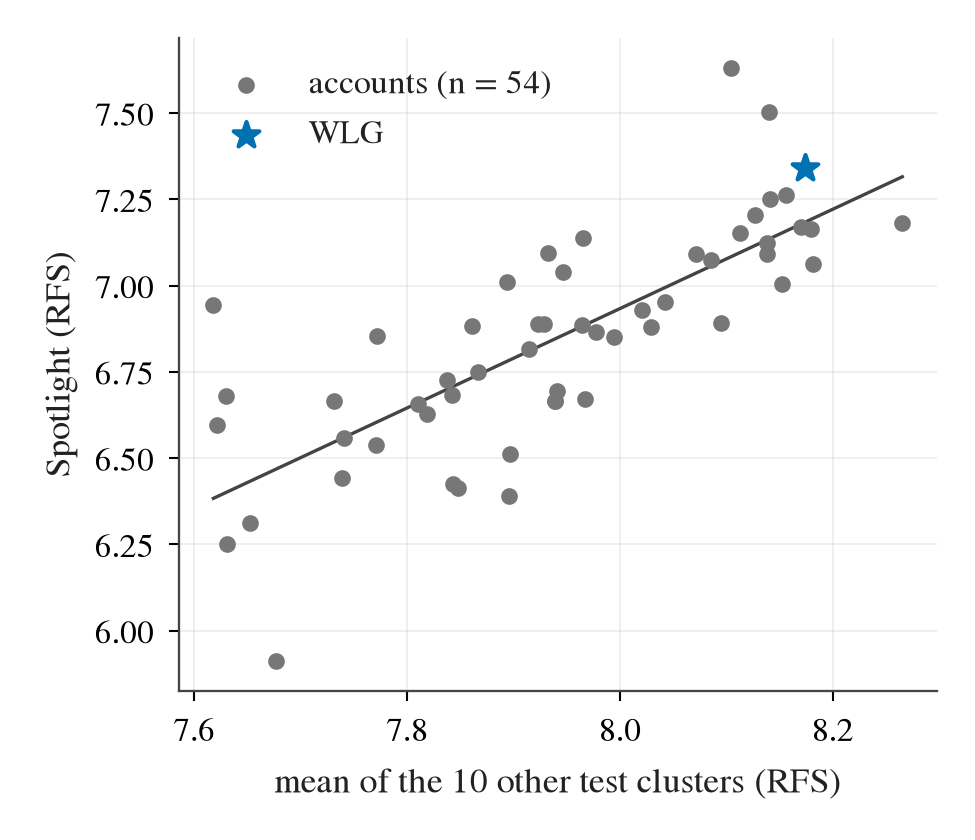
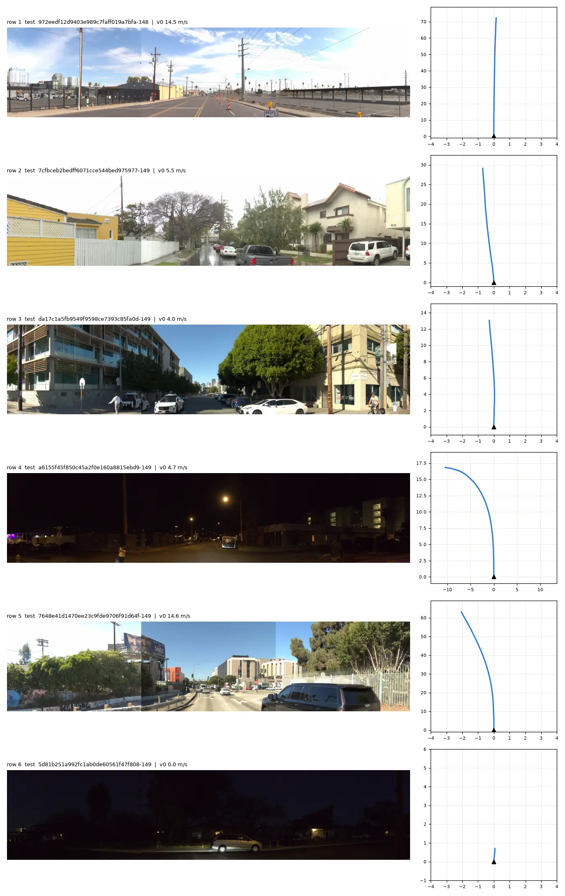

# Q1. The test-only Spotlight cluster: its frames cannot be identified, the test inputs look like val, and on the public board Spotlight moves with the Multi-Lane / Cut-in / FOD clusters

Written 2026-10-10, lane WODSCOUT. Test inputs, our own stored test plans and the public per-cluster board scores only; no test label, no submission.
Pre-registration: [plans/2026-10-10-wodscout-prereg.md](../plans/2026-10-10-wodscout-prereg.md) (the reframing below is in its section 0, written
before any read). Code: `scripts/ws_test.py` (box, CPU), `scripts/ws_board.py` (seconds). Tables: [q1_spotlight/](q1_spotlight/).

## What could not be done, and why

The task assumed the Spotlight frames could be looked at. They cannot be found: `test_sequence_frames_for_submission.json` maps sequence to frame
index and nothing else, the cluster file covers the 479 val sequences only (10 clusters, no Spotlight), the frame protos carry no tag (Q4: 30 field
paths, none of them a scenario label), neither file is ordered by cluster, and the official evaluation returns 11 cluster means. Which of the 1 505
test frames are Spotlight, and how many, is unknown to us. Membership could only be inferred by probing the server with crafted submissions, which
this lane does not do. The paper's whole definition is "Spotlight: Manually selected challenging scenarios" (arXiv 2510.26125, section 3.3.1). So the
question "what is in it" has no direct answer from data we hold; three indirect reads follow.

## Answer

1. **Test inputs are not distinguishable from val on anything we measure.** Of 23 covariates (ego state, intent, frame luma, lead output of the
   shipped model, shape of the WLG plan) none differs after Holm correction, and none has a raw p below 0.05. A classifier two-sample test gives AUC
   0.553 (logistic, permutation p 0.010) and 0.521 (gradient boosting, p 0.235): below the pre-registered 0.60, so "not separable"; the logistic
   read says a small shift exists and is too weak to locate frames with. Whatever Spotlight is, it is not a subset marked by speed, standstill,
   darkness, a lead, or the manoeuvre our plan chose.
2. **Not low light, as far as this can be checked.** Night frames (luma < 50) are 27.9 % of test and 27.1 % of val, +0.8 points [-3.9, +5.3]. The
   pre-registered line for "consistent with decision 131" was an upper bound below +5 points; +5.3 misses it by a hair, so the registered verdict is
   "not confirmed", with a point estimate of no excess. Post hoc arithmetic: if every Spotlight frame were a night frame and the rest of test had val's
   night share, Spotlight would be 1 % of test (at most 7 % at the upper bound).
3. **Across the public board Spotlight is the amplified overall level plus a specific part shared with three clusters.** Over 54 accounts (best row
   each, RFS >= 7.5) Spotlight sits 1.09 below the mean of the other ten clusters (sd 0.22) with slope 1.44 against that mean; the mean alone predicts
   it with leave-one-out R2 0.54, the ten clusters 0.58. After removing the mean of the other nine, three clusters keep a positive partial rank
   correlation: Cut-in 0.36 [0.07, 0.60], Multi-Lane 0.34 [0.05, 0.60], FOD 0.32 [0.08, 0.56]; the other seven are at 0 (-0.10 to +0.11).
4. **Usable val proxy, by the registered definition: `Multi-Lane Maneuvers`, `Cut_ins`, `Foreign Object Debris` (140 val frames).** All three
   criteria are met by these and by no other cluster. It is a proxy for the ordering of methods, not for the level, and a weak one (see limits).
5. **Our plan against the rest.** WLG's Spotlight 7.342 is third of 55 and 0.16 above what its other ten clusters predict (0.76 residual sd). WLG is ahead of
   the leader on four test clusters: Multi-Lane (+0.244), Spotlight (+0.158), Cut-in (+0.116) and Cyclist (+0.040); the first three are the
   grouping of point 3. On val Cut_ins is where the plan keeps going where the driver braked (WLG 8.31 against the log's 6.02; decision 164 for WP2).

## A1. Covariate shift, val rater frames (479) against test submission frames (1 505)

Both sets are one frame per sequence at the 12 s mark. Shares: chi-square; medians: Kolmogorov-Smirnov on the distribution; CI = bootstrap over
frames of test - val; Holm over the 23 rows. Table: [q1_spotlight/shift.md](q1_spotlight/shift.md), per-frame values `q1_spotlight/covariates.csv`.

| covariate | val | test | test - val [95 % CI] | raw p |
|:--|--:|--:|:--|--:|
| stopped (v0 < 0.5 m/s) | 0.251 | 0.251 | +0.001 [-0.045, +0.044] | 1.00 |
| slow 0.5-5 / mid 5-12 / fast >= 12 | 0.374 / 0.296 / 0.079 | 0.340 / 0.321 / 0.088 | -0.033 / +0.024 / +0.008 | 0.20 / 0.34 / 0.63 |
| intent left / right | 0.048 / 0.061 | 0.060 / 0.060 | +0.012 / -0.000 | 0.36 / 1.00 |
| night (frame luma < 50) | 0.271 | 0.279 | +0.008 [-0.039, +0.053] | 0.79 |
| dusk band (luma 50-120) | 0.069 | 0.066 | -0.002 [-0.028, +0.022] | 0.94 |
| lead_prob > 0.5 (shipped model) | 0.344 | 0.376 | +0.032 [-0.018, +0.079] | 0.23 |
| WLG plan holds (5 s displacement < 1 m) | 0.077 | 0.082 | +0.004 [-0.024, +0.031] | 0.83 |
| WLG plan creeps (1-5 m) | 0.165 | 0.145 | -0.020 [-0.057, +0.016] | 0.32 |
| WLG plan turns (heading change >= 25 deg) | 0.109 | 0.102 | -0.007 [-0.039, +0.024] | 0.73 |
| WLG plan lane shift (1-4 m lateral, heading < 15 deg) | 0.123 | 0.149 | +0.026 [-0.009, +0.060] | 0.19 |
| median v0 (m/s) | 3.16 | 3.66 | +0.49 [-0.47, +1.07] | 0.54 |
| median luma | 152.9 | 148.9 | -4.0 [-11.3, +4.0] | 0.11 |
| median 5 s plan displacement (m) | 16.2 | 16.7 | +0.5 [-2.7, +2.8] | 0.93 |
| median seed disagreement at 5 s (m) | 0.183 | 0.192 | +0.009 [-0.026, +0.041] | 0.99 |

The smallest raw p is 0.070 (fed longitudinal acceleration, median -0.002 against -0.015; its unit on WOD is unverified, decision 218 amendment).
The published statement that "waiting" frames are 7.6 % of val and 20.2 % of test (MindVLA-U1, cited in `research/lit/2026-10-08-top-methods-wod-e2e.md`)
is not visible in ego state: standstill is 25.1 % in both, and our plan holds on 7.7 % / 8.2 %.

Classifier two-sample test (14 features, 5-fold, out of fold; a statistical test only): [q1_spotlight/c2st.md](q1_spotlight/c2st.md).

| classifier | AUC | permutation null: mean / 97.5 % | p | separable by the registered line (p < 0.05 and AUC >= 0.60) |
|:--|--:|:--|--:|:--|
| logistic | 0.553 | 0.501 / 0.541 (200 permutations) | 0.010 | no |
| gradient boosting | 0.521 | 0.501 / 0.539 (50 permutations) | 0.235 | no |

## A2. The public board (per-cluster test scores of every entry; 153 distinct rows, 80 accounts, sample 54)

Table: [q1_spotlight/board_proxy.md](q1_spotlight/board_proxy.md), inputs `q1_spotlight/board_clusters.csv` (from the user's 2026-10-08 export).

| test cluster | Spearman with Spotlight [95 % CI] | partial, given the mean of the other 9 [95 % CI] | (i) | (ii) | (iii) | verdict |
|:--|:--|:--|:-:|:-:|:-:|:--|
| Multi-Lane Maneuvers | 0.765 [0.613, 0.856] | 0.343 [0.050, 0.599] | yes | yes | yes | **usable proxy** |
| Foreign Object Debris | 0.749 [0.580, 0.851] | 0.323 [0.075, 0.563] | yes | yes | yes | **usable proxy** |
| Cut_ins | 0.744 [0.598, 0.832] | 0.361 [0.074, 0.597] | yes | yes | yes | **usable proxy** |
| Others | 0.678 [0.442, 0.832] | 0.112 [-0.153, 0.441] | no | no | yes | no |
| Interections | 0.666 [0.489, 0.785] | 0.022 [-0.215, 0.318] | no | no | yes | no |
| Pedestrian | 0.653 [0.446, 0.799] | 0.113 [-0.143, 0.423] | no | no | yes | no |
| Cyclist | 0.587 [0.378, 0.726] | 0.006 [-0.264, 0.302] | no | no | no | no |
| Single-Lane Maneuvers | 0.571 [0.393, 0.705] | -0.024 [-0.247, 0.225] | no | no | yes | no |
| Special Vehicles | 0.430 [0.173, 0.625] | -0.099 [-0.334, 0.188] | no | no | yes | no |
| Construction | 0.415 [0.141, 0.636] | 0.035 [-0.221, 0.333] | no | no | yes | no |
| mean of the 10 | 0.800 [0.664, 0.878] | | yes | | yes | level proxy only |

Criteria (pre-registered): (i) Spearman >= 0.70 with lower bound >= 0.50; (ii) partial lower bound > 0; (iii) WLG's test score of the cluster inside
its val CI (Q3). Bootstrap over accounts, B 4 000.

What to look at: the points lie on a line steeper than 1 (slope 1.44) about one RFS point below the diagonal level, and the star (WLG) sits above the
line by 0.16.

Other reads from the same sample: Spotlight mean 6.85, sd 0.32 across accounts (the mean of the ten: sd 0.17), so it is the cluster that spreads
entries most together with Others (0.30) and Multi-Lane (0.28). Entries with parameter counts in billions against those in millions (35 against 12
accounts) differ on Spotlight by +0.06, inside the range of the other clusters (-0.08 to +0.12): within RFS >= 7.5, model size does not single out
Spotlight. The largest positive residuals are the two Alpamayo-based entries (+0.37, +0.55), as decision 180 noted.

## A3. A look at frames (small first; the full classification was not run)

12 random test frames and 12 random val frames (seed 0) were read against the pre-registered rubric
([sheet 1](../figs/q1_look_sheet1.webp), [sheet 2](../figs/q1_look_sheet2.webp) test; [sheet 3](../figs/q1_look_sheet3.webp),
[sheet 4](../figs/q1_look_sheet4.webp) val; frame list `q1_spotlight/look_frames.csv`). The rubric applies to every frame. Test / val out of 12:
night 4 / 3; a pedestrian or cyclist near the path 4 / 3; cones or barriers 2 / 1; standstill 3 / 3; a lead within about 30 m 2 / 4. The test frames
are the same kinds of scene as val (construction cones, wet residential street, crosswalk with cyclists, dark unlit turn, red light, stop sign).
The full classification was conditional on A1 finding the sets separable; it did not, so there was no rule for which test frames to look at and it was
not run.

What to look at: nothing sets these apart from the val sheets; each would fit one of the ten val clusters by eye.

## Limits

- Everything here is indirect. The cluster's content, its size and its per-frame scores remain unknown.
- The board analysis treats accounts as independent; many share a base model, and 3 of 10 clusters passing a test whose partial lower bounds are
  0.05-0.08 is weak evidence. Criterion (iii) is nearly empty: the val CIs are 0.9-1.6 wide for these three clusters.
- "Usable proxy" means: a method that gains on these val clusters is more likely to gain on Spotlight than one that gains elsewhere. It does not
  transfer levels (Spotlight is about 1.05 below these three clusters on test for the average entry), and decision 180's warning that per-cluster val to
  test moves are unreliable applies to all of them.
- The covariates are ours (ego state, luma, one model's outputs); a difference in what is in the scene (object types, rarity) would not show.
- The WLG test cluster scores are from one submission read off a screenshot (decision 180).
