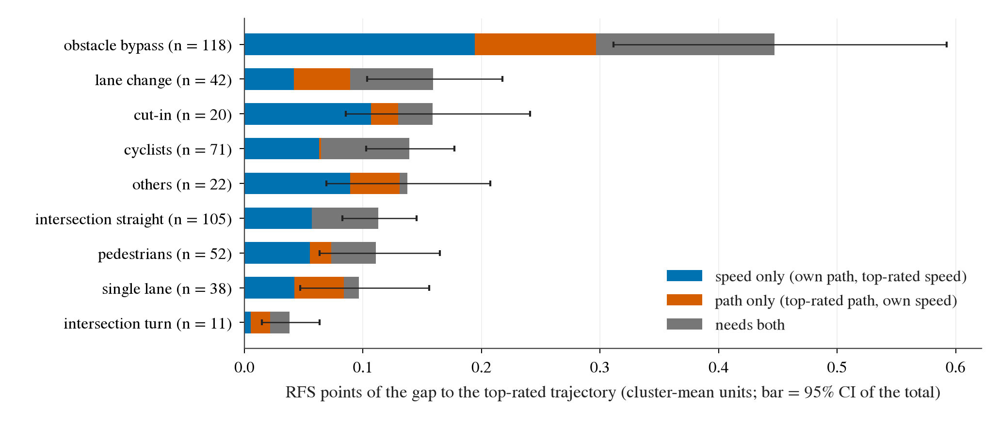
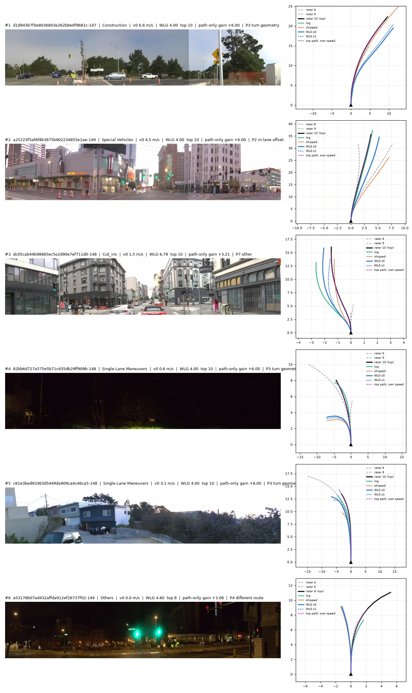

# Q2. The non-longitudinal part of WLG's val gap: path-only is +0.290 RFS, all of it in 30 frames, half of it low-speed turn geometry

Written 2026-10-10, lane WODSCOUT. Offline on the stored WLG val predictions (two seeds), no training, nothing submitted; the rater trajectories are
analysis-only labels. Pre-registration: [plans/2026-10-10-wodscout-prereg.md](../plans/2026-10-10-wodscout-prereg.md) (pushed before any read).
Code: `scripts/ws_val.py` (one run, about 1 min CPU). Tables: [q2_path_budget/](q2_path_budget/). Conventions as in
`experiments/op_parity/results/wod_gap.md`: 479 rater frames (478 sequences), cluster-mean RFS, frame weight 1 / (frames in its cluster x 10) so that
"points" of disjoint groups add up to the gap, WLG = per-frame mean of the two seeds' scores, paired bootstrap over sequences, B 4 000.

Gate G0 passed: WLG 8.187, gap to the top-rated trajectory 1.400, O1 +0.657, O2 +0.290 (decisions 169 and 218 amendment reproduce to the third decimal).

## Answer

| part of the 1.400 gap | points [95 % CI] | share |
|:--|:--|--:|
| speed only (O1: own path at the top-rated arc length) | +0.657 [+0.475, +0.843] | 47 % |
| **path only (O2: top-rated path at own arc length)** | **+0.290 [+0.166, +0.432]** | **21 %** |
| joint remainder (gap - O1 - O2) | +0.453 [+0.319, +0.599] | 32 % |
| non-longitudinal upper end (gap - O1 = path only + joint) | +0.743 [+0.565, +0.928] | 53 % |

1. **The budget.** What a path change alone can return is +0.290; what a speed change alone cannot return is +0.743. The 0.453 between them is frames
   where neither swap alone recovers the score (a different manoeuvre: another gap or exit taken at another speed).
2. **It is concentrated.** 114 frames have a positive path-only gain, 40 a negative one; the 30 largest hold 0.290 points, i.e. the whole net amount
   (the 10 largest 0.172, 60 %). The positive total over all 114 is 0.349.
3. **Where.** Only two strata get the pre-registered label "path": turn-intent frames (52 frames, path-only +0.114 [+0.046, +0.189] points against
   speed-only +0.055; in stratum RFS +1.14 [+0.63, +1.78]) and their subset inside `Interections` (11 frames). Everything else is "speed" or undetermined.
   By speed at t = 0: 0.175 of the 0.290 sits at 0.5-5 m/s, 0.079 at 5-12 m/s, 0.025 at standstill.
4. **What the top-rated path did that ours did not** (30 sheets, looked at by the lane agent, types fixed before looking): 14 frames / 0.149 points are
   turn geometry, with our plan on the inside of the top-rated path in 12 of them (median signed offset over the 14: 1.9 m at 5 s; 11 of the 14 start
   below 5 m/s, 6 are floored at 4.0);
   5 frames / 0.043 are a different route (the top-rated trajectory turns or bears off and ours goes straight; 4 of the 5 carry the intent
   "straight"); 5 frames / 0.034 another lane; 4 frames / 0.054 an offset inside the lane; 2 frames other.
5. **Not new money.** The total is decision 218 amendment's number for WLG and the same quantity as decision 164's +0.296 for WP2; the low-speed
   turn block is the one decisions 169 (point 5: at 0.5-3 m/s WLG's inside offset is 1.94 m, shipped 0.82 m) and 175 (point 2) already describe.
   Decision 168's "path selection only +0.367" is the same space measured with a 5-path candidate family on WP2. None of these add.

What to look at: the orange segment (path only) is visible only in obstacle bypass, lane change, single lane and the intersection-turn row; in every row
the blue segment (speed only) or the grey one (needs both) is larger, except lane change and single lane where blue and orange are equal.

## By situation (a partition of the 479 frames by cluster tag and intent; points add to the first row)

| situation | n | RFS WLG / top | gap pts | speed only | path only | joint | label |
|:--|--:|:--|:--|:--|:--|:--|:--|
| all | 479 | 8.187 / 9.587 | 1.400 [1.199, 1.609] | 0.657 [0.475, 0.843] | 0.290 [0.166, 0.432] | 0.453 [0.319, 0.599] | speed |
| obstacle bypass (FOD + Construction + Special Vehicles) | 118 | 8.021 / 9.511 | 0.447 [0.311, 0.592] | 0.194 [0.078, 0.323] | 0.103 [0.019, 0.215] | 0.150 [0.063, 0.255] | both |
| lane change (Multi-Lane Maneuvers) | 42 | 8.029 / 9.619 | 0.159 [0.103, 0.217] | 0.042 [-0.010, 0.098] | 0.048 [0.016, 0.087] | 0.070 [0.018, 0.127] | undetermined |
| cut-in (Cut_ins) | 20 | 8.311 / 9.900 | 0.159 [0.085, 0.241] | 0.107 [0.045, 0.177] | 0.023 [-0.008, 0.066] | 0.029 [-0.001, 0.069] | speed |
| cyclists (Cyclist) | 71 | 8.439 / 9.831 | 0.139 [0.103, 0.177] | 0.063 [0.022, 0.106] | 0.002 [-0.018, 0.018] | 0.074 [0.038, 0.114] | speed |
| others (Others) | 22 | 8.127 / 9.500 | 0.137 [0.069, 0.208] | 0.089 [0.033, 0.155] | 0.042 [0.004, 0.085] | 0.006 [-0.027, 0.045] | speed |
| intersection straight | 105 | 8.341 / 9.590 | 0.113 [0.083, 0.145] | 0.059 [0.029, 0.089] | -0.002 [-0.017, 0.009] | 0.056 [0.030, 0.085] | speed |
| pedestrians (Pedestrian) | 52 | 8.334 / 9.442 | 0.111 [0.063, 0.165] | 0.055 [0.008, 0.106] | 0.018 [-0.014, 0.053] | 0.038 [0.006, 0.079] | speed |
| single lane (Single-Lane Maneuvers) | 38 | 8.480 / 9.447 | 0.097 [0.047, 0.156] | 0.042 [-0.002, 0.089] | 0.042 [0.005, 0.092] | 0.013 [-0.013, 0.047] | undetermined |
| intersection turn (intent L / R) | 11 | 5.642 / 9.636 | 0.038 [0.015, 0.063] | 0.006 [-0.006, 0.019] | 0.016 [0.004, 0.032] | 0.016 [0.003, 0.034] | path |

Cross-cuts (overlap with the rows above): turn intent, 52 frames, gap 0.282, speed only 0.055 [0.004, 0.114], path only 0.114 [0.046, 0.189], joint
0.114, label path; straight intent, 427 frames, gap 1.118, speed only 0.603, path only 0.176 [0.071, 0.299], label speed; stopped (v0 < 0.5, 120
frames) path only 0.025 [-0.017, 0.068]; moving (359 frames) path only 0.265 [0.150, 0.404]; night (133 frames) path only 0.065 [0.019, 0.122].
Full table with per-cluster rows, stratum RFS differences and WLG - shipped: [q2_path_budget/budget.md](q2_path_budget/budget.md).

Label rule (pre-registered): "speed" if the speed-only CI excludes 0 and speed-only >= 2 x path-only; "path" the reverse; "both" if both CIs exclude 0
within a factor 2; else undetermined. About 26 strata were labelled; a lower bound near 0 is weak.

Reading: a cut-in, a cyclist, a pedestrian and a straight crossing are speed problems for WLG (path-only CI contains 0 in all four). Obstacle bypass
is the only large situation where the path part is clearly non-zero (0.103, CI excludes 0), and there the speed part is twice as large. In every
situation the joint remainder is as large as or larger than the path-only part, except single lane and Others.

## The 30 frames with the largest path-only points

Selection rule (pre-registered): frame weight x (O2 score - own score), seed mean, descending. Small first: the first 10 were looked at to check that
the rubric applies (it does; the automatic "P7 other" and one "P6 label artefact" needed a look), then all 30. The automatic type comes from geometry on
the submitted mean trajectory (`q2_path_budget/path_types_auto.md`); the manual type is the lane agent's reading of the sheet (front-left / front /
front-right strip + BEV) and overrides it; 22 of 30 agree. Per-frame list with notes: [q2_path_budget/top30.md](q2_path_budget/top30.md),
manual labels `q2_path_budget/top30_manual.csv`.

| manual type | frames | path-only pts | share of the top 30 | turn intent | v0 < 5 m/s | night | WLG floored at 4.0 |
|:--|--:|--:|--:|--:|--:|--:|--:|
| P3 turn geometry (both turn; radius / cut differs) | 14 | 0.149 | 51 % | 13 | 11 | 3 | 6 |
| P2 offset inside the lane | 4 | 0.054 | 19 % | 1 | 3 | 1 | 1 |
| P4 different route (one turns, the other does not) | 5 | 0.043 | 15 % | 1 | 5 | 2 | 0 |
| P1 another lane | 5 | 0.034 | 12 % | 0 | 1 | 1 | 1 |
| P7 other (dark night, road bends, own goes straight) | 1 | 0.006 | 2 % | 0 | 0 | 1 | 0 |
| P5 own drifts while the top-rated path is straight | 1 | 0.005 | 2 % | 0 | 1 | 0 | 0 |
| P6 label artefact | 0 | 0 | | | | | |

- **P3, half of the path budget.** In 12 of the 14 our plan ends on the inside of the top-rated path (median signed offset over the 14: +1.9 m towards the turn side at 5 s):
  it turns in earlier and tighter. All 52 turn-intent frames together hold 0.114 path-only points: 0.004 at standstill (the stop gate of WLG
  already fixed these, decision 169 point 5), 0.047 at 0.5-3 m/s, 0.046 at 3-5 m/s, 0.017 above. So the remaining block is turns entered at 0.5-5 m/s,
  28 frames, 0.093 points, 6.6 % of the gap.
- **P4** is the one type that is not geometry: on 4 of the 5 the frame's intent is "straight" while the top-rated trajectory (and on at least 3 of them the log)
  turns or bears off; the command we are given does not say so, and the plan follows the command.
- **P1 / P2** (9 frames, 0.088): the top-rated path takes another lane (3 of the 5 P1 frames at 15-25 m/s) or sits 1-2 m to one side along parked cars
  or cones. No common direction: in one P1 frame (rank 11) it is our plan that changes lane and the top-rated path that does not.
- Night is 8 of the 30 (27 %; 28 % of val). One frame (rank 20) is a dark road where our plan misses the bend.
- Truncated top-rated trajectories (the metric pads them, decision 164) are not a path issue: over all frames the automatic "label artefact" group
  (82 frames) has -0.010 path-only points.

Sheets (ego at the origin heading up; black = top-rated, grey dashed = the other two rated trajectories, green = log, orange = shipped, blue = WLG
seeds, magenta dashed = the top-rated path at our arc length, i.e. the O2 swap; the two BEV axes have different scales):

What to look at: ranks 4 and 5 (left turns from low speed): the blue plan curls in several metres before the black one; rank 6: black and green
turn right at a green light, blue goes straight on a "straight" intent.

[sheet 2](../figs/q2_top30_sheet2.webp) (ranks 7-12: three more turns; rank 12 is the freeway lane change),
[sheet 3](../figs/q2_top30_sheet3.webp) (13-18), [sheet 4](../figs/q2_top30_sheet4.webp) (19-24), [sheet 5](../figs/q2_top30_sheet5.webp) (25-30).

## Limits

- 479 frames; the path budget rests on about 30 of them, so every per-type number is a handful of frames and has no CI.
- The swap keeps our arc length: a frame where our plan barely moves cannot show a path difference (standstill frames contribute 0.025).
- Types were assigned by one reader who also wrote the rubric; the automatic geometry agrees on 22 of 30.
- Open loop, in-sample, oracle swaps: these are sizes of what is missing, not of what a method would recover (decision 171: in-sample to out-of-fold
  shrinks 3-4 times on this set).
