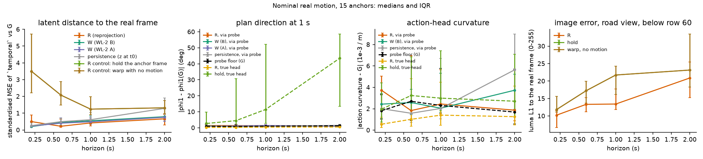
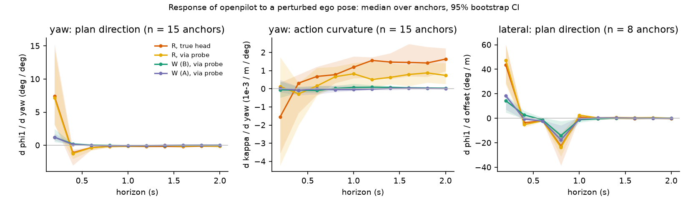
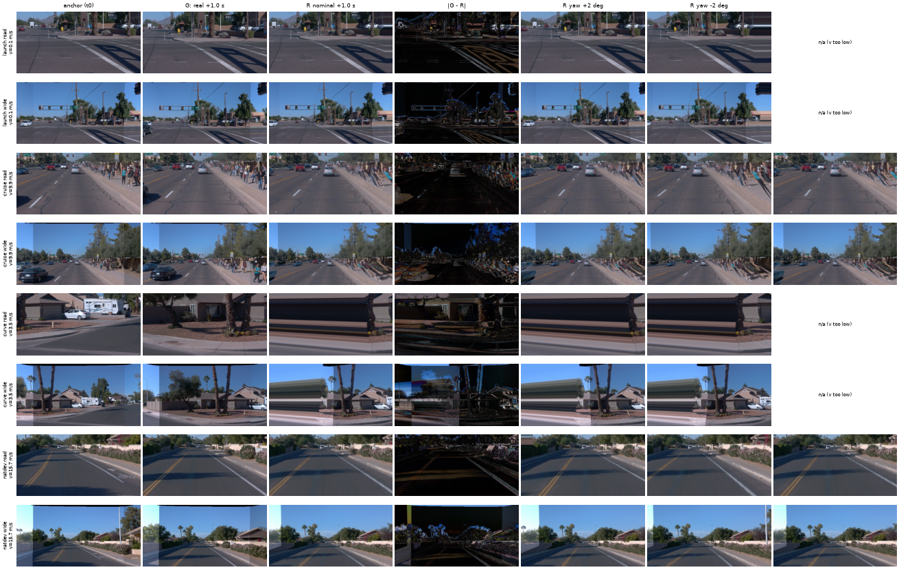

# World model (WL-2) vs geometric reprojection as the "what openpilot sees after the ego deviates" engine

Written 2026-10-04. Small check, no pre-registration; nothing retrained. Code: `experiments/world_model/scripts/wm_{common,prep,op,w,report,sheet}.py`, chain `wm_chain.sh`.
Numbers: [wm_vs_reproj/tables.json](wm_vs_reproj/tables.json). Box outputs: `$DATA_DIR/runs/wm_vs_reproj/`. One leased card, ~10 min of compute in total.

## Setup

- **Data.** The 10 WOD sceneflow segments (10 Hz, 3 front cameras, exact pose), taken at 5 Hz. 15 anchors (5 Hz frame i; 2 s of real future each): 6 launch, 3 cruise, 1 curve (24 deg of yaw in 1 s), 5 natural deviation (|lateral deviation of the real path from its 3 s smoothing| > 0.2 m at v > 4 m/s). Anchors from one segment are correlated; n is small.
- **G (ground truth, nominal motion only).** Shipped Cinque on the real frames (5 Hz, each held 4 steps, `p5_openpilot` protocol, 8 s warm-up). No real frame exists for a *perturbed* pose, so G exists only for the natural motion of each anchor; the perturbation arms have no G.
- **R.** The anchor frame (model view, road + wide) re-projected to the pose of each step 1..10 with `op_interp.warp_frame` (road plane at the camera height, static world, 60 m sphere beyond), then through Cinque after the real history. Poses: the real ones (nominal), or perturbed: ego yaw +-1 / +-2 deg from step 1 on, lateral offset +-0.5 m (a 3-step swerve ending 0.5 m off the path; not run below ~4 m/s, so 8 of 15 anchors). The same kinematic pose sequence is given to W as actions.
- **W.** Shipped WL-2 arms B (with the ego channel e_y / e_psi) and A, seeds 0-4 averaged, no retraining; history = the real stream's `temporal` + V-JEPA 2 mean of the 3 real front cameras + s, future = (a, omega) of the pose sequence, source flag 1. e_y / e_psi are against the 1.5 s-smoothed real path (WL used the CARLA route). **W is latent-only** (openpilot `temporal` 512 + V-JEPA 3072): it produces no image, so it has no column in the contact sheet and no openpilot plan. To read a plan from W's latent I fitted a ridge probe `temporal` -> (phi1, action curvature) on G + R rows, leave-one-segment-out and applied it identically to G, R and W. Probe held-out R^2: phi1 0.60 on G rows (0.93 on R rows), curvature 0.55 (0.50); probe floor |probe(z_G) - head| ~ 0.8-1.0 deg, so W's plan readout has ~1 deg of noise that R's true head does not have.
- Controls added to R: `hold` (anchor frame repeated) and `idw` (warp with zero motion; identical to hold, so the warp pipeline itself changes nothing).
- phi1 = direction of the 1 s plan point (deg, left +); curvature = action head, 1e-3 / m. Distance in latent space = mean over the 512 dims of squared error / variance of the real stream.

## Results

**1. Fidelity on the real nominal motion (G exists), medians over 15 anchors** ([figure](../figs/wm-vs-reproj-fidelity.png)):

| horizon | latent dist. to G: R / W(B) / persistence | phi1 error, true head: R / persistence | curvature error: R / persistence | image L1: R / hold |
|---|---|---|---|---|
| 0.2 s | 0.50 / **0.20** / 0.25 | 0.21 / 0.28 | 0.55 / 0.61 | 10.2 / 11.8 |
| 0.6 s | **0.22** / 0.44 / 0.50 | **0.22** / 0.60 | **1.0** / 2.0 | 13.3 / 17.2 |
| 1.0 s | **0.42** / 0.55 / 0.61 | **0.35** / 0.89 | **1.4** / 3.1 | 13.4 / 21.7 |
| 2.0 s | **0.66** / 0.79 / 1.29 | **0.46** / 1.05 | **1.3** / 4.4 | 20.9 / 23.1 |

- R follows openpilot's own nominal output on real motion to 0.2-0.5 deg of plan direction and ~1.3e-3 / m of curvature up to 2 s, 2-4x better than "nothing changes" (persistence) beyond 0.6 s. The `hold` control (same frame repeated) is far off (phi1 error 2.7 -> 43 deg, latent distance 3.5 -> 1.3): openpilot's temporal feature reads frame-to-frame motion, so a rollout must feed moving frames.
- At 0.2 s R is *worse* than persistence in latent distance (0.50 vs 0.25) even though its head error is similar: the first synthetic frame shifts the feature before the warp error is averaged out.
- W (B and A alike) is **at persistence level** in latent distance at 0.2-0.6 s (0.20 / 0.44 vs 0.25 / 0.50), a bit better at 1-2 s (0.55 / 0.79 vs 0.61 / 1.29) but never better than R from 0.6 s on. Via the probe, W's plan error (1.0-1.2 deg) is not separable from persistence (0.8-1.5) or the probe floor.
- Where R fails (per anchor, 1 s): launch from standstill (phi1 error 0.9-2.5 deg at 3 of 6 launches; the model's launch lean is a response to scene content that a static warp does not move), the 24-deg curve (2.0 deg; contact sheet: the warp leaves the source image, border smear), near the left/right image edge in the wide view.

**2. Response to a perturbed pose (loop gain), no G; median over anchors [95% bootstrap CI]** ([figure](../figs/wm-vs-reproj-gain.png)):

| quantity (phi1, deg per deg of yaw) | step 1 (0.2 s) | step 2 | step 3 | step 5 | step 10 |
|---|---|---|---|---|---|
| R, true head | **7.4 [3.2, 15.3]** | -1.1 [-3.0, -0.6] | -0.34 [-0.7, -0.3] | -0.15 | -0.12 |
| W (B), via probe | 1.2 [0.5, 2.5] | 0.2 | 0.0 | 0.0 | 0.0 |
| W (A), via probe | 1.2 [0.8, 1.8] | 0.1 | 0.0 | 0.0 | 0.0 |

- R reproduces the launch-type impulse gain of decisions 100 / 111 (step 1: 7-9 deg per deg; here a sudden yaw step on real WOD frames, so not the same perturbation shape, but the same order and the same decay): a 2-deg heading jump read as a rotation makes the plan swing ~15 deg, then it settles to a small restoring value (-0.1 to -0.3). Curvature gain after 0.6 s is +0.7 to +1.6e-3 / m per deg (CI above 0 from 1 s).
- W's response in latent space has the right *direction* at step 1 (cosine of its change with R's 0.91 for yaw, 0.92 for lateral) but ~0.2x the norm for yaw (0.46x lateral), and from step 3 the direction is unrelated (cosine 0.0-0.25). Via the probe W's step-1 gain is 1.2 vs R 7.4; after step 2, W shows no response at all. So **W under-reacts by ~5x at exactly the quantity the closed-loop gaps need**.
- Lateral +-0.5 m (8 anchors, steps dominated by the swerve heading at 1-3): R and W agree on the sign at steps 1-3 (R 43 / -3.5 / -2.1 deg per m; W(B) 14 / 2.7 / -1.2), no restoring response at 2 s for either (R -0.2 [-0.5, 0.0]). B's predicted change of e_y against the kinematic one: correlation 0.37, median abs error 0.24 m against a median true change of 0.29 m (n 76): the ego channel does not carry a 0.5 m offset reliably on real data.

## Verdict

- **R beats W** as a generator of "what openpilot sees after the ego deviates", on every readout where both exist and G is known (latent distance from 0.6 s, 2-4x lower plan error than persistence), and it is the only arm that gives an image, hence a plan from openpilot's true head. W is at persistence level for short horizons and reproduces neither openpilot's step-1 amplification nor any later response.
- **R alone is good enough** as the rollout engine for short (<= 1-2 s) closed-loop rollouts for the gaps in question (launch yaw loop gain, recovery from offset, history inconsistent with motion), with the caveats below; W adds nothing to it here and cannot be probed without a plan readout.
- Not tested: a WM trained on real data; W is the CARLA-trained model on real WOD frames, so part of its loss is domain shift (the CARLA rig is Waymo-calibrated, but renders differ). The V-JEPA input here is the real images squashed to 256x256.

## What each engine cannot represent

- **R breaks:** non-planar scene (near objects, parallax: wrong for anything above the road, sky and buildings are put on a 60 m sphere), borders (a 24-deg yaw in 1 s leaves the source image, border replicate smears), other agents and occlusion (static world; a car that would move or appear does not), shadows / exposure, launch from standstill (the response there depends on scene content R cannot change), single-anchor rollouts degrade with horizon (image L1 doubles from 1 to 2 s).
- **W cannot represent:** other agents' reaction and occlusion change only through the latent it was trained to move (WL-2: occupancy / lateral readout failed, decisions 76), lateral offset (ego channel unreliable, above), any image, and any plan without an extra probe. A 2 s horizon only.

## Limits

- 15 anchors from 10 segments (6 launch, 3 cruise, 1 curve, 5 natural deviation); CIs are bootstrap over anchors, anchors of one segment are not independent. The lateral arm exists for 8 anchors. The selection of a first run (11 anchors) was widened after seeing it; the numbers above are from the second, final set only.
- The probe floor (~1 deg) limits every W-via-probe statement; the latent-space comparisons do not depend on it.
- The perturbation is applied to the 5 Hz poses; the "gain" for yaw at step 1 mixes the heading step and the first synthetic frame (cf. R vs persistence at 0.2 s).

Fidelity on real nominal motion: left to right latent distance, plan direction, curvature, image error. Look at: R (orange) below persistence from 0.6 s; the hold control far above in every panel (dashed green, off-scale in panel 2).

Response to the perturbation. Look at: the step-1 spike of R (orange / yellow) against the flat W curves (green / purple).

Model-view contact sheet (road, wide; one clip per category). Columns: anchor, real +1 s (G), R nominal, |G - R|, R at yaw +-2 deg, R at +0.5 m. W is latent-only and has no image. Look at: R is close to G on launch / cruise / natural deviation; the curve clip shows the border smear and the planar-scene error.
