# 第 125–135 条复核：证据链、图、动图与核对出的不一致

2026-10-06。目的：用户逐条目检第 125–135 条背后的实验。每节按「问题 / 设置 / 数字 / 状态 / 看什么」组织，数字抄自结果文件（路径在每节给出），**没有复算**；只有核对 decision 文本与结果文件是否一致这一步是新做的，结论汇总在 [核对时发现](#核对时发现)。decision 本身没有改。GIF 都是重录而非计分那一次（各结果文件已注明），逐帧没审过。

术语：**spec** = 统一接口默认预设；**zones** = B2D 路线命令区内用稠密路线几何转向（semi 兜底），**nz** = zones 关，只靠 openpilot 自己转；**curv / p7 / hyb** = 横向执行层（action 曲率 / 跟 plan 位置 / 3 m/s 以下 action 以上 plan）；**choice / forced** = 有多个出口 / 只能转的转弯；「走对」= 离稠密出口 5 m 内。**rc-\*** 系列见第 128 条。

## 0. 证据链

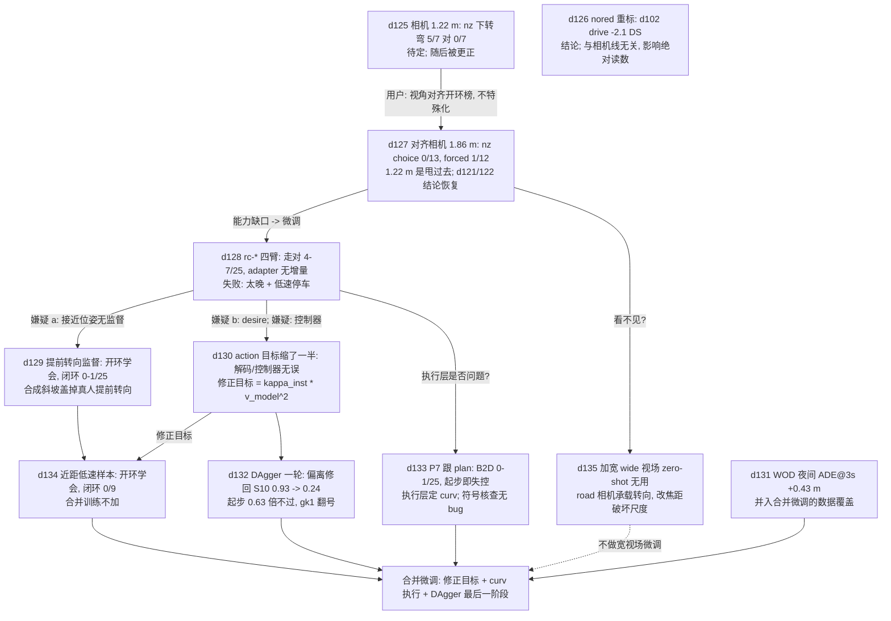

主线：125 的相机线被 127 收敛为「B2D 相机 = 开环榜均值 (x 1.59, z 1.86)，路口缺口靠微调补」；128 / 129 / 134 三次微调尝试闭环都没把路口转起来；130 查出 128 / 129 的 action 目标本身错了一半，所以 128 / 129 的闭环结论都带这个限定，修正后只有 134 的 400 步 pilot 用过，4000 步修正臂没跑。133 排除了「执行层」，135 排除了「视场」，两者都把缺口压回 action 头。126、131 是旁支（读数口径、夜间覆盖）。

---

## 第 125 条　B2D 相机 1.22 m（待定，后被更正）

**问题**：B2D 相机从 1.433 m 挪到 1.22 m（前保险杠线 x 3.8 m）是否改变路口行为。
**设置**：6 条 val 路线（forced 28180、24944；choice 27297、9196、6999、34183；共 7 个转弯），seed 2，每格一次。`legacy` / `s143` / `s122` / `s143nz` / `s122nz`。结果 [unified_interface.md](../experiments/leaderboard_audit/results/unified_interface.md) §2、§4。
**数字**：

| arm | DS | RC | 完成 | 碰撞 | 红灯 | 转弯走对 (of 7) |
|---|---|---|---|---|---|---|
| s143 (zones 开) | 55.1 | 100 | 6 | 4 | 4 | 7 |
| s122 (zones 开) | **67.6** | 93.5 | 5 | 4 | 2 | 6 |
| s143nz | 30.4 | 51.4 | 0 | 3 | 3 | 0 |
| s122nz | 36.7 | 90.8 | 4 | **10** | 3 | **5** |

配对 DS s122 − s143 +12.5（逐路线 +30 / +58 / 0 / −25 / +12 / 0，一次红灯 10–30 DS，只算方向）；zones 关时 1.22 m head 要的转弯曲率约 6 倍（逐转弯峰值 0.87 对 0.13）。NAVSIM 虚拟 1.22 m −1.97 [−3.08, −0.85] PDMS，WOD 479 帧 −0.492 [−0.691, −0.303] RFS，两榜保持真实高度。
**状态**：待定，n = 6 单次。同日更正：1.22 m 不是实测设备高度且混了位置，改为与开环榜视角对齐（第 127 条）。5/7 对 0/7 只能读成「head 对视角敏感」。
**看什么**：本条没有专属图（表格数字）。1.22 m 的行为在第 127 节的 BEV 面板里：zones 关的 122nz 路径到得了出口但摆动。

## 第 126 条　`nored` 重标（结论）

**问题**：第 74、81、82、102 条的 B2D 读数用过真值红灯扣住停车锁存（`nored`），影响多大。
**设置**：第 102 条 drive 臂改 `resume: timer` 重跑 4 路线 × 2 seed，对旧 nored 的 8 个 run。结果同上文件 §3。

| 子集 | n | DS nored | DS timer | 红灯 nored / timer |
|---|---|---|---|---|
| 全部 | 8 | 60.1 | 58.0 (−2.1) | 3 / 6 |
| nored 起作用的 run | 3 | 50.3 | 44.8 (−5.6) | 0 / 3 |
| 没起作用的 run | 5 | 66.0 | 66.0 | 3 / 3 |

五个没起作用的 run 逐位复现，所以差异全部来自 resume。第 81 条配对差两边都用 nored，不受影响，绝对 DS 与闯红灯数受影响。`nored` 现在在规格里直接拒绝。
**状态**：结论（读数口径）。**看什么**：无图，上表即证据；关键是 5 个未触发 run 的逐位相同（对照干净）。

## 第 127 条　对齐相机后 action 头路口照样不转（中）

**问题**：B2D 相机按用户原则与开环榜对齐（NAVSIM CAM_F0 x 1.665 / z 1.862 与 WOD 前相机 x 1.519 / z ≈ 1.86 的均值，level：x 1.59、z 1.86 m），只靠 action 头能不能转路口；第 121 / 122 条的结论要不要降级。
**设置**：25 转弯 / 20 条 val 路线（13 choice、12 forced），seed 2，与 1.433 m 逐转弯配对。A = shipped drive zones 开 1.433；D = zones 关 1.433；OL / OLnz = spec 对齐相机 zones 开 / 关；143nz = spec 1.433 zones 关（只改高度的对照）；122 / 122nz。结果 [junction_rig122.md](../experiments/op_closed_loop/results/junction_rig122.md)，全表 `junction_rig122_tables.md`。

| 走对出口 | choice (13) | forced (12) | choice 出车道 | forced 出车道 |
|---|---|---|---|---|
| A zones 开 1.433 | 11 | 9 | 8% | 0% |
| D zones 关 1.433 | 2 | 4 | 91% | 70% |
| **OLnz zones 关 对齐相机** | **0** | **1** | 100% | 78% |
| OL zones 开 对齐相机 | 12 | 8 | 8% | 0% |

- 143nz（spec 1.433）在可比转弯上 0/10、2/9，OLnz 0/10、1/9：高度从 1.433 到 1.86 不改变「不转」。head 期望曲率峰值中位 0.30 倍所需（choice）、forced 0.75 倍。
- zones 开：OL − A choice +1 (+8 pp [−15, 31])、forced −1；DS 69.6 [58.4, 80.5] 对 67.7 [54.2, 81.0]：相机移动本身不伤不帮。
- 1.22 m nz（可比 10 + 9 转弯）：5/10、3/9，对 143nz +50 pp [+20, +80] / +11 pp [0, 38]；但 90% choice 转弯出车道、峰值横向偏移中位 7.2 m，曲率为所需 5.7 倍：**甩过去，不是跟弯**。
- 第 125 条的 10 对 3 碰撞：122nz 的 10 次里 6 次静态物（红绿灯、护栏、建筑），2 次出车道撞车，2 次车道内；1.433 m 少是因为车几乎不动（窗口均速 0.76 m/s）。车道内撞「转进来的车」所有 zones 开的臂都是 2–3 次，属纵向让行调度，不归相机。

**状态**：待定（中）；单 seed、每格一次，闭环非逐位确定，单个转弯会翻；1.22 m 的几格缺 4 条路线。第 121 / 122 条降级提示撤回。**会推翻**：对齐相机上微调后同 25 转弯的走对率。

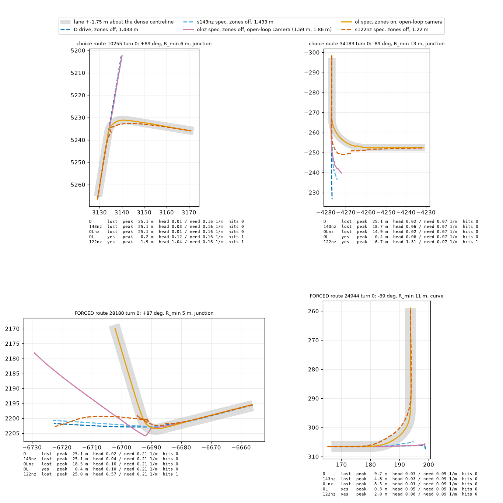

**看什么**：choice 10255（右转 6 m）、34183（左转 13 m）、forced 28180（T 字 4.7 m）、24944（弯 10.7 m）。D / 143nz / OLnz 在 choice 路口直行穿过；122nz 到得了出口但摆动（34183 偏 6.7 m）；OL（zones 开）贴着中线。

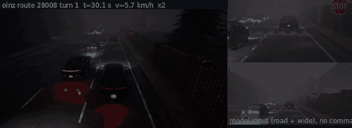

**看什么**（zones 关，28008 turn 1，−90°，夜间）：OLnz 直行穿过路口，上方 road、下方 wide 输入里路口清楚可见但 head 不动方向。

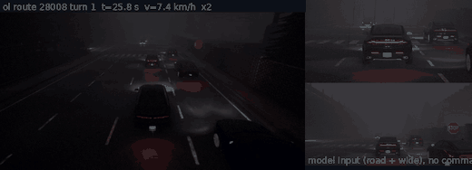

**看什么**（zones 开，同一路口）：路线几何把车转过去，对比上一张。文件 6.4 MB。

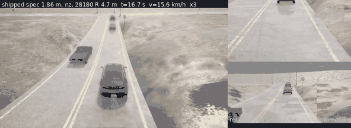

**看什么**：28180 T 字路口 forced 右转（R 4.7 m），spec 对齐相机下 shipped 只靠 action 头，不右转，直行冲上路沿。

旧相机对照（1.433 m，desire 开）：

**看什么**：旧 `drive` 臂下 forced 弯的路径；宽弯 (28008, R 33.7 m) 能跟上，急弯 (24944, R 10.7 m) 直行冲出。对应动图 [D_24944_tight_curve.gif](../experiments/op_closed_loop/figs/D_24944_tight_curve.gif)、[D_28008_wide_curve.gif](../experiments/op_closed_loop/figs/D_28008_wide_curve.gif)。

## 第 128 条　路线选路微调 rc-*（中偏弱）

**问题**：从 shipped 微调，加路线 adapter，能否让 B2D 路口只靠 action 头转对（主线：rc-bear ≥ 13/25 且配对下界 > 0）。
**设置**：4000 步，训练 stage 4 + plan pathway + action pathway + 路线 adapter，每个头蒸馏回 shipped。数据 navtrain / WOD 事后折线、CARLA 1.86 m 出口配对、急弯加权、负样本。臂：rc-bear（距离 + 方位角）、rc-poly（16 点折线）、rc-ctl（同帧无指令）、rc-all（+ T4/T5/T6，探索）。单 seed。结果 [report.md](../experiments/op_route_ft/results/report.md)、[split.md](../experiments/op_route_ft/results/split.md)、[crawl.md](../experiments/op_route_ft/results/crawl.md)、[desire_off.md](../experiments/op_route_ft/results/desire_off.md)。
**数字**（25 转弯，对齐相机，zones 关，desire 开）：

| arm | 走对 | 对 shipped 配对 [95% CI] | 路线 DS (未预登记) |
|---|---|---|---|
| shipped | 1 | | 26.3 |
| rc-ctl | 6 | +0.20 [+0.07, +0.36] | 34.0 |
| rc-bear | 4 | +0.12 [0.00, +0.30] | 36.2 |
| rc-poly | 7 | +0.24 [+0.07, +0.44] | 39.0 |
| rc-all | 6 | +0.20 [+0.04, +0.40] | 31.0 |

- adapter 增量：rc-bear − rc-ctl −0.08 [−0.28, +0.15]（2 得 4 失）；闭环里指令没有可测的额外贡献。接线已核实（`ra.f` 每步有值，距离 25 → 3.5 m，方位符号对）。
- 开环 CARLA 留出路口出口走对 0.58–0.59（shipped 0.16，rc-ctl 0.29，线 0.8 不过）：plan 头读得到指令，没传到闭环转向。负样本 0.44–0.51 m（线 0.3）不过。
- 失败拆分（首个匹配原因）：shipped「不选」10 / 20 进入；微调后「不选」基本消失（rc-ctl 0），头转向幅度 1.2–3.4 倍所需（shipped 0.3），主失败变成「选得太晚」6–9 / 臂。
- 低速（crawl.md）：速度双峰，约 40% 停车、约 45% 在 1.3–5 m/s；停车时间 70–90% 是 plan 自己要停，31 / 32 发生在车已滚动之后；zones 开同样停（停车占比 0.37 对 0.46）。`plan_vmin = 0` 时 3 条路线整条停车占比 0.93–0.98、只走 2–13 m（车不起步）。
- desire 关（desire_off.md）：无一臂塌；rc-ctl 仍在 9/11 choice 转弯朝指令侧打方向（on 也 9/11）；走对 rc-ctl 5/25（on 6）、rc-bear 6/25（on 4），rc-bear − rc-ctl +0.04 [−0.17, +0.26]。嫌疑 b 不成立，侧向信息来源未测（候选：车道几何或微调本身）；9/11 对 50% 机会水平 p ≈ 0.03，也只是「中等高于机会」。
- 护栏：rc-bear navhard −0.43、早转 −0.30 不过；rc-all 早转 −0.65、HUGSIM 1 次打转、转弯窗口碰撞 8 对 5 不过；rc-all navhard DAC +0.32 / EP +3.94 pp、navtest DAC +0.82 / EP +0.75。

**状态**：待定（中偏弱）。**更正（第 130 条）**：所有 rc-* 的 action 目标缩了一半，闭环读数需在修正目标后重测。**会推翻**：修正目标后的 4000 步重测；翻转 / 随机指令对照（侧向信息来源）。

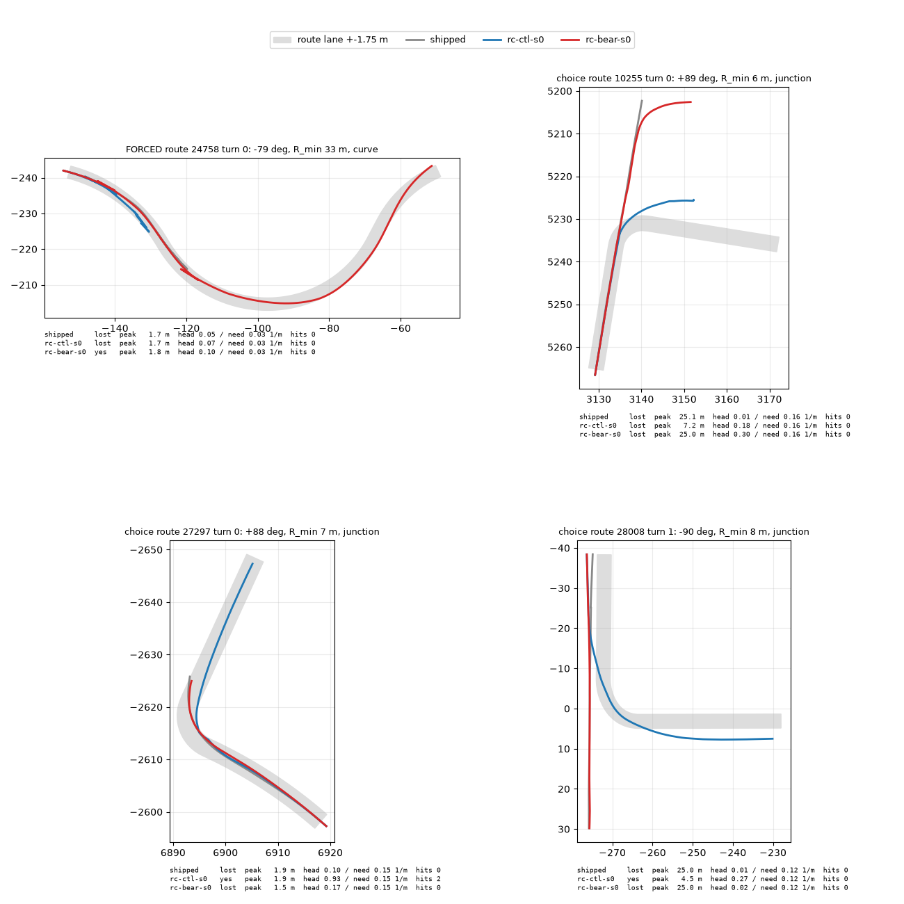

**看什么**：BEV，shipped 灰 / rc-ctl 蓝 / rc-bear 红。10255：rc-bear 先直行冲过路口再弯；rc-ctl 更早转但中途停住。27297：rc-ctl 右转成功，shipped 与 rc-bear 丢。28008 turn 1：rc-ctl 左转，其余直行。24758 turn 0（forced 弯）：rc-bear 跟上，rc-ctl 和 shipped 停住。

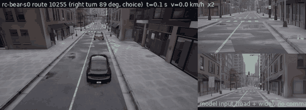

**看什么**：rc-bear 在 10255 turn 0（右转 89°，R 6.4 m）：车到路口口时，adapter 已读「右 90°」，但期望曲率长时间近 0，约 28 m 后才打方向（报告文字描述，GIF 里看车何时到路口口、k 何时离开 0）。

**看什么**：三个转弯的 plan 速度（+1 s / +3 s）、实际速度、plan 加速度、action 加速度、速度仲裁绑定源。A 图：每约 3.5 s 一次约 2 s 的停车，停车前 plan 速度先塌、action 加速度先变负；停车时 base 速度剖面把车拉起，起步后 plan 再次绑定。

**看什么**：每个进入的转弯按原因分解的停车秒数，以及实际 / plan 速度中位。每个臂（含 shipped）里蓝色块（模型自己要停）都占主体，黑蓝柱基本对得上。

## 第 129 条　入弯前提前转向监督（中偏弱）

**问题**：128 的嫌疑 a（接近位姿 action 监督≈0）成立吗。
**设置**：单变量：接近路口位姿上 action 目标按指令出口曲率提前给（CARLA 同位姿不同出口 → 不同目标；真实数据接近段换成合成线性斜坡），其余同 rc-bear / rc-ctl。结果 [pre.md](../experiments/op_route_ft/results/pre.md)、[pre_flip.md](../experiments/op_route_ft/results/pre_flip.md)。主设置 desire 关（pre.md 声明）。
**数字**：

- 开环：rc-bear-pre 接近位姿期望曲率贴目标 corr 0.96，同位姿左右指令差 0.0106 1/m（rc-bear 0.0023）；rc-ctl-pre 学不到（brake d 10 m：0.0030 对目标 0.0189）；plan 读数不变（0.583）。
- 闭环 25 转弯，走对（desire 关 / 开）：shipped 3 / 1，rc-ctl 5 / 6，rc-bear 6 / 4，rc-ctl-pre 3 / 1，**rc-bear-pre 1 / 0**。rc-bear-pre − rc-ctl-pre −0.08 [−0.24, +0.08]（关）、−0.04 [−0.12, +0.00]（开）；rc-bear-pre − rc-bear −0.20 [−0.41, 0.00] / −0.16 [−0.33, 0.00]；rc-ctl-pre − rc-ctl −0.08 [−0.24, +0.08] / −0.20 [−0.39, −0.04]。
- 失败从「太晚」移到「没选 / 停车 / 没进入」；转弯窗口中位车速 0.4 m/s（rc-bear 1.6，desire 关）。rc-ctl-pre「不选」11/25。
- 翻转指令（13 choice，rc-bear-pre，desire 关）：正确指令 10 个进入里朝真侧 5、朝另一侧 3；翻转后真侧 1、翻转侧 2、都不 7：指令像增益，不决定往哪边转。
- 诊断（pre_diag.py，真实 dev 行）：action 对旧目标的增益 nav 接近 0.96 → 0.50，WOD 接近 0.97 → 0.22，WOD 弯中 0.98 → 0.31：合成斜坡（横向加速度 0.16–0.18 m/s²）盖掉了日志目标里的真人提前转向（0.27–0.34 m/s²）。
- 护栏：navhard −0.47、早转 −0.23 不过；b2d_turns 窗口碰撞 6 对 5 也不过（pre.md）。

**状态**：待定（中偏弱）。**更正（第 130 条）**同 128，两臂目标都缩了一半。**会推翻**：保留真实日志目标、只在 CARLA 位姿上加提前转向监督的臂；0–10 m / 0–3 m/s 位姿上给入弯曲率监督（后者即第 134 条）。

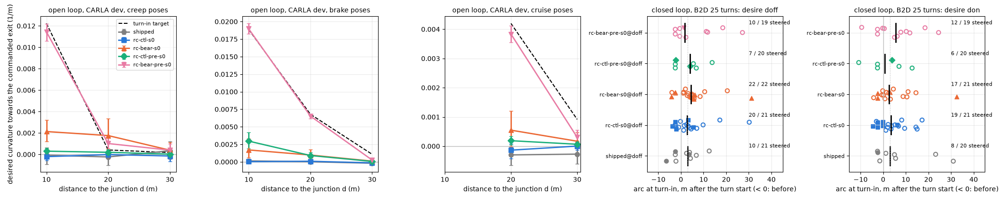

**看什么**：左三格 = 开环入弯曲率按轮廓和距离（虚线为目标），粉色 rc-bear-pre 贴目标，其他臂贴 0；右两格 = 闭环入弯弧长（desire 关 / 开，实心 = 走对）：点不比其他臂更早且更少（10 / 19 steered）。

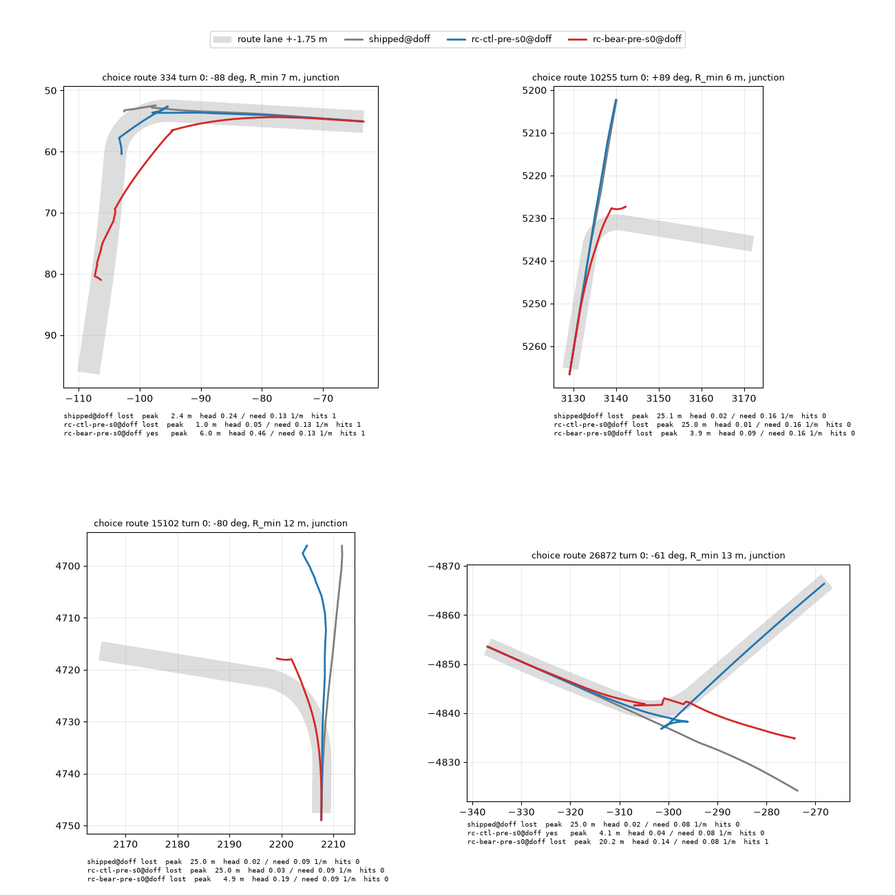

**看什么**（主设置 desire 关）：四个 choice 转弯，shipped 灰 / rc-ctl-pre 蓝 / rc-bear-pre 红。334：红色左转成功，其余在拐角停住；15102 / 10255：红色停下后才在拐角前开始转，蓝灰直行或原地不动。desire 开版本 [pre_b2d_turn_panels_don.png](../experiments/op_route_ft/figs/pre_b2d_turn_panels_don.png)。

## 第 130 条　action 曲率「约 0.45」是目标选错（结论，慢速急弯一格待定）

**问题**：用户怀疑控制器有问题；120、128、129 与 DAgger pilot 都看到 action ≈ 0.45 × 实际曲率。是解码、车侧控制器，还是比较的目标。
**设置**：对照 openpilot 源码（ec95db3f / opendbc 35f7e081）逐项核对；comma1M 32 窗 6 348 帧（原生 comma 相机）、WOD / navtrain 教师数据、B2D drive 臂路线转向 tick 上的校准增益。结果 [action_scale.md](../experiments/op_closed_loop/results/action_scale.md)。g_cal = 1 / (实测对解码的斜率)，校准意义的增益；g_reg 是解码对实测的斜率，被预测噪声压低。

| 子集 | g_cal [95% CI] |
|---|---|
| comma1M v > 8 一般弯 / 急弯 | 1.04 [0.95, 1.09] / 0.97 [0.94, 1.04] |
| comma1M 3–8 m/s 急弯（人开的路口，7 窗） | **0.65 [0.59, 0.87]**（plan 推出的曲率 0.98） |
| comma1M 全部 v > 3 | 0.68 [0.61, 0.92] |
| WOD 1 s pure pursuit 目标 / 瞬时 t + 0.275 / 用模型自估速度解码 | 0.46 / 0.71 / **0.96 [0.90, 1.02]** |
| navtrain 同三行 | 0.60 / 0.60 / **1.10 [1.06, 1.14]** |

结论：(a) 解码与 modeld 逐项一致（`action[0,0] / max(1, v)²`，无缩放）；(c) 三种车侧控制器有效增益 1；(b) 0.45 来自 1 s pure pursuit 目标、回归方向、开环榜相机高度造成的速度低估（模型自估 / 真实 WOD 0.92、navtrain 0.81；B2D 1.433 m 0.95、对齐相机 0.87 → 曲率 ×0.76）。修正目标：`action[0] = kappa_inst(t + 0.275 s) * max(1, v_model)²`，增益 1。真实缺口收缩为：慢速急弯约 0.65 + 对齐相机速度低估。
**状态**：结论；慢速急弯 0.65 待定（n = 7 窗；没有带 action 的真车 rlog，车侧增益 1 来自源码）。

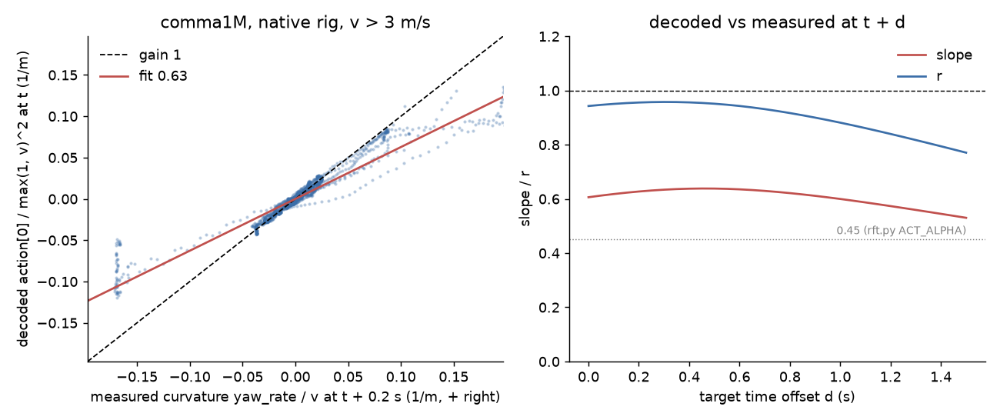

**看什么**：左 = comma1M 解码曲率对实测曲率，点贴着增益 1 虚线直到 |k| ≈ 0.05 1/m（R > 20 m），只在慢速急弯（|k| > 0.1，3–8 m/s 路口）落到线下，把合并拟合拉到 0.63；右 = 池化斜率与 r 对时间偏移，r 峰在 0.25–0.3 s，即模型自己的 action_t 0.275 s。

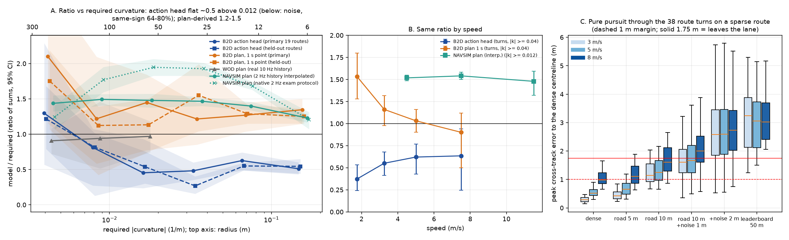

**看什么**（第 120 条的旧标定图，作对照）：A = 比值对所需曲率，B = 比值对速度，C = pure pursuit 在稀疏路线转弯上的结果。用来对照「约一半」是线性增益而不是越急越欠转。

## 第 131 条　WOD 夜间确实更差，中等幅度（中）

**问题**：shipped openpilot 在夜间是否崩溃；另一会话列的四个「夜间崩溃」数字是否可引用。
**设置**：WOD val 1 437 帧（479 序列）已有预测，CPU 复算。夜间 = 序列平均亮度 luma < 50（132 序列 / 397 帧，28%），白天 luma ≥ 120（326 / 977 帧）；序列聚类 bootstrap，速度 × 转弯匹配。结果 [night_gap.md](../experiments/leaderboard_audit/results/night_gap.md)。

| 指标 (夜 − 昼) | 匹配后差 [95% CI] |
|---|---|
| ADE@3s (1.31 对 0.92 m) | **+0.43 [+0.28, +0.61]**（≈ +46%） |
| FDE@3s | +0.67 [+0.35, +1.04] |
| RFS (7.61 对 8.10) | −0.39 [−0.83, +0.05] |
| 只用自车历史的匀弧基线 ADE@3s | −0.08 [−0.25, +0.09] |
| openpilot 减基线 | +0.51 [+0.30, +0.74]；9 个够样本场景簇全部夜间更差 |

亮度阈值 35 / 50 / 65 结果一致（+0.50 / +0.43 / +0.43）。nuScenes 夜间（15 场景）无差（−0.06 [−0.44, +0.34]），但夜景比 WOD 亮得多，不能互证。四个「崩溃」数字没有一个是 openpilot 夜间测量：「Spotlight 6.93」是训练出的打分头的 RFS，Spotlight 是 WOD-E2E 场景簇（val 里没有）；CARLA 夜间行人召回 0.27 与 nuScenes 0.063 是 SAM 3.1 检测器，前者渲染早于第 60 条路灯修复，后者是 16 个里 1 个。
**状态**：待定（中）；亮度标签、黄昏未判、只有开环；CARLA / B2D 夜间 openpilot 未测。

**看什么**：左 = 同 1 437 帧的昼夜 ADE@3s（openpilot 0.92 → 1.31，匀弧基线 1.33 → 1.25）；中 = 匹配后的夜昼差：WOD 上 openpilot 的 CI 排除 0（蓝），基线贴 0（灰），nuScenes 上 openpilot 无差而基线夜间更差；右 = RFS 差，openpilot 的 CI 贴零。重点是基线没有夜间差而 openpilot 有，即模型差距而非场景更难。

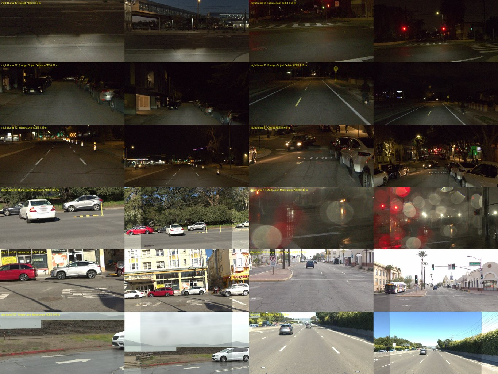

**看什么**：夜 / 黄昏 / 昼目标帧的 road（左）与 wide（右）模型输入。6 个夜间帧都是真夜；两个黄昏帧一个是阴天白天（luma 98）、一个是雨夜（luma 71），说明黄昏 bin 是混合的。

## 第 132 条　重投影 rollout 上的 DAgger 一轮（中偏弱）

**问题**：在重投影引擎里用 shipped 自己闭环走出的访问状态训一轮，能否教会偏离修回并缓解起步（预登记线 L1 起步增益 ≤ 0.5×、L2 修回、L3 不伤）。
**设置**：13 779 个访问状态，标签 = 回到日志路径的恢复路径，400 步得 dg1；对照 st1 同状态同标签但历史是脚本化漂移；dg2 第二轮。WOD val 120 留出片段（起步 40、行驶 80），片段簇 bootstrap；HUGSIM 11 场景 spec。结果 [pilot.md](../experiments/op_dagger/results/pilot.md)。

| 读数 | shipped | dg1 | st1 | dg2 | 线 |
|---|---|---|---|---|---|
| G1 起步 yaw 增益 (deg/deg) | 16.50 | 10.46 [9.59, 11.33] | 16.25 | 10.02 | ≤ 8.25，**不过** |
| S10 行驶偏移保留 (2 s) | 0.933 | **0.243** [0.154, 0.329] | 0.756 | 0.240 | dg1 − shipped −0.690 [−0.754, −0.627]，过 |
| K10 朝向 kick (行驶) | 0.31 | −0.01 | 0.12 | −0.02 | |
| free \|dy\| 2 s | 0.081 | 0.089 | 0.091 | 0.087 | +0.008 [−0.004, +0.021]，过 |
| gk1 action 曲率增益 (起步 / 行驶) | −3.97 / +0.52 | +3.24 / +4.46 | −21.5 / −1.65 | | 符号翻转，**异常** |

dg1 − st1：S10 −0.513 [−0.574, −0.455]，所以修回主要来自闭环历史本身而不是标签。HUGSIM 11 场景：0 打转（过）、stuck 6 → 4、完成 3 对 3、HD 0.532 对 0.544（−0.012 [−0.20, +0.19]），但曲率抖动 8/11 场景高于 shipped，早期碰撞 4 对 2（053、3000_3200、034）与 gk1 过校正一致。
**状态**：待定（中偏弱）；单 seed 单轮，HUGSIM 11 场景，L1/L2 是重投影引擎内读数。定为合并版本之后的最后一阶段，并对 gk1 加约束。

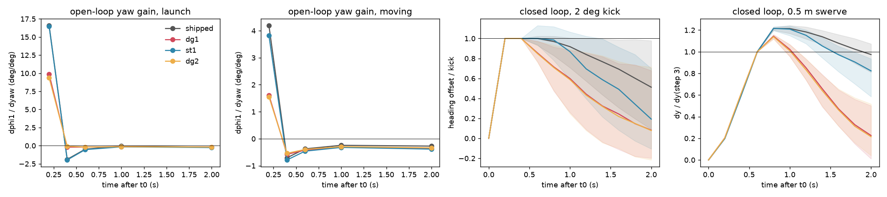

**看什么**：左两格 = 起步 / 行驶的开环逐步 yaw 增益，dg1 / dg2 压低 step 1，st1 不压；右两格 = 闭环 2° kick 与 0.5 m swerve，dg1 / dg2 在 2 s 内回正，shipped 与 st1 没有。

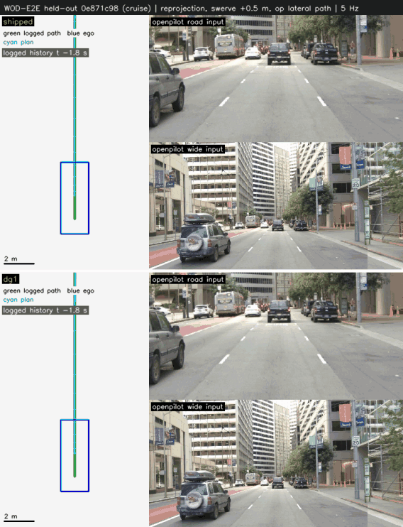

**看什么**：同一留出片段（clip 87，cruise）被推偏 0.5 m，上 shipped、下 dg1，输入帧是日志帧重投影到偏离位姿。+2 s 时 shipped 停在 +0.53 m，dg1 回到 +0.18 m；同时看 dg1 方向有无过冲（gk1）。该片段取 shipped − dg1 偏移差最接近中位数（0.34 m）的一个。

## 第 133 条　B2D 改用 plan 跟踪 P7，路口一个也转不过去（中）

**问题**：执行层是不是问题（WOD 按 plan 打分高，闭环执行 action）。
**设置**：127 的 25 转弯，spec 1.86 m，zones 关，desire 关；shipped / rc-ctl / rc-bear / rc-poly × 执行层 curv / p7 / hyb（hyb 仅 shipped）。结果 [plan_track.md](../experiments/op_route_ft/results/plan_track.md)，符号核查 [p7_sign_check.md](../experiments/op_route_ft/results/p7_sign_check.md)。

| 执行层 | 走对 (of 25) | 前 20 s 偏离路线 > 3 m (of 20 路线) | 路线 DS 配对 p7 − curv |
|---|---|---|---|
| p7 | 0 (shipped, rc-ctl, rc-poly) / 1 (rc-bear，是打转碰巧经过出口) | 12–16 | −16.6 到 −29.6 |
| hyb (3 m/s 切 plan) | 0 | 10 | DS 13.1 对 30.4 |
| curv | 3–7 | 2–5 | |

p7 下之后原地小圈蠕行（窗口速度中位 0，停 61–73%），只有 5–15 个转弯能进到路口（curv 21–22）。rc-bear − rc-ctl +0.04 [+0.00, +0.13]：没有臂以可比状态到达路口，指令在 p7 下不可读。
**符号 / 坐标系核查（第 5 点）**：全部 d133 日志里 plan 1 s 横向偏向与随后 1 s 偏航率同号，p7 池化 0.967（n 32 066 帧，Pearson 0.83），curv 对照 0.964；合成左 / 右弧走完整执行链在左手系 CARLA 运动学模型上转向正确，三处符号翻转各被下游接住（`tests/test_p7_sign.py`，5 个测试）。p7 下 0.3–1.5 m/s 时 plan 自身曲率中位 0.214 1/m（同速 curv 臂 plan 0.031），实测曲率 0.188，实测 R < 10 m 占 79%：车在忠实地跟一个 R ≈ 5 m 的 plan。另一缺陷：p7 帧里 31% plan 总长 < 0.5 m，`place()` 外推最后一段，起步前瞄准方向与模型意图无关（Pearson 0.03），不是打转主因，不修。
**状态**：结论（中）；单 seed；P7 增益、4 m/s 起步、rejoin 速度调节属 harness，起步失稳可能部分来自它们。执行层定 curv。

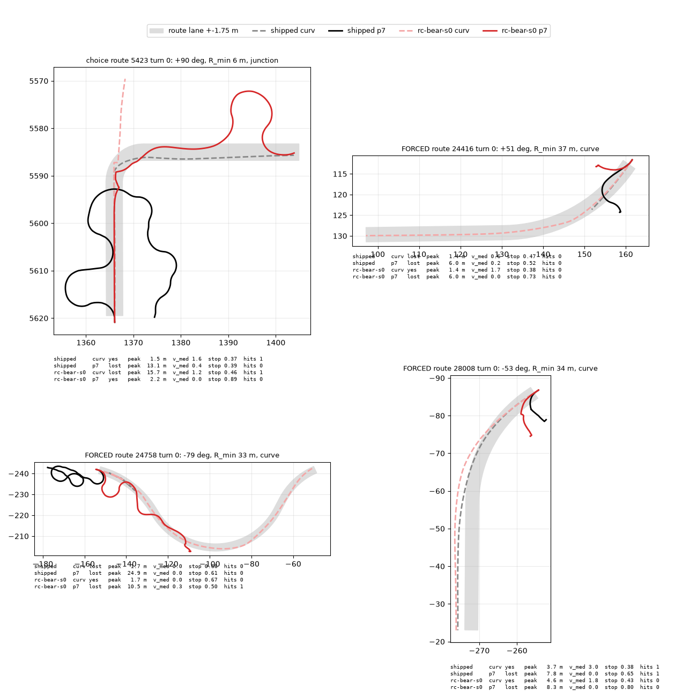

**看什么**：BEV，curv 虚线 / p7 实线，shipped 与 rc-bear，选的是两种执行层结果不同的转弯：p7 的黑 / 红实线在路线附近绕圈，curv 虚线直接走向路口。

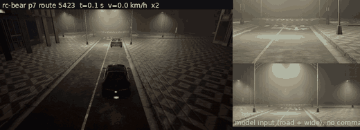

**看什么**：rc-bear p7，5423 turn 0：车在到路口前已经绕圈，最后因为打转碰巧经过出口 5 m 内才算「走对」。此 GIF 不画 plan，所以「plan 左、车右」的读法不能从它直接得到（见符号核查）。

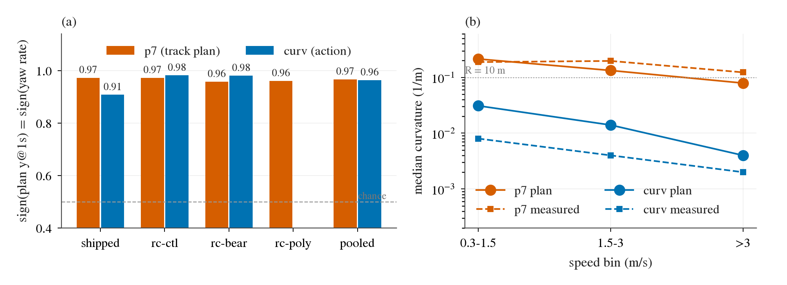

**看什么**（新图，由 `p7_sign_check.json` 画，脚本 `experiments/op_route_ft/scripts/p7_sign_fig.py`）：(a) 每个臂 / 执行层 plan 横向偏向与偏航率同号的比例，p7 与 curv 都在 0.91–0.98，若有符号 bug 应在 p7 附近 0 而 curv 附近 1。(b) 池化中位曲率按速度分箱（对数轴），p7 的 plan（橙实线）在 0.3–1.5 m/s 为 0.214，高出 curv 的 plan（蓝实线）约 7 倍，实测（虚线）几乎贴着各自的 plan：车跟着 plan 走，问题在 plan 本身的曲率。各点 n 为自相关的 20 Hz 帧，n 高估独立证据。

## 第 134 条　近距离低速入弯样本 rc-bear-near（中偏弱）

**问题**：对 129 的可能修法：在 0–10 m、0–3 m/s 的 CARLA 位姿上给入弯曲率监督（目标用 130 修正版），能否让闭环转起来、是否进合并训练。
**设置**：新渲 4000 位姿、914 路口（不含 B2D 的 172 个）；接近 2681、弯中 1319，每批 16 个 CARLA 行换入 6 个。400 步 pilot，对照 rc-bear-fix（rc-bear + 新目标，无近距行）。闭环：25 转弯中预选 9 个（rc-bear 晚入弯、forced 晚入 / 慢爬、以及 rc-bear 走对的两个），desire 关、zones 关、curv。结果 [near.md](../experiments/op_route_ft/results/near.md)。

| 开环 | pilot-fix | pilot-near |
|---|---|---|
| 真实接近行增益 nav / wod | 0.97 / 0.70 | 0.99 / 0.73 |
| 近距 dev 0–3 m 增益 | 0.07 | **0.19** |
| 近距接近行 plan 出口走对 | 0.60 | **0.94** |
| 左右指令差 (1/m) | 0.0023 | 0.0098 |
| 负样本 CARLA N1 / WOD (线 0.3 m) | 0.62 / 0.23 | **0.73 / 0.34** |

闭环 9 转弯走对：shipped 2、rc-ctl 2、rc-bear（4000 步旧目标）2、**pilot-fix 0、pilot-near 0**。两个 pilot 退回「不选」（8 个进入里 6 个）。预登记规则（near − fix ≥ +2 才加）判「不加」。
**状态**：待定（中偏弱）。400 步不是合并配方，4000 步 rc-bear-fix 没跑，pilot-bear（旧目标，400 步）闭环也没跑，所以 0/9 分不清是步数不够还是新目标本身。本条没有专属图（结果为表）；闭环转弯行为的画面参见 128 / 129 节面板。

## 第 135 条　加宽视场 zero-shot 不帮 shipped Cinque 转弯（结论，弱）

**问题**：用户观察 90° 直角弯时 wide 输入只有 58.7° 看不到左边；把 wide 视场加宽（如 Alpamayo 那样）是否改善转弯。
**设置**：comma1M（openpilot 自己相机，wide 传感器约 119°，原生高度）；42 转弯 + 75 直路冻结为 `comma1m/fov-pilot@v1` / `fov-full@v1`，pilot 8 转弯（67–181°，3.8–8.2 m/s）+ 4 直路。臂 N（58.7°）、W90、W116（整幅传感器）、W90h（只横向加宽）、R40（road 相机加宽到 39°）；只改模型帧焦距，地平线行不动。预登记早停规则已触发。结果 [pilot.md](../experiments/op_fov/results/pilot.md)。

| 臂 − N | ΔA_act | Δ lead (s) | ΔA_plan | 直路 plan 速度比 | 直路 ADE 比 |
|---|---|---|---|---|---|
| W90 | −0.005 [−0.022, +0.015] | −0.15 [−0.31, −0.02] | −0.010 | 1.001 | 1.00 |
| W116 | −0.033 [−0.071, +0.010] | −0.23 [−0.39, −0.07] | −0.012 | 1.007 | 1.11 [0.91, 1.41] |
| W90h | −0.032 [−0.056, −0.010] | −0.19 [−0.33, −0.06] | −0.019 | 1.000 | 1.02 |
| R40 | −0.032 [−0.067, +0.004] | −0.03 [−0.16, +0.08] | **−0.151** | **1.224** | **8.66 [4.10, 13.2]** |
| Wfrz（事后：wide 冻结在 6 s 前） | −0.035 [−0.067, −0.007] | −0.22 [−0.51, +0.02] | −0.006 | 1.004 | 1.09 |

shipped 在这些真实转弯上本来基本转够（A_act 0.889，181° 掉头一个 0.59；A_plan 1.04；lead +0.16 s）。诊断（非预登记）：wide 冻结看不到弯时 A_act 只变 −0.035，与任何视场改动同量级：真实转弯里转向来自 road 相机。R40 改 road 焦距（910 → 720）破坏尺度，与第 104 条相机高度同机制。B2D 急弯另有接口上限：28180 所需峰值曲率 0.213 > `MAX_CURVATURE` 0.2（`lib/op_ctrl.py`，已核对常量为 0.2），但 head 只给 0.023，上限现在不起作用。
**状态**：结论（弱）：pilot n = 8、仅开环、仅 comma1M（shipped 本来转够，没在欠转场景测）。**会推翻**：shipped 欠转的真实急弯子集上加宽 wide 后 A_act ≥ +0.10，或闭环路口走对数上升。

**看什么**：一个 71° 左转，转弯前 1 s 与转弯中 2 s，行 = 臂，列 = road / wide 模型输入（绿线 = 地平线行，所有臂都在 151.8 行）。N 的 wide 只露出一点路口，W90 / W90h 露出整个路口，W116 到镜头像圆边缘（暗角环、右边缘有车壳），R40 的 road 帧更宽且下部来自 wide 相机（右下有拼缝）。

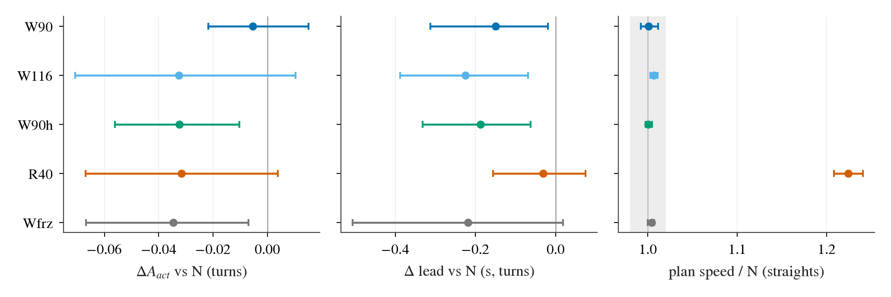

**看什么**（新图，由 `pilot_table.csv` / `pilot_frz_table.csv` 画，脚本 `experiments/op_fov/scripts/fov_effects_fig.py`；CI = 段簇 bootstrap）：左 = ΔA_act，三个加宽臂都 ≤ 0 且 W90 跨 0，没有任何臂出现 +0.10 量级的正效应；Wfrz（冻结 wide）与加宽臂同量级，说明 wide 内容几乎不影响转向。中 = 提前量 Δ lead，加宽臂都略晚。右 = 直路 plan 速度比，只有 R40 离开 1，对应尺度破坏。

---

## 总表

| 条 | 主张 | 强度 | 状态 | 会推翻 | 未决 |
|---|---|---|---|---|---|
| 125 | nz 下 1.22 m 转弯走对 5/7 对 1.433 m 0/7 | 弱 (n = 6) | 待定，被 127 更正 | 已被 127 的 25 转弯覆盖 | 无；125 文本没写指向 127 |
| 126 | nored 抬高第 102 条 drive 2.1 DS（起作用的 3 个 5.6），3 次闯红灯被藏 | 强（确定性对照） | 结论 | 无 | 74 / 82 的绝对读数未逐条重标，只说了受影响 |
| 127 | 对齐相机 nz choice 0/13、forced 1/12；1.22 m 是甩过去 | 中 | 待定 | 微调后同 25 转弯走对率；第二个 seed | 单 seed；1.22 m 几格缺 4 条路线 |
| 128 | 微调涨幅来自微调本身，adapter 无增量；剩余失败是太晚 + 低速停车 | 中偏弱 | 待定（目标已被 130 更正） | 修正目标 4000 步重测；翻转 / 随机指令对照 | 侧向信息来源；停车的纵向归因 |
| 129 | 提前转向监督开环学会、闭环变差；嫌疑 a 不成立 | 中偏弱 | 待定（目标已被 130 更正） | 保留日志目标的 CARLA 提前转向臂 | 合成斜坡覆盖真人提前转向的诊断是开环增益，非闭环 |
| 130 | 0.45 是目标选错；解码与控制器无误 | 强（源码 + 真实日志）；慢速急弯 0.65 中弱 | 结论 / 一格待定 | 带 action 的真车 rlog 显示车侧增益 ≠ 1；慢速急弯复测 | 修正目标用 v_model，在 B2D spec 相机上执行曲率仍 ×0.76 |
| 131 | WOD 夜间 ADE@3s +0.43 m，模型差距非场景更难 | 中 | 待定 | 亮度标签之外的混杂（雨 / 眩光）；时间标注数据 | RFS 差贴零；CARLA / B2D 夜间未测 |
| 132 | 重投影 DAgger 教会偏离修回，起步 0.63 倍不过，gk1 翻号 | 中偏弱 | 待定 | 合并模型自己 rollout 上第二轮；多 seed | gk1 过校正与 HUGSIM 抖动 / 早期碰撞 |
| 133 | P7 跟 plan 在 B2D 起步即失控，执行层定 curv；无符号 bug | 中 | 结论 | 稳定车速入弯段的 plan 执行对照（暂不做） | 低速 plan 自身 R≈5 m 的来源；起步外推缺陷未修 |
| 134 | 近距低速样本闭环无收益，合并不加 | 中偏弱 | 待定 | 合并训练里加 / 不加近距集合的消融 | 4000 步修正臂未跑；9 转弯是预选 |
| 135 | 加宽 wide 视场 zero-shot 无用，改 road 焦距破坏尺度 | 弱 (n = 8，早停) | 结论 | 欠转子集 A_act ≥ +0.10 或闭环路口走对数升 | 只开环；没在 shipped 欠转场景测 |

## 核对时发现

以下是 decision 文本与结果文件之间的差异或口径问题，按重要性排序，均未改 decision。

1. **第 129 条混用 desire 开 / 关**：pre.md 声明主设置是 desire 关，但第 3 点「入弯中位推后到转弯起点后 5.6 m（rc-bear 2.5 m）」「峰值降到所需的 0.81 倍（rc-bear 1.34）」是 desire 开的行；desire 关行是 1.7 m（对 rc-bear 4.5 m，反而更早）和 0.70（对 2.27）。「入弯推后」这一说法只在 desire 开成立。
2. **第 129 条配对范围写窄**：「对未改动的臂配对 −0.16 至 −0.20」略去了 rc-ctl-pre − rc-ctl 在 desire 关下的 −0.08 [−0.24, +0.08]（CI 含 0）；CI 排除 0 的只有 desire 开的 −0.20 [−0.39, −0.04]。
3. **第 129 条第 5 点漏报一个护栏失败**：pre.md 里 b2d_turns 窗口碰撞 6 对 5 也是 FAIL（新增），decision 只说 navhard −0.47 与早转 −0.23 不过。
4. **第 128 条急弯分母混用**：「急弯（R < 10 m）rc-bear 0/11，rc-poly、rc-ctl 各 2/6」中 2/6 是 R < 7 m（6 个转弯），R < 10 m 是 11 个转弯：rc-ctl 3/11、rc-poly 2/11（report.md）。
5. **第 128 条「对方向的含义」段已过时**：仍把嫌疑 (b)（desire 带侧向信息）列为活嫌疑，而同条第 8 点已判不成立；另外第 5 点 shipped 朝指令侧打方向「4/11」与第 8 点「3/11」是 split 与 desire_off 两套判据（后者多一条「高于反侧峰值」），未在文中标明。
6. **第 128 条第 7 点两个百分比口径不同**：「停车时间 70–90% 是 plan 自己要停」按 +3 s plan 速度归因，crawl.md 另一处按仲裁绑定源计，shipped 停车 tick 中 plan 约 1176 / 2340（≈ 50%），其余是 lead、base、latch。两种口径都在结果文件里，decision 只引前者。
7. **第 133 条两处数字口径**：「79% 帧 R < 10 m」是**实测**曲率（p7_sign_check.md 表头 `p7 share R < 10 m (measured)`），文中紧接 plan 曲率写，容易读成 plan 的；「停车时 31% 帧 plan 总长 < 0.5 m」在 md 里是 p7 帧总体的 31%，不限停车（shipped 单臂 json 里该分箱占 42%）。另 plan_track.md 注明 rc-poly 的 curv 对照行是 desire **开**的 guard 单元，配对混了 desire，decision 未提。
8. **第 130 条「增益 1」的两处限定**：(i) comma1M 全部 v > 3 m/s 的池化 g_cal 是 0.68 [0.61, 0.92]，decision 只引 v > 8 的 1.04 / 0.97 与 3–8 m/s 急弯 0.65，读者会以为只有慢速急弯偏低；(ii) 修正目标用 `max(1, v_model)²`，而解码用真速度，所以在 B2D spec 相机上执行曲率仍 ×0.76（near.md Doubts 已承认），「增益 1」是目标定义的增益而不是闭环执行增益；decision 的「由微调吸收」不会自动成立，因为目标写在 v_model 单位里。
9. **第 125 条无指向第 127 条的更正**：125 文本末尾保留「5/7 对 0/7」「第 121 / 122 条可能部分是相机造成」，只有同日更正段处理了 rig，没标注 127 已撤回降级；读 125 单条会得到错误方向。127 的「1.22 m 两臂各缺一个分片」在 junction_rig122.md 里是「末两个 1.22 m 分片被停掉、缺 4 条路线（16 / 20）」。
10. **第 134 条的 9 转弯是预选的**：选的是 rc-bear 晚入弯 / 慢爬的转弯加 rc-bear 走对的两个，所以对 rc-bear 4000 步的 2/9 与 shipped 2/9 的比较有选择效应；pilot（400 步）对 rc-bear（4000 步）的比较步数不同。decision 的「限定」写了步数，没写预选。
11. **第 135 条小项**：W90h 与 Wfrz 的 ΔA_act 95% CI 排除 0（−0.032 [−0.056, −0.010]、−0.035 [−0.067, −0.007]），W116 转弯 FDE3 +0.32 CI 排除 0，W116 直路 ADE 比 1.11 [0.91, 1.41]。decision 写「不变或略降」「护栏都过」与这些并不矛盾，但「护栏过」对 W116 直路 ADE 是宽区间。状态标「结论」而 n = 8 早停，已同条标弱。
12. **第 132 条日期**：pilot.md 状态写 2026-10-05 final，而它说训练前已按第 130 条（2026-10-06）重标 action 目标；日期之一应有笔误，不影响数字。

未发现数字错误：第 125、126、127、131、132、134 条所引数字与结果文件逐项一致（抽查表格全部匹配）。
