# 用同一个 ControlNet 生成配对的两边：真实片段上的行人移除 / 插入 pilot

状态：**待用户审阅**（片段 2026-09-29 早上齐）。按用户 2026-09-28 深夜改过的 brief，这一轮不跑自动检查套件（检测器、次要物体、seed 噪声地板、pale-flat），由用户直接看片段判断；看完之后再写 [decisions.md](decisions.md) 的条目。
相关：[decisions.md](decisions.md) 第 44 条「P3 真实外观行人考卷」一节（3DGS 插入 / 删除路线已停）；[P3 复核表](p3-review-sheet.md)（这里用的 19 个场景就是它的行人删除页）；Cosmos v2 pilot（[todo](../todos/2026-09-28-cosmos-pilot.md)，在 CARLA 片段上，另一条线，这里只读用它的推理脚本）。

## 为什么

行人考卷需要成对的真实感片段：x⁺ 里有目标行人，x⁻ 里没有，别的都一样；openpilot 一类模型按「对这个行人有没有反应」打分。
上一条路是用 3DGS（OmniRe，把一段真实 log 重建成可编辑的 Gaussian 场景）只编辑一边，用户看完复核表后否掉了：插入的行人是静止的供体平移进来、带着发光的光晕；删车留下涂抹或删不掉；删人还会连带扰动旁边的行人。
这样模型的反应分不清是对行人还是对编辑痕迹，训练时还可能记住痕迹。

用户的提议（这里测的就是它）：两边都用同一个 ControlNet 式视频生成器，从**同一段真实片段的控制信号**生成。x⁺ 的控制里保留目标行人，x⁻ 的控制里把它去掉，同 prompt、同 seed。
生成器的痕迹在两边对称出现，两边唯一的差别就只剩那个行人。

## 做法

生成器是 Cosmos-Transfer2.5-2B（NVIDIA 的视频 ControlNet：按逐帧的结构信号，即「控制」，生成真实感视频；box 上 `models/cosmos/Cosmos-Transfer2.5-2B`）。
推理用 Cosmos v2 pilot 的 `scripts/cosmos_infer.py`（只读导入，日志改写到本线自己的目录），本线代码在 `jevdrive/cn_pair.py`、`scripts/cn_pair.sh`、`scripts/cn_pair_infer.py`，run dir 是 box 上 `$DATA_DIR/runs/cn_pair/`。

### 片段

19 个场景 = [P3 复核表](p3-review-sheet.md)里的 19 道行人删除题（p3_000–p3_018），每个场景一个登记过的目标行人（`target_track`）。
画面直接取 WOD 原始前相机（drivestudio 预处理后的 `processed/waymo_ds`，不经过 3DGS）：10 Hz 连续 93 帧（Cosmos 一次生成的长度，9.3 s），1920 × 1280 裁掉上下各一条（行 150–1206）成 16:9，缩到 1280 × 704。
窗口在整段 log 里选「目标行人投影高度 ≥ 20 px 的帧最多」的 93 帧，并列时靠近 P3 的锚点帧。

### 目标行人的掩膜和移除区域

目标行人的 3-D 框按相机内外参（含畸变）投影到每一帧；YOLO26x-seg（COCO person，imgsz 1280，conf ≥ 0.15）的实例掩膜与投影框匹配（IoU ≥ 0.3，或检测框大部分落在投影框里），匹配上就用这个像素掩膜，匹配不上就退回投影框的凸包。
移除区域 = 像素掩膜膨胀 10 px（凸包则膨胀 4 px）。每个场景用了多少帧 YOLO、多少帧凸包写在各自的信息表里；凸包帧多的场景（p3_001、p3_006、p3_017）移除区域是一块方框，比人本身大。

### 移除区域内的控制怎么补

x⁻ 的控制在区域外与 x⁺ 逐像素相同，只改区域内。区域内先用 LaMa（big-lama，单帧图像 inpainting）在真实帧上把人抹掉，得到 clean plate（没有这个人的背景猜测），再从 clean plate 上算这一块的控制：

- **edge**：Canny（阈值 100 / 200，与 Cosmos 自带的 medium 档相同）。x⁺ = 真实帧的 Canny；x⁻ = 区域外同 x⁺、区域内换成 clean plate 的 Canny，路缘、车道线这类穿过人身后的线能接上。
- **vis**（base 模型才有）：Cosmos 对输入视频现算的强模糊图，x⁺ 的输入是真实视频，x⁻ 的输入是 clean plate 视频（区域外逐像素相同）。
- 对照 **Ed**：x⁻ 区域内的边直接清空、不补。

seg 和 depth 控制这一轮没有进生成：Cosmos v2 在 CARLA 上已经看到随机着色的 seg 会把远处行人画成路牌、base 模型每个 clip 十几到几十分钟；时间只够在一个场景上测 base，就选了更贴近真实颜色的 vis。depth（DA3-metric）只用来给插入的行人做遮挡。

### 插入：行走的行人从哪来

行走必须来自控制序列本身，不能是静止的人被平移。来源是 Cosmos v1 pilot 的 CARLA 片段 `27515-s0`（PedestrianCrossing，自车停着，行人横穿画面、全身可见）里的 0 号行人：取它不与其他行人重叠的 33 个 20 Hz tick，按脚底对齐后找步态周期（19 tick，0.95 s），循环使用。
路径：自车最后一帧前方 6 m 处取一个过街点，放到附近自车位姿给出的路面平面上；行人 1.5 m/s 从右侧（离车道中心 7.5 m 起）横穿，第 80 帧走到车道中心，所以片段结束时它在自车前方、车道里。
每帧按脚点和头顶（身高 1.75 m）的投影缩放 CARLA 行人的轮廓和 RGB，被 clean plate 上 DA3-metric 深度更近的东西（停着的车、杆子）挡住的部分不画。
插入对的 x⁻ 就是移除对的 x⁻（同 prompt、同 seed、同控制），x⁺ 的控制 = x⁻ 的边缘图上叠加这个行人的 Canny（行人轮廓以内原来的边去掉）；vis 版则是把行人的 CARLA 像素贴进 clean plate 再模糊。

### 设置（arm）一览

| arm | 模型 | 控制 | x⁺ 与 x⁻ 的关系 | 场景 |
|:--|:--|:--|:--|:--|
| **E**（主设置） | Edge Distilled（4 步蒸馏） | edge 1.0 | 各自独立生成，同 prompt、同 seed 2025 | 全部 19 |
| Ed | 同 E | edge 1.0，x⁻ 区域内不补边 | 同 E | p3_000 |
| EG | 同 E | 同 E | x⁻ = E 的 x⁻；x⁺ 区域外的 latent 每一步钉在 x⁻ 上，再羽化贴回（区域外逐像素相同） | p3_000 |
| BV | base（35 步，CFG 3） | edge 1.0 + vis 0.5 | 各自独立生成 | p3_000 |
| **EI**（插入主设置） | 同 E | edge 1.0，x⁺ 加 CARLA 行人 | x⁻ = E 的 x⁻ | 全部 19 |
| EIG | 同 E | 同 EI | x⁺ 锚定在 E 的 x⁻ 上 | p3_000、003、009、015 |
| BVI | 同 BV | 同 EI + vis | x⁻ = BV 的 x⁻ | p3_000 |

prompt 两边相同，按 WOD 的 location / time of day / weather 填一句「车顶相机、镜头在车外、路面一直到画面底边」的街景描述，不提行人；base 模型另带 negative prompt（车内、挡风玻璃、白色人偶、卡通感等）。guardrail 关。

## p3_000 上的观察

- E 的两边都很真实，x⁻ 里目标已去掉，旁边的非目标行人两边一致；区域外 x⁺ / x⁻ 平均像素差 1.5–2.5（0–255）。
- **Ed（区域内不给边）更差**：x⁻ 在原来人的位置长出一个偏红的模糊「鬼影」人形；所以区域内用 clean plate 的边补（E）是选定的做法。
- **颜色漂移**：distilled 只有 edge、没有外观输入，布局跟真实片段一致，但颜色会变（例：红白相间的公交车被画成白 / 灰色，楼的颜色也变了）。针对它排了 BV / BVI（base + vis 控制，vis 带真实颜色），只在 p3_000 上，因为 base 每 clip 估计 30–60 min。
- EG 区域外逐像素等于 x⁻（按构造），代价是两边不再对称生成。

## 成本

每 clip 的生成秒数（x⁺、x⁻ 分别独立计时；EI/EIG(b)/BVI 的 x⁻ 与移除对共用，不重算）；GPU 2 与 GIMM 插帧 8 个进程共享同一张卡，实测约为独占卡的 2.2 倍（E 在独占卡上 Cosmos v2 测过约 91 s / clip，这里 E 的 x⁺ 均值 138 s、x⁻ 均值 135 s，比值约 1.5，低于 2.2 是因为 GIMM 那几个进程不总是占满）：

| arm | 场景数 | x⁺ 均值 | x⁻ 均值 | 合计 GPU·h（共享卡） |
|:--|--:|--:|--:|--:|
| E | 19 | 138 s | 135 s | 1.44 |
| Ed | 1 | 234 s | 190 s | 0.12 |
| EG(b) | 1 | 121 s | 共用 E 的 x⁻ | 0.03 |
| BV | 1 | 1348 s | 1302 s | 0.74 |
| EI | 19 | 150 s | 共用 E 的 x⁻ | 0.79 |
| EIG(b) | 4 | 112 s | 共用 E 的 x⁻ | 0.12 |
| BVI | 1 | 1341 s | 共用 BV 的 x⁻ | 0.37 |

合计约 3.6 GPU·h（共享卡计时），折合独占卡约 1.6 GPU·h。base（BV/BVI）单个 clip 22–23 min，比 distilled（E/EI，约 2.5 min）贵一个数量级，这也是 base 只在 p3_000 一个场景上测的原因。

## 没做 / 已知问题

- 自动检查（检测器、次要物体、seed 噪声地板、pale-flat）按用户 2026-09-28 深夜改过的 brief 没跑；由用户明早直接看片段判断，判断后再写 decisions.md。
- seg、depth 控制没进生成（理由见「做法」一节）；depth（DA3-metric）只用来给插入的行人做遮挡。
- WOD 是 10 Hz，喂给的是按 16 fps 训练的模型（Cosmos-Transfer2.5），帧率不匹配没有专门处理。
- 凸包帧多的场景（p3_001、p3_006、p3_017）移除区域是一块方框，比人本身大。
- 插入行人的外观来自 CARLA `27515-s0` 的 0 号行人，只用了它的边缘（Canny）和步态，颜色/纹理由生成器自己画。
- 插入对的 x⁻ 与移除对的 x⁻ 是同一份数据（同 prompt、同 seed、同控制），没有重新生成。
- **新发现（这一轮巡视时看到）**：E 臂 19 个场景里有 8 个（p3_004、005、007、008、010、013、014、018）在画面底边中央出现一个小的、偏黑的类似后视镜 / 仪表台支架的色块，真实帧里没有，x⁺ 和 x⁻ 两边基本对称出现（EI 因为 x⁻ 复用 E 的 x⁻，也带着这个色块；EI 的 x⁺ 是否出现不一定，见审阅区对应片段）。negative prompt 里已经写了「车内、挡风玻璃」但没压住。色块只占底边一小条、不遮挡目标区域，两边对称所以不影响「哪边有人」的判断，没达到「整段崩成噪声或卡通」的程度，按规则拿不准不剔除，留在片段里，标在这里供用户参考；哪几个场景明显到需要剔除由用户看完定。

<!-- REVIEW: generated by scripts/cn_pair_md.py below this line -->

## 审阅：移除对

### p3_000 · 移除 · E（主设置） `E`

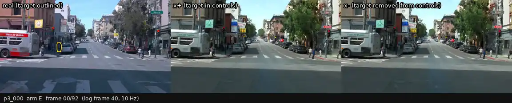

| | |
|:--|:--|
| 场景 | p3_000 · WOD `2265177645248606981_2340_000_2360_000` · log 帧 40–132（10 Hz，9.3 s）· sf, Day, sunny |
| 设置 | Edge Distilled 4 步；x⁺ 控制 = 真实帧 Canny；x⁻ 控制 = 区域外与 x⁺ 逐像素相同，区域内换成 LaMa clean plate 的 Canny；两边同 prompt、同 seed、各自独立生成 |
| 目标行人 | 黄色轮廓（真实帧里）；≥ 300 px 的帧 93 / 93，距离 9–40 m；掩膜来源 YOLO 92 帧、投影框 1 帧 |
| 区域外 x⁺ / x⁻ 平均像素差 | 1.87（0–255，编辑区域膨胀 24 px 以外；只作参考） |
| GPU 时间 | x⁺ 222 s + x⁻ 195 s（GPU 2，与 GIMM 插帧任务共享） |

**结论（用户填）：** 

---

### p3_000 · 移除 · Ed（对照：区域内不给边） `Ed`

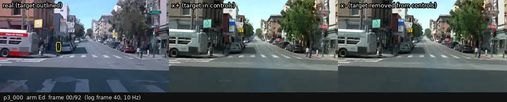

| | |
|:--|:--|
| 场景 | p3_000 · WOD `2265177645248606981_2340_000_2360_000` · log 帧 40–132（10 Hz，9.3 s）· sf, Day, sunny |
| 设置 | 同 E，但 x⁻ 的区域内边缘直接清空，不用 clean plate 补 |
| 目标行人 | 黄色轮廓（真实帧里）；≥ 300 px 的帧 93 / 93，距离 9–40 m；掩膜来源 YOLO 92 帧、投影框 1 帧 |
| 区域外 x⁺ / x⁻ 平均像素差 | 1.97（0–255，编辑区域膨胀 24 px 以外；只作参考） |
| GPU 时间 | x⁺ 234 s + x⁻ 190 s（GPU 2，与 GIMM 插帧任务共享） |

**结论（用户填）：** 

---

### p3_000 · 移除 · EG（x⁺ 锚定在 x⁻ 上） `EGb`

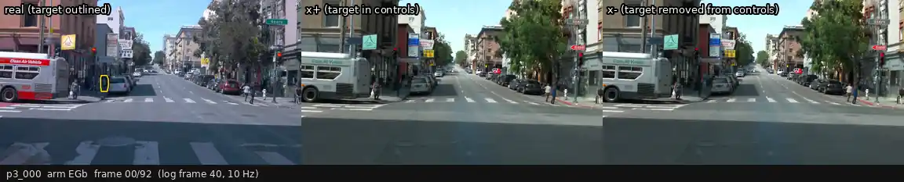

| | |
|:--|:--|
| 场景 | p3_000 · WOD `2265177645248606981_2340_000_2360_000` · log 帧 40–132（10 Hz，9.3 s）· sf, Day, sunny |
| 设置 | x⁻ 即 E 的 x⁻；x⁺ 用 x⁺ 的边缘重新生成，区域（膨胀 24 px、±3 帧）以外的 latent 每一步钉在 x⁻ 上，再羽化贴回 x⁻：区域外 x⁺ 与 x⁻ 逐像素相同，不再对称 |
| 目标行人 | 黄色轮廓（真实帧里）；≥ 300 px 的帧 93 / 93，距离 9–40 m；掩膜来源 YOLO 92 帧、投影框 1 帧 |
| 区域外 x⁺ / x⁻ 平均像素差 | 0.00（0–255，编辑区域膨胀 24 px 以外；只作参考） |
| GPU 时间 | x⁺ 121 s（x⁻ 与移除对共用，不另算）（GPU 2，与 GIMM 插帧任务共享） |

**结论（用户填）：** 

---

### p3_000 · 移除 · BV（base 35 步，edge + vis） `BV`

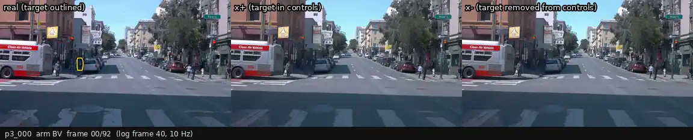

| | |
|:--|:--|
| 场景 | p3_000 · WOD `2265177645248606981_2340_000_2360_000` · log 帧 40–132（10 Hz，9.3 s）· sf, Day, sunny |
| 设置 | base 模型 35 步、CFG 3，edge 1.0 + vis 0.5（vis = Cosmos 对输入视频现算的模糊图：x⁺ 用真实视频，x⁻ 用 clean plate），带 negative prompt |
| 目标行人 | 黄色轮廓（真实帧里）；≥ 300 px 的帧 93 / 93，距离 9–40 m；掩膜来源 YOLO 92 帧、投影框 1 帧 |
| 区域外 x⁺ / x⁻ 平均像素差 | 0.96（0–255，编辑区域膨胀 24 px 以外；只作参考） |
| GPU 时间 | x⁺ 1348 s + x⁻ 1302 s（GPU 2，与 GIMM 插帧任务共享） |

**结论（用户填）：** 

---

### p3_001 · 移除 · E（主设置） `E`

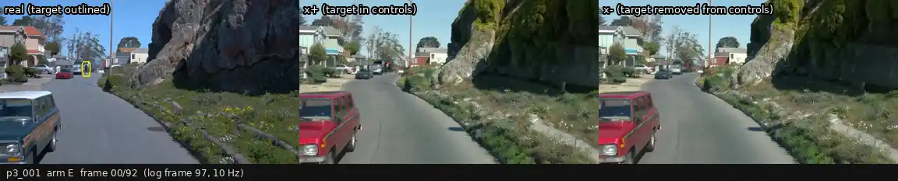

| | |
|:--|:--|
| 场景 | p3_001 · WOD `7189996641300362130_3360_000_3380_000` · log 帧 97–189（10 Hz，9.3 s）· sf, Day, sunny |
| 设置 | Edge Distilled 4 步；x⁺ 控制 = 真实帧 Canny；x⁻ 控制 = 区域外与 x⁺ 逐像素相同，区域内换成 LaMa clean plate 的 Canny；两边同 prompt、同 seed、各自独立生成 |
| 目标行人 | 黄色轮廓（真实帧里）；≥ 300 px 的帧 93 / 93，距离 9–54 m；掩膜来源 YOLO 13 帧、投影框 80 帧 |
| 区域外 x⁺ / x⁻ 平均像素差 | 2.25（0–255，编辑区域膨胀 24 px 以外；只作参考） |
| GPU 时间 | x⁺ 113 s + x⁻ 95 s（GPU 2，与 GIMM 插帧任务共享） |

**结论（用户填）：** 

---

### p3_002 · 移除 · E（主设置） `E`

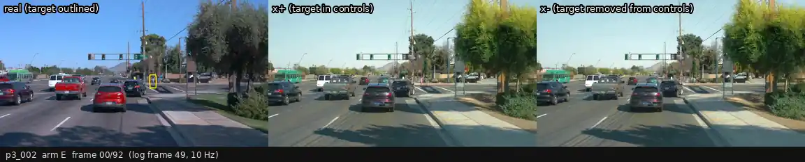

| | |
|:--|:--|
| 场景 | p3_002 · WOD `1730266523558914470_305_260_325_260` · log 帧 49–141（10 Hz，9.3 s）· phx, Day, sunny |
| 设置 | Edge Distilled 4 步；x⁺ 控制 = 真实帧 Canny；x⁻ 控制 = 区域外与 x⁺ 逐像素相同，区域内换成 LaMa clean plate 的 Canny；两边同 prompt、同 seed、各自独立生成 |
| 目标行人 | 黄色轮廓（真实帧里）；≥ 300 px 的帧 91 / 93，距离 10–48 m；掩膜来源 YOLO 79 帧、投影框 14 帧 |
| 区域外 x⁺ / x⁻ 平均像素差 | 1.79（0–255，编辑区域膨胀 24 px 以外；只作参考） |
| GPU 时间 | x⁺ 114 s + x⁻ 97 s（GPU 2，与 GIMM 插帧任务共享） |

**结论（用户填）：** 

---

### p3_003 · 移除 · E（主设置） `E`

| | |
|:--|:--|
| 场景 | p3_003 · WOD `9243656068381062947_1297_428_1317_428` · log 帧 75–167（10 Hz，9.3 s）· phx, Day, sunny |
| 设置 | Edge Distilled 4 步；x⁺ 控制 = 真实帧 Canny；x⁻ 控制 = 区域外与 x⁺ 逐像素相同，区域内换成 LaMa clean plate 的 Canny；两边同 prompt、同 seed、各自独立生成 |
| 目标行人 | 黄色轮廓（真实帧里）；≥ 300 px 的帧 93 / 93，距离 8–49 m；掩膜来源 YOLO 92 帧、投影框 1 帧 |
| 区域外 x⁺ / x⁻ 平均像素差 | 2.54（0–255，编辑区域膨胀 24 px 以外；只作参考） |
| GPU 时间 | x⁺ 97 s + x⁻ 128 s（GPU 2，与 GIMM 插帧任务共享） |

**结论（用户填）：** 

---

### p3_004 · 移除 · E（主设置） `E`

| | |
|:--|:--|
| 场景 | p3_004 · WOD `12681651284932598380_3585_280_3605_280` · log 帧 67–159（10 Hz，9.3 s）· phx, Day, sunny |
| 设置 | Edge Distilled 4 步；x⁺ 控制 = 真实帧 Canny；x⁻ 控制 = 区域外与 x⁺ 逐像素相同，区域内换成 LaMa clean plate 的 Canny；两边同 prompt、同 seed、各自独立生成 |
| 目标行人 | 黄色轮廓（真实帧里）；≥ 300 px 的帧 35 / 93，距离 4–75 m；掩膜来源 YOLO 43 帧、投影框 2 帧 |
| 区域外 x⁺ / x⁻ 平均像素差 | 2.06（0–255，编辑区域膨胀 24 px 以外；只作参考） |
| GPU 时间 | x⁺ 138 s + x⁻ 137 s（GPU 2，与 GIMM 插帧任务共享） |

**结论（用户填）：** 

---

### p3_005 · 移除 · E（主设置） `E`

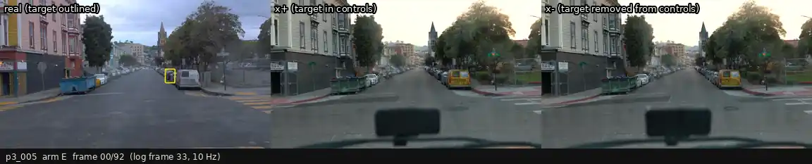

| | |
|:--|:--|
| 场景 | p3_005 · WOD `11846396154240966170_3540_000_3560_000` · log 帧 33–125（10 Hz，9.3 s）· sf, Day, sunny |
| 设置 | Edge Distilled 4 步；x⁺ 控制 = 真实帧 Canny；x⁻ 控制 = 区域外与 x⁺ 逐像素相同，区域内换成 LaMa clean plate 的 Canny；两边同 prompt、同 seed、各自独立生成 |
| 目标行人 | 黄色轮廓（真实帧里）；≥ 300 px 的帧 93 / 93，距离 12–40 m；掩膜来源 YOLO 53 帧、投影框 40 帧 |
| 区域外 x⁺ / x⁻ 平均像素差 | 2.47（0–255，编辑区域膨胀 24 px 以外；只作参考） |
| GPU 时间 | x⁺ 138 s + x⁻ 138 s（GPU 2，与 GIMM 插帧任务共享） |

**结论（用户填）：** 

---

### p3_006 · 移除 · E（主设置） `E`

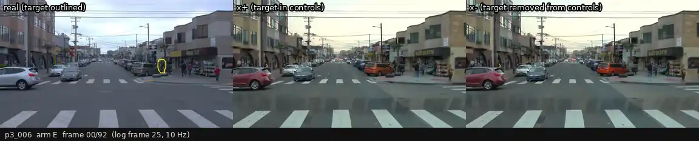

| | |
|:--|:--|
| 场景 | p3_006 · WOD `9820553434532681355_2820_000_2840_000` · log 帧 25–117（10 Hz，9.3 s）· sf, Day, sunny |
| 设置 | Edge Distilled 4 步；x⁺ 控制 = 真实帧 Canny；x⁻ 控制 = 区域外与 x⁺ 逐像素相同，区域内换成 LaMa clean plate 的 Canny；两边同 prompt、同 seed、各自独立生成 |
| 目标行人 | 黄色轮廓（真实帧里）；≥ 300 px 的帧 93 / 93，距离 7–42 m；掩膜来源 YOLO 41 帧、投影框 52 帧 |
| 区域外 x⁺ / x⁻ 平均像素差 | 2.07（0–255，编辑区域膨胀 24 px 以外；只作参考） |
| GPU 时间 | x⁺ 137 s + x⁻ 137 s（GPU 2，与 GIMM 插帧任务共享） |

**结论（用户填）：** 

---

### p3_007 · 移除 · E（主设置） `E`

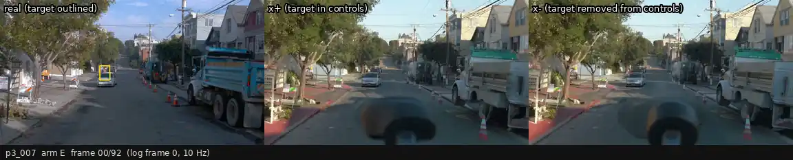

| | |
|:--|:--|
| 场景 | p3_007 · WOD `17144150788361379549_2720_000_2740_000` · log 帧 0–92（10 Hz，9.3 s）· sf, Day, sunny |
| 设置 | Edge Distilled 4 步；x⁺ 控制 = 真实帧 Canny；x⁻ 控制 = 区域外与 x⁺ 逐像素相同，区域内换成 LaMa clean plate 的 Canny；两边同 prompt、同 seed、各自独立生成 |
| 目标行人 | 黄色轮廓（真实帧里）；≥ 300 px 的帧 93 / 93，距离 10–44 m；掩膜来源 YOLO 86 帧、投影框 7 帧 |
| 区域外 x⁺ / x⁻ 平均像素差 | 4.33（0–255，编辑区域膨胀 24 px 以外；只作参考） |
| GPU 时间 | x⁺ 136 s + x⁻ 139 s（GPU 2，与 GIMM 插帧任务共享） |

**结论（用户填）：** 

---

### p3_008 · 移除 · E（主设置） `E`

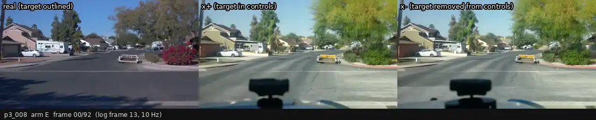

| | |
|:--|:--|
| 场景 | p3_008 · WOD `9058545212382992974_5236_200_5256_200` · log 帧 13–105（10 Hz，9.3 s）· phx, Day, sunny |
| 设置 | Edge Distilled 4 步；x⁺ 控制 = 真实帧 Canny；x⁻ 控制 = 区域外与 x⁺ 逐像素相同，区域内换成 LaMa clean plate 的 Canny；两边同 prompt、同 seed、各自独立生成 |
| 目标行人 | 黄色轮廓（真实帧里）；≥ 300 px 的帧 44 / 93，距离 14–29 m；掩膜来源 YOLO 41 帧、投影框 3 帧 |
| 区域外 x⁺ / x⁻ 平均像素差 | 4.65（0–255，编辑区域膨胀 24 px 以外；只作参考） |
| GPU 时间 | x⁺ 136 s + x⁻ 138 s（GPU 2，与 GIMM 插帧任务共享） |

**结论（用户填）：** 

---

### p3_009 · 移除 · E（主设置） `E`

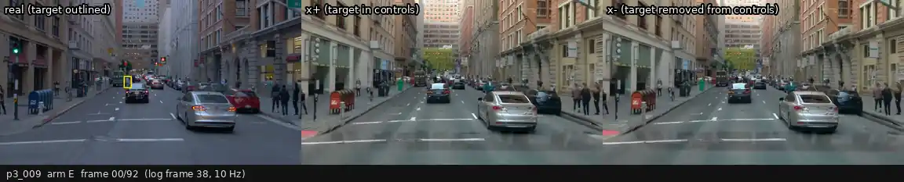

| | |
|:--|:--|
| 场景 | p3_009 · WOD `6378340771722906187_1120_000_1140_000` · log 帧 38–130（10 Hz，9.3 s）· sf, Day, sunny |
| 设置 | Edge Distilled 4 步；x⁺ 控制 = 真实帧 Canny；x⁻ 控制 = 区域外与 x⁺ 逐像素相同，区域内换成 LaMa clean plate 的 Canny；两边同 prompt、同 seed、各自独立生成 |
| 目标行人 | 黄色轮廓（真实帧里）；≥ 300 px 的帧 91 / 93，距离 5–57 m；掩膜来源 YOLO 91 帧、投影框 2 帧 |
| 区域外 x⁺ / x⁻ 平均像素差 | 2.45（0–255，编辑区域膨胀 24 px 以外；只作参考） |
| GPU 时间 | x⁺ 137 s + x⁻ 138 s（GPU 2，与 GIMM 插帧任务共享） |

**结论（用户填）：** 

---

### p3_010 · 移除 · E（主设置） `E`

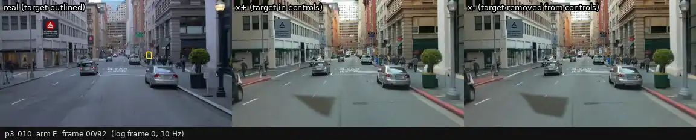

| | |
|:--|:--|
| 场景 | p3_010 · WOD `12251442326766052580_1840_000_1860_000` · log 帧 0–92（10 Hz，9.3 s）· sf, Day, sunny |
| 设置 | Edge Distilled 4 步；x⁺ 控制 = 真实帧 Canny；x⁻ 控制 = 区域外与 x⁺ 逐像素相同，区域内换成 LaMa clean plate 的 Canny；两边同 prompt、同 seed、各自独立生成 |
| 目标行人 | 黄色轮廓（真实帧里）；≥ 300 px 的帧 78 / 93，距离 10–68 m；掩膜来源 YOLO 66 帧、投影框 27 帧 |
| 区域外 x⁺ / x⁻ 平均像素差 | 2.05（0–255，编辑区域膨胀 24 px 以外；只作参考） |
| GPU 时间 | x⁺ 138 s + x⁻ 136 s（GPU 2，与 GIMM 插帧任务共享） |

**结论（用户填）：** 

---

### p3_011 · 移除 · E（主设置） `E`

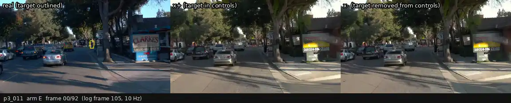

| | |
|:--|:--|
| 场景 | p3_011 · WOD `11388947676680954806_5427_320_5447_320` · log 帧 105–197（10 Hz，9.3 s）· other, Day, sunny |
| 设置 | Edge Distilled 4 步；x⁺ 控制 = 真实帧 Canny；x⁻ 控制 = 区域外与 x⁺ 逐像素相同，区域内换成 LaMa clean plate 的 Canny；两边同 prompt、同 seed、各自独立生成 |
| 目标行人 | 黄色轮廓（真实帧里）；≥ 300 px 的帧 93 / 93，距离 13–61 m；掩膜来源 YOLO 93 帧、投影框 0 帧 |
| 区域外 x⁺ / x⁻ 平均像素差 | 2.39（0–255，编辑区域膨胀 24 px 以外；只作参考） |
| GPU 时间 | x⁺ 154 s + x⁻ 138 s（GPU 2，与 GIMM 插帧任务共享） |

**结论（用户填）：** 

---

### p3_012 · 移除 · E（主设置） `E`

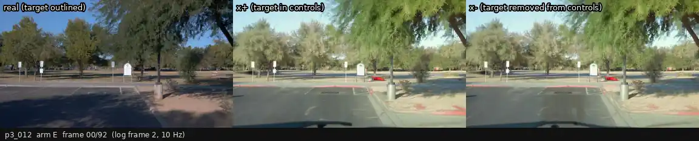

| | |
|:--|:--|
| 场景 | p3_012 · WOD `4195774665746097799_7300_960_7320_960` · log 帧 2–94（10 Hz，9.3 s）· phx, Day, sunny |
| 设置 | Edge Distilled 4 步；x⁺ 控制 = 真实帧 Canny；x⁻ 控制 = 区域外与 x⁺ 逐像素相同，区域内换成 LaMa clean plate 的 Canny；两边同 prompt、同 seed、各自独立生成 |
| 目标行人 | 黄色轮廓（真实帧里）；≥ 300 px 的帧 28 / 93，距离 4–18 m；掩膜来源 YOLO 27 帧、投影框 8 帧 |
| 区域外 x⁺ / x⁻ 平均像素差 | 2.43（0–255，编辑区域膨胀 24 px 以外；只作参考） |
| GPU 时间 | x⁺ 136 s + x⁻ 138 s（GPU 2，与 GIMM 插帧任务共享） |

**结论（用户填）：** 

---

### p3_013 · 移除 · E（主设置） `E`

| | |
|:--|:--|
| 场景 | p3_013 · WOD `16751706457322889693_4475_240_4495_240` · log 帧 69–161（10 Hz，9.3 s）· phx, Day, sunny |
| 设置 | Edge Distilled 4 步；x⁺ 控制 = 真实帧 Canny；x⁻ 控制 = 区域外与 x⁺ 逐像素相同，区域内换成 LaMa clean plate 的 Canny；两边同 prompt、同 seed、各自独立生成 |
| 目标行人 | 黄色轮廓（真实帧里）；≥ 300 px 的帧 83 / 93，距离 17–76 m；掩膜来源 YOLO 81 帧、投影框 12 帧 |
| 区域外 x⁺ / x⁻ 平均像素差 | 4.62（0–255，编辑区域膨胀 24 px 以外；只作参考） |
| GPU 时间 | x⁺ 136 s + x⁻ 137 s（GPU 2，与 GIMM 插帧任务共享） |

**结论（用户填）：** 

---

### p3_014 · 移除 · E（主设置） `E`

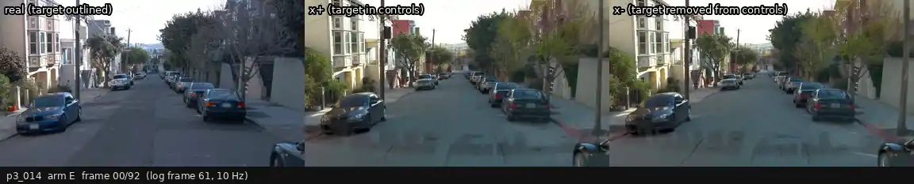

| | |
|:--|:--|
| 场景 | p3_014 · WOD `14869732972903148657_2420_000_2440_000` · log 帧 61–153（10 Hz，9.3 s）· sf, Day, sunny |
| 设置 | Edge Distilled 4 步；x⁺ 控制 = 真实帧 Canny；x⁻ 控制 = 区域外与 x⁺ 逐像素相同，区域内换成 LaMa clean plate 的 Canny；两边同 prompt、同 seed、各自独立生成 |
| 目标行人 | 黄色轮廓（真实帧里）；≥ 300 px 的帧 85 / 93，距离 6–56 m；掩膜来源 YOLO 66 帧、投影框 19 帧 |
| 区域外 x⁺ / x⁻ 平均像素差 | 2.26（0–255，编辑区域膨胀 24 px 以外；只作参考） |
| GPU 时间 | x⁺ 137 s + x⁻ 138 s（GPU 2，与 GIMM 插帧任务共享） |

**结论（用户填）：** 

---

### p3_015 · 移除 · E（主设置） `E`

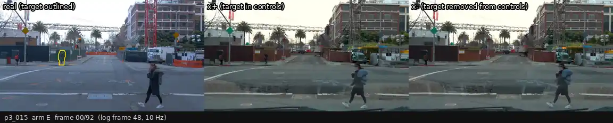

| | |
|:--|:--|
| 场景 | p3_015 · WOD `1024360143612057520_3580_000_3600_000` · log 帧 48–140（10 Hz，9.3 s）· sf, Day, sunny |
| 设置 | Edge Distilled 4 步；x⁺ 控制 = 真实帧 Canny；x⁻ 控制 = 区域外与 x⁺ 逐像素相同，区域内换成 LaMa clean plate 的 Canny；两边同 prompt、同 seed、各自独立生成 |
| 目标行人 | 黄色轮廓（真实帧里）；≥ 300 px 的帧 93 / 93，距离 12–31 m；掩膜来源 YOLO 90 帧、投影框 3 帧 |
| 区域外 x⁺ / x⁻ 平均像素差 | 2.61（0–255，编辑区域膨胀 24 px 以外；只作参考） |
| GPU 时间 | x⁺ 137 s + x⁻ 137 s（GPU 2，与 GIMM 插帧任务共享） |

**结论（用户填）：** 

---

### p3_016 · 移除 · E（主设置） `E`

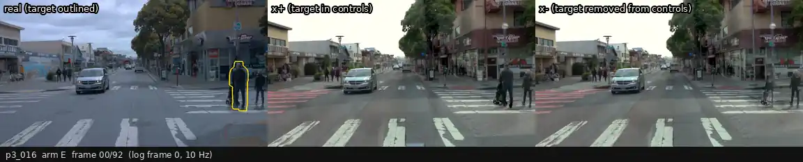

| | |
|:--|:--|
| 场景 | p3_016 · WOD `17388121177218499911_2520_000_2540_000` · log 帧 0–92（10 Hz，9.3 s）· sf, Day, sunny |
| 设置 | Edge Distilled 4 步；x⁺ 控制 = 真实帧 Canny；x⁻ 控制 = 区域外与 x⁺ 逐像素相同，区域内换成 LaMa clean plate 的 Canny；两边同 prompt、同 seed、各自独立生成 |
| 目标行人 | 黄色轮廓（真实帧里）；≥ 300 px 的帧 60 / 93，距离 4–15 m；掩膜来源 YOLO 57 帧、投影框 9 帧 |
| 区域外 x⁺ / x⁻ 平均像素差 | 3.41（0–255，编辑区域膨胀 24 px 以外；只作参考） |
| GPU 时间 | x⁺ 137 s + x⁻ 135 s（GPU 2，与 GIMM 插帧任务共享） |

**结论（用户填）：** 

---

### p3_017 · 移除 · E（主设置） `E`

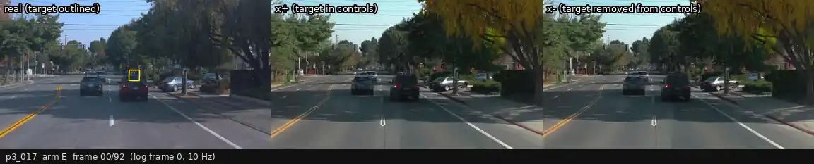

| | |
|:--|:--|
| 场景 | p3_017 · WOD `9250355398701464051_4166_132_4186_132` · log 帧 0–92（10 Hz，9.3 s）· other, Day, sunny |
| 设置 | Edge Distilled 4 步；x⁺ 控制 = 真实帧 Canny；x⁻ 控制 = 区域外与 x⁺ 逐像素相同，区域内换成 LaMa clean plate 的 Canny；两边同 prompt、同 seed、各自独立生成 |
| 目标行人 | 黄色轮廓（真实帧里）；≥ 300 px 的帧 79 / 93，距离 12–62 m；掩膜来源 YOLO 37 帧、投影框 42 帧 |
| 区域外 x⁺ / x⁻ 平均像素差 | 1.77（0–255，编辑区域膨胀 24 px 以外；只作参考） |
| GPU 时间 | x⁺ 138 s + x⁻ 136 s（GPU 2，与 GIMM 插帧任务共享） |

**结论（用户填）：** 

---

### p3_018 · 移除 · E（主设置） `E`

| | |
|:--|:--|
| 场景 | p3_018 · WOD `12337317986514501583_5346_260_5366_260` · log 帧 56–148（10 Hz，9.3 s）· phx, Day, sunny |
| 设置 | Edge Distilled 4 步；x⁺ 控制 = 真实帧 Canny；x⁻ 控制 = 区域外与 x⁺ 逐像素相同，区域内换成 LaMa clean plate 的 Canny；两边同 prompt、同 seed、各自独立生成 |
| 目标行人 | 黄色轮廓（真实帧里）；≥ 300 px 的帧 92 / 93，距离 13–68 m；掩膜来源 YOLO 89 帧、投影框 4 帧 |
| 区域外 x⁺ / x⁻ 平均像素差 | 3.40（0–255，编辑区域膨胀 24 px 以外；只作参考） |
| GPU 时间 | x⁺ 137 s + x⁻ 137 s（GPU 2，与 GIMM 插帧任务共享） |

**结论（用户填）：** 

---

## 审阅：插入对

### p3_000 · 插入 · EI（主设置） `EI`

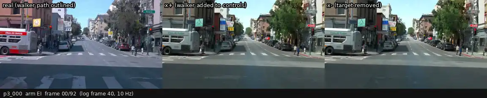

| | |
|:--|:--|
| 场景 | p3_000 · WOD `2265177645248606981_2340_000_2360_000` · log 帧 40–132（10 Hz，9.3 s）· sf, Day, sunny |
| 设置 | x⁻ 即 E 的 x⁻；x⁺ 控制 = x⁻ 的边缘 + CARLA 行走行人的 Canny（按投影缩放、被更近的场景深度遮挡），同 prompt、同 seed |
| 插入的行人 | CARLA `27515-s0` 的行走序列（步态周期循环），1.5 m/s 从右侧路缘走向车道中心，第 80 帧到达车道中心；可见第 30–92 帧，身高 102–507 px |
| 区域外 x⁺ / x⁻ 平均像素差 | 3.48（0–255，编辑区域膨胀 24 px 以外；只作参考） |
| GPU 时间 | x⁺ 165 s（x⁻ 与移除对共用，不另算）（GPU 2，与 GIMM 插帧任务共享） |

**结论（用户填）：** 

---

### p3_000 · 插入 · EIG（x⁺ 锚定在 x⁻ 上） `EIGb`

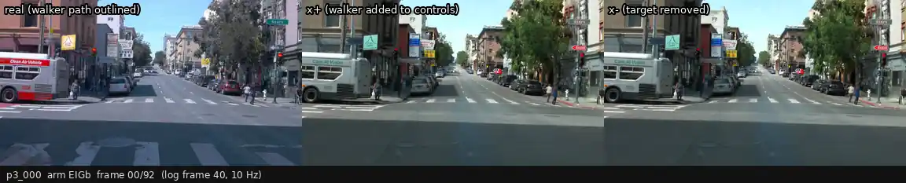

| | |
|:--|:--|
| 场景 | p3_000 · WOD `2265177645248606981_2340_000_2360_000` · log 帧 40–132（10 Hz，9.3 s）· sf, Day, sunny |
| 设置 | 同 EI，但 x⁺ 只在行人区域（膨胀 24 px、±3 帧）内重新生成，区域外钉在 E 的 x⁻ 上并羽化贴回 |
| 插入的行人 | CARLA `27515-s0` 的行走序列（步态周期循环），1.5 m/s 从右侧路缘走向车道中心，第 80 帧到达车道中心；可见第 30–92 帧，身高 102–507 px |
| 区域外 x⁺ / x⁻ 平均像素差 | 0.00（0–255，编辑区域膨胀 24 px 以外；只作参考） |
| GPU 时间 | x⁺ 122 s（x⁻ 与移除对共用，不另算）（GPU 2，与 GIMM 插帧任务共享） |

**结论（用户填）：** 

---

### p3_000 · 插入 · BVI（base 35 步，edge + vis） `BVI`

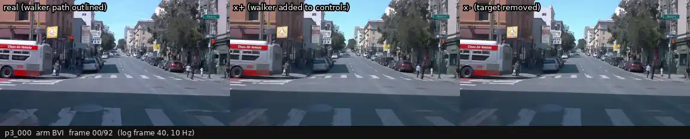

| | |
|:--|:--|
| 场景 | p3_000 · WOD `2265177645248606981_2340_000_2360_000` · log 帧 40–132（10 Hz，9.3 s）· sf, Day, sunny |
| 设置 | x⁻ 即 BV 的 x⁻；x⁺ 的 edge 同 EI，vis 来自贴了 CARLA 行人像素的 clean plate |
| 插入的行人 | CARLA `27515-s0` 的行走序列（步态周期循环），1.5 m/s 从右侧路缘走向车道中心，第 80 帧到达车道中心；可见第 30–92 帧，身高 102–507 px |
| 区域外 x⁺ / x⁻ 平均像素差 | 1.18（0–255，编辑区域膨胀 24 px 以外；只作参考） |
| GPU 时间 | x⁺ 1341 s（x⁻ 与移除对共用，不另算）（GPU 2，与 GIMM 插帧任务共享） |

**结论（用户填）：** 

---

### p3_001 · 插入 · EI（主设置） `EI`

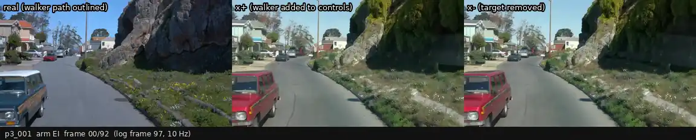

| | |
|:--|:--|
| 场景 | p3_001 · WOD `7189996641300362130_3360_000_3380_000` · log 帧 97–189（10 Hz，9.3 s）· sf, Day, sunny |
| 设置 | x⁻ 即 E 的 x⁻；x⁺ 控制 = x⁻ 的边缘 + CARLA 行走行人的 Canny（按投影缩放、被更近的场景深度遮挡），同 prompt、同 seed |
| 插入的行人 | CARLA `27515-s0` 的行走序列（步态周期循环），1.5 m/s 从右侧路缘走向车道中心，第 80 帧到达车道中心；可见第 34–92 帧，身高 82–520 px |
| 区域外 x⁺ / x⁻ 平均像素差 | 3.18（0–255，编辑区域膨胀 24 px 以外；只作参考） |
| GPU 时间 | x⁺ 140 s（x⁻ 与移除对共用，不另算）（GPU 2，与 GIMM 插帧任务共享） |

**结论（用户填）：** 

---

### p3_002 · 插入 · EI（主设置） `EI`

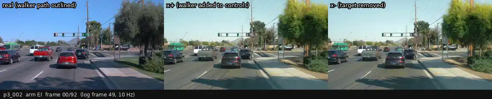

| | |
|:--|:--|
| 场景 | p3_002 · WOD `1730266523558914470_305_260_325_260` · log 帧 49–141（10 Hz，9.3 s）· phx, Day, sunny |
| 设置 | x⁻ 即 E 的 x⁻；x⁺ 控制 = x⁻ 的边缘 + CARLA 行走行人的 Canny（按投影缩放、被更近的场景深度遮挡），同 prompt、同 seed |
| 插入的行人 | CARLA `27515-s0` 的行走序列（步态周期循环），1.5 m/s 从右侧路缘走向车道中心，第 80 帧到达车道中心；可见第 30–92 帧，身高 116–480 px |
| 区域外 x⁺ / x⁻ 平均像素差 | 3.77（0–255，编辑区域膨胀 24 px 以外；只作参考） |
| GPU 时间 | x⁺ 156 s（x⁻ 与移除对共用，不另算）（GPU 2，与 GIMM 插帧任务共享） |

**结论（用户填）：** 

---

### p3_003 · 插入 · EI（主设置） `EI`

| | |
|:--|:--|
| 场景 | p3_003 · WOD `9243656068381062947_1297_428_1317_428` · log 帧 75–167（10 Hz，9.3 s）· phx, Day, sunny |
| 设置 | x⁻ 即 E 的 x⁻；x⁺ 控制 = x⁻ 的边缘 + CARLA 行走行人的 Canny（按投影缩放、被更近的场景深度遮挡），同 prompt、同 seed |
| 插入的行人 | CARLA `27515-s0` 的行走序列（步态周期循环），1.5 m/s 从右侧路缘走向车道中心，第 80 帧到达车道中心；可见第 30–92 帧，身高 68–524 px |
| 区域外 x⁺ / x⁻ 平均像素差 | 5.07（0–255，编辑区域膨胀 24 px 以外；只作参考） |
| GPU 时间 | x⁺ 137 s（x⁻ 与移除对共用，不另算）（GPU 2，与 GIMM 插帧任务共享） |

**结论（用户填）：** 

---

### p3_003 · 插入 · EIG（x⁺ 锚定在 x⁻ 上） `EIGb`

| | |
|:--|:--|
| 场景 | p3_003 · WOD `9243656068381062947_1297_428_1317_428` · log 帧 75–167（10 Hz，9.3 s）· phx, Day, sunny |
| 设置 | 同 EI，但 x⁺ 只在行人区域（膨胀 24 px、±3 帧）内重新生成，区域外钉在 E 的 x⁻ 上并羽化贴回 |
| 插入的行人 | CARLA `27515-s0` 的行走序列（步态周期循环），1.5 m/s 从右侧路缘走向车道中心，第 80 帧到达车道中心；可见第 30–92 帧，身高 68–524 px |
| 区域外 x⁺ / x⁻ 平均像素差 | 0.00（0–255，编辑区域膨胀 24 px 以外；只作参考） |
| GPU 时间 | x⁺ 121 s（x⁻ 与移除对共用，不另算）（GPU 2，与 GIMM 插帧任务共享） |

**结论（用户填）：** 

---

### p3_004 · 插入 · EI（主设置） `EI`

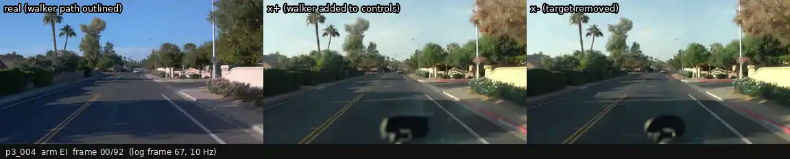

| | |
|:--|:--|
| 场景 | p3_004 · WOD `12681651284932598380_3585_280_3605_280` · log 帧 67–159（10 Hz，9.3 s）· phx, Day, sunny |
| 设置 | x⁻ 即 E 的 x⁻；x⁺ 控制 = x⁻ 的边缘 + CARLA 行走行人的 Canny（按投影缩放、被更近的场景深度遮挡），同 prompt、同 seed |
| 插入的行人 | CARLA `27515-s0` 的行走序列（步态周期循环），1.5 m/s 从右侧路缘走向车道中心，第 80 帧到达车道中心；可见第 36–92 帧，身高 39–516 px |
| 区域外 x⁺ / x⁻ 平均像素差 | 3.88（0–255，编辑区域膨胀 24 px 以外；只作参考） |
| GPU 时间 | x⁺ 139 s（x⁻ 与移除对共用，不另算）（GPU 2，与 GIMM 插帧任务共享） |

**结论（用户填）：** 

---

### p3_005 · 插入 · EI（主设置） `EI`

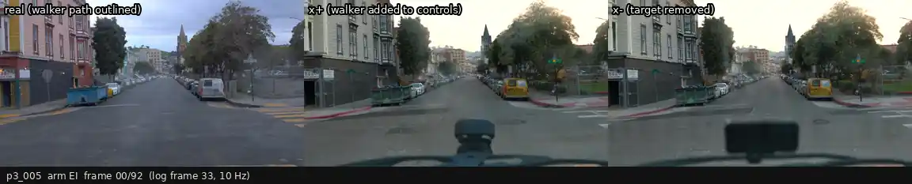

| | |
|:--|:--|
| 场景 | p3_005 · WOD `11846396154240966170_3540_000_3560_000` · log 帧 33–125（10 Hz，9.3 s）· sf, Day, sunny |
| 设置 | x⁻ 即 E 的 x⁻；x⁺ 控制 = x⁻ 的边缘 + CARLA 行走行人的 Canny（按投影缩放、被更近的场景深度遮挡），同 prompt、同 seed |
| 插入的行人 | CARLA `27515-s0` 的行走序列（步态周期循环），1.5 m/s 从右侧路缘走向车道中心，第 80 帧到达车道中心；可见第 30–92 帧，身高 78–514 px |
| 区域外 x⁺ / x⁻ 平均像素差 | 6.18（0–255，编辑区域膨胀 24 px 以外；只作参考） |
| GPU 时间 | x⁺ 140 s（x⁻ 与移除对共用，不另算）（GPU 2，与 GIMM 插帧任务共享） |

**结论（用户填）：** 

---

### p3_006 · 插入 · EI（主设置） `EI`

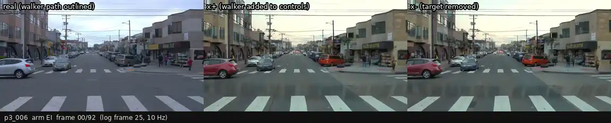

| | |
|:--|:--|
| 场景 | p3_006 · WOD `9820553434532681355_2820_000_2840_000` · log 帧 25–117（10 Hz，9.3 s）· sf, Day, sunny |
| 设置 | x⁻ 即 E 的 x⁻；x⁺ 控制 = x⁻ 的边缘 + CARLA 行走行人的 Canny（按投影缩放、被更近的场景深度遮挡），同 prompt、同 seed |
| 插入的行人 | CARLA `27515-s0` 的行走序列（步态周期循环），1.5 m/s 从右侧路缘走向车道中心，第 80 帧到达车道中心；可见第 30–92 帧，身高 71–518 px |
| 区域外 x⁺ / x⁻ 平均像素差 | 2.63（0–255，编辑区域膨胀 24 px 以外；只作参考） |
| GPU 时间 | x⁺ 137 s（x⁻ 与移除对共用，不另算）（GPU 2，与 GIMM 插帧任务共享） |

**结论（用户填）：** 

---

### p3_007 · 插入 · EI（主设置） `EI`

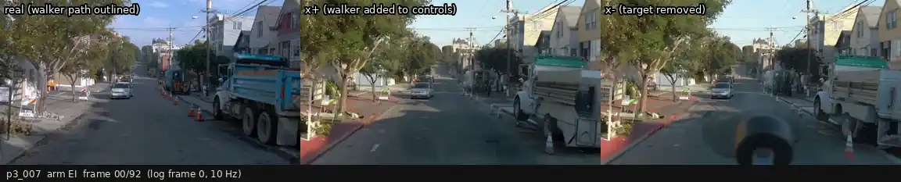

| | |
|:--|:--|
| 场景 | p3_007 · WOD `17144150788361379549_2720_000_2740_000` · log 帧 0–92（10 Hz，9.3 s）· sf, Day, sunny |
| 设置 | x⁻ 即 E 的 x⁻；x⁺ 控制 = x⁻ 的边缘 + CARLA 行走行人的 Canny（按投影缩放、被更近的场景深度遮挡），同 prompt、同 seed |
| 插入的行人 | CARLA `27515-s0` 的行走序列（步态周期循环），1.5 m/s 从右侧路缘走向车道中心，第 80 帧到达车道中心；可见第 30–92 帧，身高 83–514 px |
| 区域外 x⁺ / x⁻ 平均像素差 | 6.54（0–255，编辑区域膨胀 24 px 以外；只作参考） |
| GPU 时间 | x⁺ 139 s（x⁻ 与移除对共用，不另算）（GPU 2，与 GIMM 插帧任务共享） |

**结论（用户填）：** 

---

### p3_008 · 插入 · EI（主设置） `EI`

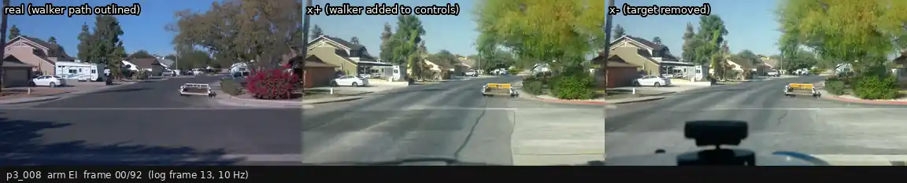

| | |
|:--|:--|
| 场景 | p3_008 · WOD `9058545212382992974_5236_200_5256_200` · log 帧 13–105（10 Hz，9.3 s）· phx, Day, sunny |
| 设置 | x⁻ 即 E 的 x⁻；x⁺ 控制 = x⁻ 的边缘 + CARLA 行走行人的 Canny（按投影缩放、被更近的场景深度遮挡），同 prompt、同 seed |
| 插入的行人 | CARLA `27515-s0` 的行走序列（步态周期循环），1.5 m/s 从右侧路缘走向车道中心，第 80 帧到达车道中心；可见第 35–92 帧，身高 97–522 px |
| 区域外 x⁺ / x⁻ 平均像素差 | 9.47（0–255，编辑区域膨胀 24 px 以外；只作参考） |
| GPU 时间 | x⁺ 137 s（x⁻ 与移除对共用，不另算）（GPU 2，与 GIMM 插帧任务共享） |

**结论（用户填）：** 

---

### p3_009 · 插入 · EI（主设置） `EI`

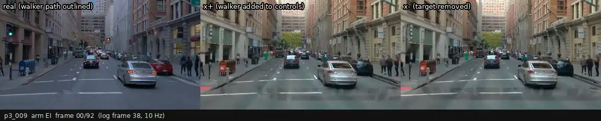

| | |
|:--|:--|
| 场景 | p3_009 · WOD `6378340771722906187_1120_000_1140_000` · log 帧 38–130（10 Hz，9.3 s）· sf, Day, sunny |
| 设置 | x⁻ 即 E 的 x⁻；x⁺ 控制 = x⁻ 的边缘 + CARLA 行走行人的 Canny（按投影缩放、被更近的场景深度遮挡），同 prompt、同 seed |
| 插入的行人 | CARLA `27515-s0` 的行走序列（步态周期循环），1.5 m/s 从右侧路缘走向车道中心，第 80 帧到达车道中心；可见第 30–92 帧，身高 63–520 px |
| 区域外 x⁺ / x⁻ 平均像素差 | 4.03（0–255，编辑区域膨胀 24 px 以外；只作参考） |
| GPU 时间 | x⁺ 139 s（x⁻ 与移除对共用，不另算）（GPU 2，与 GIMM 插帧任务共享） |

**结论（用户填）：** 

---

### p3_009 · 插入 · EIG（x⁺ 锚定在 x⁻ 上） `EIGb`

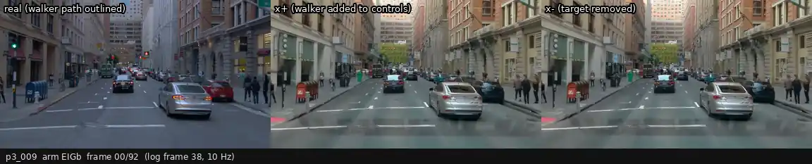

| | |
|:--|:--|
| 场景 | p3_009 · WOD `6378340771722906187_1120_000_1140_000` · log 帧 38–130（10 Hz，9.3 s）· sf, Day, sunny |
| 设置 | 同 EI，但 x⁺ 只在行人区域（膨胀 24 px、±3 帧）内重新生成，区域外钉在 E 的 x⁻ 上并羽化贴回 |
| 插入的行人 | CARLA `27515-s0` 的行走序列（步态周期循环），1.5 m/s 从右侧路缘走向车道中心，第 80 帧到达车道中心；可见第 30–92 帧，身高 63–520 px |
| 区域外 x⁺ / x⁻ 平均像素差 | 0.00（0–255，编辑区域膨胀 24 px 以外；只作参考） |
| GPU 时间 | x⁺ 102 s（x⁻ 与移除对共用，不另算）（GPU 2，与 GIMM 插帧任务共享） |

**结论（用户填）：** 

---

### p3_010 · 插入 · EI（主设置） `EI`

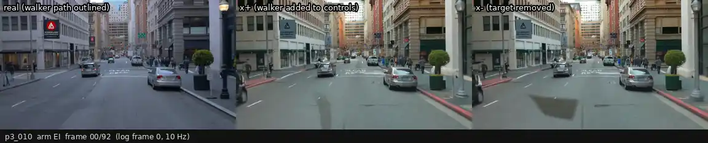

| | |
|:--|:--|
| 场景 | p3_010 · WOD `12251442326766052580_1840_000_1860_000` · log 帧 0–92（10 Hz，9.3 s）· sf, Day, sunny |
| 设置 | x⁻ 即 E 的 x⁻；x⁺ 控制 = x⁻ 的边缘 + CARLA 行走行人的 Canny（按投影缩放、被更近的场景深度遮挡），同 prompt、同 seed |
| 插入的行人 | CARLA `27515-s0` 的行走序列（步态周期循环），1.5 m/s 从右侧路缘走向车道中心，第 80 帧到达车道中心；可见第 56–92 帧，身高 80–517 px |
| 区域外 x⁺ / x⁻ 平均像素差 | 3.33（0–255，编辑区域膨胀 24 px 以外；只作参考） |
| GPU 时间 | x⁺ 136 s（x⁻ 与移除对共用，不另算）（GPU 2，与 GIMM 插帧任务共享） |

**结论（用户填）：** 

---

### p3_011 · 插入 · EI（主设置） `EI`

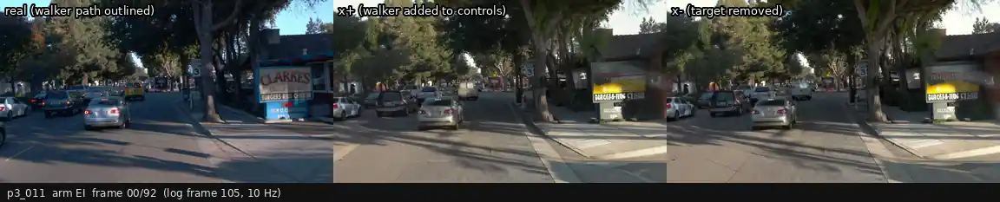

| | |
|:--|:--|
| 场景 | p3_011 · WOD `11388947676680954806_5427_320_5447_320` · log 帧 105–197（10 Hz，9.3 s）· other, Day, sunny |
| 设置 | x⁻ 即 E 的 x⁻；x⁺ 控制 = x⁻ 的边缘 + CARLA 行走行人的 Canny（按投影缩放、被更近的场景深度遮挡），同 prompt、同 seed |
| 插入的行人 | CARLA `27515-s0` 的行走序列（步态周期循环），1.5 m/s 从右侧路缘走向车道中心，第 80 帧到达车道中心；可见第 30–92 帧，身高 125–526 px |
| 区域外 x⁺ / x⁻ 平均像素差 | 5.61（0–255，编辑区域膨胀 24 px 以外；只作参考） |
| GPU 时间 | x⁺ 154 s（x⁻ 与移除对共用，不另算）（GPU 2，与 GIMM 插帧任务共享） |

**结论（用户填）：** 

---

### p3_012 · 插入 · EI（主设置） `EI`

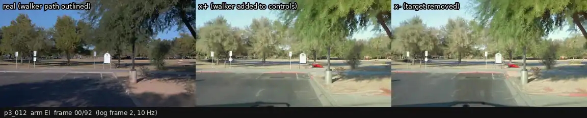

| | |
|:--|:--|
| 场景 | p3_012 · WOD `4195774665746097799_7300_960_7320_960` · log 帧 2–94（10 Hz，9.3 s）· phx, Day, sunny |
| 设置 | x⁻ 即 E 的 x⁻；x⁺ 控制 = x⁻ 的边缘 + CARLA 行走行人的 Canny（按投影缩放、被更近的场景深度遮挡），同 prompt、同 seed |
| 插入的行人 | CARLA `27515-s0` 的行走序列（步态周期循环），1.5 m/s 从右侧路缘走向车道中心，第 80 帧到达车道中心；可见第 47–92 帧，身高 128–516 px |
| 区域外 x⁺ / x⁻ 平均像素差 | 4.87（0–255，编辑区域膨胀 24 px 以外；只作参考） |
| GPU 时间 | x⁺ 139 s（x⁻ 与移除对共用，不另算）（GPU 2，与 GIMM 插帧任务共享） |

**结论（用户填）：** 

---

### p3_013 · 插入 · EI（主设置） `EI`

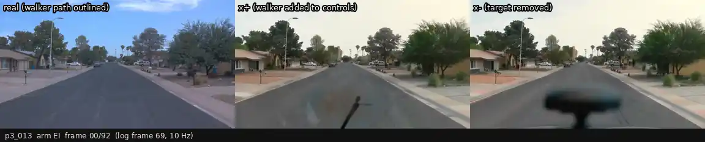

| | |
|:--|:--|
| 场景 | p3_013 · WOD `16751706457322889693_4475_240_4495_240` · log 帧 69–161（10 Hz，9.3 s）· phx, Day, sunny |
| 设置 | x⁻ 即 E 的 x⁻；x⁺ 控制 = x⁻ 的边缘 + CARLA 行走行人的 Canny（按投影缩放、被更近的场景深度遮挡），同 prompt、同 seed |
| 插入的行人 | CARLA `27515-s0` 的行走序列（步态周期循环），1.5 m/s 从右侧路缘走向车道中心，第 80 帧到达车道中心；可见第 30–92 帧，身高 88–542 px |
| 区域外 x⁺ / x⁻ 平均像素差 | 7.37（0–255，编辑区域膨胀 24 px 以外；只作参考） |
| GPU 时间 | x⁺ 136 s（x⁻ 与移除对共用，不另算）（GPU 2，与 GIMM 插帧任务共享） |

**结论（用户填）：** 

---

### p3_014 · 插入 · EI（主设置） `EI`

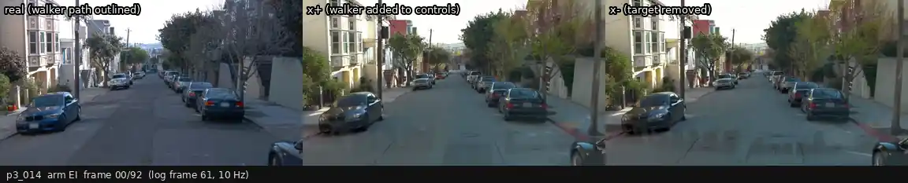

| | |
|:--|:--|
| 场景 | p3_014 · WOD `14869732972903148657_2420_000_2440_000` · log 帧 61–153（10 Hz，9.3 s）· sf, Day, sunny |
| 设置 | x⁻ 即 E 的 x⁻；x⁺ 控制 = x⁻ 的边缘 + CARLA 行走行人的 Canny（按投影缩放、被更近的场景深度遮挡），同 prompt、同 seed |
| 插入的行人 | CARLA `27515-s0` 的行走序列（步态周期循环），1.5 m/s 从右侧路缘走向车道中心，第 80 帧到达车道中心；可见第 30–92 帧，身高 60–510 px |
| 区域外 x⁺ / x⁻ 平均像素差 | 3.44（0–255，编辑区域膨胀 24 px 以外；只作参考） |
| GPU 时间 | x⁺ 136 s（x⁻ 与移除对共用，不另算）（GPU 2，与 GIMM 插帧任务共享） |

**结论（用户填）：** 

---

### p3_015 · 插入 · EI（主设置） `EI`

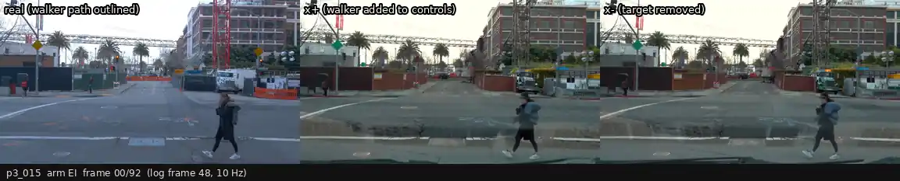

| | |
|:--|:--|
| 场景 | p3_015 · WOD `1024360143612057520_3580_000_3600_000` · log 帧 48–140（10 Hz，9.3 s）· sf, Day, sunny |
| 设置 | x⁻ 即 E 的 x⁻；x⁺ 控制 = x⁻ 的边缘 + CARLA 行走行人的 Canny（按投影缩放、被更近的场景深度遮挡），同 prompt、同 seed |
| 插入的行人 | CARLA `27515-s0` 的行走序列（步态周期循环），1.5 m/s 从右侧路缘走向车道中心，第 80 帧到达车道中心；可见第 30–92 帧，身高 126–564 px |
| 区域外 x⁺ / x⁻ 平均像素差 | 4.38（0–255，编辑区域膨胀 24 px 以外；只作参考） |
| GPU 时间 | x⁺ 191 s（x⁻ 与移除对共用，不另算）（GPU 2，与 GIMM 插帧任务共享） |

**结论（用户填）：** 

---

### p3_015 · 插入 · EIG（x⁺ 锚定在 x⁻ 上） `EIGb`

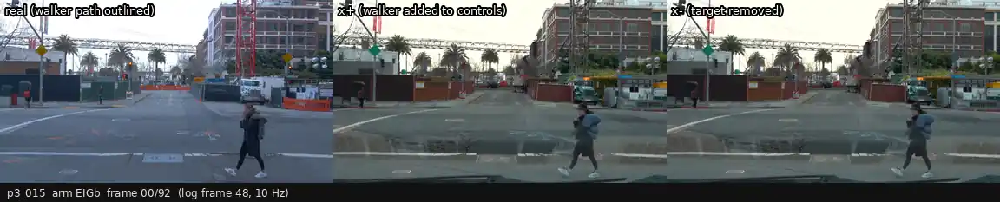

| | |
|:--|:--|
| 场景 | p3_015 · WOD `1024360143612057520_3580_000_3600_000` · log 帧 48–140（10 Hz，9.3 s）· sf, Day, sunny |
| 设置 | 同 EI，但 x⁺ 只在行人区域（膨胀 24 px、±3 帧）内重新生成，区域外钉在 E 的 x⁻ 上并羽化贴回 |
| 插入的行人 | CARLA `27515-s0` 的行走序列（步态周期循环），1.5 m/s 从右侧路缘走向车道中心，第 80 帧到达车道中心；可见第 30–92 帧，身高 126–564 px |
| 区域外 x⁺ / x⁻ 平均像素差 | 0.00（0–255，编辑区域膨胀 24 px 以外；只作参考） |
| GPU 时间 | x⁺ 102 s（x⁻ 与移除对共用，不另算）（GPU 2，与 GIMM 插帧任务共享） |

**结论（用户填）：** 

---

### p3_016 · 插入 · EI（主设置） `EI`

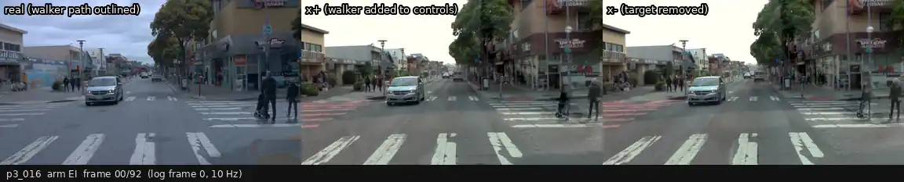

| | |
|:--|:--|
| 场景 | p3_016 · WOD `17388121177218499911_2520_000_2540_000` · log 帧 0–92（10 Hz，9.3 s）· sf, Day, sunny |
| 设置 | x⁻ 即 E 的 x⁻；x⁺ 控制 = x⁻ 的边缘 + CARLA 行走行人的 Canny（按投影缩放、被更近的场景深度遮挡），同 prompt、同 seed |
| 插入的行人 | CARLA `27515-s0` 的行走序列（步态周期循环），1.5 m/s 从右侧路缘走向车道中心，第 80 帧到达车道中心；可见第 31–92 帧，身高 79–517 px |
| 区域外 x⁺ / x⁻ 平均像素差 | 4.42（0–255，编辑区域膨胀 24 px 以外；只作参考） |
| GPU 时间 | x⁺ 192 s（x⁻ 与移除对共用，不另算）（GPU 2，与 GIMM 插帧任务共享） |

**结论（用户填）：** 

---

### p3_017 · 插入 · EI（主设置） `EI`

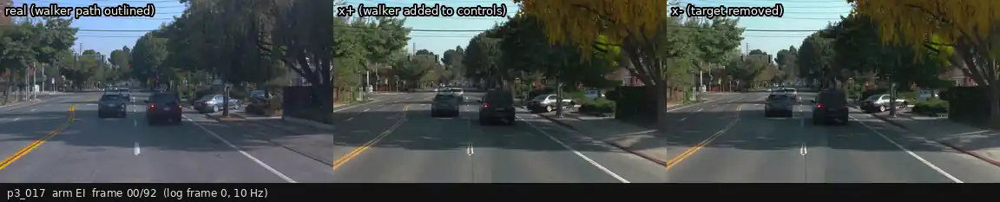

| | |
|:--|:--|
| 场景 | p3_017 · WOD `9250355398701464051_4166_132_4186_132` · log 帧 0–92（10 Hz，9.3 s）· other, Day, sunny |
| 设置 | x⁻ 即 E 的 x⁻；x⁺ 控制 = x⁻ 的边缘 + CARLA 行走行人的 Canny（按投影缩放、被更近的场景深度遮挡），同 prompt、同 seed |
| 插入的行人 | CARLA `27515-s0` 的行走序列（步态周期循环），1.5 m/s 从右侧路缘走向车道中心，第 80 帧到达车道中心；可见第 32–92 帧，身高 77–522 px |
| 区域外 x⁺ / x⁻ 平均像素差 | 3.93（0–255，编辑区域膨胀 24 px 以外；只作参考） |
| GPU 时间 | x⁺ 189 s（x⁻ 与移除对共用，不另算）（GPU 2，与 GIMM 插帧任务共享） |

**结论（用户填）：** 

---

### p3_018 · 插入 · EI（主设置） `EI`

| | |
|:--|:--|
| 场景 | p3_018 · WOD `12337317986514501583_5346_260_5366_260` · log 帧 56–148（10 Hz，9.3 s）· phx, Day, sunny |
| 设置 | x⁻ 即 E 的 x⁻；x⁺ 控制 = x⁻ 的边缘 + CARLA 行走行人的 Canny（按投影缩放、被更近的场景深度遮挡），同 prompt、同 seed |
| 插入的行人 | CARLA `27515-s0` 的行走序列（步态周期循环），1.5 m/s 从右侧路缘走向车道中心，第 80 帧到达车道中心；可见第 30–92 帧，身高 64–517 px |
| 区域外 x⁺ / x⁻ 平均像素差 | 5.68（0–255，编辑区域膨胀 24 px 以外；只作参考） |
| GPU 时间 | x⁺ 145 s（x⁻ 与移除对共用，不另算）（GPU 2，与 GIMM 插帧任务共享） |

**结论（用户填）：** 

---
