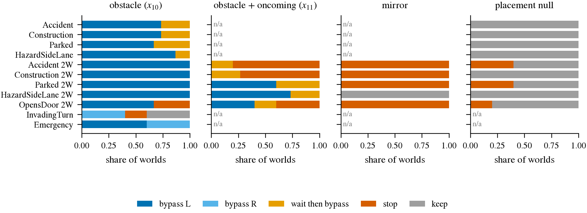

# 52. 第三层的第一版考卷（P6 v0）成立：PDM-Lite 在 9 类障碍上 100% 绕、删登记后 0% 绕、分叉都在障碍可见之后；对向车流造出了 negotiation（65% 先等）；放置 null 修生成器重跑后 0.889，按登记仍差一个世界（剩下的都是背景交通停车）；InvadingTurn、开门车、救护车不进主读数；`cls_late` 的词表里没有绕行 anchor（**待定**，CARLA 220 集 55 条路线 × 3 seed，单 expert）

2026-09-26。预登记与全部操作性选择在 [夜间队列 2](https://github.com/VennIntelligence/jev-drive/blob/fc65452/todos/2026-09-26-night-queue-2.md) N1（`[A]` 条目，写于每一步数字之前；对向车流的实现在 smoke 里改过两次，改动与原因都在 10:09 / 10:59 / 11:12 条），
小表在 [results/night2/N1/](../../experiments/night_queue_2/results/N1)，代码 `jevdrive/p6.py`、`scripts/b2d_hooks.py`（`p6_world`）、`experiments/night_queue_2/archive/p6_gen.sh`。接第 47 条（第三层没有量具）。
设计：每条障碍类路线造 x₁₀（障碍在、无对向车）、x₀₀（障碍的 actor 全部藏到地下**并删掉 PDM-Lite 读的 `active_scenarios` 登记**）、2W 另加 x₁₁（障碍 + 对向车流，固定间距 25–45 m、从第一个 tick 起流动）
和 x₀₁（无障碍 + 对向车流），seed 0 另有天气 null、放置 null（障碍挪到路肩）、镜像题（2W，对向车流 10–14 m 不断），共 605 个世界。

| 量 | 结果 | 门 | |
|:--|:--|:--|:--|
| x₁₀ bypass 比例（每类 15 个世界） | 8 类 1W / 2W 障碍全部 1.00（1W 里 27% 先停后绕）；Emergency 1.00；VehicleOpensDoorTwoWays 0.67；InvadingTurn 0.40 | ≥ 0.70 | 9 类可用，2 类不可用 |
| x₀₀ bypass | 0 / 165（x₀₀ 的 12 个 stop 与 x₀₁ 相同，是背景交通） | smoke：≥ 95% 帧 \|d\| < 0.3 m | 1 670 / 1 670 帧 |
| t_div ≥ t_vis | 9 类障碍 135 / 135；InvadingTurn 12 / 15；Emergency 0 / 15（救护车在后方，前向相机看不到） | 只取通过的对 | |
| negotiation：x₁₁ 里先等（wait-then-bypass 或 stop） | 0.65（x₁₀ 0.07）；AccidentTwoWays / Construction 2W 1.00，ParkedObstacle 2W 0.40，Door 0.60，HazardAtSideLane 2W 0.27 | ≥ 0.50 | 过 |
| 放置 null keep | 40 / 45 = 0.889（修生成器、重跑后；5 个 stop 在 x₀₀ 里也 stop，事后「与 x₀₀ 同模式」45 / 45） | ≥ 0.90 | **按登记不过** |
| 镜像题 stop | 20 / 25 = 0.80（HazardAtSideLane 2W 的 5 个是跟车不停） | ≥ 0.80 | 过（踩线） |
| 天气 null / x₀₁ 与对照的模式一致 | 55 / 55、75 / 75 | — | |

图：每类 scenario 在四种世界里 expert 的世界级模式占比（左到右：x₁₀、x₁₁、镜像题、放置 null；n/a = 该类没有这种世界）。看 x₁₀ 一栏几乎全是绕（蓝），
x₁₁ 一栏里黄（先等后绕）和橙（录制窗内一直在等）占了大头，镜像题基本全橙；放置 null 应该全灰，橙色那几格就是不过的地方。

1. **P6 的 bypass 对比（x₁₀ − x₀₀）可以用了**：9 类障碍 135 对都干净（删登记后 PDM-Lite 不再「对空气绕行」，分叉在障碍可见之后 2.4–3.7 s，横向 0.3 m 分叉在可见后约 6 s）。
2. **negotiation 对比（x₁₁ − x₁₀）也造出来了**，但是靠我们自己布的对向车流（B2D 自带的对向流在触发后 5 s、从障碍前方约 75 m 起流，smoke 里从没赶上 ego），
   所以它量的是「PDM-Lite 的 gap check 对这张车流表的反应」，与 B2D 闭环 SR 里的 2W 难度不是同一个量。HazardAtSideLane 类的「等」是跟车，登记定义记不到，读考生时单列。
3. **放置 null 按登记不过，但剩下的失败与障碍无关**（2026-09-26 16:00 就地改；原写「路肩位移对自行车和一部分 2W 不够，要先修生成器并重跑」，第一版是 35 / 45 = 0.78）。
   第一版生成器有三处 bug：自行车的补丁打在了另一个模块对象上、从没生效；平移方向按「最近的驾驶车道」取，两车道对向的路上会取到对向车道；开着物理的停放车被放到路缘后被弹回车道或弹出地图。
   三处都修了（按 ego 路线求方向、首 tick 平移、平移后关物理），45 个世界重跑后 40 / 45 keep；剩下 5 个 stop 在同 case 的 x₀₀（没有障碍）里一模一样，是背景交通。
   读考生「是否只对『有东西』起反应」时用这 40 个世界，并写明登记门槛（0.90）未过。
4. **`cls_late` 的 K = 1024 词表里没有一个 bypass 形状的 anchor**（3 s 处 |y| ≥ 1 m 且 5 s 内回到 ±0.5 m）：WOD train 的 493 条、P6 x₁₀ expert 的 552 条 bypass 形状的未来，最近 anchor 没有一个是 bypass 形状
   （P6 的 minADE 中位 1.56 m，最近 anchor 多是 keep）。第 47 条里 `cls_late` 在 WOD 绕行帧上 0 / 21，至少有一部分是 vocabulary 造成的；在 P6 上读 `cls_late` 的 Δm_bypass 之前要先换词表。

**状态**：**待定**。限定：只在 CARLA、只用 220 集、单 expert（PDM-Lite 靠特权登记绕，横向是几何决定的）；B2D 短路线在障碍后很快结束，很多帧没有完整的回正段；
negotiation 的车流表是我们定的；Emergency 的 t_div 早于前向可见，要么加后视相机要么只当对照。
**会推翻或推进本条的证据**：修过的放置 null 过门后，考生在放置 null 上的 bypass 率 ≈ x₁₀（那是「只对有东西反应」，P5 的行人翻转也要打折）；换成有 bypass anchor 的词表后 `cls_late` 仍 Δm_bypass ≈ 0（那才是 representation 的问题）；
第二个 expert（例如 TFv6 的 waypoint 当 teacher）在同一批世界上与 PDM-Lite 的模式一致率低（考卷的标签依赖单一规则 expert）。

## 2026-09-27 新读数（GPT 按登记判格，待人复核）

Q3：九类x10 bypass≥0.70均过；x00 844/1186=0.712<0.95；登记放置null keep118/140=0.843<0.90；mirror stop61/80=0.762<0.80；x11 wait0.475<0.50；early0、never_visible1。事后同case x00模式口径汇总缺项 WAIT，不拿keep率替代。recovery原smoke10/10≥0.80（**待定**）。 [机械结果表](https://github.com/VennIntelligence/jev-drive/blob/fc65452/todos/2026-09-26-night-queue-3.md)。
