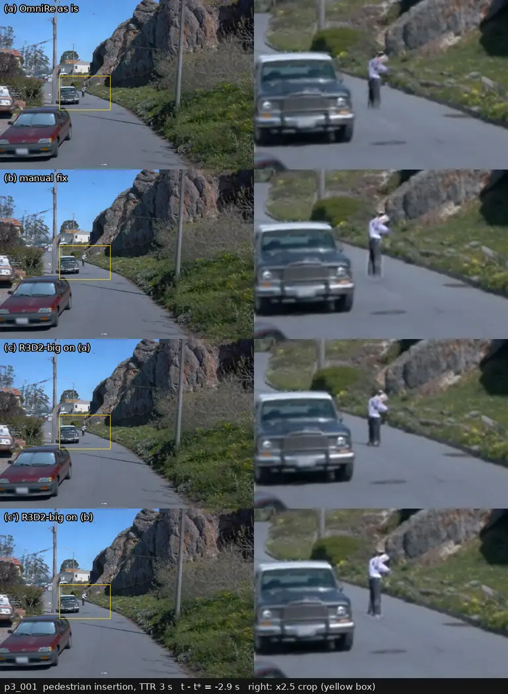
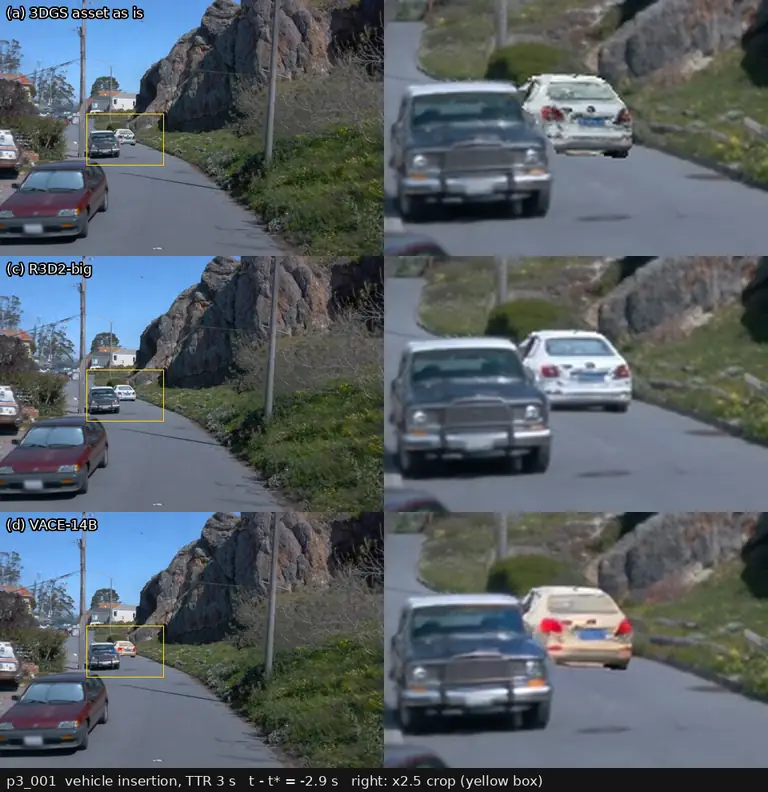
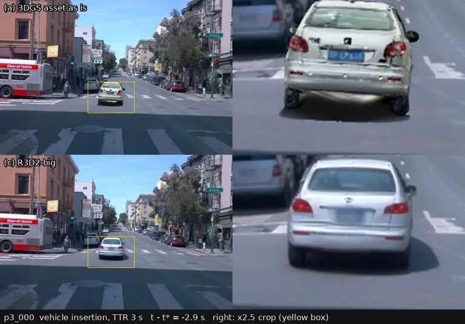

# 插入真实场景的行人和车辆：几条路并排比

2026-09-28。P3 的插入考题（把一个行人或一辆车放进 Waymo 录像重建出来的场景、本车车道里，重新渲染前相机）第一版被用户评为「像飘着的鬼影」：没有影子、脚不贴地、亮度和周围不一致。这篇把能用的几条路放在**同一个场景、同一组帧、同一个裁剪、同一套读数**下并排给出，供用户挑。背景和考卷设计在 [p3-exam-filter.md](p3-exam-filter.md)，过程和原始数字在 [tmp/2026-09-28-insertion-tools.md](../tmp/2026-09-28-insertion-tools.md)，代码 `scripts/p3/ins_tools.py`，表在 [results/nq4/p3/ins_tools/](results/nq4/p3/ins_tools/)。

## 比的是哪几条路

| 代号 | 做法 | 从哪来 |
|:--|:--|:--|
| (a) | OmniRe（drivestudio 的动态 3DGS 重建，每个行人、车辆是可单独移动的高斯节点）原样：行人是同一段里重建出来的真实行人节点刚体平移过去；车辆是 HUGSIM 发布的 3DRealCar 车辆高斯资产（真实车辆扫描重建出的 3DGS），按深度合成进 x⁺ | 第一版插入；车辆这一格是本次新做的 |
| (b) | 用户已批准的现行标准：P3 执行员的手工修正——脚贴 LiDAR 地面、局部曝光匹配（增益上限 1.33）、脚下一个接触阴影斑、视角差上限 20° | `scripts/p3/insert.py --fix`；只有行人 |
| (c) | **R3D2**（zenseact，CVPR 2026 Workshop）：一步扩散（SD-Turbo 底座）的「插入后处理」模型，专门在 Waymo 前相机的 3DGS 渲染图上训练，输入「贴进去但没影子、光照不对」的图，输出补上影子、改好光照的图；本次接在 (a) 后面 | 开源工具 1 |
| (c′) | R3D2 接在 (b) 后面 | 同上 |
| (d) | Wan2.1-VACE-14B（阿里的视频编辑扩散模型，支持给定 mask 只重画局部、跨帧一起生成）：把插入区域当 mask 交给它重画 | 开源工具 2，见下文状态 |

两个扩散模型输出的都是整帧，而且会把整张图都改一点（R3D2 原始输出在插入区域外对底图只有 34–37 dB PSNR）。所以每条路都只把工具输出**贴回插入区域**（行人或车辆框左右各扩 0.8 个框高、向下 0.45、向上 0.1，边缘 4 px 羽化），区域外逐像素就是底图（行人是 x⁻，车辆是 x⁺）。这保证了删除型 / 外观对照门看到的「未改区域」不受工具影响。

为什么只试这两个：调研（下一节）里满足「代码和权重都放出来、能在我们的 sm_120 卡上直接装、能对已有渲染做局部修改」的只有这两类；R3D2 是唯一在我们这个领域（Waymo 前相机的 3DGS 渲染）训练过、专做「插入物补影子和光照」的；VACE 是唯一跨帧一起生成、又能按 mask 只改局部的。其余要么没放代码，要么只做整帧重打光，要么依赖在 sm_120 上装不了的旧栈。

## 同一组帧上的对比

场景 p3_001（本车 5.8 m/s，晴天，路面上有很硬的影子）和 p3_000（城区路口），前相机 960×640，到达时间 3 s 的那一版，锚点前 2.9 s 到后 1.9 s 共 49 帧（10 Hz）。每段视频每行一个选项：左边整幅，右边是黄框处放大 2.5 倍，黄框每帧跟着插入物走、所有行用同一个框；底栏写相对锚点的时间。这里压成 5 帧每秒循环播放，全尺寸 10 帧每秒的 MP4 在 box 的 `runs/nq4/p3/ins_tools/<场景>/`。

p3_001 的行人，从上到下 (a)(b)(c)(c′)。看右栏脚下：(a) 腿下半截发虚、没影子；(b) 腿脚贴地、颜色和路面更接近，但接触阴影斑很淡；(c)(c′) 长出了鞋，脚下有一道朝左后方的投影，方向和场景里电线杆、车的影子一致，人也更清楚。

p3_001 的车辆，上 (a) 下 (c)。(a) 是典型的「贴上去」：车身过亮、车底和路面之间没有暗部、轮子下缘发虚；(c) 车底有一整块阴影，车身亮度降到和场景里的真车一个水平，轮胎和车尾细节被重画干净。

p3_000 的车辆，上 (a) 下 (c)。这一段 (a) 的资产自带了一块烘焙在高斯里的黑色地影（3DRealCar 资产底部那层暗高斯），看起来像一块黑毯子；(c) 把它变成一个柔和、贴合路面的影子，车身的脏污和破洞也被修掉了。

## 读数

所有读数都在同样的 49 帧上算；插入物的逐帧像素区域用 SAM 3.1（Meta 的开放词汇分割模型，文字提示 person / car）在每个选项自己的输出上分割，只取和插入物渲染框重叠最多的那个实例（49 帧全部分到）。

- **离地**：插入物最低一行像素，和它的地面接触点投到图上的那一行之差，按插入物的深度换成米；正数 = 悬空。行人的接触点是它在 LiDAR 地面上的位置，车辆是后轴正下方的地面（后悬按 0.7 m 算）。
- **影子**：插入区域下 70% 里、插入物 mask 外，比底图暗的程度累加（每个像素记 1 − 亮度比，压到 [0, 1]），除以插入物的像素数；「有影子的帧」= 这个值 ≥ 0.05 的帧占比。
- **亮度比**：插入物亮度中位数 / 周围一圈背景的亮度中位数。行人另报它和同一个人在录像原位置上的亮度比（0.888，P3 修正实测）差多少（取对数差的绝对值，越小越像原来那个人在这种光下的样子）。车辆没有录像参照，只列亮度比。
- **闪烁**：主体 = 插入物平均亮度逐帧差的标准差 / 平均亮度；周边 = 插入区域里、插入物以外的像素，逐帧变化减去底图同一处的逐帧变化，取绝对值平均（0–255 灰度），即工具额外带进来的「跳」。
- **未改区域 PSNR**：插入区域以外对录像的 PSNR；括号里是工具原始输出（贴回之前）对底图的 PSNR。

**行人（p3_001）**

| 选项 | 离地（m，中位 / \|·\| 的 90 分位） | 影子（中位；有影子的帧） | 亮度比（与录像里的同一人差多少） | 闪烁：主体 % / 周边灰度 | 未改区域 PSNR 对录像，dB（原始输出对底图） |
|:--|:--|:--|:--|:--|:--|
| (a) OmniRe 原样 | +0.06 / 0.08 | 0.00；2% | 0.75（0.17） | 2.4 / 0.19 | 29.52（—） |
| (b) 手工修正（现行标准） | −0.03 / 0.08 | 0.03；4% | 0.86（**0.03**） | **0.4** / 0.45 | 29.52（54.2） |
| (c) R3D2 接 (a) | +0.05 / 0.08 | 0.13；**100%** | 0.76（0.15） | 1.1 / 1.98 | 29.52（34.4） |
| (c′) R3D2 接 (b) | **−0.01** / 0.08 | 0.11；**100%** | 0.80（0.11） | 1.0 / 1.98 | 29.51（34.4） |

**车辆**

| 场景 · 选项 | 离地（m，中位 / \|·\| 的 90 分位） | 影子（中位；有影子的帧） | 亮度比 | 闪烁：主体 % / 周边灰度 | 未改区域 PSNR 对录像，dB（原始输出对底图） |
|:--|:--|:--|:--|:--|:--|
| p3_001 (a) 3DGS 资产原样 | +0.08 / 0.12 | 0.00；0% | 1.33 | **0.3** / **0.20** | 29.54（—） |
| p3_001 (c) R3D2 | +0.13 / 0.16 | 0.10；80% | 1.29 | 1.6 / 3.54 | 29.54（34.6） |
| p3_000 (a) 3DGS 资产原样 | −0.04 / 0.05 | 0.16；76%（资产自带的黑色地影） | 1.15 | 0.9 / 0.85 | 31.08（—） |
| p3_000 (c) R3D2 | **+0.00** / 0.07 | 0.25；96% | 1.00 | 1.6 / 2.64 | 31.07（36.7） |

读法：

1. **影子是 R3D2 真正解决的一项**：行人从 2–4% 的帧有影子变成 100%，车辆在 p3_001 从 0 到 80%，而且方向、软硬和场景已有影子一致（看视频）。(b) 的接触阴影斑在读数上几乎看不出来（0.03），肉眼也很淡。
2. **离地**：(b) 已经把行人贴到了 LiDAR 地面（−0.03 m），R3D2 接在 (b) 后面基本不动它（−0.01 m）；R3D2 接在 (a) 后面不会把悬空的人按下去（+0.05 m），它只在原位置画影子。车辆的离地是渲染几何决定的（资产放在拟合的 LiDAR 地面上），R3D2 把车底暗部画出来以后，SAM 分到的最低点在 p3_001 反而高了 5 cm——3–10 像素的量级，在这个距离和分割精度下分不开，算持平。
3. **亮度**：(b) 的曝光匹配把行人和录像里同一个人的亮度比差距从 0.17 降到 0.03，这一项 (b) 最好；R3D2 在 (b) 后面把它又拉开到 0.11（它按自己学到的光照重画了人）。车辆 (a) 明显过亮（周围亮度的 1.15–1.33 倍），R3D2 拉回 1.00–1.29。
4. **代价是时间上的「跳」**：R3D2 逐帧独立生成，插入区域里插入物以外的像素每帧额外变化约 2–3.5 个灰度级（(a)(b) 是 0.2–0.9）。放到 5 帧每秒看不太出来，但它确实存在，而且是 openpilot 这类吃时序的模型可能读到的东西；插入物主体的亮度抖动 1.0–1.6%，比 (a) 的 2.4% 低、比 (b) 的 0.4% 高。
5. **未改区域**：四条路贴回之后，区域外都等于底图（对录像的 PSNR 全在底图自己的 29.5 / 31.1 dB，差 ≤ 0.02 dB 来自羽化边）。不贴回的话，R3D2 会把整张图改到对底图只有 34–37 dB，删除型对照门就会被工具本身污染——**贴回是必须的**。

**(d) VACE-14B：下载中，结果待补。** 权重 69 GB，box 到 ModelScope / HF 的单连接只有 1–3 MB/s；下完后在同样的 49 帧上跑 (b) 行人和 (a) 车辆各一次，补进上面两张表和视频。

## 花费、装机风险和许可

| 选项 | 每个场景的额外花费（前相机，到达时间 2 / 3 / 4 s 和插入型对照共 4 个版本 × 49 帧） | 装机与风险 | 许可 |
|:--|:--|:--|:--|
| (a) 行人 | ≈ 0（插入渲染本身，全部 3 路相机 11 个版本约 7.5 卡·min） | 已在用 | drivestudio MIT |
| (a) 车辆资产 | 每个版本约 3.5–5 min（主要是加载数据集），4 个版本约 0.3 卡·h；渲染本身不到 1 s / 帧 | 新写的 gsplat 合成；资产有烘焙的地影和破损，挑资产要人看 | HUGSIM 的 HF 数据集标 MIT；3DRealCar 原始数据的许可未核实 |
| (b) | CPU 几分钟 | 已在用，用户已批准 | 自研 |
| (c) R3D2-big | 3.5–4.4 s / 帧（fp32，1080×1920 窗口，和别的任务共卡，峰值 14 GB）→ 4 × 49 帧约 12–14 min，≈ 0.2 卡·h / 类 | 纯 diffusers，无自定义 CUDA 算子，sm_120 上 10 min 装好；权重 4.4 GB（HF `bertaveira/R3D2-big`）；轻量版 R3D2 的 HF 仓库这次没下全，没测 | 代码 Apache-2.0；**权重仅限非商用**（Waymo 数据集许可 + Stability AI 社区许可） |
| (d) VACE-14B | 下载中，结果待补 | Wan2.1 代码 + 69 GB 权重（ModelScope）；flash-attn 没装，用 PyTorch SDPA | Apache-2.0 |

整套考卷按「行人 + 车辆各一类、每类 4 个版本、前相机」算：(c) 每个场景加约 0.4 卡·h，约为一次 OmniRe 重建（0.75 卡·h）的一半；按现在约 90 个车辆段 + 约 12 个行人段算，一共约 25–40 卡·h（车辆全部过 R3D2，行人只在有合格供体的段）。fp16 推理可能再省一半，没测。

## 调研里看过、没有试的

2026-09-28 逐个核过仓库、许可和最近提交（清单和出处在 [工作记录](../tmp/2026-09-28-insertion-tools.md#调研)）。按用户关心的四类：

| 类别 | 看过的 | 为什么没试 |
|:--|:--|:--|
| 可编辑的驾驶场景重建 | drivestudio / OmniRe 带 SMPL（MIT，要 SMPL 注册）、HUGSIM（MIT）、Street Gaussians、ChatSim、StreetUnveiler、SplatAD、NVIDIA 3DGRUT | 都不带插入物的影子和重打光；我们已有 OmniRe 重建，换重建器不解决问题。ChatSim 的 Blender 路线最接近，但代码停在 Blender 3.5 和 libtorch 1.13、无许可证 |
| 带光照 / 影子的插入 | **R3D2**（试了）、DiffusionRenderer / UniRelight（NVIDIA Cosmos 栈）、DiffusionLight-Turbo（估环境光）、UrbanCAD、LightSim、SceneCrafter | Cosmos 栈依赖 transformer-engine 1.12 + apex，sm_120 未验证，而且整帧重打光；UrbanCAD、LightSim、SceneCrafter 没放代码 |
| 可驱动的人体 | LHM（Apache-2.0，要 SMPL-X）、IDOL、HUGS、ExAvatar、GART、GauHuman、OmniRe 的 SMPL 节点 | 解决的是「人本身清不清楚、能不能换动作」，不解决影子和光照；OmniRe SMPL 节点要 SMPL 注册和 4D-Humans 预处理，是提高人本身质量时的下一步 |
| 视频扩散的局部协调 / 重打光 | **Wan2.1-VACE**（试了）、Wan2.2-Animate（换人 + 重打光 LoRA）、GenCompositor（许可未核实）、TC-Light、Light-A-Video、RelightVid、IC-Light、Cosmos-Transfer2.5、GPSDiffusion（单图补影子） | 多数整帧重打光，不能只改局部；GenCompositor 许可不明；GPSDiffusion 只有单图、作者自称不稳定 |

## 建议

暂定（VACE 结果出来后再定）：**车辆走 (a) + (c)，行人走 (b) + (c′)**，即渲染几何（贴地、深度合成）照旧由我们自己的管线负责，R3D2-big 只做最后一步「补影子、调光照」，输出只贴回插入区域。

理由：影子是 (b) 解决不了、R3D2 解决得最好的一项，车辆上的提升尤其大；离地和位置由几何决定，R3D2 不破坏 (b) 已有的贴地；贴回以后未改区域和底图逐像素相同，两道对照门不受影响；每个场景多花约 0.4 卡·h，在重建花费之内；装机无风险。

要接受的代价有三条：一是逐帧生成带来的周边轻微「跳」（2–3.5 灰度级），需要在插入型对照（把同一个插入物放到车道外）上确认 openpilot 不对它起反应——这一步本来就在登记的设计里；二是 R3D2 会重画插入物的细节（车标、车牌、破损），同一辆车在不同到达时间的版本里细节可能不完全一样，读数时 x⁺ 的几个版本要当作外观略有差异的同一类物体；三是权重只能非商用。
