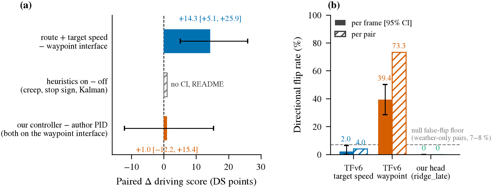
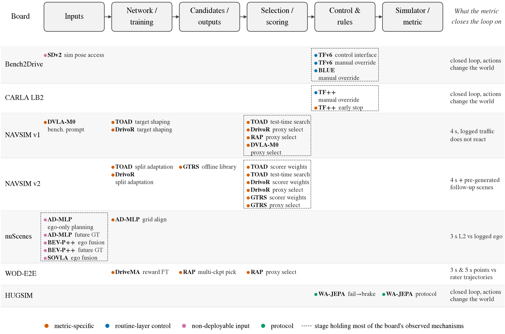
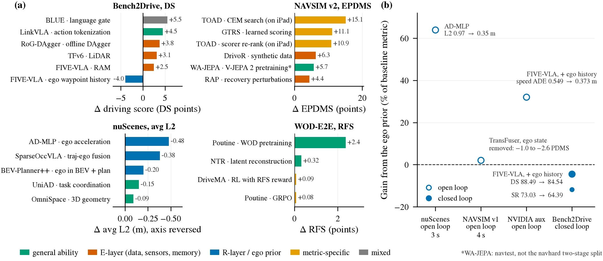
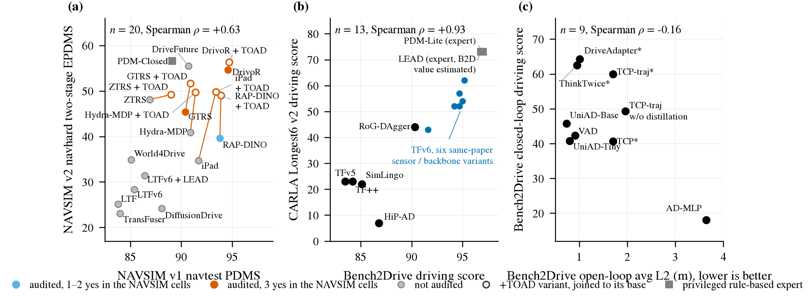
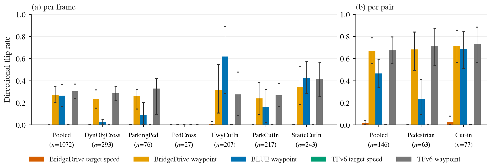

# 榜单分数与驾驶能力：两轮只读审计的综合判读

状态: 综合稿（2026-09-24）。这是对 [hack 审计](results/hack-audit/report.md)（第一轮）和
[榜单文本分析](results/leaderboard-text-analysis/HANDOFF.md)（第二轮）的综合判读，回答
[capability-vs-leaderboard.md](capability-vs-leaderboard.md) 里"高分从哪里来、分数能多大程度代表驾驶能力"这两个问题。
两轮都没有运行任何模型或评测，所以这里的每一个结论都是"文本能支持到哪一步"；实验只作为建议列出。
对第二轮留下的 45 个问题的逐条回应在 [synthesis_answers.md](results/leaderboard-text-analysis/synthesis_answers.md)。

读法约定：**结论**是材料直接支持的；**推测**是我们从材料外推的，每条都标明，并说明用什么实验可以验证。
"hack"在本文里指**只对榜单计分公式有意义、换一个协议或上真车就没有意义的增益机制**，不含道德判断；
第一轮的 codebook（`yes` 只表示固定代码里有该机制且有发现记录，不表示已证明它提高了主分数）在这里原样沿用。

## 0. 一页结论

**高分从哪里来**（第 3、4 节）。三类榜单三种构成，每类榜单的机制都长在它计分公式最敏感的那一段：

| 榜单 | 高分的主要成分 | 其中针对榜单的部分 | 证据强度 |
|---|---|---|---|
| Bench2Drive | 真实能力（gate、DAgger、tokenization、LiDAR、RAM）+ **控制接口** + 规则 | 接口 +14 DS（我们测的）、规则 ≈1、停着不动不扣分 | B（3 seed）到 A（我们的 48 对 CI） |
| CARLA LB2 | 视觉预训练、path/speed 解耦 | **早停**：同权重 DS ×5，RC ÷6，normalized DS 反降 | A−（同权重 3 次） |
| NAVSIM v1 | 表征（tokenization +13）、候选数、感知微调 | proxy scorer、长目标、RFT 把 TTC 打到 98；顶部 4 分基本是配方 | C |
| NAVSIM v2 | 合成困难场景（+6）、恢复数据（+4）、预训练 | **EPDMS 代理评分器**：五个基座 +TOAD 后全部收敛到 49–56，配方项 10–15 分 | C，但同权重 |
| nuScenes | **ego-state prior 独占**：速度 ×0.5 的伤害是图像全黑的 35 倍 | 未来标签命令（−0.06 m）、0.5 m 栅格对齐 | C / A−（探针） |
| WOD-E2E | 领域数据（+2.4 of 2.5）、表征 | RFS 当奖励只 +0.08，且难例反降 | C |
| HUGSIM | 视频预训练（WA-JEPA） | 失败制动回退可继续计分（路径存在，未证发生） | — |

**分数和驾驶能力的关系**（第 5、6 节）。跨榜排序只在两种情况下一致：同代码族内的 scaling（TFv6 六变体 B2D↔Longest6 ρ=0.87）和代际分层（TransFuser 一代 vs scorer 一代）。去掉这两样，B2D↔Longest6 n=5 ρ=0.05，NAVSIM v1↔v2 顶部 n=11 ρ=0.21。开环 L2 与闭环 DS 无关（ρ=−0.16），与 Efficiency 同向（−0.69），DS 与 Comfortness 反向（−0.75）：L2 和 Efficiency 都在奖励 continuation，DS ≈ SR ≈ "触发场景过没过"。同一个 ego prior 在 nuScenes 解释全部分数，在 B2D 闭环上是负的（FIVE-VLA −3.95 DS）。评测噪声：B2D 第 2–6 名间距 <0.7，全部在训练 run 间 ≈1.5 的噪声内；Longest6 单次噪声 ±5–8 大于 B2D 前 7 名的总差距。nuScenes 榜前六名没有一条能从公开材料重算。

**哪些榜单的高分能当能力证据**：Longest6 / LB2 的 RC、NAVSIM v2 的 LK / TLC / EC 子项、HUGSIM RC 乘子可当 R 层证据；**只有 Bench2Drive SR**（和 Longest6 的 IP）可当 E 层证据，WOD RFS 是没有后果的意图级 E 层；nuScenes L2、NAVSIM v1 顶部 4 分、跨长度的 DS 绝对值不能当任何一层的证据。**没有一个榜单单独报告"突发事件时反应对不对"**。

**对我们的含义**（第 7 节）。骨架里"R 层配方不稀缺、E 层稀缺"的判断成立：W1 全部 1,121 行里能归到 E 层的增益只有四条（RAM 的 Give_Way +26.7、DAgger 的 SR、LiDAR 的 SR、RAP 恢复数据 v1 0.0 / v2 +4.4），全部只在闭环或反应式协议里显形。R 层可以直接移植：控制接口 + 作者 PID、route target point、path/speed 解耦、规则（标定后）、测距传感器。值得提取的 E 层来源目前只有一个确证的：TFv6 的 waypoint 通道（P5 定向翻转 39%，按对 73%；拿分的 target speed 通道 2%）。我们的 CARLA 配对考试要防 12 条攻击面（7.3 节），其中四条是从七榜的盲区直接翻译过来的：停着不动是安全的、读哪个通道答案差 20 倍、规则层替代反应、窗口由谁定义。

**最值得先跑的两个实验**（7.4 节，都没有跑）：TFv6 规则开/关 × 接口 A/B 上 P5 配对（回答"拿分通道不反应"是接口性质还是规则掩盖）；SimLingo 同 ckpt 原版 vs 定制 Bench2Drive 目录（simlingo#43 里 DS +11 而 SR 一条未变，若复现则 SimLingo 系四个方法的 B2D 分数要重标）。

看什么：同一个 TFv6 checkpoint 的两条通道。(a) 用 route + target speed 走比用自己的 waypoint 走高 14.3 DS，CI 不跨零；启发式和换控制器都只有约 1 且 CI 跨零。(b) P5 配对考卷上，拿分的 target speed 通道逐帧翻转 2.0%（低于 7–8% 的 null 地板），会反应的 waypoint 通道 39.4%、按对 73.3%；我们的 `ridge_late` head 是 0。拿分的那一路几乎不对突发事件反应，会反应的那一路开起来低 14 DS。

## 1. 材料与口径

| 轮次 | 覆盖 | 产出 | 复核 |
|---|---|---|---|
| 第一轮 hack 审计 | 7 榜 36 个条目，20 个有代码的方法单元（A 档 16、B 档 4），14 个 C 档排除，2 个 privileged 规则基线 | 19 类 codebook，20×19 矩阵（33 个 `yes`，落在 17 个单元），35 条 finding | 三位无上下文代理，最终 25/26 一致（96.2%） |
| 第二轮 W1 增益归因 | 31 个方法的论文 ablation | 1,121 行「配置对 × 指标 × split」账本 | 113 条抽查 93.8% |
| 第二轮 W2 跨榜 | 204 个已发表分数 | 10 组 n ≥ 5 的 Spearman | 21 条抽查 90.5%，ρ 全部复算一致 |
| 第二轮 W3 复现 | 20 个仓库 658 个 issue | 113 条筛选记录 | 修订后 91.7% |
| 第二轮 W4 指标 | 七榜官方计分代码固定 commit | 7 页公式 + 24 条攻击面 | 90% |
| 第二轮 W5 无代码方法 | 14 个 C 档方法 | 45 条论文披露 | 修订后 100% |

两条贯穿全文的边界：(1) 35 条 finding 里 21 条的影响证据是 `none`，其余的量化对照也多不是同权重单项消融，所以**没有任何一个榜单能给出"多少百分比不是驾驶能力"的可信数字**；
(2) 七个榜单是七个不同的任务（三个闭环 DS/HDS、两个 NAVSIM 伪仿真、一个 nuScenes 3 s 开环、一个 WOD 人工偏好评分），跨榜只能比排序，不能比分值。

## 2. 七个榜单各自在测什么（W4 计分代码）

先把计分公式摆出来，后面每一条"高分从哪里来"都要对着它读。

| 榜单 | 公式（固定 commit 的代码事实） | 测到 R 层什么 | 测到 E 层什么 | 结构性盲区 |
|---|---|---|---|---|
| Bench2Drive 0.0.3，220 条短路线 | `DS_route = RC × ∏ 违规因子`，行人 0.5 / 车 0.6 / 静物 0.65 / 红灯 0.7 / 停牌 0.8；**最低速度项 `unused`**；静止 ego 被撞不计；卡住 60 s 终止 | 沿路线走完、过路口、按灯停、起步不卡住 | 每条路线嵌一个 scenario，碰撞/闯灯扣分直接对应 E 层事件 | 慢开不扣分；舒适度、接管不入公式；DS 与 SR 之外的 Efficiency/Comfortness 单列 |
| CARLA LB2，长路线 | 同乘积公式，另有最低速度因子 `1−0.3(1−p/100)`；180 s 低速 blocked；**未到终点仍按 RC×IP 记分** | 长距离连续驾驶 | 同上 | **乘积结构下提前停车可提高 DS**（LB2-TFPP-001）；DS 与"完成"是两个字段 |
| NAVSIM v1.1 navtest，PDMS | `NC×DAC×(5TTC+5EP+2C)/12`，4 s 非反应式回放；**v1.0 曾把 DDC 乘进去，v1.1 改零权** | 4 s 内沿可行驶区域前进、不撞回放车 | 只有"对已记录的未来不撞"，背景车不响应 | 逆行不扣分（v1.1）；`speed<0.005` 时 TTC 免罚；EP 按同组 proposal 归一 |
| NAVSIM v2.2 navhard，EPDMS | `NC×DAC×DDC×TLC×(5EP+5TTC+2LK+2HC+2EC)/16`，human 同项为 0 时 agent 豁免；伪闭环：首段终点到合成后续场景起点的距离 `exp(−d²/0.2)` 加权 | 加了 lane keeping、红灯（TLC）、恢复 | 合成后续场景给了一点"扰动后恢复"的代理 | 后续场景是预生成的，不按 agent 动作重仿真；首段终点能改后续场景的计分混合；v2.0 与 v2.2 聚合不同 |
| nuScenes 开环，UniAD 实现 | 1/2/3 s 的 L2；碰撞率按 0.5 m BEV 栅格；GT 本来就碰撞的时刻不计 | **只有** ego 自身运动延续 | 无（不仿真、不反应） | 各论文 L2/碰撞实现、ego 输入、样本数都不同 |
| WOD-E2E，RFS | 只取 **3 s 与 5 s** 两个点对人工轨迹的横/纵投影误差，`label×0.1^{max(u−1,0)}`，两轴分别取最优 rater 再平均；区外下限 **4.0** | 5 s 内与人类建议轨迹的几何相符 | 人工 rater 打的是"这样开对不对"，间接含 E 层判断 | 中间 18 个点不计；两个时刻可匹配不同 rater；无碰撞、无交互 |
| HUGSIM 436 场景，HD-Score | 每关键帧 `NC×DAC×(5TTC+2C)/7`，**EP 被注释掉不进单帧**，最后乘 `min(max RC, 1)` | 在 3DGS 场景里沿路走 | 只对 `obj_names=='car'` 做框碰撞；行人/骑行者不在框检查里 | 静止/制动轨迹能保住单帧子分数；失败回退后场景继续计分（HUG-WA-002） |

**结论。** 七个指标里只有三个闭环（B2D、LB2、HUGSIM）真的让 agent 的动作改变世界；NAVSIM 两版是"对固定未来打分"，nuScenes 和 WOD 是"对一条轨迹打分"。
E 层（突发反应）在公式里出现的方式只有两种：闭环里的碰撞/闯灯扣分，或 rater 对轨迹的偏好。**没有一个榜单单独报告"突发事件时反应对不对"**。

## 3. 第一轮：每个榜单里看得见的机制

把 35 条 finding 按"影响证据"分三档：有同权重量化对照、有论文内部对照但不是单项、完全没有。

| 榜单 | 单元 | 机制（codebook 类） | 披露 | 影响证据 | 我们的归类 |
|---|---|---|---|---|---|
| B2D | TFv6 | `control_interface_selection`（route + target speed 而非 waypoint） | partial | 第一轮 `none`；**我们自己的第 31 条：同 checkpoint +14.3 DS [5.1, 25.9]** | R 层接口，可移植 |
| B2D | TFv6 | `manual_control_override` ×2（creeping、停牌规则） | yes | README 三项启发式联合 95→94 | R 层规则，可移植，量小 |
| B2D | BLUE | `manual_control_override`（静止 800 帧强制油门） | no | none | R 层规则 |
| B2D | SparseDriveV2 | `simulator_pose_access`（SENSORS agent 读 CARLA actor 真值位姿） | no | none | 不可部署；影响未知 |
| LB2 | TF++ | `metric_early_termination`（1.5 km 主动停车） | yes | Town13 val 同模型 0.96→5.10 DS | **纯 metric**，不可部署 |
| LB2 | TF++ | `manual_control_override` ×2 | no | none | R 层规则 |
| NAVSIM v1 | DrivoR / RAP / DriveVLA-M0 | `metric_proxy_candidate_selection`（学 PDMS 子分数后 argmax 选轨） | yes | DrivoR Table 6：单总分 88.2→六子分数 90.0（设计消融，非有/无选择器） | metric-specific |
| NAVSIM v1 | DrivoR、TOAD 基座 | `benchmark_target_shaping`（延长目标偏进度） | yes | **navval PDMS +0.6，同时 v2 warmup EPDMS −1.6** | metric-specific，且跨协议反向 |
| NAVSIM v1 | TOAD | `metric_proxy_test_search`（CEM 优化学得评分器） | yes | 论文 +0.1 PDMS；README 版 +0.3（含更多变化） | metric-specific |
| NAVSIM v1 | DriveVLA-M0 | `benchmark_prompt_specification`（系统提示写明 PDMS 权重和非反应式） | partial | none | metric-specific（低置信） |
| NAVSIM v2 | TOAD | `metric_proxy_test_search` | yes | **54.6→56.3 EPDMS（+1.7）**；scorer reward 消融 iPad warmup 35.7→48.5 | metric-specific |
| NAVSIM v2 | DrivoR / TOAD | `manual_scorer_reweighting`（子分数权重 10/13/6/14/15 替代官方 1/1/1/5/5） | yes | none | metric-specific |
| NAVSIM v2 | DrivoR / TOAD | `benchmark_split_adaptation`（在与 navhard 交集的 warmup 上调参，主办方认可） | yes | none | metric-specific |
| NAVSIM v2 | GTRS | `metric_proxy_candidate_selection` + `manual_scorer_reweighting` + `offline_candidate_library` | yes/partial | 旧协议候选池 +1.1；不能分解修复后 45.4 | metric-specific + 候选覆盖 |
| NAVSIM v2 | DrivoR | `metric_proxy_candidate_selection`（v1 式六项代理选 v2 候选） | yes | Table 3：同 ViT-S，GTRS 头 45.8 → DrivoR 头 48.3（+2.5） | metric-specific |
| nuScenes | AD-MLP | `ego_only_open_loop_planning` + `future_label_conditioning` + `metric_grid_alignment` | yes | 只历史轨迹 0.97 m → 加速度、速度 0.35 m → 加未来命令 0.29 m | R 层 prior（0.97→0.35）+ 泄漏（0.35→0.29） |
| nuScenes | BEV-Planner++ | `ego_state_fusion` + `future_label_conditioning`（测试管线从未来 GT 造命令） | yes/partial | 无 ego 0.55 → BEV 加 0.46 → 规划头也加 0.35 m | R 层 prior + 泄漏（未消融） |
| nuScenes | SparseOccVLA | `ego_state_fusion` | yes | 去 Traj-Ego Fusion：均值差约 0.197 m | R 层 prior |
| WOD | DriveMA | `metric_reward_finetuning`（官方 RFS 当 RL 奖励） | yes | 7.893→8.009→8.060（含 RL 与其他奖励） | metric-specific（含人类偏好成分） |
| WOD | RAP | `metric_proxy_candidate_selection` + `multi_checkpoint_candidate_selection` | yes/partial | none | metric-specific |
| HUGSIM | WA-JEPA | `simulator_protocol_dependency`（控制器修正，统一重测）+ `inference_failure_brake_fallback` | yes/no | none | 协议事实 / 潜在污染 |
| HUGSIM | UniAD、LTF | 无 | — | — | LTF 固定直行命令可能反而伤转弯 |
| WOD | AutoVLA | 无最终 finding | — | — | — |

**读法。** 三类榜单的机制完全不同：**闭环 CARLA 系**的机制全是控制层（接口、规则、早停），网络本身没被动；**NAVSIM 系**的机制全在"候选 → 评分 → 选择"这一段，且 v2 榜前三名（TOAD、DrivoR、GTRS）每个都有 3 个 `yes`；
**nuScenes** 的机制是输入侧（ego 状态、未来标签）；**WOD** 是把评分函数直接放进训练。这个分布不是偶然：每类机制都恰好长在该榜计分公式最敏感的那一段上（第 2 节表的"盲区"列）。

看什么：横轴是从传感器到分数的六段流水线，每行一个榜单，圆点是第一轮在该榜样本方法里实际观察到的机制（矩阵的 33 个 `yes`），虚线框标出该榜机制最集中的那一段。CARLA 系全落在 Control & rules，NAVSIM 系落在 Selection / scoring，nuScenes 落在 Inputs，WOD 是 metric-reward 微调；最右列是该 metric 到底闭环了什么。

## 4. 高分从哪里来：论文自己的 ablation 说了什么（W1）

W1 账本 1,121 行里主榜 872 行；有 seed 的只有 69 行（TFv6、BLUE、SimLingo-BASE、LTF），有样本数的 262 行。
所以下面凡是 |Δ| 小于 1 DS / 1 PDMS / 0.05 RFS / 0.03 m 的差值，都只能当"方向未定"。证据等级按：
**A** 同权重（same_weights / test_time_updated）且有 seed 或样本数；**B** retrained 但有多 seed；**C** 单次；**D** 混 checkpoint、图读数、多因素同变。

### 4.1 每个榜单增益最大的成分

| 榜单 | 增益最大的成分（Δ 主指标） | 类别 | 级 | 出处 |
|---|---|---|---|---|
| Bench2Drive | BLUE language gate：SimLingo 85.07→90.58（+5.51，SR +8.91） | 一般能力，**但约一半来自"关掉"语言分支**（无语言 SR 69.55 > 全语言 66.91；gate 76.18） | B | blue T1/T7 |
| | RoG-DAgger offline DAgger：同 backbone 86.59→90.34（+3.75，SR +7.15） | E 层（恢复分布外状态；SR 涨幅大于 DS） | C | rog_dagger T4 |
| | LinkVLA action tokenization：85.07→89.57（+4.50） | 表征 | C | linkvla T5 |
| | TFv6 LiDAR：91.6→94.7（+3.1，SR +6.1）；radar 单加 +2.6，两者叠加 +0.3 | E 层感知（"有一个测距传感器"），**B2D 的 220 条短路线以碰撞类 scenario 为主，被榜单放大** | B | tfv6 T5 |
| | FIVE-VLA RAM：88.49→90.95（+2.46）；同权重推理 bypass→accumulation +2.72；**Give_Way 50.00→76.67，Emergency_Brake 81.67→87.78** | **E 层，账本里唯一能落到具体突发场景的证据** | A−/C | five_vla T4/T7/T8 |
| CARLA LB2 | 视觉预训练：去掉后 6.87→0.45 | 一般能力 | D | carllava T2 |
| | **早停**：同权重 1300 m 3.93 / 1800 m 4.49 / 2100 m 6.87 / 2400 m 6.35；TF++ Town13 同模型 DS 0.96→5.10 而 RC 68.5→11.5、normalized DS 4.94→2.27 | **纯 metric**：唯一有 RC 的对照显示归一化分数**下降** | A−/D | simlingo_base T9; tfpp T5 |
| | Kyber-E2E 把 privileged 检测/跟踪换成真实模块：27.25→7.76 / 11.84 | E 层感知是长路线的死因 | C | kyber T-I |
| NAVSIM v1 | AutoVLA action tokenization：67.63→80.54（+12.91） | 表征 | C | autovla T6 |
| | AutoVLA RFT（PDMS 奖励）：80.54→89.11（+8.57），**TTC 88.06→98.04** | metric-specific：子分数被打满 | C | autovla T1 |
| | DrivoR 候选数 1→8：80.1→87.6（+7.5）；8→64 +2.4；64→128 0 | 候选覆盖 + 评分头选轨 | C | drivor T5 |
| | DrivoR 六子分数 vs 一总分：88.2→90.0（+1.8） | metric-specific（把 PDMS 公式结构写进网络） | C | drivor T6 |
| | TOAD CEM：ZTRS +2.1、iPad +1.7、GTRS/Hydra +0.5、RAP/DrivoR +0.1 | metric-specific，**随基模型强度递减到零** | C | toad T1 |
| NAVSIM v2 | TOAD CEM：iPad 34.7→49.8（+15.1）、RAP +9.4、Hydra +8.8、GTRS +6.3、ZTRS +1.1、DrivoR +1.7；**五个非 DrivoR 基模型全部收敛到 49–52** | metric-specific | C | toad T2 |
| | 其中 iPad 只换 DrivoR 评分器重排、不搜索：34.7→45.6（+10.9）；换 GTRS 评分器搜索 →23.9；Hydra + SparseDriveV2 评分器 →9.5 | **增益属于评分器，不属于搜索**；搜索只放大评分器的偏差 | C | toad T3/T7 |
| | GTRS 学得评分头：random 25.6→scored 36.7（+11.1，旧协议） | metric-specific | C | gtrs T1 |
| | DrivoR 合成数据：48.3→52.3→54.6（+6.3） | E 层（推测；预算未配平） | C | drivor T3 |
| | RAP 恢复扰动数据：**v1 0.0，v2 +4.4** | E 层，且证明 v1 不奖励恢复 | C | rap T6 |
| | WA-JEPA V-JEPA 2 预训练：83.1–83.8→89.5（navtest） | 感知 | C | wa_jepa T4 |
| WOD-E2E | Poutine 领域预训练：5.59→7.95（WOD）/ 7.74（CoVLA）；两者合并再 +0.17 | 数据决定 95% | C | poutine T1 |
| | NTR latent reconstruction：+0.29–0.32 | 表征 | C | ntr T5 |
| | DriveMA 四段累计 +0.319；**RL（RFS 奖励）段 overall +0.085 但 spotlight 难例 −0.102** | RL 段 metric-specific：抬均值、不抬难例 | C | drivema T3 |
| | Poutine GRPO（416 个偏好标注场景）：test 7.91→7.99 | metric-specific，量级 1% | C | poutine §Results |
| nuScenes | AD-MLP ego 加速度：L2 0.97→0.49（−0.48）；+速度 0.35；+未来命令 0.29 | **R prior 独占**，无感知 | C | ad_mlp T1 |
| | SparseOccVLA Traj-Ego Fusion：L2@3s 0.68→0.30（−0.38）；其余三项合计 −0.24 | R prior | C | sparseoccvla T4 |
| | BEV-Planner++ 自身：ego in BEV −0.09、ego in plan −0.11；历史帧 −0.02 | R prior | C | bev_planner T1 |
| | VAD-Base 探针：速度 ×0.5 → L2 +2.82 m；图像全黑 → +0.09 m | **对 ego 速度的依赖是对图像的 35 倍** | A− | bev_planner T2 |
| HUGSIM | DrivoR+TOAD 零样本：nuScenes +10.2、PandaSet +2.9、KITTI360 +0.7、**Waymo −1.4**；NC/TTC/Comfort 全升、RC 三降一升 | 同一 same_weights 后处理在闭环上方向不定 | C | toad T4 |

### 4.2 三类榜单三种增益构成（结论）

- **nuScenes**：top-3 全是 ego-state prior。这个榜测的是 R 层 continuation prior 的拟合精度，视觉几乎不参与。
- **NAVSIM v2**：top-2 都是 EPDMS 代理评分器（TOAD、GTRS）。v2 navhard 榜首位置基本被评分器方法占据；无评分器的方法（WA-JEPA 91.7 是 navtest；DriveFuture 无 GTRS-Dense scorer 时 34.6，提交 55.5）不在榜首。
- **Bench2Drive**：top-5 是真实能力（gate、DAgger、tokenization、LiDAR、RAM），并且 FIVE-VLA 的能力分项把 RAM 定位到 Give_Way / Emergency_Brake。但 B2D 也有账本没覆盖的规则/接口部分（第 3 节）：TFv6 从 Table 3 的 89.29 到 Table 5 的 91.6（360° camera 基线）之间有 +2.3 的空档，正是论文未消融的"规则 + 数据量 + 控制接口"。
- **WOD-E2E**：数据（领域预训练）决定 95%，RFS 直接优化的段落只加 0.08–0.09，而且在难例上反降。

看什么：(a) 四个榜单各自增益最大的成分，颜色是我们的归类。Bench2Drive 的条几乎全是能力（绿、橙），NAVSIM v2 的三根最长的条全是 metric-specific（黄），nuScenes 的三根最长的条全是 ego prior（蓝），WOD 由数据（绿）决定、RFS 直接优化只有 +0.08–0.09。(b) 同一个 ego prior 在四个协议上的符号：短时开环上解释 30–64% 的分数，NAVSIM 4 s 上只值 2%，Bench2Drive 闭环上是负的。

### 4.3 hack 机制 ↔ 量化证据

35 条 finding 里只有 12 条在账本里有行，23 条零量化证据。按证据强度：

| 证据 | hack 机制 | 数字 |
|---|---|---|
| 同权重量化 | 早停（TF++ Town13） | DS ×5，RC ÷6，normalized DS 降 |
| 同权重量化 | TOAD CEM（v1/v2/HUGSIM） | v1 +0.1–2.1；v2 +1.1–15.1；HUGSIM −1.4–+10.2 |
| 同权重探针 | ego prior 依赖度（VAD-Base 速度扰动） | ×0.5 → +2.82 m |
| retrained 量化 | DrivoR 长目标 | **v1 +0.6 / v2 −1.6**（跨协议反向，最干净的"针对公式"证明） |
| retrained 量化 | DrivoR 六子分数、GTRS 评分头与词表、AD-MLP ego 输入、DriveMA RL | +1.8；+11.1/+3.0（旧协议）；−0.62 m；+0.085 |
| **零量化证据** | 全部 manual_control_override（TF++/TFv6/BLUE 停牌、蠕行）、control_interface_selection（TFv6）、simulator_pose_access、manual_scorer_reweighting ×3、benchmark_split_adaptation ×2、benchmark_prompt_specification、multi_checkpoint_candidate_selection、metric_grid_alignment、RAP 与 DriveVLA-M0 的候选选择 | — |

这些空白不是"没有效果"。对其中最大的一项，**我们自己补上了数字**：TFv6 的 `control_interface_selection`，同 checkpoint、48 对、cluster bootstrap，route + target speed 比 waypoint 高 14.3 DS [5.1, 25.9]、SR 高 29 个百分点（decisions 第 31 条）。这一项比账本里 B2D 任何一个论文消融都大。

### 4.4 没用技巧也拿高分的方法做对了什么

无 hack finding 且主榜有干净消融的方法：

| 方法 | 榜 / 分 | 增益来源 | 备注 |
|---|---|---|---|
| FIVE-VLA | B2D 90.95 | 结构：RAM（+2.46；推理同权重 +2.72）；感知：FastViTHD（+2.61） | 增益落到 Give_Way / Emergency_Brake；预算配平后仍 +2.25 |
| RoG-DAgger | B2D 90.34 | 训练数据：offline DAgger（同 backbone +3.75） | 收益在 SR，是恢复能力 |
| LinkVLA | B2D 91.01 | 表征：action tokenization（+4.50）；language-action alignment（+1.16） | 逐级消融，第一级占 75% |
| SteerVLA | B2D 90.71 | 结构：hierarchical meta-action（+2.87）；grounded reasoning labels（+1.90） | 复合改动 |
| BLUE | B2D 90.58 | 结构：0.11M 参数 gate（+5.51） | 一半是"关掉语言" |
| WA-JEPA | NAVSIM navtest 91.7 | V-JEPA 2 预训练（+5.7–6.4）；joint world-action + flow matching（约 +2） | 全 retrained，无 seed |
| NTR | WOD 8.05 | latent reconstruction（+0.32） | |
| Poutine | WOD 7.99 | 领域预训练（+2.36） | GRPO 只 +0.08 |
| OmniSpace | nuScenes 0.28 | 3D 几何蒸馏 + Plücker ray + epipolar（合计 −0.09 m） | ego prior 之外能拿到的全部空间 |

共同点：增益都能落到"训练时改了什么"，而不是"推理时怎么选"。它们在 B2D 上齐刷刷停在 90–91 这一档，与 TFv6 95.2 的差距主要是 LiDAR（+3.1）加规则/接口（账本外，我们测到接口 +14 是相对 waypoint 而言）。**推测**：B2D 上 90→95 这 5 分不是智能差距，是传感器和控制接口的差距；验证方法是给任一 VLA 方法接上 TFv6 的 route + target speed 接口和 LiDAR 安全框重跑。

**2026-09-26 就地修正**：上面「接口」一项用错了比较对象。第 31 条的 +14 是 TFv6 内部 route + target speed 对它自己 waypoint 的差；SimLingo 系本来就输出 path + speed waypoint 加两个 PID（FIVE-VLA p.7），已经是解耦接口，所以 +14 解释不了 VLA 与 TFv6 的差距。TFv6 纯相机 91.6 已与 VLA 同档，传感器那一项是 B 级证据；规则约 1 且双方都有；95.2 在第三方单 ckpt 重跑里是 89.6（decisions 第 38 条），差距是否存在未定。此外 FIVE-VLA 的 Give_Way 76.67 超过该项 50% 的上限（YTEV 所有学习式方法 SR 0），RAM 的 E 层证据改以同权重推理 +2.72 DS 为主。复核全文见 [nohack-mechanisms.md](nohack-mechanisms.md)。

### 4.5 ego prior 在各榜上的符号

这是对 R 层最直接的证据：

| 协议 | 操作 | Δ | 读法 |
|---|---|---|---|
| nuScenes 开环 3 s | 加 ego 状态（AD-MLP / BEV-Planner++ / SparseOccVLA） | −0.62 / −0.20 / −0.38 m | prior 解释了 1.0→0.3 m 的几乎全部距离 |
| NAVSIM v1 navtest | LTF 去 ego 状态 | −1 到 −2.6 PDMS | prior 只值一两分 |
| Bench2Drive 闭环 | FIVE-VLA 显式喂 3 / 10 个自身历史 waypoint | **DS −3.95 / −2.54，SR −8.64 / −3.03** | prior 在闭环**减分** |
| aux:nvidia 开环 | 同一改动 | speed_ADE 0.549→0.373 | 同一改动开环加分 |

**结论**：同一个 R 层 prior，短时开环上饱和，闭环上是负的。这与 causal confusion / copycat 文献一致，也与我们 P0/P1 的"RFS 口径上 ego-only 排第一"一致。
**推测**：E 层能力只在闭环或反应式协议里显形（RAM 的 Give_Way、DAgger 的 SR、LiDAR 的 SR、RAP 恢复数据 v1 0.0 → v2 +4.4）。

## 5. 跨榜一致性：排序能互相当证据吗（W2）

W2 的 10 组 Spearman 全部复算一致。但机械 ρ 会被同论文变体和 privileged expert 撑起来，下面按子集拆开。

### 5.1 三个总相关拆开看

| 配对 | 全样本 | 拆开后 | 读法 |
|---|---|---|---|
| Bench2Drive DS ↔ Longest6 DS | n=13，ρ=+0.93 | 去掉 TFv6 同论文 6 个变体和 LEAD / PDM-Lite 两个 expert：**n=5，ρ=+0.05**；只看 TFv6 6 变体：ρ=+0.87 | 相关来自"同一代码族内 scaling 两榜同向"，不是"短路线预测长路线"。独立方法 B2D 83.5–90.3 的 7 分窗口对应 Longest6 7–44。HiP-AD：B2D 86.8（高于 SimLingo/TF++）而 Longest6 DS 7、RC 56 |
| NAVSIM v1 PDMS ↔ v2 navhard EPDMS | n=20，ρ=+0.63 | PDMS ≥ 90 的顶部：**n=11，ρ=+0.21**；PDMS < 90 的底部：n=9，ρ=+0.67；TOAD 作者用同一公开 checkpoint 两榜各测一遍的 7 个方法：ρ=+0.25 | +0.63 是"代际分层"：TransFuser 一代两榜都垫底。顶部 11 个方法 v1 挤在 4.3 分里、v2 散在 21.6 分里，v1 对 v2 排序无信息 |
| B2D 开环 L2 ↔ 闭环 DS / SR / Efficiency / Comfortness | n=9 | L2↔DS −0.16、↔SR −0.05、**↔Efficiency −0.69**；DS↔SR **+0.99**（n=30）；**DS↔Comfortness −0.75** | L2 和 Efficiency 都奖励 continuation；DS ≈ SR ≈ "触发场景过没过"；Comfortness 惩罚急刹。L2 最低的 UniAD/VAD 三个 Efficiency 124–158（比周围车快），DS 只有 40–46 |

看什么：同一方法在两个协议上的已发表分数。(a) NAVSIM v1 PDMS 对 v2 EPDMS，n=20，ρ=+0.63，但顶部 11 个方法 v1 挤在 4 分里、v2 散在 22 分里；空心点是 +TOAD 变体，连线朝上更陡，test-time search 在 v2 上抬得比 v1 多。(b) Bench2Drive DS 对 Longest6 DS，ρ=+0.93 主要靠右上角 TFv6 六个同论文变体撑起，灰方块是 privileged expert；HiP-AD 在左下角。(c) Bench2Drive 开环 L2 对闭环 DS，ρ=−0.16。

**结论**：能互为证据的配对只有两种：同代码族内的 B2D↔Longest6（scaling 方向），和 NAVSIM v1↔v2 的代际分层（能把 TransFuser 一代和 scorer 一代分开）。不能互为证据的：nuScenes L2↔任何闭环、WOD RFS↔PDMS（n=5，ρ=0.10，且 2/5 直接优化 RFS）、B2D L2↔DS、HUGSIM 的所有 n≤4 配对、跨路线长度的 DS 绝对值。

### 5.2 v1→v2 谁掉得最多：不是 hack `yes` 最多的

| 方法 | PDMS → EPDMS | 秩变化 | 该榜 hack yes | same_checkpoint |
|---|---|---|---|---|
| RAP-DINO | 93.8 → 39.6 | #4 → #13（+9） | v1: 1（学 PDMS 总分选轨） | **yes（全表唯一）** |
| iPad | 91.7 → 34.7 | #6 → #15（+9） | 未审计 | unknown |
| DrivoR | 94.6 → 54.6 | #2 → #4（+2） | v1: 2；v2: 3（含 v2 专用改权、交集 warmup 调参） | unknown |
| DrivoR + TOAD | 94.7 → 56.3 | #1 → #2 | v1: 2；v2: 3 | unknown |
| GTRS | 90.4 → 45.4 | #11 → #11 | v2: 3 | unknown |
| PDM-Closed（privileged 规则） | 89.1 → 56.6 | **#12 → #1** | — | n/a |

**结论**：hack yes 数量度量的是"有没有一个可按榜单重调的 scorer"，不是"排名脆弱"。yes 最多的 DrivoR / TOAD / GTRS 在 v2 上都**重调过**（子分数权重 10/13/6/14/15 替代官方 1/1/1/5/5，在与 navhard 交集的 warmup 上选），所以秩守住；唯一同权重直接评的 RAP-DINO 掉 54 分、9 个秩。

配方项的大小可以直接量出来。同一套 TOAD CEM 搜索加在不同基座上：

| 基座 | v1 增益 | v2 基座 → +TOAD | v2 增益 |
|---|---:|---|---:|
| DrivoR | +0.1 | 54.6 → 56.3 | +1.7 |
| GTRS | +0.5 | 45.4 → 51.7 | +6.3 |
| Hydra-MDP | +0.5 | 40.9 → 49.7 | +8.8 |
| RAP-DINO | +0.1 | 39.6 → 49.0 | +9.4 |
| ZTRS | +2.1 | 48.1 → 49.2 | +1.1 |
| iPad | +1.7 | 34.7 → 49.8 | **+15.1** |

六个 +TOAD 变体在 v2 上收敛到 49–56。**推测**：v2 榜上这些方法的分数里至少 10–15 分是"scorer 对不对准 v2 公式"，与感知/规划权重无关；DrivoR 只加 1.7 是因为它自己已经带了同一组 v2 权重。验证：同一冻结 checkpoint 在 v1/v2/HUGSIM 三个协议上分别用官方权重和各榜重调权重各跑一遍。

**PDM-Closed 从 #12 到 #1** 是另一面：v1 顶部 89→94.7 这 5.6 分是学习式方法相对 privileged 规则的"超额"，到 navhard 两阶段全部消失。**推测**：这 5.6 分基本是对非反应式 log 的拟合（知道 logged agents 去哪，把 EP 顶满而不触 NC/DAC）加 proxy 选轨。

### 5.3 每个榜单的高分能当哪一层的证据

| 榜单 | 可当 R 层证据 | 可当 E 层证据 | 不能当证据 |
|---|---|---|---|
| Bench2Drive DS / SR | 很少：短路线 RC 人人满 | **主要**：每条路线一个事件，DS ≈ SR = 事件过没过；但停牌/蠕行规则可替网络承担一部分，且 lead#89 显示一个 family 4/4 失败路线仍 70 分 | Efficiency / Comfortness 不进 DS |
| Longest6 / LB2 官方 | **主要**：RC 即耐力（ρ(RC,DS)=0.97） | 事件复利：log DS 随长度线性降 | LB2 官方分数被早停改写成"暴露多少距离"的分 |
| NAVSIM v1 PDMS | DAC、EP、C：4 s 沿 log 继续走 | 弱：NC/TTC 只查是否撞进 logged agents 的既定未来 | 顶部 4 分（配方）；车道保持、红灯、逆行 |
| NAVSIM v2 navhard | 从扰动状态恢复（LK、DAC）、TLC、EC | 与 v1 同质 | 重调权重 + 交集 warmup 的部分 |
| nuScenes L2 | 最浅一层：ego 外推 | 无 | 全部：ego-state 通道贡献 0.2–0.7 m，与整个可分辨区间 0.3 m 同量级 |
| WOD RFS | 隐含：进度/车道选择是否与 rater 一致 | **意图级**：两个时刻上选没选 rater 偏好的方向，无后果 | 执行质量；2/5 顶部方法直接优化 RFS |
| HUGSIM HDS | DAC、C、RC 乘子 | 只对 `car` 避碰 | 每帧进度（UniAD 因此从 PDMS 垫底翻到 HDS 中游） |

## 6. 复现差距与评测噪声（W3、W5）

### 6.1 差距在哪一层

113 条 issue 里 28 条有 score_gap：resolved yes 5、partial 17、no 6。真正复现到论文值的只有三条（RAP#10 修 bug、DrivoR#47 重缓存、simlingo#43 换目录）。

| 榜单 | 最大同协议差距 | 主要来源 |
|---|---|---|
| Longest6 / v2 | −14.8 DS（单次 vs 论文均值） | 单次评测方差（作者自估 ±5–8）、漏配环境变量 |
| HUGSIM | −19.6 HD（作者指定权重的用户 B） | 未发布的管线细节；同一权重两个用户相差 18.7 |
| Bench2Drive | −10.4 DS（定制目录前） | 目录 / 协议对齐；对齐后 ±1.5 |
| NAVSIM v1 | −5.4 PDMS | 配置错；权重对了 0 分 |
| NAVSIM v2 | −3.7 EPDMS（自训） | 库版本、缓存；发布权重可归零 |
| WOD | −0.61 RFS | 一条 |
| nuScenes | 无可比数字 | 协议差异（ego status、命令来源）而非复现 |

**结论**：闭环榜差距十位数、开环+代理榜个位数且可归零；没有一条 issue 的差距被归因为"E 层场景处理不同"，差距全落在 R 层协议（目录、截断、阈值、ensemble、缓存）和 metric 层。

### 6.2 单次评测噪声

| 榜单 | 同权重重复评测 | train seed 间 | 论文常见报法 |
|---|---|---|---|
| Longest6 | 三次极差 1.6；作者自估 ±5–8 DS | ≈2 | 每 seed 单次的均值（TFv6：lead#72 "not true mean"） |
| Bench2Drive | 两次差 0.27 | ≈1.5 | 单次；TFv6 ±0.3（口径未写） |
| LB2 官方 | 论文自报重复提交方差，值缺 | seed 0 单提交 | 单提交或三 seed ensemble |
| NAVSIM | 固定 seed 确定；NumPy pinv/solve 造 EP 偏差 | 1.1（LTF 三 seed） | 单值 |
| WOD / nuScenes | 确定 | — | 单值 |

**结论**：Bench2Drive 第 2–6 名（91.01 / 91.00 / 90.95 / 90.58 / 90.34）的间距 <0.7，全部落在训练 run 间 ≈1.5 的噪声内；Longest6 单次噪声大于 B2D 前 7 名的总差距（6.1）。

### 6.3 作者自己承认的

直接承认"为指标设计"的只有三处：SparseDriveV2#7（"Yes, this is to maximize the PDMS"）、CarLLaVA / SimLingo-BASE 论文（早停以 DS 性质为动机）、carla_garage#9（刹车阈值按榜调，值 3–4 DS）。其余是"协议偏离但动机非指标"：simlingo#44 关闭 B2D 的 4000 tick 截断、lead#89 失败路线重试、DrivoR#42 发布代码默认关 LoRA。

一条值得单独追的线索（**推测**）：simlingo#43 里换成仓库自带的 Bench2Drive 定制目录后，DS 75.50→86.53，而 **SR 恒为 147/219 = 67.12%**，一条路线都没多过。DS +11 而成功数不变，与"目录改变了失败路线的 RC / penalty 计法"一致，与"开得更好"不一致；同日 #44 承认注释掉了 4000 tick 截断，是最直接的候选机制。若成立，SimLingo 及其衍生方法（BLUE、RoG-DAgger、FIVE-VLA 都基于 SimLingo agent）的 B2D 分数对官方协议偏高，上限约 11 DS。验证：同一 ckpt 在原版目录（含截断）和定制目录各跑 3 次。

### 6.4 已发表分数对不上可获取权重+代码的

AutoVLA（B2D / nuScenes / WOD 三榜）、Senna、SparseOccVLA、BEV-Planner++、CarLLaVA、SimLingo-BASE、DrivoR-HUGSIM。**nuScenes 榜前六名没有一条能从公开材料完整重算**（Senna、SparseOccVLA、BEV-Planner++ 无法加载或缺文件，AD-MLP 的 pkl 生成链断，OmniSpace、LVLDrive 无代码）。W5 的 14 个 C 档方法可核验度全部为零。

## 7. 对我们的含义

### 7.1 把成分对到两层

R 层 = routine（保持车道、转弯、跟车、按灯停、起步），E 层 = 突发事件反应。"替代"指该机制用规则或计分技巧代替网络承担该层。

| 成分 | 层 | 性质 | 证据 |
|---|---|---|---|
| route + target speed 控制接口（TFv6） | R | 正面，可移植 | 我们第 31 条：同 checkpoint +14.3 DS |
| 显式 route target point（TFv6 1→3 个） | R | 正面，可移植 | +2.0 DS |
| path / target-speed 解耦输出（CarLLaVA） | R | 正面，可移植 | LB2 静态碰撞 0.68→0/km |
| 停牌规则、卡住蠕行 | R（停牌）/ R（脱困） | **替代**网络，可移植但要重新标定 | TFv6 三项联合约 1 DS；其余无数字 |
| 测距传感器（LiDAR 或 radar，二选一） | E（感知） | 正面 | +3.1 DS、SR +6.1；两者不叠加 |
| LiDAR 安全框（蠕行前检查前方为空） | E | 替代（规则式的"有没有障碍"） | 无数字 |
| FIVE-VLA RAM（动作记忆） | **E** | 正面，值得提取 | Give_Way +26.7、Emergency_Brake +6.1，同权重推理 +2.7 |
| DAgger 恢复数据（RoG-DAgger） | E | 正面（数据配方） | SR +7.15 |
| 恢复扰动数据（RAP） | E | 正面，且证明 v1 不奖励恢复 | v1 0.0 / v2 +4.4 |
| 合成困难场景（DrivoR SimScale） | E（推测） | 正面，预算未配平 | +6.3 EPDMS |
| 语言 gate（BLUE） | 混杂 | 一半是"关掉语言" | +5.5 DS |
| ego-state fusion / ego-only | R prior | 开环加分、**闭环减分** | nuScenes −0.2…−0.6 m；B2D −3.95 DS |
| proxy scorer 选轨 / CEM 搜索 / 手工改权 / 交集 warmup 调参 | metric | 不可移植 | v2 +1.1–15.1，收敛到 49–56 |
| 早停 | metric | 不可移植，且损害 R 层（RC ÷6） | DS ×5，normalized DS 降 |
| RFS 当 RL 奖励 / GRPO | metric（含人类偏好） | 不可移植 | +0.08–0.09，难例反降 |
| 未来标签命令、仿真器真值位姿、评分公式写进 prompt | 不可部署 | — | 0.35→0.29 m；其余无数字 |

### 7.2 直接移植 vs 从模型里提取

**直接移植（R 层，不稀缺）**：控制接口 + 作者 PID（我们已测 +14）、route target point 编码、path / speed 解耦输出、停牌与脱困规则（标定后）、测距传感器。这些都是配方，拿来就能用，且 W1 显示无技巧的 VLA 方法齐刷刷停在 B2D 90–91，与 TFv6 95 的差距主要就是 LiDAR + 接口。
（2026-09-26 就地修正：末句的「+ 接口」不成立，SimLingo 系已经是 path + speed + PID 接口，+14 是 TFv6 内部两种读法的差；差距若存在，对应测距传感器，见 4.4 节修正与 decisions 第 35 条。）

**值得提取（E 层，稀缺）**：
- **TFv6 的 waypoint 通道**：P5 上定向翻转率 39%（按对 73%），从不反向；拿分的 target speed 通道只有 2%。它是目前唯一一个"在配对考试上确证会反应"的公开模型输出，是 Δ-distillation 的第一个 teacher 候选。
- **FIVE-VLA 的 RAM**：账本里唯一能落到 Give_Way / Emergency_Brake 的结构性增益，但无代码（W5 可核验度 0）。只能按论文复现结构，不能提取权重。
- **DAgger / 恢复扰动 / 合成困难场景**：三者都是"让训练分布覆盖 E 层状态"的数据配方，且 RAP 的 v1 0.0 / v2 +4.4 说明只有反应式协议才能看见它们。这与我们的干预对（intervention pair）思路同构：pair 就是最小的恢复数据。

**推测**（骨架里的判断，现在有了材料支撑）：R 层的配方不稀缺、E 层稀缺。W1 里 E 层证据一共就四条（RAM、DAgger、LiDAR 的 SR、RAP 恢复数据），且全在闭环或 v2；nuScenes、NAVSIM v1、WOD 三个开环/代理榜上没有任何一条增益能归到 E 层。

### 7.3 我们的 CARLA 配对考试要防的攻击面

把七榜的攻击面翻译到 P5：

| 攻击面（来源） | 在 P5 里的样子 | 防范 |
|---|---|---|
| 天气 / 渲染噪声地板（第 32 条） | TFv6 target speed 只换天气就 10% 帧整档跳变 | null pair 必须保留并报 false-flip；翻转阈值取考生自己 null 的 p95 |
| 规则层替代反应（B2D-TFV6-002/003、LiDAR 安全框） | 蠕行 / 停牌 / 安全框规则在 x⁺ 上刹车，看起来像网络在反应 | 记录规则触发 tick；分别报"网络输出的 Δ"和"控制输出的 Δ"；规则全关跑一遍对照 |
| 控制接口选择（B2D-TFV6-001） | 读哪个通道，答案差 20 倍（2% vs 39%） | 每个考生固定申明读数通道；多通道模型全部报 |
| 停着不动是安全的（B2D min-speed unused、HUGSIM 制动回退、NAVSIM 低速 TTC 免罚） | "永远刹车"策略在所有 hazard pair 上都翻对 | 加"该走"的题（绿灯、hazard 消失、前车驶离），要求方向翻转而不是单向刹车；报 null 上的刹车率 |
| 按对计分的宽松（P5 内部） | TFv6 39%→73% | 逐帧和按对并列；报每对最后一个 reactive 帧 |
| 早停 / 少开少错（LB2-TFPP-001） | 考生在 hazard 附近提前停就不再产生 reactive 帧 | 观察窗口按 expert 分叉定义，不按考生停车定义；停车帧照计 |
| 交集划分调参（NAV2-*-split_adaptation；Fail2Drive 教训） | 在同 family / 同路线上既训又考 | 训练与考试按 family 或路线分开，预登记 |
| 仿真器真值泄漏（B2D-SPARSE-001、REAL-NUS-004） | head 或 wrapper 读 CARLA `info` 里的位姿 / actor 列表 | head 只吃传感器帧 + ego 历史；wrapper 审计 |
| 失败重试 / 选择偏差（lead#89） | 崩溃的 run 重跑直到过 | 固定 seed，崩溃计为缺失并报数 |
| 评测器版本漂移（simlingo#44 截断、NAVSIM #151） | Bench2Drive 目录 / tick 截断不一致 | pin evaluator commit，写进 todo |
| 单 expert 偏差（第 32 条） | BehaviorAgent 在两个行人 family 和闯红灯上几乎没有题 | 第二个 expert（PDM-Lite）交叉标注 |
| 单次噪声（6.2 节） | B2D 同权重 0.27，但路线间 CI 宽到 30 DS | 翻转率报 cluster bootstrap CI（已做）；DS 类指标按路线整组重抽 |

### 7.4 建议的实验（只列，不执行）

按能改变结论的程度排序：

1. **TFv6 规则关 / 开 × 接口 A / B，P5 配对 + 220 路线**：一次性把"接口 +14"和"规则 ≈1"落到 E 层翻转率上，回答"拿分通道不反应"是接口的性质还是规则的掩盖。
2. **SimLingo 系 B2D 目录对照**：同 ckpt，原版目录（含 4000 tick 截断）vs 定制目录，各 3 次。若 +11 DS 复现，SimLingo / BLUE / RoG-DAgger / FIVE-VLA 的 B2D 排名要重标。
3. **同一冻结 checkpoint × {v1, v2, HUGSIM} × {官方权重, 各榜重调权重}**：把"配方项 10–15 分"从推测升为结论。DrivoR 公开权重可做。
4. **ego 输入置零 / 扰动探针**加进我们所有开环报表（BEV-Planner++ Table 2 的做法），区分 R prior 与感知。
5. **AD-MLP 用 `generate_feng.py` 重生成 pkl**，逐字段比对未来 GT，了结 #4 的泄漏指控。
6. **B2D 按 scenario family 拆 DS**：检验"前 7 名差距可由 R 层协议 + 噪声解释"。
7. **Bench2Drive 最低速度项**：把一个刻意慢开的 agent 跑 220 路线，量 min-speed unused 带来的上界。

### 7.5 提议写进 decisions.md 的条目（待定）

> **35. 榜单分数里能确证属于 E 层的成分很少；高分主要由 R 层配方和 metric 代理构成（待定）**
> 两轮只读审计（35 条 finding、1,121 行 ablation、204 个跨榜分数、113 条 issue）之后：(a) 三类榜单三种增益构成，nuScenes = ego prior，NAVSIM v2 = EPDMS 代理评分器（配方项 10–15 分），Bench2Drive = 真能力但含账本外的接口 / 规则（我们自己量到接口 +14）；(b) 跨榜排序只在同代码族内和代际分层上一致，NAVSIM 顶部 ρ=0.21，B2D↔Longest6 去掉 TFv6 家族后 ρ=0.05；(c) E 层证据只有四条（RAM、DAgger、LiDAR 的 SR、RAP 恢复数据），全部在闭环或 v2 协议上；(d) 同一 R prior 开环加分、闭环减分（FIVE-VLA −3.95 DS）。
> **对方向的含义**：骨架里"R 层配方不稀缺、E 层稀缺"的判断成立；提取目标锁定 TFv6 waypoint 通道（P5 39%/73%）和 RAM 式结构；P5 v1 按 7.3 节的攻击面清单加固。
> **怎么定下来**：7.4 的实验 1 和 3。**会推翻的证据**：实验 1 里关掉规则后 target speed 通道翻转率显著上升（说明"不反应"是规则掩盖的）；实验 3 里官方权重与重调权重的 EPDMS 差 <3。

## 8. 多榜前 10 族在我们考卷上（T1：SparseDriveV2 + ZTRS，2026-09-26，**待定**）

预登记与全部表在 [top10-intersection todo](../todos/2026-09-26-top10-intersection.md) 的第 5 节与「结果 / T1」，小表 [results/top10-exams/](results/top10-exams/)（`t1_*`）。
两个模型都是 scorer 式规划器（从固定轨迹词表里用学到的 PDM 子分数选一条）：SparseDriveV2（SparseDrive 族，navtest-v2 #7、B2D #10）与 ZTRS（NVlabs Hydra 族，只用 PDM 奖励训练、没有模仿，作「对准 metric 的配方」对照）。

| 卷 | SparseDriveV2 | ZTRS | 同卷参照 |
|:--|:--|:--|:--|
| NAVSIM 复现（官方 devkit） | navtest PDMS **92.22**（论文 92.2） | navhard EPDMS **48.15**（HF 榜 48.1） | — |
| P5 v1 BA 配对，纵向翻转（CARLA） | 5.5% [2.1, 9.6]，null 5.1% → 没有 | 6.0% [1.9, 11.1]，null 5.1% → 没有 | TFv6 waypoint 30.4%，openpilot prior（P5 内拟合）48.2% |
| I3 HUGSIM 车辆配对（真实外观） | 23.6% [18.9, 28.6]，null 4.8% → 有 | **45.5% [40.0, 51.1]**，null 5.8% → 有 | openpilot `ridge_late`（零样本）70.0% |
| WOD val RFS，对 cv 的 Δ | −0.68 [−1.05, −0.32] | −0.40 [−0.72, −0.08] | Alpamayo +0.75、openpilot Cinque +0.90 |
| WOD ADE@5 s（s_ego 1–9 档），对 cv 的 Δ | +1.54 m [+1.01, +2.11] | +1.53 m [+1.03, +2.07] | Alpamayo −0.92、`cls ego` −0.77 |
| nuScenes L2 均值，对 CV 的 Δ | +0.26 m [+0.17, +0.35] | +0.59 m [+0.49, +0.69] | openpilot Cinque +0.25 |
| 适配器噪声地板（亚度级相机安装变化，nuPlan 自己的图） | 60% token 换轨迹，平均 0.32 m | 34% 换轨迹，平均 0.24 m | 恒等渲染两者都 100% 逐位一致 |

**读法**。(1) 榜分可以完整复现，而且一出 navtrain 生态就输给匀速外推：同样零样本的 Alpamayo / openpilot 在 WOD 上赢 cv 0.75–0.90 RFS，这两个 NAVSIM 榜上 92 分级的模型输 0.4–0.7；
失败集中在高速（> 10 m/s 的帧 4 s 只开到约 8.5 m/s，落后 log 15 m）与静止起步，词表覆盖得到这些速度，是选择问题。(2) **scorer 选轨的脆弱性**：不换场景、不换图像，只把相机安装改动亚度级（nuPlan 车队内的标定差异），
SparseDriveV2 就有 60% 的 token 换了轨迹，ZTRS 34%，平均 0.24–0.32 m、尾部 1.2–1.4 m。这是离散 argmax 选轨在近似等分候选之间跳的直接后果，也说明榜上相邻名次零点几 PDMS 的差，对应的是这种量级的不稳定选择。
(3) E 层：真实外观车辆配对上 scorer 族**有**纵向反应，而且不看人类轨迹、只用 PDM 奖励训出来的 ZTRS（45.5%）比 SparseDriveV2（23.6%）强，但都只到 openpilot 线性读出（70%）的 1/3–2/3；
CARLA 配对上两者都没有（外观 + rig 双重分布外，按预登记标「domain 混杂」，不作能力结论）。所以 7.1 节「NAVSIM 顶部 4 分基本是配方」在这两个模型上的具体形态是：PDM 子分数头学到了一部分对车辆的反应，但这部分能力绑在 NAVSIM 的相机与速度分布上。
推测（未验证）：ZTRS 比 SparseDriveV2 强的来源是 TTC / NC 子分数在奖励训练里被直接优化；验证办法是对 ZTRS 的 TTC / NC 头做消融，看 I3 翻转掉多少。

### 8.2 T2：DrivoR + WA-JEPA（2026-09-26，**待定**）

预登记与全部表在 [top10-intersection todo](../todos/2026-09-26-top10-intersection.md) 的第 5 节、[T2] 条目与「结果 / T2」，小表 [results/top10-exams/](results/top10-exams/)（`t2_*`、`wod_*`、`nuscenes_*`、`navsim_*`）。
DrivoR（DrivoR 系，NAVSIM / HUGSIM / WOD 多榜覆盖最广）是 scorer 式规划器：64 条学出来的候选轨迹 + learned PDM 子分数选一条；WA-JEPA（AFARI，navtest-v2 #1、HUGSIM 436 协议 #1）是 V-JEPA 2.1 视频世界模型 + flow matching 轨迹头，
读 4 路相机 × 4 帧 0.5 s 历史。I3 为它们按 HUGSIM rig 补渲了 CAM_BACK 和 10 Hz（前三路与原帧逐字节相同）。

| 卷 | DrivoR | WA-JEPA | 同卷参照 |
|:--|:--|:--|:--|
| NAVSIM 复现（各自评测路径原样） | navtest PDMS **93.69**（论文 93.7） | navtest EPDMS **91.71**（论文 91.7） | — |
| I3 HUGSIM 车辆配对（真实外观） | 33.7% [27.0, 40.7]，null 5.3% → 有 | **66.1% [62.5, 69.7]**，null 6.3% → 有；非反应帧误翻 40% | openpilot `ridge_late`（零样本）70.0% |
| P5 v1 BA 配对，纵向翻转（CARLA，缺后视） | 3.1% [0.6, 6.4]，null 5.7% → 没有 | 13.2% [8.1, 19.2]，null 5.5% → 弱（行人 7.6% 不过） | TFv6 waypoint 30.4%，M-C 双流 66.3% |
| WOD val RFS，对 cv 的 Δ | −0.63 [−0.99, −0.28] | **+0.33 [+0.03, +0.63]** | Alpamayo +0.75、openpilot Cinque +0.90、`cls ego` +0.21 |
| WOD ADE@5 s（s_ego 1–9 档），对 cv 的 Δ | +0.68 m [+0.37, +1.01] | −0.38 m [−0.61, −0.14] | Alpamayo −0.92、`cls ego` −0.77 |
| nuScenes L2 均值，对 CV 的 Δ | −0.01 m [−0.08, +0.06] | **−0.30 m [−0.35, −0.24]** | openpilot Cinque +0.25 |

**读法**。(1) 两个模型的榜分都能按作者的评测路径复现（DrivoR 差 −0.01 PDMS，WA-JEPA 差 +0.01 EPDMS），所以下面的差别不是复现问题。
(2) **scorer 与表征驱动在我们的卷上分开了**：真实外观车辆配对上 WA-JEPA 的翻转是 DrivoR 的两倍、与零样本 openpilot 读出同量级；零样本开环上 WA-JEPA 在 WOD 和 nuScenes 都赢 CV，DrivoR 在 WOD 上输给 CV（静止起步、高速太慢，与 T1 的两个 scorer 模型同形）、nuScenes 上与 CV 持平。
把 T1 合起来，三个 scorer 模型（SparseDriveV2 / DrivoR / ZTRS）在 I3 上是 24% / 34% / 46%，全部在零样本开环上输给或持平匀速外推；唯一一个表征驱动的多榜族在两类卷上都更好。这是第 35 条「NAVSIM 顶部是配方」在前 10 族上的第一个对照读数。
(3) 限定：WA-JEPA 在 I3 非反应帧上 40% 也减速（openpilot 18%），它的高翻转有一部分是「前方有车就慢下来」的谨慎，不全是冲突判断；在 WOD 上它仍输给 Alpamayo / openpilot、也不高于我们的 `cls ego`；
CARLA 配对对两者都是双重分布外（外观 + 缺后视），WA-JEPA 在那里只剩 13%。推测（未验证）：WA-JEPA 的优势来自视频预训练的时序表征（与第 24 条「V-JEPA 2 效应在 train split 上没活下来」相对），验证办法是用同一 WA-JEPA ckpt 只喂当前帧（4 帧重复）重跑 I3，看翻转掉多少。

## 9. CARLA 榜首两族在配对考卷上（T3：BridgeDrive + BLUE，2026-09-26，**待定**）

预登记与全部表在 [top10-intersection todo](../todos/2026-09-26-top10-intersection.md) 的第 5 节与「结果 / T3」，小表 [results/top10-exams/](results/top10-exams/)（`p5_t3_*`）。
BridgeDrive（B2D 96.34，第一）是 TransFuser-LEAD 族在 TFv6 上加 diffusion bridge 的 route 头；BLUE（B2D 90.58）是 SimLingo 加一个 0.11M 的语言 gate（判断这一帧要不要先生成语言再出动作）。
两者都只吃 CARLA 自己的 rig，所以 P5 v1 BA 的 570 个世界按原 expert 重录，挂它们各自的传感器（shadow：模型只读，BehaviorAgent 开车；568 / 570 个世界的 expert 轨迹与原记录逐 tick 相同）。

| 考生（通道） | 合并逐帧翻转 [95% CI] | 行人 | cut-in | 样本外 null false-flip | 对 TFv6 waypoint 的同帧差 | 判格（纵向） |
|:--|:--|--:|--:|--:|:--|:--|
| BridgeDrive route + target speed（它控车用的通道） | 0.2% [0.0, 0.6] | 0.0% | 0.3% | 4.7% | — | 没有 |
| BridgeDrive waypoint | 27.2% [20.6, 34.6] | 24.1% | 30.1% | 5.1% | −2.7 pp [−10.8, +5.9] | 有 |
| BLUE speed waypoints | 26.5% [17.0, 36.5] | 5.9% | 39.9% | 5.4% | −3.5 pp（行人 −23.7 [−29.3, −17.4]；cut-in +8.1 [−6.3, +23.8]） | 有（cut-in） |
| SimLingo speed waypoints（BLUE 的底座，无 gate） | 34.6% [23.9, 45.6] | 9.1% | 51.1% | 5.8% | +4.7 pp（行人 −20.2 [−25.4, −14.3]；cut-in +19.3 [+4.1, +34.4]） | 有（cut-in） |
| *参照* TFv6 target speed / waypoint（原记录） | 0.0% / 30.4% [23.9, 37.0] | 0 / 29.3% | 0 / 32.5% | 4.7% / 5.5% | — | 没有 / 有 |

**BLUE − SimLingo**（同一批 reactive 帧，各自 τ，路线 bootstrap）：合并 −8.1 pp [−12.4, −4.5]、行人 −3.2 [−6.5, −0.6]、cut-in −11.2 [−17.7, −5.4]；用同一个 τ（5.00）重判是 −0.6 [−4.0, +2.5] / −1.5 [−3.4, +0.3] / −0.1 [−5.4, +4.5]。

图：P5 v1 BA 配对上各考生的定向翻转率，(a) 逐帧按 family，(b) 按对（窗口内任一 reactive 帧翻对即算过；按对的 null case 误翻很高，waypoint 通道约 50%、BLUE 33%，读 (b) 要对着它看）；误差棒是路线整组 bootstrap 的 95% CI。
该看的是 BridgeDrive 两根柱子与 TFv6 两根几乎重合，BLUE 与 SimLingo 形态相同（行人接近 0、cut-in 最高），SimLingo 每格都不低于 BLUE。

**读法**。(1) **B2D 第一名的增量不在 E 层**：BridgeDrive 控车的 route + target speed 通道对突发 hazard 几乎不翻（0.2%），会翻的 waypoint 通道（27%）它不用来开车，而且与 TFv6 的 waypoint 同帧差 −2.7 pp、CI 跨 0。
这与第 31 / 32 条对 TFv6 的结论一模一样：B2D 高分来自 route + target speed 接口与规则，而这个接口在我们的配对考卷上不反应。BridgeDrive 比 TFv6 多的 +1 DS 只能来自接口 / 规则 / 其余配方，不来自对 hazard 的反应。
(2) **BLUE 的纵向反应集中在车辆 cut-in，行人上几乎没有**：cut-in 39.9%（与 TFv6 同量级，点估计略高但 CI 跨 0），行人 5.9%，比 TFv6 低 24 pp，按对（23.8%）还低于它自己 null case 的误翻（33%）。
第 38 条里 BLUE「在突发 hazard 上显著更好」是 B2D 公开逐路线数据上的差；在我们的配对考卷上它没有以「对行人更会减速」的形式出现。gate 在 reactive 帧上开语言的比例是非反应帧的 3 倍（13.7% vs 4.4%），开了语言的帧翻转更高（44% vs 24%），但只有 145 帧、CI 很宽。
推测（未验证）：BLUE（以及 SimLingo，见 (3)）的行人不反应可能与 SimLingo 单前视 1024×512、下缘裁掉 30%（`tick` 里的裁剪）有关，近处从车侧冲出的行人在图里出现得晚；验证办法是按行人第一次进入 BLUE 相机视野的 tick 重新对齐窗口再算。
(3) **gate 没有给 SimLingo 增加 E 层反应**（16:35 补；本段 15:41 的版本写「与 SimLingo 本体的比较这次做不了」，当时 SimLingo 没有 P5 读数）。同 checkpoint、同 rig、同一批帧上，BLUE − SimLingo 合并 −8.1 pp [−12.4, −4.5]，cut-in −11.2 [−17.7, −5.4]，CI 整体 < 0；
第 38 条里 BLUE 比 SimLingo 多出的突发 hazard SR（+10.8，落在 junction_violator 与 cut-in）在配对考卷上没有复现，方向反而相反。负差的来源是 BLUE 直出路径（gate 关、不生成语言）在 null 上更抖、τ 高一档（5.0 对 4.0）：
同一个 τ 下两者几乎相同（−0.6 [−4.0, +2.5]）。所以 gate 省掉语言换来的是更快的推理和更大的 null 抖动，不是更好的 hazard 反应；BLUE 在 B2D 上的突发 hazard 优势若是真的，来源要到闭环里的别处找（评测器的截断与完成阈值改动、creep、控制），推测，未验证。
行人几乎不翻、cut-in 强是 SimLingo 族本身的形态（SimLingo 9.1% / 51.1%），不是 gate 造成的。
